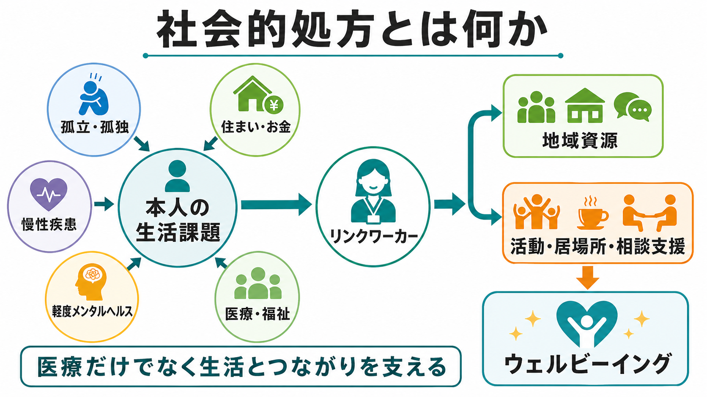

# 性機能や月経歴はなぜ精神科で重要なのか

## 要点

- 性機能や月経歴は「私生活への踏み込み」ではなく、[[精神科初診で何を確認するべきか|精神科初診]]で見落とされやすい薬剤副作用、気分変動、身体疾患、トラウマ、安全リスクを拾うための臨床情報である。
- 性的健康は身体、感情、精神、社会的 well-being に関わる領域であり、疾患や機能障害の有無だけに還元できない[1]。
- SSRI/SNRI、抗精神病薬、気分安定薬、ベンゾジアゼピンなどは性欲、興奮、オルガズム、勃起、潤滑、月経、乳汁分泌などに影響しうる。副作用を聞かないと、服薬中断や治療不信として現れることがある[2][3]。
- 月経周期、PMDD、既存のうつ病・双極性障害の月経前増悪は、気分症状の時期、反復性、治療反応を理解する手がかりになる[4][5]。
- 性的暴力、親密なパートナーからの暴力、避妊・妊娠可能性、性感染症、内分泌疾患などは、精神症状の背景にも治療選択にも関わる[6][7]。
- 聞き方の原則は、許可を得る、中立に聞く、答えない権利を明示する、必要な範囲だけ尋ねる、再トラウマ化を避けることである[6][8]。

## この記事で答える問い

1. 精神科で性機能や月経歴を確認する臨床的な理由は何か。
2. 薬剤副作用、気分症状、身体疾患、トラウマはどのようにつながるのか。
3. 患者を傷つけず、面接の安全性を保つために何に注意するべきか。

## まず結論

性機能や月経歴を精神科で確認する理由は、性的な詳細を知るためではない。現在の困りごとが、薬剤、ホルモン変動、身体疾患、対人関係、暴力被害、妊娠可能性、価値観、治療への期待とどのように結びついているかを理解するためである。

たとえば、抗うつ薬を始めたあとに性欲低下やオルガズム困難が起きても、患者が自分から言い出すとは限らない。月経前だけ希死念慮や怒りが強まる場合、単純な「性格の問題」ではなく、PMDDや既存の気分障害の月経前増悪として記録し直せるかもしれない。抗精神病薬の開始後に無月経や乳汁分泌が起きた場合、プロラクチン上昇や骨代謝リスクを考える必要がある[3]。また、性的な話題が強い不安や解離を引き起こす場合、トラウマインフォームドな聞き方自体が臨床的介入になる[6][8]。

したがって、この領域は[[生物心理社会モデルとは何か|生物心理社会モデル]]の実践そのものである。身体の情報だけでも、心理の情報だけでも、社会的文脈だけでも足りない。三者をつなげて、本人にとって意味のある支援計画に落とし込むことが重要である。

## 背景

精神科面接では、睡眠、食欲、気分、認知、物質使用、自殺リスクは比較的標準的に確認される。一方で、性機能や月経歴は「聞きにくい」「精神科の主訴と関係が薄い」「プライバシー侵害になりそう」と感じられ、後回しにされやすい。しかし、WHOは性的健康を、単なる疾患や機能障害の不在ではなく、身体的・感情的・精神的・社会的 well-being として位置づけている[1]。この定義に立つと、性機能の変化は生活の質、関係性、自己評価、服薬継続に関わる臨床情報である。

さらに、CDCの性的健康歴のガイドは、性的健康を全体的な健康像の一部として扱い、患者の性自認、関係、妊娠意図、性感染症リスクなどを、決めつけず個別化して確認することを勧めている[7]。精神科でも同じで、性機能や月経歴は「精神科ではなく産婦人科・泌尿器科の話」と切り離すより、必要時に連携するための入口として扱うほうがよい。

## 基本概念

### 性機能

性機能には、性欲、興奮、勃起、潤滑、オルガズム、射精、痛み、満足感、親密さ、性的活動への不安などが含まれる。精神科で重要なのは、性的活動の頻度そのものではなく、本人が困っている変化があるか、薬剤や症状の経過と時間的に一致するか、関係性や安全性に問題があるかである。

抗うつ薬関連の性機能障害は、患者から自然に報告されにくく、治療継続を妨げる要因になりうる[2]。抗精神病薬では、D2受容体遮断によるプロラクチン上昇が、性機能障害、月経不順、無月経、乳汁分泌、性腺機能低下、骨密度低下などと関係しうる[3]。したがって、性機能の確認は副作用評価であり、[[アドヒアランスとは何か|アドヒアランス]]を支える情報でもある。

### 月経歴

月経歴には、初経、周期、規則性、月経量、月経痛、PMS/PMDD様症状、月経前後の気分変化、妊娠可能性、避妊、産後、更年期移行期、婦人科疾患、ホルモン療法の有無が含まれる。

PMDDは、月経前に情動不安定、怒り、抑うつ、不安などが出現し、月経開始後に軽快するパターンを特徴とする。ACOGのガイドラインは、月経前症候群とPMDDについて、診断背景と治療選択を含めた管理指針を示している[4]。ただし、すべてをPMDDにまとめてはいけない。既存のうつ病、双極性障害、不安症、摂食症、境界性パーソナリティ症、精神病性障害などが月経周期に沿って悪化する「月経前増悪」もあり、前方視的な症状記録が鑑別に役立つ[5]。

## 仕組み

### 1. 薬剤副作用として現れる

SSRI/SNRIは、性欲低下、興奮困難、オルガズム遅延、勃起困難、潤滑困難などと関係しうる[2]。抗精神病薬は、プロラクチン上昇を介して性機能や月経に影響することがあり、リスペリドンなど一部の薬剤では特に注意が必要である[3]。気分安定薬や抗てんかん薬、ベンゾジアゼピン、抗コリン作用を持つ薬剤も、眠気、意欲低下、ホルモン変化、身体感覚の変化を通じて性機能に影響する場合がある。

ここで大切なのは、「副作用か、症状か、関係性の問題か」を一回で断定しないことである。うつ病そのものも性欲低下を起こす。トラウマや関係性の不安も性的回避につながる。身体疾患や疼痛も関わる。したがって、薬を始める前の状態、開始・増量・中止の時期、症状変化、本人の困り感を時系列で確認する。

### 2. 気分変動の時間構造を示す

月経周期は、気分症状の「周期性」を見る自然な時間軸になる。月経前だけ強い怒り、不安、抑うつ、過眠、過食、希死念慮が出るのか。月経開始後に軽快するのか。排卵期や月経中にも悪化するのか。双極性障害では、月経前だけでなく排卵期や月経期に抑うつ、軽躁、混合症状が変動する場合もある[5]。

更年期移行期も重要である。睡眠障害、ホットフラッシュ、性欲低下、身体症状、介護・仕事・家庭役割の変化が重なると、精神症状だけを切り出しても十分に理解できない。月経歴は、生殖年齢だけでなくライフコース上の身体変化を精神科評価に接続する入口になる。

### 3. トラウマと安全性に関わる

性的健康の話題は、性的暴力、親密なパートナーからの暴力、支配、強制、差別、羞恥と結びつきやすい。WHOの暴力被害者支援ガイドは、医療者が最初の専門的接点になることが多く、心理的支援、身体的健康、安全、継続支援を含めて対応する必要があると述べている[6]。SAMHSAのトラウマインフォームド・アプローチは、安全、信頼性、協働、エンパワメント、選択、文化・歴史・ジェンダーへの配慮を重視する[8]。

精神科面接では、詳細な被害内容を急いで聞くことが目的ではない。むしろ、本人が話せる範囲を尊重し、今の安全、身体的ケア、心理的安定、支援資源、危機対応を優先する。これは[[治療関係とは何か|治療関係]]を守るためにも重要である。

### 4. 身体疾患を見逃さないための入口になる

無月経、月経不順、性欲低下、性交痛、勃起困難、乳汁分泌、体重変化、多毛、にきび、疲労、冷え、動悸、発汗、疼痛は、精神症状と同時に身体疾患を示すことがある。甲状腺疾患、高プロラクチン血症、多嚢胞性卵巣症候群、子宮内膜症、慢性疼痛、糖尿病、神経疾患、薬剤性要因、妊娠・産後、更年期関連症状などは、[[器質性精神障害を見逃さないためには何を見るべきか|器質性・身体疾患の評価]]と接続する。

精神科医がすべてを診断する必要はない。しかし、どのサインなら内科、婦人科、泌尿器科、性暴力被害者支援、地域資源につなぐべきかを考える必要がある。

## 図解

面接での実際の流れは、次のように考えると整理しやすい。

| 段階 | 面接の焦点 | 例 |
|---|---|---|
| 許可を得る | 話題に入る前に選択権を示す | 「薬や気分に関係することがあるので、性機能や月経について少し確認してもよいですか」 |
| 中立に聞く | 決めつけず、性別・関係性を仮定しない | 「最近、性欲や満足感、痛み、困りごとに変化はありますか」 |
| 時系列を取る | 症状、薬、周期、ストレスを並べる | 「薬を始めた時期と、月経前後の変化を一緒に見てみましょう」 |
| 安全を確認する | 暴力、強制、妊娠可能性、緊急性を見る | 「望まない性行為や、断りにくい状況はありますか」 |
| 連携する | 必要時に専門科・支援資源へつなぐ | 婦人科、泌尿器科、内科、性暴力支援、心理支援 |

## 臨床・研究との接続

### 面接

面接では、性機能や月経歴を「必ず深掘りする項目」と考えるより、「関係がありそうなら安全に開ける扉」として扱う。初診の限られた時間では、全員に詳細な性生活を聞く必要はない。むしろ、次のような場合に優先度が上がる。

- 抗うつ薬、抗精神病薬、気分安定薬の開始・変更後に生活の質や服薬意欲が落ちている。
- 気分症状、衝動性、希死念慮、怒り、不安が月経前後で反復する。
- 無月経、月経不順、乳汁分泌、性交痛、勃起困難、性欲低下がある。
- 妊娠可能性、避妊、産後、更年期移行期が治療選択に関係する。
- 性的暴力、DV、支配、強制、解離、身体接触への恐怖が示唆される。
- 本人が性、関係性、身体感覚、ジェンダーに関する困りごとを主訴としている。

聞き方は、[[共感的理解とは何か|共感的理解]]と[[共同意思決定とは何か|共同意思決定]]に基づく。情報収集のために本人の安全感を犠牲にしてはいけない。

### 治療計画

性機能や月経歴の情報は、薬剤選択、用量調整、心理教育、記録方法、身体科連携、支援資源の導入に反映される。たとえば、抗うつ薬による性機能障害が強い場合は、自己判断で中止する前に、症状改善とのバランス、副作用の程度、代替薬、用量、併用、心理的要因を検討する[2]。抗精神病薬関連の月経不順や乳汁分泌がある場合は、プロラクチン、妊娠可能性、骨代謝、薬剤選択を含めて再評価する[3]。

月経前増悪が疑われる場合は、少なくとも数周期の症状記録が有用である。気分、睡眠、活動量、不安、衝動性、服薬、月経日、ストレスイベントを同じ表に置くと、PMDD、既存疾患の増悪、生活リズム、薬剤性要因を区別しやすくなる[4][5]。

### 研究

研究では、性機能や月経周期を「交絡」として排除するだけでなく、症状変動、治療反応、副作用、生活の質を説明する変数として扱う必要がある。特に、女性、トランスジェンダー、ノンバイナリー、性暴力被害者、慢性疾患を持つ人、文化的・宗教的背景により性の語り方が異なる人では、標準化尺度だけでは把握しにくい経験がある。研究設計では、プライバシー、同意、データ保護、再トラウマ化防止を組み込む必要がある。

## よくある誤解

### 「性の話は精神科の範囲外である」

誤りである。性的健康は身体、精神、関係性、権利、安全に関わる[1]。精神科で扱うのは性的な詳細そのものではなく、症状、治療、副作用、安全、生活の質との関係である。

### 「聞くと患者を傷つける」

聞き方によっては傷つける。しかし、聞かないことで副作用、暴力、身体疾患、妊娠可能性、月経前増悪が見逃されることもある。重要なのは、許可を得る、目的を説明する、答えない権利を明示する、必要な範囲に留めることである[6][8]。

### 「月経前に悪化するならPMDDである」

単純ではない。PMDDは月経前に限局し、月経開始後に軽快するパターンを重視する。一方、うつ病、双極性障害、不安症、摂食症、精神病性障害などの既存症状が月経周期に沿って悪化する月経前増悪もある[5]。診断名よりも、症状記録と経過の理解が先である。

### 「副作用なら薬をやめればよい」

自己判断の中止は再燃や離脱症状を招くことがある。副作用が疑われる場合も、症状改善、再発リスク、代替薬、用量、併用、身体疾患、関係性要因を含めて検討する。これは[[心理教育とは何か|心理教育]]と共同意思決定の課題である。

## 関連ノート

既存ノート:

- [[精神科初診で何を確認するべきか]]
- [[精神科面接とは何か]]
- [[生活歴はなぜ重要なのか]]
- [[生物心理社会モデルとは何か]]
- [[器質性精神障害を見逃さないためには何を見るべきか]]
- [[精神科診断における除外診断とは何か]]
- [[アドヒアランスとは何か]]
- [[共同意思決定とは何か]]
- [[治療関係とは何か]]
- [[自殺リスク評価では何を聞くべきか]]

MOC更新候補:

- `content/00_MOC/` 配下の精神医学、診断・面接、臨床実践、女性のメンタルヘルス、薬剤副作用関連MOCに、本記事 `[[性機能や月経歴はなぜ精神科で重要なのか]]` を追加する。

今後の作成候補:

- 「薬剤性性機能障害をどう評価するか」
- 「PMDDと月経前増悪はどう違うのか」
- 「抗精神病薬による高プロラクチン血症とは何か」
- 「トラウマインフォームドな精神科面接とは何か」
- 「更年期移行期の精神症状をどう評価するか」

## 理解チェック

1. 精神科で性機能を確認することが、服薬継続や治療関係に関わる理由は何か。
2. PMDDと既存の気分障害の月経前増悪を区別するために、どのような記録が役立つか。
3. 抗精神病薬開始後に無月経と乳汁分泌が出た場合、どのような機序と連携先を考えるか。
4. 性的暴力やDVが疑われる場合、詳細聴取より先に優先するべきことは何か。
5. 性機能や月経歴を聞くとき、患者の選択権を守るためにどのような前置きが使えるか。

## 参考文献

[1] World Health Organization. *Sexual health*. https://www.who.int/health-topics/sexual-health

[2] Montejo, A. L., Montejo, L., & Navarro-Cremades, F. (2019). Management Strategies for Antidepressant-Related Sexual Dysfunction: A Clinical Approach. *Journal of Clinical Medicine, 8*(10), 1640. https://doi.org/10.3390/jcm8101640

[3] Bostwick, J. R., Guthrie, S. K., & Ellingrod, V. L. (2018). Management of antipsychotic-induced hyperprolactinemia. *Mental Health Clinician, 8*(3), 99-103. https://doi.org/10.9740/mhc.2018.05.099

[4] American College of Obstetricians and Gynecologists. (2023). Management of Premenstrual Disorders: ACOG Clinical Practice Guideline No. 7. *Obstetrics & Gynecology, 142*(6), 1516-1533. https://doi.org/10.1097/AOG.0000000000005426

[5] Handy, A. B., Greenfield, S. F., Yonkers, K. A., & Payne, L. A. (2022). Psychiatric Symptoms Across the Menstrual Cycle in Adult Women: A Comprehensive Review. *Harvard Review of Psychiatry, 30*(2), 100-117. https://doi.org/10.1097/HRP.0000000000000329

[6] World Health Organization. (2013). *Responding to intimate partner violence and sexual violence against women: WHO clinical and policy guidelines*. https://www.who.int/publications/i/item/9789241548595

[7] Centers for Disease Control and Prevention. (2024). *Guide to Taking a Sexual History*. https://www.cdc.gov/sti/hcp/clinical-guidance/taking-a-sexual-history.html

[8] Substance Abuse and Mental Health Services Administration. (2014). *SAMHSA's Concept of Trauma and Guidance for a Trauma-Informed Approach*. https://library.samhsa.gov/product/samhsas-concept-trauma-and-guidance-trauma-informed-approach/sma14-4884

## 未解決問題

- 月経前増悪を日常診療で短時間に評価するための、実装しやすい記録フォーマットはどの程度標準化できるか。
- 性機能副作用を患者が自発的に話しやすくする説明文や問診項目は、文化・年齢・ジェンダーによってどう調整すべきか。
- トラウマ歴、性機能、月経周期、薬剤副作用を同時に扱うとき、過剰な病理化と見逃しのバランスをどう取るか。
