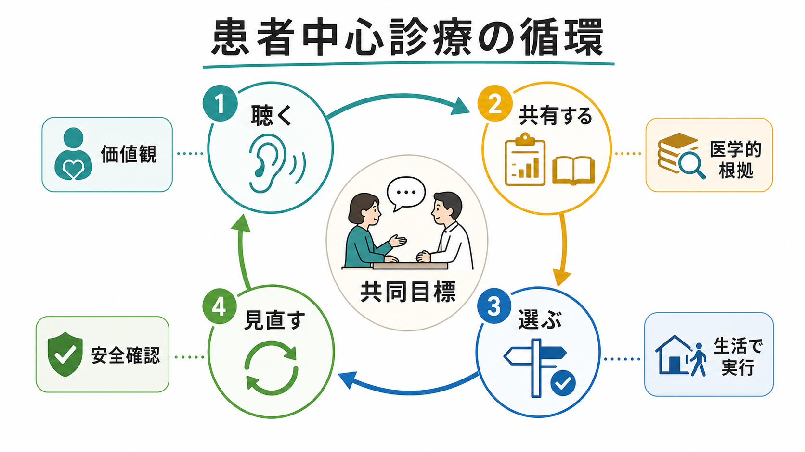
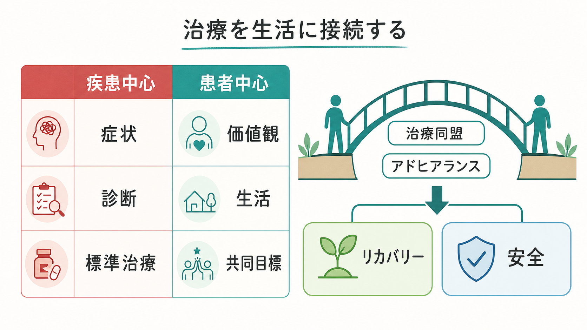

# 患者中心の精神科診療とは何か

> このノートは教育・研究目的の整理であり、個別の診断や治療方針を指示するものではない。

## 要点

- 患者中心の精神科診療とは、診断名や症状だけで治療方針を決めず、本人の価値観、生活背景、文化、目標、支援資源、リスクを診療の中心情報として扱う実践である[1][2]。
- 「患者の希望をそのまま採用する」ことではない。医学的根拠、臨床判断、安全配慮、本人の経験を統合し、合意可能な治療目標を作る姿勢である[3][4]。
- 精神科では、症状、病識、強制性、スティグマ、家族関係、生活機能が意思決定に影響しやすいため、[[共同意思決定とは何か]]、[[治療関係とは何か]]、[[インフォームドコンセントは精神科でどう行うのか]]と密接につながる[5][6]。
- リカバリー志向の実践では、症状軽減だけでなく、本人にとって意味のある生活、役割、関係、自己決定を重視する[7][8]。

## この記事で答える問い

1. 患者中心の精神科診療は、単なる「優しい対応」と何が違うのか。
2. 価値観・生活背景・目標は、診断や薬物療法とどのように統合されるのか。
3. 精神科で患者中心性を実践するとき、どのような限界や注意点があるのか。

## まず結論

患者中心の精神科診療は、「患者に合わせて医学を弱める」ことではなく、「医学的判断を本人の人生に接続する」ことである。精神科診療では、同じ診断名でも、困っている場面、薬への不安、通院可能性、家族との関係、仕事や学校で守りたい役割、過去の医療体験が大きく異なる。したがって、治療方針は診断名だけからは決まらない。

実践の核は、本人の語りを聴き、医学的根拠と選択肢を共有し、実行可能な方針を一緒に選び、経過に応じて見直す循環である[3][4]。この循環があると、[[精神科治療計画はどのように立てるのか|治療計画]]は「専門家が作った指示」ではなく、本人が生活の中で試せる共同作業になる。

## 背景

医療の質を論じた Institute of Medicine の報告書は、患者中心性を、患者の好み、ニーズ、価値観を尊重し、それらが臨床判断を導くようにすることとして整理した[1]。これは精神科に限らない医療全体の原則だが、精神科では特に重要である。精神症状は、本人の主観的苦痛、対人関係、生活機能、意味づけ、社会的環境と切り離しにくいからである。

WHO の people-centred health services は、個人、家族、コミュニティを単なるサービス利用者ではなく、健康とケアの共同主体として位置づける[2]。精神科に置き換えると、診療室内の症状評価だけでなく、住まい、仕事、学校、家族、文化、経済的制約、支援制度との接続が診療の一部になる。

## 基本概念

### 患者中心性

患者中心性は、少なくとも三つの層で考えると分かりやすい。

| 層 | 問うこと | 精神科での例 |
|---|---|---|
| 経験 | 本人は何に困っているか | 不眠、焦燥、幻聴そのものだけでなく、仕事に行けない、家族と衝突する、薬が怖い |
| 価値 | 本人は何を大切にしているか | 症状をゼロにするより眠気を避けたい、入院より子育て継続を重視したい |
| 実行可能性 | 生活の中で何が続けられるか | 通院頻度、費用、副作用、支援者、服薬時間、危機時の連絡先 |

この考え方は、[[生物心理社会モデルとは何か]]と相性がよい。生物学的要因、心理的要因、社会的要因を並べるだけでなく、本人にとって何が意味を持つのかを聞き直すことで、[[ケースフォーミュレーションとは何か|ケースフォーミュレーション]]が治療に使える形になる。

### 共同意思決定

患者中心性を診療手続きに落とす代表的な方法が、共同意思決定である。NICE の shared decision making ガイドラインは、選択肢、利益と害、不確実性、本人の価値観を話し合うことを重視する[4]。精神科では、薬物療法、心理療法、入院、復職、家族同席、危機時対応など、多くの場面で選択肢が一つに決まらない。だからこそ、本人が「何を避けたいか」「何なら試せるか」を明確にする必要がある。

ただし、共同意思決定は「何でも本人に任せる」ことではない。自殺リスク、他害リスク、せん妄、重度の判断能力低下、虐待やDVなど、安全上の配慮が優先される場面もある。その場合でも、本人への説明、参加の最大化、尊厳の保持、後からの振り返りは患者中心性の一部である[3][4]。

## 仕組み

患者中心の診療は、次のような臨床サイクルとして働く。

1. **聴く**: 主訴、現病歴、生活歴だけでなく、本人の言葉、恐れ、期待、過去の治療経験を聞く。これは[[精神科面接とは何か]]や[[傾聴とは何か]]の基盤である。
2. **共有する**: 診断仮説、リスク、治療選択肢、予測される利益と害を、本人が理解できる形で説明する。
3. **選ぶ**: 医学的に妥当な選択肢の中で、本人の価値観と生活上の実行可能性に合う方針を選ぶ。
4. **見直す**: 症状、生活機能、副作用、本人の納得感、危機の兆候を確認し、必要なら方針を調整する。

この循環が機能すると、[[アドヒアランスとは何か|アドヒアランス]]は「指示を守るかどうか」ではなく、「本人が納得し、続けられる治療を一緒に設計できているか」という問題として見える。治療関係が良いほど治療継続や服薬行動と結びつくことも示されており、患者中心性は単なる態度ではなく、治療の実行条件でもある[6]。

## 図解

1枚目は、患者中心診療を「聴く、共有する、選ぶ、見直す」という循環として示している。中心にあるのは共同目標であり、価値観、医学的根拠、生活での実行可能性、安全確認が周囲を支える。

2枚目は、疾患中心の見方と患者中心の見方の違いを示している。疾患中心の視点は不要ではない。症状、診断、標準治療は診療の土台である。しかし、それだけでは本人の生活に治療が接続しない。患者中心性は、疾患中心の情報を否定するのではなく、価値観、生活、共同目標に接続する。

3枚目は、患者中心性が崩れやすい場面を示している。臨床家が救済したくなる、リスクを避けたくなる、怒りや焦りで急ぐ、境界がゆるむ、といった反応は珍しくない。[[逆転移とは何か]]や[[精神科面接で境界設定はなぜ必要なのか|境界設定]]を意識し、記録、相談、振り返り、調整を行うことが、本人の尊厳と安全を守る。

## 臨床・研究との接続

臨床では、患者中心性は次の場面で特に重要になる。

| 場面 | 患者中心にするための問い |
|---|---|
| 初診 | 本人は何を一番困っている問題として持ち込んでいるか |
| 診断説明 | 診断名は本人の経験を説明する助けになっているか、それともラベルとして働いていないか |
| 薬物療法 | 効果、副作用、服薬負担、妊娠・性機能・仕事への影響を話せているか |
| 心理療法 | 本人の目標、ペース、文化的背景、トラウマ体験に配慮できているか |
| 入院・危機対応 | 安全確保と本人の参加をどこまで両立できるか |
| 地域支援 | 医療目標が、住まい、就労、家族、福祉制度と接続しているか |

研究面では、共有意思決定支援や患者中心的介入の効果は、知識、意思決定への参加感、満足度、治療継続などで評価されることが多い[5][6]。一方で、精神科急性期、強制入院、重い精神病症状、認知機能障害がある場面では、どの程度同じ方法を適用できるかは慎重に考える必要がある。ここで大切なのは、「患者中心性が難しい場面では不要になる」のではなく、「参加を最大化する条件をどう作るか」という問いに変えることである。

## よくある誤解

### 患者中心とは、患者の希望をすべて通すことか

違う。患者中心性は、本人の希望を聞かずに治療を決めないという原則であり、医学的に不適切な方針や危険な方針をそのまま採用することではない。臨床家は、利益、害、代替案、不確実性を説明し、安全を守る責任を持つ[3][4]。

### 診断や標準治療を軽視することか

違う。患者中心性は、診断、重症度、リスク評価、標準治療を本人の生活に接続するための枠組みである。[[鑑別診断とは何か]]や[[自殺リスク評価では何を聞くべきか|自殺リスク評価]]を丁寧に行うことは、患者中心性と矛盾しない。

### 時間がある外来でしかできないことか

短時間でもできる要素はある。「今日一番相談したいことは何ですか」「この選択肢で一番心配な点は何ですか」「生活の中で続けられそうですか」「次回までに何を見直しましょうか」といった問いは、診療の向きを変える。長い面接技法ではなく、情報の優先順位を本人と合わせる作業である。

## 関連ノート

- [[精神科面接とは何か]]
- [[治療関係とは何か]]
- [[共同意思決定とは何か]]
- [[インフォームドコンセントは精神科でどう行うのか]]
- [[意思決定能力とは何か]]
- [[アドヒアランスとは何か]]
- [[コンコーダンスとは何か]]
- [[精神医学における回復とは何か]]
- [[ケースフォーミュレーションとは何か]]
- [[地域連携は精神科診療で何を意味するのか]]

## MOC更新候補

- `content/00_MOC/MOC｜臨床実践・治療.md` に、治療関係・共同意思決定・リカバリー志向支援の関連ノートとして追加する候補。
- 精神医学総論または精神科面接に関するMOCが統合更新される場合、本記事を「総論・診断・面接」配下の患者中心性・共同意思決定関連として追加する候補。

## 理解チェック

1. 患者中心の精神科診療が、単なる「患者の希望どおり」と異なる理由を説明できるか。
2. 「聴く、共有する、選ぶ、見直す」の循環を、薬物療法または心理療法の場面に当てはめられるか。
3. 急性期やリスク対応の場面でも、本人の参加を最大化する方法を一つ挙げられるか。

## 未解決問題

- 精神科急性期や強制性を伴う場面で、患者中心性をどの指標で評価するのが適切か。
- 共同意思決定支援ツールが、症状改善、生活機能、入院期間、再発予防にどの程度独立した効果を持つか。
- 文化、家族関係、経済的制約、デジタル格差が、患者中心性の実装にどのように影響するか。

## 参考文献

[1] Institute of Medicine. (2001). *Crossing the Quality Chasm: A New Health System for the 21st Century*. National Academies Press. https://www.ncbi.nlm.nih.gov/books/NBK222274/

[2] World Health Organization. (2016). *Framework on integrated, people-centred health services*. https://apps.who.int/gb/ebwha/pdf_files/WHA69/A69_39-en.pdf

[3] National Institute for Health and Care Excellence. (2012). *Patient experience in adult NHS services: improving the experience of care for people using adult NHS services (CG138)*. https://www.nice.org.uk/guidance/cg138

[4] National Institute for Health and Care Excellence. (2021). *Shared decision making (NG197)*. https://www.nice.org.uk/guidance/ng197

[5] Stovell, D., Morrison, A. P., Panayiotou, M., & Hutton, P. (2016). Shared treatment decision-making and empowerment-related outcomes in psychosis: systematic review and meta-analysis. *The British Journal of Psychiatry, 209*(1), 23-28. https://doi.org/10.1192/bjp.bp.114.158931

[6] Thompson, L., McCabe, R. (2012). The effect of clinician-patient alliance and communication on treatment adherence in mental health care: a systematic review. *BMC Psychiatry, 12*, 87. https://doi.org/10.1186/1471-244X-12-87

[7] Substance Abuse and Mental Health Services Administration. (2012). *SAMHSA's Working Definition of Recovery*. https://store.samhsa.gov/product/samhsas-working-definition-recovery/pep12-recdef

[8] Boardman, J., & Dave, S. (2020). Person-centred care and psychiatry: some key perspectives. *BJPsych International, 17*(3), 65-68. https://doi.org/10.1192/bji.2020.21
