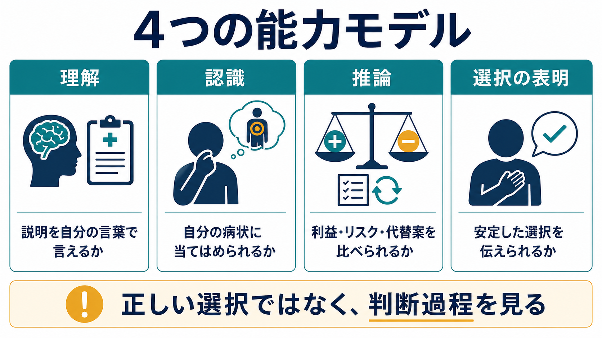

# 意思決定能力とは何か

## 要点

- 意思決定能力とは、ある治療や検査について、本人が「理解・認識・推論・表明」を用いて自分で決められる状態にあるかを評価する臨床的な枠組みである[1][2]。
- 能力は人に固定された属性ではなく、決定の内容、リスク、複雑さ、説明方法、時点によって変わる。低リスクで単純な選択はできても、高リスクで複雑な選択では支援や再評価が必要になることがある[3]。
- 不合理に見える選択、治療拒否、精神疾患の診断、認知症の診断だけで「能力がない」とは判断しない。評価するのは結論の好ましさではなく、本人が決定に至る過程である[1][4]。
- 評価の目的は本人を排除することではなく、説明・環境・時間・支援者を調整して、本人ができるだけ自分で決められる条件を整えることである[5][6]。

## この記事で答える問い

1. 意思決定能力は、インフォームド・コンセントや共同意思決定とどう関係するのか。
2. 「理解・認識・推論・表明」とは、それぞれ何を見ているのか。
3. 精神科面接では、どのように評価し、どのような誤解を避けるべきか。
4. 能力が十分でない可能性があるとき、臨床では何を支援し、何を記録するべきか。

## まず結論

意思決定能力は、「その人が一般に賢いか」「医師の提案に同意するか」を見る概念ではない。評価対象は、目の前の具体的な治療選択について、本人が必要な情報を理解し、その情報を自分の病状や生活に当てはめ、選択肢の利益・不利益を比べ、自分の選択を一貫して伝えられるかである[1][2]。

したがって、意思決定能力は[[精神科面接とは何か|精神科面接]]、[[心理教育とは何か|心理教育]]、[[治療関係とは何か|治療関係]]と切り離せない。説明が難しすぎる、痛みや不安が強い、せん妄や薬剤影響がある、家族や医療者の圧力が強い、といった条件では、本来保たれている能力が発揮されにくくなる。臨床的には、本人の能力を「判定して終わり」にするのではなく、理解を助け、認識を支え、推論の材料を整理し、表明しやすい場を作ることが重要である[5][6]。

## 背景

医療では、本人が十分な説明を受け、自分の価値観に照らして治療を選ぶことが基本である。AMAの倫理指針も、医師は患者が関連情報と治療選択肢の意味を理解し、独立した自発的決定を行えるかを評価し、診断、治療の目的、リスク、利益、治療しない選択を含む情報を提示し、記録する必要があると述べている[4]。

しかし、現実の臨床では、すべての人が同じ条件で意思決定できるわけではない。[[病識とは何か|病識]]の揺らぎ、せん妄、認知症、重いうつ状態、精神病症状、強い疼痛、疲労、薬剤の影響、言語・文化的背景、家族関係、医療不信などが意思決定に影響する。ここで必要になるのが、本人を尊重しながら、治療同意に必要な機能が保たれているかを具体的に見る枠組みである。

Appelbaum と Grisso は、治療同意能力を評価する際に、理解、認識、推論、選択の表明という機能的基準を重視した[1]。その後、MacCAT-T などの半構造化面接は、これらの能力を臨床場面で整理して評価する道具として用いられてきた[2]。ただし、こうした道具は判断の代替ではない。最終的には、決定の内容、リスク、本人の説明、周囲の支援、臨床状況を統合して判断する必要がある[3]。

## 基本概念

### 理解

理解とは、病状、提案されている治療、代替案、治療しない場合、主な利益と不利益を、自分の言葉で説明できることである[1][3]。同意書を読めることや、医師の言葉をそのまま繰り返せることだけでは十分でない。たとえば「この薬は何のために使うと説明されましたか」「期待される効果と、気をつける副作用は何ですか」と尋ねると、単なる復唱ではなく、本人の理解の仕方が見えやすい。

### 認識

認識とは、理解した情報を自分の状況に当てはめられることである。たとえば、「一般には入院治療が必要なことがある」と理解していても、「自分には病気もリスクもまったく関係ない」と確信している場合、認識が障害されている可能性がある[3]。精神科では[[病識とは何か|病識]]と重なる部分があるが、同一ではない。診断名を受け入れるかよりも、本人が現在の困りごと、危険、治療の意味をどの程度自分の問題として扱えているかを見る。

### 推論

推論とは、選択肢を比べ、理由を述べ、利益・不利益・生活への影響を秤にかける力である[1][2]。推論が保たれている人は、医療者と異なる結論に至ることがある。重要なのは、結論が医療者にとって望ましいかではなく、本人が自分の価値観や状況に照らして、ある程度一貫した理由を示せるかである。

### 表明

表明とは、選択を伝えられることである[1][2]。発語だけに限らず、筆談、補助具、通訳、支援者を介した表現も含まれる。表明で問題になるのは、単に「はい」「いいえ」が言えるかだけではない。強い混乱や揺れがあり、短時間で選択が何度も大きく変わる場合には、その時点で有効な選択として扱えるかを慎重に見る。

## 仕組み

意思決定能力評価は、次のような順序で考えると整理しやすい。

1. 決定を特定する。  
   「治療するかどうか」では広すぎる。たとえば「今日から抗精神病薬を開始するか」「入院治療に同意するか」「ECTを受けるか」のように、対象となる選択を具体化する。

2. 必要情報を本人に合わせて説明する。  
   病状、選択肢、利益、不利益、代替案、治療しない選択を、本人の理解度や文化的背景に合わせて説明する[4][5]。

3. 理解・認識・推論・表明を確認する。  
   それぞれを質問で確認し、本人の言葉を記録する。MacCAT-T は、この4領域を柔軟だが構造化された形で評価するために開発された[2]。

4. 支援して再確認する。  
   疲労、疼痛、不安、眠気、せん妄、薬剤影響、聞こえにくさ、家族の圧力などを調整し、説明の言い換え、視覚資料、時間を置いた再面接、支援者同席を試す[5][6]。

5. 判断と根拠を記録する。  
   「能力あり／なし」だけでなく、どの決定について、何を説明し、本人がどう理解・認識・推論・表明したか、どの支援を行ったかを記録する[4]。

## 図解

図1は、意思決定能力を4つの機能から見た概念地図である。理解は情報を受け取る力、認識は情報を自分の状況へ結びつける力、推論は選択肢を比較する力、表明は選択を伝える力を示す。どれか1つだけで十分というより、治療選択の性質に応じて4つが組み合わさる。

図2は、評価が一方向のテストではなく、説明と支援を含む循環過程であることを示している。本人の回答が不十分に見えたとき、すぐに「能力なし」と結論するのではなく、情報提供の仕方や環境を調整して再確認する。

図3は、臨床での使い分けを示す。能力が保たれていれば本人の選択を尊重する。支援により回復しうる場合は、説明、時間、環境、支援者を調整する。どうしてもその決定について能力が不足する場合は、本人の価値観や事前の意思をできるだけ反映した代理判断・最善利益判断へ移る[5][6]。

## 臨床・研究との接続

### 精神科面接での接続

精神科では、本人の語り、症状、認知機能、生活史、家族関係、リスク評価を同時に扱う。そのため意思決定能力評価は、[[精神科初診で何を確認するべきか|初診での確認]]や[[現病歴はどのように構造化するべきか|現病歴の整理]]と連続している。特に、急性精神病状態、躁状態、重症うつ、せん妄、認知症、物質使用、器質性疾患が疑われる場面では、[[器質性精神障害を見逃さないためには何を見るべきか|器質性精神障害の見落とし]]にも注意する。

ただし、精神疾患があることは、意思決定能力がないことを意味しない。MacCAT-T の研究でも、精神疾患をもつ群の一部は成績が低い一方で、多くの患者が比較対象群と同程度に課題を遂行していた[2]。診断名ではなく、具体的な決定に対する機能を見ることが重要である。

### 支援としての評価

評価は、本人の選択権を制限するためだけに行うものではない。NICE の意思決定とメンタルキャパシティに関するガイドラインは、本人が能力をもつ場合には自分で決められるよう支援し、能力が不足する場合にも本人を意思決定過程の中心に置くことを求めている[5]。日本の厚生労働省による認知症の人の意思決定支援ガイドラインも、本人の意思表出を支え、周囲が本人の意思に基づく生活を支えることを重視している[6]。

臨床では、説明を短く区切る、紙に書く、図を使う、家族や支援者を同席させる、通訳を用いる、痛みや不眠を調整する、せん妄の改善を待つ、別の時間帯に再面接する、といった支援が能力の発揮を助けることがある。これは[[支持的面接とは何か|支持的面接]]や[[心理教育とは何か|心理教育]]の実践ともつながる。

### 研究での接続

研究では、意思決定能力は構造化面接や尺度を通じて測定されることがある。MacCAT-T は治療選択に合わせて情報を調整しながら、理解、認識、推論、表明を評価する代表的な道具である[2][3]。Aid to Capacity Evaluation の研究も、臨床家による具体的な能力評価を標準化された認知検査だけで置き換えるのではなく、治療選択そのものに即して評価する必要を示している[8]。ただし、尺度はあくまで評価を助ける補助線であり、法的判断や臨床判断を自動的に置き換えるものではない[3]。

近年は、標準的な4能力モデルが価値観や感情を十分に捉えられるかも議論されている。2025年の生命倫理学の論文は、理解・認識・推論・表明に加えて「価値づける能力」をどう扱うかを検討している[7]。この議論は、本人の選択が医療者や家族から見て奇妙に見えるとき、その選択を安易に病理化しないためにも重要である。

## よくある誤解

### 誤解1: 治療を拒否する人は意思決定能力がない

治療拒否だけでは能力なしとは言えない。本人が病状、利益、不利益、代替案を理解し、自分の価値観に照らして理由を述べられるなら、医療者にとって望ましくない結論でも尊重されうる[1][4]。ただし、拒否の背景に妄想、せん妄、重度の抑うつ、誤情報、圧力、説明不足がある場合は、そこを評価する。

### 誤解2: 認知症や精神疾患があれば能力がない

診断名はリスクを示すが、結論ではない。認知症の人でも日常生活上の選択や単純な医療選択は可能なことがある。逆に診断がなくても、せん妄、薬剤影響、低酸素、強い痛みなどで一時的に能力が低下することがある。能力は「人」ではなく「決定」と「時点」に結びつけて見る[3][5]。

### 誤解3: 能力評価は法的な判定である

臨床家が行うのは、目の前の治療同意に関する臨床的評価である。法的な能力や後見等の判断とは重なるが同一ではない[3]。そのため、臨床記録では、法的結論のように断定するよりも、評価した決定、説明内容、本人の応答、支援、再評価の必要性を具体的に残す。

### 誤解4: 正しく説明すれば能力は必ず回復する

支援は重要だが、すべてを解決するわけではない。重いせん妄、進行した認知症、急性精神病状態、重度の意識障害などでは、どれだけ説明してもその時点で十分な能力が回復しないことがある。その場合も、本人の過去の価値観、事前指示、家族等の情報を用いて、本人中心の代理判断に近づけることが課題になる[5][6]。

## 関連ノート

既存ノート:

- [[精神科面接とは何か]]
- [[精神科初診で何を確認するべきか]]
- [[病識とは何か]]
- [[心理教育とは何か]]
- [[治療関係とは何か]]
- [[支持的面接とは何か]]
- [[疾病受容とは何か]]
- [[器質性精神障害を見逃さないためには何を見るべきか]]

今後の作成候補:

- インフォームド・コンセントとは何か
- 共同意思決定とは何か
- 代理意思決定とは何か
- 事前指示とは何か
- せん妄と意思決定能力
- 認知症における意思決定支援

MOC更新候補: `content/00_MOC/` 配下の精神医学、精神科面接、医療倫理、意思決定支援関連MOC。並列ジョブとの競合を避けるため、本記事ではMOC本体は更新しない。

## 理解チェック

1. 意思決定能力の4要素を、自分の言葉で説明できるか。
2. 「医師の勧めを拒否している」だけで能力なしと判断できない理由は何か。
3. 低リスクの選択では能力があるが、高リスクの選択では不十分という状況はなぜ起こるか。
4. 評価前に、説明方法、痛み、不安、せん妄、通訳、支援者同席などを調整する理由は何か。
5. 記録には「能力なし」以外に、どのような具体情報を残すべきか。

## 未解決問題

- 価値観や感情の障害を、本人の自律を侵害せずにどのように評価するか。
- 文化的背景、家族中心の意思決定、医療不信を、能力不足と混同しない評価法をどう整えるか。
- 忙しい急性期医療の中で、支援して再評価する時間と体制をどう確保するか。
- AIやデジタル説明ツールを、本人の理解を助ける補助としてどこまで安全に使えるか。

## 参考文献

[1] Appelbaum, P. S., & Grisso, T. (1988). Assessing patients' capacities to consent to treatment. *New England Journal of Medicine, 319*(25), 1635-1638. https://doi.org/10.1056/NEJM198812223192504

[2] Grisso, T., Appelbaum, P. S., & Hill-Fotouhi, C. (1997). The MacCAT-T: A clinical tool to assess patients' capacities to make treatment decisions. *Psychiatric Services, 48*(11), 1415-1419. https://doi.org/10.1176/ps.48.11.1415

[3] Palmer, B. W., & Harmell, A. L. (2016). Assessment of healthcare decision-making capacity. *Archives of Clinical Neuropsychology, 31*(6), 530-540. https://doi.org/10.1093/arclin/acw051

[4] American Medical Association. (n.d.). Informed Consent, Code of Medical Ethics Opinion 2.1.1. https://code-medical-ethics.ama-assn.org/ethics-opinions/informed-consent

[5] National Institute for Health and Care Excellence. (2018). *Decision-making and mental capacity: NICE guideline NG108*. https://www.nice.org.uk/guidance/NG108

[6] 厚生労働省. (2025). 『認知症の人の日常生活・社会生活における意思決定支援ガイドライン（第2版）』. https://www.mhlw.go.jp/stf/seisakunitsuite/bunya/0000212395.html

[7] Harcarik, L., Kim, S. Y. H., & Millum, J. (2025). The ability to value: An additional criterion for decision-making capacity. *Bioethics, 39*(3), 288-295. https://doi.org/10.1111/bioe.13387

[8] Etchells, E., Darzins, P., Silberfeld, M., Singer, P. A., McKenny, J., Naglie, G., Katz, M., Guyatt, G. H., Molloy, D. W., & Strang, D. (1999). Assessment of patient capacity to consent to treatment. *Journal of General Internal Medicine, 14*(1), 27-34. https://doi.org/10.1046/j.1525-1497.1999.00277.x
