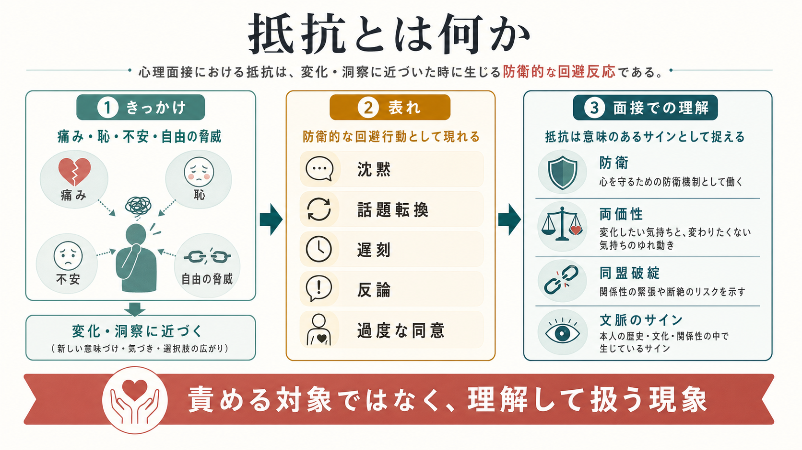
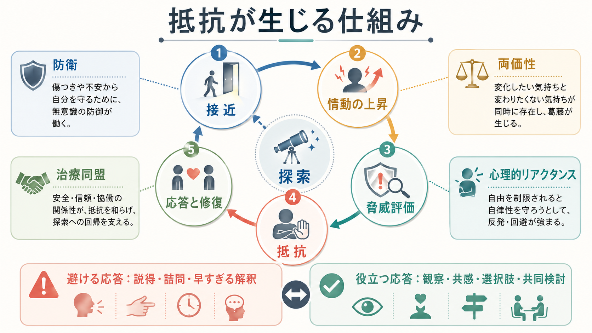
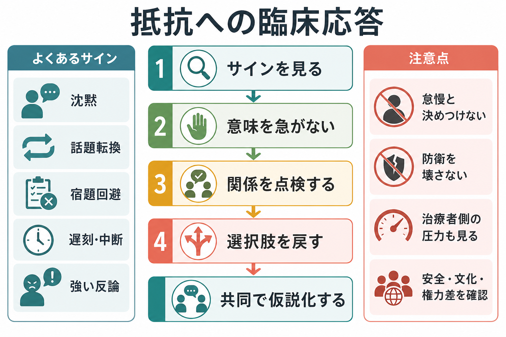

# 抵抗とは何か

## 要点

- 抵抗とは、変化・洞察・感情への接近が不安、恥、喪失感、自由の脅威を高めるときに生じる、意識的または無意識的な回避反応である。
- 精神分析では、抵抗は抑圧された内容を思い出すことへの妨げとして扱われ、単なる反抗ではなく防衛と転移の中で理解されてきた [1][2]。
- 現代の面接では、抵抗を「患者が悪い」「やる気がない」と決めつけず、両価性、治療同盟の破綻、治療者側の圧力、文化・安全・権力差のサインとして読む [3][4][5]。
- 抵抗への基本応答は、説得や詰問ではなく、観察、共感、反映、選択肢の回復、関係の点検、共同仮説化である。

## この記事で答える問い

この記事では、[[精神科面接とは何か]]を前提に、面接中に見える沈黙、話題転換、遅刻、宿題回避、強い反論、過度な同意を「抵抗」と呼ぶとき、何を見ているのかを整理する。教育・研究目的の解説であり、個別の診断や治療指示ではない。

## まず結論

抵抗は、変化を拒む「性格」ではなく、変化に近づいたときに心身と関係が出す保護反応である。患者は変わりたい一方で、変わることで失うもの、見たくない感情、関係が壊れる不安、自分で決める自由を奪われる感覚にも反応する。したがって、抵抗を見つけたときの問いは「どう壊すか」ではなく、「何を守っているのか」「どの関係上の緊張が起きているのか」「どの程度なら一緒に扱えるのか」である。

## 背景

抵抗という語は、精神分析の技法論で中心的に扱われた。Freud は、患者が忘れているものを単に思い出すのではなく、現在の関係や行動の中で反復すること、そしてそれを時間をかけて作業することを重視した [1]。また、後の理論では抵抗は自我、イド、超自我など複数の方向から生じ、抑圧、転移、疾病利得などと結びつくと整理された [2]。

ただし、現代の臨床で抵抗を使うときには注意がいる。この言葉は、治療者が患者を非協力的とラベルづけするために使われやすい。防衛機制は不快な感情や葛藤から心を守る無意識的過程として理解できるが、それを「未熟」「頑固」と道徳化すると、[[治療関係とは何か]]で扱う協働性が損なわれる [3]。

## 基本概念

### 抵抗は何に対する抵抗か

抵抗は、治療者そのものへの反抗とは限らない。多くの場合、抵抗している対象は次のいずれかである。

| 抵抗の対象 | 面接上の見え方 | 背後にある可能性 |
|---|---|---|
| 感情への接近 | 笑ってごまかす、急に眠くなる、話が薄くなる | 恥、不安、悲しみ、怒りへの接近が強すぎる |
| 洞察 | 「頭では分かります」と言うが具体化しない | 分かることで生活や関係を変えざるを得なくなる |
| 変化 | 宿題回避、予定変更、治療中断 | 変わりたい気持ちと変わりたくない気持ちが並存する |
| 関係 | 批判、遅刻、沈黙、過度な同意 | 治療同盟の緊張、見捨てられ不安、支配される感覚 |
| 自律性 | 助言に反発する、逆の行動をする | 自由を脅かされたと感じた心理的リアクタンス |

### 抵抗と防衛

抵抗はしばしば防衛として現れる。防衛は、心が解決しきれない葛藤に対して一時的な妥協を作る働きであり、通常は無意識的に生じる [3]。否認、合理化、投影、知性化、反動形成などは、面接で「急に話が遠くなる」「相手のせいに固定される」「感情抜きに説明だけが増える」といった形で見える。

重要なのは、防衛が悪いものではないという点である。防衛は苦痛から人を守ってきた仕組みでもある。治療者が早すぎる解釈で防衛を壊そうとすると、患者は侵入された、恥をかかされた、危険にさらされたと感じやすい。

### 抵抗と両価性

変化には両価性がある。動機づけ面接では、変化に向かう発話だけでなく、現状維持を支持する発話や治療関係上の不協和を重要な情報として扱う [6][7]。たとえば「薬を減らしたい。でも減らすと壊れそうで怖い」という語りは、抵抗ではなく、変化に必要な情報である。

この観点では、抵抗を説得で押し切るほど、患者は現状維持の理由をより強く語ることがある。面接者は「変わるべき理由」を足すよりも、本人の価値、恐れ、選択肢を一緒に言葉にする。

## 仕組み

抵抗は、面接の中で次の循環として理解できる。

1. 患者と治療者が、重要だが痛みを伴うテーマに近づく。
2. 不安、恥、怒り、悲しみ、喪失感が高まる。
3. 心は「このまま進むと危ない」と評価する。
4. 沈黙、冗談、反論、話題転換、遅刻、過度な同意などが出る。
5. 治療者が詰問・説得・早すぎる解釈をすると、抵抗は強まる。
6. 治療者が観察し、関係を点検し、選択肢を返すと、探索に戻れることがある。

治療同盟研究では、同盟の破綻は、目標への不一致、課題への不一致、情緒的な結びつきの緊張として現れる。Safran らは、破綻を避けるべき失敗だけでなく、修復を通じて治療過程を深める場面として扱った [4]。さらに、破綻修復のメタ分析は、破綻修復過程と治療結果との関連を示している [5]。

## 図解

抵抗を扱う臨床的な順序は、固定的な手順ではないが、次のように考えると見落としが減る。

| 段階 | 面接者の問い | 応答例 |
|---|---|---|
| サインを見る | 何が変わったか | 「この話題に入ったところで、少し言葉が止まったように見えました」 |
| 意味を急がない | 複数の仮説はあるか | 「不安、疲れ、話しにくさ、どれもあり得そうです」 |
| 関係を点検する | こちらの進め方が強すぎないか | 「私の聞き方が急だったかもしれません」 |
| 選択肢を戻す | 本人が選べる形か | 「今ここを続けるか、少し戻るか、どちらがよさそうですか」 |
| 共同で仮説化する | 何を守っているのか | 「この避けたくなる感じは、何から守ってくれているのでしょう」 |

## 臨床・研究との接続

### 精神科面接

精神科面接では、抵抗は診断情報の不足としてだけでなく、生活史、トラウマ、羞恥、家族関係、医療不信、文化的背景、権力差の情報として読む。[[沈黙は精神科面接でどう扱うべきか]]で扱う沈黙も、拒否、整理、感情の高まり、安全確認、治療者への不信など複数の意味を持つ。

### 心理療法

心理療法では、抵抗は技法選択の情報になる。精神力動的には防衛や転移として、認知行動療法では課題回避、自己一貫性、リスク回避、治療者側の応答との相互作用として、動機づけ面接では両価性や不協和として扱える [6][8]。どの学派でも、患者を責めるより、治療者の応答を調整する発想が重要である。

### 面接技法

抵抗に出会ったときは、[[傾聴とは何か]]、[[共感的理解とは何か]]、[[反映とは何か]]、[[支持的面接とは何か]]が基礎になる。特に、反映は「あなたは抵抗しています」と名づけるよりも、「進みたい気持ちと、進むと危ない感じの両方があるようです」と、両面を保つ形で使うとよい。

## よくある誤解

### 抵抗は患者のやる気のなさである

やる気の問題として見える場面もあるが、それだけでは不十分である。抵抗は、恐れ、恥、過去の対人経験、治療者との関係、治療目標の不一致、環境的制約からも生じる。

### 抵抗は治療者が打ち破るべき壁である

抵抗を壊すという発想は、患者の防衛を急に奪う危険がある。抵抗はまず観察し、意味を仮説化し、扱える強さに調整する対象である。

### 抵抗を解釈すれば洞察が進む

解釈が有効な場合もあるが、早すぎる解釈は同盟破綻を強める。解釈の前に、患者がその話題を扱う準備、治療関係の安全性、選択肢、タイミングを確認する必要がある。

### 同意している患者には抵抗がない

過度な同意も抵抗の一形態になり得る。治療者を失望させないため、怒りを隠すため、主導権を渡して責任を避けるために同意が増えることがある。表面的な協力性だけで判断しない。

## 関連ノート

### 既存ノート

- [[精神科面接とは何か]]
- [[治療関係とは何か]]
- [[沈黙は精神科面接でどう扱うべきか]]
- [[傾聴とは何か]]
- [[共感的理解とは何か]]
- [[反映とは何か]]
- [[支持的面接とは何か]]
- [[主訴はどのように聞くべきか]]
- [[生物心理社会モデルとは何か]]

### 今後の作成候補

- 転移とは何か
- 逆転移とは何か
- 防衛機制とは何か
- 動機づけ面接とは何か
- 治療同盟の破綻と修復とは何か
- 心理的リアクタンスとは何か

### MOC更新候補

- `content/00_MOC/` 配下の精神医学・精神科面接・心理療法系MOCに、本記事へのリンクを追加する。
- 並列生成ジョブとの競合を避けるため、このタスクではMOC本体は更新しない。

## 理解チェック

1. 抵抗を「患者の非協力性」とだけ見ると、どのような臨床上の見落としが起きるか。
2. 抵抗、防衛、両価性、治療同盟の破綻は、どのように重なり、どのように区別できるか。
3. 沈黙や話題転換が起きたとき、面接者がすぐに意味づけせず観察すべき手がかりは何か。
4. 説得や詰問が抵抗を強めることがあるのはなぜか。
5. 抵抗を扱うとき、患者に選択肢を返すことにはどのような意味があるか。

## 参考文献

[1] Freud, S. (1958). Remembering, repeating and working-through (Further recommendations on the technique of psycho-analysis II). In J. Strachey (Ed. & Trans.), *The Standard Edition of the Complete Psychological Works of Sigmund Freud, Volume XII* (pp. 145-156). Hogarth Press. Original work published 1914. https://www.encyclopedia.com/psychology/dictionaries-thesauruses-pictures-and-press-releases/remembering-repeating-and-working-through

[2] Freud, S. (1926). *Inhibitions, symptoms and anxiety*. In J. Strachey (Ed. & Trans.), *The Standard Edition of the Complete Psychological Works of Sigmund Freud*. Hogarth Press. https://www.ncbi.nlm.nih.gov/nlmcatalog/7805010

[3] Encyclopaedia Britannica. (2026). Defense mechanism. *Britannica*. https://www.britannica.com/topic/defense-mechanism

[4] Safran, J. D., Muran, J. C., & Eubanks-Carter, C. (2011). Repairing alliance ruptures. *Psychotherapy, 48*(1), 80-87. https://doi.org/10.1037/a0022140

[5] Eubanks, C. F., Muran, J. C., & Safran, J. D. (2018). Alliance rupture repair: A meta-analysis. *Psychotherapy, 55*(4), 508-519. https://doi.org/10.1037/pst0000185

[6] Miller, W. R., & Rollnick, S. (2023). *Motivational Interviewing: Helping People Change and Grow* (4th ed.). Guilford Press. https://www.guilford.com/books/Motivational-Interviewing/Miller-Rollnick/9781462552795

[7] Hettema, J., Steele, J., & Miller, W. R. (2005). Motivational interviewing. *Annual Review of Clinical Psychology, 1*, 91-111. https://doi.org/10.1146/annurev.clinpsy.1.102803.143833

[8] Leahy, R. L. (2001). *Overcoming Resistance in Cognitive Therapy*. Guilford Press. https://www.guilford.com/books/Overcoming-Resistance-in-Cognitive-Therapy/Robert-Leahy/9781572309364
