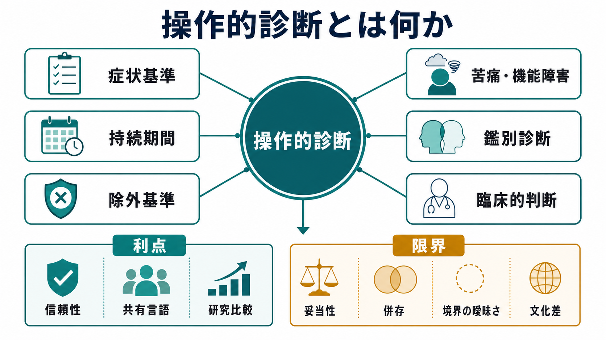
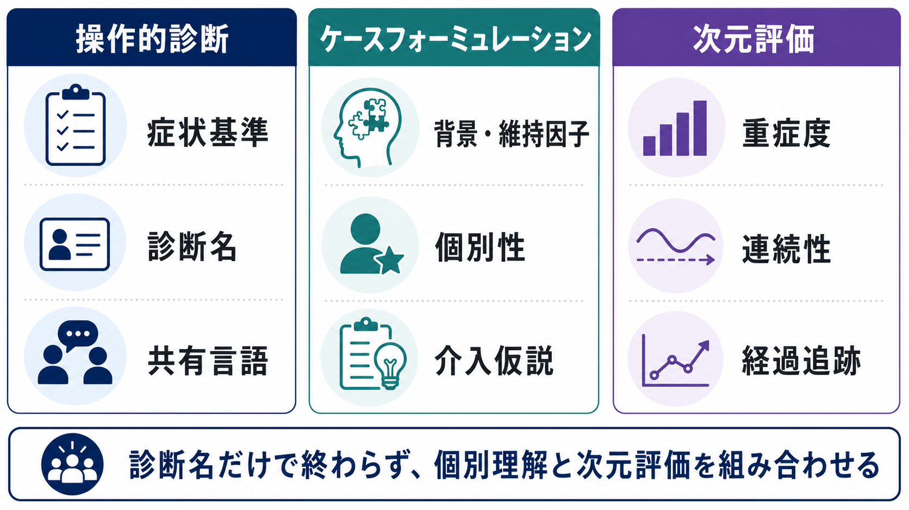

# 操作的診断とは何か

## 要点

- 操作的診断とは、症状、持続期間、重症度、除外条件、苦痛や機能障害などを明示した基準に照らして診断を行う方法である。
- DSMやICDは、臨床家どうしが同じ言葉で症例を記述し、研究対象をそろえ、保険・統計・行政で診断名を扱えるようにするための分類体系である[1][2]。
- 最大の利点は、診断の[[評価者間信頼性とは何か|評価者間信頼性]]を高め、臨床・研究・教育の共通言語を作る点にある[3][4]。
- 限界は、診断名が病因や機序を直接示すとは限らず、併存、境界の曖昧さ、文化差、個別の生活史を十分に表せない点である[6][7]。
- 実践では、操作的診断を入口にしつつ、[[生物心理社会モデルとは何か|生物心理社会モデル]]、ケースフォーミュレーション、重症度や機能の次元評価を組み合わせる必要がある。

## この記事で答える問い

この記事では、次の問いに答える。

1. 操作的診断は、従来の精神医学的診断と何が違うのか。
2. DSMやICDは、なぜ症状基準を細かく定めるのか。
3. 操作的診断は、臨床と研究にどのような利点をもたらしたのか。
4. 操作的診断だけでは、なぜ患者理解として不十分になりうるのか。

## まず結論

操作的診断は、「熟練者の直感」や「学派ごとの概念」だけに依存せず、観察可能な症状と明示された条件に基づいて診断を行うための方法である。たとえば、抑うつ気分、興味・喜びの低下、睡眠、食欲、思考、希死念慮、持続期間、機能障害、他の身体疾患や物質の影響の除外といった条件を確認し、一定の組み合わせを満たすかどうかを判断する。

この方法は、精神医学に大きな利益をもたらした。診断名の使い方が標準化され、臨床家間のずれが減り、研究で「同じ診断名の参加者」を比較しやすくなった。Research Diagnostic Criteria（RDC）やDSM-III期の研究は、明示的な基準を用いることで、それ以前より診断一致度を改善できることを示した[3][4]。

しかし、操作的診断は「診断名が病気の本質を完全に言い当てる」方法ではない。精神疾患の多くでは、単一の病因、明確な生物学的マーカー、自然な境界線がまだ確立していない。したがって、操作的診断は有用な作業仮説であって、患者の苦痛、意味づけ、生活史、発達、身体疾患、環境、文化、回復資源を置き換えるものではない[5][6][7]。

## 背景

精神医学の診断は、長いあいだ学派、施設、国、臨床家の経験に左右されやすかった。同じ患者を診ても、診断名が大きく異なることがあり、これは治療、予後研究、疫学研究、薬物療法研究を難しくした。診断が人によって変わるなら、「この治療はうつ病に有効か」「この疾患は家族集積性を持つか」といった問いに答えにくい。

この問題に対して、1970年代にはRobinsとGuzeによる診断妥当性の考え方、Feighner基準、RDCなどが現れた。特にRDCは、研究で使える明示的な診断基準を整備し、当時の診断手続きの信頼性の低さを改善する試みだった[3][5]。DSM-IIIはこの流れを受け、精神疾患分類をより操作的・記述的な体系へ大きく転換した。

ここで重要なのは、操作的診断が「精神疾患の原因を発見した」から生まれたのではない点である。むしろ、原因や病態機序が十分に確定していないからこそ、まずは観察可能な症状、経過、機能障害、除外条件をそろえ、臨床と研究の共通の土台を作ろうとしたのである。

## 基本概念

### 操作的定義

操作的定義とは、ある概念を「どのように観察し、測定し、判断するか」によって定義する方法である。精神医学では、「うつ」「不安」「幻覚」「強迫」などの概念を、面接で確認できる訴え、観察できる行動、持続期間、生活機能への影響、除外すべき状態として定める。

この発想は、[[信頼性とは何か|信頼性]]を上げるために有効である。診断名の背景理論が完全に一致していなくても、「この症状がこの期間続き、この程度の機能障害があり、この条件を除外する」という手順を共有すれば、異なる評価者が近い判断に到達しやすい。

### 信頼性と妥当性

操作的診断を理解するには、[[妥当性とは何か|妥当性]]と信頼性を分ける必要がある。信頼性は、同じ対象を評価したときに結果がどれだけ一致するかである。妥当性は、その診断が本当に意味のある疾患単位、病態、予後、治療反応を捉えているかである。

操作的基準は、主に信頼性を改善する。だが、信頼性が高いことは、ただちに[[構成概念妥当性とは何か|構成概念妥当性]]が高いことを意味しない。KendellとJablenskyは、精神医学的診断では「妥当性」と「臨床的有用性」を区別する必要があり、多くの診断カテゴリーは自然な境界で分かれた実体としては十分に確立していない一方、予後、治療、サービス利用のための作業概念としては高い有用性を持つと論じた[6]。

### カテゴリと次元

DSMやICDの多くの診断はカテゴリ診断である。つまり、ある基準を満たせば診断あり、満たさなければ診断なし、と扱う。これは臨床上わかりやすく、研究や統計にも使いやすい。

一方で、精神症状の多くは連続量である。抑うつ、不安、注意困難、衝動性、睡眠障害、対人過敏性は、正常から重度まで連続的に分布する。したがって、どこに境界を置くかという[[カットオフ値はどのように決めるのか|カットオフ]]の問題が生じる。境界は臨床的に必要だが、自然界に明確な線があるとは限らない[7]。

## 仕組み

操作的診断は、単なるチェックリストではない。実際には、次のような段階で働く。

1. 面接・観察・情報収集によって、本人の訴え、行動、生活機能、経過、リスク、身体疾患、薬物・物質使用、発達歴、家族歴を把握する。
2. 症状を、診断基準で扱える形に記述する。
3. 症状数、持続期間、苦痛や機能障害、年齢、除外条件を基準に照合する。
4. 他の精神疾患、身体疾患、薬剤、物質、文化的背景、通常の反応との鑑別を行う。
5. 診断名を暫定的な作業仮説として置き、治療計画、リスク評価、支援資源の調整に接続する。
6. 経過観察で情報が増えたら、診断仮説を見直す。

この流れで特に重要なのは、診断名が「結論」ではなく「次の臨床判断への入口」である点である。たとえば同じ診断名でも、発症年齢、併存症、身体疾患、生活環境、家族関係、社会的孤立、トラウマ、薬物使用、本人の価値観によって、必要な支援は大きく変わる。

## 図解

操作的診断の位置づけは、次のように整理できる。

| 観点 | 操作的診断で扱いやすいこと | 操作的診断だけでは不足しやすいこと |
|---|---|---|
| 診断名 | 症状基準に基づく分類、研究対象の定義、統計・制度上の記録 | 病因、意味づけ、個別の経過、本人にとっての困りごと |
| 信頼性 | 評価者間の一致、診断手続きの標準化 | 面接の質、情報源の偏り、文化的表現の違い |
| 妥当性 | 予後や治療反応をある程度まとめる作業概念 | 自然な疾患境界、生物学的マーカー、単一原因の説明 |
| 臨床応用 | 治療方針の入口、リスク評価、サービス接続 | ケースフォーミュレーション、共同意思決定、生活支援 |
| 研究応用 | 参加者の選定、群比較、疫学研究 | 診断横断的機序、次元的変化、個人差のモデル化 |

## 臨床・研究との接続

### 臨床での接続

臨床では、操作的診断は安全で一貫した評価の基盤になる。診断基準があることで、重要な症状を聞き漏らしにくくなり、リスク評価、身体疾患の除外、薬剤や物質の影響の確認が構造化される。DSM-5-TRの解説資料も、DSMの枠組みがより正確で一貫した診断と、疾患間の関係の研究に資することを目的としていると説明している[1]。またDSM-5の実地試験では、日常臨床での使いやすさや有用性も評価対象とされ、診断体系は研究だけでなく臨床運用の道具として検討されている[8]。

ただし、臨床では診断基準に合うかどうかだけで終わらせない。本人が何に困っているのか、どの環境で悪化するのか、どの資源が回復を支えるのか、どの治療選択肢を本人が受け入れられるのかを整理する必要がある。操作的診断は、治療計画を作るための入口であって、治療計画そのものではない。

### 研究での接続

研究では、操作的診断は対象者を定義するための基盤である。基準がなければ、ある研究の「うつ病」と別の研究の「うつ病」が同じ集団を指しているか分からない。RDCやDSM-IIIの信頼性研究は、明示的基準によって研究診断の再現性を高めるという方向性を示した[3][4]。

一方で、近年の研究では診断カテゴリーだけでなく、診断横断的な次元や神経・行動システムを扱う枠組みも重視される。[[RDoCは精神疾患研究をどう変えたのか|RDoC]]は、DSMやICDに代わる日常臨床用分類ではなく、行動、神経回路、遺伝、環境などを横断して精神病理を理解しようとする研究枠組みである[7]。

### ICDとの接続

ICD-11 CDDRは、世界の臨床現場で精神・行動・神経発達症を正確かつ信頼性高く同定するために作られた診断マニュアルであり、文化差、ライフスパン、次元的な考え方も取り入れている[2]。これは、操作的診断が単なる固定的チェックリストではなく、国際比較、臨床有用性、文化的適用可能性を含む実用体系として発展していることを示している。

## よくある誤解

### 誤解1: 操作的診断は機械的なチェックリストである

違う。基準への照合は重要だが、実際の診断には面接、観察、鑑別、経過、本人と周囲からの情報、臨床的判断が必要である。基準を満たすかどうかの判断自体にも、症状の意味、程度、持続、文化的背景を読む力が求められる。

### 誤解2: DSMやICDの診断名は病気の原因を示している

多くの場合、そうではない。診断名は症候群、経過、機能障害、除外条件に基づく分類であり、病因を直接示すとは限らない。診断名を病因の説明として実体化すると、本人の生活史や環境、併存、身体疾患を見落としやすくなる[6][7]。

### 誤解3: 信頼性が高ければ妥当性も高い

信頼性は必要条件に近いが、十分条件ではない。複数の臨床家が同じ診断名に一致しても、その診断が自然な疾患単位を表しているとは限らない。精神医学では、信頼性、臨床的有用性、妥当性を分けて考える必要がある[5][6]。

### 誤解4: 操作的診断は個別理解と対立する

対立しない。操作的診断は、共通言語を与える。ケースフォーミュレーションや次元評価は、その共通言語を本人の文脈に戻す。診断名、重症度、機能、生活史、価値観、支援資源を組み合わせて初めて、臨床的に使える理解になる。

## 関連ノート

既存ノート:

- [[評価者間信頼性とは何か]]
- [[信頼性とは何か]]
- [[妥当性とは何か]]
- [[構成概念妥当性とは何か]]
- [[カットオフ値はどのように決めるのか]]
- [[RDoCは精神疾患研究をどう変えたのか]]
- [[生物心理社会モデルとは何か]]

今後の作成候補:

- DSMとICDは何が違うのか
- カテゴリ診断と次元診断は何が違うのか
- 鑑別診断とは何か
- ケースフォーミュレーションとは何か
- 構造化面接とは何か
- 診断妥当性とは何か

MOC更新候補:

- `content/00_MOC/` 配下の精神医学、診断・面接、心理測定、研究方法関連MOCに追加候補。
- 並列ジョブとの衝突回避のため、このタスクではMOC本体は更新しない。

## 理解チェック

1. 操作的診断が「信頼性」を高めやすい理由は何か。
2. 操作的診断における「除外基準」は、なぜ重要なのか。
3. 信頼性と妥当性はどのように違うのか。
4. 診断名だけでは、なぜ治療計画として不十分なのか。
5. RDoCのような診断横断的研究枠組みは、操作的診断のどの限界に対応しようとしているのか。

## 参考文献

[1] American Psychiatric Association. (2022). *The Organization of DSM-5-TR*. https://www.psychiatry.org/getmedia/0191c8c8-4151-4bde-9cba-263db78a2734/APA-DSM5TR-TheOrganizationofDSM.pdf

[2] World Health Organization. (2024). *Clinical descriptions and diagnostic requirements for ICD-11 mental, behavioural and neurodevelopmental disorders*. https://www.who.int/publications/i/item/9789240077263

[3] Spitzer, R. L., Endicott, J., & Robins, E. (1978). Research Diagnostic Criteria: Rationale and reliability. *Archives of General Psychiatry, 35*(6), 773-782. https://doi.org/10.1001/archpsyc.1978.01770300115013

[4] Spitzer, R. L., Forman, J. B. W., & Nee, J. (1979). DSM-III field trials: I. Initial interrater diagnostic reliability. *American Journal of Psychiatry, 136*(6), 815-817. https://doi.org/10.1176/ajp.136.6.815

[5] Robins, E., & Guze, S. B. (1970). Establishment of diagnostic validity in psychiatric illness: Its application to schizophrenia. *American Journal of Psychiatry, 126*(7), 983-987. https://doi.org/10.1176/ajp.126.7.983

[6] Kendell, R., & Jablensky, A. (2003). Distinguishing between the validity and utility of psychiatric diagnoses. *American Journal of Psychiatry, 160*(1), 4-12. https://doi.org/10.1176/appi.ajp.160.1.4

[7] Clark, L. A., Cuthbert, B., Lewis-Fernández, R., Narrow, W. E., & Reed, G. M. (2017). Three approaches to understanding and classifying mental disorder: ICD-11, DSM-5, and the National Institute of Mental Health's Research Domain Criteria (RDoC). *Psychological Science in the Public Interest, 18*(2), 72-145. https://doi.org/10.1177/1529100617727266

[8] Mościcki, E. K., Clarke, D. E., Kuramoto, S. J., Kraemer, H. C., Narrow, W. E., Kupfer, D. J., & Regier, D. A. (2013). Testing DSM-5 in routine clinical practice settings: Feasibility and clinical utility. *Psychiatric Services, 64*(10), 952-960. https://doi.org/10.1176/appi.ps.201300098
