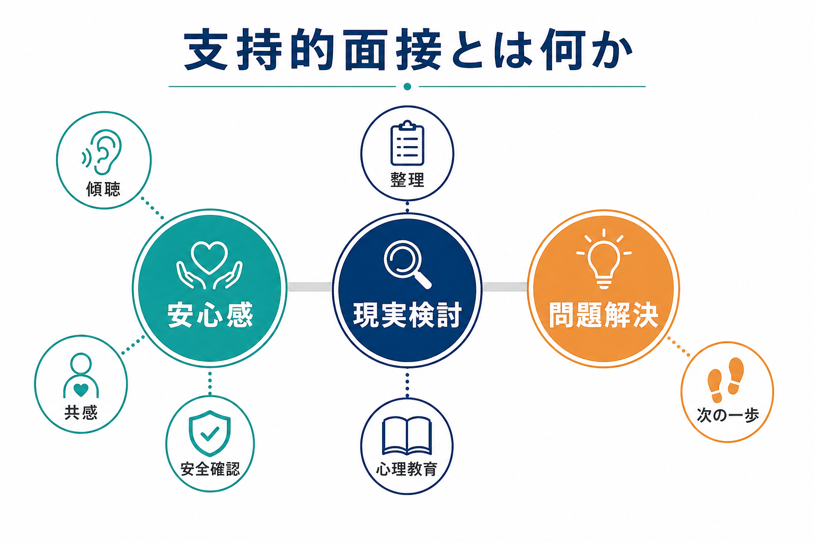
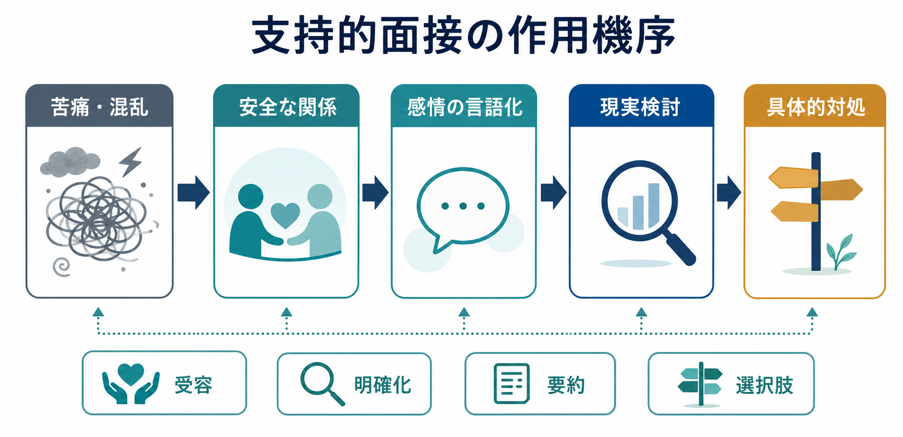
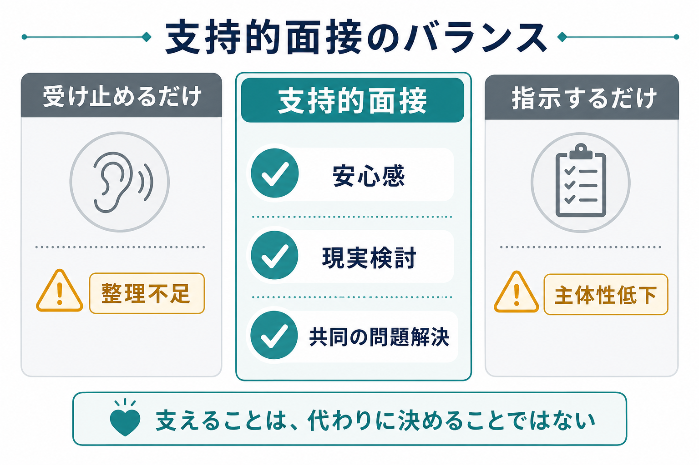

# 支持的面接とは何か

## 要点

- 支持的面接とは、患者の苦痛を軽く扱う面接ではなく、安心して話せる関係を作り、現実検討を助け、当面の問題解決に向けて共同作業を行う精神科面接の基本技法である。
- 中核は「安心感」「現実検討」「問題解決」の三つである。傾聴や共感だけで終わらず、必要に応じて明確化、要約、心理教育、安全確認、次の一歩の設定を行う。
- 支持的面接は、特定の診断にだけ使う特殊技法ではない。[[精神科面接とは何か]]、[[共感的理解とは何か]]、[[治療関係とは何か]]の基盤に近い。
- ただし「支持」は「何でも肯定する」「助言だけする」「本人の代わりに決める」ことではない。本人の主体性と安全を保ちながら、いま使える現実的な足場を作る。

## この記事で答える問い

1. 支持的面接とは、通常の傾聴や助言と何が違うのか。
2. 支持的面接は、どのように安心感・現実検討・問題解決を支えるのか。
3. 臨床や研究では、支持的面接をどのように位置づければよいのか。
4. 支持的面接で起こりやすい誤解は何か。

## まず結論

支持的面接は、「患者を励ます面接」ではなく、「患者が圧倒されずに自分の状況を見直せるように支える面接」である。精神科臨床では、患者はしばしば不安、抑うつ、混乱、孤立、身体症状、対人葛藤、生活上の危機を抱えて受診する。そのとき、いきなり診断名や解決策を提示しても、本人が受け取れる状態でなければ治療にはつながらない。

支持的面接では、まず安全で非審判的な場を作り、患者の語りを整理する。次に、感情と事実、推測と確認できる情報、変えられることと変えにくいことを分ける。最後に、本人と面接者が共同で「今日からできる小さな行動」や「次回までに確認すること」を決める。Winston らの支持的精神療法の整理でも、治療同盟の形成、問題の理解と定式化、現実的目標の設定、実用的介入が重要な柱として扱われている[1]。

## 背景

支持的精神療法は、精神分析や認知行動療法のような明確な学派名に比べると、しばしば「非特異的」「ただの傾聴」と誤解されてきた。しかし臨床現場では、支持的な面接要素はほぼすべての精神科診療に含まれる。Markowitz は、支持的精神療法が広く用いられているにもかかわらず定義が曖昧で軽視されてきた一方、短期支持的精神療法のようにマニュアル化された形では研究にも耐える介入として扱えると論じている[2]。

また、うつ病に対する非指示的支持療法のメタ分析では、待機リストや通常ケアに比べて有効性が示された一方、他の特定心理療法との差は研究者の理論的立場などの影響も受けることが示唆された[3]。これは「支持的面接だけで十分」という意味ではない。むしろ、支持的要素は治療の共通基盤であり、診断、薬物療法、心理療法、福祉的支援、危機対応を患者に届く形にするための土台だと考えるとよい。

## 基本概念

### 安心感

安心感とは、「何を話しても何も起こらない」という無制限の保証ではない。支持的面接における安心感は、面接者が守秘、限界、安全確認、診療の目的を明確にし、患者が過度に恥や恐怖を感じずに語れる状態を作ることである。NICE の成人メンタルヘルスサービス利用者経験ガイドラインでも、尊重、共感、非審判的態度、十分な説明、本人の参加が重視されている[4]。

安心感を作る発言は、単に「大丈夫です」と言うことではない。たとえば「いま話すのが難しい部分は、無理に細かく話さなくてもかまいません。ただ、安全に関わることだけは一緒に確認したいです」のように、患者のペースと臨床上必要な確認を両立させる。

### 現実検討

現実検討とは、患者の感じ方を否定することではなく、苦痛の中で混ざりやすい要素を分けることである。支持的面接では、「事実として確認できること」「本人が強く感じていること」「まだ分からないこと」「いま決めなくてよいこと」を整理する。

たとえば「もう全部終わりです」という訴えに対して、すぐに「そんなことはありません」と返すと、患者は理解されていないと感じやすい。支持的には、「終わったと感じるほど追い詰められているのですね。いま実際に起きていることを一つずつ分けて見てもよいですか」と返す。感情を受け止めたうえで、現実の輪郭を一緒に見る。

### 問題解決

問題解決は、面接者が正解を与えることではない。支持的面接では、患者の生活状況、資源、疲弊度、リスクを踏まえ、「いま実行できる最小単位」に落とす。問題解決療法の研究領域では、問題の明確化、達成可能な目標設定、選択肢の生成、実行と振り返りが重要な要素として扱われる[5]。支持的面接でも同じ発想を使うが、より広く、日常診療の中で短く柔軟に用いる。

ここで大切なのは、患者の主体性を奪わないことである。「こうしてください」と命令するより、「候補としては、今夜の安全確保、職場への連絡、家族に伝えること、薬の飲み方の確認があります。どれから一緒に整理しましょうか」と共同作業にする。

## 仕組み

支持的面接は、次のような流れで働く。

1. 苦痛や混乱が言葉になる。  
   患者が「何がつらいのか」を話せると、体験は少し外在化される。面接者は傾聴、反映、要約を使い、曖昧な苦痛を共有可能な言葉にする。

2. 関係の中で孤立が弱まる。  
   治療同盟の研究では、目標、課題、情緒的結びつきが心理療法の成果と関連することが繰り返し示されている[6]。支持的面接は、この同盟を短い診療場面でも作ろうとする。

3. 現実検討が可能になる。  
   安心感があると、防衛的に否認したり、逆に破局的に考えたりする必要が少し下がる。すると、事実、感情、推測、リスク、資源を分けて検討しやすくなる。

4. 次の一歩が決まる。  
   問題がすべて解決しなくても、「今日すること」「次回までに観察すること」「危険が高まったときの連絡先」が決まると、患者は圧倒感から少し距離を取れる。

## 図解

支持的面接は、受け止めるだけでも、指示するだけでもない。中心には、本人が安全に考え直せる関係と、現実に沿った共同作業がある。

| 面接の偏り | 起こりやすい問題 | 支持的面接での調整 |
|---|---|---|
| 受け止めるだけ | 話はできるが、整理や次の行動につながりにくい | 要約、焦点化、優先順位づけを入れる |
| 指示するだけ | 患者の主体性が下がり、抵抗や依存が生じやすい | 選択肢を共有し、本人の価値や制約を確認する |
| 解釈しすぎる | 患者が評価・分析されていると感じる | まず現在の苦痛と安全を扱う |
| 励ましすぎる | 患者の絶望や怒りが見えなくなる | 感情の妥当性を確認してから希望を扱う |

## 臨床・研究との接続

### 精神科初診

[[精神科初診で何を確認するべきか]]では、主訴、現病歴、既往歴、生活歴、家族歴、精神状態、リスク評価を確認する必要がある。しかし、これらを尋問のように聞くと、患者は話しにくくなる。支持的面接は、必要な評価を患者に届く形にする。たとえば「安全確認として伺います」と前置きして自殺念慮を尋ねることは、支持と評価を両立させる。

### 治療関係

支持的面接は、[[治療関係とは何か]]の実践的な入口である。Bordin の作業同盟モデルでは、目標への合意、課題への合意、情緒的結びつきが治療同盟の要素として整理された[7]。支持的面接では、短い診療でも「何を目標にするか」「今日何を扱うか」「この関係が安全に使えるか」を確認する。

### 共感的理解

[[共感的理解とは何か]]は支持的面接の中心にある。ただし、共感は同意ではない。医療コミュニケーションのメタ分析では、共感的・肯定的なコミュニケーションが痛み、不安、満足度などに小さいながら有益な影響をもつ可能性が示されている[8]。支持的面接では、共感を「雰囲気」ではなく、反映、明確化、要約、確認という観察可能な行動にする。

### 他の治療との関係

支持的面接は、薬物療法、認知行動療法、対人関係療法、家族支援、ケースマネジメントと競合しない。むしろ、それらを患者が使える形にする基盤である。たとえば薬物療法では、副作用への不安や服薬抵抗を話せる関係が必要である。心理療法では、課題や宿題を実行する前に、患者が治療者と共同作業できる感覚が必要である。

## よくある誤解

### 誤解1: 支持的面接は、ただ優しく聞くだけである

優しく聞くことは重要だが、それだけでは支持的面接にならない。支持的面接では、患者の語りを整理し、現実検討を助け、安全を確認し、次の行動を共同で決める。傾聴は入口であり、全体ではない。

### 誤解2: 支持とは、患者の考えをすべて肯定することである

支持は肯定と同じではない。被害的確信、強い自己否定、希死念慮、物質使用、治療中断などがある場合、面接者は感情を受け止めつつ、危険や事実誤認には臨床的に関わる必要がある。「そう感じるほどつらい」と「その結論が事実である」は分けて扱う。

### 誤解3: 支持的面接は専門性が低い

支持的面接には、境界設定、リスク評価、共感、要約、心理教育、共同意思決定、危機介入、治療同盟の修復が含まれる。むしろ、どの技法を使い、どこで踏み込みすぎず、どこで安全確認を優先するかを判断する専門性が必要である。

### 誤解4: 支持的面接は問題解決を先延ばしにする

支持的面接は問題解決を避けない。ただし、患者が混乱している場面でいきなり解決策を提示すると、実行可能性が下がる。まず苦痛を言葉にし、現実を整理し、本人が選べる形にしてから行動へ移る。

## 関連ノート

既存ノート:

- [[精神科面接とは何か]]
- [[共感的理解とは何か]]
- [[治療関係とは何か]]
- [[精神科初診で何を確認するべきか]]
- [[現病歴はどのように構造化するべきか]]
- [[生活歴はなぜ重要なのか]]
- [[生物心理社会モデルとは何か]]
- [[精神医学におけるレジリエンスとは何か]]
- [[モチベーション面接は行動変容をどう支えるのか]]
- [[要約は面接でなぜ重要なのか]]

今後の作成候補:

- 支持的精神療法と認知行動療法は何が違うのか
- 精神科面接で安全確認をどう行うか
- 心理教育とは何か
- 共同意思決定とは何か
- 危機介入とは何か

MOC更新候補:

- `content/00_MOC/` 配下の精神医学、面接、心理療法、臨床実践関連 MOC
- 並列ジョブとの競合を避けるため、本タスクでは MOC 本体は更新しない。

## 理解チェック

1. 支持的面接における「安心感」は、単なる楽観的な励ましとどう違うか。
2. 患者の「もう全部終わりです」という発言に対して、感情の受け止めと現実検討をどう両立できるか。
3. 「受け止めるだけ」と「指示するだけ」は、それぞれどのようなリスクをもつか。
4. 治療同盟の目標・課題・情緒的結びつきは、支持的面接の中でどのように現れるか。
5. 支持的面接が薬物療法や心理療法の基盤になるのはなぜか。

## 参考文献

[1] Winston, A., Rosenthal, R. N., & Pinsker, H. (2004). *Introduction to Supportive Psychotherapy*. American Psychiatric Publishing. https://books.google.com/books/about/Introduction_to_Supportive_Psychotherapy.html?id=nSlsAAAAMAAJ

[2] Markowitz, J. C. (2014). What is supportive psychotherapy? *Focus, 12*(3), 285-289. https://doi.org/10.1176/appi.focus.12.3.285

[3] Cuijpers, P., Driessen, E., Hollon, S. D., van Oppen, P., Barth, J., & Andersson, G. (2012). The efficacy of non-directive supportive therapy for adult depression: A meta-analysis. *Clinical Psychology Review, 32*(4), 280-291. https://www.ncbi.nlm.nih.gov/books/NBK98484/

[4] National Institute for Health and Care Excellence. (2011). *Service user experience in adult mental health: improving the experience of care for people using adult NHS mental health services* (CG136). https://www.nice.org.uk/guidance/cg136/chapter/Recommendations

[5] Bell, A. C., & D'Zurilla, T. J. (2009). Problem-solving therapy for depression: A meta-analysis. *Clinical Psychology Review, 29*(4), 348-353. https://doi.org/10.1016/j.cpr.2009.02.003

[6] Flückiger, C., Del Re, A. C., Wampold, B. E., & Horvath, A. O. (2018). The alliance in adult psychotherapy: A meta-analytic synthesis. *Psychotherapy, 55*(4), 316-340. https://doi.org/10.1037/pst0000172

[7] Bordin, E. S. (1979). The generalizability of the psychoanalytic concept of the working alliance. *Psychotherapy: Theory, Research & Practice, 16*(3), 252-260. https://doi.org/10.1037/h0085885

[8] Howick, J., Moscrop, A., Mebius, A., Fanshawe, T. R., Lewith, G., Bishop, F. L., Mistiaen, P., Roberts, N. W., Dieninytė, E., Hu, X.-Y., Aveyard, P., & Onakpoya, I. J. (2018). Effects of empathic and positive communication in healthcare consultations: A systematic review and meta-analysis. *Journal of the Royal Society of Medicine, 111*(7), 240-252. https://doi.org/10.1177/0141076818769477

## 未解決問題

- 支持的面接の効果を、日常診療の短時間面接でどのように測定するのが妥当か。
- 支持的面接、通常診療、短期支持的精神療法、非指示的カウンセリングの境界を研究上どう整理するか。
- オンライン診療やチャット相談で、非言語情報が少ない中でも支持的面接の質をどう担保するか。
- 文化的背景、発達特性、トラウマ歴がある場合、安心感と現実検討の順序をどう個別化するか。
