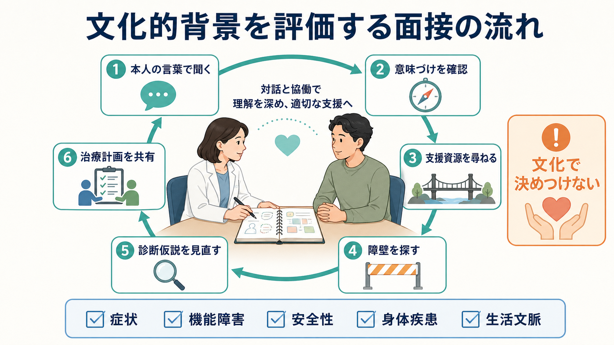
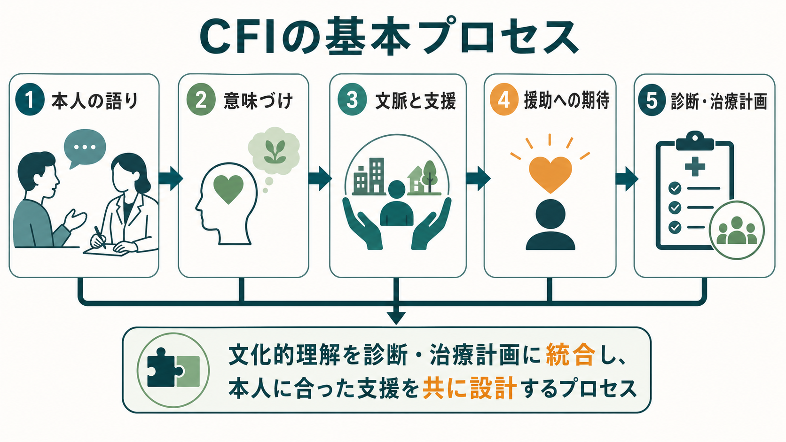

# 文化的背景は診断にどう影響するのか

## 要点

- 文化的背景は、症状そのものの有無だけでなく、症状の語り方、苦痛の意味づけ、正常・異常の境界、家族や地域の反応、援助希求の経路に影響する。
- 文化を評価する目的は「この人はこの文化だから」と決めつけることではなく、本人の言葉と生活文脈を診断仮説、鑑別診断、支援計画に接続することである。
- DSM-5-TRの文化的定式化面接 Cultural Formulation Interview, CFI は、問題の定義、原因や文脈、支援資源、援助希求、治療期待を半構造化して聞くための道具である[1][2]。
- ICD-11 CDDRも、世界中の臨床場面で正確で有用な診断を支えることを目的とし、文化的に多様な文脈で使える診断記述を重視している[3][4]。
- 医療・精神医学に関する本記事は教育・研究目的の一般的説明であり、個別の診断や治療指示ではない。

## この記事で答える問い

1. 文化的背景は、精神科診断のどの段階に影響するのか。
2. 症状表現、価値観、援助希求の違いは、なぜ診断の見立てを変えうるのか。
3. 文化を評価するとき、ステレオタイプ化を避けるには何を見るべきか。
4. 臨床面接では、どのような質問が文化的背景の理解に役立つのか。

## まず結論

文化的背景は、診断名を直接決める「追加項目」ではない。むしろ、患者が何を問題として語るか、どの症状を恥や弱さや身体不調として表すか、どの支援を信頼するか、家族や地域がどのように反応するかを通じて、[[精神科面接とは何か|精神科面接]]と[[鑑別診断とは何か|鑑別診断]]の前提を変える。

たとえば、不眠、動悸、疲労、頭痛、胃腸症状を中心に訴える人がいたとき、それが身体疾患、薬剤、物質使用、うつ、不安、トラウマ、生活ストレスのどれと関係するのかは慎重に評価する必要がある。ここで文化的背景を考えるとは、「身体症状で語る人は心理的問題を隠している」と短絡することではない。本人がその不調をどう名づけ、何が原因だと考え、誰に相談し、どの支援を受け入れやすいかを聞くことで、診断と支援のずれを減らすことである[5][6]。

## 背景

精神科診断は、検査値だけで完結する分類ではない。診断面接では、症状、持続期間、苦痛、機能障害、除外診断、安全性、身体疾患、物質使用、生活史を確認する。同時に、症状が本人の生活の中でどのような意味をもつのかを理解する必要がある。これは[[精神科診断は何のためにあるのか|精神科診断]]を、分類名だけでなく支援計画へつなげるためである。

文化は、国籍や民族だけを意味しない。言語、宗教、家族規範、ジェンダー、性的指向、移住経験、差別経験、教育、職業、世代、地域、医療制度への信頼、社会階層などが重なった、意味づけと実践のパターンである。DSMのCFIでも、文化的背景やアイデンティティは、所属コミュニティ、言語、出身、民族的背景、ジェンダー、性的指向、信仰などを含む広い概念として扱われる[1]。

したがって「文化的背景を評価する」とは、患者を集団属性で説明することではない。同じ文化的カテゴリーに見える人々の中にも、価値観、言語能力、家族関係、医療経験、信念、生活課題は大きく異なる。臨床上の問いは、「その人にとって、この背景が現在の問題をよくする要因、悪くする要因、相談しやすさ、治療選択にどう関係しているか」である。

## 基本概念

### 文化的定式化

文化的定式化 cultural formulation とは、患者の苦痛を、本人の意味づけ、社会的文脈、支援資源、援助希求、臨床家との関係の中で整理する方法である。DSM-5以降のCFIは、文化的定式化を日常臨床で使いやすくするため、16項目の半構造化面接として整備された[1][2]。

CFIの重要点は、文化を臨床家が外から推測するのではなく、患者の言葉で聞くことである。たとえば「何があなたをここに来させたのか」「この問題をどのように説明するか」「支えになっているものは何か」「これまでどのような助けを求めたか」「どのような支援を期待しているか」といった問いが、診断面接に文脈を加える[1]。

### 説明モデル

説明モデル explanatory model とは、本人や家族が、症状の原因、意味、経過、治療可能性をどう理解しているかを指す。医療者の診断モデルと患者の説明モデルがずれると、治療同盟、服薬、心理療法、通院継続、家族との連携に影響しうる[6]。

このずれは、患者の理解が「非科学的」だから起きるとは限らない。医療者もまた、専門職文化、制度、教育、診断分類の枠組みによってものを見ている。文化的評価は、患者の説明モデルと医療者のモデルを対話可能にする作業である。

### 文化と症状表現

文化は、感情を言葉にするか、身体感覚として語るか、対人関係や霊的・道徳的文脈として語るかに影響する。身体症状として苦痛を表すことは、特定文化だけの現象ではなく、多くの社会で見られる。ただし、身体化や心理化のされ方、受診先、周囲の反応には文化差や制度差が残る[5]。

ここで重要なのは、身体症状を「本当は精神症状」と置き換えないことである。まず[[精神科診断における除外診断とは何か|除外診断]]として身体疾患、薬剤、物質使用、神経疾患、安全リスクを確認し、その上で心理社会的文脈と本人の意味づけを合わせて考える。

## 仕組み

文化的背景は、少なくとも五つの経路で診断に影響する。

1. 症状への注意の向き方が変わる。ある人は気分の落ち込みを中心に語り、別の人は疲労、痛み、動悸、睡眠、食欲、集中困難を中心に語る。
2. 症状の意味づけが変わる。同じ不眠でも、身体の病気、仕事上の責任、家族への迷惑、信仰上の葛藤、トラウマ記憶、社会的孤立として理解されることがある。
3. 正常・異常の境界が変わる。悲嘆、怒り、沈黙、幻聴様体験、解離様体験、宗教的体験、家族への依存は、文脈を見ないと病的かどうかを判断しにくい。
4. 援助希求の順番が変わる。本人は医療機関より先に家族、友人、宗教者、地域の支援者、伝統的治療者、学校、職場、オンライン資源へ相談するかもしれない[1][7]。
5. 面接関係が変わる。通訳、敬語、沈黙、視線、権威への態度、差別経験、医療不信は、[[ラポールはどのように形成されるのか|ラポール]]や情報の出方に影響する。

この経路は、[[生物心理社会モデルとは何か|生物心理社会モデル]]と相性がよい。生物学的要因だけでなく、心理的意味づけ、家族・職場・地域・制度の文脈を統合して、診断名と支援計画をつなぐからである。

## 図解

| 見る観点 | 面接での問い | 診断への意味 |
|---|---|---|
| 症状の言葉 | 「そのつらさを、普段はどんな言葉で表しますか」 | 症状項目に翻訳する前に、本人の表現を保持する |
| 意味づけ | 「何が原因だと思いますか」 | 説明モデル、病識、治療期待のずれを見つける |
| 支援資源 | 「誰に相談しましたか」「何が助けになりましたか」 | 家族・地域・宗教・制度資源を支援計画に入れる |
| 障壁 | 「相談しにくかった理由はありますか」 | スティグマ、費用、言語、差別、医療不信を把握する |
| 鑑別 | 「身体疾患や薬、物質、生活変化との関係はありますか」 | 文化説明だけにせず、標準的な鑑別を維持する |

## 臨床・研究との接続

### 臨床面接

文化的評価は、初診の最後に付け足す補足質問ではなく、面接全体に入る視点である。冒頭では本人の語りを広く聞き、途中で症状、経過、機能障害、安全性、身体疾患、物質使用を構造化して確認し、終盤で本人の理解と治療期待をすり合わせる。これは[[開かれた質問と閉じた質問はどう使い分けるのか|開かれた質問と閉じた質問]]を組み合わせる実践でもある。

CFIを使うと、標準的な症状面接では出にくい情報が得られることがある。研究レビューでは、CFIは患者の視点、社会文化的文脈、援助希求、治療期待を集める方法として発展してきた一方、導入には訓練、時間、組織的支援、通訳体制が必要であることも指摘されている[2][8]。

### 診断分類

[[DSMとICDは何が違うのか|DSMとICD]]は、文化的背景を無視して診断名を貼るための表ではない。DSM-5-TRは文化的定式化を診断評価に組み込み、ICD-11 CDDRは国際的で臨床的に有用な診断記述を目指している[1][3][4]。ただし、分類体系は臨床判断を置き換えない。分類名は、本人の語り、生活機能、リスク、身体疾患、社会資源と合わせて使う必要がある。

### 研究

研究では、文化的背景を考慮しないと、同じ尺度得点や同じ診断カテゴリが同じ現象を測っているとは限らない。質問紙の翻訳、測定不変性、社会的望ましさ、スティグマ、医療アクセス、サンプリングの偏りが結果に影響する。ここでは[[社会的望ましさバイアスとは何か|社会的望ましさバイアス]]や[[スティグマとは何か|スティグマ]]の理解も必要になる。

援助希求の研究でも、スティグマは専門的支援を遅らせる要因になりうる。系統的レビューでは、精神疾患関連スティグマは援助希求を妨げる方向に働き、開示への懸念や内在化されたスティグマが重要な障壁として整理されている[7]。したがって、文化的背景を評価することは、診断の精度だけでなく、支援へつながる経路の設計にも関係する。

## よくある誤解

### 誤解1: 文化を聞くのは外国人患者だけでよい

文化は国籍の問題だけではない。日本で生まれ育った人にも、家族規範、地域、職場、世代、信仰、ジェンダー、教育、医療経験、障害観、精神疾患へのスティグマがある。文化的評価は全ての患者に関係する。

### 誤解2: 文化的背景を聞けば診断基準は不要になる

文化的背景は診断基準の代替ではない。症状、期間、苦痛、機能障害、安全性、身体疾患、薬剤、物質使用、発達歴を確認したうえで、症状の意味と支援計画を文脈化する。文化だけで説明しすぎると、身体疾患やリスクを見逃す。

### 誤解3: 文化を理解するとは、集団の特徴を覚えることである

集団に関する知識は手がかりにはなるが、個人を決めつける根拠にはならない。臨床では「この文化ではこうだ」と言う前に、「あなたの場合はどうですか」と聞く必要がある。文化的謙虚さは、知識量よりも、仮説を本人に確認し修正する態度に近い。

### 誤解4: 文化的配慮は診断の客観性を弱める

むしろ、文化的配慮は診断の前提を明確にする。本人がどの言葉で苦痛を語り、何を機能障害とみなし、どの支援を受け入れられるかを知らないまま分類だけを当てはめる方が、誤診や支援ミスマッチにつながりやすい。

## 関連ノート

- [[DSMとICDは何が違うのか]]
- [[精神科診断は何のためにあるのか]]
- [[精神科面接とは何か]]
- [[鑑別診断とは何か]]
- [[精神科診断における除外診断とは何か]]
- [[生物心理社会モデルとは何か]]
- [[文化は自己や認知にどう影響するのか]]
- [[スティグマとは何か]]
- [[援助行動はなぜ起こるのか]]

## MOC更新候補

- `content/00_MOC/` 配下の精神医学、診断・面接、文化・社会心理関連MOCに追加候補。
- 並列ジョブとの衝突を避けるため、このタスクではMOC本体は更新しない。

## 理解チェック

1. 文化的背景は、症状表現、価値観、援助希求、面接関係のどこに影響するか説明できるか。
2. 「文化で決めつけること」と「文化的背景を評価すること」の違いを説明できるか。
3. 身体症状を中心に訴える患者を評価するとき、文化的意味づけと除外診断をどう両立させるか。
4. CFIの質問が、診断だけでなく治療計画やラポール形成に役立つ理由を説明できるか。

## 未解決問題

- CFIを限られた外来時間の中でどの程度簡略化しても、臨床的有用性を保てるのか。
- 通訳を介した文化的定式化で、ニュアンスや権力関係をどのように扱うべきか。
- 診断尺度や質問紙の翻訳版が、異なる文化圏で同じ構成概念を測っているかをどう検証するか。
- 文化的配慮を、ステレオタイプ化ではなく個別化された支援計画へ変換する訓練方法は何か。

## 参考文献

[1] American Psychiatric Association. (2022). *Cultural Formulation Interview (CFI).* https://www.psychiatry.org/File%20Library/Psychiatrists/Practice/DSM/DSM-5-TR/APA-DSM5TR-CulturalFormulationInterview.pdf

[2] Lewis-Fernández, R., Aggarwal, N. K., Bäärnhielm, S., Rohlof, H., Kirmayer, L. J., Weiss, M. G., Jadhav, S., Hinton, L., Alarcón, R. D., Bhugra, D., Groen, S., van Dijk, R., Qureshi, A., Collazos, F., Rousseau, C., Caballero, L., Ramos, M., & Lu, F. (2014). Culture and psychiatric evaluation: operationalizing cultural formulation for DSM-5. *Psychiatry, 77*(2), 130-154. https://doi.org/10.1521/psyc.2014.77.2.130

[3] World Health Organization. (2024). *Clinical descriptions and diagnostic requirements for ICD-11 mental, behavioural and neurodevelopmental disorders.* https://www.who.int/publications/i/item/9789240077263

[4] Gureje, O., Lewis-Fernandez, R., Hall, B. J., & Reed, G. M. (2020). Cultural considerations in the classification of mental disorders: why and how in ICD-11. *BMC Medicine, 18*, 25. https://doi.org/10.1186/s12916-020-1493-4

[5] Kirmayer, L. J., & Young, A. (1998). Culture and somatization: clinical, epidemiological, and ethnographic perspectives. *Psychosomatic Medicine, 60*(4), 420-430. https://doi.org/10.1097/00006842-199807000-00006

[6] Bhui, K., & Bhugra, D. (2002). Explanatory models for mental distress: implications for clinical practice and research. *The British Journal of Psychiatry, 181*(1), 6-7. https://doi.org/10.1192/bjp.181.1.6

[7] Clement, S., Schauman, O., Graham, T., Maggioni, F., Evans-Lacko, S., Bezborodovs, N., Morgan, C., Rüsch, N., Brown, J. S. L., & Thornicroft, G. (2015). What is the impact of mental health-related stigma on help-seeking? A systematic review of quantitative and qualitative studies. *Psychological Medicine, 45*(1), 11-27. https://doi.org/10.1017/S0033291714000129

[8] Lewis-Fernández, R., Krishan Aggarwal, N., & Kirmayer, L. J. (2020). The Cultural Formulation Interview: Progress to date and future directions. *Transcultural Psychiatry, 57*(4), 487-496. https://doi.org/10.1177/1363461520938273
