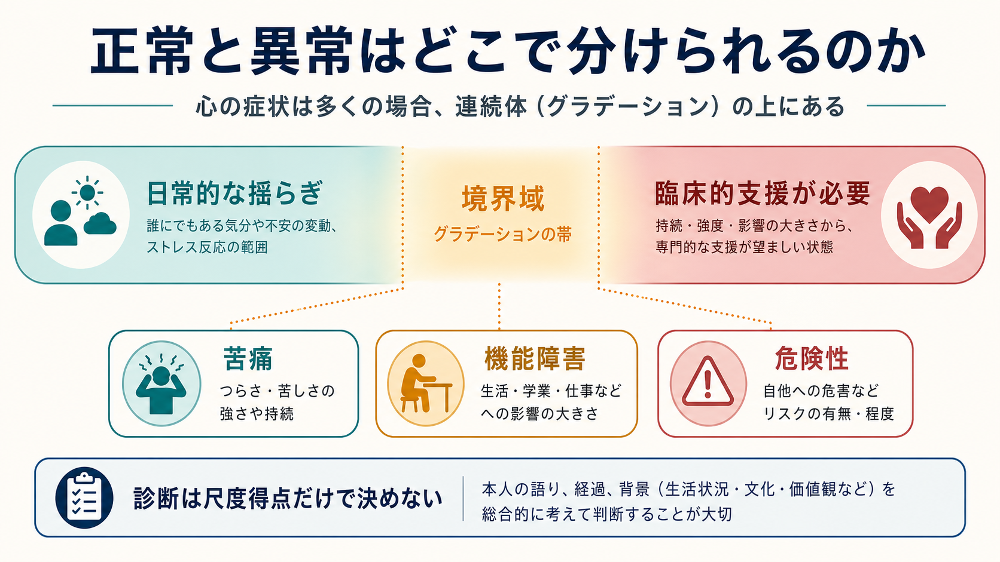
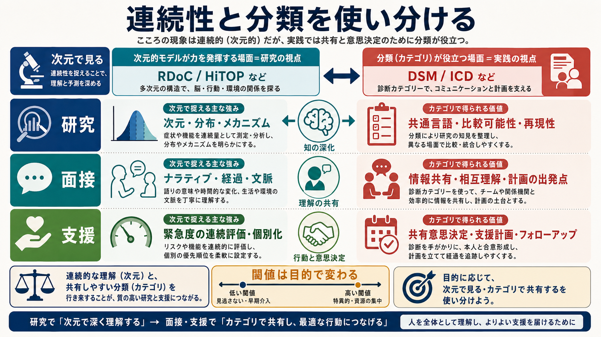

# 正常と異常はどこで分けられるのか

## 要点

- 気分の落ち込み、不安、怒り、こだわり、奇妙な体験の多くは、正常と異常にきれいに二分されるより、強度・持続・頻度・文脈・生活への影響が連続的に変わる現象として見た方がよい。
- 精神医学の診断分類は、連続的な経験を「共有しやすいカテゴリ」に変換する実用的な道具であり、自然界に最初から引かれている一本の線ではない。
- 臨床的な分け目は、主に「本人の苦痛」「生活・学業・仕事・対人関係などの機能障害」「自他への危険性」から考える。
- ただし、苦痛が強くても病気とは限らず、苦痛が乏しくても支援が必要な場合がある。発達段階、文化、喪失やストレスへの予測可能な反応、身体疾患、薬物、本人の価値を含めて判断する。
- この記事は教育・研究目的の整理であり、個別の診断や治療方針を示すものではない。

## この記事で答える問い

- 「普通の悩み」と「精神医学的に扱うべき症状」は、どこで分かれるのか。
- 精神症状が連続的なら、DSM や ICD の診断カテゴリにはどんな意味があるのか。
- 苦痛、機能障害、危険性は、臨床判断でどのように使い分けられるのか。
- 研究で使う次元モデルと、臨床で使う診断カテゴリは対立するのか。

## まず結論

正常と異常の境界は、「症状があるかないか」だけでは決まらない。DSM-5-TR では、精神疾患は認知、感情調整、行動における臨床的に有意な障害であり、心理的・生物学的・発達的過程の機能不全を反映し、通常は社会・職業など重要な活動における苦痛や障害を伴うものとして定義される [1]。WHO の ICD-11 に基づく説明でも、精神障害は臨床的に有意な認知・情動調整・行動の障害であり、重要な生活領域での苦痛や機能障害と通常関連するとされる [2]。

したがって境界は、単なる統計的な平均からのずれではなく、「その体験が、その人の生活世界の中でどれほど苦痛・障害・危険につながっているか」を見る実践的な判断である。ここに、[[インタビュー研究とは何か|本人の語り]]、生活史、周囲の観察、身体医学的評価、心理尺度、文化的背景が関わる。

## 背景

「正常」と「異常」という言葉は便利だが、精神症状ではしばしば誤解を生む。たとえば不安は危険に備える正常な機能でもある。悲しみは喪失への自然な反応でもある。怒りは境界侵害への反応でもある。内向性、敏感さ、慎重さ、こだわりも、それだけで疾患ではない。

一方で、同じ不安や悲しみでも、強度が大きく、長く続き、避けられる活動が増え、仕事や学業、睡眠、食事、対人関係が崩れ、自傷や他害の危険が高まるなら、臨床的支援が必要になる。つまり問題は、「その経験が普通かどうか」だけではなく、「その経験がどの程度、本人の生き方と安全を狭めているか」である。

Wakefield の harmful dysfunction 論は、精神障害を「害」と「機能不全」の組み合わせとして考える代表的な議論である [3]。ただし、何を害とみなすか、どの機能を機能不全とみなすかは、価値判断や文化、発達段階と切り離せない。DSM-IV の解説にも、精神障害概念にはすべての状況を覆う精密な境界はないという趣旨の記述があり、後の議論でも、診断概念には妥当性と臨床的有用性の両方が必要だと整理されている [4]。

## 基本概念

### 連続性

連続性とは、症状や心理特性が「ある/ない」ではなく、程度として分布するという見方である。不安、抑うつ、注意困難、衝動性、疑い深さ、身体感覚への注意、社会的緊張などは、一般集団にも幅広く分布する。

この視点では、「正常な人」と「異常な人」という二分法より、「どの次元が、どのくらい、どの文脈で高まっているか」を見る。これは [[RDoCは精神疾患研究をどう変えたのか|RDoC]] や HiTOP のような研究枠組みと相性がよい。RDoC は、精神障害を診断名から出発して調べるのではなく、正常から異常まで連続する神経行動機能の次元として研究する枠組みである [6]。HiTOP も、従来の分類が抱える正常性との恣意的境界、併存、異質性、診断不安定性に対して、症状や特性から経験的に構造を組み上げることを目指す [7]。

### 臨床的閾値

臨床的閾値とは、「ここから上なら必ず病気」という自然境界ではなく、「ここからは追加評価、支援、治療、保護、モニタリングを考えるべき」という実践上の境界である。尺度で言えば、[[カットオフ値はどのように決めるのか|カットオフ値]]に近い。ただし精神医学の閾値は、点数だけでなく、面接での語り、生活機能、経過、リスク、身体疾患、薬物、環境要因と統合して読む必要がある。

### 苦痛・機能障害・危険性

臨床場面では、少なくとも次の三つを分けて見る。

| 軸 | 見ること | 例 |
|---|---|---|
| 苦痛 | 本人がどれほどつらいか | 不安、抑うつ、焦燥、恐怖、罪悪感、身体症状への苦悩 |
| 機能障害 | 生活がどれほど妨げられているか | 欠席、休職、対人関係の破綻、家事困難、セルフケア低下 |
| 危険性 | 自他の安全がどれほど脅かされているか | 自殺念慮、自傷、他害、衝動的行動、重度のセルフネグレクト |

この三つは重なるが同じではない。強い苦痛があっても生活機能は保たれている人がいる。逆に、本人の苦痛の訴えが乏しくても、妄想、躁状態、物質使用、認知障害などにより危険性や機能障害が大きい場合がある。

## 仕組み

### 1. 症状は連続的だが、支援はどこかで始める必要がある

研究では、症状を連続量として扱うことで、軽い困難から重い障害までを見通しやすくなる。しかし臨床では、いつ追加面接をするか、いつ家族や学校・職場と連携するか、いつ安全確保を優先するかを決めなければならない。そのため、連続的な現象を、目的に応じて段階化する必要がある。

この段階化は、診断名だけでなく、支援の強度にも関わる。たとえば軽い不眠や不安ならセルフケア、心理教育、経過観察で足りることがある。機能障害が広がるなら専門的評価が必要になる。自殺リスクや重度の摂食制限、興奮、錯乱があるなら、診断名の確定より安全確保が優先される。

### 2. 臨床的有意性は偽陽性を減らすための工夫でもある

精神症状は一般人口にも広く見られるため、症状リストだけで診断すると、日常的な苦悩や一時的な反応まで過剰に医療化しやすい。DSM-IV の「臨床的に有意な苦痛または機能障害」という基準は、こうした偽陽性を減らすための工夫として議論された [5]。Narrow らも、臨床的有意性と disability をどのように切り分けるかが、DSM 改訂上の重要課題だと述べている [8]。

ただし、臨床的有意性は万能ではない。何を「有意」とみなすかには、文化、本人の役割、社会的支援、職場や学校の柔軟性、経済状況が影響する。したがって、単に「仕事に行けているから問題ない」「本人がつらいと言っていないから問題ない」とは言えない。

### 3. 文脈は境界を動かす

同じ行動でも、文脈によって意味が変わる。大切な人を失った直後の悲しみ、試験前の緊張、危険な環境での警戒、文化的に共有された儀礼体験は、それだけで精神障害とは言えない。DSM-5-TR も、共通のストレスや喪失への予測可能または文化的に承認された反応は、それだけでは精神障害ではないとする [1]。

一方で、文脈を理由に苦痛や危険を見逃してはいけない。喪失後の悲しみでも、著しい希死念慮、栄養・睡眠の崩壊、長期化する機能障害があるなら評価が必要である。文化的文脈を尊重することと、支援の必要性を見ないことは別である。

## 図解

図1は、精神症状を「日常的な揺らぎ」から「臨床的支援が必要な状態」までの連続体として示している。中心にある境界域は、硬い線ではなくグラデーションである。ここで苦痛、機能障害、危険性を見ながら、面接と観察で判断を補う。

図2は、臨床的閾値を三つの軸で考える図である。苦痛、機能障害、危険性はそれぞれ独立に評価し、持続時間、文化・発達文脈、本人の価値を含めて総合判断する。

図3は、次元モデルとカテゴリ診断の使い分けを示している。研究では次元的に理解することでメカニズムや分布を調べやすい。一方、面接・支援ではカテゴリ診断が情報共有、制度利用、治療計画の共通言語になる。

## 臨床・研究との接続

### 面接

面接では、症状名を早く当てるより、本人が何に困っているのかを具体化することが重要である。いつから、どの場面で、どれくらい続き、何を避けるようになり、何が保たれていて、誰がどのように心配しているのかを聞く。これは MSE や診断面接だけでなく、生活史と文脈を読む作業でもある。

### 研究

研究では、DSM/ICD のカテゴリだけで群分けすると、同じ診断名の中に多様な症状パターンが含まれ、異なる診断名の間にも共通次元が広がる。RDoC や HiTOP は、この問題に対して、診断横断的な次元、神経行動システム、症状階層を調べる道具を与える [6][7]。ただし、これらは現時点で診断マニュアルをそのまま置き換えるものではない。

### 支援

支援では、「診断名がつくか」より前に、「何を減らし、何を守り、何を回復させるか」を考える。苦痛を減らす、睡眠を整える、学校や職場の負荷を調整する、危険を下げる、家族や支援者と情報共有する、身体疾患や薬物の影響を評価する、といった介入目標は、診断確定前から必要になることがある。

## よくある誤解

### 誤解1: 平均から外れていれば異常である

違う。統計的に珍しいことと、臨床的に問題であることは同じではない。高い創造性、強い内向性、珍しい信念、少数派の価値観は、それだけで精神障害ではない。重要なのは、苦痛、機能障害、危険性、文脈、機能不全の可能性である [1][3]。

### 誤解2: 本人が苦しければ必ず病気である

違う。苦痛は重要な評価軸だが、喪失、葛藤、不正義、過労、孤立などへの理解可能な反応として生じる苦痛もある。苦痛を病名に還元しすぎると、環境調整や社会的支援の必要性を見落とす。

### 誤解3: 苦痛がなければ問題ない

違う。躁状態、精神病症状、物質使用、認知障害、重い摂食制限などでは、本人の病識や苦痛の訴えが乏しくても、機能障害や危険性が大きい場合がある。安全と生活機能は、本人の主観的苦痛とは別に評価する。

### 誤解4: 診断カテゴリは恣意的だから不要である

違う。境界に恣意性があることは、分類が無意味であることを意味しない。診断カテゴリは、支援計画、制度利用、研究参加基準、臨床チームの情報共有に役立つ。ただし、カテゴリを実体化しすぎず、次元的な重症度や併存、個人の文脈と併せて読む必要がある。

## 関連ノート

- DSMとICDは何が違うのか（今後の作成候補）
- [[RDoCは精神疾患研究をどう変えたのか]]
- [[カットオフ値はどのように決めるのか]]
- [[インタビュー研究とは何か]]
- [[身体症状症は脳の予測処理で説明できるのか]]
- [[妄想は予測誤差処理の異常として説明できるのか]]
- [[評価者間信頼性とは何か]]

### MOC更新候補

- `content/00_MOC/MOC｜精神医学.md` の「総論・診断・面接」領域
- `content/00_MOC/MOC｜神経科学と精神疾患.md` の RDoC・診断概念関連
- `content/00_MOC/MOC｜認知科学・心理学.md` の心理測定・臨床判断関連

## 理解チェック

1. 「症状が連続的である」ことと、「臨床的判断で閾値が必要である」ことは、なぜ矛盾しないのか。
2. 苦痛、機能障害、危険性が一致しない例を一つずつ挙げられるか。
3. 文化的に理解可能な反応と、臨床的支援が必要な状態を分けるとき、どの情報を追加で確認すべきか。
4. RDoC や HiTOP のような次元モデルが、DSM/ICD のカテゴリ診断を完全に置き換えるとは限らない理由は何か。
5. 「尺度得点が高い」ことを、そのまま個別診断にしてはいけない理由を説明できるか。

## 未解決問題

- 精神障害の境界を、苦痛・機能障害・危険性・機能不全・本人の価値・社会的文脈のどの組み合わせで定義するのが最も妥当か。
- 次元モデルを、研究だけでなく日常診療の説明、制度、支援計画にどう接続するか。
- 過剰診断と過少診断の害を、本人・家族・臨床家・社会の視点からどう重みづけるか。
- 文化差、発達段階、社会的少数性を、臨床的閾値の判断にどう組み込むか。

## 参考文献

[1] American Psychiatric Association. (2022). *Diagnostic and Statistical Manual of Mental Disorders, Fifth Edition, Text Revision (DSM-5-TR)*. American Psychiatric Association Publishing. https://www.psychiatry.org/psychiatrists/practice/dsm

[2] World Health Organization. (2025). Mental disorders. https://www.who.int/news-room/fact-sheets/detail/mental-disorders

[3] Wakefield, J. C. (1992). Disorder as harmful dysfunction: A conceptual critique of DSM-III-R's definition of mental disorder. *Psychological Review, 99*(2), 232-247. https://doi.org/10.1037/0033-295X.99.2.232

[4] Stein, D. J., Phillips, K. A., Bolton, D., Fulford, K. W. M., Sadler, J. Z., & Kendler, K. S. (2010). What is a mental/psychiatric disorder? From DSM-IV to DSM-V. *Psychological Medicine, 40*(11), 1759-1765. https://pmc.ncbi.nlm.nih.gov/articles/PMC3101504/

[5] Spitzer, R. L., & Wakefield, J. C. (1999). DSM-IV diagnostic criterion for clinical significance: Does it help solve the false positives problem? *American Journal of Psychiatry, 156*(12), 1856-1864. https://doi.org/10.1176/ajp.156.12.1856

[6] National Institute of Mental Health. (n.d.). About RDoC. https://www.nimh.nih.gov/research/research-funded-by-nimh/rdoc/about-rdoc

[7] HiTOP Consortium. (n.d.). The Hierarchical Taxonomy of Psychopathology: The Framework. https://www.hitop-system.org/the-framework

[8] Narrow, W. E., Kuhl, E. A., & Regier, D. A. (2009). DSM-V perspectives on disentangling disability from clinical significance. *World Psychiatry, 8*(2), 88-89. https://doi.org/10.1002/j.2051-5545.2009.tb00222.x
