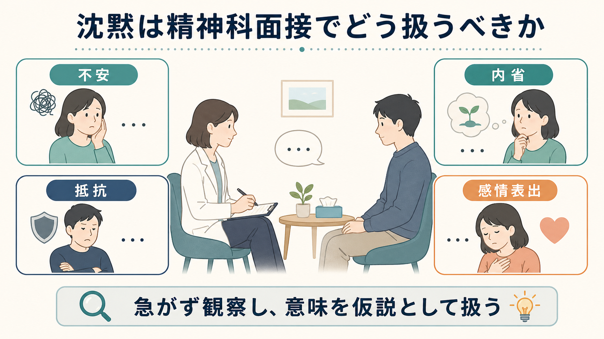
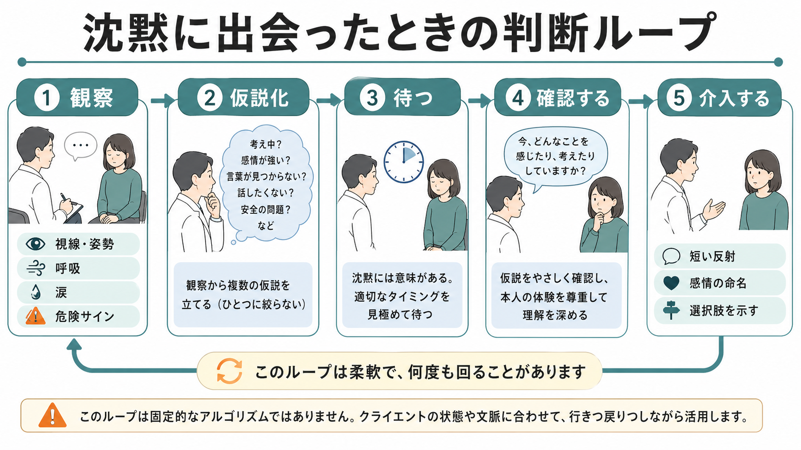
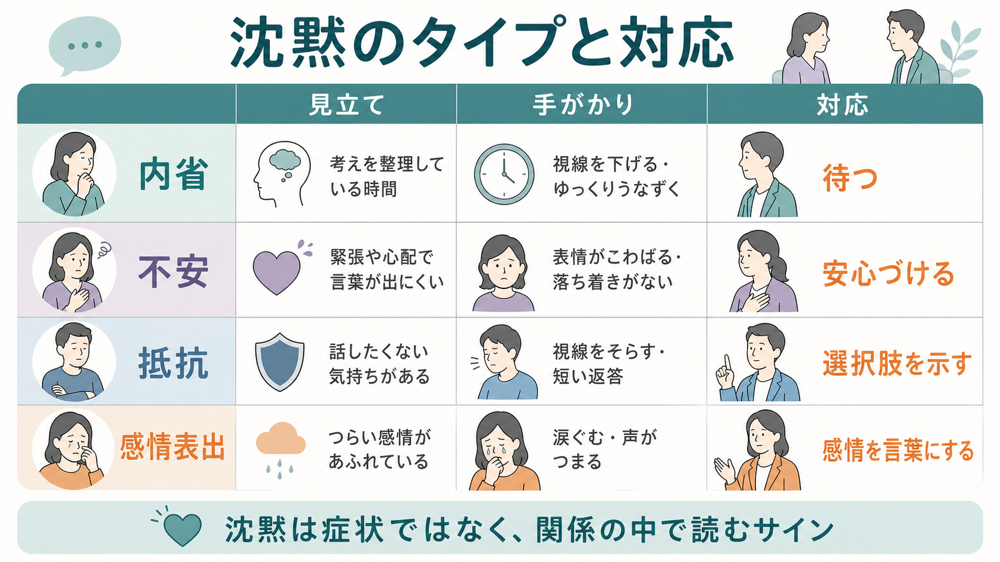

# 沈黙は精神科面接でどう扱うべきか

## 要点

- 沈黙は「答えられない」「協力しない」という単一の意味ではなく、不安、内省、抵抗、感情表出、言語化困難、安全上の危険サインなど、複数の意味を持つ。
- 精神科面接では、沈黙をすぐ埋めるよりも、表情、姿勢、視線、呼吸、涙、思考のまとまり、リスクを観察し、仮説として扱う。
- 沈黙を治療的に使えるかどうかは、信頼関係、患者の不安の強さ、精神病症状・認知機能・自傷他害リスク、面接の目的によって変わる。
- 対応の基本は、待つ、短く反射する、感情を名づける、質問を小さくする、選択肢を示す、安全確認に切り替える、の順で考える。

## この記事で答える問い

精神科面接で患者が黙ったとき、面接者は「待つべきか」「別の質問に移るべきか」「抵抗として扱うべきか」「危険サインとして確認すべきか」を迷う。このノートでは、沈黙を面接技法としてどう読むか、また精神科評価の安全性を保ちながらどう応答するかを整理する。教育・研究目的の整理であり、個別の診断や治療指示ではない。

## まず結論

沈黙に出会ったら、まず「何も起きていない時間」ではなく、「言葉以外の情報が出ている時間」とみなす。精神科面接では、本人の語りを促すために開かれた質問と十分な時間が重要であり、表情や姿勢などの非言語情報も精神状態評価の材料になる[1]。したがって、沈黙はすぐに破る対象ではなく、観察し、複数の仮説を立て、本人の体験を損なわない形で確認する対象である。

ただし、沈黙を常に長く待てばよいわけではない。強い不安、混乱、精神病症状、認知機能低下、解離、トラウマ反応、自傷他害の切迫が疑われる場合は、待つこと自体が負担や危険を増やすことがある。NICE の成人メンタルヘルスサービス利用者経験ガイダンスも、評価では本人が問題を述べ話し合う時間を確保しつつ、説明、要約、質問の時間、支援を提供することを重視している[2]。

## 背景

精神科面接は、症状を列挙するだけの手続きではない。本人が何に困り、どのように語り、どこで言葉を止めるかは、[[現病歴はどのように構造化するべきか]]、[[精神科初診で何を確認するべきか]]、[[生物心理社会モデルとは何か]]とつながる評価情報である。沈黙は、その人の認知、感情、対人関係、文化的背景、面接者との関係性が交差する地点に現れる。

心理療法研究では、沈黙は治療者が反省や感情表出を促すために使うことがあり、患者側にも思考をまとめる、感情に触れる、言葉にできない経験を保持する、あるいは面接から退くなどの異なる機能があるとされる[3], [4]。近年の統合的レビューも、沈黙を一様な「会話の空白」と扱うだけでは不十分で、文脈と機能を分けて考える必要を示している[5]。

## 基本概念

### 1. 不安としての沈黙

不安が強いと、患者は「間違ったことを言ってはいけない」「どう評価されるかわからない」「何から話せばよいかわからない」と感じ、言葉が止まることがある。視線が泳ぐ、手が落ち着かない、呼吸が浅い、質問に答えようとしているが短く途切れる、といった手がかりがある。

この場合、沈黙を責めずに、面接の目的と時間、答えにくい質問を飛ばせること、ここでの話がどう扱われるかを簡潔に説明する。応答は「少し答えにくい感じがあるかもしれません」「急がなくて大丈夫です」「今は、話しやすいところからでかまいません」のように、圧を下げる方向がよい。

### 2. 内省としての沈黙

内省の沈黙では、患者は質問を理解し、自分の経験を探している。目線を落とす、少し考える表情になる、時間を置くと内容のある言葉が出てくる、という経過をとりやすい。心理療法家調査では、沈黙は反省を促す、感情表出を促す、流れを遮らない、共感を伝えるために使われていた[3]。

この場合は、すぐ別の質問を重ねない。短い相づち、開かれた姿勢、十分な間を保ち、必要なら「今、言葉を探している感じでしょうか」と確認する。沈黙の時間を本人が使えているなら、面接者の役割はその作業を邪魔しないことである。

### 3. 抵抗としての沈黙

抵抗という言葉は、患者を「非協力的」と評価するためではなく、話すことが本人にとって危険、恥、怒り、支配される感覚、関係上の不信を伴う可能性を示す仮説として使う。Levitt の研究では、妨げになる沈黙には治療的探索から離れる体験が含まれ、抵抗や退行だけでなく、関係の中で言えないことを保持する機能も示された[4]。

抵抗が疑われる場合、面接者は追及を強めるより、選択肢と主体性を返す。「この話題は今は扱いにくいかもしれません。別の角度から話すか、少し後に戻ることもできます」と伝える。抵抗を壊すのではなく、抵抗が必要になっている条件を読む。

### 4. 感情表出としての沈黙

涙、声の詰まり、胸に手を当てる、長く息を吐く、表情の変化がある沈黙では、言葉より先に感情が表に出ていることがある。ここで急いで質問を追加すると、感情を処理する時間を奪うことがある。

応答は短く、「つらいところに触れたように見えます」「言葉にしにくい感じがありますか」「少し待ちましょうか」のように、観察と確認を分ける。面接者の解釈を断定せず、本人が修正できる形で置くことが重要である。治療者の共感は心理療法転帰と関連することがメタ分析で示されており[6]、沈黙への応答でも、正確さより「わかろうとしている姿勢」が関係を支える。

### 5. 安全確認が必要な沈黙

沈黙の中には、待つより先に安全確認へ移るべきものがある。自殺念慮、他害念慮、虐待、DV、強い解離、意識障害、せん妄、薬物・アルコールの影響、急性精神病症状が疑われる場合である。精神科評価では、自傷他害の可能性、思考・知覚、認知機能、身体疾患や薬物の影響を評価する必要がある[1]。また、医療的原因が精神症状を模倣・悪化させる可能性もあるため、通常と異なる沈黙や急な反応低下では[[器質性精神障害を見逃さないためには何を見るべきか]]とも接続して考える。

この場合は、沈黙を尊重しつつも、「安全の確認だけ先にさせてください」「今、自分を傷つけたい気持ちはありますか」のように、理由を明示して直接確認する。沈黙を治療的に待つ場面と、リスク評価を優先する場面を分ける。

## 仕組み

沈黙への対応は、固定的なアルゴリズムではなく、観察、仮説化、待つ、確認する、介入する、を循環させる作業である。

| 段階 | 見ること | 面接者の内的作業 | 可能な応答 |
|---|---|---|---|
| 観察 | 視線、姿勢、呼吸、涙、表情、思考のまとまり | 沈黙を一つの意味に決めない | 黙って待つ、短い相づち |
| 仮説化 | 不安、内省、抵抗、感情表出、危険サイン | 複数仮説を並べる | 「言葉を探している感じでしょうか」 |
| 待つ | 本人が沈黙を使えているか | 介入の必要性を見極める | 姿勢を保つ、メモを急がない |
| 確認する | 本人が修正できる形で尋ねる | 解釈を断定しない | 「違っていたら直してください」 |
| 介入する | 不安・混乱・危険が増えていないか | 面接目的に戻す | 質問を小さくする、選択肢を示す、安全確認 |

治療同盟は心理療法の転帰と一貫して関連する重要な要因であり[7]、沈黙への対応は同盟を強めることも弱めることもある。沈黙を急いで埋める面接者は、患者に「考える時間がない」「話題を逸らされた」と感じさせるかもしれない。一方、長く待ちすぎる面接者は、不安の高い患者に「見捨てられた」「試されている」と感じさせるかもしれない。よい対応は、沈黙の長さそのものではなく、関係・文脈・安全性に合っているかで決まる。

## 図解

沈黙を読むときの実用的な分岐は、次のように整理できる。

| 沈黙の見立て | 手がかり | まず避けたいこと | 対応の例 |
|---|---|---|---|
| 内省 | 考える表情、時間後に語りが深まる | 質問を重ねる | 「少し待ちます」 |
| 不安 | 緊張、視線の落ち着かなさ、短い返答 | 早口で詰める | 「話しやすいところからで大丈夫です」 |
| 抵抗 | 話題で急に閉じる、怒り、不信、短い返答 | 非協力と決めつける | 「今は扱いにくい話題かもしれません」 |
| 感情表出 | 涙、声の詰まり、呼吸の変化 | すぐ説明や助言をする | 「つらいところに触れたように見えます」 |
| 危険サイン | 急な反応低下、混乱、自傷他害の文脈 | ただ待ち続ける | 「安全の確認だけ先にします」 |

## 臨床・研究との接続

精神科面接での沈黙は、[[精神医学とは何か]]、[[精神科診断は何のためにあるのか]]、[[鑑別診断とは何か]]と関係する。診断は面接で得られた語り、観察、身体・社会・発達歴、リスク情報を統合する作業であり、沈黙もその統合の一部である。ただし、沈黙だけから診断名を推定してはいけない。

研究面では、沈黙は単なる発話量の不足ではなく、患者の内的作業、関係の調整、治療者の応答、感情表出の変化と結びつく。会話分析研究は、治療場面の沈黙が話題展開や相互行為の中でどのように扱われるかを示しており、沈黙そのものよりも、その後にどのような応答が起こるかが重要である[8]。沈黙を「何秒続いたか」だけで測るより、「どの文脈で、誰にとって、どの機能を持ったか」を見る必要がある。

臨床教育では、沈黙を使う練習は、単に黙る練習ではない。自分の不安を観察する練習、患者の非言語情報を見る練習、短い反射を置く練習、危険サインでは明確に介入する練習である。面接者が沈黙に耐えられないと、患者の感情や内省が言葉になる前に、質問や助言で覆ってしまう。

## よくある誤解

### 「沈黙は常に抵抗である」

抵抗である場合もあるが、内省、感情表出、不安、言語化困難、文化的な配慮、認知機能の問題、安全上の問題でもありうる。抵抗と呼ぶ前に、複数の仮説を置く。

### 「よい面接者は長く沈黙を待てる」

待てることは大切だが、待つこと自体が目的ではない。患者が沈黙を使えているか、不安が増えていないか、リスク確認が必要ではないかを見て、待つ時間を調整する。

### 「沈黙を破ると治療的でなくなる」

短く、非侵襲的に破ることはむしろ助けになる場合がある。「今、どんな感じですか」「少し言葉にしにくいですか」のような確認は、沈黙を否定せず、共同作業に戻す。

### 「沈黙は精神症状の所見としてそのまま記録すればよい」

記録では「沈黙した」とだけ書くより、どの質問の後に、どのくらい、どのような表情・姿勢・反応を伴い、その後どう語ったかを書く方が有用である。これは[[操作的診断とは何か]]で扱うような診断基準の機械的適用とは別に、面接過程の質を記述する作業である。

## 関連ノート

- [[精神科初診で何を確認するべきか]]
- [[現病歴はどのように構造化するべきか]]
- [[生物心理社会モデルとは何か]]
- [[精神科診断は何のためにあるのか]]
- [[鑑別診断とは何か]]
- [[器質性精神障害を見逃さないためには何を見るべきか]]
- [[精神医学における回復とは何か]]

## MOC更新候補

- `content/00_MOC/` 配下の精神医学・臨床面接関連 MOC に、本記事へのリンクを追加する候補。
- 並列ジョブとの競合を避けるため、本タスクでは MOC ファイル自体は更新しない。

## 理解チェック

1. 沈黙を「抵抗」とみなす前に、どのような別仮説を置けるか。
2. 内省としての沈黙と、不安としての沈黙は、非言語的にどう見分けられるか。
3. 沈黙を待たずに安全確認へ移るべき場面には何があるか。
4. 「沈黙を尊重すること」と「質問を避けること」はなぜ同じではないのか。
5. 記録に残すなら、「沈黙した」以外に何を書くと臨床的に役立つか。

## 未解決問題

- 精神科初診、心理療法、救急、入院病棟、児童思春期、高齢者診療では、沈黙の意味と許容される待ち時間が異なる。
- 文化、言語、通訳を介した面接、神経発達特性、認知機能低下が、沈黙の読み方にどう影響するかは、個別に検討する必要がある。
- 沈黙への応答が治療同盟、自己開示、安全確認、診断精度に与える影響は、場面別の実証研究がさらに必要である。

## 参考文献

[1] First, M. B., & Zimmerman, M. (2026). *Initial Psychiatric Assessment*. Merck Manual Professional Edition. Reviewed/Revised Oct 2024; Modified Jan 2026. https://www.merckmanuals.com/professional/psychiatric-disorders/approach-to-the-patient-with-psychiatric-symptoms/initial-psychiatric-assessment

[2] National Collaborating Centre for Mental Health. (2012). *Service User Experience in Adult Mental Health: Improving the Experience of Care for People Using Adult NHS Mental Health Services*. NICE Clinical Guidelines, No. 136. British Psychological Society. https://www.ncbi.nlm.nih.gov/books/NBK327296/

[3] Hill, C. E., Thompson, B. J., & Ladany, N. (2003). Therapist use of silence in therapy: A survey. *Journal of Clinical Psychology, 59*(4), 513-524. https://doi.org/10.1002/jclp.10155

[4] Levitt, H. M. (2001). Clients' experiences of obstructive silence: Integrating conscious reports and analytic theories. *Journal of Contemporary Psychotherapy, 31*, 221-244. https://doi.org/10.1023/A:1015307311143

[5] Levitt, H. M., & Morrill, Z. (2023). Silences in psychotherapy: An integrative meta-analytic research review. *Psychotherapy, 60*(3), 320-341. https://doi.org/10.1037/pst0000480

[6] Elliott, R., Bohart, A. C., Watson, J. C., & Murphy, D. (2018). Therapist empathy and client outcome: An updated meta-analysis. *Psychotherapy, 55*(4), 399-410. https://doi.org/10.1037/pst0000175

[7] Flückiger, C., Del Re, A. C., Wampold, B. E., & Horvath, A. O. (2018). The alliance in adult psychotherapy: A meta-analytic synthesis. *Psychotherapy, 55*(4), 316-340. https://doi.org/10.1037/pst0000172

[8] Knol, A. S. L., Koole, T., Desmet, M., Vanheule, S., & Huiskes, M. (2020). How speakers orient to the notable absence of talk: A conversation analytic perspective on silence in psychodynamic therapy. *Frontiers in Psychology, 11*, 584927. https://doi.org/10.3389/fpsyg.2020.584927
