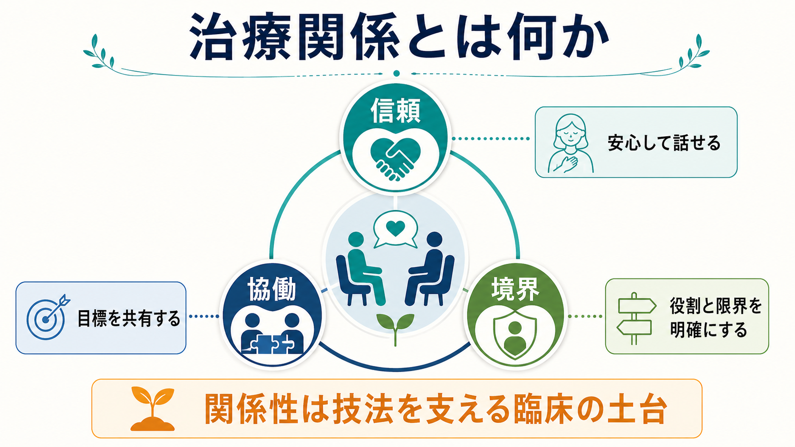
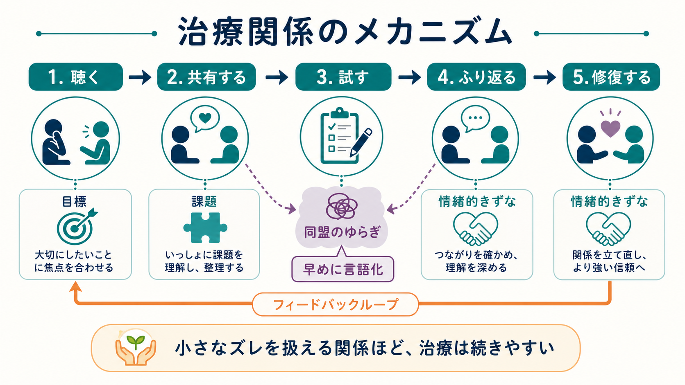
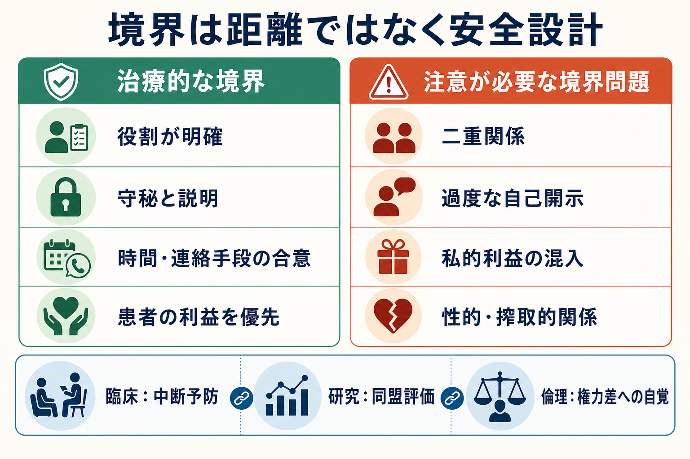

# 治療関係とは何か

## 要点

- 治療関係とは、患者と治療者が「何を目指すか」「何をするか」「どのような信頼で支えるか」を共有していく関係である。
- Bordin の作業同盟モデルでは、治療関係の中核は「目標への合意」「課題への合意」「情緒的きずな」の 3 要素として整理される [1]。
- 良い治療関係は、単なる雰囲気の良さではなく、治療継続、情報共有、意思決定、危機対応を支える臨床的な条件である [2][3]。
- 境界は「冷たく距離を置くこと」ではなく、患者の安全、自己決定、治療者の権力差への自覚を守るための設計である [7][8]。

## この記事で答える問い

この記事では、治療関係を「信頼」「協働」「境界」の 3 つから説明する。精神科診療や心理療法では、症状、診断、薬物療法、心理社会的支援が話題になりやすい。しかし、それらを実際に使える形にするには、患者が話せる、治療者が聴ける、両者がずれを修正できる関係が必要になる。

関連して、説明と同意の土台としての [[インフォームドコンセントとは何か]]、患者を多面的に理解する [[生物心理社会モデルとは何か]]、回復を生活と意味の回復として捉える [[精神医学における回復とは何か]] と接続して読むと理解しやすい。

## まず結論

治療関係とは、患者が「評価されるだけの対象」ではなく、治療に参加する主体として扱われる関係である。治療者は専門知を持つが、患者は自分の経験、価値観、生活上の制約、回復の意味を知っている。したがって、治療は一方的な指示ではなく、専門知と当事者知をすり合わせる共同作業になる。

この関係は、仲良くなること自体を目的にしない。むしろ、治療者が患者の利益を優先し、役割、時間、守秘、連絡手段、緊急時対応、治療の限界を明確にすることで、安心して率直な話ができるようにする。つまり治療関係は、温かさと構造を同時に含む。

## 背景

精神医学では、診断名や治療法だけでは臨床を十分に説明できない。たとえば同じ診断、同じ薬、同じ心理教育でも、患者が治療者を信頼できるか、生活上の困りごとを話せるか、治療方針に納得できるかによって、治療の意味は変わる。これは [[精神医学とは何か]] が扱う「医学でありながら、人の経験と社会的文脈を扱う」という特徴ともつながる。

心理療法研究では、治療同盟は多くの学派に共通して注目されてきた。Flückiger らのメタ分析は、成人心理療法において治療同盟がアウトカムと一貫して関連することを示している [2]。これは「関係だけで治る」という意味ではない。むしろ、技法、診断、薬物療法、環境調整が患者に届くための通路として、関係性が働くという意味である。

NICE の成人メンタルヘルスサービス利用者経験ガイドラインも、希望と楽観性のある雰囲気、信頼できる支持的・共感的・非審判的な関係、患者の自律性と治療決定への参加を重視している [6]。これは臨床倫理の話であると同時に、治療継続や満足度に関わる実践上の条件でもある。

## 基本概念

### 信頼

信頼は「何でも話せる親密さ」ではなく、「この場では自分の話が治療目的に沿って扱われる」という予測可能性である。患者は、症状、羞恥、怒り、不信、希死念慮、服薬への抵抗、家族や職場との葛藤など、話しにくい情報を持っている。治療者が早く結論を出しすぎたり、患者の語りを道徳的に裁いたりすると、重要な情報は共有されにくくなる。

共感はこの信頼を支える。心理療法研究では、治療者の共感は治療アウトカムと中等度の関連を示すとされる [4]。ただし共感は、患者の言葉に同調するだけではない。患者の苦痛の意味を理解しようとしつつ、危険や限界がある場合には率直に扱う姿勢を含む。認知機能としての共感については [[共感は認知機能としてどう理解できるのか]] とも接続できる。

### 協働

協働とは、患者と治療者が同じ方向を見ることである。Bordin は作業同盟を、目標への合意、課題への合意、情緒的きずなの 3 要素として整理した [1]。たとえば「うつを治す」という抽象的な目標だけでは、患者と治療者の理解がずれることがある。患者にとっては「朝起きて子どもを学校に送ること」が目標かもしれないし、治療者にとっては「睡眠、服薬、休職調整、自殺リスク評価」が当面の課題かもしれない。

協働では、このずれを見える形にする。「何を優先するか」「今週できる小さな行動は何か」「薬物療法、心理療法、家族支援、職場調整のどれをどう組み合わせるか」を話し合う。共同意思決定の研究でも、精神保健領域では本人の選好と参加を支える介入が、エンパワメント、関与、満足度などに関わる可能性が示されている [5]。

### 境界

境界とは、治療関係を安全に保つための枠組みである。時間、場所、料金、連絡手段、守秘義務、診療録、緊急時対応、治療者の自己開示、贈り物、SNS、二重関係などが含まれる。境界が明確だと、患者は「この関係は私的な好意や治療者の気分ではなく、治療目的に沿って運用される」と理解しやすい。

一方で、境界が崩れると、患者の依存、混乱、搾取、治療中断、苦情、法的問題につながりうる。精神科の境界問題に関するレビューでは、性的関係だけでなく、不適切なオンライン行動やメール対応も問題になりうるとされる [7]。Gabbard の境界違反研究も、境界逸脱は単なる個人の悪意ではなく、臨床判断、逆転移、秘密化、スーパービジョン不足が絡む危険として扱う必要を示している [8]。

## 仕組み

治療関係は、次のような循環で働く。

1. 患者が困りごとを話す。
2. 治療者が評価、理解、説明、選択肢の提示を行う。
3. 患者と治療者が目標と課題を調整する。
4. 実際の治療を試す。
5. 効果、負担、不満、違和感を振り返る。
6. 必要なら方針や関係のずれを修復する。

この循環で重要なのは、ずれが起きないことではなく、ずれを扱えることである。治療者の言葉が患者を傷つけることもある。患者が「わかってもらえない」と感じることもある。治療者がリスクを重く見て、患者が自由を制限されたと感じることもある。Safran らは、治療同盟の破綻を、患者と治療者の協働関係に緊張や断絶が生じる場面として捉え、その修復を治療過程の重要な課題としている [3]。

臨床的には、修復は「謝るかどうか」だけではない。治療者が、患者の経験を確認し、何が起きたかを言語化し、自分の理解や介入を調整し、今後の進め方を合意し直すことである。これは [[自己効力感とは何か]] に関わるような「自分の行動が状況に影響する」という感覚を患者が持てるかにも影響する。

## 図解

治療関係は、信頼、協働、境界のどれか 1 つでは成り立たない。信頼だけで境界がないと、私的関係に近づきすぎる。境界だけで信頼がないと、患者は管理されているだけに感じやすい。協働だけを強調しても、危機時の責任や権力差を見落とすと、患者に過剰な責任を負わせることがある。

## 臨床・研究との接続

### 精神科面接

精神科面接では、症状を聞くだけでなく、患者が何を心配し、何を望み、何を恐れているかを把握する必要がある。診断上重要な情報は、初回にすべて出るとは限らない。信頼が育つにつれて、トラウマ、物質使用、希死念慮、家族内暴力、服薬中断、経済問題などが後から語られることもある。

### 治療計画

治療計画では、医学的妥当性と患者の生活上の実行可能性を同時に考える。たとえば薬物療法が有効でも、副作用、通院負担、仕事、家族の理解、スティグマが障壁になることがある。治療関係が安定していると、患者は「できていないこと」や「実は飲めていないこと」を話しやすくなる。これは治療者にとって、叱責ではなく調整の入口になる。

### 研究

研究では、治療同盟は Working Alliance Inventory などで測定されることが多い。近年は、患者評価、治療者評価、観察者評価の差、セッションごとの変動、フィードバックを用いた修復、デジタル介入や共同意思決定との接続も検討されている。重要なのは、治療関係を「主観的で測れないもの」と決めつけず、ただし尺度得点だけで関係の全体を代替しないことである。

## よくある誤解

### 「治療関係は相性の問題である」

相性は無視できないが、それだけではない。治療者側には、説明、傾聴、共感、目標設定、文化的配慮、境界設定、リスクコミュニケーション、修復の技術がある。患者側にも、これまでの対人経験、症状、強制的治療の経験、スティグマ、支援資源が影響する。治療関係は、固定された相性ではなく、作って調整する臨床プロセスである。

### 「共感すればよい」

共感は重要だが、共感だけでは十分ではない。危険が高い場面では、安全確保や必要な情報共有が優先されることがある。治療者が患者の希望を尊重しながらも、リスク、選択肢、限界を明確に説明することが必要になる。

### 「境界は患者を遠ざける」

境界は、患者を遠ざけるためではなく、治療者の権力と専門性が患者の利益のために使われるようにするための枠である。特に精神科医療では、入院、行動制限、家族連携、服薬、診断書など、患者の生活に大きな影響を与える判断がある。だからこそ、説明、同意、記録、相談可能性が重要になる。

### 「関係が良ければ治療法は何でもよい」

治療関係は技法の代替ではない。診断、リスク評価、薬物療法、心理療法、社会資源の調整、身体疾患の確認は、それぞれ必要である。治療関係は、それらが患者の文脈に届くようにする条件であり、専門的介入を不要にするものではない。

## 関連ノート

### 既存ノート

- [[精神医学とは何か]]
- [[生物心理社会モデルとは何か]]
- [[精神医学における回復とは何か]]
- [[ストレス脆弱性モデルとは何か]]
- [[インフォームドコンセントとは何か]]
- [[共感は認知機能としてどう理解できるのか]]
- [[自己効力感とは何か]]
- [[社会的支援は健康にどう影響するのか]]
- [[安全基地とは何か]]

### 今後の作成候補

- ラポールはどのように形成されるのか
- 傾聴とは何か
- 共同意思決定とは何か
- 精神科面接で境界設定はなぜ必要なのか
- 転移とは何か
- 逆転移とは何か
- 治療中断はなぜ起こるのか

### MOC 更新候補

- `content/00_MOC/` 配下の精神医学・精神科面接系 MOC に、本記事へのリンクを追加する。
- 並列ジョブとの競合を避けるため、本タスクでは MOC 本体は更新しない。

## 理解チェック

1. 治療関係を「信頼」「協働」「境界」に分けると、それぞれ何を守っているか。
2. 作業同盟における「目標」「課題」「情緒的きずな」は、実際の精神科面接ではどのような会話として現れるか。
3. 境界設定が、なぜ患者を遠ざけることではなく安全を作ることになるのか。
4. 治療同盟の破綻が起きたとき、治療者はどのような修復行動を取りうるか。
5. 治療関係が良いことと、専門的治療が適切であることは、なぜ別々に確認する必要があるか。

## 参考文献

[1] Bordin, E. S. (1979). The generalizability of the psychoanalytic concept of the working alliance. *Psychotherapy: Theory, Research & Practice, 16*(3), 252-260. https://doi.org/10.1037/h0085885

[2] Flückiger, C., Del Re, A. C., Wampold, B. E., & Horvath, A. O. (2018). The alliance in adult psychotherapy: A meta-analytic synthesis. *Psychotherapy, 55*(4), 316-340. https://doi.org/10.1037/pst0000172

[3] Safran, J. D., Muran, J. C., & Eubanks-Carter, C. (2011). Repairing alliance ruptures. *Psychotherapy, 48*(1), 80-87. https://doi.org/10.1037/a0022140

[4] Elliott, R., Bohart, A. C., Watson, J. C., & Greenberg, L. S. (2011). Empathy. *Psychotherapy, 48*(1), 43-49. https://doi.org/10.1037/a0022187

[5] Thomas, E. C., Ben-David, S., Treichler, E., Roth, S., Dixon, L. B., Salzer, M., & Zisman-Ilani, Y. (2021). A systematic review of shared decision-making interventions for service users with serious mental illnesses: State of the science and future directions. *Psychiatric Services, 72*(11), 1288-1300. https://doi.org/10.1176/appi.ps.202000429

[6] National Institute for Health and Care Excellence. (2011). *Service user experience in adult mental health: improving the experience of care for people using adult NHS mental health services* (CG136). https://www.nice.org.uk/guidance/cg136/chapter/Recommendations

[7] Friedman, S. H., & Martinez, R. P. (2019). Boundaries, professionalism, and malpractice in psychiatry. *Focus, 17*(4), 365-371. https://doi.org/10.1176/appi.focus.20190019

[8] Gabbard, G. O. (1997). Lessons to be learned from the study of sexual boundary violations. *Australian & New Zealand Journal of Psychiatry, 31*(3), 321-327. https://doi.org/10.3109/00048679709073839
