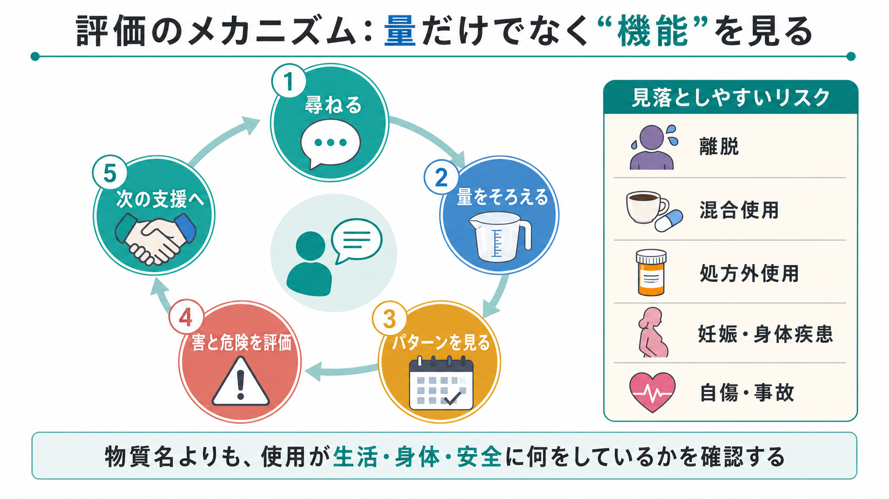
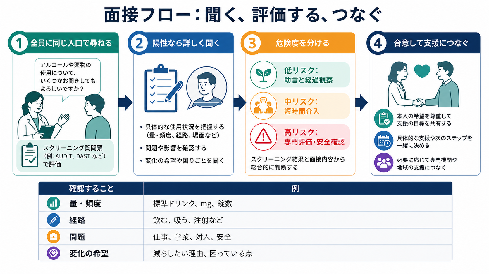

# 物質使用歴はどのように聞くべきか

## 要点

- 物質使用歴は「使ったかどうか」を詰問する項目ではなく、[[精神科面接とは何か|精神科面接]]の中で、健康・生活・安全に影響する習慣を一緒に整理する作業である。
- 最初は全員に同じ聞き方で正規化し、アルコール、タバコ・ニコチン、処方薬・市販薬、違法薬物、カフェイン、エナジードリンク、サプリメントを横断的に尋ねる。
- 評価の軸は、物質名、量、頻度、期間、経路、最終使用、増減、状況、使用目的、問題、離脱・中毒、混合使用、変化への意向である。
- AUDIT や ASSIST などのスクリーニングは、面接の代替ではなく、聞き漏らしを減らし、短時間介入や専門評価につなげるための枠組みである[1][2]。
- 医療・精神医学的には、アルコールや薬物だけでなく、睡眠薬・抗不安薬、鎮痛薬、咳止め、市販薬、カフェインの過量、複数物質の併用も重要である[5][8]。
- 本稿は教育・研究目的の整理であり、個別の診断や治療指示ではない。重い離脱、急性中毒、自傷他害リスク、妊娠、身体合併症が疑われる場合は、臨床現場の手順に従って安全確認と専門評価を優先する。

## この記事で答える問い

この記事では、[[精神科初診で何を確認するべきか|精神科初診]]や一般診療の面接で、物質使用歴をどのように切り出し、どの順番で、どこまで詳しく聞くかを扱う。特に、アルコールだけを聞いて終わらせず、処方薬・市販薬・カフェイン・ニコチン・違法薬物を同じ枠組みで整理する方法に焦点を置く。

## まず結論

聞き方の基本は、次の四段階である。

1. **正規化して入口を作る**  
   「睡眠、気分、体調に関係することがあるので、皆さんに同じように伺っています」と前置きし、非難や疑いではなく通常の健康評価として尋ねる。

2. **物質ごとに量をそろえる**  
   「飲む」「使う」だけでは量が曖昧なので、アルコールなら標準ドリンク、カフェインなら mg または商品名・本数、薬なら薬剤名・錠数・処方通りかどうか、薬物なら経路と頻度を確認する。

3. **問題と危険を評価する**  
   仕事・学業・対人関係・運転・事故・法律問題だけでなく、離脱、耐性、コントロール困難、身体疾患、精神症状、混合使用、自傷リスクを確認する。

4. **変化への意向を一緒に扱う**  
   「やめるべき」と押しつけるより、本人が困っている点、減らしたい理由、減らせない理由、支援を受けることへの抵抗を聞き、[[共同意思決定とは何か|共同意思決定]]につなげる。

## 背景

物質使用は、[[現病歴はどのように構造化するべきか|現病歴]]、睡眠、気分、不安、幻覚、認知機能、身体疾患、薬物相互作用、事故リスク、治療アドヒアランスに影響する。したがって、物質使用歴は依存症専門外来だけの項目ではなく、通常の精神科面接・一般診療で扱うべき基本情報である。

WHO の ASSIST は、アルコール、タバコ、大麻、コカイン、アンフェタミン、吸入剤、鎮静薬、幻覚薬、オピオイドなどを横断的に扱い、使用頻度、渇望、健康・社会的・法的・経済的問題、役割障害、周囲の心配、使用制御困難、注射使用を評価する枠組みである[1]。一方、WHO の AUDIT は、アルコール使用について、消費量、依存症状、有害な結果を短時間で把握するための代表的な尺度である[2]。

米国予防医学専門委員会は、成人に対して不健康なアルコール使用をスクリーニングし、リスクのある飲酒には短時間の行動カウンセリングを提供することを推奨している[3]。NIAAA も、スクリーニングを日常診療に組み込み、陽性の場合には飲酒量だけでなくアルコール使用障害の可能性や次の支援を評価することを重視している[4]。つまり、物質使用歴は「隠していることを暴く」ためではなく、リスクを早く見つけ、本人の価値や生活に沿って支援につなげるために聞く。

## 基本概念

### 入口は「疑い」ではなく「標準項目」にする

物質使用を尋ねるときに最も大切なのは、聞く側の態度である。いきなり「薬物を使っていますか」と聞くと、相手は責められている、警戒されている、通報されるのではないかと感じやすい。そこで、[[ラポールはどのように形成されるのか|ラポール]]と[[守秘義務とは何か|守秘義務]]を確認しながら、全員に尋ねる標準項目として提示する。

実際の導入は、次のように短くてよい。

> 睡眠、気分、薬の効き方、体調に関係することがあるので、アルコール、カフェイン、市販薬、処方薬、その他の物質について、皆さんに同じように伺っています。

この前置きには三つの効果がある。第一に、物質使用を道徳問題ではなく健康情報として扱える。第二に、アルコールだけでなく市販薬やカフェインも含めやすい。第三に、「自分だけ疑われている」という感覚を弱められる。

### 「使用の有無」より「パターン」を聞く

物質使用歴で必要なのは、単なる有無ではない。臨床的に重要なのは、どの物質を、どれくらい、どの頻度で、どの状況で、どの目的で使い、どのような問題が起きているかである。

| 評価軸 | 聞くこと | 例 |
|---|---|---|
| 物質名 | 何を使うか | ビール、焼酎、睡眠薬、鎮痛薬、咳止め、エナジードリンク、大麻など |
| 量 | 1回量・1日量 | 缶のサイズ、本数、錠数、mg、袋数、標準ドリンク |
| 頻度 | どれくらい使うか | 毎日、週末だけ、寝る前、試験前、気分が落ちたとき |
| 期間 | いつからか | 初回使用、増えた時期、最近の変化 |
| 経路 | どう使うか | 飲む、吸う、吸入する、注射する、舌下、鼻からなど |
| 文脈 | 何のために使うか | 眠るため、不安を下げるため、痛み、集中、社交、つらさを消すため |
| 結果 | 何が起きたか | 欠勤、遅刻、喧嘩、事故、記憶欠損、身体症状、借金、家族の心配 |
| 制御 | 減らせるか | やめようとして失敗、量が増える、渇望、離脱症状 |

### 標準化された尺度を使う

AUDIT や ASSIST は、限られた時間で聞き漏らしを減らす補助線になる[1][2]。ただし、点数だけで診断や支援方針を決めるのではなく、点数が示すリスクを面接で確認する。たとえば AUDIT が高い場合でも、飲酒量、離脱、身体合併症、運転、睡眠、抑うつ、自殺念慮、家族関係、本人の変化への意向は別に聞く必要がある。

NIDA の一般医療向け薬物スクリーニングは、過去1年の使用を短く尋ね、陽性であれば NIDA-modified ASSIST でリスクを層別化し、助言、変化への準備性の評価、支援、フォローアップや紹介につなげる流れを示している[5]。この発想は、精神科面接にもそのまま応用できる。

## 仕組み

物質使用歴を聞くときの「仕組み」は、量を聞くことだけではない。面接では、使用が本人の生活機能と安全に何をしているかを追う。

### 1. 正規化して尋ねる

まず、物質使用を健康評価の一部として位置づける。質問は、非難を含まない中立的な言い方にする。

- 「お酒は飲みますか」より「この1か月で、アルコールを飲んだ日はどれくらいありましたか」
- 「薬を乱用していませんか」より「処方された量より多く使ったり、眠るために追加で使ったりすることはありますか」
- 「薬物はやっていませんよね」より「処方薬以外の薬物や、気分を変える目的で使うものについても、医療上必要なので確認します」

### 2. 量を共通単位に近づける

アルコールでは、種類名だけでなく容器サイズと本数を聞く。ビール「2本」でも、350 mL 缶と大瓶では量が異なる。カフェインでは、コーヒー、茶、エナジードリンク、カフェイン錠、眠気覚まし飲料を合算する。FDA は、多くの成人で 1日400 mg 程度を、一般に有害な影響と関連しにくい量として説明しているが、感受性、身体疾患、薬剤、妊娠・授乳などで安全域は変わる[8]。

処方薬・市販薬では、薬剤名、用量、錠数、処方通りか、誰の薬か、追加購入、複数医療機関、ネット購入、アルコールとの併用を確認する。NIDA は、処方薬の誤用を、処方と異なる量・方法で使う、他人の処方薬を使う、陶酔目的で使うこととして整理している[5]。

### 3. 問題と危険を聞く

物質使用の臨床的重要性は、量だけでは決まらない。少量でも、運転前の飲酒、ベンゾジアゼピンとアルコールの併用、オピオイドと鎮静薬の併用、妊娠中の使用、強い希死念慮を伴う使用、注射使用などは危険度が高い。

確認する問題は、次のように分けると漏れにくい。

- 身体: 転倒、けが、肝機能、胃腸症状、睡眠、疼痛、けいれん、意識障害
- 精神: 抑うつ、不安、焦燥、幻覚、妄想、パニック、認知機能低下
- 生活: 欠勤、遅刻、学業低下、家事、育児、金銭問題
- 対人: 家族の心配、喧嘩、孤立、暴力、関係破綻
- 安全: 運転、事故、自傷、過量服薬、混合使用、急性中毒、離脱
- 医療: 処方薬との相互作用、治療中断、複数医療機関、救急受診

### 4. 離脱と急性リスクを見逃さない

重いアルコール離脱、ベンゾジアゼピン離脱、オピオイド離脱、刺激薬使用後の抑うつ、過量服薬、急性中毒は、通常の情報収集より安全確認を優先する。振戦、発汗、頻脈、けいれん、せん妄、意識障害、強い希死念慮、呼吸抑制、注射部位感染、妊娠中の使用などがあれば、緊急度を上げる。

SAMHSA TIP 42 は、物質使用と精神疾患が併存する人では、スクリーニング、評価、診断、治療計画を統合的に行う必要があると整理している[7]。面接でこの全てを一度に完結させる必要はないが、「量が多いか」だけでなく、身体合併症、精神症状、認知機能、生活環境、支援資源、治療への参加しやすさを同時に見る発想は有用である。

## 図解

物質使用歴の面接は、スクリーニング、詳しい評価、リスク層別化、短時間介入・専門評価への接続として考えると実践しやすい。

## 臨床・研究との接続

### アルコール

アルコールでは、飲酒日数、1日量、多量飲酒の日、朝酒、ブラックアウト、離脱症状、運転、身体疾患、薬剤との併用を聞く。AUDIT は、危険な飲酒、有害な飲酒、依存症状を短時間で拾うための代表的な尺度であり、短時間介入と組み合わせる前提で作られている[2]。

質問例:

- 「この1か月で、お酒を飲んだ日は週に何日くらいですか」
- 「飲む日は、何をどれくらい飲みますか。缶のサイズやグラスの大きさで教えてください」
- 「飲み始めると予定より多くなることはありますか」
- 「翌朝に手の震え、発汗、不安、吐き気が出て、飲むと楽になることはありますか」

### 処方薬・市販薬

処方薬・市販薬では、「薬を飲んでいるか」だけでは足りない。処方通りか、追加使用があるか、他人の薬を使うか、複数の医療機関で似た薬を受け取っているか、眠るため・不安を下げるため・気分を変えるために使っているかを聞く。

特に注意するのは、睡眠薬・抗不安薬、鎮痛薬、咳止め、下痢止め、刺激薬、抗ヒスタミン薬、カフェイン錠、サプリメントである。市販薬やサプリメントは「薬ではない」と認識されることがあるため、具体的な商品名や写真、持参薬で確認するとよい。

### 違法薬物・非医療的使用

違法薬物については、脅すように聞くと情報が閉じる。守秘義務の範囲と例外を説明し、医療上必要な情報として尋ねる。物質名、頻度、経路、最終使用、混合使用、注射使用、感染リスク、精神症状、事故、法律問題、周囲の支援を確認する。

質問例:

- 「処方薬以外で、眠気、気分、集中、痛み、興奮を変える目的で使ったものはありますか」
- 「吸う、飲む、鼻から使う、注射するなど、使い方を確認してもよいですか」
- 「使った後に、怖い体験、幻覚、強い不安、記憶がない時間、事故はありましたか」

### カフェイン・エナジードリンク

カフェインは見落とされやすいが、不眠、不安、動悸、焦燥、胃腸症状、離脱頭痛、睡眠リズムの乱れに関係することがある。コーヒーだけでなく、緑茶、紅茶、コーラ、エナジードリンク、眠気覚まし飲料、カフェイン錠、プレワークアウト製品を合算して尋ねる。FDA は、粉末・液体の高濃度カフェインでは毒性量に達しうること、個人差や妊娠・授乳、薬剤、身体疾患に応じた注意が必要であることを説明している[8]。

### 動機づけ面接との接続

物質使用歴を聞いた後、すぐに説得や指導に入ると、相手は防衛的になりやすい。SAMHSA TIP 35 は、物質使用障害治療における動機づけの重要性を整理し、本人の価値、両価性、変化への準備性を扱う面接を重視している[6]。これは、[[傾聴とは何か|傾聴]]、[[反映とは何か|反映]]、要約、許可を得た助言と相性がよい。

実践では、次の順序が使いやすい。

1. 本人の理解を確認する  
   「今の飲み方について、ご自身ではどのくらい気になっていますか」

2. 両価性を聞く  
   「続けたい理由と、減らしたい理由の両方があるとしたら、それぞれ何でしょう」

3. 許可を得て情報提供する  
   「睡眠薬とアルコールの組み合わせについて、医療上のリスクを短くお伝えしてもよいですか」

4. 次の一歩を合意する  
   「今週できそうな小さな変更があるとしたら、何が現実的でしょう」

## よくある誤解

### 「依存症が疑わしい人にだけ聞けばよい」

物質使用は、依存症が明らかな人だけの問題ではない。抑うつ、不安、不眠、疼痛、認知機能低下、転倒、薬物相互作用、治療中断の背景にあることがある。したがって、全員に同じ入口で聞く方が、偏見も聞き漏らしも少ない。

### 「アルコールだけ聞けば十分」

アルコールは重要だが、処方薬・市販薬、カフェイン、ニコチン、サプリメント、違法薬物も精神症状や身体症状に影響する。特に、睡眠薬・抗不安薬とアルコール、鎮痛薬と鎮静薬、エナジードリンクと不眠・不安の組み合わせは見落とされやすい。

### 「正直に答えないなら聞いても意味がない」

一度の面接で完全な情報が得られないことは多い。しかし、非難しない聞き方、守秘義務の説明、具体的な商品名や場面を使った確認、継続的な関係づくりによって、後から情報が増えることがある。[[治療関係とは何か|治療関係]]の中で、話せる範囲が変わる。

### 「点数が低ければ問題はない」

スクリーニング尺度は有用だが、状況依存のリスクまでは拾いきれない。たとえば飲酒量が少なくても、運転前、妊娠中、重い身体疾患、希死念慮、鎮静薬との併用があれば重要である。点数は、面接で何を詳しく聞くかを決める手がかりとして扱う。

## 関連ノート

- [[精神科面接とは何か]]
- [[精神科初診で何を確認するべきか]]
- [[現病歴はどのように構造化するべきか]]
- [[生活歴はなぜ重要なのか]]
- [[併存症とは何か]]
- [[鑑別診断とは何か]]
- [[守秘義務とは何か]]
- [[共同意思決定とは何か]]
- [[アドヒアランスとは何か]]
- [[インフォームドコンセントは精神科でどう行うのか]]

MOC更新候補:

- `content/00_MOC/` 配下の精神医学・精神科面接・診断関連 MOC
- 依存症、物質使用、アルコール、処方薬・市販薬、カフェインに関する MOC が作成される場合の中核ノート候補

今後の作成候補:

- アルコール使用障害とは何か
- AUDITとは何か
- ASSISTとは何か
- 動機づけ面接とは何か
- ベンゾジアゼピン使用歴はどう評価するか
- カフェイン使用は精神症状にどう影響するか

## 理解チェック

1. 物質使用歴を聞く前に「皆さんに同じように伺っています」と前置きする理由は何か。
2. アルコール使用を聞くとき、「飲みますか」だけでは不十分な理由は何か。
3. 処方薬・市販薬の評価で、処方通りかどうか以外に何を確認すべきか。
4. カフェイン使用歴が、不眠や不安の評価で重要になるのはどのような場合か。
5. スクリーニング尺度の点数が低くても、追加評価が必要になる状況を三つ挙げよ。

## 参考文献

[1] Humeniuk, R., Henry-Edwards, S., Ali, R., Poznyak, V., & Monteiro, M. G. (2010). *The Alcohol, Smoking and Substance Involvement Screening Test (ASSIST): Manual for use in primary care*. World Health Organization. https://iris.who.int/handle/10665/44320

[2] Babor, T. F., Higgins-Biddle, J. C., Saunders, J. B., & Monteiro, M. G. (2001). *AUDIT: The Alcohol Use Disorders Identification Test: Guidelines for use in primary health care* (2nd ed.). World Health Organization. https://iris.who.int/handle/10665/67205

[3] US Preventive Services Task Force. (2018). Screening and behavioral counseling interventions to reduce unhealthy alcohol use in adolescents and adults: US Preventive Services Task Force recommendation statement. *JAMA, 320*(18), 1899-1909. https://doi.org/10.1001/jama.2018.16789

[4] National Institute on Alcohol Abuse and Alcoholism. (2025). *Screen and assess: Use quick, effective methods*. https://www.niaaa.nih.gov/health-professionals-communities/core-resource-on-alcohol/screen-and-assess-use-quick-effective-methods

[5] National Institute on Drug Abuse. (2012). *Screening for drug use in general medical settings: Resource guide*. Office of Justice Programs record. https://www.ojp.gov/ncjrs/virtual-library/abstracts/screening-drug-use-general-medical-settings-resource-guide

[6] Substance Abuse and Mental Health Services Administration. (2019). *Enhancing motivation for change in substance use disorder treatment* (Treatment Improvement Protocol Series, No. 35). NCBI Bookshelf. https://www.ncbi.nlm.nih.gov/books/NBK571071/

[7] Substance Abuse and Mental Health Services Administration. (2020). *Substance use disorder treatment for people with co-occurring disorders* (Treatment Improvement Protocol Series, No. 42). NCBI Bookshelf. https://www.ncbi.nlm.nih.gov/books/NBK571020/

[8] U.S. Food and Drug Administration. (2026). *Spilling the beans: How much caffeine is too much?* https://www.fda.gov/consumers/consumer-updates/spilling-beans-how-much-caffeine-too-much
