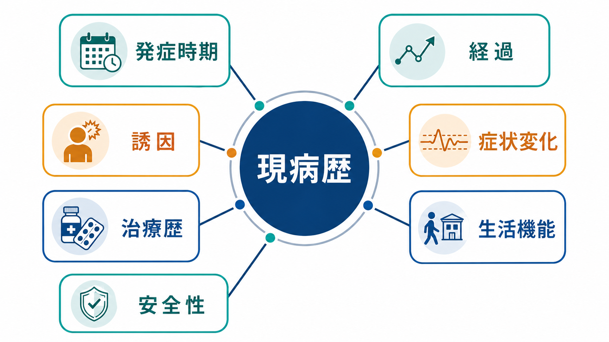
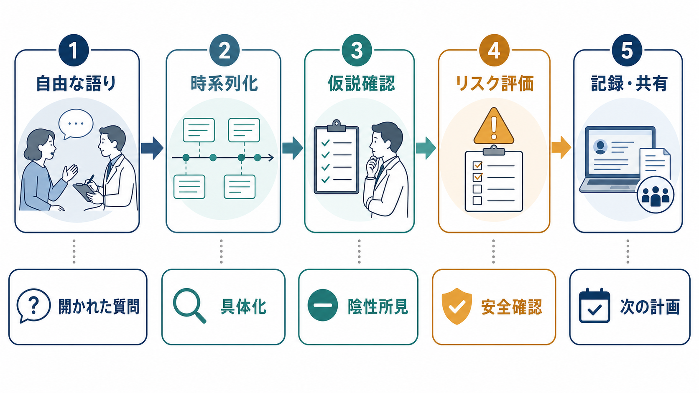

# 現病歴はどのように構造化するべきか

## 要点

- 現病歴は「現在の主訴を、最初の変化から現在までの時間軸として再構成したもの」である。
- 精神科では、症状名だけでなく、発症時期、経過、誘因、症状変化、治療歴、生活機能、安全性を同じ時系列に置く。
- よい現病歴は、患者の語りを削るのではなく、自由な語りを尊重したうえで、診断仮説・鑑別・リスク評価・記録共有に使える形へ変換する。
- 記録では「いつ」「何が」「どの程度」「何をきっかけに」「何をして」「どう変わったか」を明示し、推測と事実を混ぜない。

## この記事で答える問い

この記事では、[[精神医学とは何か]]や[[精神科診断は何のためにあるのか]]を前提に、精神科面接で得られる現病歴をどの順序で聞き、どの単位で整理し、どのように記録へ落とし込むべきかを扱う。目的は、個別の診断名を決めることではなく、診断仮説を検討できる「時間構造」を作ることである。

## まず結論

現病歴は、次の7項目を時系列で並べると構造化しやすい。

| 観点 | 聞くこと | 記録で残すこと |
|---|---|---|
| 発症時期 | いつから変化が始まったか | 初発日、初発月、または「何年前から」 |
| 基準時点 | それ以前はどのような状態だったか | 生活・仕事・学業・対人関係のベースライン |
| 経過 | 急性、亜急性、慢性、反復性、波状か | 増悪、寛解、再燃、持続のパターン |
| 誘因 | 直前の出来事、身体疾患、薬物、睡眠、ストレス | 時間的に近い出来事と、因果と断定できない点 |
| 症状変化 | どの症状が、どの順で、どの程度変化したか | 主症状、随伴症状、陰性所見、重症度 |
| 対応・治療歴 | 相談、受診、薬物、心理療法、入院、自助 | 介入内容、期間、効果、副作用、アドヒアランス |
| 現在 | 今何が一番困っているか、安全性はどうか | 生活機能、自傷他害念慮、保護因子、緊急性 |

一般的な医療記録上も、HPI（history of present illness）は「最初の徴候・症状から現在までの発展を時系列で記述するもの」とされ、期間、タイミング、文脈、修飾因子、関連症状などを含む [1]。精神科ではこの枠組みに、生活機能、過去の精神科治療、身体疾患・物質使用、安全性、社会的文脈を重ねる必要がある [2], [3]。

## 背景

精神科の現病歴は、単なる「症状のリスト」ではない。例えば「抑うつ気分がある」という情報だけでは、[[精神疾患とは何か]]を考えるうえで不十分である。いつ始まり、睡眠や食欲はどう変わり、仕事や学業にどの程度影響し、躁的な時期や物質使用、身体疾患、喪失体験、自傷念慮があるかによって、見立ては大きく変わる。

MSD Manual の精神科初期評価では、患者本人が正確な病歴を述べられるかをまず判断し、必要に応じて家族・介護者・過去の評価・治療歴などの補助情報を確認すること、また開かれた質問で患者自身の言葉を引き出すことが重視されている [2]。これは、患者の語りを尊重しながら、後で検証可能な情報へ整えるという二重の作業である。

現病歴を時系列化する意義は、鑑別診断にもある。HPI を「現在の病気の年表」として再構成する考え方は、臨床推論を支える中核として論じられており、症状の単純な列挙よりも、問題の発展過程を追うほうが診断仮説を立てやすい [4], [5]。

## 基本概念

### 1. 主訴と現病歴を分ける

主訴は、患者が受診理由として述べる短い入口である。現病歴は、その主訴がどのように生じ、変化し、現在の困りごとになったかを再構成した説明である。主訴を「不眠」と書くだけでは現病歴にならない。「3か月前の部署異動後から入眠困難が出現し、1か月前から中途覚醒と日中の集中困難が増え、2週間前から欠勤が始まった」のように、時間・症状・機能を結びつける。

### 2. 発症時期は「日付」だけではない

発症時期は、可能なら日付や月で確認する。しかし精神症状では、患者自身が明確な開始日を言えないことも多い。その場合は、「最後に普段通りだった時期」「家族や同僚が変化に気づいた時期」「生活機能が落ちた時期」を分けて聞く。症状の始まりと、受診に至るほど困った時期は一致しない。

### 3. 経過は診断仮説を変える

同じ不安や抑うつでも、数時間単位の発作、数日から数週のエピソード、数年にわたる慢性経過、反復する周期性では、考えるべき仮説が異なる。[[カテゴリ診断と次元診断は何が違うのか]]を考えるときにも、ある時点の症状の有無だけでなく、症状の持続、変動、閾値下症状、機能障害の推移を確認する必要がある。

### 4. 誘因は「原因」と断定しない

出来事が症状の前にあったからといって、それが原因とは限らない。誘因は、症状変化に時間的に近い出来事として記録する。「転職後に不眠が始まった」は事実に近いが、「転職が原因でうつ病になった」は解釈である。[[ストレス脆弱性モデルとは何か]]や[[素因ストレスモデルとは何か]]の観点からも、環境要因と個人の脆弱性・保護因子を分けて扱うほうがよい。

### 5. 治療歴は「何をしたか」より「どう反応したか」

治療歴では、薬剤名や心理療法名だけでなく、用量、期間、効果、副作用、中断理由、自己判断での変更、家族や支援者の関与を確認する。以前の治療反応は、現在の治療計画やリスク評価に影響する。MSD Manual も、過去の精神科評価、治療、治療への遵守を確認することを初期評価の重要項目としている [2]。

## 仕組み

現病歴の構造化は、患者の語りを5段階で処理する作業と考えると実践しやすい。

1. まず自由に語ってもらう。開かれた質問は、患者が自分の関心・苦痛・意味づけを表現する余地を作る [2], [6]。
2. 次に、語りの中から時間の目印を拾う。「発症前」「初発」「増悪」「受診」「現在」を仮の節目にする。
3. 各節目に、症状、誘因、対応、反応、生活機能を載せる。ここで初めて、患者の語りは臨床推論に使える年表になる。
4. 診断仮説ごとに不足情報を確認する。例えば抑うつの訴えでは、躁病・軽躁病エピソード、物質使用、身体疾患、薬剤性、喪失やトラウマ、希死念慮を確認する。
5. 最後に、記録として他者に伝わる形へ圧縮する。記録は患者の語りの全文ではなく、臨床判断に必要な時間構造である。

この処理で重要なのは、最初からチェックリストだけで聞かないことである。BMJ の病歴聴取解説でも、患者の叙述は診断だけでなく、患者が病いをどう経験しているかを理解する手がかりになるとされる [6]。精神科では、語りの内容だけでなく、語り方、まとまり、情動、思考の流れも評価対象になるため、現病歴と精神状態診察は互いに補完し合う [7]。

## 図解

現病歴は、自由な語りと臨床的整理の間を往復して作る。

実際の面接では、次のような流れで聞くと整理しやすい。

| 段階 | 面接での問い | 目的 |
|---|---|---|
| 自由な語り | 「今日はどのようなことで相談に来られましたか」 | 患者の言葉、主訴、優先順位を把握する |
| 時系列化 | 「最初に変化に気づいたのはいつ頃ですか」 | 発症時期と基準時点を作る |
| 具体化 | 「その後、良くなったり悪くなったりしましたか」 | 経過と症状変化を把握する |
| 文脈化 | 「その頃、生活や体調に変化はありましたか」 | 誘因、身体要因、社会的背景を確認する |
| 反応確認 | 「そのために何か試したことや治療はありますか」 | 治療歴、効果、副作用、中断理由を確認する |
| 安全確認 | 「死にたい気持ちや自分を傷つけたい気持ちはありますか」 | 緊急性、保護因子、支援体制を確認する |
| 要約 | 「ここまでを整理すると、...という理解で合っていますか」 | 患者との共同確認と記録の精度向上 |

自傷・自殺リスクが関わる場合、現病歴の後半で曖昧に扱うのではなく、現在の念慮、計画、手段、過去の行為、保護因子、直近のストレスを具体的に確認する。NICE は、自傷後の心理社会的評価では、歴史的要因、現在変化しうる要因、将来の要因、保護因子を含めて評価する枠組みを示している [8]。

## 臨床・研究との接続

### 診断との接続

現病歴は、[[DSMとICDは何が違うのか]]のような分類体系を使う前段階で、症状がどの時間幅で存在したかを明らかにする。診断基準はしばしば「何日以上」「何週間以上」「エピソード性か持続性か」を含むため、時系列が曖昧なままでは分類の妥当性が下がる。

### 生物心理社会モデルとの接続

[[生物心理社会モデルとは何か]]の観点では、現病歴は生物学的要因、心理的要因、社会的要因を別々の箱に入れるだけでは足りない。例えば、睡眠不足、身体疾患、服薬変更、職場ストレス、家族葛藤、孤立が、どの順序で重なったかを確認することで、単なる要因リストではなく「発症と維持のプロセス」として理解できる。

### 研究との接続

研究面では、現病歴の構造化は症例記述、診断面接、縦断研究の基礎になる。HPI を年表として整理する教育介入は、口頭症例提示と臨床推論を改善する可能性が報告されている [5]。精神医学研究でも、発症年齢、未治療期間、再発回数、治療反応、機能予後などは、症状の横断面だけでは測れない。

## よくある誤解

### 誤解1: 現病歴は長く書けばよい

長い記録がよい記録とは限らない。重要なのは、診断仮説と安全確認に必要な時間構造が残っていることである。細部が多くても、発症時期、増悪時期、治療反応、現在の緊急性が不明なら、現病歴としては弱い。

### 誤解2: 患者の言葉をそのまま並べればよい

患者の言葉は重要だが、記録では事実、患者の主観、臨床家の解釈を区別する必要がある。「本人は『急に壊れた』と表現する」「家族は2か月前から活動低下に気づいた」「臨床的には亜急性の機能低下と考えられる」のように層を分ける。

### 誤解3: 誘因を見つければ説明は終わる

誘因は説明の一部であって、全体ではない。誘因があっても、症状の持続、回復を妨げる要因、保護因子、治療反応を見なければ、臨床的な見立ては不十分である。

### 誤解4: リスク評価は最後に別項目でよい

安全性は現病歴の中に埋め込むべきである。希死念慮や自傷行為は「現在あるか」だけでなく、「いつから」「何をきっかけに」「どの程度具体化し」「過去と比べてどう変化したか」を時系列で扱う。

## 関連ノート

- [[精神医学とは何か]]
- [[精神科診断は何のためにあるのか]]
- [[精神疾患とは何か]]
- [[DSMとICDは何が違うのか]]
- [[カテゴリ診断と次元診断は何が違うのか]]
- [[生物心理社会モデルとは何か]]
- [[ストレス脆弱性モデルとは何か]]
- [[素因ストレスモデルとは何か]]

MOC更新候補: `content/00_MOC/` 配下の精神医学・診断・面接関連MOCに、本記事へのリンクを追加する。

## 理解チェック

1. 主訴と現病歴の違いを一文で説明できるか。
2. 「発症時期」と「受診に至った時期」がずれる例を挙げられるか。
3. 症状、誘因、治療歴、生活機能、安全性を同じ時系列に並べられるか。
4. 誘因を「原因」と断定せずに記録する文を作れるか。
5. 自傷・自殺リスクを、現在の有無だけでなく時間変化として確認できるか。

## 参考文献

[1] Centers for Medicare & Medicaid Services. (1995). *1995 Documentation Guidelines for Evaluation and Management Services*. https://www.cms.gov/files/document/1995dgpdf

[2] First, M. B., & Zimmerman, M. (2026). *Initial Psychiatric Assessment*. MSD Manual Professional Edition. Reviewed/Revised Oct 2024; Modified Jan 2026. https://www.msdmanuals.com/professional/psychiatric-disorders/approach-to-the-patient-with-psychiatric-symptoms/initial-psychiatric-assessment

[3] Silverman, J. J., Galanter, M., Jackson-Triche, M., et al. (2015). The American Psychiatric Association Practice Guidelines for the Psychiatric Evaluation of Adults. *American Journal of Psychiatry*, 172(8), 798-802. https://doi.org/10.1176/appi.ajp.2015.1720501

[4] Skeff, K. M. (2014). Reassessing the HPI: The Chronology of Present Illness (CPI). *Journal of General Internal Medicine*, 29(1), 13-15. https://doi.org/10.1007/s11606-013-2573-3

[5] Kilian, A., Upton, L. A., & Sheagren, J. N. (2020). Reorganizing the History of Present Illness to Improve Verbal Case Presenting and Clinical Diagnostic Reasoning Skills of Medical Students: The All-Inclusive History of Present Illness. *Journal of Medical Education and Curricular Development*. https://doi.org/10.1177/2382120520928996

[6] Shah, N. (2005). Taking a history: Introduction and the presenting complaint. *BMJ*, 331(Suppl S3), 0509314. https://doi.org/10.1136/sbmj.0509314

[7] Voss, R. M., & Das, J. M. (2024). *Mental Status Examination*. StatPearls, NCBI Bookshelf. https://www.ncbi.nlm.nih.gov/books/NBK546682/

[8] National Institute for Health and Care Excellence. (2022). *Self-harm: assessment, management and preventing recurrence* (NICE Guideline NG225). https://www.nice.org.uk/guidance/ng225

## 未解決問題

- 精神科初診の限られた時間で、どこまで詳細な時系列を取るべきか。
- 患者本人の語り、家族情報、過去記録が矛盾するとき、どのように記録の信頼度を表現するか。
- 電子カルテのテンプレート化が、患者固有の語りや臨床推論を過度に削らないための設計は何か。
