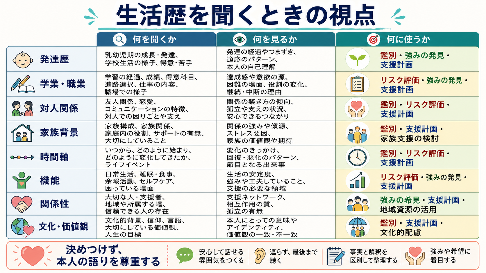
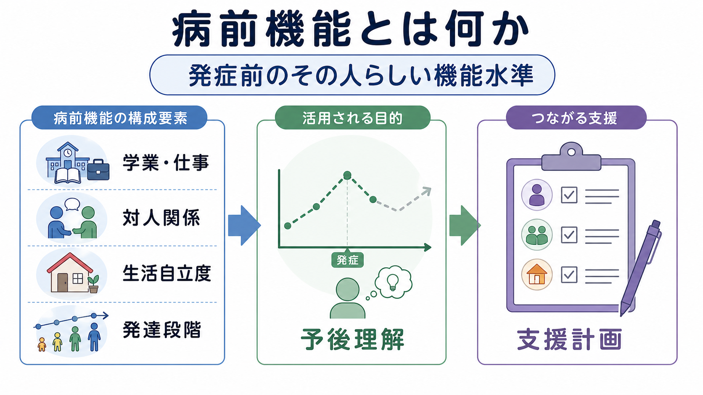

# 生活歴はなぜ重要なのか

## 要点

- 生活歴は、症状の「原因を一つに決める情報」ではなく、症状がどの時間軸・関係性・役割・文化的文脈の中で現れ、維持され、変化してきたかを理解するための情報である。
- 発達歴、学業、職業、対人関係、家族背景は、現在の困りごとを[[精神科診断は何のためにあるのか|診断名]]だけに閉じ込めず、機能、リスク、保護因子、支援可能性へ接続する。
- 精神科初回評価では、症状、治療歴、物質使用、身体疾患、トラウマ歴、自傷他害リスク、文化的要因などを含めて評価することが推奨されており、生活歴はその横糸になる[1]。
- ただし生活歴を聞くことは、本人や家族を責めることではない。本人の語りを尊重し、決めつけず、必要な範囲で段階的に確認する姿勢が重要である。

## この記事で答える問い

1. 生活歴は、精神科面接でなぜ必要なのか。
2. 発達歴・学業・職業・対人関係・家族背景は、症状理解にどう関わるのか。
3. 生活歴を聞くとき、どのような誤解や倫理的注意があるのか。
4. 生活歴は、臨床・研究・支援計画にどう接続されるのか。

## まず結論

生活歴が重要なのは、症状を「現在のチェックリスト」だけでなく、「その人がどのような環境で発達し、何を学び、どの役割を担い、誰と関係を作り、どのような負荷と支えの中で生きてきたか」という時間的・社会的文脈の中に置き直せるからである。

同じ不眠、抑うつ、不安、怒り、注意困難、幻聴、引きこもりでも、発症時期、学校や職場での機能低下、家庭内の役割、対人関係の変化、喪失体験、差別や貧困、トラウマ、支援者の有無によって、臨床的な意味は変わる。これは[[生物心理社会モデルとは何か|生物心理社会モデル]]の実践でもある。生物学的要因を無視するのではなく、心理的意味づけ、社会的条件、生活機能を同時に見て、より妥当な理解と支援仮説を作る[2]。

## 背景

精神医学では、診断名は必要だが、それだけで十分ではない。[[DSMとICDは何が違うのか|DSMやICD]]のような診断体系は、症状群を共有可能な言葉にする一方で、その人の生活機能、発症までの経路、持続要因、回復資源までは自動的に説明しない。したがって、[[操作的診断とは何か|操作的診断]]と生活歴の聴取は対立するものではなく、相補的である。

APAの成人精神科評価ガイドラインは、初回評価において症状、トラウマ歴、治療歴、物質使用、身体疾患、文化的要因、リスク評価などを確認することを推奨している[1]。ここで生活歴は、各項目をばらばらのチェック項目にせず、「いつ、どこで、何が変わったのか」「何が負荷で、何が支えだったのか」を結びつける役割を持つ。

また、WHOのICFは、機能と障害を健康状態だけでなく環境因子との相互作用として捉える枠組みである[3]。精神科面接における生活歴も、単に過去を聞く作業ではなく、現在の活動、参加、役割、支援環境を理解する作業だといえる。

## 基本概念

### 生活歴

生活歴とは、発達、家族、教育、仕事、対人関係、住環境、経済状況、文化・価値観、喪失、トラウマ、身体疾患、治療歴、支援資源などを、時間軸に沿って整理した情報である。病歴が「症状の経過」を中心にするのに対し、生活歴は「症状が生じた生活世界」を扱う。

生活歴を聞く目的は、過去の出来事から単純な原因を探すことではない。むしろ、[[精神疾患とは何か|精神疾患]]の症状が、発達段階、対人関係、社会的役割、身体状態、文化的意味づけの中でどのように経験されているかを理解することにある。

### 発達歴

発達歴では、乳幼児期から青年期までの発達、言語・運動・社会性、こだわりや感覚過敏、注意や衝動性、学習上の困難、いじめ、養育環境、転居、喪失、虐待やネグレクトなどを確認する。発達精神病理学は、精神的困難を一時点の異常としてではなく、発達過程と環境との相互作用として捉える[4]。

たとえば、幼少期から続く対人理解の難しさ、青年期から目立つ気分変動、成人後の過重労働を契機にした不眠は、それぞれ異なる時間軸を持つ。発達歴は、現在の症状が「急に生じたものか」「以前からの特性が負荷で顕在化したものか」「環境変化で維持されているものか」を考える手がかりになる。

### 学業・職業歴

学業と職業の履歴は、能力や努力の評価ではなく、機能と環境適合を知る情報である。出席、成績、得意不得意、進路選択、職場適応、休職、転職、過重労働、ハラスメント、失業、経済的不安は、症状の出方と回復可能性に影響する。

社会的決定要因の研究は、教育、雇用、所得、住環境、差別、食料や医療へのアクセスなどが精神的健康に関わることを示している[5][6]。したがって「仕事が続かない」という情報は、本人の性格だけで説明するのではなく、症状、職場環境、支援制度、スキル、健康状態、社会的不利を含めて検討する必要がある。

### 対人関係と家族背景

対人関係と家族背景は、ストレス源にも保護因子にもなる。家族内の役割、支配・依存・孤立、親密な関係、友人、支援者、地域とのつながり、ケア責任、暴力や虐待、喪失体験は、症状の維持や回復を左右する。

特に逆境的小児期体験やトラウマは、成人期のうつ、不安、PTSD、自殺関連アウトカムなどと関連することがメタ分析で示されている[7]。ただし、逆境体験があるから特定の診断になる、という意味ではない。逆境はリスクを高めるが、本人の解釈、支援、治療、社会環境、回復資源によって経過は変わる。

## 仕組み

生活歴が症状理解に役立つ仕組みは、少なくとも四つに分けられる。

第一に、生活歴は時間軸を与える。いつから始まり、何を契機に悪化し、何で軽くなり、どの時期に機能が保たれていたのかがわかると、症状を一枚の静止画ではなく経過として読める。

第二に、生活歴は文脈を与える。学校、職場、家庭、地域、文化、経済状況、身体疾患、支援制度の中で症状を見ると、単なる「本人の問題」ではなく、環境との相互作用として理解できる。

第三に、生活歴は意味づけを与える。同じ症状でも、本人が「怠けている証拠」と捉えるのか、「危険を避けるための反応」と捉えるのか、「誰にも理解されない苦痛」と捉えるのかで、苦痛の質と支援の入り口が変わる。DSM-5の文化的定式化面接は、本人の病気理解、社会的文脈、ストレス、支援、治療期待を体系的に聞く枠組みを提供している[8]。

第四に、生活歴は介入仮説を作る。[[ストレス脆弱性モデルとは何か|ストレス脆弱性モデル]]や[[素因ストレスモデルとは何か|素因ストレスモデル]]のように、素因、誘因、持続因子、保護因子を整理すると、どこを変えれば生活機能が戻りやすいかを検討できる。

生活歴を使った理解は、5Pフォーミュレーションに近い形で整理できる。

| 視点 | 生活歴から見る問い | 例 |
|---|---|---|
| Presenting problem | いま何に困っているか | 不眠、抑うつ、欠勤、対人回避 |
| Predisposing factors | もともとの脆弱性や背景は何か | 発達特性、慢性疾患、貧困、孤立、家族内暴力 |
| Precipitating factors | 何を契機に悪化したか | 進学、就職、失職、出産、喪失、ハラスメント |
| Perpetuating factors | 何が維持しているか | 睡眠リズムの崩れ、回避、家族葛藤、過重労働 |
| Protective factors | 何が支えになっているか | 信頼できる人、得意分野、制度利用、治療関係、[[精神医学におけるレジリエンスとは何か|レジリエンス]] |

## 図解

生活歴の聴取は、情報を多く集めること自体が目的ではない。臨床的には、「どの情報が現在の困りごとに関係しているか」「どの情報が本人の強みや支援計画に使えるか」を見極める。

図解としては、次の三層で考えると整理しやすい。

| 層 | 見るもの | 臨床的な意味 |
|---|---|---|
| 時間軸 | 発症前、発症時、悪化時、回復時 | 症状の経過と転機を読む |
| 生活機能 | 学校、仕事、家事、対人関係、睡眠 | 困りごとの実際の影響を把握する |
| 意味と資源 | 本人の理解、価値観、支援者、制度 | 治療関係と支援計画につなげる |

## 臨床・研究との接続

### 面接

生活歴を聞く面接では、すべてを初回に聞き切ろうとしない。とくにトラウマ、虐待、家族内暴力、いじめ、性被害、差別、経済的困窮は、本人の安全感と同意を確認しながら扱う必要がある。精神科評価でトラウマ歴が重要である一方、聞き方が侵襲的であれば、面接そのものが負担になる。

実践上は、開かれた質問から始め、本人が話しやすい順番を尊重する。「そのころ、生活の中で何が一番大変でしたか」「何が支えになっていましたか」「学校や仕事では、どの場面が特につらかったですか」のように、出来事、機能、意味、支えを分けて確認する。

### ケースフォーミュレーション

ケースフォーミュレーションでは、生活歴を診断名の補足ではなく、支援仮説の中心に置く。たとえば抑うつ症状がある人でも、主な持続因子が睡眠不足、対人葛藤、孤立、職場負荷、身体疾患、未処理の喪失体験、物質使用、貧困のどれに近いかで、支援の優先順位は変わる。

このとき重要なのは、生活歴を「説明しすぎない」ことである。過去の出来事は現在を理解する材料だが、本人の将来を固定するものではない。臨床では、リスク因子だけでなく保護因子、本人の価値、成功体験、関係資源、制度資源を同時に見る。

### 研究

研究では、生活歴はライフコース、社会的決定要因、発達精神病理、トラウマ研究、機能評価の接点になる。教育歴、雇用、家族構成、幼少期逆境、差別、社会的孤立、住環境などは、精神症状の発症率、重症度、治療アクセス、再発、生活機能と関連する。

ただし、生活歴データは測定誤差や想起バイアスを受けやすい。横断研究だけで因果を断定しないこと、文化や制度の違いを考慮すること、リスクの記述がスティグマにつながらないようにすることが必要である。

## よくある誤解

### 誤解1：生活歴を聞くのは、家族や過去のせいにするためである

そうではない。生活歴は責任追及ではなく、症状がどの条件で生じ、何で維持され、何で回復しやすいかを理解するための情報である。家族背景を聞くときも、家族を単純に「原因」として扱うのではなく、負荷、役割、支援、文化、制度の中で見る。

### 誤解2：生活歴は診断より主観的で、科学的ではない

生活歴には主観的語りが含まれるが、それは科学性の欠如ではない。精神科診断そのものも、症状、経過、機能、文脈を含む臨床情報に基づく。生活歴は、診断を曖昧にするのではなく、診断の妥当性、鑑別、重症度、支援可能性を検討するための材料になる。

### 誤解3：トラウマを聞けば、すべて説明できる

トラウマや逆境体験は重要なリスク因子だが、すべての症状を説明する万能鍵ではない。生活歴では、逆境だけでなく、身体疾患、睡眠、物質使用、神経発達、認知機能、社会的孤立、経済状況、文化的意味づけ、保護因子を同時に見る必要がある。

### 誤解4：強みを聞くのは、つらさを軽く見ることである

強みや支えを聞くことは、苦痛を否定することではない。むしろ、本人がどの条件で機能を保てたか、誰といると安全感があるか、何を大切にしているかを知ることで、より現実的な支援計画を作れる。

## 関連ノート

- [[精神科診断は何のためにあるのか]]
- [[生物心理社会モデルとは何か]]
- [[精神疾患とは何か]]
- [[操作的診断とは何か]]
- [[DSMとICDは何が違うのか]]
- [[ストレス脆弱性モデルとは何か]]
- [[素因ストレスモデルとは何か]]
- [[精神医学におけるレジリエンスとは何か]]

## MOC更新候補

- `content/00_MOC/` 配下の精神医学・診断・面接系 MOC に、バッチ統合時に `[[生活歴はなぜ重要なのか]]` を追加候補とする。

## 理解チェック

1. 生活歴は、症状の単一原因を探すためではなく、何を理解するための情報か。
2. 発達歴、学業・職業歴、対人関係、家族背景は、それぞれどのようにリスク因子と保護因子の両方になりうるか。
3. 生活歴を聞くとき、本人や家族を責める説明にしないためには、どのような聞き方が必要か。
4. 診断名とケースフォーミュレーションは、どのように役割が違うか。

## 未解決問題

- 生活歴情報を電子カルテや研究データとして扱うとき、プライバシー、スティグマ、再利用範囲をどう設計するか。
- 逆境体験や社会的不利をリスクとして記述しながら、本人や家族へのラベリングを避ける臨床記述法をどう標準化するか。
- 生活歴を十分に聞く時間が限られる現場で、どの項目を優先し、どのタイミングで深めるか。

## 参考文献

[1] American Psychiatric Association. (2015). *Practice Guidelines for the Psychiatric Evaluation of Adults, Third Edition*. American Psychiatric Association. https://doi.org/10.1176/appi.books.9780890426760

[2] Engel, G. L. (1977). The need for a new medical model: a challenge for biomedicine. *Science*, 196(4286), 129-136. https://doi.org/10.1126/science.847460

[3] World Health Organization. (2001). *International Classification of Functioning, Disability and Health (ICF)*. https://www.who.int/standards/classifications/international-classification-of-functioning-disability-and-health

[4] Cicchetti, D., & Toth, S. L. (2009). The past achievements and future promises of developmental psychopathology. *Journal of Child Psychology and Psychiatry*, 50(1-2), 16-25. https://doi.org/10.1111/j.1469-7610.2008.01979.x

[5] World Health Organization & Calouste Gulbenkian Foundation. (2014). *Social determinants of mental health*. World Health Organization. https://iris.who.int/handle/10665/112828

[6] Alegría, M., NeMoyer, A., Falgàs Bagué, I., Wang, Y., & Alvarez, K. (2018). Social determinants of mental health: where we are and where we need to go. *Current Psychiatry Reports*, 20, 95. https://doi.org/10.1007/s11920-018-0969-9

[7] Thurston, C., Murray, A. L., Franchino-Olsen, H., Silima, M., Hemady, C. L., & Meinck, F. (2025). Prospective longitudinal associations between adverse childhood experiences and adult mental health outcomes: systematic review and meta-analysis. *Trauma, Violence, & Abuse*. https://doi.org/10.1177/15248380251358223

[8] Lewis-Fernández, R., Aggarwal, N. K., Bäärnhielm, S., Rohlof, H., Kirmayer, L. J., Weiss, M. G., et al. (2014). Culture and psychiatric evaluation: operationalizing cultural formulation for DSM-5. *Psychiatry*, 77(2), 130-154. https://doi.org/10.1521/psyc.2014.77.2.130
