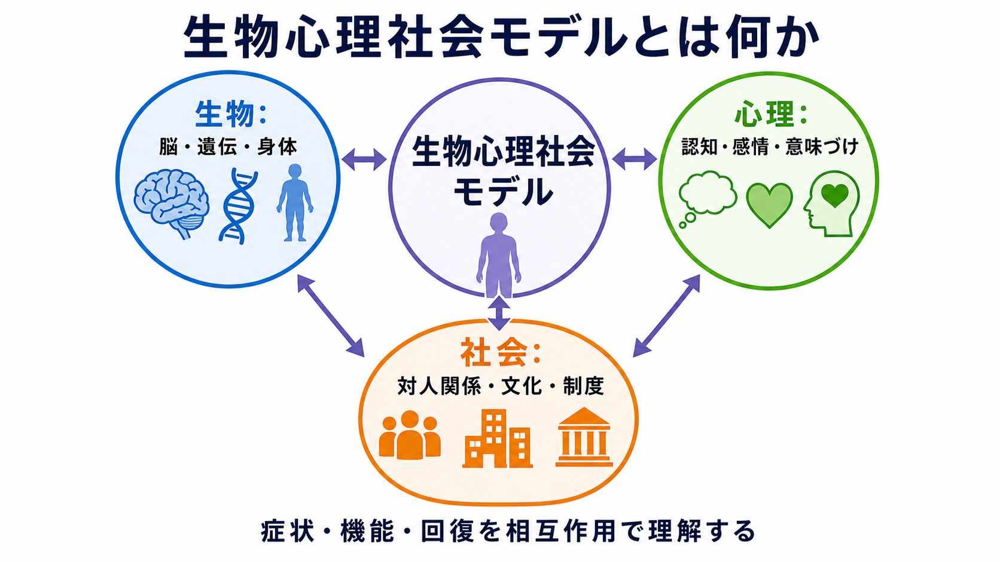
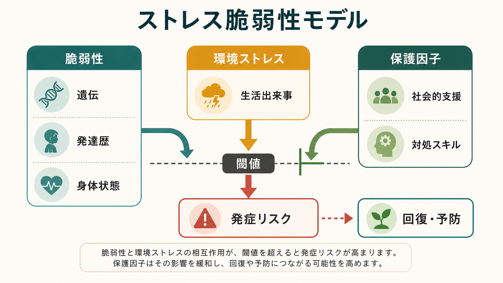
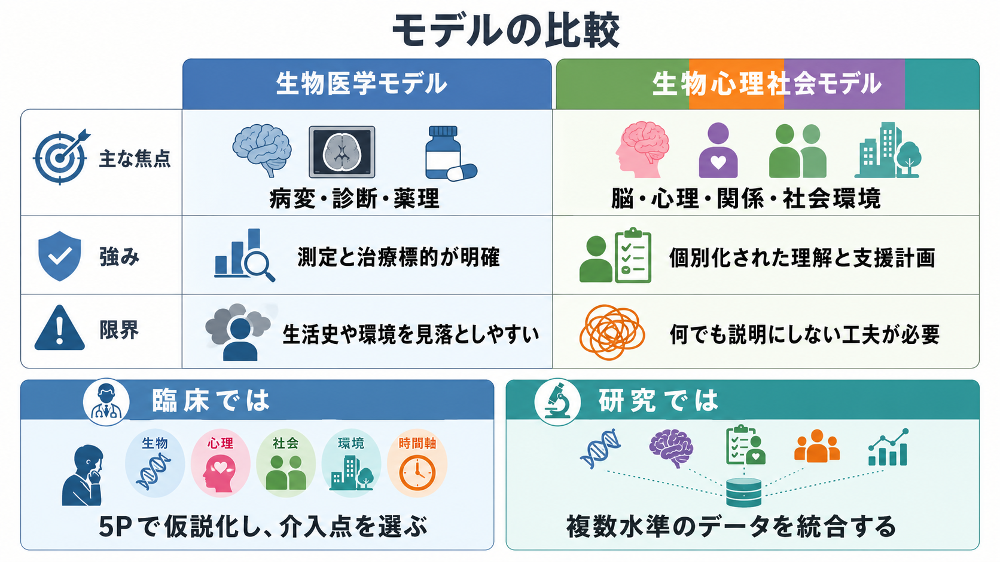

# 生物心理社会モデルとは何か

## 要点

- 生物心理社会モデルは、疾患や苦痛を「脳や身体だけ」「心だけ」「社会だけ」に還元せず、複数水準の相互作用として理解する枠組みである[1][2]。
- 精神疾患では、遺伝、神経発達、睡眠、炎症、ストレス系、認知、感情調整、対人関係、文化、貧困、差別、制度的支援が、リスク・症状・回復を変える[3][5]。
- 臨床では、診断名を置き換える理論ではなく、診断のあとに「この人では何が維持因子で、どこに介入できるか」を整理するために使う。
- 有用に使うには、何でも並べるだけでなく、仮説、優先順位、検証可能な介入点に落とし込む必要がある[2][8]。
- 医療・精神医学の文脈では、個別診断や治療指示としてではなく、教育・研究・臨床推論の補助枠組みとして理解する。

## この記事で答える問い

この記事では、次の問いに答える。

1. 生物心理社会モデルは、生物医学モデルと何が違うのか。
2. 精神疾患を「脳・心理・対人関係・社会環境の相互作用」として見るとは、具体的に何を意味するのか。
3. 臨床面接、ケースフォーミュレーション、研究では、どのように使えるのか。
4. 「何でもあり」「原因を社会に押しつける」「脳科学を否定する」という誤解をどう避けるか。

## まず結論

生物心理社会モデルとは、精神疾患を単一原因で説明するための理論ではなく、複数の説明水準を同時に扱うための見取り図である。たとえば、うつ病を理解するとき、脳内神経回路、睡眠、身体疾患、認知の偏り、喪失体験、家族関係、職場環境、経済的不安、文化的意味づけは、互いに独立した「別々の原因」ではない。睡眠不足は脅威知覚を高め、脅威知覚は対人回避を強め、対人回避は孤立と活動低下を深め、孤立はさらに睡眠やストレス反応を乱す、という循環を作りうる。

このモデルの強みは、症状を「本人の弱さ」や「脳だけの故障」として単純化しない点にある。一方で、弱点は、使い方を誤ると「生物・心理・社会を全部書いただけ」の曖昧なリストになりやすい点である。したがって実践では、[[HPA軸は精神疾患にどう関わるのか]]、[[RDoCは精神疾患研究をどう変えたのか]]、[[モチベーション面接は行動変容をどう支えるのか]]のような個別の理論や測定枠組みと接続し、「どの因子が、どの経路で、どの時点の症状や機能に関わっているのか」を仮説化する必要がある。

## 背景

生物心理社会モデルを広く提案したのは、内科医・精神科医の George L. Engel である。Engel は1977年の論文で、当時支配的だった生物医学モデルが、疾患を主に生化学的・身体的異常として扱い、心理的・社会的・行動的側面を十分に扱えないと批判した[1]。彼の主張は、身体疾患を否定するものではなく、むしろ生物学的知見を患者の生活世界、主観的経験、対人関係の中に位置づけ直す試みだった。

その後、このモデルはプライマリケア、精神医学、リハビリテーション、慢性疼痛、障害学、公衆衛生などに広がった。Borrell-Carrió らは、生物心理社会モデルを「臨床ケアの哲学」であると同時に「実践的な臨床ガイド」として整理し、苦痛・疾患・病いが分子から社会までの複数水準に影響されると述べた[2]。WHO の ICF も、機能障害を健康状態だけでなく、環境因子や個人因子との関係で記述する枠組みを採用しており、機能と生活を文脈の中で捉える発想と親和性が高い[4]。

精神医学では、このモデルは特に重要である。精神疾患の診断名は、症状群、経過、機能障害を整理するために有用だが、同じ診断名の人でも、発症経路、維持因子、回復資源は大きく異なる。したがって、診断だけでは「なぜこの人が、今、この症状で困っているのか」「どこから支援すればよいのか」は十分に説明できない。

## 基本概念

### 生物

生物の水準には、遺伝的脆弱性、神経発達、神経伝達、脳回路、内分泌、免疫、睡眠、身体疾患、薬物、疼痛、栄養、加齢などが含まれる。精神疾患を生物心理社会モデルで見ることは、生物学を軽視することではない。むしろ、脳や身体の変化が、心理的意味づけや社会環境とどのように結びつくかを見る。

たとえば慢性的ストレスは、[[HPA軸は精神疾患にどう関わるのか]]で扱うようなストレス反応系、睡眠、炎症、記憶、情動調整に影響しうる。逆に、対人支援、安心できる環境、活動リズムの回復は、生物学的ストレス反応を変える可能性がある。

### 心理

心理の水準には、注意、記憶、予測、認知的評価、感情調整、回避、学習、動機づけ、自己効力感、アイデンティティ、価値、意味づけが含まれる。ここでいう心理は「気の持ちよう」ではない。出来事をどう予測し、どう評価し、どのような行動で対処するかという情報処理と行動選択の水準である。

たとえば同じ身体感覚でも、「危険な病気の前兆だ」と解釈される場合と、「疲労や緊張のサインだ」と解釈される場合では、不安、回避、受診行動、生活制限が変わる。心理的過程は、社会環境や身体状態に反応するだけでなく、それらを変える行動にもつながる。

### 社会

社会の水準には、家族、友人、学校、職場、地域、医療制度、経済状況、住環境、文化、ジェンダー、差別、暴力、災害、移民経験、スティグマが含まれる。WHO は、精神健康が個人・家族・コミュニティ・構造的要因の組み合わせで保護されたり損なわれたりすると整理している[5]。

社会因子は、単なる背景情報ではない。たとえば貧困や差別は、慢性的ストレス、睡眠の質、医療アクセス、将来予測、自己評価、対人信頼に影響する。逆に、就労支援、住居支援、家族調整、学校・職場の合理的配慮は、症状そのものだけでなく、生活機能と回復可能性を変える。

## 仕組み

生物心理社会モデルの中心は、線形因果よりも循環因果である。ある社会的ストレスが心理的評価を変え、それが身体反応や行動を変え、その行動がさらに社会環境を変える。精神疾患の症状は、このような循環の中で増幅されたり、緩和されたりする。

たとえば、職場での孤立や過重労働が続くと、本人は「失敗できない」「評価されない」と予測しやすくなる。睡眠が乱れ、疲労と注意低下が起こる。仕事の能率が落ち、さらに叱責や自己批判が増える。すると回避、欠勤、対人接触の減少が起こり、社会的支援が減る。この循環は、抑うつ、不安、身体症状、生活機能低下として現れることがある。

ここで重要なのは、「最初の原因」を一つに決めることではない。むしろ、現在の困りごとを維持している環を見つけ、どこを変えると全体が動くかを考えることである。薬物療法は睡眠、気分、不安、精神病症状、衝動性などの生物学的・症状水準に作用しうる。心理療法は解釈、回避、感情調整、対人行動を扱う。環境調整や福祉的支援は、ストレス源、資源、役割、アクセスを変える。これらは競合するのではなく、異なる水準の介入点である。

## 図解

生物心理社会モデルは、生物医学モデルの否定ではなく、補助的な拡張として考えると理解しやすい。感染症、薬物副作用、内分泌疾患、神経疾患、せん妄などでは、生物医学的評価が不可欠である。一方で、慢性疾患、精神疾患、疼痛、依存、発達特性、トラウマ関連症状では、症状だけでなく生活文脈と機能を同時に見る必要がある。

臨床での簡単な使い方は、次のように整理できる。

| 視点 | 典型的な問い | 介入の例 |
|---|---|---|
| 生物 | 睡眠、身体疾患、薬物、神経発達、疼痛、内分泌、物質使用は関係するか | 身体評価、薬物療法、睡眠調整、疼痛管理、物質使用支援 |
| 心理 | どのような予測、意味づけ、回避、対処、価値葛藤があるか | 心理教育、認知行動療法、曝露、感情調整、[[モチベーション面接は行動変容をどう支えるのか]] |
| 対人 | 家族、友人、支援者、職場・学校との関係は症状をどう変えるか | 家族面接、対人関係療法、支援者連携、職場・学校調整 |
| 社会 | 住居、経済、制度、差別、文化、医療アクセスはどう関係するか | 福祉制度利用、就労支援、住居支援、権利擁護、地域資源 |

## 臨床・研究との接続

### ケースフォーミュレーション

臨床では、生物心理社会モデルはケースフォーミュレーションの土台になる。診断名を確認したうえで、現在の症状を生み出し、維持し、悪化・改善させる因子を仮説化する。特に 5P、すなわち presenting problem（主訴）、predisposing factors（素因）、precipitating factors（誘発因子）、perpetuating factors（維持因子）、protective factors（保護因子）と組み合わせると、単なるリストを超えて臨床判断に使いやすくなる。

たとえば同じパニック症状でも、甲状腺機能、カフェイン、睡眠不足、予測不安、身体感覚への注意、回避、家族の巻き込み、職場の負荷、医療アクセスによって、介入の優先順位は変わる。モデルの目的は「全部に介入する」ことではなく、最小限で効果的な介入点を見つけることである。

### 診断面接と文化

生物心理社会モデルは、診断面接における文化的理解とも結びつく。APA の DSM-5-TR Cultural Formulation Interview は、本人が問題をどう名づけ、原因をどう理解し、家族やコミュニティがどう見ており、どのような支援や障壁があるかを探索する半構造化面接である[6]。これは、症状を単にチェックリスト化するだけでは見えにくい意味づけ、支援資源、期待、文化的文脈を把握するために役立つ。

ただし、文化を「特定の国籍や民族の特徴」として固定的に扱ってはいけない。文化は、家族、宗教、世代、職場、医療経験、ジェンダー、地域、言語、制度との関係の中で変わる。臨床では、一般論よりも本人の語りを優先する。

### 研究

研究では、生物心理社会モデルは、複数水準のデータを接続する問題として現れる。たとえば [[RDoCは精神疾患研究をどう変えたのか]]は、診断名だけでなく、行動、自己報告、生理、神経回路、遺伝、環境を横断して精神病理を理解しようとする枠組みである[7]。生物心理社会モデルは RDoC と同一ではないが、「診断名だけでなく水準間の関係を見る」という点で接続できる。

一方で、研究として使うには、抽象的な「生物・心理・社会」では不十分である。どの生物指標、どの心理過程、どの社会条件を測るのかを明確にし、時間順序、媒介、調整、相互作用を検証する必要がある。そうしなければ、モデルは説明力のある理論ではなく、何でも入る箱になってしまう。

## よくある誤解

### 誤解1: 生物心理社会モデルは脳科学を否定する

否定しない。むしろ、脳科学を臨床的・生活的文脈の中に置く。神経回路、神経伝達、内分泌、炎症、睡眠、身体疾患は重要である。ただし、それらが対人関係、意味づけ、ストレス、文化、制度と切り離されて働くわけではない、というのがこのモデルの立場である。

### 誤解2: 社会のせいにすればよい

これも誤りである。社会因子は重要だが、本人の身体状態、心理的対処、症状の重症度、治療反応を無視してよいわけではない。また、社会因子を指摘するだけで支援が成立するわけでもない。臨床では、本人が実際に使える支援、制度、関係、環境調整に落とし込む必要がある。

### 誤解3: 全部を見ればよい

全部を同じ重みで見ると、かえって判断できなくなる。生物心理社会モデルは、情報を増やすためだけの道具ではなく、優先順位をつけるための道具である。急性の自殺リスク、せん妄、躁状態、精神病症状、重篤な身体疾患が疑われる場合は、まず安全確保と医学的評価が優先される。そのうえで、維持因子と回復資源を整理する。

### 誤解4: モデルだから科学的に完成している

生物心理社会モデルには批判もある。Ghaemi は、このモデルが現代精神医学の標準的発想になった一方で、過度に折衷的になり、具体的な研究や治療選択を導きにくいと批判した[8]。この批判は重要である。モデルを有用にするには、測定可能な仮説、時間経過、介入効果、代替説明を明確にする必要がある。

## 関連ノート

既存ノート:

- [[RDoCは精神疾患研究をどう変えたのか]]
- [[HPA軸は精神疾患にどう関わるのか]]
- [[モチベーション面接は行動変容をどう支えるのか]]
- [[海馬萎縮はストレスやうつ病と関係するのか]]
- [[扁桃体過活動は不安症やPTSDにどう関わるのか]]

今後の作成候補:

- 5Pモデルとは何か
- ケースフォーミュレーションとは何か
- 文化的定式化面接とは何か
- 精神疾患の社会的決定要因とは何か
- 生物医学モデルとは何か
- DSMとICDは何が違うのか
- GAFやWHODASは何を評価するのか

MOC更新候補:

- `content/00_MOC/` 配下の精神医学、診断・面接、臨床推論、心理社会的支援関連 MOC に追加候補。
- 並列ジョブとの衝突を避けるため、このタスクでは MOC 本体は更新しない。

## 理解チェック

1. 生物心理社会モデルは、精神疾患を単一原因で説明する理論ではなく、何を整理するための枠組みか。
2. 生物・心理・社会の因子を列挙するだけでは不十分な理由は何か。
3. 同じ診断名でも、ケースフォーミュレーションが異なると介入方針が変わるのはなぜか。
4. 生物心理社会モデルへの批判として、「折衷的すぎる」とは何を意味するか。
5. 自分が臨床・研究で使うなら、どの因子を測定可能な仮説として扱うか。

## 参考文献

[1] Engel, G. L. (1977). The need for a new medical model: A challenge for biomedicine. *Science, 196*(4286), 129-136. https://doi.org/10.1126/science.847460

[2] Borrell-Carrió, F., Suchman, A. L., & Epstein, R. M. (2004). The biopsychosocial model 25 years later: Principles, practice, and scientific inquiry. *Annals of Family Medicine, 2*(6), 576-582. https://doi.org/10.1370/afm.245

[3] Bolton, D., & Gillett, G. (2019). *The Biopsychosocial Model of Health and Disease: New Philosophical and Scientific Developments*. Palgrave Pivot. NCBI Bookshelf. https://www.ncbi.nlm.nih.gov/books/NBK552029/

[4] World Health Organization. (2001). *International Classification of Functioning, Disability and Health (ICF)*. https://www.who.int/standards/classifications/international-classification-of-functioning-disability-and-health

[5] World Health Organization. (2014). *Social determinants of mental health*. https://iris.who.int/handle/10665/112828

[6] American Psychiatric Association. (2022). *DSM-5-TR Cultural Formulation Interview*. https://www.psychiatry.org/File%20Library/Psychiatrists/Practice/DSM/DSM-5-TR/APA-DSM5TR-CulturalFormulationInterview.pdf

[7] National Institute of Mental Health. (2019). *NIMH Research Domain Criteria (RDoC) Initiative: Development and Environment in RDoC Workshop, Proceedings and Thematic Summary*. https://www.nimh.nih.gov/research/research-funded-by-nimh/rdoc/resources/nimh-research-domain-criteria-rdoc-initiative-development-and-environment-in-rdoc-workshop-proceedings-and-thematic-summary

[8] Ghaemi, S. N. (2009). The rise and fall of the biopsychosocial model. *The British Journal of Psychiatry, 195*(1), 3-4. https://doi.org/10.1192/bjp.bp.109.063859
