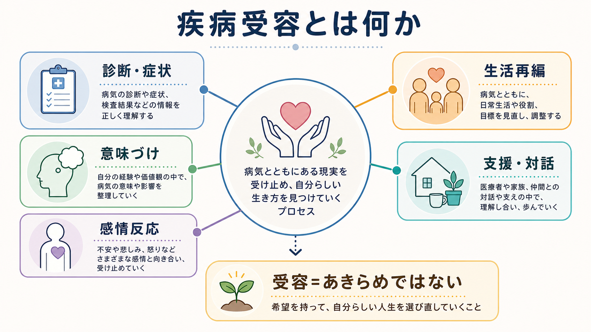
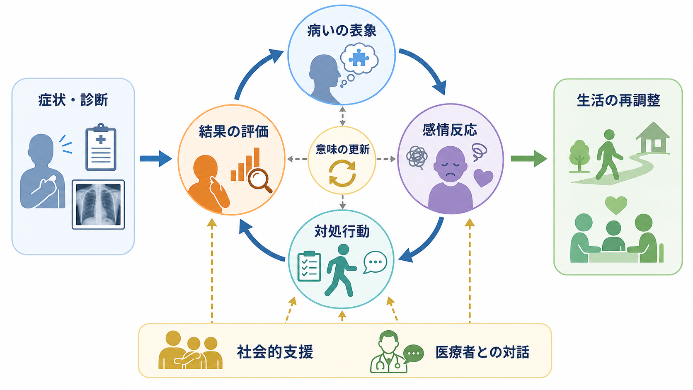
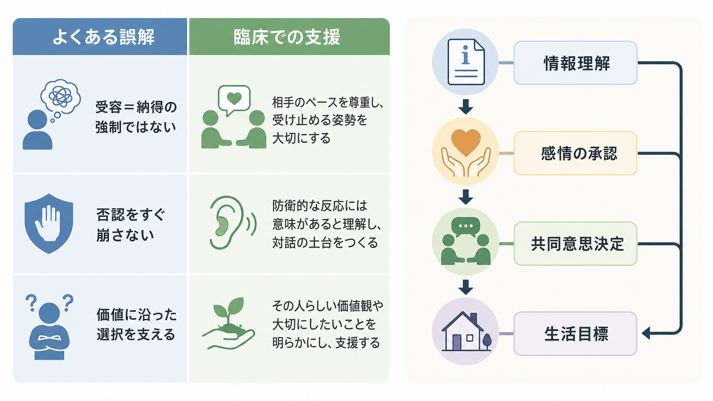

# 疾病受容とは何か

## 要点

- 疾病受容とは、診断名や症状を「よいもの」として認めることではなく、病気が自分の身体、生活、役割、将来像に与える影響を少しずつ意味づけ直し、現実的な対処と価値に沿った生活を組み直していく過程である。
- 受容は直線的な段階ではない。否認、怒り、不安、落ち込み、希望、情報探索、生活調整は揺れながら反復する。
- 臨床では「受け入れさせる」ことより、患者の病いの表象、感情、生活文脈、価値、支援資源を一緒に理解することが重要である。
- 疾病受容は[[精神医学における回復とは何か]]、[[生物心理社会モデルとは何か]]、[[支持的面接とは何か]]、[[治療関係とは何か]]と深くつながる。

## この記事で答える問い

1. 疾病受容とは、単なる納得やあきらめと何が違うのか。
2. 診断や症状は、患者の自己理解や生活にどのように入り込むのか。
3. 医療者は、患者の受容過程をどのように支えられるのか。

## まず結論

疾病受容は「診断を正しいと認める心理状態」ではなく、「病気を抱えたまま、何を大切にし、どのように生きるかを再構成するプロセス」である。ここには、症状の理解、診断への感情反応、治療への見通し、家族や職場との関係、失われた役割への悲嘆、残された能力の再発見が含まれる。

そのため、疾病受容を急がせる面接はしばしば逆効果になる。患者が否認しているように見える場面でも、それは情報過多や恐怖から身を守る一時的な調整かもしれない。医療者に必要なのは、患者の語りを[[傾聴とは何か]]、[[共感的理解とは何か]]、必要な情報を小分けにし、患者が自分の言葉で病いを位置づけ直す余地を保つことである。

## 背景

医療では、診断名、検査値、治療選択肢が中心に見えやすい。しかし患者にとって診断は、単に医学的カテゴリーを与えられる出来事ではない。診断は「自分の身体はどうなったのか」「将来はどう変わるのか」「家族や仕事に迷惑をかけるのか」「これまでの自分でいられるのか」という問いを生む。

Leventhal らの Common-Sense Model は、人が健康上の脅威に直面したとき、症状や診断についての素朴な理解、原因、経過、結果、コントロール可能性、感情反応を組み合わせて「病いの表象」を作り、それが対処行動や自己管理を方向づけると考える[1]。メタ分析でも、病いの表象、対処、心理的苦痛、機能、ウェルビーイングの関連が示されている[2]。

したがって疾病受容は、内面の「気持ちの問題」だけではない。病気が生活の前提、身体感覚、社会的役割、自己像を揺さぶるとき、その人が何を失い、何を守り、何を作り直すのかという過程である。慢性疾患研究では、病気が人生の連続性を断ち切る「biographical disruption」として経験されうることが論じられてきた[5]。また Charmaz は、慢性疾患における苦痛の中核に、以前の自己像が崩れ、新しい価値ある自己像がまだ形成されない「自己の喪失」があると述べた[6]。

## 基本概念

### 疾病受容

疾病受容とは、病気の存在や影響を、完全に好きになることでも、抵抗をやめることでもない。より正確には、次のような複数の作業が重なった過程である。

| 側面 | 内容 | 臨床で見る問い |
|---|---|---|
| 認知的側面 | 診断、症状、経過、治療可能性を理解する | 「何が起きていると理解しているか」 |
| 情動的側面 | 不安、怒り、悲しみ、恥、安堵などを扱う | 「どの感情が一番強いか」 |
| 行動的側面 | 受診、服薬、休息、相談、生活調整を試す | 「明日から何を変えられるか」 |
| 社会的側面 | 家族、職場、学校、支援制度との関係を調整する | 「誰に何を伝える必要があるか」 |
| 実存的側面 | 自己像、役割、価値、将来像を再構成する | 「病気があっても守りたいものは何か」 |

### 適応・コーピングとの違い

適応は、病気によって変化した条件の中で機能や生活を保つ広い概念である。コーピングは、ストレスに対して用いられる具体的な認知的・行動的方略を指す。Felton らの慢性疾患研究では、情報探索などの認知的方略は肯定的感情と関連しやすい一方、回避、自己非難、感情の噴出は否定的感情や低い自己評価と関連した[3]。

疾病受容は、適応やコーピングの一部でありながら、より「意味づけ」に近い概念である。たとえば、同じ服薬行動でも、「医師に言われたから仕方なく飲む」のか、「子どもと過ごす時間を保つために飲む」のかでは、患者にとっての意味が異なる。

### 測定概念としての疾病受容

研究では Acceptance of Illness Scale（AIS）のような尺度を用いて、病気がもたらす制限、不十分感、依存感、自己評価への影響を測ることがある。がん患者を対象にした研究では、疾病受容の程度が疼痛、生活の質、治療や心理的支援の計画と関連する可能性が示されている[4]。ただし、尺度得点は面接の代替ではない。低い得点は「受容できていない患者」というラベルではなく、どこに苦痛や支援ニーズがあるかを探る手がかりとして読む必要がある。

## 仕組み

疾病受容は、次のような循環で理解できる。

1. 症状や診断に出会う。
2. 患者は「これは何か」「なぜ起きたか」「どのくらい続くか」「自分で何とかできるか」を解釈する。
3. その解釈に応じて、不安、怒り、悲しみ、安堵、混乱などが生じる。
4. 情報探索、受診、服薬、回避、相談、生活調整などの対処が選ばれる。
5. 対処の結果を見て、病気の意味づけが更新される。

この循環は Common-Sense Model の考え方と近い[1][2]。重要なのは、受容が一度きりの心理的到達点ではなく、症状の変化、再発、治療方針の変更、家族関係、職場復帰、加齢によって何度も更新される点である。

## 図解

疾病受容を図で考えるなら、「段階の階段」よりも「揺れながら回る循環」として捉える方が臨床的である。

| 見方 | 問題点 | 代替となる見方 |
|---|---|---|
| 否認から受容へ一直線に進む | 進みが遅い患者を未熟と見なしやすい | 状況に応じて理解、感情、対処が揺れる |
| 受容できれば苦痛は消える | 慢性症状や喪失の現実を軽視しやすい | 苦痛が残っても価値に沿う行動を増やす |
| 医療者が説得すれば受容が進む | 患者の防衛や不信を強めうる | 対話、情報調整、共同意思決定で支える |

## 臨床・研究との接続

### 面接で見るべきこと

精神科面接や慢性疾患の診療では、疾病受容を直接「受け入れていますか」と問うだけでは不十分である。むしろ、次のような質問が有用である。

- 「診断を聞いたとき、まず何が頭に浮かびましたか」
- 「この病気について、いちばん心配していることは何ですか」
- 「生活の中で、何が一番変わりましたか」
- 「周囲にはどのように説明していますか」
- 「病気があっても、できれば続けたいことは何ですか」
- 「治療について、納得できている点とまだ引っかかる点はありますか」

これらは、[[主訴はどのように聞くべきか]]、[[現病歴はどのように構造化するべきか]]、[[生活歴はなぜ重要なのか]]とも接続する。診断名だけでなく、患者が病気をどのような物語として理解しているかを見ることで、治療同盟が形成されやすくなる。

### 支援の方向

疾病受容を支える支援は、説得ではなく共同作業である。共有意思決定の three-talk model は、選択肢があることを共有し、選択肢を比較し、患者の目標や選好を踏まえて決めるプロセスを整理している[8]。疾病受容の支援でも、患者の価値や生活目標を聞かずに「治療上正しい選択」だけを提示すると、医学的には妥当でも本人の生活に根づきにくい。

Acceptance and Commitment Therapy（ACT）や心理的柔軟性の研究は、受容を「苦痛を消してから動く」ことではなく、「苦痛や症状があっても、価値に沿った行動を選べる幅を広げる」こととして扱う。慢性疼痛領域のレビューでは、ACT が機能改善に一定の効果をもつ可能性が示されているが、効果の持続や対象者差には注意が必要である[7]。これは疾病受容一般にも、「受容＝症状を問題にしない」ではなく「症状に生活全体を支配されすぎない」という実践的理解を与える。

### 医療者が避けたい対応

- 「早く受け入れましょう」と促す。
- 患者の否認をすぐに誤りとして訂正する。
- 怒りや悲しみを「病気の理解不足」とみなす。
- 家族や医療者の安心を優先して、本人のペースを奪う。
- 受容できていないことを治療不遵守の原因として単純化する。

これらは[[精神科面接で避けるべき対応は何か]]にも関わる。患者の反応が非合理に見えるときほど、そこにどのような恐怖、喪失、羞恥、過去の医療経験があるのかを確認する必要がある。

## よくある誤解

### 誤解1：受容とはあきらめである

受容は、治療や回復の可能性を捨てることではない。むしろ、現実の制約を見ながら、使える支援、治療、生活上の工夫を選ぶための土台である。

### 誤解2：受容には決まった段階がある

Kübler-Ross の段階モデルは広く知られているが、悲嘆や病気への反応を機械的な順番として扱うと、患者が「正しく悲しめていない」「まだ受容できていない」と感じる危険がある。少なくとも臨床面接では、段階表に当てはめるより、患者ごとの揺れ、生活文脈、支援資源を確認する方が実用的である。

### 誤解3：診断を理解すれば受容できる

情報理解は重要だが、それだけでは不十分である。患者は、医学的説明を聞きながらも、「仕事は続けられるか」「家族にどう話すか」「自分はもう弱い人間なのか」といった別の問いを抱えている。疾病受容は、知識、感情、役割、関係性、価値の再編成を含む。

### 誤解4：受容できない患者は治療意欲が低い

一見すると治療に消極的でも、背景には副作用への恐怖、診断への羞恥、過去の医療不信、経済的制約、家族内葛藤があるかもしれない。受容の程度を性格や意欲に還元しないことが、[[生物心理社会モデルとは何か]]に沿った見方である。

## 関連ノート

- [[精神医学における回復とは何か]]
- [[生物心理社会モデルとは何か]]
- [[精神科面接とは何か]]
- [[治療関係とは何か]]
- [[支持的面接とは何か]]
- [[傾聴とは何か]]
- [[共感的理解とは何か]]
- [[主訴はどのように聞くべきか]]
- [[生活歴はなぜ重要なのか]]
- [[精神科面接で避けるべき対応は何か]]

## MOC更新候補

- `content/00_MOC/` 配下の精神医学・精神科面接・臨床心理関連 MOC に、本記事 `[[疾病受容とは何か]]` を追加する候補。
- 並列ジョブとの競合を避けるため、本タスクでは MOC 本体は更新しない。

## 理解チェック

1. 疾病受容を「あきらめ」と同一視すると、臨床上どのような問題が起こるか。
2. Common-Sense Model の観点から、患者が診断を聞いたあとに作る「病いの表象」には何が含まれるか。
3. 否認しているように見える患者に対して、すぐに説得する前に確認すべきことは何か。
4. 疾病受容を支える面接で、患者の価値や生活目標を聞くことがなぜ重要か。

## 未解決問題

- 疾病受容の尺度得点が、疾患種別、文化、家族関係、社会経済的条件によってどのように変わるかは、単純に一般化できない。
- 受容を高める介入が、症状、QOL、治療継続、社会参加にどの程度影響するかは、疾患や介入形式によって異なる。
- 精神疾患では、診断に伴うスティグマや自己同一性への影響が大きいため、身体疾患の疾病受容モデルをそのまま当てはめることには注意が必要である。

## 参考文献

[1] Leventhal, H., Phillips, L. A., & Burns, E. (2016). The Common-Sense Model of Self-Regulation (CSM): A dynamic framework for understanding illness self-management. *Journal of Behavioral Medicine, 39*(6), 935-946. https://doi.org/10.1007/s10865-016-9782-2

[2] Hagger, M. S., Koch, S., Chatzisarantis, N. L. D., & Orbell, S. (2017). The common sense model of self-regulation: Meta-analysis and test of a process model. *Psychological Bulletin, 143*(11), 1117-1154. https://doi.org/10.1037/bul0000118

[3] Felton, B. J., Revenson, T. A., & Hinrichsen, G. A. (1984). Stress and coping in the explanation of psychological adjustment among chronically ill adults. *Social Science & Medicine, 18*(10), 889-898. https://doi.org/10.1016/0277-9536(84)90158-8

[4] Czerw, A., Religioni, U., Szumilas, P., Sygit, K., Partyka, O., Mękal, D., Jopek, S., Mikos, M., & Strzępek, Ł. (2022). Normalization of the AIS (Acceptance of Illness Scale) questionnaire and the possibility of its use among cancer patients. *Annals of Agricultural and Environmental Medicine, 29*(2), 269-273. https://doi.org/10.26444/aaem/144197

[5] Bury, M. (1982). Chronic illness as biographical disruption. *Sociology of Health & Illness, 4*(2), 167-182. https://doi.org/10.1111/1467-9566.ep11339939

[6] Charmaz, K. (1983). Loss of self: A fundamental form of suffering in the chronically ill. *Sociology of Health & Illness, 5*(2), 168-195. https://doi.org/10.1111/1467-9566.ep10491512

[7] Du, S., Dong, J., Jin, S., Zhang, H., & Zhang, Y. (2021). Acceptance and Commitment Therapy for chronic pain on functioning: A systematic review of randomized controlled trials. *Neuroscience & Biobehavioral Reviews, 131*, 59-76. https://doi.org/10.1016/j.neubiorev.2021.09.022

[8] Elwyn, G., Durand, M. A., Song, J., Aarts, J., Barr, P. J., Berger, Z., Cochran, N., Frosch, D., Galasiński, D., Gulbrandsen, P., Han, P. K. J., Härter, M., Kinnersley, P., Lloyd, A., Mishra, M., Perestelo-Perez, L., Scholl, I., Tomori, K., Trevena, L., Witteman, H. O., & Van der Weijden, T. (2017). A three-talk model for shared decision making: Multistage consultation process. *BMJ, 359*, j4891. https://doi.org/10.1136/bmj.j4891
