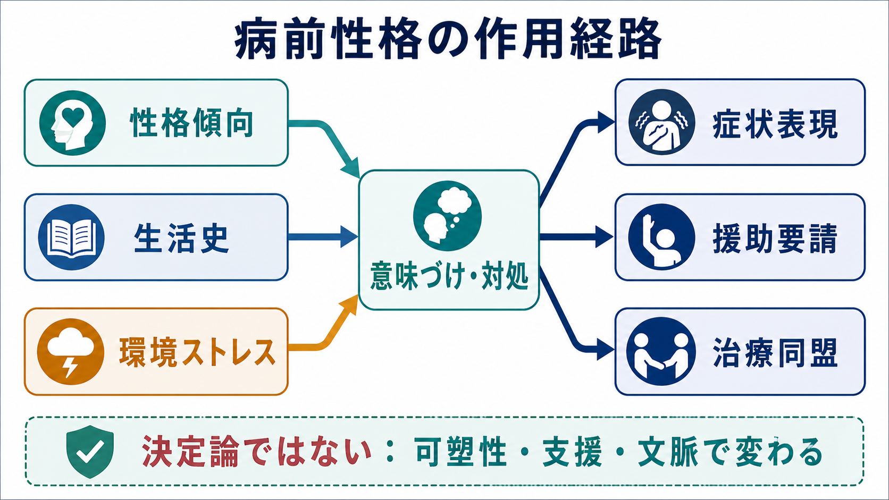

# 病前性格とは何か

## 要点

- 病前性格とは、精神症状が明確に出現する前から比較的持続していた性格傾向、対人様式、価値観、生活の組み立て方を指す臨床用語である。
- 病前性格は診断名ではなく、[[精神科診断は何のためにあるのか|診断]]を補う生活史的・関係論的な見立てである。
- 発症前の性格傾向は、症状の出方、援助要請の遅れや早さ、治療同盟、再発予防、社会機能の回復に影響しうる。
- ただし「この性格だから発症した」と決めつける概念ではない。環境、発達、身体疾患、社会的役割、偶然のストレス、支援資源と相互作用して理解する必要がある。
- 現代的には、固定的な「病前性格型」だけでなく、パーソナリティ機能、特性次元、病前適応、対人機能として扱う方が臨床的に使いやすい。

## この記事で答える問い

1. 病前性格とは何を意味するのか。
2. 病前性格は、症状形成や治療関係にどう関わるのか。
3. 病前性格を扱うとき、どのような誤解を避けるべきか。

## まず結論

病前性格は、「発症前のその人らしさ」が症状や治療経過にどう関わったかを考えるための臨床的レンズである。たとえば、几帳面で責任感が強く、役割から降りることが苦手な人では、喪失や過重負荷が抑うつの文脈をつくることがある。一方で、発症前から対人距離が遠く、孤立しやすかった人では、精神病発症後の陰性症状や社会機能の低下と見分けにくい部分が出ることがある[1][3]。

重要なのは、病前性格を原因論として使いすぎないことである。病前性格は、[[素因ストレスモデルとは何か|素因ストレスモデル]]や[[生物心理社会モデルとは何か|生物心理社会モデル]]の中で、脆弱性・保護因子・支援計画の一部として位置づけると有用になる。

## 背景

精神医学では、同じ診断名でも、症状の現れ方や治療関係はかなり異なる。発症前からの生活史、対人関係、自己評価、責任感、怒りの扱い方、助けを求める習慣が異なるからである。

古典的な精神病理学では、うつ病におけるメランコリー親和型、躁うつ病における循環気質、統合失調症における分裂気質・統合失調型傾向など、疾患と結びつく病前性格が論じられてきた。日本やドイツでは、単極性うつ病とメランコリー親和型の関係がとくに議論されたが、測定論的には疾患特異的な病前性格として断定できるほど単純ではない[1]。

そのため現在は、特定の「型」だけで説明するよりも、発症前の社会適応、自己機能、対人機能、パーソナリティ特性、支援資源を組み合わせて評価する方が実践的である。これは[[カテゴリ診断と次元診断は何が違うのか|カテゴリ診断と次元診断]]の違いにも関わる。

## 基本概念

### 病前性格

病前性格は、明らかな発症前からみられる比較的安定した性格傾向を指す。ここには、几帳面さ、対人回避、過敏性、依存性、完璧主義、衝動性、疑い深さ、他者への同調性、役割へのこだわりなどが含まれる。

ただし、病前性格は「正常な性格」と「病的な人格」を単純に分ける概念ではない。ある状況では適応を支える特性が、別の状況では脆弱性になることがある。責任感は仕事や家族役割を支えるが、過重負荷と結びつくと休めなさや援助要請の遅れにつながる。

### 病前適応

病前適応は、発症前の学業、仕事、対人関係、生活自立、発達段階に応じた役割遂行を指す。統合失調症研究では、病前適応の低さが発症後の陰性症状、社会機能、再入院などの予後と関連することが示されてきた[3]。これは「性格」だけでなく、発達、認知機能、家庭環境、学校・職場環境も含む広い指標である。

### パーソナリティ機能

現代の診断体系では、パーソナリティを単なる類型ではなく、自己機能と対人機能の程度として評価する方向が強まっている。DSM-5代替モデルでは、自己機能は同一性と自己方向づけ、対人機能は共感と親密性として整理される[5]。ICD-11でも、パーソナリティ障害は自己・対人機能の障害の重症度と、否定的感情、離隔、脱抑制、非社会性、強迫性などの特性修飾子で記述される[6]。

この視点を使うと、病前性格は「何型か」ではなく、「どの機能が、どの場面で、どれくらい柔軟性を失いやすいか」として評価できる。

## 仕組み

病前性格が臨床経過に影響する経路は、少なくとも四つに分けられる。

第一に、ストレスの受け止め方である。同じ出来事でも、失敗を自己価値の崩壊として受け止める人、怒りとして外に向ける人、誰にも相談せず抱え込む人では、症状の出方が変わる。これは[[ストレス脆弱性モデルとは何か|ストレス脆弱性モデル]]における心理社会的脆弱性として理解できる。

第二に、症状表現である。対人距離を取りやすい人では孤立や感情表出の乏しさが目立ち、もともとの傾向と発症後の陰性症状を区別する必要がある。統合失調症では、発症前の対人関係の問題や分裂病質的傾向が後の精神病リスクや経過と関連するが、予測力は限定的で、個人の将来を決める指標ではない[4]。

第三に、援助要請である。自立性や忍耐を重視する人は受診が遅れやすく、依存や見捨てられ不安が強い人は危機時に頻回な相談や関係確認を必要としやすい。ここでは性格を「問題」と見るより、援助要請の様式として理解する方が治療的である。

第四に、治療関係である。心理療法研究では、治療同盟が治療成績と一貫して関連することがメタ分析で示されている[7]。パーソナリティ病理をもつ患者では、関係の不一致、治療者側の感情反応、早期の同盟の弱さが治療継続に関わりうる[8]。病前性格の評価は、治療者が「この人はどう関係を結び、どう傷つき、どう助けを求めるか」を予測する助けになる。

## 図解

| 観点 | 見るもの | 臨床での使い道 | 注意点 |
|---|---|---|---|
| 性格傾向 | 几帳面、回避的、衝動的、過敏、依存的など | ストレス反応や対処を見立てる | ラベル貼りにしない |
| 対人様式 | 距離の取り方、頼り方、怒り方、謝り方 | 治療同盟と危機対応を調整する | 治療者の反応も含めて見る |
| 病前適応 | 学業、仕事、友人関係、生活自立 | 予後、リハビリ、支援量を考える | 社会環境や機会の差を見落とさない |
| パーソナリティ機能 | 同一性、自己方向づけ、共感、親密性 | 重症度と治療焦点を整理する | 診断名への短絡を避ける |
| 保護因子 | 信頼できる人、役割、価値、習慣 | 再発予防と回復計画に使う | 欠点探しだけにしない |

## 臨床・研究との接続

### 面接での使い方

病前性格を聞くときは、「もともとの性格は？」と直接聞くだけでは不十分である。本人も家族も、発症後の印象に引きずられるからである。実際には、発症前の学校生活、友人関係、仕事ぶり、失敗への反応、怒りの表し方、休み方、相談相手、生活リズムを具体的に聞く。

たとえば次のように尋ねる。

- 「調子を崩す前は、困ったとき誰に相談していましたか」
- 「仕事や勉強で失敗したとき、どのように立て直していましたか」
- 「周囲からは、どんな人だと言われることが多かったですか」
- 「発症前から苦手だった対人場面はありましたか」
- 「調子が悪くなる前後で、変わった部分と変わらない部分は何ですか」

このような聞き方は、[[操作的診断とは何か|操作的診断]]で拾いにくい生活史的な情報を補う。

### 治療計画での使い方

病前性格は、治療計画の個別化に使える。几帳面で自己責任感が強い人には、休息を「怠け」ではなく治療課題として位置づける。回避的な人には、急に対人接触を増やすより、小さく予測可能な接触から始める。衝動性が強い人には、危機時の連絡手順や環境調整を先に合意する。

ここでの目的は、性格を変えることではない。本人の特性が症状を悪化させる場面を減らし、同じ特性が強みとして働く場面を増やすことである。これは[[精神医学における回復とは何か|回復]]を、症状消失だけでなく生活機能と意味の再構成として捉える考え方と相性がよい。

### 研究での扱い

研究では、病前性格そのものよりも、病前適応、パーソナリティ特性、パーソナリティ機能、治療同盟、社会機能を測定することが多い。病前性格は回顧的評価になりやすく、発症後の記憶や現在の症状に影響される。したがって、代表性のあるサンプル、前向き研究、情報提供者からの評価、標準化尺度を使うことが重要である[1][4]。

## よくある誤解

### 誤解1：病前性格は発症原因である

病前性格は原因の一部として働くことはあるが、単独原因ではない。発症は、遺伝、発達、神経認知、身体状態、ストレス、社会的支援、文化的意味づけが重なって生じる。性格だけで発症を説明すると、本人や家族への責任帰属になりやすい。

### 誤解2：病前性格は変わらない

性格傾向には安定性があるが、対処、環境、関係、役割、治療経験によって表れ方は変わる。ICD-11でも、パーソナリティの問題は相対的に安定する一方、人生の経過で変化しうるものとして扱われる[6]。

### 誤解3：病前性格を見れば診断できる

病前性格だけで診断はできない。診断には、現在の症状、持続期間、機能障害、除外診断、身体疾患や物質の影響、文化的背景を含めた評価が必要である。病前性格は診断の代替ではなく、[[DSMとICDは何が違うのか|DSMやICD]]による診断を生活史の中に置き直す補助線である。

### 誤解4：性格の話は治療者の主観にすぎない

主観に流れやすい領域だからこそ、具体的エピソード、複数情報源、時間軸、標準化尺度、治療場面での観察を組み合わせる必要がある。本人の語り、家族の語り、学校・職場での機能、治療者との関係を分けて記述すると、見立ての精度が上がる。

## 関連ノート

- [[精神医学とは何か]]
- [[精神疾患とは何か]]
- [[精神科診断は何のためにあるのか]]
- [[操作的診断とは何か]]
- [[カテゴリ診断と次元診断は何が違うのか]]
- [[DSMとICDは何が違うのか]]
- [[素因ストレスモデルとは何か]]
- [[ストレス脆弱性モデルとは何か]]
- [[生物心理社会モデルとは何か]]
- [[精神医学における回復とは何か]]

### MOC更新候補

- `content/00_MOC/` 配下の精神医学・診断・面接関連 MOC に、バッチ統合時に本記事へのリンクを追加する候補。

## 理解チェック

1. 病前性格と病前適応はどのように違うか。
2. 病前性格を「原因」として断定すると、どのような臨床的リスクがあるか。
3. 病前性格が治療同盟に影響する経路を一つ説明できるか。
4. DSM-5代替モデルやICD-11のパーソナリティ評価は、病前性格の理解にどのように役立つか。

## 未解決問題

- 古典的な病前性格類型が、現代の次元的パーソナリティ評価とどの程度対応するのか。
- 発症後の記憶バイアスを抑えて、病前性格をどのように前向きに測定できるか。
- 病前性格を治療計画に組み込むことで、治療継続、再発予防、社会機能がどの程度改善するか。
- 文化や時代によって「適応的な性格」と「脆弱性」とされるものがどう変わるか。

## 参考文献

[1] Sakamoto K. (2007). Premorbid personality. *Nihon Rinsho*, 65(9), 1591-1598. https://pubmed.ncbi.nlm.nih.gov/17876980/

[2] Oudart E, Hanak C, Ammendola S. (2020). The Relationship between Typus Melancholicus and Unipolar Depression: A Literature Review. *Psychiatria Danubina*, 32(Suppl 1), 188-193. https://pubmed.ncbi.nlm.nih.gov/32890388/

[3] Bailer J, Brauer W, Rey E R. (1996). Premorbid adjustment as predictor of outcome in schizophrenia: results of a prospective study. *Acta Psychiatrica Scandinavica*, 93(5), 368-377. https://doi.org/10.1111/j.1600-0447.1996.tb10662.x

[4] Jones P, Rodgers B, Murray R, Marmot M. (1998). Premorbid adjustment and personality in people with schizophrenia. *The British Journal of Psychiatry*, 172(4), 308-313. https://doi.org/10.1192/bjp.172.4.308

[5] Krueger R F, Hobbs K A. (2020). An Overview of the DSM-5 Alternative Model of Personality Disorders. *Psychopathology*, 53(3-4), 126-132. https://doi.org/10.1159/000508538

[6] Bach B, First M B. (2018). Application of the ICD-11 classification of personality disorders. *BMC Psychiatry*, 18, 351. https://doi.org/10.1186/s12888-018-1908-3

[7] Fluckiger C, Del Re A C, Wampold B E, Horvath A O. (2018). The alliance in adult psychotherapy: A meta-analytic synthesis. *Psychotherapy*, 55(4), 316-340. https://doi.org/10.1037/pst0000172

[8] Ovstebo R B, Pedersen G, Wilberg T, Rossberg J I, Dahl H-S J, Kvarstein E H. (2024). Countertransference, alliance, and outcome in the treatment of patients with personality disorder: a longitudinal naturalistic study. *Frontiers in Psychiatry*, 15, 1490056. https://doi.org/10.3389/fpsyt.2024.1490056
