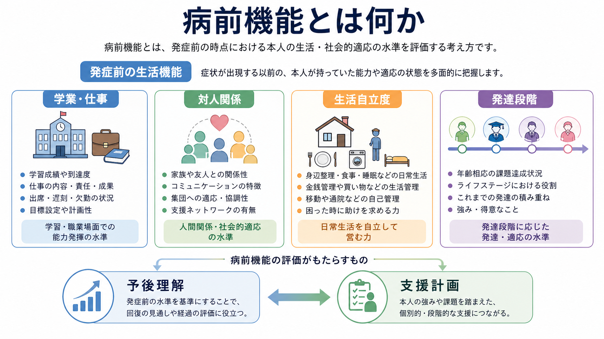
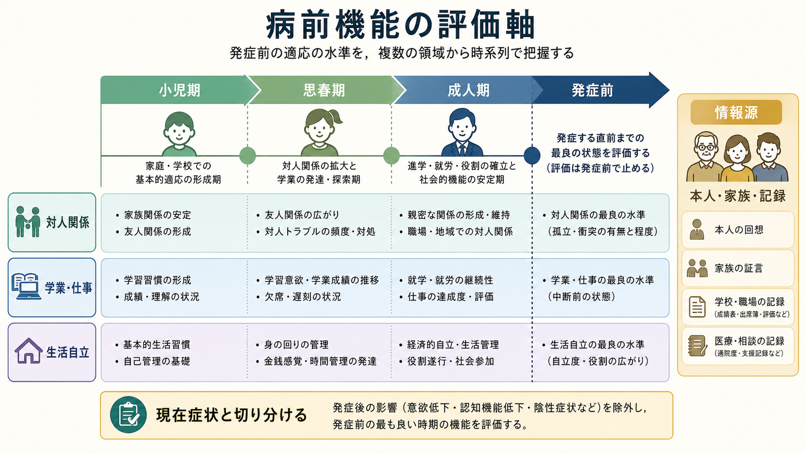
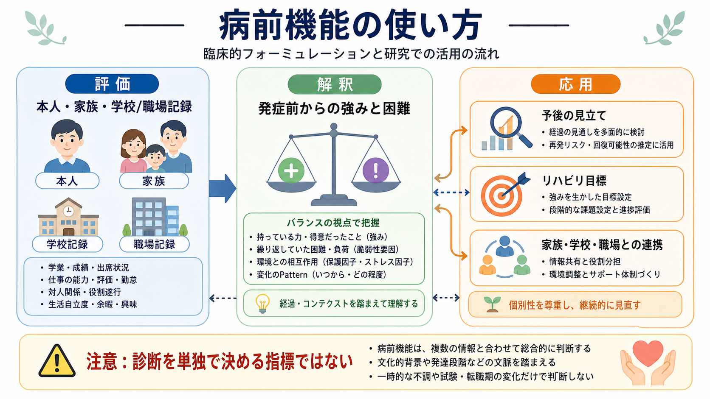

# 病前機能とは何か

## 要点

- 病前機能とは、精神疾患や明確な症状増悪が始まる前に、その人が学校、仕事、対人関係、家庭生活、身辺自立をどの程度保てていたかを指す。
- 病前機能は、現在の「できなさ」をそのまま本人の性格や努力不足に帰すのではなく、発症前からの強み・困難・発達的特徴・生活環境を分けて考えるために使う。
- 精神病、とくに統合失調症スペクトラムでは、病前の社会的・学業的適応が発症後の陰性症状、社会機能、認知機能、支援ニーズと関連することが繰り返し報告されている[2][4][5]。
- ただし、病前機能は診断を単独で決める指標ではない。文化、教育機会、貧困、差別、発達特性、身体疾患、家族状況、本人の価値観を含めて解釈する必要がある。
- 臨床では、[[生物心理社会モデルとは何か]]、ケースフォーミュレーション、リハビリテーション、[[精神医学における回復とは何か|回復]]の目標設定をつなぐ情報として重要である。

## この記事で答える問い

1. 病前機能とは何を見ている概念なのか。
2. 学業・仕事・対人関係・生活自立度は、なぜ臨床的に重要なのか。
3. 病前機能は、予後、陰性症状、認知機能、支援計画とどうつながるのか。
4. 病前機能を使うとき、どのような誤解や偏見を避けるべきか。

## まず結論

病前機能とは、「症状がはっきり問題化する前に、その人がどのような生活機能を持っていたか」を時間軸に沿って整理する見方である。ここでいう機能は、単なる能力検査の点数ではない。友人関係を作る、学校に通う、仕事を続ける、家事や金銭管理をする、困ったときに助けを求める、といった生活の中の機能である。

精神科臨床では、初診時の状態だけを見ると、現在の抑うつ、不安、幻覚妄想、陰性症状、薬物使用、睡眠障害、家族葛藤、経済的困難が重なって見える。病前機能を聞くことで、「以前から苦手だったこと」「発症や前駆期に伴って落ちたこと」「環境が変われば回復しやすいこと」「支援を入れるべき領域」を切り分けやすくなる。NICE の精神病・統合失調症ガイドラインも、初回精神病の包括的評価で、発達、社会、職業・教育、日常生活、生活の質、経済状況を扱うことを推奨している[1]。

## 背景

病前機能が重視されてきた領域の一つが、統合失調症スペクトラムと初回精神病である。Cannon-Spoor らが開発した Premorbid Adjustment Scale（PAS）は、統合失調症発症前の複数の発達時期において、発達課題がどの程度達成されていたかを評価する研究用尺度として提案された[2]。PAS は小児期、思春期、成人期などの時期ごとに、社会性、仲間関係、学業、学校への適応、成人期の社会関係などを扱う。

この発想の背景には、精神疾患を現在の症状だけでなく、発達的経過として理解する必要があるという問題意識がある。たとえば、同じ初回精神病でも、発症直前まで学校や仕事を維持していた人と、小児期から対人関係や学業に持続的な困難があった人では、必要な支援が異なる。前者では急性症状の治療と復学・復職支援が中心になるかもしれない。後者では、症状治療に加えて、社会技能、認知機能、生活支援、家族支援、長期的な役割形成を丁寧に組む必要がある。

重要なのは、病前機能を「よい/悪い」のラベルで終わらせないことである。病前機能は本人の価値を測るものではない。むしろ、現在の困難を本人の人格や意志の問題に単純化せず、発達、症状、環境、支援資源の関係として理解するための臨床情報である。

## 基本概念

### 病前とはどの時期か

「病前」は、明確な発症または治療対象となる症状が始まる前を指す。ただし、精神疾患では発症日が一日で決まるとは限らない。前駆期には、集中困難、不眠、興味の低下、社会的ひきこもり、成績低下、違和感、軽い被害的な感じ方などが少しずつ現れることがある。NICE は精神病の前駆期で、個人機能の低下、認知や集中の問題、社会的引きこもり、意欲低下などが起こりうると説明している[1]。

したがって病前機能を評価するときは、「完全に何もなかった時期」と「前駆的変化が始まった時期」を分けて聞く。発症直前の機能低下だけを病前機能と呼ぶと、前駆症状による変化を、もともとの能力や性格と誤認しやすい。

### 何を評価するか

病前機能でよく見る領域は、次の四つである。

| 領域 | 見るポイント | 聞き取りの例 |
|---|---|---|
| 学業・仕事 | 出席、成績、集中、遂行、遅刻欠席、役割継続 | いつから成績や勤務状況が変わったか |
| 対人関係 | 友人関係、家族関係、孤立、恋愛、集団参加 | 昔から一人が楽だったのか、途中から人を避けるようになったのか |
| 生活自立度 | 身辺管理、家事、金銭管理、通院、予定管理 | 以前は自分でできていた生活行為は何か |
| 発達的特徴 | 幼少期からの社会性、学習、注意、感覚、運動、こだわり | 発達特性や教育上の支援歴はあったか |

PAS のような尺度は、社会的領域と学業的領域を分けて扱う点が重要である。初回統合失調症・統合失調感情障害の研究では、社会的病前適応と学業的病前適応が、性別、診断、認知機能、陰性症状と異なる関連を示すことが報告されている[5]。

## 仕組み

病前機能が臨床的に役立つ理由は、少なくとも三つある。

第一に、発達的な脆弱性や強みを推定できる。小児期から対人関係、学習、注意、社会的参加に困難があった場合、それは神経発達的特徴、認知機能、家庭・学校環境、いじめやトラウマ、社会経済的条件などと関連している可能性がある。病前機能の低さを「原因」と断定するのではなく、発症前から存在した支援ニーズの手がかりとして読む。

第二に、症状による二次的な機能低下を見つけやすくなる。たとえば、以前は仕事を続けられていた人が、睡眠障害、被害妄想、抑うつ、意欲低下の出現後に欠勤するようになったなら、現在の機能低下は治療や環境調整で回復する余地が大きいかもしれない。逆に、以前から段取りや対人調整が苦手だった場合は、症状が軽くなっても具体的な技能支援が必要になる。

第三に、予後の見立てと支援目標を具体化できる。Bailer らの前向き研究では、病前適応は統合失調症の3年経過における陰性症状や社会的障害と関連し、陽性症状よりも陰性症状・社会的経過との関連が強かった[4]。これは「病前機能が悪いから治らない」という意味ではない。むしろ、陰性症状、社会機能、認知機能、復学・復職、家族支援を早期から計画に入れる必要を示す。

## 図解

病前機能は、現在の症状評価と別に置かれる情報ではない。発症前の生活機能を、発症時期、前駆期、現在症状、社会環境、支援資源と接続して読む。

| 情報 | 臨床での使い方 | 注意点 |
|---|---|---|
| 発症前の学業・仕事 | 復学・復職の現実的な目標を作る | 学歴や職歴を価値判断にしない |
| 発症前の対人関係 | 孤立、陰性症状、社会技能支援を検討する | 内向性と社会的機能低下を混同しない |
| 発症前の生活自立 | 退院支援、訪問支援、家族負担を評価する | 家族内役割や文化差を考慮する |
| 発症前からの困難 | 発達特性、認知機能、教育支援歴を確認する | 後知恵で「前兆」と決めつけない |

## 臨床・研究との接続

### 初回面接とケースフォーミュレーション

初回面接では、現在の主訴だけでなく、発症前の生活を短くても系統的に聞く。たとえば「小学校、中学校、高校、就職後で、友人関係や学校・仕事の続き方はどう変わりましたか」「いつ頃から以前と違う感じになりましたか」「本人や家族から見て、発症前の強みは何でしたか」といった聞き方ができる。

この情報は、[[操作的診断とは何か]]と対立しない。診断基準は症状と経過をそろえて記述するための道具であり、病前機能はその人の経過と支援ニーズを立体的に理解するための道具である。診断名を置いた後も、病前機能を含むケースフォーミュレーションがなければ、治療計画は抽象的になりやすい。

### 統合失調症スペクトラム研究

統合失調症スペクトラムでは、病前機能は神経発達モデル、陰性症状、認知機能、社会機能研究と深く関係する。van Mastrigt と Addington は、PAS が慢性統合失調症で病前機能の有用な評価法・転帰予測因子として用いられてきた一方、若年の初回エピソードで使う際には適用性や信頼性上の課題があり、修正や慎重な運用が必要だと整理している[3]。

近年の研究では、病前機能を単一の平均点で見るだけでなく、発達軌跡として見る発想が広がっている。Cole らは、統合失調症患者の PAS データから、発症前の社会・学業機能に複数の軌跡があることを示した[7]。また初回統合失調症スペクトラムの研究では、安定して良好、安定して不良、悪化型といった病前機能パターンが検討され、安定して不良な群で1年後の陰性症状、とくに社会的意欲低下が重いことが報告されている[8]。

### 支援計画

病前機能は、支援目標を「症状を下げる」だけでなく「生活機能を戻す、または新しく作る」方向へ広げる。発症前に大学生活を維持していた人であれば、履修量の調整、睡眠リズム、通学負荷、教職員との連携が課題になる。発症前から対人関係や生活管理が難しかった人であれば、症状治療と並行して、訪問支援、就労移行、認知機能リハビリテーション、社会技能訓練、家族支援を検討する。

ここでの目標は、発症前の状態に機械的に戻すことではない。本人が現在の状態、価値観、環境、支援資源の中で、どのような生活を望むかを一緒に組み立てることである。この点で、病前機能は[[精神医学における回復とは何か|回復]]の概念と接続する。

## よくある誤解

### 誤解1：病前機能が低いと予後は決まっている

病前機能はリスクや支援ニーズの手がかりであって、運命を決めるものではない。研究上、病前機能と陰性症状、社会機能、認知機能の関連は示されているが、個人の経過は治療、環境、支援、本人の希望、身体状態、家族や地域資源によって変わる。

### 誤解2：病前機能は本人の努力や性格の評価である

病前機能は道徳評価ではない。たとえば「友人が少なかった」という情報は、本人が悪いという意味ではない。内向性、文化、いじめ、発達特性、家庭環境、身体疾患、学校制度、差別など、多くの背景がありうる。

### 誤解3：学業や仕事だけを見ればよい

学業・仕事は重要だが、それだけでは不十分である。PAS 研究でも、社会的領域と学業的領域は別の情報を持つと考えられている[5]。高成績でも孤立が強い人、学業は苦手でも家族や地域で安定した役割を持つ人がいる。機能は複数領域で見る。

### 誤解4：発症後に聞いた病前情報はすべて正確である

病前機能の評価はしばしば回顧的であり、記憶のゆがみや現在症状の影響を受ける。本人、家族、学校・職場記録、過去の診療情報など、複数の情報源を照合することが望ましい。評価者は「後から見れば全部前兆だった」と解釈しすぎないよう注意する。

## 関連ノート

- [[精神医学とは何か]]
- [[精神疾患とは何か]]
- [[精神科診断は何のためにあるのか]]
- [[操作的診断とは何か]]
- [[カテゴリ診断と次元診断は何が違うのか]]
- [[生物心理社会モデルとは何か]]
- [[素因ストレスモデルとは何か]]
- [[精神医学における回復とは何か]]

MOC更新候補: `content/00_MOC/` 配下の精神医学・診断・面接関連 MOC に、本記事へのリンクを追加する。

今後の作成候補: 病前適応尺度（PAS）、初回精神病、陰性症状、社会機能、ケースフォーミュレーション、認知機能リハビリテーション。

## 理解チェック

1. 病前機能を評価するとき、なぜ「発症前」と「前駆期」を分けて聞く必要があるか。
2. 学業機能と社会機能を分けて見ると、どのような臨床上の利点があるか。
3. 病前機能を予後の見立てに使うとき、どのような決めつけを避けるべきか。
4. 本人・家族・記録から情報が食い違うとき、どのように扱うべきか。

## 参考文献

[1] National Institute for Health and Care Excellence. *Psychosis and schizophrenia in adults: prevention and management* (NICE guideline CG178). 2014. https://www.nice.org.uk/guidance/cg178/chapter/Recommendations

[2] Cannon-Spoor HE, Potkin SG, Wyatt RJ. Measurement of premorbid adjustment in chronic schizophrenia. *Schizophrenia Bulletin*. 1982;8(3):470-484. https://doi.org/10.1093/schbul/8.3.470

[3] van Mastrigt S, Addington J. Assessment of premorbid function in first-episode schizophrenia: modifications to the Premorbid Adjustment Scale. *Journal of Psychiatry & Neuroscience*. 2002;27(2):92-101. https://pubmed.ncbi.nlm.nih.gov/11944510/

[4] Bailer J, Bräuer W, Rey ER. Premorbid adjustment as predictor of outcome in schizophrenia: results of a prospective study. *Acta Psychiatrica Scandinavica*. 1996;93(5):368-377. https://doi.org/10.1111/j.1600-0447.1996.tb10662.x

[5] Norman RMG, Malla AK, Manchanda R, Townsend L. Premorbid adjustment in first episode schizophrenia and schizoaffective disorders: a comparison of social and academic domains. *Acta Psychiatrica Scandinavica*. 2005;112(1):30-39. https://doi.org/10.1111/j.1600-0447.2005.00555.x

[6] Tarbox SI, Brown LH, Haas GL. Diagnostic specificity of poor premorbid adjustment: comparison of schizophrenia, schizoaffective disorder, and mood disorder with psychotic features. *Schizophrenia Research*. 2012;141(1):91-97. https://doi.org/10.1016/j.schres.2012.07.008

[7] Cole VT, Apud JA, Weinberger DR, Dickinson D. Using latent class growth analysis to form trajectories of premorbid adjustment in schizophrenia. *Journal of Abnormal Psychology*. 2012;121(2):388-395. https://doi.org/10.1037/a0026922

[8] Horton LE, Tarbox SI, Olino TM, Haas GL. Trajectories of premorbid childhood and adolescent functioning in schizophrenia-spectrum psychoses: a first-episode study. *Psychiatry Research*. 2015;227(2-3):339-346. https://doi.org/10.1016/j.psychres.2015.02.013
