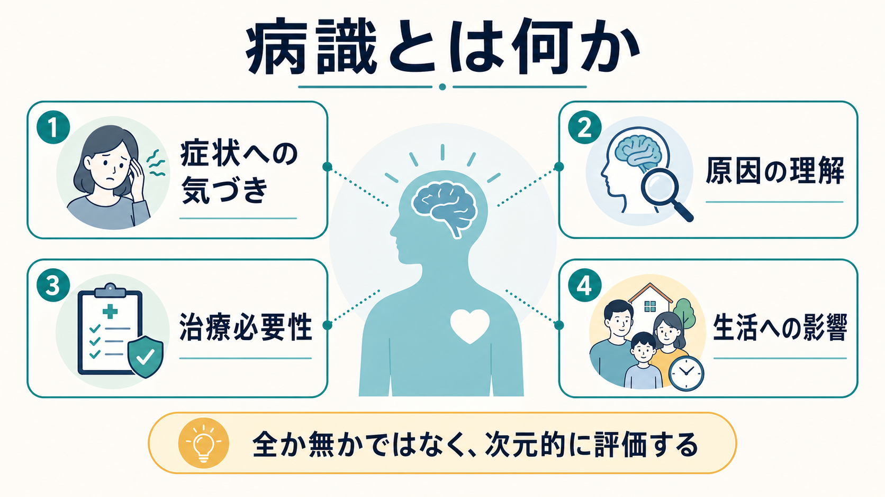
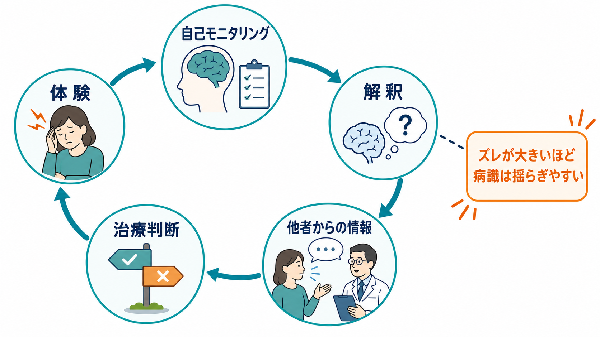
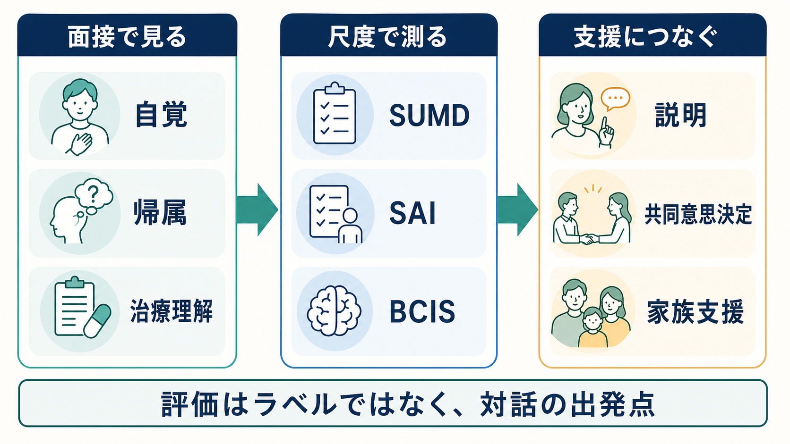

# 病識とは何か

## 要点

- 病識とは、本人が自分の症状や困りごと、精神疾患としての意味、治療や支援の必要性をどの程度理解しているかを捉える臨床的な視点である。
- 病識は「ある／ない」の二分法ではなく、症状への気づき、原因への帰属、治療必要性の理解、生活への影響の理解などからなる多次元的な構成概念である[1][2]。
- 病識低下は、単なる反抗、性格、知識不足とは限らない。精神病症状、気分状態、認知機能、メタ認知、社会的文脈、治療者との関係が絡む。
- 病識評価の目的は、本人に「病識がない」というラベルを貼ることではなく、説明、共同意思決定、安全確認、家族支援、治療継続の組み立て方を考えることである[5][7][8]。

## この記事で答える問い

1. 病識とは何を指すのか。
2. 病識はなぜ「ある／ない」ではなく、次元的に評価する必要があるのか。
3. 病識低下は、どのような仕組みで起こるのか。
4. 臨床面接や研究では、病識をどのように評価し、支援に接続するのか。

## まず結論

病識とは、「自分は病気だと認めているか」だけではない。より正確には、本人が自分の体験をどう理解し、何に困り、どの説明を受け入れ、どの治療や支援を必要だと考え、生活上の影響をどう見積もっているかを評価する枠組みである。

精神医学では、本人の主観的な語りが中心的な情報源になる。一方で、躁状態、精神病症状、認知症、物質使用、重い抑うつ、自傷リスクなどでは、本人の自覚と周囲から見える変化が大きくずれることがある。このずれを丁寧に扱うために、[[精神科初診で何を確認するべきか|精神科初診]]や継続面接では病識を確認する。

ただし、病識を確認することは、本人を説得して専門家の説明に従わせることではない。病識評価は、[[治療関係とは何か|治療関係]]を損なわないように、本人の言葉、生活史、文化的背景、家族や支援者の情報、症状の経過を統合しながら行う必要がある。

## 背景

病識という言葉は、精神医学でとくに統合失調症、双極症、認知症、物質使用症、摂食症、重症うつ病などの文脈で使われる。英語では insight と呼ばれるが、一般語の「洞察」と完全に同じではない。臨床でいう insight は、自分の状態を病的なものとしてどの程度認識しているか、治療の必要性をどう理解しているか、症状をどう説明しているかを含む。

David は、精神病における病識を「精神疾患であることの認識」「治療への協力」「妄想や幻覚などの異常体験を病的なものとして再ラベル化する能力」という重なり合う三つの次元として整理した[1]。この見方の重要点は、病識を単一の有無ではなく、複数の側面に分けて考えることである。

その後、Amador らは Scale to Assess Unawareness of Mental Disorder、つまり SUMD を用いて、病識を連続的かつ多次元的に評価する考え方を発展させた[2]。SUMD は、症状への気づき、精神疾患としての理解、治療効果や服薬の必要性への認識などを区別して扱う。臨床研究では広く使われてきたが、使う項目や採点法が研究ごとに異なるため、比較には注意が必要である[4]。

## 基本概念

### 1. 症状への気づき

症状への気づきとは、「何かが起きている」「以前と違う」「生活に支障が出ている」と認識できることである。たとえば、眠れない、集中できない、声が聞こえる、周囲が自分を見ている気がする、気分が高揚して止まらない、怒りっぽくなった、家族と衝突している、といった変化への気づきが含まれる。

ここで重要なのは、本人が専門用語を使えるかどうかではない。「統合失調症だと思います」と言えなくても、生活上の変化や困りごとを言葉にできるなら、症状への気づきは一部保たれている。

### 2. 原因への帰属

帰属とは、本人が症状や困りごとの原因をどのように説明しているかである。たとえば、不眠を「仕事のストレス」と捉えるのか、「体調の乱れ」と捉えるのか、「誰かに操作されている」と捉えるのかによって、受診や治療への態度は変わる。

病識が低いと見える場面でも、本人なりの説明は存在することが多い。臨床面接では、まずその説明を聞き取る必要がある。これは[[共感的理解とは何か|共感的理解]]や[[傾聴とは何か|傾聴]]の課題でもある。

### 3. 治療必要性の理解

治療必要性の理解とは、薬物療法、心理教育、心理社会的支援、休養、環境調整、家族支援などが、自分にとってどの程度必要かを理解することである。David の古典的整理では、治療への協力は病識の一部として扱われた[1]。ただし、現在の臨床では「薬を飲まないから病識がない」と短絡しないことが重要である。

服薬しない理由には、副作用、スティグマ、費用、過去の医療不信、説明不足、生活リズム、認知機能、物質使用、症状そのものなどがある。統合失調症における服薬アドヒアランスの系統的レビューでは、病識低下は非アドヒアランスの要因の一つとして挙げられるが、それだけで全体を説明できるわけではない[6]。

### 4. 生活への影響の理解

病識には、症状が学業、仕事、家族関係、金銭管理、睡眠、セルフケア、安全、対人関係にどう影響しているかを見積もる力も含まれる。本人は「病気ではない」と言いつつ、仕事に行けない、家族が心配している、眠れない、外出が怖い、といった生活上の影響は認めていることがある。

この場合、病名への同意を急ぐより、本人が認めている困りごとから支援を組み立てる方が実際的である。[[要約は面接でなぜ重要なのか|要約]]を使って、本人の言葉と臨床的な見立てを並べると、対話の足場を作りやすい。

## 仕組み

病識低下は、単一の原因で起こるわけではない。少なくとも次のような層が重なる。

| 層 | 何が起こるか | 面接での見方 |
|---|---|---|
| 症状体験 | 幻覚、妄想、気分高揚、抑うつ、強迫、解離などが本人の現実感を変える | 何がどの程度確信されているかを見る |
| 自己モニタリング | 自分の考え、感情、行動の変化に気づきにくくなる | 周囲の情報と本人の語りを照合する |
| 解釈 | 体験の原因を精神疾患以外に強く帰属する | 本人の説明体系をまず聞く |
| メタ認知 | 自分の解釈を疑う、別の可能性を検討する力が弱まる | 確信度、柔軟性、反証への反応を見る |
| 関係性 | 医療不信、強制入院経験、スティグマ、家族葛藤が影響する | 説得よりも安全な対話条件を整える |

Beck らは、従来の臨床的病識に加えて、本人が自分の異常体験や誤解釈をどれだけ距離を置いて検討できるかという「認知的病識」を測る Beck Cognitive Insight Scale、BCIS を開発した[3]。BCIS は、自己内省性と自己確信性という二つの側面を扱う。つまり、病識は「病名を受け入れるか」だけではなく、自分の判断をどの程度ふり返り、修正可能なものとして扱えるかにも関係する。

## 図解

図1は、病識を「症状への気づき」「原因の理解」「治療必要性」「生活への影響」という四つの側面から整理している。臨床では、どれか一つが欠けているからすべて欠けていると判断しない。たとえば、治療必要性は理解しているが、幻聴を病的体験とは見なしていない場合もある。

図2は、体験、自己モニタリング、解釈、他者からの情報、治療判断の循環を示している。本人の体験と周囲の観察にずれが大きいほど、治療者は「正しい説明を与える」だけでは足りない。本人の説明体系、確信度、生活上の困りごと、対話可能な接点を探る必要がある。

図3は、病識評価を臨床と研究に接続する補助図である。面接では自覚、帰属、治療理解を確認し、研究では SUMD、SAI 系、BCIS などの尺度で操作化する。ただし尺度は対話の代替ではなく、どの側面を測っているかを明確にする道具である[1][3][4]。

## 臨床・研究との接続

### 臨床面接での確認

病識を確認するときは、いきなり「病気だと思いますか」と聞くより、次の順で尋ねると情報が得やすい。

1. 「ご自身では、いちばん困っていることは何ですか」
2. 「いつ頃から変化がありましたか」
3. 「その変化は、何が関係していると思いますか」
4. 「周りの人は、どんな点を心配していますか」
5. 「これまで受けた説明や治療で、納得できた点と納得しにくかった点は何ですか」
6. 「今の生活を少し楽にするために、どんな支援なら試せそうですか」

この聞き方は、病名への同意を急がず、本人の困りごとと支援可能性を結びつける。安全上の問題がある場合は、本人の病識にかかわらず、自傷他害、セルフネグレクト、虐待、急性精神病症状、せん妄、身体疾患、物質使用を評価する必要がある。

### 研究での測定

研究では、病識を一項目で測る場合もあれば、多次元尺度で測る場合もある。SUMD は臨床的病識を詳細に扱う尺度であり、BCIS は認知的病識を扱う尺度である[2][3]。一方、SUMD の系統的レビューは、研究ごとにバージョン、項目、採点法、解釈が大きく異なることを示している[4]。したがって、病識研究を読むときは、単に「病識が高い／低い」と見るのではなく、「何を、どの尺度で、どの時点で測ったのか」を確認する必要がある。これは[[評価者間信頼性とは何か|評価者間信頼性]]や[[操作的診断とは何か|操作的診断]]の問題とも接続する。

### 支援への接続

病識低下は、治療継続や服薬アドヒアランスと関係することがある。統合失調症の系統的レビューでは、病識は治療期のアドヒアランスと関連しやすいが、長期的なアドヒアランスや機能予後との関係は症状や研究設計に左右されるとされる[5]。別の服薬アドヒアランスのレビューでも、病識低下は非アドヒアランスの主要な要因の一つとして整理されている[6]。

ただし、支援は「病識を持たせる」ことだけを目標にしない。NICE の成人の精神病・統合失調症ガイドラインは、本人がケアに関する議論と意思決定に関与する権利を強調し、抗精神病薬、心理療法、家族介入などの選択肢を情報提供しながら進めることを推奨している[8]。共同意思決定の系統的レビューでも、精神病圏の人々において治療関連のエンパワメントに小さな有益効果が示されている[7]。

このため、病識評価は[[精神医学における回復とは何か|回復]]や共同意思決定と切り離せない。本人の説明を尊重しつつ、安全、生活機能、治療効果、副作用、家族の負担を一緒に扱うことが重要である。

## よくある誤解

### 誤解1: 病識がない人は、わざと否認している

病識低下は、単なる頑固さや反抗ではないことが多い。精神病症状、躁状態、認知機能、記憶、メタ認知、トラウマ、医療不信が関係することがある。もちろん心理的防衛や不安が関係する場合もあるが、それだけで説明しない方がよい。

### 誤解2: 病識があれば、治療には必ず協力する

病識があっても、副作用、費用、生活リズム、家族関係、スティグマ、過去の治療経験によって、治療継続は難しくなる。逆に、病名には納得していなくても、眠るため、仕事に戻るため、家族との衝突を減らすために治療を試せる人もいる。

### 誤解3: 病識を高めれば、それだけでよい

病識が高まることは、必ずしも本人にとって楽な体験ではない。自分の状態を病気として理解することは、安心につながる場合もあれば、抑うつ、恥、絶望、スティグマを強める場合もある。Lincoln らのレビューでも、病識と抑うつ・絶望感の関連は重要な論点として扱われている[5]。病識を扱うときは、希望、回復、支援資源を同時に扱う必要がある。

### 誤解4: 病識評価は専門家が本人を判定するためのもの

病識評価は、本人を一方的に分類するためではなく、対話の出発点を探すために使う。どの説明なら共有できるか、どの困りごとなら一緒に扱えるか、どの支援なら受け入れられるかを明らかにするための臨床的な道具である。

## 関連ノート

- [[精神科初診で何を確認するべきか]]
- [[精神科面接とは何か]]
- [[治療関係とは何か]]
- [[共感的理解とは何か]]
- [[傾聴とは何か]]
- [[要約は面接でなぜ重要なのか]]
- [[病態失認とは何か]]
- [[評価者間信頼性とは何か]]
- [[操作的診断とは何か]]
- [[精神医学における回復とは何か]]

MOC更新候補: `content/00_MOC/` 配下の精神医学、精神科面接、診断、臨床評価に関するMOC。並列ジョブとの競合を避けるため、本記事ではMOC本体は更新しない。

## 理解チェック

1. 病識を「ある／ない」ではなく、複数の側面に分ける理由は何か。
2. 「薬を飲まない」ことを、すぐに「病識がない」と判断できない理由は何か。
3. 臨床的病識と認知的病識は、どのように違うか。
4. 病識評価を、本人へのラベル貼りではなく支援につなげるには何を確認すべきか。

## 未解決問題

- 病識低下のうち、症状そのもの、認知機能、メタ認知、社会的要因がどの程度寄与するかは、疾患、病期、文化、尺度によって変わる。
- 病識を高める介入が、治療継続や生活機能を改善する一方で、抑うつや自己スティグマを強めない条件は十分に整理されていない。
- 臨床面接での柔軟な病識評価と、研究尺度による標準化された測定をどう接続するかは、今後も重要な課題である。

## 参考文献

[1] David, A. S. (1990). Insight and psychosis. *The British Journal of Psychiatry, 156*, 798-808. https://doi.org/10.1192/bjp.156.6.798

[2] Amador, X. F., Strauss, D. H., Yale, S. A., Flaum, M. M., Endicott, J., & Gorman, J. M. (1993). Assessment of insight in psychosis. *American Journal of Psychiatry, 150*(6), 873-879. https://doi.org/10.1176/ajp.150.6.873

[3] Beck, A. T., Baruch, E., Balter, J. M., Steer, R. A., & Warman, D. M. (2004). A new instrument for measuring insight: The Beck Cognitive Insight Scale. *Schizophrenia Research, 68*(2-3), 319-329. https://doi.org/10.1016/S0920-9964(03)00189-0

[4] Dumas, R., Baumstarck, K., Michel, P., Lançon, C., Auquier, P., & Boyer, L. (2013). Systematic review reveals heterogeneity in the use of the Scale to Assess Unawareness of Mental Disorder (SUMD). *Current Psychiatry Reports, 15*, 361. https://doi.org/10.1007/s11920-013-0361-8

[5] Lincoln, T. M., Lüllmann, E., & Rief, W. (2007). Correlates and long-term consequences of poor insight in patients with schizophrenia: A systematic review. *Schizophrenia Bulletin, 33*(6), 1324-1342. https://doi.org/10.1093/schbul/sbm002

[6] Higashi, K., Medic, G., Littlewood, K. J., Diez, T., Granström, O., & De Hert, M. (2013). Medication adherence in schizophrenia: Factors influencing adherence and consequences of nonadherence, a systematic literature review. *Therapeutic Advances in Psychopharmacology, 3*(4), 200-218. https://doi.org/10.1177/2045125312474019

[7] Stovell, D., Morrison, A. P., Panayiotou, M., & Hutton, P. (2016). Shared treatment decision-making and empowerment-related outcomes in psychosis: Systematic review and meta-analysis. *The British Journal of Psychiatry, 209*(1), 23-28. https://doi.org/10.1192/bjp.bp.114.158931

[8] National Institute for Health and Care Excellence. (2014, last reviewed 2025). *Psychosis and schizophrenia in adults: Prevention and management* (NICE Guideline CG178). https://www.nice.org.uk/guidance/cg178
