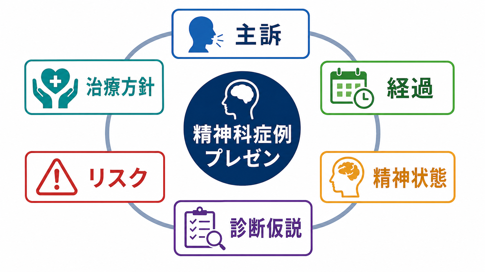
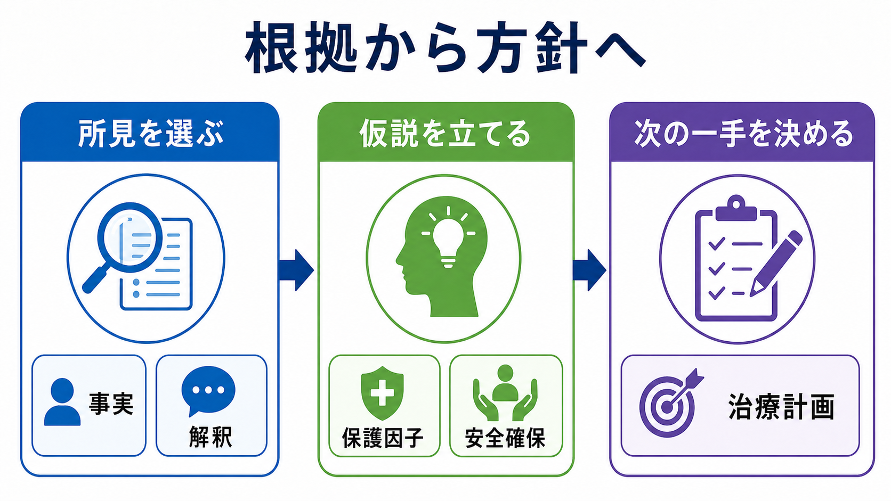
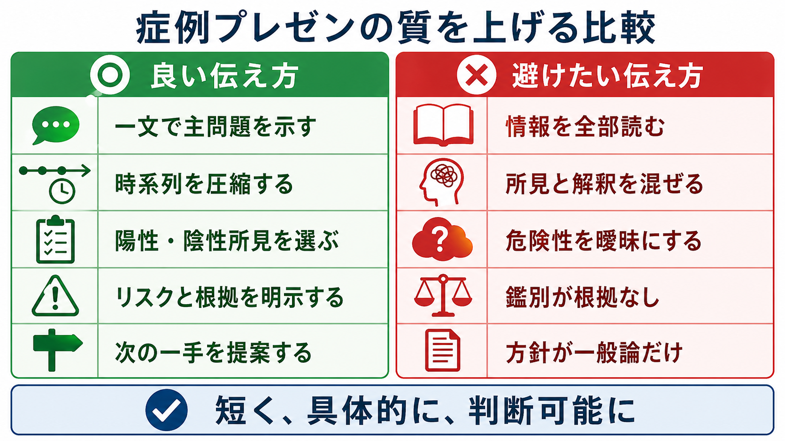

# 症例プレゼンテーションは精神科でどう行うか

## 要点

- 精神科の症例プレゼンテーションは、情報を全部読む場ではなく、聞き手が「何が問題で、どれくらい危険で、次に何をするべきか」を判断できるように要約する場である。
- 基本の順序は、主訴、受診・入院の文脈、現病歴、既往歴・薬剤・物質使用、生活・家族・社会背景、[[精神状態診察（MSE）とは何か|精神状態診察]]、診断仮説、リスク、治療方針である[1][2]。
- 精神科では、症状名や診断名だけでなく、本人の語り、観察された所見、機能障害、保護因子、文化的背景、治療関係を短く統合して伝える必要がある[1][4][6]。
- リスクは「高い・低い」とだけ言わず、自傷、他害、セルフネグレクト、離脱・せん妄、虐待・搾取、治療中断などについて、根拠と直近の対応を明示する[3]。
- 最後は「診断仮説」と「治療方針」を対応させる。鑑別診断、追加評価、安全確保、薬物療法、心理社会的介入、家族・地域連携、フォロー予定までを、優先順位つきで述べる。

## この記事で答える問い

1. 精神科の症例プレゼンテーションは、内科的な症例提示と何が違うのか。
2. 主訴、経過、精神状態、診断仮説、リスク、治療方針をどの順番で話すと伝わりやすいのか。
3. 情報量が多い精神科症例を、どのように短く圧縮するのか。
4. 診断名が未確定な場面で、どこまで仮説として述べてよいのか。
5. 指導医、チーム、当直申し送り、カンファレンスで何を変えるべきか。

## まず結論

最初の一文で、患者像、主問題、緊急度を示す。たとえば「20代男性、2週間の不眠と被害的な言動が増悪し、家族に付き添われて救急受診した方です。現在は自傷他害の切迫性と初回精神病エピソードの評価が主要課題です」のように始める。

その後は、時系列を長く語るのではなく、聞き手の判断に必要な事実を選ぶ。主訴、発症と増悪の経過、誘因、既往、薬剤、物質使用、身体疾患、家族歴、生活機能、精神状態所見を、診断仮説とリスク評価に接続させる。症例提示の目的は、記録の朗読ではなく、臨床判断を共有することである[1][7]。

## 背景

精神科では、同じ診断名でも、現在の危険性、病識、家族・住居・経済状況、服薬可能性、トラウマ歴、物質使用、身体合併症によって治療方針が大きく変わる。したがって、症例プレゼンテーションでは、診断分類だけでなく、本人の困りごとと生活文脈を統合する必要がある[5][6]。

また、精神科の情報は本人の語り、家族や支援者からの情報、行動観察、身体所見、検査、過去記録から成る。これらはしばしば食い違うため、「本人はこう述べる」「家族はこう観察している」「面接ではこう見えた」と、情報源を分けて話すことが重要である[1][2]。

## 基本概念

### 1. 主訴は本人の言葉と臨床課題を分ける

[[主訴はどのように聞くべきか|主訴]]は、本人が何に困っているかを示す入口である。ただし精神科では、本人の主訴とチームが扱うべき臨床課題が一致しないことがある。たとえば本人は「眠れない」と述べるが、家族は「浪費と易怒性」を心配している場合、両方を分けて提示する。

良い言い方は、「本人の主訴は不眠ですが、受診契機は家族が心配した浪費と攻撃的言動です」のように、本人の言葉と受診理由を同時に置くことである。

### 2. 経過は時系列ではなく転機で圧縮する

経過は、発症前のベースライン、発症、増悪、受診契機、現在の状態に分ける。細かい日付を全部読むより、「いつから何が変わったか」「何が悪化を示すか」「何が保たれているか」を選ぶ。

例として、「3か月前までは勤務継続。1か月前から睡眠時間が2から3時間に減り、2週間前から被害的解釈が増え、昨日家族への威嚇があり救急受診」とまとめると、機能低下と緊急度が伝わる。

### 3. 精神状態は陽性所見と陰性所見を選ぶ

[[精神状態診察（MSE）とは何か|精神状態診察]]では、外観・行動、話し方、気分・感情、思考過程、思考内容、知覚、認知、病識・判断を観察する[2]。プレゼンでは全項目を機械的に読むのではなく、診断仮説とリスクに関係する所見を選ぶ。

たとえば精神病症状が疑われるなら、被害妄想、幻聴、思考のまとまり、興奮、病識を述べる。認知症やせん妄が疑われるなら、意識、注意、見当識、変動性を前に出す。所見がないことも重要で、「希死念慮は明確に否定」「幻聴は否定」「意識清明で見当識は保たれる」のように、鑑別や安全判断に効く陰性所見を述べる。

### 4. 診断仮説は「根拠つきの作業仮説」として出す

診断名が未確定でも、症例プレゼンでは作業仮説を示す。言い切りを避け、「現時点では、急性精神病症状を伴う気分エピソード、統合失調症スペクトラム、物質・身体疾患による精神症状を鑑別に置いています」のように述べる。

仮説は、所見、経過、除外すべき病態、未確認情報と対応させる。これは[[ケースフォーミュレーションとは何か|ケースフォーミュレーション]]にも近い。診断名だけでなく、症状が何により起こり、何により続き、何が保護因子になるかを整理することで、治療方針に接続しやすくなる[5][6]。

### 5. リスクは結論、根拠、対応をセットで述べる

リスク評価は、単なるラベルではない。NICEの自傷ガイドラインも、リスク尺度や単純な点数だけで将来の自傷や自殺を予測し、処遇を決めることを避けるよう求めている[3]。症例提示では、「何が危険か」「どの根拠でそう考えるか」「今どう対応するか」を述べる。

例として、「自殺リスクは中等度と考えます。理由は、希死念慮はあるが具体的計画は否定し、家族同居と受診継続の意思が保たれる一方、過去の自傷歴と不眠があるためです。今夜は家族同伴で帰宅せず、入院適応を検討します」のように、判断可能な形にする。

### 6. 治療方針は鑑別とリスクに対応させる

治療方針は、「薬を出す」「入院する」だけでは不十分である。診断仮説、リスク、本人の希望、家族・地域資源、身体合併症、フォロー可能性を踏まえて、次の一手を述べる[1][8]。

典型的には、追加評価、環境調整、安全確保、薬物療法、心理教育、家族支援、ケースワーク、フォロー間隔を挙げる。本人との合意形成が必要な場面では、[[共同意思決定とは何か|共同意思決定]]や[[心理教育とは何か|心理教育]]への接続も示す。

## 仕組み

症例プレゼンテーションの情報は、次の順で圧縮すると伝わりやすい。

| 段階 | 話すこと | 省くこと |
|---|---|---|
| 一文要約 | 年齢層、性別、受診文脈、主問題、緊急度 | 詳細な生活史 |
| 主訴・契機 | 本人の訴え、紹介理由、家族・支援者の心配 | 逐語的な長い引用 |
| 経過 | 発症前、発症、増悪、現在、治療反応 | 重要でない日付 |
| 背景 | 既往、薬剤、物質使用、家族歴、生活機能、文化的背景 | 診断に無関係な雑多な情報 |
| MSE | 鑑別とリスクに効く陽性・陰性所見 | 正常所見の羅列 |
| 評価 | 診断仮説、リスク、保護因子、未確認情報 | 根拠のない断定 |
| 方針 | 安全確保、追加評価、治療、連携、フォロー | 一般論だけの方針 |

実際の発表では、次の型を使うとよい。

> 「X歳代の方で、Aを主訴に、Bを契機に受診しました。Cという経過で、現在Dが主要な問題です。MSEではEを認め、Fは否定的です。現時点の診断仮説はGで、鑑別としてHを考えます。リスクはIで、根拠はJです。方針はKです。」

## 図解

1枚目は全体像、2枚目は根拠から方針へ進む思考過程、3枚目は良い伝え方と避けたい伝え方の比較である。

## 臨床・研究との接続

臨床では、症例プレゼンテーションはチーム医療の共通言語である。救急、入院、外来、リエゾン、地域支援では、聞き手が必要とする情報が少しずつ違う。救急では安全と身体疾患の除外、入院ではリスクと治療目標、外来では経過とアドヒアランス、地域支援では生活機能と支援資源を前に出す。

研究・教育では、症例プレゼンテーションは臨床推論を可視化する訓練になる。どの所見を重視し、どの鑑別を残し、どのリスクに対応したかを明示することで、指導者は学習者の判断過程を評価しやすくなる。口頭症例提示の教育では、聞き手の判断に必要な情報を選び、問題表現から評価・計画へ進めることが重視される[7]。

文化的背景を扱う場合は、本人が問題をどう説明しているか、家族や共同体がどう理解しているか、支援への障壁は何かを確認する。DSM-5-TRの文化的定式化面接は、このような文脈を構造化して聞くための枠組みを提供している[4]。

## よくある誤解

### 誤解1: 詳しく話すほど良い

詳しさそのものは価値ではない。聞き手が判断できる情報を選ぶことが重要である。長い生活史や逐語的なやりとりは、診断仮説、リスク、方針に関係する部分だけを使う。

### 誤解2: 診断名が決まるまで評価を述べてはいけない

精神科では、診断が未確定な段階で安全確保や治療環境の判断が必要になる。したがって、「確定診断」ではなく「現時点の作業仮説」として述べる。未確認情報も同時に挙げる。

### 誤解3: MSEはチェックリストを全部読むもの

MSEは網羅的に観察するが、プレゼンでは選択する。[[MSEで外観と行動から何を観察するか|外観と行動]]、[[MSEで話し方から何がわかるのか|話し方]]、[[MSEで気分と感情をどう区別するか|気分と感情]]、[[MSEで思考内容をどう評価するか|思考内容]]のうち、今回の判断に効く所見を前に出す。

### 誤解4: リスクは「高・中・低」で十分

不十分である。リスクは、種類、切迫性、変動要因、保護因子、対応を含めて述べる。特に[[他害リスク評価では何を見るべきか|他害リスク評価]]、自傷、セルフネグレクト、身体疾患、虐待・搾取の可能性は、場面に応じて明示する。

## 関連ノート

既存ノート:

- [[主訴はどのように聞くべきか]]
- [[精神状態診察（MSE）とは何か]]
- [[MSEで外観と行動から何を観察するか]]
- [[MSEで話し方から何がわかるのか]]
- [[MSEで気分と感情をどう区別するか]]
- [[MSEで思考内容をどう評価するか]]
- [[ケースフォーミュレーションとは何か]]
- [[他害リスク評価では何を見るべきか]]
- [[共同意思決定とは何か]]
- [[心理教育とは何か]]
- [[ラポールはどのように形成されるのか]]
- [[器質性精神障害を見逃さないためには何を見るべきか]]

今後の作成候補:

- 精神科の一文要約はどう作るか
- 精神科の申し送りはどう行うか
- 自殺リスク評価はどうプレゼンするか
- 精神科カンファレンスでの質問にどう答えるか
- 診断仮説と鑑別診断をどう区別して話すか

MOC更新候補:

- `content/00_MOC/` 配下の精神医学、診断・面接、臨床実践関連MOCに追加候補。
- 並列ジョブとの衝突を避けるため、このタスクではMOC本体は更新しない。

## 理解チェック

1. 精神科症例プレゼンの冒頭一文に入れるべき要素は何か。
2. 本人の主訴と受診契機が違う場合、どのように話すとよいか。
3. MSEの所見を全部読むのではなく選ぶとき、何を基準にするか。
4. リスク評価を「高い」とだけ言うことの問題は何か。
5. 診断仮説と治療方針が対応しているかを確認するには、何を見るとよいか。

## 参考文献

[1] American Psychiatric Association. (2016). *The American Psychiatric Association Practice Guidelines for the Psychiatric Evaluation of Adults* (3rd ed.). https://psychiatryonline.org/doi/book/10.1176/appi.books.9780890426760

[2] Voss, R. M., & Das, J. M. (2023). Mental Status Examination. *StatPearls*. National Center for Biotechnology Information. https://www.ncbi.nlm.nih.gov/books/NBK546682/

[3] National Institute for Health and Care Excellence. (2022). *Self-harm: assessment, management and preventing recurrence* (NICE Guideline NG225). https://www.nice.org.uk/guidance/ng225

[4] American Psychiatric Association. (2022). *DSM-5-TR Cultural Formulation Interview*. https://www.psychiatry.org/File%20Library/Psychiatrists/Practice/DSM/DSM-5-TR/APA-DSM5TR-CulturalFormulationInterview.pdf

[5] Macneil, C. A., Hasty, M. K., Conus, P., & Berk, M. (2012). Is diagnosis enough to guide interventions in mental health? Using case formulation in clinical practice. *BMC Medicine, 10*, 111. https://doi.org/10.1186/1741-7015-10-111

[6] Engel, G. L. (1977). The need for a new medical model: A challenge for biomedicine. *Science, 196*(4286), 129-136. https://doi.org/10.1126/science.847460

[7] American College of Physicians. (n.d.). *Guidelines for Oral Presentations*. https://www.acponline.org/about-acp/about-internal-medicine/career-paths/residency-career-counseling/guidelines-for-oral-presentation

[8] University of Washington Psychiatry Consultation Line. (n.d.). *Case Outline*. https://pcl.psychiatry.uw.edu/how-it-works/case-outline/
