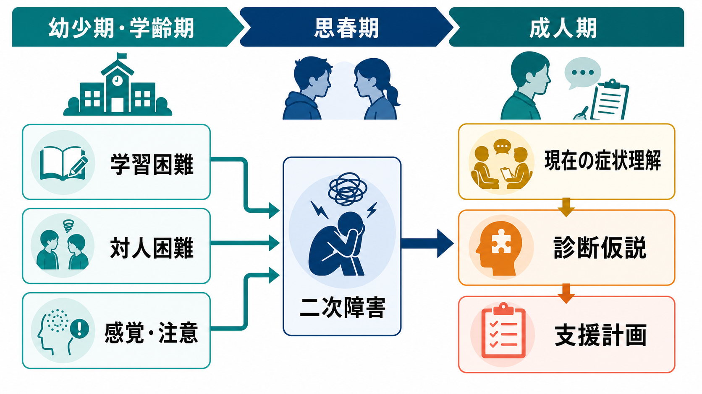
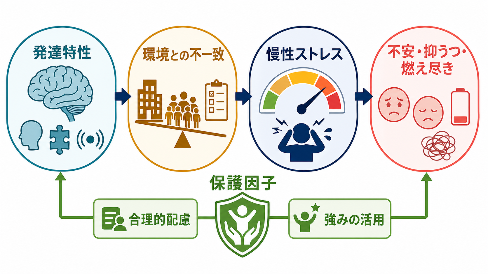
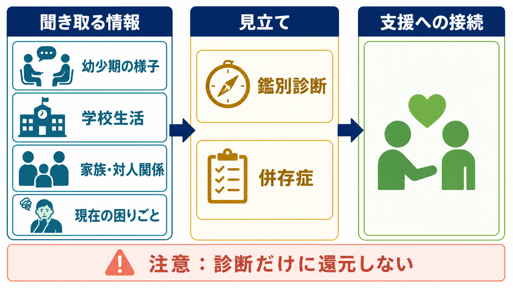

# 発達歴は成人精神科でもなぜ重要なのか

## 要点

- 成人精神科でも、発達歴は「子どもの頃の話」ではなく、現在の症状を時間軸の中で理解するための中核情報である。
- ADHDや自閉スペクトラム症などの神経発達症では、小児期からの持続性、複数場面での困難、成人期の機能障害を確認する必要がある[1][2]。
- 学習困難、対人困難、感覚過敏、注意・実行機能の偏りは、うつ、不安、燃え尽き、依存、対人トラブルの背景として現れることがある[3][4]。
- 発達歴は「診断名を付けるため」だけでなく、誤診を避け、併存症を見立て、本人に合う環境調整と支援計画を作るために使う。
- 医療・精神医学に関する内容は教育・研究目的の整理であり、個別診断や治療指示ではない。

## この記事で答える問い

成人期に、なぜ幼少期の様子、学校生活、学習困難、対人関係、家庭環境を聞く必要があるのか。本人が困っているのは「いま」なのに、なぜ「昔」をたどるのか。この問いに、[[精神科初診で何を確認するべきか]]、[[鑑別診断とは何か]]、[[発達精神病理学とは何か]]と接続しながら答える。

## まず結論

発達歴を聞く理由は、現在の症状を「単発の症状リスト」ではなく、「その人がどのような特性をもち、どの環境で困難が強まり、どの支援で持ち直してきたか」という経過として理解するためである。

たとえば成人期の抑うつが、純粋な気分障害として生じている場合もあれば、未診断のADHDによる慢性的な失敗体験、自閉スペクトラム特性と職場環境の不一致、読字・書字・計算の困難による自己評価の低下、いじめや家庭内ストレスの蓄積を背景にもつ場合もある。これらは表面上は「不安」「うつ」「対人回避」「仕事が続かない」と似て見えるが、支援の焦点は大きく異なる。

## 背景

成人精神科では、初診時に主訴、現病歴、既往歴、家族歴、生活歴、発達歴、物質使用、身体疾患、リスク、精神状態を統合して見立てる。APAの成人精神科評価ガイドラインも、症状だけでなく、精神科既往、トラウマ歴、物質使用、身体疾患、文化的背景、機能、本人との意思決定を含む包括的評価を重視している[5]。

その中で発達歴が重要になるのは、精神症状の多くが「いつ、どの状況から、どのように続いてきたのか」によって意味を変えるからである。小児期から一貫して不注意や衝動性があり、学校・家庭・仕事の複数場面で機能障害があるなら、成人期の不注意は気分障害や睡眠不足だけでなくADHDの可能性も検討する必要がある[1][3]。幼少期から対人相互性、感覚処理、こだわりの偏りがあり、成人期に社会的疲弊や不安が強いなら、自閉スペクトラム症と併存する不安・抑うつ、あるいはカモフラージュの負荷も見立てに入る[2][6]。

## 基本概念

### 発達歴

発達歴とは、乳幼児期から成人期までの発達、学習、対人関係、家庭・学校・職場での適応、強み、困難、支援経験を時系列に整理した情報である。単に「発達障害があるか」を調べる項目ではない。[[発達とは何か]]で扱うように、発達は生物学的成熟、環境、学習、対人関係が相互作用する過程である。

確認したい内容は、たとえば次のようなものになる。

| 領域 | 聞き取ること | 現在の症状理解への意味 |
|---|---|---|
| 乳幼児期 | 言葉、運動、睡眠、食事、感覚過敏、分離不安 | 早期からの特性か、後天的変化かを区別する |
| 学齢期 | 読字・書字・計算、忘れ物、授業参加、友人関係 | 学習困難や注意・実行機能の偏りを探る |
| 思春期 | いじめ、孤立、過剰適応、不登校、自己評価 | 二次障害やトラウマ反応の背景を探る |
| 成人期 | 仕事、家事、対人、金銭管理、睡眠、依存 | 現在の機能障害と支援ニーズを具体化する |
| 強み | 得意な環境、興味、集中できる条件、支援で改善した経験 | 合理的配慮と回復資源を見つける |

### 神経発達症

DSM-5-TRでは、神経発達症群は発達期に始まり、個人的・社会的・学業的・職業的機能に障害をもたらす発達上の困難として整理される[4]。成人期に初めて相談につながる人でも、困難そのものは学齢期から存在していたが、家族の支援、知的能力、興味の強さ、環境の相性、努力によって見えにくくなっていた場合がある。

ここで重要なのは、発達特性を「原因のすべて」とみなさないことである。発達特性は、[[神経発達の異常は精神疾患にどう関わるのか]]で扱うように、脆弱性にも強みにもなりうる。環境との相性が悪いと慢性ストレスや二次障害につながり、相性がよいと高い専門性や安定した生活につながる。

### 二次障害

二次障害とは、もともとの特性そのものではなく、特性と環境の不一致、失敗体験、叱責、孤立、いじめ、過剰適応、睡眠不足などが積み重なって生じる不安、抑うつ、怒り、依存、身体症状、自己否定などを指す臨床的な見立てである。これは正式診断名というより、経過を理解するための実践的概念である。

## 仕組み

### 1. 発達特性と環境の不一致が慢性ストレスを作る

発達歴が役立つ第一の理由は、現在の症状が「個人の弱さ」ではなく、特性と環境の不一致から生じている可能性を見つけるためである。

たとえば、注意の切り替えが苦手な人が、頻繁な割り込みとマルチタスクを求められる職場に置かれると、失敗体験が増える。感覚過敏が強い人が、騒音や照明の強い環境で働くと、疲労や怒りが強まりやすい。暗黙の対人ルールの読み取りが苦手な人が、雑談や根回しを重視する環境にいると、対人不安や孤立が起こりやすい。

この場合、症状だけを見れば「不安」「抑うつ」「適応障害」に見える。しかし発達歴を含めると、環境調整、業務設計、対人支援、睡眠改善、感覚刺激の調整が治療・支援の中心に入る。

### 2. 学習困難は自己評価と職業機能に影響する

学習困難は成人精神科で見逃されやすい。読字、書字、計算、処理速度、ワーキングメモリの困難は、学齢期だけでなく、成人期の資格取得、書類作成、金銭管理、メール対応、業務手順の理解にも影響する。特異的学習症は学業スキルの獲得・使用の困難として発達期から現れ、成人期まで持続しうる[4]。

小児期に学習障害があった人では、成人期の精神的健康、教育達成、雇用に不利が生じることが報告されている[7]。これは「学力の問題」に限定されない。失敗体験、叱責、からかい、努力しても成果が出にくい経験は、自己効力感や対人信頼に影響し、うつや不安の背景になりうる。

### 3. 対人困難は「性格」だけでは説明できない

成人期の対人困難は、しばしば「性格」「コミュニケーション能力」「パーソナリティ」として語られる。しかし発達歴を聞くと、幼少期から集団遊びが苦手だった、友人関係の暗黙ルールが分からなかった、冗談や皮肉の理解が難しかった、興味が偏っていた、過剰に合わせて疲弊していた、という経過が見えてくることがある。

成人の自閉スペクトラム症の評価では、NICEは包括的評価の中で、可能な範囲で早期発達歴、家庭・教育・雇用での機能、過去と現在の精神疾患、他の神経発達症、感覚過敏・鈍麻などを評価することを推奨している[2]。また、成人期にはカモフラージュによって表面上の対人適応が保たれていても、内的な疲労、不安、抑うつが強い場合がある。カモフラージュ研究の系統的レビューでは、自己報告されたカモフラージュが高いほどメンタルヘルス不調と関連する傾向が示されている[6]。

### 4. 小児期逆境は成人期の症状を変形させる

発達歴は神経発達症だけのためにあるわけではない。虐待、ネグレクト、家庭内暴力、親の精神疾患、いじめ、喪失、貧困、差別などの小児期逆境は、成人期の不安、抑うつ、PTSD、自傷・自殺念慮、物質使用、対人不信と関連する。前向き縦断研究を対象としたメタ分析でも、小児期逆境は成人期の複数の精神健康アウトカムと関連することが報告されている[8]。

ただし、逆境を聞く目的は「原因探し」や「責任追及」ではない。現在の安全、トリガー、対人反応、身体感覚、支援資源を理解し、[[トラウマは発達にどう影響するのか]]や[[養育環境は発達にどう影響するのか]]と接続して、より侵襲の少ない支援につなげるためである。

## 図解

成人精神科で発達歴を扱うときは、情報を次の3層に分けると整理しやすい。

| 層 | 見るもの | 使い道 |
|---|---|---|
| 時間軸 | 乳幼児期、学齢期、思春期、成人期 | 一過性か、持続性か、増悪・軽快の条件は何かを見る |
| 場面軸 | 家庭、学校、職場、友人、親密関係、オンライン環境 | 複数場面での困難か、特定環境との不一致かを見る |
| 機能軸 | 学習、注意、感覚、対人、睡眠、情動調整、生活管理 | 診断仮説ではなく支援ニーズに落とす |

## 臨床・研究との接続

### 鑑別診断を狭める

発達歴は、[[カテゴリ診断と次元診断は何が違うのか]]と[[精神科診断における除外診断とは何か]]の両方に関わる。たとえば不注意は、ADHD、うつ病、不安症、睡眠障害、物質使用、甲状腺疾患、薬剤性、トラウマ反応、認知機能低下で起こりうる。発達歴は、その不注意が小児期から多場面で存在したのか、ある時期から出現したのかを区別する材料になる。

### 併存症を見落としにくくする

ADHDや自閉スペクトラム症は、単独で存在するとは限らない。ADHDには不安、抑うつ、物質使用、睡眠問題などが併存しやすく、成人期の診断では併存症が臨床像を複雑にする[3]。自閉スペクトラム症でも、不安、抑うつ、強迫症状、摂食の問題、睡眠問題、自殺リスクなどを別個に評価する必要がある[2][6]。

### 支援計画を具体化する

発達歴から分かるのは、困難だけではない。うまくいった環境、理解してくれた大人、得意な課題、集中できる条件、興味、安心できる対人距離、回復経験も重要である。支援計画では、診断名よりも次の問いが実用的なことが多い。

- どの場面で困るのか。
- どの刺激、手順、対人状況で負荷が上がるのか。
- どの支援があると機能が戻るのか。
- 本人が納得できる説明は何か。
- 職場、学校、家庭、福祉、心理支援のどこにつなぐべきか。

## よくある誤解

### 誤解1: 成人精神科で発達歴を聞くのは発達障害を疑うときだけでよい

発達歴は、発達障害の診断だけでなく、気分症、不安症、トラウマ関連症状、依存、身体症状、対人困難、職業機能の理解にも役立つ。現在の症状がどの経路で生じたのかを見るための基本情報である。

### 誤解2: 子どもの頃に診断されていなければ、成人期に発達特性は問題にならない

幼少期に診断されなかったことは、発達特性がなかったことを意味しない。知的能力、家族の支援、本人の努力、学校環境との相性、カモフラージュによって、困難が成人期まで表面化しないことがある。

### 誤解3: 発達歴を聞くと、本人や家族を責めることになる

発達歴は責任の所在を決めるためではなく、経過と支援条件を理解するために聞く。家族歴や養育歴を扱うときは、本人の同意、心理的安全、緊急性、守秘、情報共有の範囲を明確にする必要がある。

### 誤解4: 発達特性が分かれば、現在の症状はすべて説明できる

発達特性は重要な要素だが、すべてを説明するわけではない。気分症、双極症、精神病症、物質使用、睡眠障害、身体疾患、薬剤性、トラウマ、生活困窮なども並行して評価する必要がある。

## 関連ノート

- [[精神科初診で何を確認するべきか]]
- [[精神科面接とは何か]]
- [[鑑別診断とは何か]]
- [[精神科診断における除外診断とは何か]]
- [[カテゴリ診断と次元診断は何が違うのか]]
- [[発達とは何か]]
- [[発達精神病理学とは何か]]
- [[神経発達の異常は精神疾患にどう関わるのか]]
- [[ADHDは前頭線条体回路の障害として説明できるのか]]
- [[トラウマは発達にどう影響するのか]]
- [[養育環境は発達にどう影響するのか]]

### MOC更新候補

- `content/00_MOC/MOC｜精神医学.md` に `[[発達歴は成人精神科でもなぜ重要なのか]]` を追加する。
- `content/00_MOC/MOC｜認知科学・心理学.md` または発達関連MOCがある場合、発達精神病理学・神経発達症との接続として追加する。
- 並列ジョブとの競合を避けるため、このタスクではMOC本体は更新しない。

### 今後の作成候補

- 「成人ADHDの診断で小児期情報をどう扱うか」
- 「成人自閉スペクトラム症のカモフラージュとは何か」
- 「学習困難は成人期のメンタルヘルスにどう影響するのか」
- 「二次障害とは何か」

## 理解チェック

1. 成人期の不注意を評価するとき、発達歴が鑑別診断に役立つ理由は何か。
2. 学習困難が成人期のうつや不安に結びつく経路を、少なくとも2つ挙げられるか。
3. 自閉スペクトラム特性とカモフラージュを考えると、表面上の対人適応だけでは不十分な理由は何か。
4. 発達歴を聞くとき、本人や家族を責める聞き方を避けるには何に注意するべきか。
5. 発達歴から得た情報を、診断名ではなく支援計画に落とすにはどのような問いが必要か。

## 参考文献

[1] National Institute for Health and Care Excellence. (2018, updated 2024). *Attention deficit hyperactivity disorder: diagnosis and management* (NICE guideline NG87). https://www.nice.org.uk/guidance/ng87

[2] National Institute for Health and Care Excellence. (2012, updated 2021). *Autism spectrum disorder in adults: diagnosis and management* (Clinical guideline CG142). https://www.nice.org.uk/guidance/cg142

[3] Faraone, S. V., Banaschewski, T., Coghill, D., et al. (2021). The World Federation of ADHD International Consensus Statement: 208 evidence-based conclusions about the disorder. *Neuroscience & Biobehavioral Reviews, 128*, 789-818. https://doi.org/10.1016/j.neubiorev.2021.01.022

[4] American Psychiatric Association. (2022). *Diagnostic and Statistical Manual of Mental Disorders* (5th ed., text rev.; DSM-5-TR). American Psychiatric Association Publishing. https://doi.org/10.1176/appi.books.9780890425787

[5] Silverman, J. J., Galanter, M., Jackson-Triche, M., et al. (2015). The American Psychiatric Association practice guidelines for the psychiatric evaluation of adults. *American Journal of Psychiatry, 172*(8), 798-802. https://doi.org/10.1176/appi.ajp.2015.1720501

[6] Cook, J., Hull, L., Crane, L., & Mandy, W. (2021). Camouflaging in autism: A systematic review. *Clinical Psychology Review, 89*, 102080. https://doi.org/10.1016/j.cpr.2021.102080

[7] Aro, T., Eklund, K., Eloranta, A.-K., Närhi, V., Korhonen, E., & Ahonen, T. (2019). Associations between childhood learning disabilities and adult-age mental health problems, lack of education, and unemployment. *Journal of Learning Disabilities, 52*(1), 71-83. https://doi.org/10.1177/0022219418775118

[8] Thurston, C., Murray, A. L., Franchino-Olsen, H., Silima, M., Hemady, C. L., & Meinck, F. (2025). Prospective longitudinal associations between adverse childhood experiences and adult mental health outcomes: Systematic review and meta-analysis. *Trauma, Violence, & Abuse*. https://doi.org/10.1177/15248380251358223

## 未解決問題

- 日本の成人精神科初診で、発達歴をどの程度標準化して聞くべきか。
- 本人の記憶、家族情報、学校記録、心理検査結果が食い違う場合に、どのように共同意思決定へつなげるか。
- 発達特性、トラウマ、文化的背景、貧困、職場環境を、過剰診断にも過小評価にもならない形で統合する方法は何か。
- 成人期の合理的配慮や福祉資源への接続が、二次障害の回復にどの程度寄与するか。
