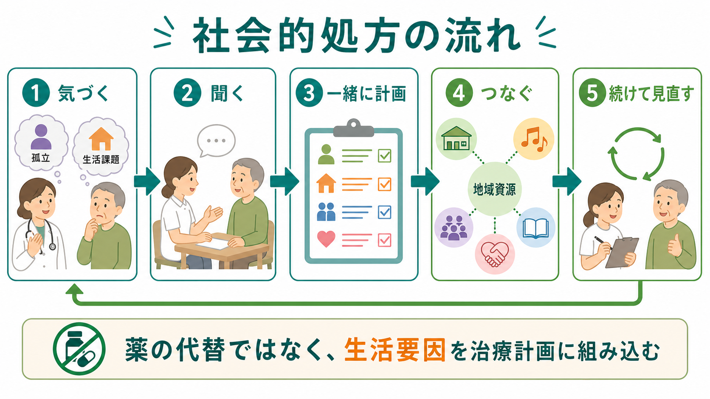
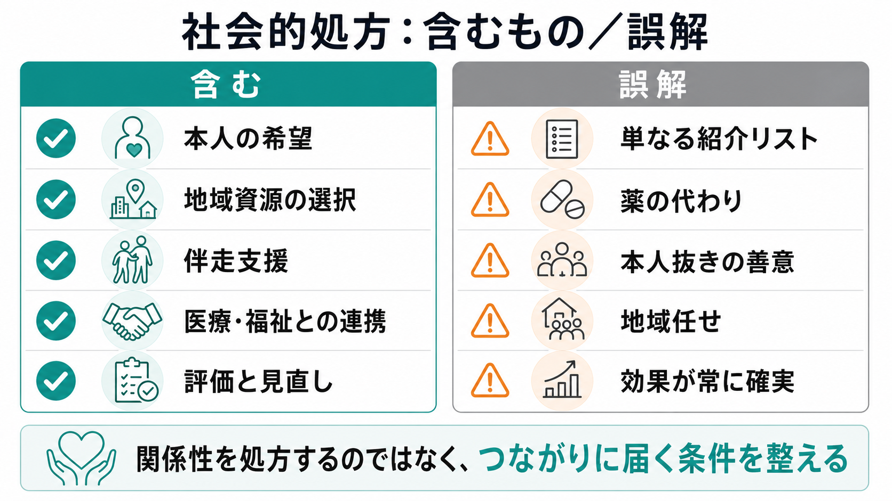

# 社会的処方とは何か

## 要点

- 社会的処方とは、孤立、生活困窮、住まい、活動機会、軽度メンタルヘルス、慢性疾患管理などの非医療的ニーズを、地域資源への接続と伴走支援を通じてケア計画に組み込む考え方である[1][2]。
- 薬物療法や心理療法を置き換えるものではなく、症状の背景にある生活条件、関係性、参加機会を治療・支援の文脈に入れる補完的アプローチである。
- 中核は「紹介リスト」ではなく、本人の希望を聴き、リンクワーカーなどが地域資源との間を橋渡しし、参加後の障壁を見直すプロセスである[2][6][7]。
- 孤独・社会的孤立は健康リスクと関連するが、社会的処方の効果研究はまだ不均一で、実装条件、対象者、アウトカム、費用対効果を慎重に評価する必要がある[3][4][5]。

## この記事で答える問い

1. 社会的処方は、何を「処方」しているのか。
2. 医療者、リンクワーカー、地域資源、本人はどのように関わるのか。
3. 精神医学・プライマリケア・地域保健では、どこに有用性と限界があるのか。
4. 「地域につなげればよい」という単純化を避けるには、何を見ればよいのか。

## まず結論

社会的処方は、**関係性そのものを命令する処方**ではない。むしろ、本人が地域の人、活動、制度、相談先に届きやすくなる条件を整える支援である。

たとえば、抑うつ気分、不眠、慢性痛、糖尿病、認知症介護、失業、ひきこもり、死別後の孤立が重なると、診察室で見える「症状」は生活全体の困難の一部になる。このとき、医療者が薬や検査だけで完結させず、本人の価値観、日課、移動手段、家計、支援者、地域の居場所を含めて計画する。これが社会的処方の臨床的な意味である[1][2]。

## 背景

社会的処方が注目される背景には、医療だけでは扱いきれない健康問題がある。WHOの実装ツールキットは、社会的処方を「地域の非臨床サービスへ患者をつなげ、健康とウェルビーイングを改善する方法」と位置づけ、社会的包摂、住居、教育、社会経済的条件といった健康の社会的決定要因に働きかける実装手順を整理している[1]。

孤独・社会的孤立は、単なる気分の問題ではない。148研究、30万人以上を含むメタ分析では、社会的関係の強さは死亡リスクと関連し、社会的統合の複合的指標ほど関連が大きいことが示された[3]。また、米国National Academiesの報告書は、高齢者の孤立・孤独を医療システムが見逃しやすい公衆衛生課題として整理している[4]。この文脈は、[[孤独は心身にどのような影響を与えるのか]]や[[社会的支援は健康にどう影響するのか]]と接続して読むと理解しやすい。

日本でも、孤独・孤立、生活困窮、地域包括ケア、重層的支援体制、健康格差への関心とともに、社会的処方が議論されている。近藤は、医療機関が生活困窮者に出会う重要な場であり、社会的処方を「医療現場においても生活の課題に地域とともに対応していく仕組み」として整理している[8]。

## 基本概念

社会的処方の対象は「社会的な問題を抱える人」だけではない。NHS Englandは、社会的処方を、実用的・社会的・情緒的ニーズに合う地域の活動、グループ、サービスへ人をつなぐアプローチとして説明している[2]。典型的には、次のようなニーズが重なる。

| 領域 | 例 | 臨床上の意味 |
|---|---|---|
| 孤立・孤独 | 会う人が少ない、所属先がない、死別後に閉じこもる | 抑うつ、不安、睡眠、受療行動に影響しうる |
| 生活基盤 | 住まい、家計、債務、食料、移動手段 | 治療継続や服薬、通院、セルフケアの前提になる |
| 活動・役割 | 仕事、学業、家事、趣味、ボランティア | [[行動変容はどのように起こるのか|行動変容]]と生活リズムに関わる |
| 関係性 | 家族、近隣、ピア、支援者 | [[社会的支援は健康にどう影響するのか|社会的支援]]の質に関わる |
| 文化・価値観 | 本人にとって意味ある活動、宗教、言語、慣習 | 支援が「押しつけ」になるかどうかを左右する |

重要なのは、社会的処方が「医療ができないことを地域に投げる」仕組みではない点である。本人の困りごとを医療・福祉・地域の共通言語へ翻訳し、実際に参加できる条件まで見直す点に特徴がある。

## 仕組み

社会的処方の実装モデルは国や地域で異なるが、多くは次の流れをもつ[1][2][6][7]。

1. 医療者や支援者が、症状の背後に孤立、生活困窮、住まい、活動機会の不足があることに気づく。
2. 本人中心の対話で、「何が問題か」だけでなく「何が大切か」「どの程度なら始められるか」を聴く。
3. リンクワーカー、相談支援員、ソーシャルワーカー、地域包括支援センター、NPOなどが、本人と地域資源を結ぶ。
4. 居場所、運動、芸術、学習、就労支援、福祉相談、家計相談、ピアサポートなどにつながる。
5. 参加できたか、合わなかったか、交通費や不安や対人負荷が障壁になったかを見直す。

リアリストレビューは、社会的処方がうまく働く条件を「誰に、どの文脈で、どの仕組みによって効くのか」として検討する。Huskらは、成功の要素として、適切な初回紹介、最初の活動参加、参加の継続を重視している[6]。2024年の迅速リアリストレビューでも、社会的処方を定着させるには、広い健康決定要因への意識、関係者間の信頼、リンクワーカーの技能と容量、本人の自立と地域参加を支える適切な支援、部門間の構造・資源調整が必要だと整理されている[7]。

## 図解

社会的処方を一言で図解すると、次のようになる。

| 見る点 | 従来の狭い見方 | 社会的処方で加える見方 |
|---|---|---|
| 問題 | 症状、診断名、受診頻度 | 症状が生活文脈で何を意味するか |
| 支援 | 薬、検査、専門職の助言 | 地域資源、制度、居場所、活動、ピア |
| 主体 | 専門職が選ぶ | 本人と支援者が一緒に選ぶ |
| 評価 | 症状尺度、受診回数 | 参加、生活機能、孤独感、満足、継続性 |
| 失敗の読み方 | 本人の意欲不足 | 障壁、ミスマッチ、負荷、アクセス問題 |

## 臨床・研究との接続

精神医学では、症状を本人の内側だけに閉じ込めて理解しないことが重要である。同じ「外に出られない」でも、うつ病による制止、対人不安、幻聴への反応、発達特性による疲弊、家計や介護の制約、差別経験、交通手段のなさでは支援が変わる。社会的処方は、この生活機能と文脈の評価を、実際の支援経路に接続する考え方である。

面接技法としては、本人の価値と選択を尊重する点で、[[モチベーション面接は行動変容をどう支えるのか]]や[[自己決定理論とは何か]]と相性がよい。社会的処方の面接は、「このサロンに行ってください」と指示するより、「どんな場なら安心できるか」「最初の10分だけなら可能か」「一緒に行く人が必要か」「合わなかった場合どう戻るか」を検討する作業に近い。

研究上は、アウトカムの選び方が難しい。受診回数の減少だけを成功とすると、必要な医療利用まで減らす方向に誘導する危険がある。逆に、ウェルビーイング尺度だけでは、住居、債務、就労、交通、地域資源の持続可能性を見落とす。Bickerdikeらのシステマティックレビューは、既存評価の多くが小規模で比較群を欠き、追跡期間が短く、バイアスリスクが高いと指摘した[5]。したがって、社会的処方は「良さそうだから有効」と断定するより、対象者、文脈、支援強度、費用、害、格差への影響を含めて評価する必要がある。

定性的研究も重要である。本人がなぜ参加しなかったのか、リンクワーカーがどの障壁を見立てたのか、地域団体が過負荷になっていないかは、単純な前後比較では見えにくい。こうした問いは、[[質的研究は心理学でどう使われるのか]]で扱う面接・観察・テーマ分析と接続しやすい。

## よくある誤解

### 誤解1: 社会的処方は薬の代わりである

薬物療法、心理療法、ケースマネジメント、危機介入が必要な場面では、それらを適切に行う必要がある。社会的処方は、医療を減らすための代替物ではなく、生活要因をケア計画に組み込む補完的な枠組みである。

### 誤解2: 地域資源リストを渡せばよい

リストだけでは、移動手段、費用、初回参加の不安、対人負荷、開所時間、文化的安全性、障害特性への配慮が残る。リンクワーカーの役割は、本人と地域の間にある障壁を一緒に見立てる点にある[2][6][7]。

### 誤解3: 孤独な人は必ず人とつながるべきである

孤独の感じ方は人によって違う。本人にとって必要なのは、常に集団参加ではなく、安全に一人でいられる条件、少数の信頼できる関係、匿名性のある相談、オンラインの接点かもしれない。支援は、本人の希望と負荷に合わせて設計する必要がある。

### 誤解4: 地域に任せれば医療費が下がる

社会的処方の価値を医療利用削減だけで測ると、支援の目的が歪む。地域団体の無償労働に依存しすぎると、地域資源そのものが疲弊する。実装には、資金、役割分担、情報共有、評価、継続的な関係づくりが必要である[7][8]。

## 関連ノート

- [[孤独は心身にどのような影響を与えるのか]]
- [[社会的支援は健康にどう影響するのか]]
- [[モチベーション面接は行動変容をどう支えるのか]]
- [[自己決定理論とは何か]]
- [[行動変容はどのように起こるのか]]
- [[質的研究は心理学でどう使われるのか]]

## 理解チェック

1. 社会的処方は、なぜ「紹介リストを渡すこと」だけでは不十分なのか。
2. 孤独・生活困窮・慢性疾患が重なる人に対して、医療者は何を評価すべきか。
3. 社会的処方のアウトカムを、受診回数の減少だけで測ると何が問題になるか。
4. 本人中心の社会的処方と、善意の押しつけを分ける条件は何か。

## MOC更新候補

- `content/00_MOC/MOC｜精神医学.md`
- `content/00_MOC/MOC｜臨床実践・治療.md`

## 今後の作成候補

- 健康の社会的決定要因とは何か
- リンクワーカーとは何か
- 地域包括ケアとは何か
- 孤独・孤立対策推進法とは何か

## 参考文献

[1] World Health Organization. Regional Office for the Western Pacific. (2022). *A toolkit on how to implement social prescribing*. WHO Regional Office for the Western Pacific. https://www.who.int/publications/i/item/9789290619765

[2] NHS England. *Social prescribing*. https://www.england.nhs.uk/personalisedcare/social-prescribing/

[3] Holt-Lunstad, J., Smith, T. B., & Layton, J. B. (2010). Social relationships and mortality risk: A meta-analytic review. *PLOS Medicine*, 7(7), e1000316. https://doi.org/10.1371/journal.pmed.1000316

[4] National Academies of Sciences, Engineering, and Medicine. (2020). *Social Isolation and Loneliness in Older Adults: Opportunities for the Health Care System*. National Academies Press. https://doi.org/10.17226/25663

[5] Bickerdike, L., Booth, A., Wilson, P. M., Farley, K., & Wright, K. (2017). Social prescribing: Less rhetoric and more reality. A systematic review of the evidence. *BMJ Open*, 7, e013384. https://doi.org/10.1136/bmjopen-2016-013384

[6] Husk, K., Blockley, K., Lovell, R., Bethel, A., Lang, I., Byng, R., & Garside, R. (2020). What approaches to social prescribing work, for whom, and in what circumstances? A realist review. *Health & Social Care in the Community*, 28(2), 309-324. https://doi.org/10.1111/hsc.12839

[7] Bos, C., de Weger, E., Wildeman, I., Pannebakker, N., & Kemper, P. F. (2024). Implement social prescribing successfully towards embedding: What works, for whom and in which context? A rapid realist review. *BMC Public Health*, 24, 1836. https://doi.org/10.1186/s12889-024-18688-3

[8] 近藤尚己. (2025). 社会的処方—生きづらさを抱える人に“出会った責任”を果たす仕組み. *公衆衛生*, 89(4), 317-326. https://doi.org/10.11477/mf.036851870890040317
