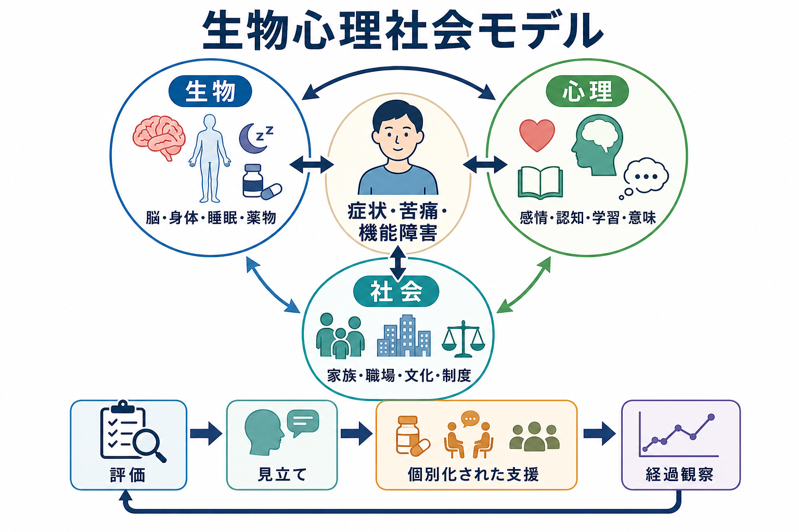
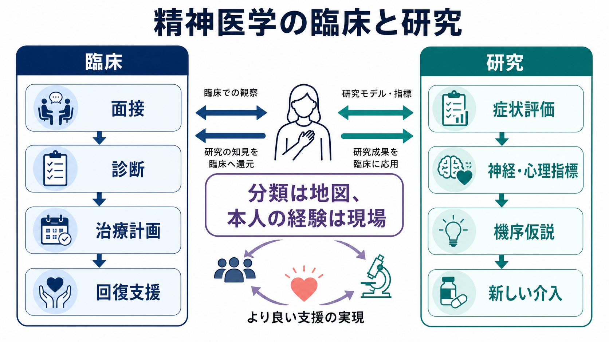

# 精神医学とは何か

## 要点

- 精神医学は、思考・感情・行動・身体感覚・対人関係・生活機能に現れる苦痛や困難を、医学的に評価し支援する領域である。
- 精神疾患は「脳だけ」「心だけ」「環境だけ」では説明しにくく、[[精神疾患は脳の病気なのか]]という問いも、生物・心理・社会の複数水準を行き来して扱う必要がある。
- 診断名は臨床判断とコミュニケーションのための地図であり、本人の経験、生活史、文化、機能、リスクを置き換えるものではない。
- 精神医学の臨床的役割は、症状を分類することだけではなく、安全確保、苦痛の軽減、機能回復、再発予防、本人の価値に沿った回復支援を含む。

## この記事で答える問い

- 精神医学は何を対象にするのか。
- 精神医学はどのような方法で「見立て」を作るのか。
- 生物心理社会モデルは、精神医学の実践で何を意味するのか。
- 診断・治療・研究はどのように接続しているのか。

## まず結論

精神医学とは、精神疾患を「脳の異常」または「心の問題」として一方向に説明する学問ではない。精神医学は、本人の主観的苦痛、行動、身体状態、発達歴、対人関係、文化、生活環境、社会制度を統合し、治療と支援につなげる臨床医学である。米国精神医学会は、精神医学を精神・情動・行動の障害の診断、治療、予防を扱う医学の分野として説明している[1]。ただし、精神医学の実践では診断名を付けること自体が目的ではなく、診断を手がかりに、何が困りごとを維持し、どの介入が安全で有用かを考える。

## 背景

精神医学は、歴史的には精神病院、神経学、心理学、公衆衛生、法制度、地域ケアと深く結びついて発展してきた。現代の精神医学では、精神疾患を単一の原因に還元するよりも、複数の要因が時間的に重なって症状や機能障害を形成すると考える。

この見方の古典的な基盤が、生物心理社会モデルである。Engel は、医学が生物学的異常だけを扱うのではなく、心理的・社会的文脈を含めて病いを理解する必要があると主張した[4]。近年の再検討でも、このモデルは単なる「要因リスト」ではなく、身体・心理・環境の相互作用を説明する枠組みとして整理されている[5]。この考え方は、精神医学では特に重要である。たとえば不眠、抑うつ、不安、幻覚、強迫、依存、摂食の問題は、神経回路、身体疾患、薬物、発達、学習、ストレス、対人関係、社会的孤立、文化的意味づけが相互作用して現れる。

同時に、精神医学は医学であるため、身体疾患、薬剤性症状、神経疾患、物質使用、自傷他害リスク、せん妄などの緊急性を見逃さない責任をもつ。これは、[[神経科学は精神疾患をどのように説明できるのか]]や[[身体性は精神医学にどう関わるのか]]と接続する論点である。

## 基本概念

### 精神医学の対象

精神医学が扱うのは、単なる「気分の落ち込み」や「変わった性格」ではない。重要なのは、症状が本人の苦痛、生活機能、対人関係、安全、意思決定、社会参加にどのような影響を与えているかである。米国精神医学会は、精神疾患を感情、思考、行動に関わり、苦痛や社会・仕事・家族活動上の問題を伴う健康状態として説明している[2]。

したがって、精神医学の評価では、症状の有無だけでなく、持続期間、重症度、生活上の影響、本人の意味づけ、文化的背景、発達段階、身体状態、リスクを総合して考える。

### 診断分類

診断分類は、臨床家同士が共通言語で話し、研究対象を定義し、治療方針を検討するための道具である。WHO の ICD-11 では、精神・行動・神経発達の障害が体系化され、国際的な診断・統計・保健政策の基盤として使われる[3]。

ただし、診断分類は本人の人生をそのまま写すものではない。診断名は臨床上の地図であり、地図は現場そのものではない。診断名が同じでも、原因、経過、支援資源、本人の価値、治療反応は大きく異なる。この点は、[[精神疾患の次元的理解とは何か]]や[[RDoCは精神疾患研究をどう変えたのか]]で扱う、カテゴリー診断と次元的理解の関係にもつながる。

### 見立て

臨床で重要なのは、診断名だけでなく「見立て」である。見立てとは、症状、背景、維持要因、保護因子、リスク、本人の希望を統合し、次に何を評価し、どの支援を優先するかを決める仮説である。

たとえば、同じ「不眠」でも、うつ病の一部、躁状態の前駆、PTSDの過覚醒、疼痛、カフェイン、シフト勤務、睡眠時無呼吸、薬剤、家庭内ストレスなど、見立ては大きく変わる。精神医学の面接は、この違いを丁寧に切り分けるための方法である。

## 仕組み

### 生物・心理・社会の相互作用

生物心理社会モデルでは、精神症状を三つの水準の相互作用として考える。

| 水準 | 例 | 臨床で見ること |
|---|---|---|
| 生物 | 遺伝、神経回路、睡眠、内分泌、炎症、薬物、身体疾患 | 身体診察、検査、薬剤、睡眠、物質使用、神経症状 |
| 心理 | 認知、感情、学習、記憶、自己理解、対処方略 | 面接、心理検査、行動観察、心理療法の適応 |
| 社会 | 家族、学校、職場、貧困、孤立、文化、制度 | 生活史、支援資源、社会保障、地域ケア、権利擁護 |

この三水準は、足し算ではなく相互作用である。たとえばストレスは睡眠や内分泌系を変え、睡眠不足は情動制御や対人関係を悪化させ、社会的孤立は回復資源を減らす。逆に、薬物療法、心理療法、家族支援、職場調整、睡眠改善、社会資源の導入は、別々の経路から同じ苦痛を軽減しうる。

### 診断から支援へ

精神医学の流れは、単純な「症状を聞く、診断する、薬を出す」ではない。実際には、次のような反復的な過程で進む。

1. 訴え、生活上の困難、安全面のリスクを確認する。
2. 精神状態診察、生活史、身体状態、薬剤、物質使用、文化的背景を評価する。
3. 診断仮説と鑑別診断を立てる。
4. 本人に説明し、不確実性を共有する。
5. 薬物療法、心理療法、環境調整、社会資源、家族支援を組み合わせる。
6. 経過を見ながら見立てと支援計画を更新する。

この反復性が重要である。初回面接で全てが分かるとは限らず、診断や支援方針は経過観察の中で洗練される。

## 図解

この記事の三つの図は、精神医学を次の三層として整理している。

- 図1: 生物・心理・社会の三水準を統合して、症状・苦痛・機能障害を理解する。
- 図2: 症状だけでなく、持続、苦痛、生活機能、文化・発達・状況を合わせて診断と支援を考える。
- 図3: 臨床観察と研究モデルは双方向に結びつき、よりよい支援へ戻る。

## 臨床・研究との接続

精神医学の臨床は、本人の語りを中心に置く実践である。一方で、研究では診断分類、症状評価、心理指標、神経画像、遺伝、行動課題、疫学、介入研究などを用いて、疾患や回復の機序を調べる。[[精神疾患の神経画像バイオマーカーは実用化できるのか]]という問いが示すように、現時点では多くの精神疾患で、診断を単独で確定できるバイオマーカーは限られている。だからこそ、研究知見は臨床面接や経過観察と組み合わせて使う必要がある。

RDoC は、従来の診断カテゴリーだけに依存せず、認知、情動、社会過程、覚醒・調節などの機能次元を神経・行動・自己報告の複数水準で調べようとする研究枠組みである[8]。これは臨床診断を置き換えるものではなく、精神疾患の機序をより細かく理解するための研究上の補助線である。

治療面では、[[薬物療法は神経回路にどう作用するのか]]、[[精神療法は脳を変えるのか]]、[[モチベーション面接は行動変容をどう支えるのか]]のように、生物学的介入、心理的介入、行動変容支援、社会的支援が互いに補完する。WHO は、精神保健医療の改革において、地域に根ざしたケア、人権、リカバリー志向、サービス利用者の参加を重視している[6][7]。

## よくある誤解

### 誤解1: 精神医学は心を薬で抑えるだけである

薬物療法は重要な選択肢だが、精神医学は薬だけではない。心理療法、心理教育、危機介入、睡眠・生活リズム調整、家族支援、職場・学校調整、社会資源の導入、身体疾患の評価などを含む。

### 誤解2: 診断名が分かれば原因も治療も一つに決まる

診断名は重要だが、同じ診断でも背景と維持要因は異なる。診断は支援の入り口であり、見立てと経過観察によって治療計画を個別化する。

### 誤解3: 精神疾患は本人の弱さである

精神疾患や精神的困難は、本人の意志の弱さに還元できない。生物学的脆弱性、発達、学習、トラウマ、身体疾患、生活環境、社会的排除などが複雑に関わる。個人の努力だけでなく、環境と支援体制を整えることが治療の一部である。

### 誤解4: 精神医学は客観性がない

精神医学には、面接、精神状態診察、診断基準、心理尺度、身体検査、観察、家族や支援者からの情報、経過評価など、複数の情報源がある。ただし、本人の主観的経験を軽視してよいわけではない。精神医学の難しさは、主観と客観を対立させるのではなく、両方を臨床判断に統合する点にある。

## 関連ノート

- [[精神疾患は脳の病気なのか]]
- [[精神疾患の次元的理解とは何か]]
- [[RDoCは精神疾患研究をどう変えたのか]]
- [[神経科学は精神疾患をどのように説明できるのか]]
- [[身体性は精神医学にどう関わるのか]]
- [[薬物療法は神経回路にどう作用するのか]]
- [[精神療法は脳を変えるのか]]
- [[モチベーション面接は行動変容をどう支えるのか]]

### MOC更新候補

- `content/00_MOC/MOC｜精神医学.md`
- `content/00_MOC/MOC｜臨床実践・治療.md`
- `content/00_MOC/MOC｜神経科学と精神疾患.md`

並列ジョブとの競合を避けるため、本記事作成時点では MOC 本体は更新しない。

## 理解チェック

1. 精神医学が扱う「症状」と「生活機能」はどのように違うか。
2. 診断名が臨床で有用である一方、診断名だけでは不十分なのはなぜか。
3. 生物心理社会モデルで、同じ症状に複数の介入経路がありうるのはなぜか。
4. RDoC のような研究枠組みは、臨床診断とどのような関係にあるか。

## 未解決問題

- 精神疾患の診断カテゴリーと、症状・神経機能・生活機能の次元的評価をどのように統合するか。
- 臨床現場で使えるバイオマーカーや予測モデルを、個人差と文化差を損なわずに実装できるか。
- 地域ケア、人権、リカバリー志向を、限られた医療資源の中でどう制度化するか。
- 本人の語りと客観的指標を、治療方針の共同意思決定にどう結びつけるか。

## 参考文献

[1] American Psychiatric Association. What is Psychiatry? https://www.psychiatry.org/patients-families/what-is-psychiatry

[2] American Psychiatric Association. What is Mental Illness? https://www.psychiatry.org/patients-families/what-is-mental-illness

[3] World Health Organization. ICD-11: Mental, behavioural or neurodevelopmental disorders. https://icd.who.int/browse/2024-01/mms/en#334423054

[4] Engel, G. L. (1977). The need for a new medical model: a challenge for biomedicine. *Science*, 196(4286), 129-136. https://doi.org/10.1126/science.847460

[5] Bolton, D., & Gillett, G. (2019). *The Biopsychosocial Model of Health and Disease: New Philosophical and Scientific Developments*. Palgrave Pivot. https://doi.org/10.1007/978-3-030-11899-0

[6] World Health Organization. (2022). *World mental health report: Transforming mental health for all*. https://www.who.int/publications/i/item/9789240049338

[7] World Health Organization. (2021). *Comprehensive mental health action plan 2013-2030*. https://www.who.int/publications/i/item/9789240031029

[8] National Institute of Mental Health. Research Domain Criteria (RDoC). https://www.nimh.nih.gov/research/research-funded-by-nimh/rdoc
