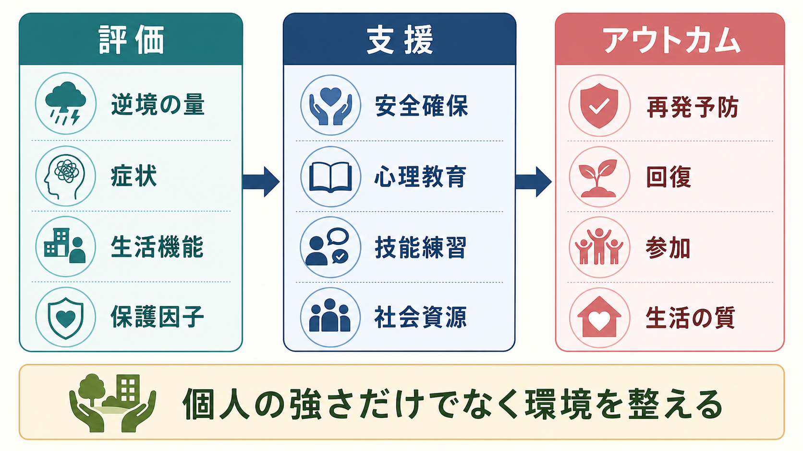

# 精神医学におけるレジリエンスとは何か

## 要点

- レジリエンスは「逆境を受けても傷つかない性格」ではなく、逆境への曝露と、その後の適応を同時に見て初めて推定される動的な過程である[1][2]。
- 個人要因、家族・対人関係、文化・制度・経済条件が相互に作用するため、本人の努力だけで説明してはいけない[1][3]。
- 精神医学では、症状の有無だけでなく、生活機能、役割、意味づけ、社会参加、再発予防を含めて評価する。
- 治療介入は「レジリエンスを鍛える」だけでなく、安全確保、環境調整、心理教育、技能練習、社会資源への接続を組み合わせる。

## この記事で答える問い

1. 精神医学でいうレジリエンスは、単なる「メンタルの強さ」と何が違うのか。
2. レジリエンスを支える個人要因・環境要因・神経認知メカニズムには何があるのか。
3. 臨床では、レジリエンスをどのように評価し、支援に結びつけるのか。

## まず結論

精神医学におけるレジリエンスとは、ストレス、喪失、虐待、災害、病気、貧困、差別などの逆境にさらされたとき、症状や機能低下を完全に避けることではなく、時間経過のなかで適応を保つ、回復する、別の支えを使って生活を再構成する過程である。したがって、レジリエンスは個人の固定的な性格特性ではなく、リスク、保護因子、支援、発達段階、社会環境によって変わる確率的な現象として捉える必要がある[1][4]。

## 背景

レジリエンス研究は、同じような逆境に見える状況でも、その後の経過が大きく異なるという観察から発展した。たとえば、トラウマ後にPTSD様の症状が持続する人もいれば、[[PTSDでは恐怖記憶ネットワークに何が起きているのか]]で扱う恐怖記憶反応を示しながらも、一時的な苦痛の後に生活機能を回復する人もいる。重要なのは、後者を「傷つかなかった人」と単純化しないことである。多くの場合、本人の認知的対処、周囲の支援、安全な環境、経済的資源、文化的意味づけが複合的に働いている[1][5]。

この視点は、[[ストレス脆弱性モデルとは何か]]とも相補的である。ストレス脆弱性モデルが発症リスクを説明しやすいのに対して、レジリエンスの枠組みは、なぜ同じリスク下でも一部の人が機能を保てるのか、どの支援が回復の可能性を高めるのかに焦点を移す。

## 基本概念

### 逆境と適応をセットで見る

レジリエンスは、逆境がない状態での良好な適応ではない。Luthar らは、レジリエンスを「重大な逆境の文脈で肯定的適応が維持される動的過程」と整理した[2]。つまり、評価には少なくとも二つの軸が必要である。

| 軸 | 見るもの | 臨床での例 |
|---|---|---|
| 逆境・リスク | 外傷体験、慢性ストレス、喪失、貧困、差別、身体疾患、家族問題 | 生活歴、トラウマ歴、現在の安全性、社会資源 |
| 適応・アウトカム | 症状、生活機能、役割、関係性、学業・就労、本人の意味づけ | 抑うつ・不安、睡眠、対人機能、再発、生活の質 |

このため、レジリエンスを一時点の質問紙得点だけで断定するのは危険である。時間経過、文脈、どの領域の適応を見ているかを明示する必要がある[4]。

### 「普通の魔法」としてのレジリエンス

Masten は、レジリエンスを特別な才能ではなく、発達過程のなかでよく見られる適応システムから生じる「ordinary magic」と表現した[3]。そこには、安定した養育関係、問題解決能力、自己調整、学校や地域の支え、文化的な所属感などが含まれる。精神医学的には、本人の内面だけを強調するより、保護的な生活環境をどう作るかが中心課題になる。

## 仕組み

レジリエンスを支える仕組みは、大きく三層に分けられる。

### 1. 個人要因

個人要因には、認知的柔軟性、感情調整、問題解決、将来志向、[[自己効力感とは何か]]、睡眠や運動などの生活リズムが含まれる。神経認知の観点では、ストレッサーをどのように評価するか、つまり「危険・損失・制御不能」と見るのか、「対処可能・支援を求められる・意味づけ直せる」と見るのかが、情動反応や行動選択に影響する[5]。

### 2. 環境要因

家族、友人、学校、職場、地域、医療・福祉制度は、ストレスの影響を緩衝する。古典的な社会的支援研究では、支援は一般的な健康効果だけでなく、ストレスが高いときに悪影響を弱める緩衝効果を持つと整理された[7]。これは[[社会的支援は健康にどう影響するのか]]と直結する。

### 3. 生物学的・神経回路要因

ストレス反応には、[[HPA軸は精神疾患にどう関わるのか]]、自律神経、扁桃体、海馬、前頭前野、報酬系などが関わる。レジリエンス研究では、病態そのものだけでなく、ストレス反応からの回復、恐怖記憶の消去、再評価、認知制御、報酬への接近といった保護的過程が注目される[5][6]。より詳しい神経機構は[[レジリエンスは脳内でどう支えられているのか]]を参照。

## 図解

レジリエンスを臨床で使うときは、「リスクを減らす」「保護因子を増やす」「本人の目標に合わせて回復を定義する」の三つを分けて考えるとよい。

| 視点 | 評価する問い | 支援の方向 |
|---|---|---|
| リスク | 何が本人を追い込んでいるか | 安全確保、危機介入、負荷の軽減 |
| 保護因子 | 何が支えになっているか | 支援者、生活リズム、強み、役割の活用 |
| 回復 | 本人にとって何が戻る・変わることか | 共同意思決定、目標設定、社会参加 |

## 臨床・研究との接続

臨床では、レジリエンスを「あなたは強いから大丈夫」と励ます言葉として使うより、ケースフォーミュレーションの一部として扱う方が実用的である。たとえば、初診や治療計画では、症状、危険因子、保護因子、生活機能、本人の価値や目標を並べて検討する。これは、予後の見立て、支援目標の共有、[[目標設定は行動をどう変えるのか]]といった臨床判断に近い。

研究では、レジリエンスを単なるアウトカムではなく、ストレス曝露、日々の評価、症状、機能を縦断的に測る枠組みとして扱う流れが強い。Kalisch らは、ストレス関連障害の予防・治療を進めるためには、成功した適応の動的過程を前向き縦断研究で捉える必要があると提案している[6]。

介入については、レジリエンス訓練のランダム化試験をまとめたメタ解析で、小から中等度の効果が示唆された一方、研究の質や介入内容のばらつきに注意が必要とされた[8]。したがって、臨床で使うときは「汎用プログラムを当てはめる」より、本人の困りごと、支援資源、併存症、文化的背景に合わせて組み合わせるのが妥当である。

## よくある誤解

### 誤解1: レジリエンスは生まれつきの性格である

一部の個人特性は関係するが、レジリエンスは固定的な性格ではない。発達段階、環境、支援、社会制度、人生上の転機によって変化する[4]。

### 誤解2: レジリエンスが高い人は苦しまない

レジリエンスは苦痛の欠如ではない。強い不安、悲嘆、怒り、身体反応があっても、支援を使いながら生活機能を回復する過程はレジリエンスに含まれる。

### 誤解3: レジリエンスを強調すれば支援は少なくてよい

これは臨床的に危険である。本人の努力を称揚するだけでは、貧困、暴力、差別、孤立、過重労働などの環境要因を見落とす。レジリエンス支援は、本人を変えることだけでなく、環境を整えることを含む[1][7]。

### 誤解4: レジリエンスは診断名の代わりになる

レジリエンスは診断分類ではない。うつ病、PTSD、不安症、双極性障害、精神病性障害などの診断評価とは別に、経過と支援可能性を考えるための補助概念である。

## 関連ノート

- [[ストレス脆弱性モデルとは何か]]
- [[HPA軸は精神疾患にどう関わるのか]]
- [[レジリエンスは脳内でどう支えられているのか]]
- [[社会的支援は健康にどう影響するのか]]
- [[自己効力感とは何か]]

### 関連ノート候補

- レジリエンス評価尺度とは何か
- 保護因子とリスク因子はどう評価するのか
- トラウマ後成長とは何か
- 精神疾患における回復とレジリエンスは何が違うのか

### MOC更新候補

- `content/00_MOC/` 配下の精神医学系MOCに、本記事へのリンクを追加する候補。
- トラウマ、ストレス、回復、精神科面接、ケースフォーミュレーション関連のMOCがある場合、バッチ統合時に追加を検討する。

## 理解チェック

1. レジリエンスを評価するとき、なぜ「逆境」と「適応」を分けて見る必要があるか。
2. レジリエンスを本人の性格だけで説明すると、臨床上どのような見落としが起こるか。
3. 社会的支援は、レジリエンスにどのように関与するか。
4. レジリエンス介入を行うとき、症状軽減以外にどのアウトカムを確認すべきか。

## 未解決問題

- レジリエンスを質問紙、行動指標、生理指標、生活機能のどれで測るべきかは、研究目的によって異なり、統一的な測定法はまだ確立していない。
- どの保護因子が、どの逆境、どの発達段階、どの文化的文脈で有効かは、なお検証が必要である。
- レジリエンス訓練の効果は示唆されるが、個別化、長期効果、重症精神疾患への適用、社会環境への介入効果はさらに研究が必要である[8]。

## 参考文献

[1] Southwick, S. M., Bonanno, G. A., Masten, A. S., Panter-Brick, C., & Yehuda, R. (2014). Resilience definitions, theory, and challenges: interdisciplinary perspectives. *European Journal of Psychotraumatology*, 5, 25338. https://doi.org/10.3402/ejpt.v5.25338

[2] Luthar, S. S., Cicchetti, D., & Becker, B. (2000). The construct of resilience: A critical evaluation and guidelines for future work. *Child Development*, 71(3), 543-562. https://doi.org/10.1111/1467-8624.00164

[3] Masten, A. S. (2001). Ordinary magic: Resilience processes in development. *American Psychologist*, 56(3), 227-238. https://doi.org/10.1037/0003-066X.56.3.227

[4] Rutter, M. (2012). Resilience as a dynamic concept. *Development and Psychopathology*, 24(2), 335-344. https://doi.org/10.1017/S0954579412000028

[5] Kalisch, R., Muller, M. B., & Tuscher, O. (2015). A conceptual framework for the neurobiological study of resilience. *Behavioral and Brain Sciences*, 38, e92. https://doi.org/10.1017/S0140525X1400082X

[6] Kalisch, R., Baker, D. G., Basten, U., Boks, M. P., Bonanno, G. A., Brummelman, E., et al. (2017). The resilience framework as a strategy to combat stress-related disorders. *Nature Human Behaviour*, 1, 784-790. https://doi.org/10.1038/s41562-017-0200-8

[7] Cohen, S., & Wills, T. A. (1985). Stress, social support, and the buffering hypothesis. *Psychological Bulletin*, 98(2), 310-357. https://doi.org/10.1037/0033-2909.98.2.310

[8] Leppin, A. L., Bora, P. R., Tilburt, J. C., Gionfriddo, M. R., Zeballos-Palacios, C., Dulohery, M. M., et al. (2014). The efficacy of resiliency training programs: A systematic review and meta-analysis of randomized trials. *PLOS ONE*, 9(10), e111420. https://doi.org/10.1371/journal.pone.0111420
