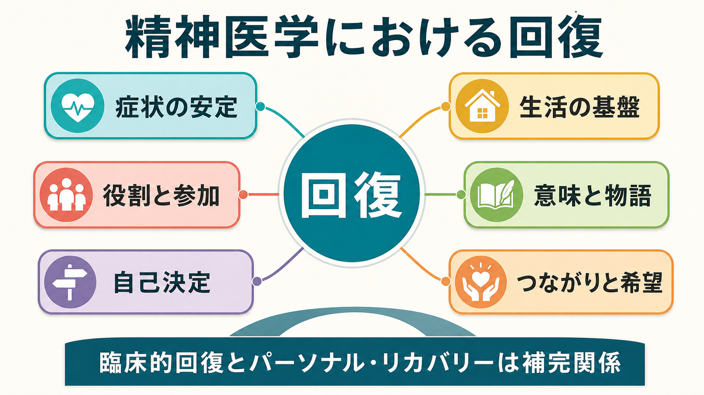
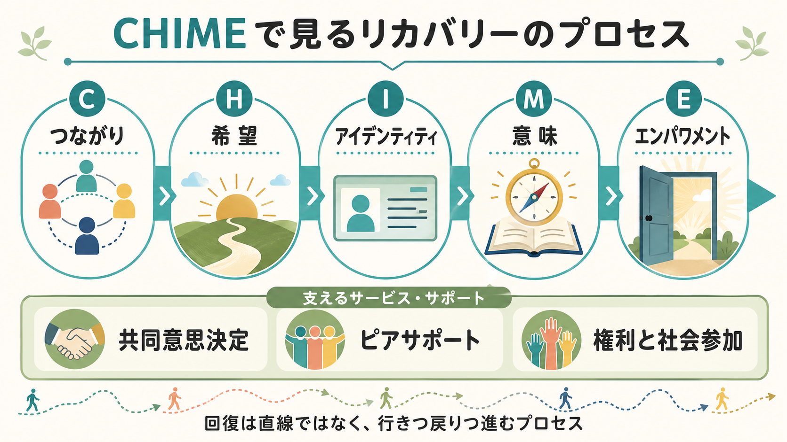
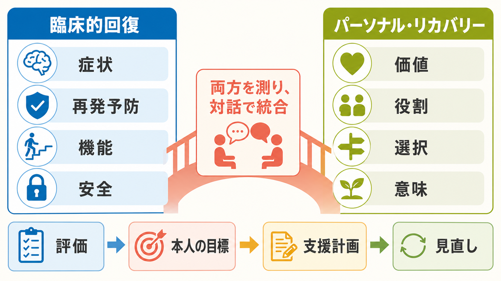

# 精神医学における回復とは何か

## 要点

- 精神医学における「回復」は、症状が消えることだけを意味しない。症状の安定、再発予防、生活機能の回復に加えて、本人が意味ある生活、役割、関係、希望、自己決定を取り戻していく過程を含む[1][2]。
- 臨床的回復は、症状、機能、再発、リスクを評価しやすい。一方、パーソナル・リカバリーは、本人の価値、物語、アイデンティティ、社会参加、権利に関わる[3][4]。
- CHIME モデルは、パーソナル・リカバリーを「つながり、希望、アイデンティティ、意味、エンパワメント」という5つの過程として整理する[3]。
- 回復志向の支援は、治療を軽視する考えではない。薬物療法、精神療法、心理社会的支援、ピアサポート、住居・就労・教育支援、権利擁護を、本人の目標に沿って組み合わせる考え方である[5][6]。
- この記事は教育・研究目的の整理であり、個別の診断や治療指示ではない。

## この記事で答える問い

1. 精神医学で「回復」と言うとき、何が回復するのか。
2. 臨床的回復とパーソナル・リカバリーはどう違い、どう補完し合うのか。
3. 回復志向の支援は、臨床・研究・サービス設計でどのように使えるのか。

## まず結論

精神医学における回復とは、病気になる前の状態へ単純に戻ることではない。むしろ、症状や障害が残る可能性を含めながらも、本人が「自分の人生をどう生きるか」を再構成していく過程である。Anthony は、精神疾患からの回復を、態度、価値、感情、目標、技能、役割が変化し、病気による制約があっても満足でき希望ある貢献的な生活を送る過程として位置づけた[1]。

この見方は、[[精神疾患とは何か]]を単なる症状リストではなく、生活世界、対人関係、社会制度、自己理解の中で捉える視点とつながる。したがって回復は、[[生物心理社会モデルとは何か]]の臨床応用でもある。生物学的治療で症状を和らげ、心理的支援で対処や意味づけを助け、社会的支援で住まい、仕事、学び、人間関係、権利を整える。

## 背景

かつて精神医学では、重い精神疾患は長期的に悪化する、あるいは社会生活から切り離されるものとして語られやすかった。20世紀後半の地域精神医療、精神科リハビリテーション、当事者運動、脱施設化の流れの中で、精神疾患を経験した人も、支援と環境が整えば意味ある生活を築けるという視点が強まった[1]。

SAMHSA はリカバリーを、健康とウェルネスを改善し、自己主導の生活を送り、自分の可能性を最大限に発揮しようとする変化の過程として定義している[2]。この定義では、健康、住まい、目的、コミュニティという生活基盤が重視される。つまり「症状が何点下がったか」だけでなく、「どこで暮らすか」「誰とつながるか」「何を大切にして生きるか」が回復の中心に入る。

WHO の地域精神保健サービスに関するガイダンスも、人中心で権利に基づく支援を強調し、施設中心・管理中心のサービスから、地域生活、自己決定、社会参加を支えるサービスへの転換を求めている[5]。

## 基本概念

### 臨床的回復

臨床的回復は、主に専門職や研究者が測定しやすい指標で捉える回復である。たとえば、抑うつ気分、幻覚、妄想、不安、不眠、衝動性などの症状が軽くなること、再発や入院が減ること、社会機能や日常生活機能が改善することが含まれる。

臨床的回復は重要である。症状が強いと、睡眠、対人関係、学業、就労、意思決定、身体健康に大きな影響が出る。急性期の安全確保や治療反応の評価では、臨床的指標が不可欠である。ただし、症状が軽くなっても、孤立、失業、スティグマ、自己否定、住まいの不安定さが残れば、本人にとって「回復した」とは感じられないことがある。

### パーソナル・リカバリー

パーソナル・リカバリーは、本人の主観的経験と生活上の意味を重視する回復である。中心になるのは「症状がゼロか」ではなく、「自分にとって意味のある生活を、どの程度自分で選び、支えられながら生きられているか」である[3][4]。

この視点では、[[意思決定とは何か]]、[[青年期のアイデンティティ形成とは何か]]、[[スティグマとは何か]]が重要な関連概念になる。精神疾患の経験は、自己像、将来像、人間関係に影響する。だから回復には、診断名と付き合いながらも「病気だけで定義されない自分」を取り戻す過程が含まれる。

### 回復は多次元である

Whitley と Drake は、回復を臨床的、実存的、機能的、身体的、社会的な次元から整理した[7]。これは、症状だけを見ても、生活だけを見ても、本人の希望だけを見ても不十分だという意味である。

たとえば、症状は安定しているが孤立している人、仕事には戻ったが自己否定が強い人、症状は残るが家族・友人・地域の中で役割を持つ人は、それぞれ異なる回復課題を持つ。回復の評価は、単一の尺度ではなく、複数の視点を組み合わせて行う必要がある。

## 仕組み

パーソナル・リカバリーの代表的な整理が CHIME モデルである。Leamy らは、97本の文献を統合し、回復の過程を Connectedness、Hope、Identity、Meaning、Empowerment の5要素としてまとめた[3]。

### つながり

つながりは、家族、友人、支援者、同じ経験を持つ人、地域との関係である。孤立は症状を悪化させるだけでなく、自分が価値ある存在だという感覚を弱める。ピアサポートや地域参加は、専門職からの支援とは別の形で「自分だけではない」という感覚を支える[5]。

### 希望

希望は、単なる楽観ではない。症状や困難があっても、将来に選択肢があり、変化の余地があると感じられることである。[[レジリエンスは発達過程でどう育つのか]]とも関係するが、希望は個人の性格だけで決まらない。支援者が可能性を見失わないこと、制度が挑戦の機会を奪わないことが重要である。

### アイデンティティ

診断名は支援への入口になる一方で、「自分は病気そのものだ」という狭い自己理解を生むことがある。回復では、診断を否認するのではなく、診断だけでは説明できない生活史、価値、強み、役割を取り戻す。これは[[社会的認知とは何か]]や自己概念の問題ともつながる。

### 意味

症状や入院の経験は、喪失、怒り、恥、孤独を伴うことがある。意味とは、その経験を美化することではない。何が起きたのか、何を失ったのか、何を守りたいのかを、本人の言葉で語り直すことである。精神療法、ナラティブな支援、創作、学び、宗教・スピリチュアリティ、社会活動が意味の再構成を支える場合がある。

### エンパワメント

エンパワメントは、自己決定と権利の回復である。治療や支援の選択に本人が関与すること、情報が理解できる形で提供されること、リスクだけでなく希望や強みも共有されることが含まれる。これは「本人に全部任せる」ことではない。必要な支援を受けながら、本人の価値と選択を支えることである[2][5]。

## 図解

臨床的回復とパーソナル・リカバリーは対立概念ではない。症状評価、再発予防、薬物療法、心理療法は、本人の生活目標と結びついたときに回復を支えやすくなる。一方、本人の価値や希望だけを語って、急性期の安全、身体健康、治療反応を無視することもできない。

実践では、次のように統合して考える。

| 観点 | 臨床的回復で見ること | パーソナル・リカバリーで見ること |
|---|---|---|
| 症状 | 症状の強さ、持続、再発リスク | 症状と付き合いながら何をしたいか |
| 機能 | 生活機能、社会機能、認知機能 | 本人にとって意味ある役割は何か |
| 支援 | 薬物療法、精神療法、危機対応 | 共同意思決定、ピアサポート、権利擁護 |
| 評価 | 尺度、診察、入院・再発指標 | 本人の物語、希望、満足、参加 |

## 臨床・研究との接続

### 面接とケースフォーミュレーション

回復志向の面接では、「症状は何か」に加えて、「その人は何を失い、何を守り、何を取り戻したいのか」を尋ねる。これは、診断を曖昧にすることではない。むしろ診断を、本人の生活文脈の中に置き直すことである。

たとえば、同じ統合失調症スペクトラムの診断でも、ある人にとっての回復目標は再入院予防かもしれないし、別の人にとっては短時間就労、家族との距離の取り直し、服薬副作用の相談、孤立の軽減かもしれない。支援計画は、診断名から自動的に決まるのではなく、症状、強み、環境、価値、リスクを統合して作る。

### サービス設計

回復志向サービスは、専門職が治療を提供するだけでなく、本人が生活を再構築できる環境を整える。WHO は、地域に近い支援、入院中心からの転換、権利保護、社会参加、ピアサポートを重視している[5]。

REFOCUS 試験は、精神病圏の人を支援する地域精神保健チームに対し、本人の価値、好み、強み、目標、スタッフとの関係に焦点を当てる介入を検討した。結果は単純ではなく、サービスレベルの回復志向介入を実装する難しさも示しているが、臨床アウトカムとリカバリーアウトカムを区別して測る必要性を明確にした[6]。

### 研究評価

研究では、症状尺度だけでは回復を十分に捉えられない。生活の質、希望、エンパワメント、社会参加、スティグマ、共同意思決定、本人報告アウトカムを組み合わせる必要がある[3][6]。同時に、本人の主観的満足だけで安全性や機能を置き換えることもできない。回復研究は、臨床指標と本人中心指標の両方を扱う設計が求められる。

## よくある誤解

### 誤解1: 回復とは完治のことだ

回復は、症状が完全に消えることだけではない。もちろん症状が軽くなることは重要だが、症状が残っていても、本人が意味ある役割、関係、生活の選択を取り戻していくことはありうる[1][3]。

### 誤解2: リカバリーは治療を軽視する考えだ

回復志向は、治療を否定しない。むしろ治療を、本人の生活目標に接続する。[[薬物療法は神経回路にどう作用するのか]]、[[精神療法は脳を変えるのか]]のような臨床的介入も、本人が何を大切にしているかと結びつくことで意味を持つ。

### 誤解3: 自己決定とは本人に任せきることだ

自己決定は、支援の撤退ではない。情報提供、選択肢の整理、リスクの共有、意思決定支援、危機時の安全確保を含む。本人が一人で全責任を負うのではなく、支援者と環境が意思決定を支える。

### 誤解4: 回復は個人の努力で決まる

回復には本人の主体性が関わるが、社会的条件も大きい。貧困、差別、スティグマ、住居不安、孤立、制度へのアクセス困難は回復を妨げる。したがって回復志向の支援は、個人の動機づけだけでなく、環境調整と権利保障を含む[5][8]。

## 関連ノート

既存ノート:

- [[精神疾患とは何か]]
- [[生物心理社会モデルとは何か]]
- [[精神疾患は脳の病気なのか]]
- [[精神療法は脳を変えるのか]]
- [[薬物療法は神経回路にどう作用するのか]]
- [[意思決定とは何か]]
- [[スティグマとは何か]]
- [[社会的認知とは何か]]
- [[レジリエンスは発達過程でどう育つのか]]

今後の作成候補:

- パーソナル・リカバリーとは何か
- CHIMEモデルとは何か
- 共同意思決定とは何か
- ピアサポートとは何か
- 精神科リハビリテーションとは何か
- リカバリーアウトカムはどう測るのか

MOC更新候補:

- `content/00_MOC/MOC｜精神医学.md`
- `content/00_MOC/MOC｜臨床実践・治療.md`
- `content/00_MOC/MOC｜倫理・哲学・社会.md`

## 理解チェック

1. 臨床的回復とパーソナル・リカバリーは、それぞれ何を重視するか。
2. CHIME の5要素を、自分の言葉で説明できるか。
3. 症状は改善したが孤立が続いている人に対して、回復志向の支援では何を追加で評価するか。
4. 自己決定を支えることと、支援を放棄することはどう違うか。
5. リカバリーを研究で測るとき、症状尺度以外にどのようなアウトカムが必要か。

## 参考文献

[1] Anthony, W. A. (1993). Recovery from mental illness: The guiding vision of the mental health service system in the 1990s. *Psychosocial Rehabilitation Journal, 16*(4), 11-23. https://doi.org/10.1037/h0095655

[2] Substance Abuse and Mental Health Services Administration. (2012). *SAMHSA's Working Definition of Recovery*. https://library.samhsa.gov/product/samhsas-working-definition-recovery/pep12-recdef

[3] Leamy, M., Bird, V., Le Boutillier, C., Williams, J., & Slade, M. (2011). Conceptual framework for personal recovery in mental health: Systematic review and narrative synthesis. *The British Journal of Psychiatry, 199*(6), 445-452. https://doi.org/10.1192/bjp.bp.110.083733

[4] Slade, M. (2009). *Personal Recovery and Mental Illness: A Guide for Mental Health Professionals*. Cambridge University Press. https://doi.org/10.1017/CBO9780511581649

[5] World Health Organization. (2021). *Guidance on community mental health services: Promoting person-centred and rights-based approaches*. https://www.who.int/publications/i/item/9789240025707

[6] Slade, M., Bird, V., Le Boutillier, C., et al. (2015). Supporting recovery in patients with psychosis through care by community-based adult mental health teams (REFOCUS): A multisite, cluster, randomised, controlled trial. *The Lancet Psychiatry, 2*(6), 503-514. https://doi.org/10.1016/S2215-0366(15)00086-3

[7] Whitley, R., & Drake, R. E. (2010). Recovery: A dimensional approach. *Psychiatric Services, 61*(12), 1248-1250. https://doi.org/10.1176/appi.ps.61.12.1248

[8] Tew, J., Ramon, S., Slade, M., Bird, V., Melton, J., & Le Boutillier, C. (2012). Social factors and recovery from mental health difficulties: A review of the evidence. *The British Journal of Social Work, 42*(3), 443-460. https://doi.org/10.1093/bjsw/bcr076
