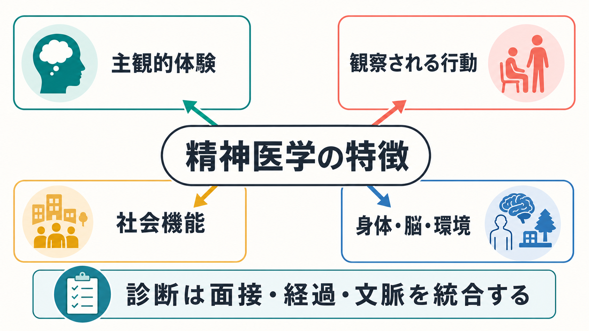
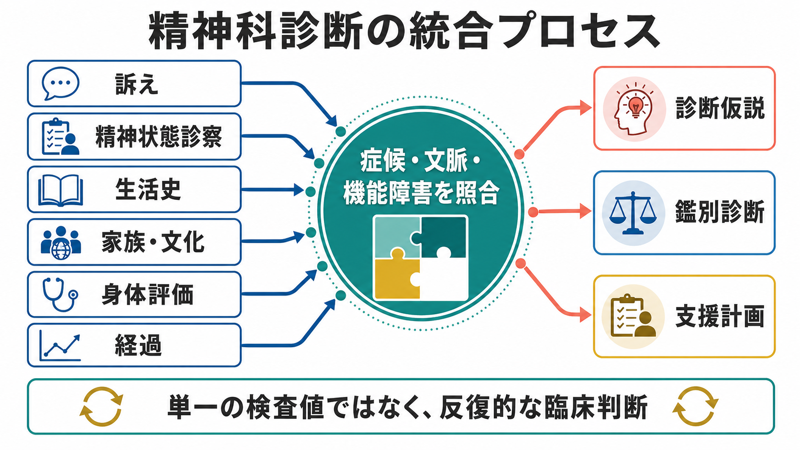
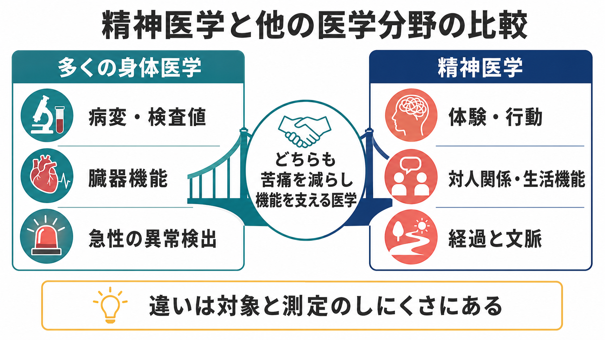

# 精神医学は他の医学分野と何が違うのか

## 要点

- 精神医学は、臓器病変だけでなく、本人の[[主観的経験は科学的に扱えるのか|主観的体験]]、観察される行動、対人関係、生活機能、文化的文脈を同時に扱う。
- 診断は「検査で異常が出たか」だけではなく、症状のまとまり、持続、苦痛、機能障害、除外診断、経過を統合して行う。
- DSM-5-TRやICD-11 CDDRは標準化された診断枠組みを提供するが、精神疾患の境界はしばしば連続的で、併存や異質性が多い。
- バイオマーカーや神経画像は研究上重要だが、多くの精神疾患では、日常診療の診断を単独で確定する検査にはまだなっていない。
- 精神医学の難しさは「科学性が低い」ことではなく、測定対象が多層的で、本人・社会・身体が相互作用する点にある。

## この記事で答える問い

この記事では、次の問いに答える。

- 精神医学は、内科・外科・神経内科などの身体医学とどこが共通し、どこが違うのか。
- なぜ精神科診断は、血液検査や画像検査だけで決まりにくいのか。
- 主観的体験や社会機能を、どのように医学の対象として扱うのか。
- 診断分類、面接、バイオマーカー研究はどのように接続しているのか。

## まず結論

精神医学も医学である。苦痛を減らし、機能を支え、予後を改善するために、診断、治療、予防、リハビリテーションを行う点では他の医学分野と同じである。

ただし精神医学では、病気の主要な現れが「本人がどう体験しているか」「行動がどう変わったか」「生活や対人関係がどの程度損なわれているか」として出てくることが多い。DSM-5-TRの精神疾患定義も、認知、情動調整、行動における臨床的に重要な障害と、それに伴う苦痛や社会・職業的機能障害を重視している[1]。ICD-11 CDDRも、臨床現場で精神・行動・神経発達症群を同定するための記述と診断要件を整備している[2]。

したがって精神科診断は、単一の検査値を読む作業ではなく、面接、観察、既往歴、家族・発達・文化的背景、身体評価、経過を統合する反復的な臨床判断である。

## 背景

多くの身体医学では、疾患が臓器・組織・細胞・病原体・代謝異常などに比較的対応しやすい。もちろん身体医学でも症状、生活背景、本人の価値観は重要だが、診断の中心に病理所見、画像、血液検査、生理検査などの客観的指標が置かれる場面が多い。

精神医学では、脳や身体の変化が無関係という意味ではない。むしろ気分、不安、幻覚、衝動性、認知機能、依存、発達特性は、神経回路、内分泌、免疫、睡眠、薬物、遺伝、学習、社会環境と深く関係する。しかし、同じ診断名の中にも複数の病態経路があり、同じ生物学的変化が複数の診断にまたがることがある。このため、診断名と単一原因が一対一に対応しにくい。

Kendlerは、精神疾患を化学元素のような明確な自然種として捉えるより、生物種に近い複雑で多因子的なカテゴリーとして考える方が現実に合うと論じている[3]。これは、精神疾患が「作り物」という意味ではない。境界が不鮮明で、多数の原因と機序が重なり、臨床目的に応じて分類の有用性が問われるという意味である。

## 基本概念

### 精神疾患は「逸脱」だけではない

精神疾患を考えるとき、単に平均から外れた行動、珍しい信念、社会的に好まれない振る舞いを病気と呼ぶわけではない。DSM-5-TRの定義では、期待可能な喪失反応や、社会的逸脱そのものは、それだけでは精神疾患ではないとされる[1]。Wakefieldの有害な機能不全モデルも、精神疾患には「害」と「機能不全」の両方を考える必要があると論じた[4]。

ここで重要なのは、精神医学が価値判断を完全に避けられないことである。「苦痛」「生活への支障」「危険」「本人の望む生活とのずれ」は、検査値のように単純には測れない。しかし、臨床ではこれらを曖昧なまま放置せず、面接、尺度、他者情報、経過、文化的文脈を使ってできるだけ明示化する。

### 診断分類は地図であって、土地そのものではない

DSMやICDは、臨床、研究、教育、統計、保険、行政のための共通言語である。診断名があることで、症状を共有し、研究結果を比較し、支援につなげやすくなる。

一方で、分類は現実の苦痛や経験そのものではない。うつ病、双極症、不安症、PTSD、統合失調症、発達症、物質使用症などは、しばしば併存し、症状も重なり合う。ICD-11 CDDRが文化関連情報や次元的アプローチを取り入れているのは、この複雑さに対応するためである[2]。

## 仕組み

精神科診断の基本は、次の情報を組み合わせることである。

| 情報源 | 見ているもの | 診断上の意味 |
|---|---|---|
| 主訴と病歴 | 本人が何に困っているか、いつからどう変化したか | 症状の始まり、持続、誘因、経過を確認する |
| 精神状態診察 | 外観、行動、気分、思考、知覚、認知、病識など | 現在の症候を構造化して観察する |
| 生活機能 | 学業、仕事、家事、対人関係、セルフケア | 診断の臨床的重要性と支援ニーズを判断する |
| 身体評価 | 薬剤、物質、内分泌、神経疾患、感染、睡眠など | 身体疾患や薬剤性の精神症状を除外する |
| 家族・発達・文化 | 発達歴、家族歴、文化的意味づけ、環境 | 症状の意味と正常範囲を文脈化する |
| 経過観察 | 時間とともにどう変わるか | 一時的反応、慢性化、再発、診断変更を見極める |

この統合プロセスでは、診断は最初から固定された結論ではなく、仮説として扱われる。初診時には「うつ病」と見える状態が、経過の中で双極症、物質関連障害、身体疾患、適応反応、複雑なトラウマ反応として再整理されることもある。

## 図解

精神医学と他の医学分野の違いは、「客観か主観か」という単純な二分法ではない。身体医学にも痛み、倦怠感、めまい、生活機能、治療選好などの主観的要素はある。精神医学にも脳画像、神経心理検査、血液検査、薬理学、遺伝学、疫学などの客観的研究がある。

違いは、診断の中心に来る対象の比重である。身体医学では病変や検査値が診断の軸になりやすいのに対し、精神医学では体験、行動、対人関係、生活機能、経過、文化的意味づけがより前景化する。

## 臨床・研究との接続

### 臨床では「困りごと」と「疾患」を分けて考える

精神科診療では、診断名を付けることだけが目的ではない。本人が何に困っているか、何を保ちたいか、どの支援が必要かを明らかにする必要がある。たとえば同じ抑うつ症状でも、休職支援、睡眠介入、薬物療法、心理療法、家族支援、経済的支援、危機介入のどれを優先するかは、診断名だけでは決まらない。

この点で精神医学は、生物・心理・社会モデルと相性がよい。Engelの生物心理社会モデルは、疾患を生物学的変数だけで説明する狭い医学モデルへの批判として提示され、その後も医学全体に影響を与えてきた[8]。精神医学では、症状、身体状態、認知、対人関係、制度、文化を分離せず、相互作用として扱う必要が特に大きい。

### 研究では分類を越える試みも進む

DSMやICDは臨床の共通言語として重要だが、研究では診断カテゴリーだけに依存しない枠組みも提案されている。RDoCは、精神疾患を既存診断名だけでなく、報酬、脅威、認知制御、社会過程、覚醒などの機能次元と、遺伝子、分子、回路、行動、自己報告を結びつけて研究しようとする枠組みである[5]。これは[[RDoCは精神疾患研究をどう変えたのか]]とも接続する。

ただし、RDoCはすぐに臨床診断を置き換えるものではない。現時点では、研究分類と臨床分類は役割が違う。臨床では、今困っている本人に説明可能で、支援につながる診断と見立てが必要である。

### バイオマーカーは期待されるが、万能ではない

精神疾患のバイオマーカー研究は進んでいる。神経画像、遺伝、炎症、内分泌、睡眠、認知課題、デジタル表現型などは、病態理解や予測に役立つ可能性がある。しかし、精神医学のバイオマーカーは、診断、予後、治療反応、層別化のどれを目的にするかで求められる性能が異なる[6]。

現状では、多くの精神疾患について「この検査が陽性ならその診断」と言えるほどの単独マーカーは限られている。神経画像研究にも再現性、サンプルサイズ、個人差、併存症、薬物影響、施設差などの課題がある。詳しくは[[精神疾患の神経画像バイオマーカーは実用化できるのか]]と接続して読むとよい。

## よくある誤解

### 誤解1: 検査で決まらないなら医学ではない

これは誤りである。医学には、痛み、倦怠感、機能障害、生活背景、本人の価値観を扱う領域が多くある。精神医学の特徴は、そうした要素が診断と治療の中心に来やすいことである。検査で決まらないことは、非科学的であることを意味しない。むしろ、測定しにくい対象をどう構造化し、信頼性を上げ、臨床的有用性を保つかが課題になる。

### 誤解2: 精神科診断は主観的だから信頼できない

精神科診断には信頼性の問題がある。DSM-5関連の研究では、面接方法や評価者、再検査設計によって診断一致度が変わることが示されている[7]。しかし、これは診断が無意味だということではない。構造化面接、操作的診断基準、重症度評価、縦断的観察、他職種情報によって、信頼性を改善できる。

むしろ重要なのは、診断名を過信しないことである。診断は、治療計画、リスク評価、予後理解、支援調整のための道具であり、本人の経験を丸ごと置き換えるラベルではない。

### 誤解3: 精神疾患は全部「脳の病気」か、全部「社会の問題」かのどちらかである

この二分法は粗い。精神疾患には神経生物学的過程が関与するが、それは心理、学習、対人関係、社会的不利、文化的意味づけと切り離せない。たとえば不眠、孤立、貧困、虐待、物質使用、慢性疾患、薬剤、発達特性は、脳と身体の状態を変え、症状と機能障害に影響する。

精神医学の実践では、「脳か社会か」ではなく、「どの水準の介入が、いまの苦痛と機能障害を最も減らすか」を考える。

## 関連ノート

既存ノートとして、次の内部リンクが関連する。

- [[主観的経験は科学的に扱えるのか]]
- [[RDoCは精神疾患研究をどう変えたのか]]
- [[精神疾患の神経画像バイオマーカーは実用化できるのか]]

今後の作成候補:

- DSMとICDは何が違うのか
- 精神疾患とは何か
- 精神科診断は何のためにあるのか
- 精神状態診察MSEとは何か
- 精神科診断における除外診断とは何か
- 精神科で生活機能をどう評価するか
- カテゴリ診断と次元診断は何が違うのか

MOC更新候補:

- `content/00_MOC/` 配下の精神医学・診断・面接関連MOCに、本記事へのリンクを追加する。

## 理解チェック

1. 精神医学の診断対象が、単なる脳病変ではなく、主観的体験・行動・生活機能を含むのはなぜか。
2. DSMやICDの診断分類は、臨床でどのような利点と限界を持つか。
3. 精神科診断で、身体疾患や薬剤性の症状を除外する必要があるのはなぜか。
4. バイオマーカー研究が進んでも、面接や経過観察が不要にならない理由は何か。
5. 「診断名」と「本人の困りごと」を分けて考えることは、治療計画にどう役立つか。

## 参考文献

[1] American Psychiatric Association. (2022). *Diagnostic and Statistical Manual of Mental Disorders, Fifth Edition, Text Revision (DSM-5-TR)*. American Psychiatric Association Publishing. 定義の要約確認: https://pmc.ncbi.nlm.nih.gov/articles/PMC12189202/

[2] World Health Organization. (2024). *Clinical descriptions and diagnostic requirements for ICD-11 mental, behavioural and neurodevelopmental disorders (CDDR)*. WHO. https://www.who.int/publications/i/item/9789240077263

[3] Kendler, K. S. (2016). The nature of psychiatric disorders. *World Psychiatry, 15*(1), 5-12. https://doi.org/10.1002/wps.20292

[4] Wakefield, J. C. (2007). The concept of mental disorder: diagnostic implications of the harmful dysfunction analysis. *World Psychiatry, 6*(3), 149-156. https://pmc.ncbi.nlm.nih.gov/articles/PMC2174594/

[5] Cuthbert, B. N., & Insel, T. R. (2013). Toward the future of psychiatric diagnosis: the seven pillars of RDoC. *BMC Medicine, 11*, 126. https://doi.org/10.1186/1741-7015-11-126

[6] García-Gutiérrez, M. S., Navarrete, F., Sala, F., Gasparyan, A., Austrich-Olivares, A., & Manzanares, J. (2020). Biomarkers in psychiatry: concept, definition, types and relevance to the clinical reality. *Frontiers in Psychiatry, 11*, 432. https://doi.org/10.3389/fpsyt.2020.00432

[7] Chmielewski, M., Clark, L. A., Bagby, R. M., & Watson, D. (2015). Method matters: Understanding diagnostic reliability in DSM-IV and DSM-5. *Journal of Abnormal Psychology, 124*(3), 764-769. https://doi.org/10.1037/abn0000069

[8] Bolton, D. (2022). Looking forward to a decade of the biopsychosocial model. *BJPsych Bulletin, 46*(4), 228-232. https://doi.org/10.1192/bjb.2022.34

## 未解決問題

- 精神疾患の診断分類を、症状、機能障害、病態機序、治療反応のどの軸で再編するべきか。
- 個人レベルで使えるバイオマーカーを、どの疾患・どの臨床判断から実装できるか。
- 文化的差異、社会的不利、本人の価値観を、診断の信頼性を落とさずにどう組み込むか。
- 診断名が支援へのアクセスを開く一方で、スティグマや自己理解の固定化を生むリスクをどう減らすか。
