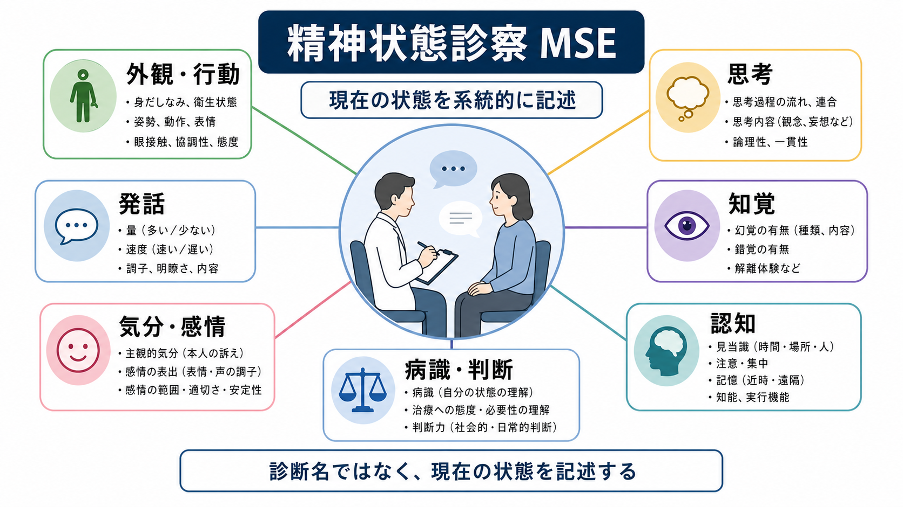
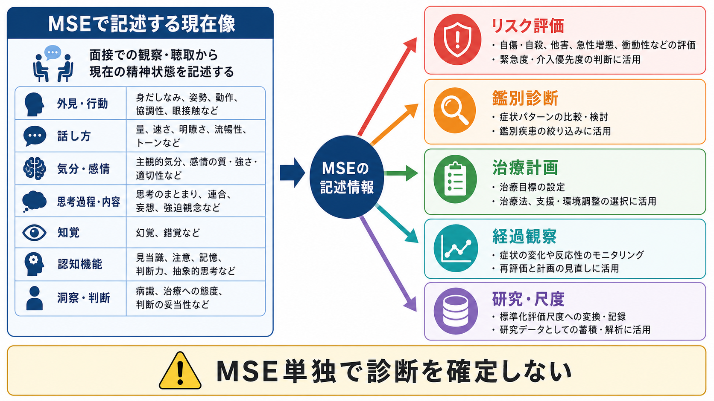

# 精神状態診察MSEとは何か

## 要点

- 精神状態診察 MSE（Mental Status Examination）は、面接中に観察・質問・記録される「現在の精神状態」を、外観・行動、発話、気分・感情、思考、知覚、認知、病識・判断などの領域に分けて記述する枠組みである[1][2]。
- MSEは診断名そのものではない。[[精神科面接とは何か|精神科面接]]や病歴、身体診察、検査、周囲からの情報と統合して、[[鑑別診断とは何か|鑑別診断]]、リスク評価、治療計画、経過観察に使う[1][3][4]。
- 「見た目で決める」作業ではなく、観察された所見と本人の語りを区別し、文化・教育・言語・身体疾患・薬物や物質使用の影響を考慮して記述する必要がある[1][3][4]。
- MSEは一度きりのチェックリストではなく、初診、再診、急性期、入院、退院前、研究評価などで反復される「比較可能な記録」の基盤になる[1][5]。

## この記事で答える問い

1. 精神状態診察 MSE は何を観察し、何を記述する枠組みなのか。
2. 外観・行動・気分・思考・知覚・認知・病識は、臨床的にどのような意味を持つのか。
3. MSEは[[精神科診断は何のためにあるのか|精神科診断]]、リスク評価、研究・尺度評価とどのように接続するのか。
4. MSEを読むとき、あるいは学ぶときに避けるべき誤解は何か。

## まず結論

精神状態診察 MSE とは、面接のその時点で観察される精神機能と行動を、臨床的に共有できる言葉へ変換するための記述枠組みである。典型的には、外観・一般行動、発話、気分と感情、思考過程、思考内容、知覚、認知機能、病識、判断を扱う[1][2]。身体診察が「現在の身体所見」を記録するように、MSEは「現在の心理・行動・認知の所見」を記録する。

ただし、MSEは[[DSMとICDは何が違うのか|DSMやICD]]の診断基準と同じものではない。たとえば、幻聴、妄想、思考のまとまりにくさ、注意障害、意識変容が観察されても、それだけで特定の疾患名は確定しない。身体疾患、せん妄、物質使用、薬剤、発達特性、文化的背景、ストレス状況、既往歴などを統合してはじめて、臨床的な仮説が立てられる[1][4][6]。

その意味でMSEは、[[操作的診断とは何か|操作的診断]]の前段階にある「記述の技法」であり、同時に治療計画や経過観察のための共通言語でもある。

## 背景

MSEは、精神医学における「診察所見」の中心的な形式である。NCBI Bookshelf の Clinical Methods は、MSEを患者の行動機能と認知機能の構造化された評価として説明し、外観、意識、注意、発話、運動、気分・感情、思考・知覚、態度・病識、高次認知機能を含めている[2]。StatPearls も、MSEを精神科、プライマリケア、救急、内科など複数の臨床場面で用いられる評価として位置づけ、患者の現在状態を定義し、経過に応じて反復されるものとしている[1]。

精神科臨床では、本人の語りが重要な情報源である一方、本人が言語化しない情報も多い。表情、視線、姿勢、身だしなみ、発話の速度、反応潜時、注意の保ち方、会話のまとまり、現実検討の様子などは、質問紙だけでは拾いにくい。MSEは、こうした観察を印象のままに残すのではなく、比較可能な記述へ整理するための足場になる。

また、MSEは安全評価とも接続する。APAの成人精神科評価ガイドラインは、精神症状、物質使用、自殺リスク、攻撃性リスク、文化的要因、身体健康、定量評価、本人の治療意思決定への関与、記録を初期評価の重要領域として扱う[3]。MSEはこの全体評価の一部であり、単独で完結する検査ではない。

## 基本概念

### 外観・行動

外観・行動は、面接室に入った瞬間から観察される。身だしなみ、衛生、服装、栄養状態、姿勢、歩行、視線、表情、協力度、落ち着き、精神運動の亢進・抑制、不随意運動などが含まれる[1][4]。ここで重要なのは、価値判断ではなく臨床的記述である。「だらしない」ではなく「季節に比して薄着で、衣服の汚れが目立つ」「入室後も着席できず歩き回る」のように、観察可能な言葉で書く。

外観・行動は、セルフケア、衝動性、緊張、抑うつ、躁状態、薬剤性の錐体外路症状、物質使用、神経疾患、せん妄などの仮説につながる。ただし、服装や視線の取り方は文化、職業、年齢、貧困、身体疾患、発達特性にも左右されるため、それだけで精神病理を推定しない。

### 発話

発話では、量、速度、音量、明瞭さ、流暢性、抑揚、自発性、反応潜時、話題の逸れやすさを見る[1][4]。抑うつでは小声で遅い発話がみられることがあり、躁状態では速く大きな発話がみられることがある。一方で、失語、構音障害、難聴、言語の非母語性、緊張、教育歴も発話所見に影響する。

発話は、内容だけでなく「どのように語られるか」を見る領域である。これは思考過程の評価にも直結する。

### 気分・感情

気分は本人が報告する持続的な主観的感情状態であり、感情または情動表出は観察者が見る表情・声・姿勢・反応の質である[2][4]。たとえば「気分は沈んでいる」と本人が語り、表情や声量もそれに一致している場合もあれば、つらい内容を語りながら笑顔が目立つなど、気分と感情表出が一致しない場合もある。

感情は、範囲、強さ、安定性、適切性として記述できる。平板、狭小、易変、過度に高揚、不安げ、怒りっぽいなどの表現は、具体的な観察と結びつけて使う。

### 思考過程・思考内容

思考過程は、話のまとまり、論理性、目標への到達、連合の保たれ方、脱線、迂遠、途絶、観念奔逸などをみる。思考内容は、妄想、強迫観念、希死念慮、自責、被害的解釈、過価観念など、「何を考えているか」の領域である[1][2][4]。

ここでは、本人の言葉と観察者の解釈を混同しないことが重要である。「被害妄想あり」と断定する前に、「職場の同僚が自分を陥れようとしていると述べ、反証を示しても確信は揺らがない」のように、根拠を記述する。

### 知覚

知覚では、幻聴、幻視、幻嗅、幻触、錯覚、離人感、現実感消失などを確認する[1][2]。幻覚は精神病性障害だけでなく、せん妄、物質使用、神経疾患、睡眠周辺現象、重度ストレスなどでもみられる。したがって、知覚異常の有無だけでなく、意識水準、注意、見当識、身体症状、薬物・アルコール、発症様式を合わせて見る必要がある。

### 認知

認知では、意識水準、注意・集中、見当識、記憶、言語、抽象的思考、遂行機能などを扱う[1][2][5]。認知領域は、精神科疾患の評価だけでなく、せん妄、認知症、神経疾患、物質中毒・離脱、内分泌疾患などを見逃さないためにも重要である。Merck Manual は、認知の異常がせん妄、認知症、物質中毒・離脱、抑うつなどで起こりうると整理している[4]。

ここでのMSEは、詳細な神経心理検査の代替ではない。必要に応じてMMSE、MoCAなどのスクリーニングや、より詳しい神経心理学的評価につなげる。

### 病識・判断

病識は、自分の状態をどの程度問題として理解しているか、原因をどう捉えているか、治療や支援の必要性をどう考えているかを含む。判断は、現実的な意思決定、危険の見積もり、社会的・日常的判断の妥当性をみる領域である[1][4]。既存ノートでは[[病識とは何か]]がこの領域を詳しく扱う。

病識が乏しいことは、単純に「非協力的」という意味ではない。症状そのもの、認知機能、文化的説明モデル、過去の医療体験、スティグマ、家族関係、治療者との信頼関係が影響する。

## 仕組み

MSEは、次の循環として理解すると実践に近い。

1. 観察する: 入室、姿勢、表情、発話、反応、注意、関係の取り方を見る。
2. 確認質問をする: 観察だけでは不明な気分、知覚、思考内容、希死念慮、病識などを本人の言葉で確認する。
3. 記述する: 「正常・異常」だけでなく、観察可能な所見、本人の発言、面接者の推論を分けて書く。
4. 統合する: 病歴、身体所見、検査、家族や支援者からの情報、文化的背景と合わせ、リスク・鑑別・治療計画へつなげる。
5. 比較する: 再診時や介入後に、前回のMSEと比べて改善・悪化・変動をみる。

この循環の中で、MSEは「面接の最後に埋める欄」ではなく、面接全体を通じて更新される臨床的メモである。たとえば、最初は落ち着いて見えた人が、特定の話題で急に緊張し、発話が早まり、被害的な解釈が強まることがある。その変化自体が所見になる。

## 図解

MSEを図式化すると、中心には「現在像の記述」がある。周囲には、外観・行動、発話、気分・感情、思考、知覚、認知、病識・判断が並ぶ。そこから、臨床ではリスク評価、鑑別診断、治療計画、経過観察へ接続し、研究では標準化尺度や構造化面接との比較、アウトカム評価へ接続する。

MSEの強みは、複雑な臨床情報を一定の順序で記述できることにある。一方で、標準化された質問紙よりも面接者の経験、観察の精度、言語化能力、文化的感度に影響されやすい[1]。そのため、教育・研究・チーム医療では、記述の粒度と用語の使い方を揃えることが重要になる。

## 臨床・研究との接続

### 鑑別診断

MSEは[[鑑別診断とは何か|鑑別診断]]の素材になる。幻覚や妄想があれば精神病性障害を考えるが、意識障害や注意障害が目立てばせん妄、急な発症や神経症状があれば器質性疾患、薬物歴があれば物質誘発性の症状も検討する。Merck Manual は、新規発症、予想外の症状、年齢に不相応な症状では身体疾患や薬剤・物質の評価が重要だと述べている[4]。これは[[器質性精神障害を見逃さないためには何を見るべきか]]と直結する。

### リスク評価

MSEは自殺リスク、他害リスク、セルフネグレクト、衝動性、判断力低下、現実検討の障害を捉えるための情報を含む。ただし、リスク評価はMSEだけでは完結しない。過去の行動、現在の計画、手段へのアクセス、保護因子、支援体制、物質使用、身体疾患、治療関係などを合わせて評価する必要がある[3]。

### 治療計画と経過観察

初回のMSEはベースラインになる。再診時に、発話の速度、気分、睡眠、思考のまとまり、幻覚への反応、注意、病識、判断がどう変化したかを比較すると、治療反応や副作用、生活環境の影響を検討しやすい[1][5]。標準化尺度はこの比較を補助するが、質問紙だけでは観察所見を置き換えられない[4]。

### 研究・教育

研究では、MSEそのものを完全に標準化することは難しいが、特定の症状領域を尺度化することで評価者間のばらつきを抑える。教育では、MSEの項目名を暗記するよりも、観察、質問、記述、統合の流れを練習する方が重要である。

## よくある誤解

### 誤解1: MSEはチェックリストを埋める作業である

MSEには項目があるが、目的は空欄を埋めることではない。面接中に得られた観察と本人の語りを、臨床的に意味のある順序で記述することが目的である[2]。

### 誤解2: MSEだけで診断できる

MSEは診断に役立つが、診断そのものではない。精神科診断には、時間経過、機能障害、除外診断、身体疾患、物質使用、文化的背景、発達歴、家族歴、生活歴などが必要である[3][4][6]。

### 誤解3: MSEは客観的なので面接者の影響を受けない

MSEには観察可能な所見が多いが、観察の選び方、表現、重みづけには面接者の影響が入る。StatPearls は、MSEが観察技能や専門性によって変動しうる主観的評価であることを指摘している[1]。だからこそ、根拠となる発言や行動を具体的に記述する必要がある。

### 誤解4: 認知の評価は高齢者だけに必要である

注意、意識水準、見当識、記憶、抽象的思考は、若年者でも重要である。せん妄、頭部外傷、てんかん、物質使用、睡眠不足、重度の気分症状などで認知所見は変化しうる[1][4]。

## 関連ノート

- [[精神科面接とは何か]]
- [[精神科初診で何を確認するべきか]]
- [[病識とは何か]]
- [[鑑別診断とは何か]]
- [[精神科診断における除外診断とは何か]]
- [[器質性精神障害を見逃さないためには何を見るべきか]]
- [[DSMとICDは何が違うのか]]
- [[操作的診断とは何か]]

MOC更新候補: `content/00_MOC/` 配下の精神医学・診断・面接系MOCに、バッチ統合時に本記事へのリンクを追加する。

## 理解チェック

1. MSEが「診断名」ではなく「現在状態の記述」であるとは、具体的にどういう意味か。
2. 気分と感情の違いを、本人の語りと観察所見の違いとして説明できるか。
3. 幻聴があるとき、精神病性障害以外にどのような鑑別を考える必要があるか。
4. MSEを経過観察に使う場合、初回記録にはどのような情報が必要か。
5. 「病識が乏しい」と記述する前に、どのような背景要因を確認するべきか。

## 参考文献

[1] Voss RM, Das JM. Mental Status Examination. *StatPearls*. Last update: 2024-04-30. NCBI Bookshelf. https://www.ncbi.nlm.nih.gov/books/NBK546682/

[2] Martin DC. The Mental Status Examination. In: Walker HK, Hall WD, Hurst JW, eds. *Clinical Methods: The History, Physical, and Laboratory Examinations*. 3rd ed. Butterworths; 1990. NCBI Bookshelf. https://www.ncbi.nlm.nih.gov/books/NBK320/

[3] Silverman JJ, Galanter M, Jackson-Triche M, et al.; American Psychiatric Association. The American Psychiatric Association Practice Guidelines for the Psychiatric Evaluation of Adults. *American Journal of Psychiatry*. 2015;172(8):798-802. https://doi.org/10.1176/appi.ajp.2015.1720501

[4] First MB, Zimmerman M. Initial Psychiatric Assessment. *Merck Manual Professional Edition*. Reviewed/Revised Oct 2024; Modified Jan 2026. https://www.merckmanuals.com/professional/psychiatric-disorders/approach-to-the-patient-with-psychiatric-symptoms/initial-psychiatric-assessment

[5] Merck Manual Professional Edition. Examination of Mental Status. https://www.merckmanuals.com/professional/multimedia/table/examination-of-mental-status

[6] National Institute for Health and Care Excellence. Psychosis and schizophrenia in adults: prevention and management, recommendations 1.3.3.1. NICE Clinical Guideline CG178. Published 2014. https://www.nice.org.uk/guidance/cg178/chapter/1-Recommendations

## 未解決問題

- MSEの記述は評価者の訓練に左右されるため、教育場面でどこまで標準化できるかは継続的な課題である。
- 文化的背景、発達特性、言語差、身体疾患がMSE所見に与える影響を、短時間面接でどこまで扱えるかには限界がある。
- 研究用途では、自由記述のMSEと標準化尺度・構造化面接をどう対応づけるかが課題になる。

