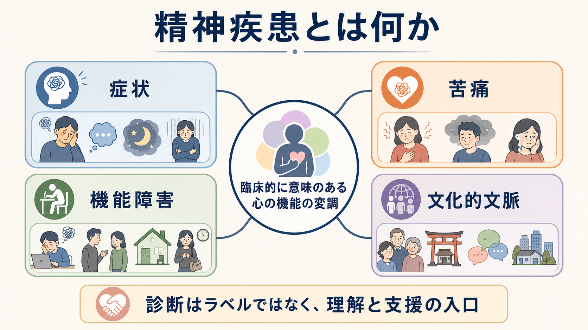
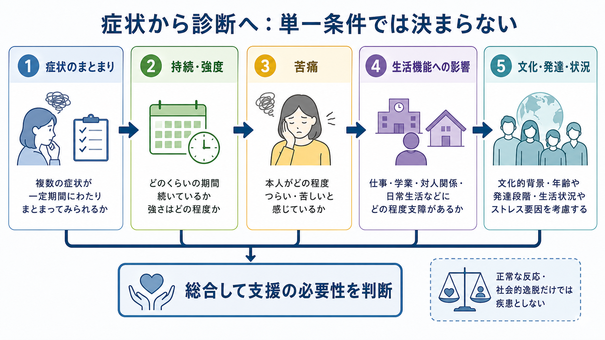

# 精神疾患とは何か

## 要点

- 精神疾患は、単に「変わった考え」「強い感情」「困った行動」を指す語ではない。
- DSM-5-TR と ICD-11 は、認知・情動調整・行動の臨床的に意味のある変調、背景にある心理・生物・発達過程の機能不全、そして苦痛や生活機能への影響を重視する [1], [2]。
- 悲嘆、恐怖、怒り、宗教的実践、政治的逸脱、文化的に理解できる反応は、それだけでは精神疾患ではない [1], [3]。
- 診断は「人をラベル化する作業」ではなく、困りごとを共有可能な言葉で整理し、リスク評価・支援・治療選択につなげるための暫定的な臨床判断である。

## この記事で答える問い

このノートでは、次の問いに答える。

1. どのような状態を「精神疾患」と呼ぶのか。
2. 症状、主観的苦痛、機能障害、文化的文脈はどう関係するのか。
3. DSM・ICD の分類は、臨床と研究でどのように使われるのか。
4. 「脳の病気」「社会的ラベル」「ただの個性」といった単純化をなぜ避けるべきか。

## まず結論

精神疾患とは、本人の認知、感情の調整、行動に臨床的に意味のある変調があり、それが心理的・生物学的・発達的な機能の変化を反映し、しばしば苦痛や社会・学業・職業・家庭生活などの重要領域の機能障害を伴う状態である [1], [2]。

ただし、この定義は「必要十分条件を機械的に満たせば疾患」という意味ではない。精神疾患の境界は、医学的事実、本人の苦痛、生活上の障害、社会的価値判断、文化的文脈が交差する場所にある。したがって、診断では症状の数だけでなく、持続、重症度、発達段階、身体疾患や薬物の影響、喪失やストレスへの通常反応、文化的意味づけを総合して考える。

## 背景

精神医学では、長いあいだ「正常な苦しみ」と「治療対象となる障害」の境界が議論されてきた。DSM-IV から DSM-5 への改訂をめぐる概念論では、精神疾患に完全な境界線を引くことは難しい一方、臨床と研究に役立つ定義を改良し続ける必要があると整理された [3]。

この問題が難しいのは、精神疾患が血糖値や骨折のように単一の測定値だけで定まることが少ないからである。症状は本人の語り、周囲から見える行動、身体状態、生活史、社会的環境、文化的規範のなかで意味を持つ。たとえば、強い悲しみは喪失後の自然な反応でもありうるし、長期化して生活機能を大きく損ない、自殺リスクを伴う場合には臨床的支援の対象になりうる。

## 基本概念

### 症状

症状とは、本人が経験するつらさや変化、または周囲から観察される行動・認知・感情のパターンである。抑うつ気分、不眠、幻聴、強迫観念、パニック発作、衝動性、食行動の変化などは症状になりうる。

しかし、症状が一つあるだけで精神疾患とは限らない。DSM や ICD の多くの診断では、症状のまとまり、持続期間、重症度、除外条件、生活機能への影響が組み合わされる [1], [2]。

### 苦痛

苦痛は、本人が「つらい」「制御できない」「生活が狭まる」と感じる主観的側面である。精神疾患の定義では重要だが、苦痛だけで疾患が決まるわけではない。たとえば、試験前の不安や死別後の悲しみは強い苦痛を伴っても、状況に照らして理解可能な反応でありうる。

一方で、本人が苦痛を自覚しにくい状態もある。躁状態、重度の物質使用、精神病症状、摂食障害の一部では、本人の苦痛よりも安全、身体リスク、対人・職業機能の障害が前景化することがある。

### 機能障害

機能障害とは、仕事、学業、家庭、対人関係、セルフケア、安全確保などの重要な生活領域が損なわれることである。DSM-5-TR と ICD-11 は、精神疾患が通常、苦痛または機能障害と関連することを明示している [1], [2]。

ただし、機能障害は本人の能力だけで決まらない。職場の過重労働、差別、貧困、孤立、支援資源の乏しさは、同じ症状の生活上の影響を大きく変える。したがって、機能障害を評価するときは、個人の内側だけでなく環境との相互作用を見る必要がある。

### 文化的文脈

文化的文脈とは、症状の表現、苦痛の語り方、助けを求める経路、家族や共同体の理解、宗教的・社会的規範を含む。DSM-5 で整備された Cultural Formulation Interview は、患者の病い経験、社会文化的背景、支援期待を系統的に聴き取るための道具として位置づけられる [6]。

文化は「例外処理」ではない。どの臨床面接にも文化は含まれる。文化的に承認された反応や実践を、文脈から切り離して病的とみなすと、過剰診断や誤診につながる。

## 仕組み

精神疾患の判定は、単一の条件ではなく、複数の層を統合する判断である。

臨床では、少なくとも次の順序で考える。

1. 症状のまとまりを確認する。
2. いつ始まり、どの程度続き、どれほど強いかを見る。
3. 本人の苦痛、安全、身体リスクを評価する。
4. 学業、仕事、家庭、対人関係、セルフケアへの影響を見る。
5. 年齢、発達段階、文化的背景、喪失やストレス、身体疾患、薬物・医薬品の影響を検討する。
6. 診断名を、支援計画を立てるための仮説として使う。

この流れは、[[精神疾患の次元的理解とは何か]]や[[精神疾患は脳の病気なのか]]とも接続する。精神疾患は脳や身体と無関係ではないが、脳内機構だけに還元できるわけでもない。神経回路、認知、感情、身体、対人関係、文化、制度が重なって、困りごとの形が決まる。

## 図解

精神疾患の概念を、臨床・分類・研究の三つの用途から見ると、診断名の役割が整理しやすい。

| 観点 | 役割 | 注意点 |
|---|---|---|
| 臨床 | 困りごとを整理し、安全確認、治療、福祉、家族支援につなげる | 診断名だけで個人を説明しきらない |
| 分類 | DSM や ICD により、専門家間の共通言語を作る | 境界は暫定的で、改訂されうる |
| 研究 | 症状、機能、神経・心理過程、環境要因を測定する | カテゴリだけでなく次元的理解も必要 |

## 臨床・研究との接続

臨床での診断は、まず安全と支援のためにある。希死念慮、他害リスク、セルフネグレクト、虐待、身体疾患、薬物影響などは、診断名より先に評価されるべき場合がある。精神医学的診断は、個別診断や治療指示として機械的に使うものではなく、面接、観察、心理検査、身体医学的評価、本人の価値観を合わせた臨床判断である。

研究では、DSM や ICD のカテゴリ診断だけでは、同じ診断名のなかに異なる機序が混ざることが問題になる。RDoC は、研究目的で、観察可能な行動と神経生物学的測定に基づく次元的枠組みを発展させようとする試みであり、現在の診断体系をただちに置き換える臨床マニュアルではない [7]。この点は[[RDoCは精神疾患研究をどう変えたのか]]で詳しく扱う。

また、発達段階によって同じ症状の意味は変わる。子ども、青年、成人、高齢者では、期待される自律性、言語化能力、学校・職場での役割、家族依存度が異なる。したがって、精神疾患を理解するには[[発達精神病理学とは何か]]の視点も重要である。

## よくある誤解

### 誤解1：精神疾患は「脳の病気」だけで説明できる

精神疾患には神経生物学的過程が関わる。しかし、診断は脳画像や遺伝子だけで決まることは少ない。本人の苦痛、機能、生活史、身体状態、環境、文化が診断と支援方針に関わる。[[精神疾患における機能的結合異常とは何か]]や[[神経科学は精神疾患をどのように説明できるのか]]は、この生物学的側面を理解する補助線になる。

### 誤解2：精神疾患は社会が作ったラベルにすぎない

診断名には社会的・制度的側面があるが、それだけでは本人の苦痛、生活機能の低下、自殺リスク、身体合併症、家族や職場への影響を説明しきれない。Wakefield の「有害な機能不全」論は、精神疾患が価値判断としての「有害性」と、心的機能の不全という事実判断の両方を含むと論じた [4]。この見方には批判もあり、精神疾患を厳密な必要十分条件ではなくプロトタイプ的概念として捉える立場もある [5]。

### 誤解3：社会的に逸脱した行動は精神疾患である

政治的、宗教的、性的、文化的に少数派であること、あるいは社会と対立することは、それだけでは精神疾患ではない [1], [3]。精神疾患とみなされるのは、その行動や体験が個人内の機能不全、臨床的苦痛、重要な生活機能の障害、安全上のリスクと結びつく場合である。

### 誤解4：診断名がつけば原因も治療も一つに決まる

同じ診断名でも、症状の組み合わせ、発症年齢、併存症、トラウマ、身体疾患、家族関係、職場環境、文化的意味づけは異なる。診断名は地図の索引であり、本人そのものではない。治療や支援には、薬物療法、心理療法、環境調整、社会資源、家族支援、身体医療との連携などを組み合わせる必要がある。

## 関連ノート

- [[精神疾患は脳の病気なのか]]
- [[精神疾患の次元的理解とは何か]]
- [[RDoCは精神疾患研究をどう変えたのか]]
- [[発達精神病理学とは何か]]
- [[身体性は精神医学にどう関わるのか]]
- [[文化は自己や認知にどう影響するのか]]

MOC 更新候補: [[MOC｜精神医学]]、[[MOC｜神経科学と精神疾患]]、[[MOC｜計算論的精神医学]]

## 理解チェック

1. 精神疾患の定義で、症状だけでなく苦痛や機能障害が重視されるのはなぜか。
2. 文化的に理解できる悲嘆や宗教的体験を、すぐ疾患とみなしてはいけない理由は何か。
3. DSM・ICD のカテゴリ診断と、RDoC のような次元的研究枠組みは、何が違うか。
4. 「診断名は本人そのものではない」という表現は、臨床上どのような意味を持つか。

## 未解決問題

- 精神疾患の境界を、過剰診断と過小診断の両方を避けながらどう設定するか。
- 診断カテゴリ、症状次元、神経生物学的指標、社会的文脈をどのように統合するか。
- 文化的多様性を尊重しつつ、支援が必要な苦痛やリスクを見落とさない評価法をどう普及させるか。
- 研究で得られるバイオマーカーや次元的指標を、個別臨床でどこまで使えるか。

## 参考文献

[1] American Psychiatric Association. (2022). *Diagnostic and Statistical Manual of Mental Disorders, Fifth Edition, Text Revision (DSM-5-TR)*. American Psychiatric Association Publishing. https://doi.org/10.1176/appi.books.9780890425787

[2] World Health Organization. (2022). Glossary: Mental disorder. In *WHO guidelines on mental health at work*. NCBI Bookshelf. https://www.ncbi.nlm.nih.gov/books/NBK586365/

[3] Stein, D. J., Phillips, K. A., Bolton, D., Fulford, K. W. M., Sadler, J. Z., & Kendler, K. S. (2010). What is a mental/psychiatric disorder? From DSM-IV to DSM-V. *Psychological Medicine, 40*(11), 1759-1765. https://doi.org/10.1017/S0033291709992261

[4] Wakefield, J. C. (1992). The concept of mental disorder: On the boundary between biological facts and social values. *American Psychologist, 47*(3), 373-388. https://doi.org/10.1037/0003-066X.47.3.373

[5] Lilienfeld, S. O., & Marino, L. (1995). Mental disorder as a Roschian concept: A critique of Wakefield's "harmful dysfunction" analysis. *Journal of Abnormal Psychology, 104*(3), 411-420. https://doi.org/10.1037/0021-843X.104.3.411

[6] Lewis-Fernández, R., Aggarwal, N. K., Bäärnhielm, S., Rohlof, H., Kirmayer, L. J., Weiss, M. G., Jadhav, S., Hinton, L., Alarcón, R. D., Bhugra, D., Groen, S., van Dijk, R., Qureshi, A., Collazos, F., Rousseau, C., Caballero, L., Ramos, M., & Lu, F. (2014). Culture and psychiatric evaluation: Operationalizing cultural formulation for DSM-5. *Psychiatry, 77*(2), 130-154. https://doi.org/10.1521/psyc.2014.77.2.130

[7] Cuthbert, B. N., & Insel, T. R. (2013). Toward the future of psychiatric diagnosis: The seven pillars of RDoC. *BMC Medicine, 11*, 126. https://doi.org/10.1186/1741-7015-11-126
