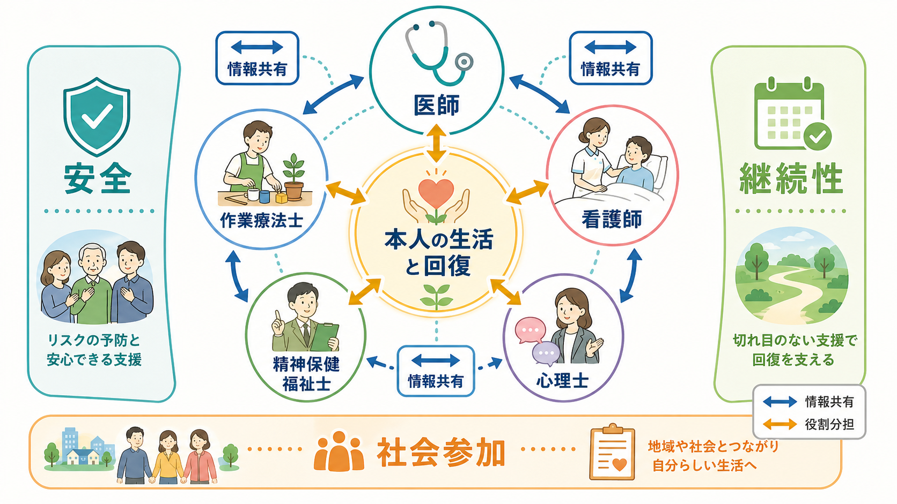
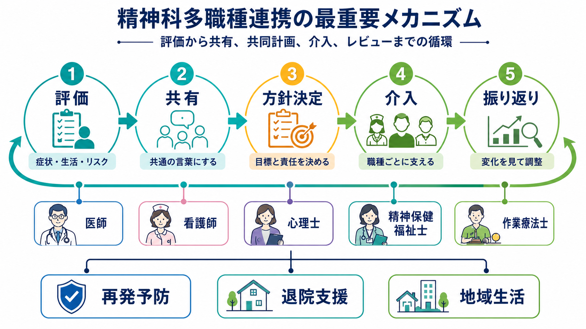

# 精神科で多職種連携はなぜ重要なのか

## 要点

- 精神科診療では、症状、身体状態、服薬、睡眠、対人関係、家族、仕事、住まい、経済、権利擁護が互いに絡むため、一人の専門職だけでは評価も介入も偏りやすい。
- 多職種連携の中心は「職種を増やすこと」ではなく、本人の目標を軸に、評価・方針・責任分担・見直しを同じ計画へ統合することである[1][2]。
- 医師は診断と治療方針、看護師は日常の観察とセルフケア支援、心理士は心理アセスメントと心理支援、精神保健福祉士は社会資源と生活課題、作業療法士は生活行為と社会参加を主に担う[3][4][5][6][7]。
- 連携がうまくいくと、再発予防、退院支援、地域生活、[[共同意思決定とは何か|共同意思決定]]、[[アドヒアランスとは何か|アドヒアランス]]、安全確保が一つの治療計画として扱いやすくなる。
- 医療・精神医学に関する記述は教育・研究目的であり、個別の診断や治療指示ではない。

## この記事で答える問い

1. なぜ精神科では多職種連携が特に重要なのか。
2. 医師・看護師・心理士・精神保健福祉士・作業療法士は、それぞれ何を見ているのか。
3. 多職種連携は、会議や申し送り以上のものとして、どのように機能するのか。
4. 連携が不十分なとき、臨床上どのような見落としが起こりやすいのか。

## まず結論

精神科で多職種連携が重要なのは、精神疾患が「脳の症状」だけでも、「心理の問題」だけでも、「生活環境の問題」だけでも説明しきれないからである。たとえば抑うつ、不眠、幻聴、不安、衝動性、服薬中断、家族葛藤、失職、孤立、身体合併症、経済困難は、別々の問題に見えても、実際には互いに増悪因子にも保護因子にもなる。これは[[生物心理社会モデルとは何か|生物心理社会モデル]]の実践上の帰結である。

したがって、多職種連携とは「医師が決め、他職種が補助する」構図ではなく、本人の生活と回復を中心に、職種ごとの観察をつなぎ合わせる仕組みである。WHO は地域精神保健サービスについて、本人中心、リカバリー志向、権利基盤、住まい・教育・雇用・社会保障との接続を重視している[1]。NICE も重い精神疾患の地域ケアで、ケアコーディネーション、多職種チーム、本人と家族を含むケア計画を重視している[2]。

## 背景

精神科では、診察室で語られる症状と、病棟・家庭・職場・地域で見える困りごとが一致しないことが多い。診察では「眠れている」と話していても、看護師の観察では夜間覚醒が続いているかもしれない。本人は「薬は飲めている」と言っていても、家族や薬剤管理の状況からは飲み忘れが目立つかもしれない。退院可能に見えても、精神保健福祉士が確認すると住居、収入、福祉サービス、家族関係に大きな課題が残っていることもある。

精神科医療は、入院、外来、訪問、デイケア、就労支援、福祉サービス、家族支援、危機介入をまたいで続く。WHO の地域精神保健サービス文書は、精神保健ケアを病院中心から地域での生活支援へ広げる必要を示し、住まい・教育・雇用・社会的保護との連携を明示している[1]。この観点では、[[精神医学における回復とは何か|回復]]は症状の消失だけでなく、本人が意味のある生活を取り戻す過程として扱われる。

研究面でも、重い精神疾患への集中的ケースマネジメントでは、標準的ケアと比較して、入院利用、ケア継続、社会機能などに影響しうることが検討されてきた[8]。効果の大きさや適用条件は地域資源や対象者によって変わるが、少なくとも「診断と薬物療法だけで支援が完結する」と考えるには限界がある。

## 基本概念

### 多職種連携

多職種連携とは、複数の専門職が同じ患者について情報を共有するだけではなく、評価、目標、介入、責任分担、見直しを調整することである。単なる「紹介」や「申し送り」と違う点は、各職種が別々に動くのではなく、本人の目標とリスクを中心に計画を更新する点にある。

### チーム医療

チーム医療では、専門性の違いがそのまま観察点の違いになる。医師は診断、治療方針、薬物療法、身体疾患との鑑別を重視する。看護師は睡眠、食事、セルフケア、対人反応、日内変動、服薬状況など、生活に近い変化を観察しやすい。心理士は認知、感情、行動、対人パターン、トラウマ、心理検査、心理教育を扱う。精神保健福祉士は制度、家族、住まい、経済、就労、退院後支援をつなぐ。作業療法士は、本人が実際に生活行為を行えるか、どの活動が回復や社会参加の足場になるかを見る。

### ケアコーディネーション

ケアコーディネーションとは、支援の窓口や責任の所在を曖昧にしないための調整である。NICE は、重い精神疾患の地域ケアにおいて、ニーズ評価、危機計画、家族や支援者との協働、ケアコーディネーターを含む支援を重視している[2]。精神科では状態が変動しやすいため、「誰が、いつ、何を見て、変化があったらどこへつなぐか」をあらかじめ決めることが重要になる。

## 職種ごとの役割

| 職種 | 主な視点 | 典型的な役割 | 連携上の注意 |
|---|---|---|---|
| 医師 | 診断、治療方針、薬物療法、身体疾患との鑑別、安全性 | 診断、処方、精神療法、治療計画、入退院判断、チーム全体の医学的調整 | 医学的判断を共有しつつ、生活情報や本人の価値観で方針を修正する |
| 看護師 | 日常生活、睡眠、食事、セルフケア、服薬、対人反応 | 観察、ケア、服薬支援、危機サインの把握、本人の自律性支援 | 病棟・外来・訪問で得た変化を治療方針へ戻す |
| 心理士 | 心理状態、認知、感情、行動、対人関係、心理検査 | 心理アセスメント、心理教育、心理療法的支援、家族や関係者への助言 | 「心の問題」に閉じず、症状・生活・制度との接点を共有する |
| 精神保健福祉士 | 生活課題、社会資源、家族、住居、経済、権利擁護 | 相談援助、退院支援、地域移行、福祉制度利用、関係機関連携 | 支援制度を紹介するだけでなく、本人が使える形に調整する |
| 作業療法士 | 生活行為、活動、役割、作業能力、社会参加 | 作業活動、ADL/IADL、就労・余暇・対人交流への支援 | 活動を「気晴らし」に留めず、生活機能と参加の評価につなげる |

厚生労働省の e-ヘルスネットは、精神科医について、精神疾患の診断と治療を専門とし、薬物療法、心理社会的治療、精神療法を行い、近年は心理士や精神保健福祉士などと協力して治療することが多いと説明している[3]。看護については、日本精神科看護協会が、個人の尊厳と権利擁護を基本理念に、自律性の回復を通してその人らしい生活を支援するものと定義している[4]。

公認心理師は、心理状態の観察と分析、本人や関係者への相談・助言・援助、心の健康に関する教育と情報提供を行う国家資格である[5]。精神保健福祉士は、精神障害の医療を受ける人や社会復帰を目指す人に対し、地域相談支援、社会復帰、日常生活への適応に関する相談援助を担う[6]。作業療法士は、作業に焦点を当てた治療・指導・援助を行い、日常生活活動、家事、外出、職業関連活動、住環境適応などを支援する[7]。

## 仕組み

多職種連携は、次の循環として見ると理解しやすい。

1. 評価する。  
   医師は症状と診断、看護師は生活上の変化、心理士は認知・感情・行動、精神保健福祉士は社会資源と環境、作業療法士は活動と参加を評価する。ここで重要なのは、[[精神科で生活機能をどう評価するか|生活機能]]を症状と切り離さないことである。

2. 共有する。  
   それぞれの情報を「その職種だけが知っている事実」にしない。たとえば「不眠」は医師には薬物調整の情報であり、看護師には夜間ケアの情報であり、心理士には不安や反すうの情報であり、作業療法士には日中活動量の情報であり、精神保健福祉士には住環境や家族負担の情報である。

3. 方針を決める。  
   目標を「症状を減らす」だけに置くと、本人の生活課題が見えにくい。退院する、学校に戻る、朝起きる、家族との距離を調整する、再発サインに気づく、就労を再開するなど、本人にとって意味のある目標へ変換する必要がある。

4. 介入する。  
   医師が薬物療法を調整し、看護師が生活リズムとセルフケアを支え、心理士が心理教育や心理療法的支援を行い、精神保健福祉士が制度や地域資源をつなぎ、作業療法士が活動と役割の回復を支援する。介入は別々に見えても、同じ目標に向かっている必要がある。

5. 振り返る。  
   精神科では状態が変動するため、一度立てた計画を固定しない。効果、副作用、本人の納得、家族や支援者の負担、生活上の実行可能性を定期的に見直す。ここで[[共同意思決定とは何か|共同意思決定]]が重要になる。

## 図解

1枚目の図は、本人の生活と回復を中心に、医師・看護師・心理士・精神保健福祉士・作業療法士が情報共有と役割分担を行う全体像を示している。ポイントは、各職種が本人を囲む「周辺の支援者」ではなく、本人の目標へ向けて相互に情報を戻す関係にある点である。

2枚目の図は、評価、共有、方針決定、介入、振り返りの循環を示している。多職種連携は一回のカンファレンスではなく、状態変化に応じて更新される臨床プロセスである。

## 臨床・研究との接続

### 入院治療

入院中は、症状の安定化、安全確保、薬物調整、生活リズムの回復、退院後の生活設計が同時に進む。たとえば急性期には、医師が診断と薬物療法を調整し、看護師が観察と安全確保を担い、心理士が不安や病識への心理教育を行い、精神保健福祉士が家族・住居・制度を調整し、作業療法士が日中活動と生活リズムを整える。[[精神科救急では何を優先するべきか|救急場面]]や[[自殺リスク評価では何を聞くべきか|自殺リスク評価]]では、情報の断片化が安全上の問題になりやすい。

### 外来・地域生活

外来では、診察時間だけでは生活の全体像が見えにくい。服薬、睡眠、就労、家族関係、金銭管理、孤立、支援サービスの利用状況は、本人の語りと周囲の情報を合わせて理解する必要がある。WHO が示す本人中心・権利基盤の地域精神保健では、医療だけでなく住まい、教育、雇用、社会保障との接続が重視される[1]。

### 家族・支援者との関係

家族や支援者は重要な情報源であり、支援資源でもある。ただし、本人の同意、守秘義務、権利擁護を曖昧にしてよいわけではない。[[家族面接では何を評価するべきか|家族面接]]や[[守秘義務とは何か|守秘義務]]の観点から、本人の意思、リスク、家族負担、支援可能性を慎重に整理する必要がある。

### 研究上の論点

多職種連携の研究では、単に「チームがあるか」ではなく、チームの構成、対象者、支援密度、地域資源、ケアコーディネーションの質、本人の参加、アウトカム指標を分けて見る必要がある。Cochrane の集中的ケースマネジメントレビューでは、重い精神疾患を対象に、標準的ケアや非集中的ケースマネジメントと比べた入院利用、ケア継続、社会機能などが検討された[8]。ただし、制度や地域資源が異なると結果も変わるため、特定のモデルをそのまま移植するより、どの機能が有効なのかを見極める必要がある。

## よくある誤解

### 誤解1: 多職種連携とは会議を増やすことである

会議は手段であり、目的ではない。会議が増えても、本人の目標、リスク、責任分担、見直し時点が明確でなければ連携は進まない。むしろ、短くても「誰が何を見て、いつ共有し、次に何を変えるか」が決まっている方が有効である。

### 誤解2: 医師以外の職種は補助的役割である

医学的診断と治療方針は重要だが、精神科では生活の場で起きる変化が治療の成否を左右する。看護、心理、福祉、作業療法の情報がなければ、診断や処方も実行可能な計画になりにくい。

### 誤解3: 役割分担は職種ごとに完全に線引きできる

役割分担は必要だが、現実の支援は重なり合う。心理教育は医師、看護師、心理士、作業療法士がそれぞれの場面で行うことがある。退院支援も精神保健福祉士だけでなく、医師、看護師、作業療法士、家族、地域支援者が関わる。重要なのは、重なりを避けることではなく、責任の空白を作らないことである。

### 誤解4: 本人中心にすると専門性が弱くなる

本人中心とは、専門職が判断を放棄することではない。むしろ、専門職が医学的根拠、リスク、選択肢、制度、生活上の制約をわかりやすく共有し、本人の価値観と結びつけることである。これは[[インフォームドコンセントは精神科でどう行うのか|インフォームドコンセント]]や[[共同意思決定とは何か|共同意思決定]]と連続している。

## 関連ノート

既存ノート:

- [[生物心理社会モデルとは何か]]
- [[精神医学における回復とは何か]]
- [[精神科で生活機能をどう評価するか]]
- [[精神科初診で何を確認するべきか]]
- [[共同意思決定とは何か]]
- [[アドヒアランスとは何か]]
- [[心理教育とは何か]]
- [[家族面接では何を評価するべきか]]
- [[守秘義務とは何か]]
- [[身体合併症は精神科診療でなぜ重要なのか]]

今後の作成候補:

- ケアコーディネーションとは何か
- 精神科退院支援では何を確認するべきか
- 精神科訪問看護とは何か
- 地域移行支援とは何か
- 精神科デイケアとは何か
- 精神科カンファレンスでは何を共有するべきか

MOC 更新候補:

- `content/00_MOC/` 配下の精神医学、臨床実践、地域精神保健、面接・診断関連 MOC に追加候補。並列ジョブとの衝突を避けるため、このタスクでは MOC 本体は更新しない。

## 理解チェック

1. 精神科で多職種連携が重要になる理由を、症状、生活、社会資源の関係から説明できるか。
2. 医師、看護師、心理士、精神保健福祉士、作業療法士の主な観察点を区別できるか。
3. 多職種連携が「会議」ではなく「評価・共有・介入・振り返りの循環」である理由を説明できるか。
4. 退院支援で、どの職種がどの情報を持ち寄ると計画が現実的になるかを例示できるか。
5. 本人中心の支援と、専門職の責任ある判断が矛盾しない理由を説明できるか。

## 未解決問題

- 多職種連携の効果を、症状改善、入院日数、再入院、生活機能、本人の満足、権利擁護のどの指標で評価するのが妥当か。
- 地域資源が乏しい地域で、どの連携機能を優先的に確保すべきか。
- 本人、家族、医療者、福祉職の希望が一致しないとき、どのように共同意思決定を支えるか。
- 情報共有と守秘義務・本人同意の境界を、現場でどのように運用するか。

## 参考文献

[1] World Health Organization. (2021). *Guidance on community mental health services: promoting person-centred and rights-based approaches*. World Health Organization. https://iris.who.int/handle/10665/341648

[2] National Institute for Health and Care Excellence. (2014, updated). *Psychosis and schizophrenia in adults: prevention and management. NICE guideline CG178*. https://www.nice.org.uk/guidance/cg178

[3] 厚生労働省 e-ヘルスネット. (2021). 精神科医. https://kennet.mhlw.go.jp/information/information/dictionary/heart/yk-033.html

[4] 一般社団法人日本精神科看護協会. 精神科看護の定義. https://jpna.jp/nisseikan/define

[5] 厚生労働省. 公認心理師. https://www.mhlw.go.jp/stf/seisakunitsuite/bunya/0000116049.html

[6] 厚生労働省. 精神保健福祉士について. https://www.mhlw.go.jp/stf/seisakunitsuite/bunya/hukushi_kaigo/shougaishahukushi/seisinhoken/index.html

[7] 一般社団法人日本作業療法士協会. 日本作業療法士協会 作業療法の定義. https://www.jaot.or.jp/about/definition/

[8] Dieterich, M., Irving, C. B., Bergman, H., Khokhar, M. A., Park, B., & Marshall, M. (2017). Intensive case management for severe mental illness. *Cochrane Database of Systematic Reviews, 2017*(1), CD007906. https://doi.org/10.1002/14651858.CD007906.pub3
