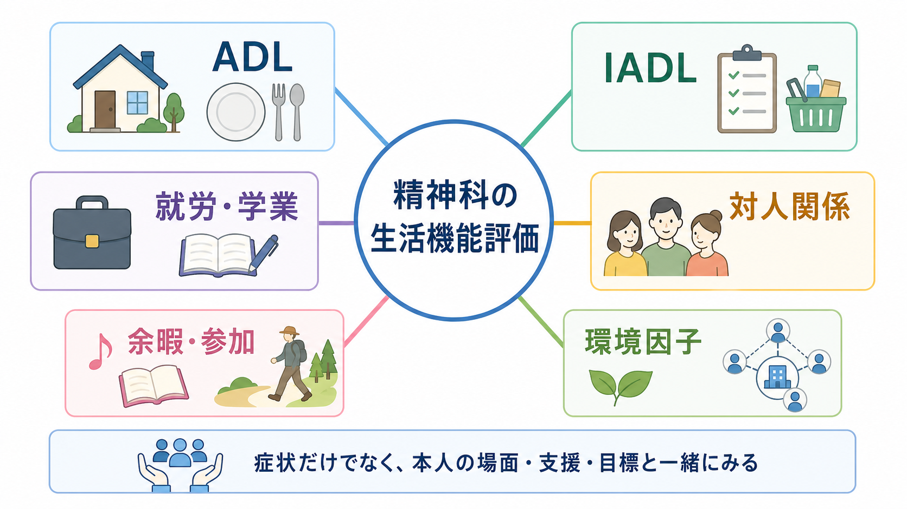
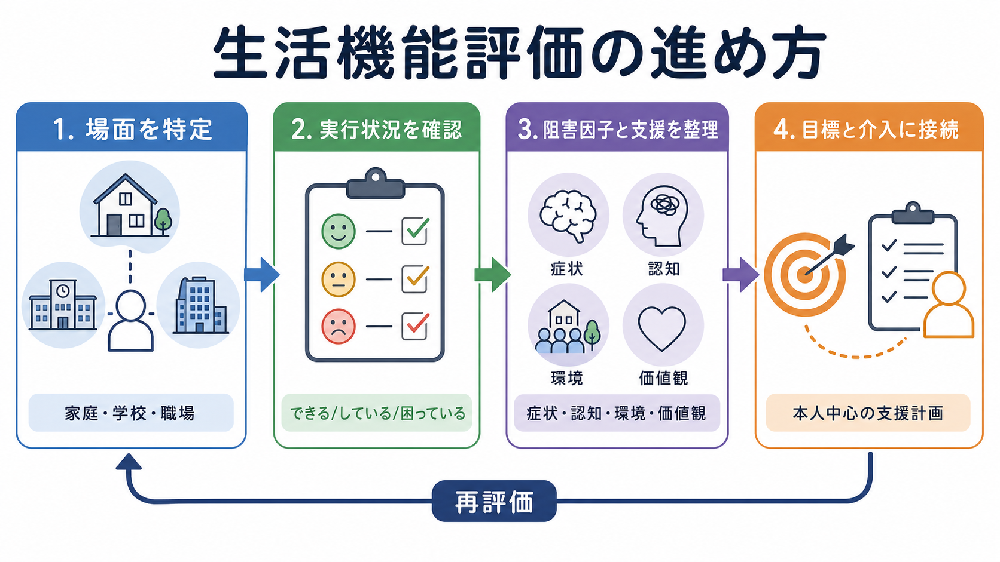

# 精神科で生活機能をどう評価するか

## 要点

- 生活機能評価は、症状の重さだけでなく、その人が家庭・学校・職場・地域で「何をしているか」「何に困っているか」「どの支援があれば参加できるか」をみる評価である。
- 精神科では、ADL、IADL、就労・学業、対人関係、余暇・社会参加を分けて聞くと、診断、重症度、リスク、支援計画が具体化しやすい。
- ICF は生活機能を、心身機能、活動、参加、環境因子の相互作用として捉える枠組みであり、診断名とは別の臨床情報を与える[1]。
- WHODAS 2.0 は ICF に基づく標準化された障害・生活機能評価で、精神・神経・依存症を含む健康状態に横断的に使える[2]。
- 数値尺度は便利だが、点数だけでは本人の目標、文化、役割、支援資源、環境の障壁を十分に表せない。面接、観察、家族・支援者情報、本人の価値観を統合する。

## この記事で答える問い

1. 精神科でいう「生活機能」とは何か。
2. ADL、IADL、就労、学業、対人関係、余暇活動をどう分けて評価するか。
3. 症状評価、診断、治療計画、リカバリー支援と生活機能評価はどう接続するか。
4. 尺度を使うときに、何に注意すべきか。

## まず結論

精神科の生活機能評価では、「病名に合う障害像」を探すのではなく、「その人が生活のどの場面で、どの活動や参加を、どの程度、どの支援条件で行えているか」を整理する。抑うつ、不安、幻覚妄想、陰性症状、躁状態、認知機能低下、睡眠障害、物質使用、身体疾患、薬剤副作用は、生活機能に影響する。しかし、同じ症状でも、家庭の支援、職場の配慮、経済状況、住環境、本人の価値観によって実際の困りごとは変わる。

したがって評価は、次の順序で行うとよい。

1. 生活場面を特定する。
2. 「できる」「している」「困っている」を分ける。
3. 阻害因子と支援因子を整理する。
4. 本人の目標に沿って支援計画へ接続する。
5. 介入後に同じ領域を再評価する。

この流れは、[[精神科面接とは何か]]、[[生活歴はなぜ重要なのか]]、[[病前機能とは何か]]で得た情報を、現在の支援計画に変換する作業でもある。

## 背景

精神科診療では、診断名や症状評価だけでは臨床判断が足りないことが多い。たとえば「抑うつ気分が強い」という情報だけでは、休職が必要か、家事支援が必要か、通学調整が必要か、孤立への支援が必要かは決まらない。逆に、症状が完全には消えていなくても、十分な配慮や環境調整があれば、学業・就労・家庭内役割・余暇活動を回復できることもある。

ICF は、生活機能と障害を健康状態だけの結果ではなく、活動、参加、環境因子の相互作用として記述する[1]。この発想は、精神科の[[生物心理社会モデルとは何か|生物心理社会モデル]]と相性がよい。診断は「何が起きているか」を記述し、生活機能評価は「その人の生活で何が可能で、何が妨げられているか」を記述する。

DSM-5 以降、GAF のような一つの総合点だけで心理・社会・職業機能を代表させる方法には限界があるとされ、WHODAS 2.0 などの機能評価が議論されてきた[3]。ただし、どの尺度も臨床面接の代替ではない。尺度は、面接で得た情報を標準化し、経時変化を追いやすくする補助線である。

## 基本概念

### 生活機能とは何か

生活機能とは、身体・認知・情動・対人・社会的な能力が、実際の生活場面でどのように発揮されているかを指す。精神科で重要なのは、能力の有無を抽象的に決めることではなく、活動の具体的な文脈を把握することである。

たとえば「料理ができない」という訴えは、複数の意味をもちうる。

| 評価する観点 | 例 |
|---|---|
| 症状 | 意欲低下、不安、強迫、幻聴、易疲労、睡眠障害 |
| 認知 | 段取り、注意、記憶、判断、時間管理 |
| 身体 | 疼痛、ふらつき、薬剤性鎮静、体力低下 |
| 環境 | 食材費、台所の構造、家族の役割、支援者の有無 |
| 価値観 | 自炊に意味を置くか、外食や配食でよいか |

この区別がないと、すべてを「意欲がない」「病識がない」「怠けている」と誤って解釈しやすい。

### ADL

ADL は、食事、整容、更衣、排泄、入浴、移動など、生命維持と基本的な身辺自立に近い活動である。Katz らの ADL Index は、入浴、更衣、排泄、移乗、排尿・排便のコントロール、食事を含む基本的 ADL の標準的評価として発展した[4]。

精神科では ADL 低下が、重度抑うつ、精神病症状、緊張病、認知症、せん妄、物質使用、薬剤副作用、身体疾患を示すことがある。ADL 低下は「精神症状の一部」と決めつけず、身体合併症、栄養、睡眠、疼痛、神経学的異常、服薬状況も確認する。これは[[身体合併症は精神科診療でなぜ重要なのか]]とも接続する。

### IADL

IADL は、買い物、調理、掃除、洗濯、金銭管理、服薬管理、交通機関利用、電話・通信、予定管理など、地域生活を維持するための複雑な活動である。Lawton と Brody の研究は、基本的 ADL と IADL を区別して高齢者の機能評価を整理した古典的研究である[5]。

精神科では、IADL は認知機能、遂行機能、注意、社会不安、被害念慮、強迫、依存、衝動性、生活リズムと強く関係する。たとえば、服薬を忘れる背景には、病識の問題だけでなく、記憶障害、生活リズムの乱れ、副作用への恐怖、薬局までの移動困難、経済的困難があるかもしれない。

### 就労・学業

就労・学業は、単に「働いているか」「学校に行っているか」では評価できない。出勤・出席、遅刻欠席、集中、課題遂行、対人調整、業務量、締切、評価への不安、合理的配慮、休職・復職の段階を分ける。

評価では、次を具体化する。

| 領域 | 聞くこと |
|---|---|
| 量 | 週何日、何時間、どの程度継続できるか |
| 質 | 集中、正確性、スピード、ミスの増減 |
| 対人 | 上司、同僚、教員、友人との調整 |
| 負荷 | 通勤通学、感覚刺激、締切、評価、夜勤 |
| 配慮 | 時短、在宅、課題調整、休憩、相談先 |
| 意味 | 本人にとって働く・学ぶことが何を意味するか |

就労支援では、Individual Placement and Support (IPS) のような支援付き雇用モデルが、重い精神疾患のある人の競争的雇用を高めることがメタ分析で示されている[8]。そのため、生活機能評価は「働けるか働けないか」を判定するだけでなく、「どの条件なら参加しやすいか」を見つけるために使う。

### 対人関係

対人関係の評価では、家族、友人、パートナー、職場・学校、支援者、地域のつながりを分ける。量だけでなく、関係の質、葛藤、孤立、過干渉、依存、被害体験、境界設定、支援を求める力を確認する。

精神科では、対人機能の低下が症状の結果である場合も、症状の維持因子である場合もある。たとえば、社交不安により人を避けると、短期的には安心するが、長期的には孤立と自己効力感の低下を強めることがある。被害妄想がある場合は、対人関係の変化を評価しつつ、安全性、ストレス、生活上の損失を慎重に確認する。

### 余暇活動と社会参加

余暇活動は「治療の本筋ではないもの」ではない。趣味、運動、文化活動、宗教・地域活動、創作、ゲーム、読書、旅行、友人との外出などは、回復感、生活リズム、自己同一性、対人接触、ストレス調整に関わる。[[精神医学における回復とは何か|回復]]を症状消失だけでなく、本人にとって意味のある生活の再構築として捉えるなら、余暇活動は重要な評価対象になる。

ただし、余暇の少なさを直ちに病的とみなしてはいけない。文化、年齢、経済状況、介護・育児負担、性格、価値観によって、望ましい余暇の形は異なる。本人が「したいのにできない」のか、「今は優先していない」のかを分ける。

## 仕組み

### 「できる」と「している」を分ける

生活機能評価で最も重要なのは、潜在能力としての「できる」と、実生活での「している」を分けることである。診察室で落ち着いて話せる人が、職場では過刺激で集中できないことがある。逆に、診察室では緊張して話しにくい人が、家庭内では十分な役割を果たしていることもある。

| 区別 | 例 |
|---|---|
| できる | 支援や条件が整えば、食事準備や通学が可能 |
| している | 実際に週何回、どの程度行っている |
| 困っている | 行っているが、疲弊、遅延、対人摩擦、失敗が多い |
| 避けている | 不安、妄想、失敗体験、環境不適合で回避している |
| 支援で可能 | 声かけ、同行、環境調整、リマインダーで可能 |

### 阻害因子と支援因子

同じ生活機能低下でも、介入すべき点は異なる。

| 主な阻害因子 | 評価の焦点 | 支援の方向 |
|---|---|---|
| 症状 | 抑うつ、不安、精神病症状、躁状態、強迫、睡眠 | 症状治療、危機対応、再発予防 |
| 認知・遂行機能 | 注意、記憶、段取り、処理速度、柔軟性 | 手順化、リマインダー、作業分解 |
| 身体・薬剤 | 鎮静、錐体外路症状、疼痛、疲労、内科疾患 | 薬剤調整、身体評価、リハビリ |
| 環境 | 家族関係、経済、住居、職場配慮、交通 | ケースワーク、福祉制度、環境調整 |
| 価値観 | 本人の目標、優先順位、役割意識 | 共同意思決定、目標設定 |

この整理は、[[共同意思決定とは何か]]や[[心理教育とは何か]]と結びつく。本人が何を重視しているかを確認せずに「機能改善」を目標にすると、支援者側の価値観を押しつけやすい。

### 尺度を使う位置づけ

尺度は、面接で得た生活機能を標準化し、経時変化を比較し、チームで共有するために役立つ。

| 尺度・枠組み | 主な用途 | 注意点 |
|---|---|---|
| ICF | 活動・参加・環境因子を含む共通言語 | 臨床で使うには具体的場面への翻訳が必要 |
| WHODAS 2.0 | 認知、移動、セルフケア、人付き合い、生活活動、参加の横断評価 | 診断別の細かな支援ニーズを単独で決めない |
| ADL 尺度 | 食事、入浴、更衣、排泄、移動など | 精神症状だけでなく身体疾患を確認する |
| IADL 尺度 | 買い物、調理、金銭・服薬管理、交通など | 文化、性別役割、家族内分担の影響を受ける |
| PSP | 統合失調症などで個人的・社会的機能を評価 | 評価者訓練と場面情報が重要 |
| FAST | 自律性、職業、認知、金銭、対人、余暇などを評価 | 双極性障害で開発されたが、用途は研究文脈を確認する |

FAST は、双極性障害の機能障害を、自律性、職業機能、認知機能、金銭、対人関係、余暇の 6 領域で短時間に評価する尺度として開発され、良好な心理測定特性が報告された[6]。PSP は、統合失調症などで社会的に有用な活動、対人関係、セルフケア、迷惑・攻撃的行動を評価する臨床家評定尺度として検討されている[7]。尺度選択は、診断、目的、評価者、時間、研究・臨床の文脈に応じて決める。

## 図解

この記事の図は、生活機能評価を二つの視点で示している。

1. 概念地図: ADL、IADL、就労・学業、対人関係、余暇・参加、環境因子を、症状だけでなく本人の場面・支援・目標と一緒にみる。
2. 評価プロセス: 場面を特定し、実行状況を確認し、阻害因子と支援を整理し、本人中心の支援計画へ接続し、再評価する。

画像を使わない場面では、次のような文章化でも十分に図解できる。

| 評価の問い | 具体例 |
|---|---|
| どの場面か | 家庭、学校、職場、地域、オンライン |
| 何をしているか | 食事、家事、通勤、授業、会話、趣味 |
| どの程度困っているか | 頻度、持続時間、失敗、疲労、回避 |
| なぜ困っているか | 症状、認知、身体、環境、価値観 |
| 何が助けになるか | 人、物、制度、配慮、技術、休息 |
| どう再評価するか | 同じ領域を同じ期間で追う |

## 臨床・研究との接続

### 初診と診断

初診では、主訴、現病歴、生活歴、病前機能、家族歴、身体合併症に加えて、現在の生活機能を確認する。これは[[精神科初診で何を確認するべきか]]の中核である。生活機能は、多くの精神疾患の診断基準にも関わるが、診断のためだけに聞くのではない。安全性、治療の優先順位、支援資源、予後、本人の目標を見立てるために聞く。

### リスク評価

ADL や IADL の急な低下は、希死念慮、セルフネグレクト、栄養不良、服薬中断、金銭トラブル、虐待、物質使用、身体疾患のサインになることがある。生活機能の評価は、[[自殺リスク評価では何を聞くべきか]]や[[虐待リスクを精神科でどう評価するか]]の補助情報にもなる。

### 治療計画

治療計画では、症状目標と生活目標を分けて書くとよい。

| 症状目標 | 生活目標 |
|---|---|
| 睡眠を安定させる | 午前中に起きて朝食をとる |
| 不安発作を減らす | 週 2 回、短時間の外出を再開する |
| 幻聴への対処を増やす | 支援者と買い物に行けるようにする |
| 抑うつ症状を軽減する | 家事を 1 つだけ再開する |
| 躁状態の再発を防ぐ | 勤務時間と睡眠時間を記録する |

生活目標は、本人の価値観に沿って小さく具体化する。支援者が望む「標準的な生活」を目標にするのではなく、本人にとって意味のある参加を確認する。

### 研究

研究では、症状尺度だけでは治療効果を十分に捉えられない。ある介入が症状を軽減しても、就労、学業、対人関係、余暇活動が改善するとは限らない。逆に、症状の残存があっても、支援付き雇用、心理社会的介入、家族支援、環境調整によって参加が改善する可能性がある。IPS のメタ分析では、通常支援と比べて競争的雇用などの職業アウトカムに有利な結果が示されており、機能アウトカムを治療評価に含める意義を示している[8]。

## よくある誤解

### 誤解1: 症状が軽くなれば生活機能は自動的に戻る

症状改善は重要だが、生活機能の回復には、生活リズム、体力、対人練習、認知的補助、環境調整、制度利用、役割の再構築が必要なことがある。症状と機能は関連するが、同じものではない。

### 誤解2: 働いていないことは機能が低いことを意味する

就労していない理由は、症状、失業、介護、育児、学業、経済制度、地域の雇用環境、本人の価値観など多様である。就労の有無だけで生活機能を判断しない。

### 誤解3: 家族が代わりにしているなら問題はない

家族の支援は重要だが、過負担、過干渉、本人の自立機会の減少、支援者不在時の脆弱性を生むこともある。家族内役割と負担も評価する。

### 誤解4: 尺度の点数が客観的な真実である

尺度は比較と共有に役立つが、文化、役割、環境、評価者、本人の自己評価の影響を受ける。点数は、面接と観察を構造化する材料であり、本人の生活を置き換えるものではない。

### 誤解5: 余暇は余裕ができてから考えればよい

余暇活動は、生活リズム、社会参加、自己効力感、ストレス調整に関わる。重症期には休息が優先されるが、回復期には「何を楽しめるか」「どの活動なら再開できるか」を早めに扱う価値がある。

## 関連ノート

- [[精神科面接とは何か]]
- [[精神科初診で何を確認するべきか]]
- [[生活歴はなぜ重要なのか]]
- [[病前機能とは何か]]
- [[生物心理社会モデルとは何か]]
- [[精神医学における回復とは何か]]
- [[共同意思決定とは何か]]
- [[心理教育とは何か]]
- [[身体合併症は精神科診療でなぜ重要なのか]]
- [[DSMとICDは何が違うのか]]

## MOC更新候補

- `content/00_MOC/` 配下の精神医学・診断面接系 MOC がある場合、本記事を「診断・面接」「ケースフォーミュレーション」「生活機能・リカバリー」周辺に追加する候補。
- 並列編集の衝突を避けるため、この作業では MOC ファイル本体は更新しない。

## 未解決問題

- 日本の精神科臨床で、WHODAS 2.0、PSP、FAST、ADL/IADL 尺度をどの場面でどう使い分けるのが最も実用的か。
- オンライン活動、在宅勤務、SNS 上の対人関係を、従来の生活機能評価にどう組み込むか。
- 本人の価値観に沿った「参加」と、社会制度上求められる「就労・就学能力」をどう区別して記述するか。
- 家族や支援者による代行が多い場合、本人の能力、環境依存、支援者負担をどう分けて評価するか。

## 理解チェック

1. ADL と IADL の違いを、自分の言葉で説明できるか。
2. 「できる」と「している」を分けて聞く理由を説明できるか。
3. 生活機能低下を、症状、認知、身体、環境、価値観に分けて整理できるか。
4. 尺度の点数だけで支援方針を決めることの問題点を説明できるか。
5. 就労・学業・対人関係・余暇活動を、本人の目標に接続して評価できるか。

## 参考文献

[1] World Health Organization. International Classification of Functioning, Disability and Health (ICF). https://www.who.int/standards/classifications/international-classification-of-functioning-disability-and-health

[2] World Health Organization. *Measuring health and disability: manual for WHO Disability Assessment Schedule (WHODAS 2.0).* 2010. https://www.who.int/publications/i/item/measuring-health-and-disability-manual-for-who-disability-assessment-schedule-%28-whodas-2.0%29/

[3] Gold, L. H. (2014). DSM-5 and the assessment of functioning: The World Health Organization Disability Assessment Schedule 2.0 (WHODAS 2.0). *Journal of the American Academy of Psychiatry and the Law*, 42(2), 173-181. https://pubmed.ncbi.nlm.nih.gov/24986344/

[4] Katz, S., Ford, A. B., Moskowitz, R. W., Jackson, B. A., & Jaffe, M. W. (1963). Studies of illness in the aged: The Index of ADL: A standardized measure of biological and psychosocial function. *JAMA*, 185(12), 914-919. https://doi.org/10.1001/jama.1963.03060120024016

[5] Lawton, M. P., & Brody, E. M. (1969). Assessment of older people: Self-maintaining and instrumental activities of daily living. *The Gerontologist*, 9(3 Part 1), 179-186. https://doi.org/10.1093/geront/9.3_Part_1.179

[6] Rosa, A. R., Sanchez-Moreno, J., Martinez-Aran, A., et al. (2007). Validity and reliability of the Functioning Assessment Short Test (FAST) in bipolar disorder. *Clinical Practice and Epidemiology in Mental Health*, 3, 5. https://doi.org/10.1186/1745-0179-3-5

[7] Nasrallah, H., Morosini, P., & Gagnon, D. D. (2008). Reliability, validity and ability to detect change of the Personal and Social Performance scale in patients with stable schizophrenia. *Psychiatry Research*, 161(2), 213-224. https://doi.org/10.1016/j.psychres.2007.11.012

[8] Frederick, D. E., & VanderWeele, T. J. (2019). Supported employment: Meta-analysis and review of randomized controlled trials of individual placement and support. *PLOS ONE*, 14(2), e0212208. https://doi.org/10.1371/journal.pone.0212208

## 更新ログ

- 2026-04-28: 初版作成。生活機能評価の枠組み、主要領域、尺度、臨床・研究との接続、関連ノート候補を整理した。
