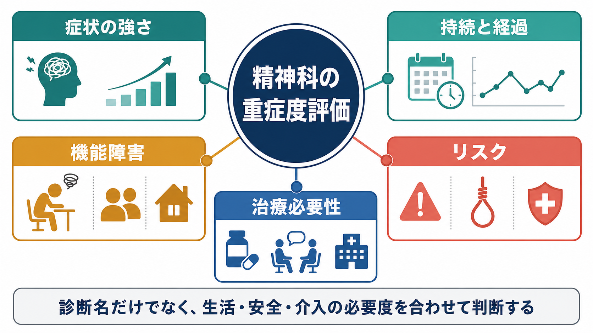
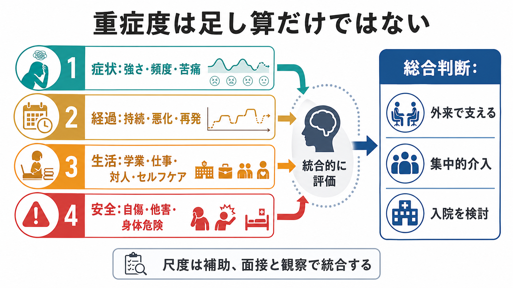
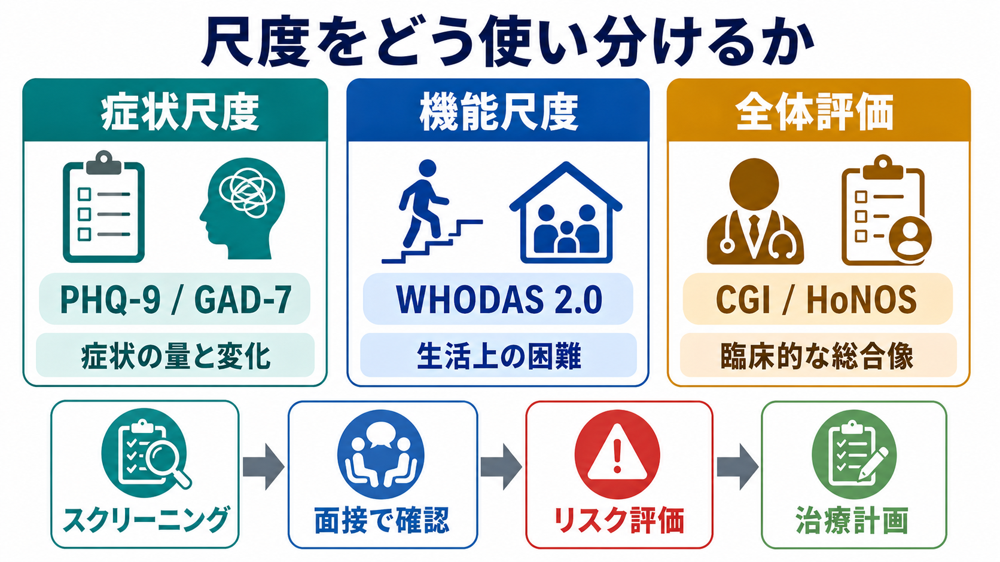

# 精神科で重症度をどう判断するか

## 要点

- 精神科の重症度は、診断名だけでも、症状数だけでも決まらない。
- 中核になるのは、症状の強さ、持続と経過、生活機能の障害、本人・周囲の安全リスク、治療や支援の必要性である。
- 評価尺度は有用だが、面接、観察、家族や支援者からの情報、身体疾患や物質使用の確認と統合して読む必要がある。
- 自傷・自殺、他害、セルフケア不能、せん妄や重い身体疾患の疑い、急速な悪化がある場合は、症状の点数よりも安全確保と緊急対応が優先される。

## この記事で答える問い

精神科で「軽症」「中等症」「重症」と言うとき、何を見ているのだろうか。この記事では、[[精神科初診で何を確認するべきか]]、[[精神科面接とは何か]]、[[操作的診断とは何か]]と接続しながら、重症度を臨床的に判断するための基本軸を整理する。

## まず結論

重症度は「いま、どの程度つらいか」だけでなく、「どの程度続いているか」「生活がどれだけ破綻しているか」「安全上の危険がどれだけあるか」「どの強度の治療・支援が必要か」を合わせた総合判断である。ICD-11 CDDRやDSM-5-TRの評価尺度群も、診断の正確さだけでなく、症状領域、機能障害、経過、治療反応を評価する方向に整理されている[1][2]。

## 背景

精神疾患では、同じ診断名でも臨床像の幅が大きい。たとえば、同じうつ病でも、仕事を続けながら強い苦痛を抱える人、食事や睡眠が崩れて自宅から出られない人、自殺念慮が切迫している人では、必要な支援の密度が異なる。したがって[[精神科診断は何のためにあるのか]]を考えるとき、診断名は出発点であり、重症度評価は治療計画を決めるための別の層である。

DSM-5以降、機能評価ではGAFのような単一の全体点だけに依存するのではなく、WHODAS 2.0のような生活領域ごとの評価が重視されるようになった[3]。これは、症状が強くても生活上の支えで機能が保たれている場合と、症状の訴えは控えめでもセルフケアや社会参加が大きく損なわれている場合を区別するためである。

## 基本概念

### 1. 症状の強さ

まず見るのは、抑うつ、不安、幻覚妄想、躁症状、強迫、解離、食行動、睡眠、物質使用などの症状がどれくらい強いかである。PHQ-9やGAD-7のような自己記入式尺度は、症状の頻度と変化を追ううえで便利で、PHQ-9はうつ症状の重症度評価、GAD-7は全般不安症状の簡便な評価として妥当性が検討されている[4][5]。

ただし、尺度の点数は「症状の量」を示す補助情報であって、診断や重症度を単独で決めるものではない。本人が症状を過小申告する、文化的背景により表現が変わる、身体疾患や薬剤の影響が混じる、といった状況では、[[精神科診断における除外診断とは何か]]や[[器質性精神障害を見逃さないためには何を見るべきか]]の視点が必要になる。

### 2. 持続と経過

重症度は、ある一時点の強さだけでなく、どのくらい続いているか、悪化しているか、再発を繰り返しているかで変わる。短期間の強い不安でも自然に軽快することがある一方、軽度に見える症状でも、数か月以上続き、学業・仕事・対人関係をじわじわ侵食しているなら治療必要性は高くなる。

経過を見るときは、発症時期、誘因、波、睡眠や食欲の変化、既往エピソード、治療反応、服薬状況、ストレスや支援の変化を確認する。これは[[現病歴はどのように構造化するべきか]]、[[病前機能とは何か]]、[[生活歴はなぜ重要なのか]]と直結する。

### 3. 機能障害

精神科の重症度で特に重要なのは、本人が「何をできなくなっているか」である。WHODAS 2.0は、認知、移動、セルフケア、対人関係、生活活動、社会参加という6領域で機能を評価する汎用尺度であり、精神・神経・依存症領域にも適用できる[3]。

機能障害は、単なる能力低下ではなく、環境との相互作用として見る。支援があれば生活できるのか、独居で破綻しやすいのか、職場や学校で配慮があるのか、家族の負担が限界に近いのかによって、同じ症状でも臨床的な重みは変わる。この点では[[生物心理社会モデルとは何か]]の見方が役に立つ。

### 4. リスク

自傷・自殺、他害、虐待・ネグレクト、セルフネグレクト、物質使用、衝動性、精神病症状に基づく危険行動、身体疾患の見逃しは、重症度評価の中でも優先度が高い。NICEの自傷ガイドラインは、自傷後の評価で心理社会的評価、継続支援、入退院判断、リスク評価ツールの限界を明示しており、単純な点数化だけで将来リスクを判定しないことを重視している[6]。

リスク評価では「危険があるか」だけでなく、「切迫性」「具体性」「手段へのアクセス」「保護因子」「本人が助けを求められるか」「観察できる支援者がいるか」を見る。これは[[精神科救急では何を優先するべきか]]、[[他害リスク評価では何を見るべきか]]、[[家族への説明で何に注意するべきか]]と接続する。

### 5. 治療必要性

最後に、どの強度の治療が必要かを考える。外来での心理教育や経過観察でよいのか、薬物療法や心理療法を開始するのか、訪問支援や家族支援を組み合わせるのか、休職や環境調整が必要か、入院や保護的環境が必要かを判断する。

治療必要性は、症状の強さだけでなく、本人の同意能力、病識、支援資源、アドヒアランス、身体合併症、妊娠・産後、年齢、家族や職場の状況によって変わる。[[共同意思決定とは何か]]や[[アドヒアランスとは何か]]は、この判断を本人と共有するための基礎になる。

## 仕組み

重症度判断は、複数の情報を段階的に統合する。

1. 主訴と現在の困りごとを確認する。
2. 症状の種類、頻度、強度、苦痛を評価する。
3. 発症時期、持続、悪化・改善、再発歴を確認する。
4. 学業、仕事、家事、対人関係、セルフケア、社会参加への影響を見る。
5. 自傷・自殺、他害、身体危険、虐待、セルフネグレクトの切迫性を評価する。
6. 身体疾患、薬剤、物質使用、発達特性、認知機能、文化的背景を確認する。
7. 外来、集中的支援、入院、救急対応など、必要な介入強度を決める。

この流れで重要なのは、重症度が単純な足し算ではないことである。自殺念慮が具体的で手段が近くにある場合、PHQ-9の総点が中等度でも緊急対応が必要になりうる。反対に、尺度点数が高くても、本人が安全を保てており、支援者がいて、治療同盟が形成されている場合は、外来で密に支える選択が現実的なこともある。

## 図解

重症度評価でよく使う尺度は、目的ごとに分けて考えると混乱しにくい。

| 目的 | 例 | 何を助けるか | 注意点 |
|---|---|---|---|
| 症状の量と変化 | PHQ-9, GAD-7 | 抑うつ・不安の頻度や治療反応を追う | 診断や緊急度を単独では決めない |
| 機能障害 | WHODAS 2.0 | 生活領域ごとの困難を把握する | 文化・環境・支援資源の影響を受ける |
| 全体評価 | CGI, HoNOS | 臨床家の総合像やサービス利用上の重症度を記録する | 評定者間のばらつきに注意する |
| リスク評価 | 自殺・他害・虐待・セルフネグレクトの面接 | 安全確保と介入強度を決める | 予測点数よりも具体的な状況把握が重要 |

CGIは、臨床家が全体的な重症度や改善度を短時間で評定する尺度で、症状、行動、機能、心理社会的状況を含む総合印象を記録する道具として使われる[7]。HoNOSは成人精神保健サービスで症状、行動、機能、社会的問題を含むアウトカム評価として広く用いられてきたが、診断特異的尺度や機能評価と併用するのがよい[8]。

## 臨床・研究との接続

臨床では、重症度評価は治療計画の強度を決めるために使う。軽症だから何もしないのではなく、早期介入、心理教育、生活調整、再発予防の対象になる。重症だから必ず入院というわけでもなく、リスク、機能、支援資源、本人の希望、地域資源を合わせて判断する。

研究では、重症度は対象者選択、ベースライン補正、アウトカム評価、治療反応の判定に使われる。症状尺度だけでなく、機能尺度、QOL、入院日数、救急受診、就労・就学、再発、本人報告アウトカムを組み合わせることで、治療の意味をより立体的に評価できる。

## よくある誤解

### 誤解1: 診断名が重いほど重症である

診断名は重要だが、重症度を直接決めるものではない。同じ診断名でも、苦痛、機能障害、リスク、支援資源は大きく異なる。[[DSMとICDは何が違うのか]]や[[カテゴリ診断と次元診断は何が違うのか]]で扱うように、カテゴリ診断と次元的評価は役割が違う。

### 誤解2: 点数が高い人ほど必ず危険である

尺度点数は症状の把握には役立つが、危険性は手段へのアクセス、具体的計画、衝動性、孤立、保護因子、過去歴、現在の環境で変わる。点数だけで安全性を判断してはいけない。

### 誤解3: 本人が「大丈夫」と言えば軽症である

精神病症状、躁状態、認知機能低下、解離、強い羞恥や絶望、家族への遠慮があると、本人の申告は過小にも過大にもなりうる。本人の語りを尊重しつつ、観察、生活情報、家族・支援者情報、身体評価を統合する。

### 誤解4: 重症度は一度決めたら固定される

重症度は状態依存的である。睡眠、服薬、物質使用、身体疾患、対人ストレス、支援の増減で短期間に変化するため、治療計画は測定と対話で更新する。

## 関連ノート

- [[精神科初診で何を確認するべきか]]
- [[精神科面接とは何か]]
- [[精神科救急では何を優先するべきか]]
- [[他害リスク評価では何を見るべきか]]
- [[DSMとICDは何が違うのか]]
- [[カテゴリ診断と次元診断は何が違うのか]]
- [[操作的診断とは何か]]
- [[生物心理社会モデルとは何か]]
- [[病前機能とは何か]]

## MOC更新候補

- `content/00_MOC/` 配下の精神医学、診断、精神科面接に関するMOCがあれば、本記事へのリンクを追加する候補。
- 並列ジョブとの競合を避けるため、本タスクではMOC本体は更新しない。

## 理解チェック

1. 同じ診断名でも重症度が異なる理由を、症状、機能、リスク、支援資源の観点から説明できるか。
2. PHQ-9やGAD-7の点数だけで治療強度を決めてはいけない理由を説明できるか。
3. 自傷・自殺リスクがある場面で、総点より先に確認すべき情報を挙げられるか。
4. WHODAS 2.0のような機能評価が、精神科の重症度判断に必要な理由を説明できるか。

## 未解決問題

- 精神科の重症度は、症状尺度、機能尺度、臨床判断、本人報告アウトカムのどれを主指標にするかで結論が変わりうる。
- 自殺や他害などの低頻度だが重大な事象は、尺度による予測精度に限界がある。
- 文化、制度、家族構造、地域資源の違いにより、「同じ機能障害」が持つ臨床的意味は変化する。
- デジタル表現型やウェアラブル指標を重症度評価にどう組み込むかは、今後の研究課題である。

## 参考文献

[1] World Health Organization. (2024). *Clinical descriptions and diagnostic requirements for ICD-11 mental, behavioural and neurodevelopmental disorders*. https://www.who.int/publications/i/item/9789240077263

[2] American Psychiatric Association. (2024). *DSM-5-TR Update, September 2024*. https://www.psychiatry.org/getmedia/2ed086b0-ec88-42ec-aa0e-f442e4af74e6/APA-DSM5TR-Update-September-2024.pdf

[3] World Health Organization. (2012). *Measuring health and disability: Manual for WHO Disability Assessment Schedule (WHODAS 2.0)*. https://www.who.int/publications/i/item/measuring-health-and-disability-manual-for-who-disability-assessment-schedule-%28-whodas-2.0%29/

[4] Kroenke, K., Spitzer, R. L., & Williams, J. B. W. (2001). The PHQ-9: Validity of a brief depression severity measure. *Journal of General Internal Medicine, 16*(9), 606-613. https://doi.org/10.1046/j.1525-1497.2001.016009606.x

[5] Spitzer, R. L., Kroenke, K., Williams, J. B. W., & Lowe, B. (2006). A brief measure for assessing generalized anxiety disorder: The GAD-7. *Archives of Internal Medicine, 166*(10), 1092-1097. https://doi.org/10.1001/archinte.166.10.1092

[6] National Institute for Health and Care Excellence. (2022). *Self-harm: assessment, management and preventing recurrence (NICE guideline NG225)*. https://www.nice.org.uk/guidance/ng225

[7] Busner, J., & Targum, S. D. (2007). The Clinical Global Impressions Scale: Applying a research tool in clinical practice. *Psychiatry (Edgmont), 4*(7), 28-37. https://pmc.ncbi.nlm.nih.gov/articles/PMC2880930/

[8] Pirkis, J. E., Burgess, P. M., Kirk, P. K., Dodson, S., Coombs, T. J., & Williamson, M. K. (2005). A review of the psychometric properties of the Health of the Nation Outcome Scales (HoNOS) family of measures. *Health and Quality of Life Outcomes, 3*, 76. https://doi.org/10.1186/1477-7525-3-76
