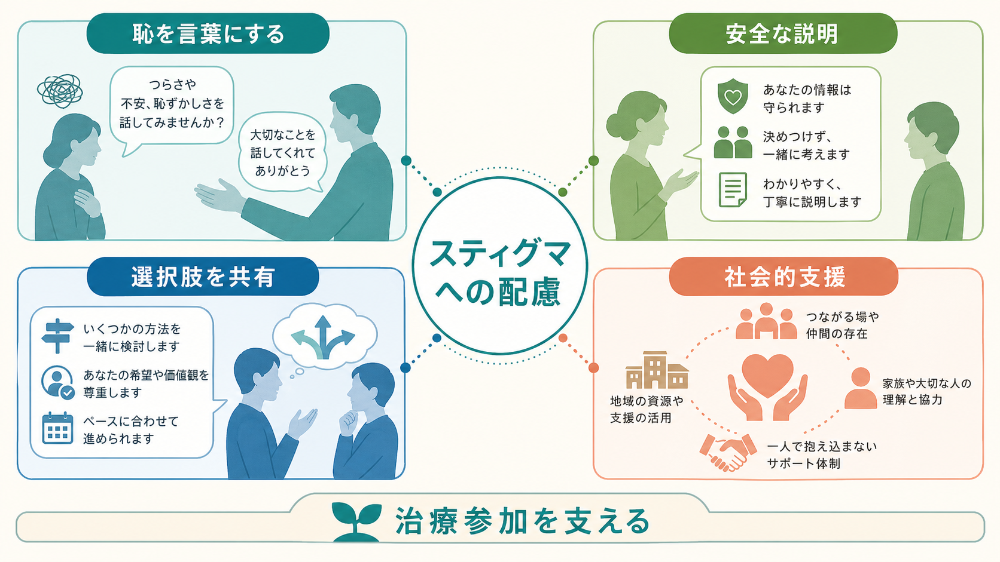
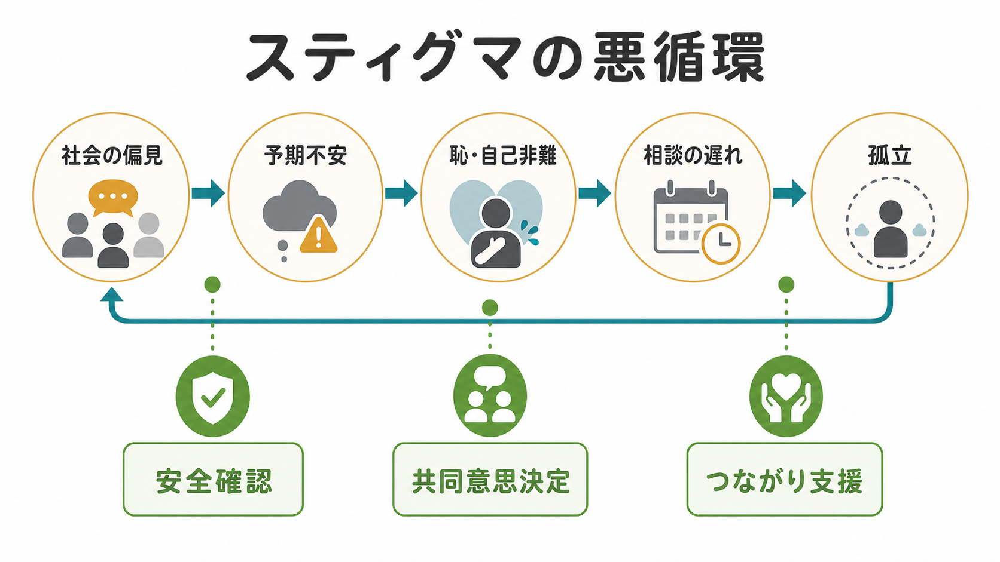
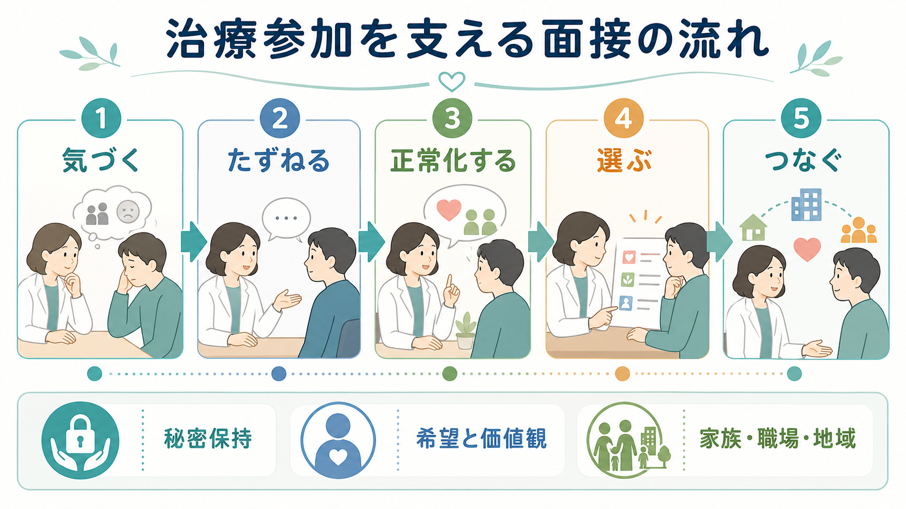

# 精神科におけるスティグマをどう扱うか

## 要点

- 精神科におけるスティグマは、社会の偏見だけでなく、本人の恥、受診へのためらい、家族・職場への開示不安、医療者側の無自覚な態度として現れる。
- 臨床では「偏見は間違っている」と説得する前に、患者が何を失うことを恐れているのかを具体化する。
- 守秘、説明、選択肢、共同意思決定、回復志向の言葉づかいを組み合わせると、治療参加を支えやすい。
- 反スティグマ介入では、知識提供だけでなく、当事者経験との安全な接触、回復可能性の強調、自己スティグマへの認知的・物語的アプローチが重要になる。

## この記事で答える問い

- 患者が「精神科に行くのが恥ずかしい」「病名を知られたくない」と言うとき、何を評価するべきか。
- スティグマは、受診の遅れ、治療中断、自己評価の低下にどうつながるのか。
- 精神科面接では、どのような言葉づかい、説明、治療計画が患者の参加を支えるのか。
- 家族、職場、学校、地域支援との関係で、開示と秘密保持をどう扱うのか。

## まず結論

精神科におけるスティグマへの対応は、単なる啓発ではない。患者が感じている恥や偏見への不安を「治療抵抗」や「病識の欠如」とだけ見なすと、相談の遅れ、情報の隠れ、治療中断を強めることがある。まず必要なのは、本人が何を恐れているのかを、診断名ではなく生活文脈の言葉で聞くことである。

実践上は、1. 守秘の範囲を明確にする、2. 本人の価値観に沿って治療目標を置く、3. 診断名や薬物療法を「人を決めつけるラベル」としてではなく、支援を選ぶための作業仮説として説明する、4. 必要な開示を本人と一緒に最小限に設計する、という順序が使いやすい。これは [[治療関係とは何か]]、[[守秘義務とは何か]]、[[共同意思決定とは何か]]、[[コンコーダンスとは何か]] と直結する。

## 背景

精神疾患に関するスティグマは、精神疾患をもつ人を危険、弱い、信頼できない、回復できないとみなす固定観念から生じる。Corrigan と Watson は、スティグマを「ステレオタイプ」「偏見」「差別」という流れで整理し、公的スティグマと自己スティグマを区別した[1]。この区別は臨床で重要である。患者が実際に差別を受けていなくても、「知られたら拒絶される」「自分はもう普通に戻れない」という予期だけで、受診や相談を避けることがある。

WHO の World Mental Health Report は、精神保健を変革するうえで、スティグマと差別の低減、人権、地域に根ざしたケアを中心課題として位置づけている[2]。Lancet Commission も、スティグマと差別は精神的苦痛そのものに加えて、教育、雇用、住居、医療アクセス、人間関係にまたがる不利益を作ると整理している[3]。したがって精神科診療でスティグマを扱うことは、診察室内の共感にとどまらず、患者が社会生活に戻る経路を守る作業でもある。

## 基本概念

### 公的スティグマ

公的スティグマは、社会や周囲の人が精神疾患をもつ人に向ける否定的な信念、感情、行動である。たとえば「精神科に通っている人は危ない」「仕事を任せられない」といった見方は、本人の能力や実際の状態よりも診断名を優先する。臨床では、患者が家族、職場、学校、友人関係でどのような反応を予想しているかを確認する。

### 自己スティグマ

自己スティグマは、社会の偏見を本人が自分に向けて内面化する過程である。「こんな病気になった自分はだめだ」「人に迷惑をかけるだけだ」といった考えが強くなると、援助要請、服薬、心理療法、社会参加のいずれにも影響する。ここでは [[疾病受容とは何か]] と重なるが、受容を急がせるより、まず本人の自己評価がどの言葉で傷ついているのかを聞く。

### 予期スティグマと開示不安

予期スティグマは、実際に差別される前から「差別されるだろう」と予測することを指す。精神科では、診断名、通院歴、薬、休職、障害福祉サービス、診断書が開示不安の焦点になりやすい。ここでは [[守秘義務とは何か]] の説明が治療的意味をもつ。誰に、何を、どの目的で、どの範囲まで伝えるのかを明確にすると、患者は安心して情報を出しやすくなる。

### 医療者側のスティグマ

スティグマは患者の外側だけにあるのではない。医療者が「どうせ続かない」「人格の問題だ」「家族が管理すべきだ」と早く結論づけると、説明、選択肢、敬意が減る。医療者向け反スティグマプログラムでは、回復可能性を強調し、複数の形の社会的接触を含めることが有効な要素として示されている[8]。これは [[支持的面接とは何か]] や [[共感的理解とは何か]] の基盤でもある。

## 仕組み

### 1. スティグマは援助要請を遅らせる

スティグマは、受診前の段階で「相談したら終わりだ」「記録に残ると不利になる」という予期を強める。Clement らの系統的レビューでは、メンタルヘルス関連スティグマが援助要請の障壁になり、特に恥、開示への懸念、自分で解決すべきという信念が重要な要因として整理されている[4]。初診では、症状の重症度だけでなく、「ここに来るまで何が一番ためらいになったか」を尋ねる価値がある。

### 2. ラベル化は説明にも傷つきにもなる

診断名は治療選択、予後説明、制度利用、チーム共有に役立つ。一方で、患者には「自分が診断名そのものになってしまう」感覚を生むことがある。したがって診断を伝えるときは、[[精神科診断は何のためにあるのか]] と同じく、診断を人格評価ではなく、現時点で支援を組み立てるための言葉として位置づける。診断名を急いで納得させるより、「この名前を聞いてどんな心配が浮かびましたか」と確認する。

### 3. 自己スティグマは行動の幅を狭める

自己スティグマが強いと、患者は「相談する資格がない」「回復しても信用されない」と感じ、選択肢を自分で狭める。自己スティグマ介入の一つである Narrative Enhancement and Cognitive Therapy は、心理教育、認知再構成、物語の再構成を組み合わせ、重い精神疾患をもつ人の自己スティグマと自尊感情に改善を示したRCTがある[7]。個別診療でも、患者の生活史を「失敗の連続」ではなく、危機をくぐり抜けてきた物語として扱う姿勢は応用できる。

### 4. スティグマは治療参加を「服従」に見せる

精神科治療では、薬、診断書、休職、家族面接、福祉制度など、本人のアイデンティティや社会的立場に触れる話題が多い。ここで医療者が一方的に「必要だから」と進めると、患者は治療参加を自己決定の喪失として体験しやすい。[[共同意思決定とは何か]]、[[コンコーダンスとは何か]]、[[アドヒアランスとは何か]] の観点から、治療目標を「症状を消す」だけでなく、「知られたくない範囲を守りながら生活を立て直す」といった本人の価値に接続する。

## 図解

## 臨床・研究との接続

### 面接での聞き方

スティグマを扱う質問は、患者を試す質問ではなく、相談しやすさを作る質問である。たとえば次のように聞く。

- 「精神科に相談することについて、心配だったことはありますか。」
- 「病名や通院について、誰に知られるのが一番困りますか。」
- 「ご家族や職場に伝える必要があるとしたら、何は伝えてよくて、何は避けたいですか。」
- 「この説明を聞いて、ご自身を責める気持ちは強くなりましたか、それとも少し整理されましたか。」

このような質問は、[[ラポールはどのように形成されるのか]] や [[開かれた質問と閉じた質問はどう使い分けるのか]] と同じく、情報収集であると同時に安全の確認である。

### 説明のしかた

説明では、病名を「本質」ではなく「現在の困りごとを整理する言葉」として扱う。たとえば「うつ病です」で止めるのではなく、「今の眠れなさ、意欲低下、自責感をまとめて理解し、使える支援を選ぶために、この診断名を使います」と補う。これは [[心理教育とは何か]] の基本である。心理教育は知識の伝達だけでなく、恥を減らし、患者が説明の主導権を取り戻す支援でもある。

### 開示と秘密保持

開示は「するか、しないか」の二択ではない。相手、目的、内容、時期、媒体を分けて設計できる。職場には診断名ではなく機能制限と配慮事項を伝える、家族には本人の同意を得て支援に必要な範囲だけ共有する、学校には安全と学業継続に必要な情報に絞る、といった調整が可能である。例外的にリスク対応が必要な場合でも、可能な限り本人に理由と範囲を説明する。ここでは [[家族への説明で何に注意するべきか]]、[[クライシスプランとは何か]]、[[自殺リスク評価では何を聞くべきか]] と接続する。

### 反スティグマ介入のエビデンス

反スティグマ介入の研究では、単なる知識提供よりも、当事者経験との接触を含む介入が短期的な態度改善に有効であることが繰り返し示されている[5]。一方で、長期効果や行動変容への効果は研究によって限界があり、対象集団や文化をまたいだ一般化には注意が必要である[5][6]。臨床現場では、「一度説明すれば偏見は消える」と考えるより、診療のたびに言葉、制度利用、家族調整、復職支援の中で反復して扱う。

### 回復志向との関係

スティグマ対応の中心には、[[精神医学における回復とは何か]] がある。回復は、症状が完全に消えることだけではなく、本人が意味ある役割、関係、希望、選択を取り戻す過程である。医療者が「病気だから無理」と先回りして可能性を狭めると、患者の自己スティグマを強めることがある。逆に、リスクを過小評価せずに選択肢を残す説明は、現実的な希望を支える。

## よくある誤解

### 「気にしないで」と言えばよい

「気にしないで」は善意でも、患者には「気にしている自分が弱い」と聞こえることがある。代わりに、「そう感じるだけの理由があったのかもしれません」「どの場面が一番心配ですか」と、具体的な恐れを聞く。

### スティグマは社会問題なので診療では扱えない

社会全体の偏見を一人の臨床家がすぐに変えることはできない。しかし、診療室内の言葉づかい、守秘の説明、診断名の伝え方、家族や職場への情報共有の設計は、患者の体験を大きく左右する。小さな実践は治療参加に直結する。

### 病名を伝えない方が傷つけない

病名を避けることが常に配慮になるわけではない。説明を曖昧にすると、患者が自分でインターネット情報や偏見的なイメージを補ってしまうこともある。重要なのは、病名を伝えるかどうかだけではなく、何のためにその言葉を使い、どのような支援につなげるかである。

### 恥が強い患者は治療意欲が低い

恥が強いことは、治療意欲の低さではなく、治療を受けたい気持ちと知られたくない気持ちの葛藤である場合が多い。葛藤を明示できると、[[アドヒアランスとは何か]] で扱う非継続の背景も見えやすくなる。

## 関連ノート

### 既存ノート

- [[治療関係とは何か]]
- [[ラポールはどのように形成されるのか]]
- [[守秘義務とは何か]]
- [[共同意思決定とは何か]]
- [[コンコーダンスとは何か]]
- [[アドヒアランスとは何か]]
- [[心理教育とは何か]]
- [[疾病受容とは何か]]
- [[精神医学における回復とは何か]]
- [[家族への説明で何に注意するべきか]]

### 今後の作成候補

- 精神疾患における自己スティグマとは何か
- 精神科診療における開示支援とは何か
- 精神科医療者のスティグマをどう減らすか
- 職場復帰支援で診断名をどう扱うか

### MOC更新候補

- `content/00_MOC/` 配下の精神医学・面接・臨床実践関連 MOC に、本記事へのリンクを追加する候補。
- 並列ジョブとの衝突を避けるため、本記事作成時点では MOC ファイル本体は更新しない。

## 理解チェック

1. 患者が「精神科に通っていることを誰にも知られたくない」と言うとき、最初に確認すべき生活上の具体的懸念は何か。
2. 公的スティグマ、予期スティグマ、自己スティグマはどのように違うか。
3. 診断名を伝えるとき、人格評価として受け取られないためにどのような補足説明ができるか。
4. 家族や職場への情報共有を、本人の治療参加を損なわない形にするには何を分けて考えるべきか。
5. 反スティグマ介入で、知識提供だけではなく社会的接触や回復志向が重視される理由は何か。

## 未解決問題

- 反スティグマ介入の短期的な態度変化が、実際の差別行動の減少や長期的な治療参加にどこまで結びつくかは、研究デザイン上の限界が残る[5][6]。
- 文化、ジェンダー、職場規範、家族規範によって、恥や開示不安の意味は大きく変わる。日本の精神科外来で使いやすい、開示支援と自己スティグマ支援の標準化は今後の課題である。
- 医療者自身のスティグマを減らす研修は重要だが、個人の態度変容だけでは制度的・構造的な差別を十分に変えられない。診療報酬、地域資源、雇用慣行、学校・職場の合理的配慮との接続が必要である。

## 参考文献

[1] Corrigan, P. W., & Watson, A. C. (2002). Understanding the impact of stigma on people with mental illness. *World Psychiatry*, 1(1), 16-20. https://pmc.ncbi.nlm.nih.gov/articles/PMC1489832/

[2] World Health Organization. (2022). *World mental health report: Transforming mental health for all*. WHO. https://www.who.int/teams/mental-health-and-substance-use/world-mental-health-report

[3] Thornicroft, G., Sunkel, C., Alikhon Aliev, A., et al. (2022). The Lancet Commission on ending stigma and discrimination in mental health. *The Lancet*, 400(10361), 1438-1480. https://doi.org/10.1016/S0140-6736(22)01470-2

[4] Clement, S., Schauman, O., Graham, T., et al. (2015). What is the impact of mental health-related stigma on help-seeking? A systematic review of quantitative and qualitative studies. *Psychological Medicine*, 45(1), 11-27. https://doi.org/10.1017/S0033291714000129

[5] Thornicroft, G., Mehta, N., Clement, S., et al. (2016). Evidence for effective interventions to reduce mental-health-related stigma and discrimination. *The Lancet*, 387(10023), 1123-1132. https://doi.org/10.1016/S0140-6736(15)00298-6

[6] Mehta, N., Clement, S., Marcus, E., et al. (2015). Evidence for effective interventions to reduce mental health-related stigma and discrimination in the medium and long term: systematic review. *The British Journal of Psychiatry*, 207(5), 377-384. https://doi.org/10.1192/bjp.bp.114.151944

[7] Hansson, L., Lexen, A., & Holmen, J. (2017). The effectiveness of narrative enhancement and cognitive therapy: a randomized controlled study of a self-stigma intervention. *Social Psychiatry and Psychiatric Epidemiology*, 52(11), 1415-1423. https://doi.org/10.1007/s00127-017-1385-x

[8] Knaak, S., Modgill, G., & Patten, S. B. (2014). Key ingredients of anti-stigma programs for health care providers: a data synthesis of evaluative studies. *The Canadian Journal of Psychiatry*, 59(10 Suppl 1), S19-S26. https://doi.org/10.1177/070674371405901S06
