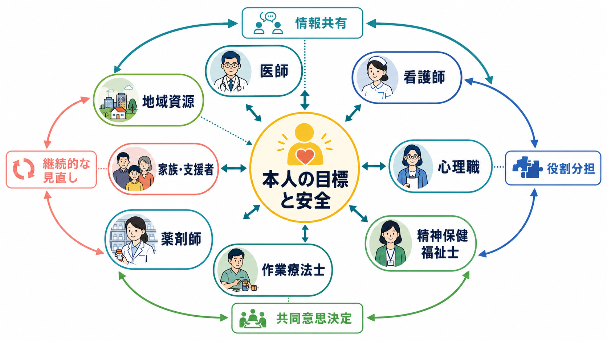
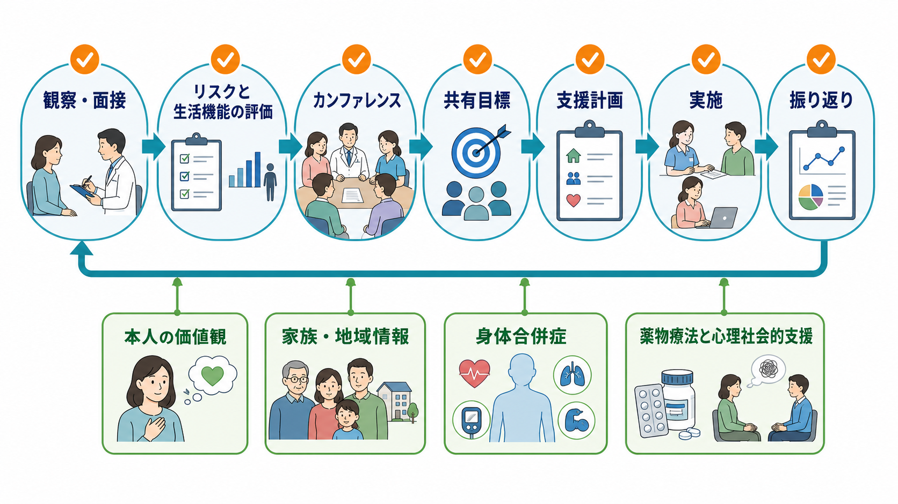
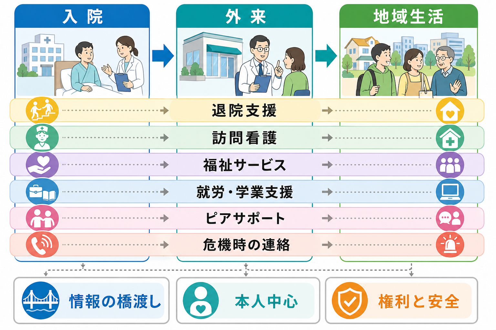

# 精神科におけるチーム医療とは何か

## 要点

- 精神科のチーム医療とは、医師だけで完結しにくい症状、生活機能、リスク、家族関係、制度利用、地域生活を、多職種が共通目標に沿って支える仕組みである。
- 中心に置くべきなのは「職種の都合」ではなく、本人の目標、安全、権利、生活の連続性である。
- チーム医療は、単に多くの職種が関わることではない。情報共有、役割分担、意思決定、実施、振り返りが循環して初めて機能する。
- 精神科では、[[共同意思決定とは何か|共同意思決定]]、[[治療関係とは何か|治療関係]]、[[精神科で生活機能をどう評価するか|生活機能評価]]、[[守秘義務とは何か|守秘義務]]がチーム医療の実践と直結する。
- 医療・福祉・住まい・就労・教育・地域の助け合いを含む支援体制は、日本の「精神障害にも対応した地域包括ケアシステム」とも重なる[4]。

## この記事で答える問い

1. 精神科のチーム医療は、通常の分業や紹介と何が違うのか。
2. どの職種が、どのような情報を持ち寄るのか。
3. チーム医療は、患者本人の意思決定や権利とどう両立するのか。
4. うまく機能しないチーム医療では、何が起きやすいのか。

## まず結論

精神科におけるチーム医療とは、多職種が「同じ患者を別々に見る」ことではなく、本人の目標と安全を中心に、評価、支援計画、実施、見直しを共有する実践である。厚生労働省のチーム医療に関する報告書は、医療スタッフが専門性を前提に目的と情報を共有し、業務を分担しつつ互いに連携・補完することを重視している[1]。WHO も、異なる専門背景を持つ保健医療職が患者、家族、介護者、地域と協働することを、ケアの質を高める実践として位置づけている[2]。

精神科でこれが重要になるのは、精神症状だけを見ても支援方針が決まらないからである。抑うつ、幻覚妄想、不眠、衝動性、認知機能、身体合併症、家族の疲弊、経済問題、住まい、就労、服薬継続、危機時の連絡先は、互いに影響し合う。したがって、[[生物心理社会モデルとは何か|生物心理社会モデル]]を実際の支援に落とし込む場が、チーム医療だと考えるとよい。

## 背景

精神科医療は、入院中心の管理から、地域生活、権利擁護、リカバリー、本人参加へと重点を移してきた。WHO の世界精神保健報告は、精神保健医療の改革として、地域に根ざしたケア、プライマリケアとの統合、人権、スティグマ低減、当事者の参加を強調している[5]。これは、病院内の医療チームだけでなく、地域の保健・福祉・住まい・就労・教育を含む支援ネットワークを必要とする。

日本でも、精神障害の有無や程度にかかわらず、誰もが地域の一員として安心して自分らしく暮らせるよう、医療、障害福祉・介護、住まい、社会参加、地域の助け合い、教育を包括的に確保する方向が示されている[4]。つまり、精神科のチーム医療は、病棟カンファレンスだけではなく、退院支援、外来、訪問看護、相談支援、家族支援、ピアサポート、地域資源との接続を含む。

## 基本概念

### 多職種とチームは同じではない

多職種が関わっていても、情報がばらばらで、目標が食い違い、本人に同じ説明を何度も求めるなら、それは「多職種が存在する状態」にすぎない。チーム医療では、少なくとも次の四つが必要になる。

| 要素 | 内容 | 精神科での例 |
|---|---|---|
| 共通目標 | 何を優先するかを共有する | 自殺リスク低減、退院準備、睡眠改善、再発予防、就労継続 |
| 情報共有 | 必要な情報を、目的を明確にして共有する | 症状、生活機能、服薬状況、家族状況、危機サイン |
| 役割分担 | 誰が何を担うかを明確にする | 薬物療法、心理教育、家族面接、制度調整、訪問支援 |
| 見直し | 状況変化に応じて計画を更新する | 退院前後、薬剤変更後、危機後、生活環境の変化後 |

### 主な職種と情報

医師は診断、薬物療法、身体疾患、法制度、リスク判断に関わる。看護師は日々の観察、睡眠、食事、セルフケア、危機サイン、関係性の変化を捉える。心理職は心理検査、心理療法、ケースフォーミュレーション、感情調整、トラウマや対人関係の理解を支える。精神保健福祉士は制度利用、経済、住まい、家族調整、退院支援、地域資源との接続を担う。作業療法士は生活リズム、活動、役割、作業遂行、社会参加を評価する。薬剤師は薬物相互作用、副作用、服薬方法、アドヒアランスを支える。これらは固定的な縄張りではなく、本人の課題に応じて重なり合う。

## 仕組み

チーム医療は、情報共有から始まるが、情報共有だけでは終わらない。観察と面接で得た情報を、リスク、生活機能、本人の価値観、家族・地域情報、身体合併症、薬物療法と心理社会的支援の観点から整理し、カンファレンスで共有目標に変換する。そのうえで支援計画を立て、実施し、振り返る。

この循環で重要なのは、チームの都合だけで計画を作らないことである。本人が何を望み、何を恐れ、どの負担なら受け入れられるかを確認しなければ、計画は形式的になる。[[インフォームドコンセントは精神科でどう行うのか|インフォームドコンセント]]や[[共同意思決定とは何か|共同意思決定]]は、医師と患者だけの場面に限定されない。家族、支援者、訪問看護、福祉サービスが関与するほど、本人の意思を中心に置く設計が必要になる[8]。

一方で、精神科では安全確保も避けられない。希死念慮、他害リスク、虐待、セルフネグレクト、急性精神病症状、重い身体合併症がある場合、本人の希望だけで方針を決められないことがある。その場合でも、説明、選択肢、制限の理由、見直し時期、権利の説明を明確にし、本人の参加可能性をできるだけ残すことが重要である。

## 図解

3枚目の図は、チーム医療を入院、外来、地域生活の連続性として示している。入院中の安定化、外来での継続治療、地域での生活支援は、別々の段階ではなく、情報の橋渡しによってつながる。

たとえば退院支援では、病棟での観察、薬剤調整、心理教育、家族面接、経済・住居支援、訪問看護、外来予約、危機時の連絡先をまとめて設計する必要がある。ここで情報が切れると、退院後に「誰に相談すればよいかわからない」「服薬や副作用の相談が遅れる」「家族だけが抱え込む」といった問題が起きやすい。

## 臨床・研究との接続

精神科チーム医療は、疾患別治療と生活支援をつなぐ実装の場である。NICE の成人の精神病・統合失調症ガイドラインは、多職種、当事者、介護者、方法論者を含むチームで作成され、本人と介護者のケア経験を重視している[3]。これは、重い精神疾患の支援が、薬物療法だけでなく心理社会的介入、家族支援、身体健康、地域生活を含むことを示している。

研究上は、チーム医療を単独の「薬」のように評価するのは難しい。共同ケアの Cochrane レビューでは、うつ病・不安症に対する協働ケアが通常ケアより症状改善に関連することが示された一方、介入内容、対象、制度背景は多様である[6]。また、重い精神疾患の多職種チームレビューに関する系統的レビューは、実践のばらつきと標準化された指針の不足を指摘している[7]。したがって、チーム医療の効果を見るときは、症状、再入院、生活機能、満足度、本人参加、継続性、権利保障を分けて評価する必要がある。

臨床では、[[心理教育とは何か|心理教育]]、[[精神医学における回復とは何か|リカバリー]]、[[家族面接では何を評価するべきか|家族面接]]、[[身体合併症は精神科診療でなぜ重要なのか|身体合併症の評価]]と接続する。チーム医療は、これらを一つの支援計画に束ねるための実践形式である。

## よくある誤解

### 誤解1: チーム医療は、医師の仕事を他職種に移すことである

チーム医療は単なる業務移管ではない。各職種の専門性を生かし、互いに補完しながら、本人にとって一貫した支援を作ることである[1][2]。医師の責任が消えるわけでも、他職種が補助者に固定されるわけでもない。

### 誤解2: カンファレンスを開けばチーム医療になる

カンファレンスは重要だが、それだけでは不十分である。共有された目標、決定事項、担当者、期限、本人への説明、次回の見直しがなければ、会議は情報交換で止まる。

### 誤解3: 本人の同意なしに、何でもチームで共有してよい

診療上必要な情報共有はあるが、[[守秘義務とは何か|守秘義務]]と目的限定は常に問題になる。本人に「何を、誰と、何のために共有するか」を説明し、必要最小限の共有を意識することが、信頼を守る。

### 誤解4: チーム医療は専門家だけで完結する

精神科では、家族、支援者、ピアサポーター、学校、職場、相談支援、行政、住まいの支援が重要になることがある。WHO や厚生労働省の地域精神保健の方向性も、医療機関内だけでなく地域に根ざした支援を重視している[4][5]。

## 関連ノート

- [[精神医学とは何か]]
- [[生物心理社会モデルとは何か]]
- [[精神科面接とは何か]]
- [[治療関係とは何か]]
- [[共同意思決定とは何か]]
- [[インフォームドコンセントは精神科でどう行うのか]]
- [[精神科で生活機能をどう評価するか]]
- [[心理教育とは何か]]
- [[精神医学における回復とは何か]]
- [[家族面接では何を評価するべきか]]
- [[守秘義務とは何か]]
- [[身体合併症は精神科診療でなぜ重要なのか]]

## 理解チェック

1. 「多職種が関わっている状態」と「チーム医療」は何が違うか。
2. 精神科でチーム医療が必要になる理由を、症状、生活機能、地域資源の観点から説明できるか。
3. 情報共有と守秘義務を両立させるには、何を明確にする必要があるか。
4. 退院支援で、入院・外来・地域生活の情報を橋渡しするために何を確認するべきか。
5. チーム医療を評価するとき、症状改善以外にどのようなアウトカムを見るべきか。

## MOC更新候補

- `content/00_MOC/MOC｜精神医学.md` の「総論・診断・面接」または「地域精神医療」周辺に追加する候補。
- 並列生成ジョブとの競合を避けるため、本記事では MOC 本体は更新しない。

## 未解決問題

- 精神科チーム医療の質を、診療時間、再入院率、本人参加、生活機能、権利保障のどの組み合わせで評価するのが妥当か。
- 多職種カンファレンスの記録と共有を、守秘義務と本人中心性を損なわずに標準化する方法。
- ピアサポーター、家族、地域支援者をチームに含める場合の役割、責任、情報共有範囲の整理。
- 急性期や非自発的入院の場面で、本人の参加と安全確保をどう両立させるか。

## 参考文献

[1] 厚生労働省. (2010). 「チーム医療の推進について」取りまとめ（「チーム医療の推進に関する検討会」報告書）. https://www.mhlw.go.jp/shingi/2010/03/s0319-9.html

[2] World Health Organization. (2010). *Framework for action on interprofessional education and collaborative practice*. https://www.who.int/publications/i/item/framework-for-action-on-interprofessional-education-collaborative-practice

[3] National Collaborating Centre for Mental Health. (2014). *Psychosis and schizophrenia in adults: treatment and management* (NICE Clinical Guideline 178). https://www.ncbi.nlm.nih.gov/books/NBK248060/

[4] 厚生労働省. 精神障害にも対応した地域包括ケアシステムの構築について. https://www.mhlw.go.jp/stf/seisakunitsuite/bunya/chiikihoukatsu.html

[5] World Health Organization. (2022). *World mental health report: transforming mental health for all*. https://www.who.int/teams/mental-health-and-substance-use/world-mental-health-report

[6] Archer, J., Bower, P., Gilbody, S., Lovell, K., Richards, D., Gask, L., Dickens, C., & Coventry, P. (2012). Collaborative care for depression and anxiety problems. *Cochrane Database of Systematic Reviews*, CD006525. https://www.cochrane.org/CD006525/DEPRESSN_collaborative-care-for-people-with-depression-and-anxiety

[7] Woody, C. A., Baxter, A. J., Harris, M. G., Siskind, D. J., & Whiteford, H. A. (2018). Identifying characteristics and practices of multidisciplinary team reviews for patients with severe mental illness: a systematic review. *Australasian Psychiatry*, 26(3), 267-275. https://doi.org/10.1177/1039856217751783

[8] Thomas, E. C., Ben-David, S., Treichler, E., Roth, S., Dixon, L. B., Salzer, M., & Zisman-Ilani, Y. (2021). A systematic review of shared decision-making interventions for service users with serious mental illnesses: state of the science and future directions. *Psychiatric Services*, 72(11), 1288-1300. https://doi.org/10.1176/appi.ps.202000429
