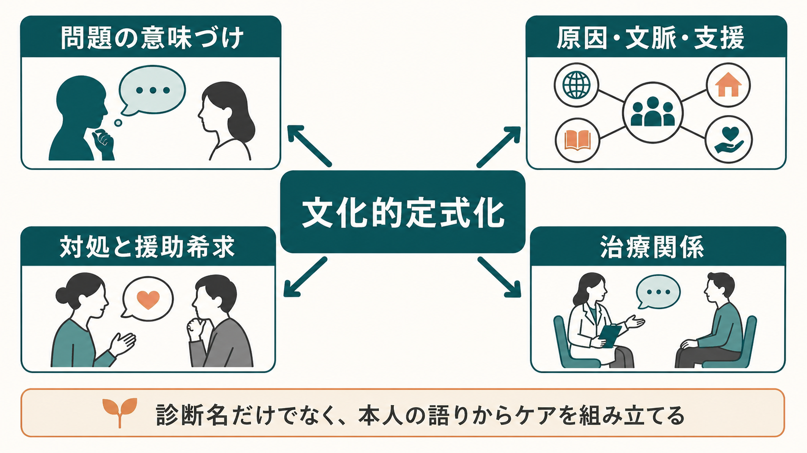
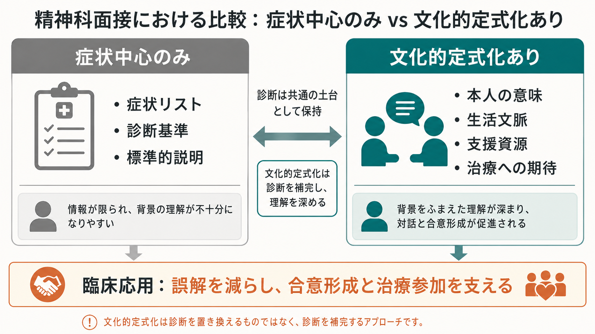

# 精神科における文化的定式化とは何か

## 要点

- 文化的定式化とは、患者が自分の問題をどう名づけ、どう原因づけ、どのような支援や治療を期待しているかを、診断と治療計画に組み込むための枠組みである。
- DSM-5/DSM-5-TR では、16項目の Cultural Formulation Interview（CFI）が提示され、問題の意味、原因・文脈・支援、対処と援助希求、患者-臨床家関係を半構造化面接で扱う[1]。
- 文化は国籍や民族だけではなく、言語、宗教、ジェンダー、階層、移住経験、家族規範、職場・地域、医療制度への経験などを含む。
- CFI は診断を置き換える道具ではない。[[DSMとICDは何が違うのか|DSM/ICD]] や [[操作的診断とは何か|操作的診断]] の枠組みに、本人の意味づけと生活文脈を接続する補助線である。
- 臨床上は、誤診・過小評価・過剰病理化を避け、[[治療関係とは何か|治療関係]]、[[共同意思決定とは何か|共同意思決定]]、[[アドヒアランスとは何か|治療参加]]を支える。

## この記事で答える問い

1. 精神科における文化的定式化は、何を定式化するのか。
2. DSM-5/DSM-5-TR の CFI は、どのような質問領域で構成されるのか。
3. 通常の [[精神科面接とは何か|精神科面接]] や [[生物心理社会モデルとは何か|生物心理社会モデル]] と、どのように接続するのか。
4. 臨床で使うときに、どのような誤解と限界に注意すべきか。

## まず結論

文化的定式化は、「この患者はどの文化集団に属するか」を分類する作業ではない。むしろ、患者本人と周囲の人々が、問題をどのように経験し、説明し、対処し、どのような援助を求めているかを、臨床家が診断・リスク評価・治療計画に翻訳する作業である[1][2]。

その中心にあるのは、症状リストだけでは見えにくい「意味づけ」である。たとえば同じ不眠、幻聴、不安、身体症状、怒り、引きこもりでも、本人にとっては喪失、恥、宗教的体験、家族内役割の破綻、差別経験、移住後の孤立、仕事上の失敗、身体疾患への恐れとして語られることがある。これらは診断基準の外側にある余談ではなく、症状の表現、重症度の評価、[[鑑別診断とは何か|鑑別診断]]、援助希求、治療継続に直接関わる。

したがって文化的定式化は、標準診断を弱めるものではなく、標準診断を臨床現場で使える形に補強するものである。APA の CFI 文書も、CFI は臨床理解と意思決定を高めるための有用な道具であり、単独で診断を行うためのものではないと位置づけている[1]。

## 背景

精神科診断は、患者の訴え、行動観察、経過、生活機能、併存症、リスク、身体疾患、物質使用、家族歴、発達歴などを統合して行われる。しかし、精神症状は文化的に中立な形で現れるわけではない。何を「病気」と呼ぶか、どの程度なら受診するか、家族にどう説明するか、薬物療法・心理療法・宗教的援助・民間療法をどう位置づけるかは、社会的・文化的文脈の影響を受ける。

この問題意識は、医療人類学における「説明モデル」の議論と深く関わる。説明モデルとは、患者・家族・治療者が、病いの原因、経過、重症度、望ましい治療、回復の見通しをどう理解しているかを指す考え方である。精神科では、本人の説明モデルと臨床家の説明モデルがずれると、診断説明が伝わらず、治療同盟や受療継続が崩れやすい[7]。

DSM-IV では Outline for Cultural Formulation（OCF）が導入され、DSM-5 ではそれを臨床で尋ねやすくするために CFI が整備された。CFI は16項目の中核面接、情報提供者版、補足モジュールからなり、どの患者にも使える半構造化面接として設計された[1][2]。国際フィールド試験では、CFI は実施可能性、受容可能性、臨床的有用性の面で概ね肯定的に評価され、DSM-5 に採用された[3]。

## 基本概念

### 文化は「民族属性」ではなく「意味と実践」の束である

文化的定式化でいう文化は、国籍、民族、宗教だけを意味しない。患者が属する、または距離を取っている集団、言語、家族規範、ジェンダー、性的指向、年齢、職業、階層、教育、移住経験、差別経験、地域、医療制度への信頼や不信を含む。DSM-5-TR の CFI でも、背景やアイデンティティの例として、所属コミュニティ、言語、出身地、人種・民族的背景、ジェンダー、性的指向、信仰や宗教が挙げられている[1]。

重要なのは、臨床家が「この文化ではこう考えるはずだ」と先回りしないことである。文化的定式化は、文化集団についての一般知識を患者に当てはめる作業ではなく、本人の語りから、その人にとって実際に働いている意味、制約、支援資源を見つける作業である。

### 定式化とは、情報を治療に使える仮説へまとめること

定式化は、単なる情報収集ではない。情報を「何が問題を生み、何が維持し、何が回復を助けるか」という臨床仮説にまとめる作業である。文化的定式化では、次のような問いを統合する。

| 領域 | 典型的な問い | 臨床上の意味 |
|---|---|---|
| 問題の文化的定義 | 本人は何が一番困っていると言うか | 主訴、重症度、優先順位の把握 |
| 原因・文脈・支援 | 原因をどう考え、誰が支えているか | 鑑別診断、保護因子、維持因子の把握 |
| 対処と援助希求 | これまで何を試し、何が役立ったか | 治療選択、心理教育、受療継続 |
| 現在の援助期待 | どのような助けを望むか | 合意形成、紹介、支援資源調整 |
| 患者-臨床家関係 | 誤解や不信の懸念はあるか | [[ラポールはどのように形成されるのか|ラポール]]、説明、境界設定 |

## 仕組み

CFI の基本プロセスは、症状を否定せず、本人の語りを診断・治療計画へ接続することである。最初に「何があなたをここに連れてきたのか」「その問題をどのように説明するか」を尋ね、次に原因、支援、ストレス、背景やアイデンティティ、対処、過去の援助、現在の希望、患者-臨床家関係へ進む[1]。

この流れには、少なくとも三つの機能がある。

第一に、患者の言葉を診断面接の入口にする。症状名や診断名を先に押しつけると、患者が本当に困っていること、恐れていること、家族や地域にどう説明しているかが見えにくくなる。CFI は、患者自身の言葉を使って以後の質問を進めるため、問題の焦点を共有しやすい。

第二に、生活文脈と支援資源を可視化する。CFI は、家族、友人、地域、宗教・スピリチュアリティ、仕事、学校、経済的制約、差別、言語障壁などを、単なる背景情報ではなく、症状を悪化・軽減しうる要因として扱う[1]。これは [[生物心理社会モデルとは何か|生物心理社会モデル]] を面接上で具体化する手順でもある。

第三に、治療関係のずれを面接の中で扱う。患者が医療者に不信感を持っている場合、過去の差別経験や誤解、通訳を介したコミュニケーション、薬への期待・不安、家族参加への考え方が治療参加に影響する。CFI は、そうした懸念を「問題行動」としてではなく、話し合える臨床情報として扱う。

## 図解

文化的定式化を入れると、面接は「症状中心のみ」から離れるわけではない。症状中心の情報を維持したまま、本人の意味づけ、生活文脈、支援資源、治療への期待を加える。

臨床では、次のように使うと整理しやすい。

| 面接で得た情報 | 文化的定式化での読み替え | 治療計画への接続 |
|---|---|---|
| 「薬は怖い」 | 過去の副作用経験、依存への不安、家族内の薬物観、医療不信かもしれない | [[心理教育とは何か|心理教育]]、選択肢提示、副作用説明、共同意思決定 |
| 「家族には言えない」 | 恥、役割期待、家族内権力、スティグマ、暴力リスクが関わるかもしれない | 守秘義務説明、安全確認、家族面接の適否判断 |
| 「これは病気ではない」 | 宗教的・身体的・対人関係的な説明モデルがあるかもしれない | 診断名を急がず、困りごとと支援目標から合意形成 |
| 「仕事を休めない」 | 経済的制約、在留資格、職場文化、ケア責任が関わるかもしれない | 受診頻度調整、社会資源、診断書、支援者連携 |

## 臨床・研究との接続

### 診断への接続

文化的定式化は、診断の前に置く「配慮」ではなく、診断そのものの質に関わる。たとえば、幻聴様体験が宗教的実践や喪の儀礼と結びつく場合、病的体験か、文化的に共有された経験か、両者が重なっているかを慎重に見る必要がある。逆に、文化的背景を理由に苦痛や機能低下を軽視すると、必要な治療につながらない。

この点で、文化的定式化は [[鑑別診断とは何か|鑑別診断]] と相性がよい。文化的に意味づけられた体験であっても、持続性、苦痛、機能障害、危険性、現実検討、併存症、物質使用、身体疾患を評価する必要がある。文化的定式化は、診断を相対化して曖昧にするのではなく、何を病理として扱い、何を生活文脈として扱うかを精密にする。

### 治療計画への接続

国際フィールド試験では、患者と臨床家の双方が CFI の有用性を評価し、実施可能性と受容可能性も概ね支持された[3]。その後のレビューでも、CFI は患者が理解されたと感じること、情報収集、診断・治療計画への活用に関して肯定的な知見が蓄積している一方、日常臨床でどう定式化に落とし込むか、どのような訓練が必要かは今後の課題とされる[4][5]。

実装上の障壁としては、時間不足、質問が硬く聞こえること、臨床家が文化について尋ねることに不慣れなこと、患者が「自分が異質な存在として扱われている」と感じる可能性、組織的な訓練不足が挙げられる[6]。したがって、CFI は長い質問票として機械的に読むよりも、初診・再診・家族面接・ケースカンファレンスの中で、必要な領域を重点的に使うのが現実的である。

### 家族・支援者との接続

患者本人の語りだけでは不十分な場合、家族や支援者の説明モデルも重要になる。APA は CFI の情報提供者版も用意しており、家族や友人が患者の問題をどう見ているか、どのような支援やストレスがあるか、どのような援助を望むかを尋ねる構造になっている[8]。これは [[家族面接では何を評価するべきか|家族面接]] や多職種連携と接続しやすい。

ただし、家族の説明が患者本人の説明を上書きしてよいわけではない。文化的定式化では、本人、家族、臨床家、制度の説明モデルがずれること自体を臨床情報として扱う。誰の説明が正しいかを急いで決めるより、どの説明が安全、理解、治療参加、生活再建にどう影響しているかを見る。

## よくある誤解

### 誤解1: 文化的定式化は外国人患者だけに必要である

違う。文化は、すべての臨床場面にある。日本で生まれ育った患者にも、家族規範、地域、学校、職場、宗教、ジェンダー、世代、貧困、医療不信、精神疾患へのスティグマがある。文化的定式化は、目に見える異文化性があるときだけでなく、臨床家が「普通」と思っている前提が患者とずれるときに特に重要になる。

### 誤解2: 文化を聞くと、診断が曖昧になる

むしろ逆である。文化的定式化は、症状の意味、発症・維持因子、支援資源、受療障壁を明らかにし、診断と治療計画を具体化する。DSM-5 の CFI 開発論文も、OCF を診断評価と治療計画に関係する文化情報を整理する枠組みとして位置づけている[2]。

### 誤解3: 文化的定式化は、文化集団の知識を覚えることである

文化集団についての知識は役立つことがあるが、それだけでは危険である。一般知識を個人に当てはめると、ステレオタイプになる。CFI の実践では、本人がどの背景を重要と考えるか、その背景が問題を悪化・軽減しているかを本人に尋ねる[1]。

### 誤解4: CFI は時間がかかるので、忙しい外来では使えない

16項目を毎回すべて読む必要はない。初診で全体を使う、診断が不確かなときに一部を使う、治療不一致や中断リスクがあるときに援助期待と障壁を確認する、家族面接で情報提供者版の発想を使うなど、臨床状況に応じた使い方ができる。ただし、効果的に使うには、組織的な訓練と面接への組み込みが必要である[4][6]。

## 関連ノート

既存ノート:

- [[精神科面接とは何か]]
- [[生物心理社会モデルとは何か]]
- [[DSMとICDは何が違うのか]]
- [[操作的診断とは何か]]
- [[鑑別診断とは何か]]
- [[ラポールはどのように形成されるのか]]
- [[治療関係とは何か]]
- [[共同意思決定とは何か]]
- [[アドヒアランスとは何か]]
- [[インフォームドコンセントは精神科でどう行うのか]]
- [[家族面接では何を評価するべきか]]
- [[心理教育とは何か]]

今後の作成候補:

- 文化精神医学とは何か
- 説明モデルとは何か
- ケースフォーミュレーションとは何か
- 通訳を介した精神科面接では何に注意するべきか
- 精神科におけるスティグマとは何か

MOC更新候補:

- `content/00_MOC/` 配下の精神医学、診断・面接、臨床実践関連 MOC
- 並列ジョブとの競合を避けるため、このタスクでは MOC 本体は更新しない。

## 理解チェック

1. 文化的定式化は、診断名を置き換えるものではなく、何を補う枠組みか。
2. CFI の四つの主要領域、すなわち問題の意味づけ、原因・文脈・支援、対処と援助希求、患者-臨床家関係は、治療計画のどこに関わるか。
3. 「文化」は国籍や民族だけではない。自分の臨床・研究領域では、どのような文化的要因が見落とされやすいか。
4. 文化的定式化を使うとき、ステレオタイプ化を避けるためにどのような聞き方が必要か。
5. 治療不一致や中断が起きたとき、CFI のどの領域を再確認するとよいか。

## 参考文献

[1] American Psychiatric Association. (2022). *DSM-5-TR Cultural Formulation Interview*. https://www.psychiatry.org/File%20Library/Psychiatrists/Practice/DSM/DSM-5-TR/APA-DSM5TR-CulturalFormulationInterview.pdf

[2] Lewis-Fernández, R., Aggarwal, N. K., Bäärnhielm, S., Rohlof, H., Kirmayer, L. J., Weiss, M. G., Jadhav, S., Hinton, L., Alarcón, R. D., Bhugra, D., Groen, S., van Dijk, R., Qureshi, A., Collazos, F., Rousseau, C., Caballero, L., Ramos, M., & Lu, F. (2014). Culture and psychiatric evaluation: Operationalizing cultural formulation for DSM-5. *Psychiatry, 77*(2), 130-154. https://doi.org/10.1521/psyc.2014.77.2.130

[3] Lewis-Fernández, R., Aggarwal, N. K., Hinton, L., Hinton, D. E., & Kirmayer, L. J. (2017). Feasibility, acceptability and clinical utility of the Cultural Formulation Interview: Mixed-methods results from the DSM-5 international field trial. *The British Journal of Psychiatry, 210*(4), 290-297. https://doi.org/10.1192/bjp.bp.116.193862

[4] Lewis-Fernández, R., Aggarwal, N. K., & Kirmayer, L. J. (2020). The Cultural Formulation Interview: Progress to date and future directions. *Transcultural Psychiatry, 57*(4), 487-496. https://doi.org/10.1177/1363461520938273

[5] Kayrouz, R., Karin, E., Staples, L., Nielssen, O., Cross, S., Dear, B. F., & Titov, N. (2024). A quantitative systematic review to evaluate the favorability of the DSM-5 Cultural Formulation Interview (CFI) on the acceptability, feasibility, and clinical utility for clinicians, patients, and relatives. *Journal of Cross-Cultural Psychology, 55*(8). https://doi.org/10.1177/00220221241269994

[6] Aggarwal, N. K., Nicasio, A. V., DeSilva, R., Boiler, M., & Lewis-Fernández, R. (2013). Barriers to implementing the DSM-5 Cultural Formulation Interview: A qualitative study. *Culture, Medicine, and Psychiatry, 37*(3), 505-533. https://doi.org/10.1007/s11013-013-9325-z

[7] Bhui, K., & Bhugra, D. (2002). Explanatory models for mental distress: Implications for clinical practice and research. *The British Journal of Psychiatry, 181*(1), 6-7. https://doi.org/10.1192/bjp.181.1.6

[8] American Psychiatric Association. (2022). *DSM-5-TR Cultural Formulation Interview: Informant Version*. https://www.psychiatry.org/File%20Library/Psychiatrists/Practice/DSM/DSM-5-TR/APA-DSM5TR-CulturalFormulationInterviewInformant.pdf
