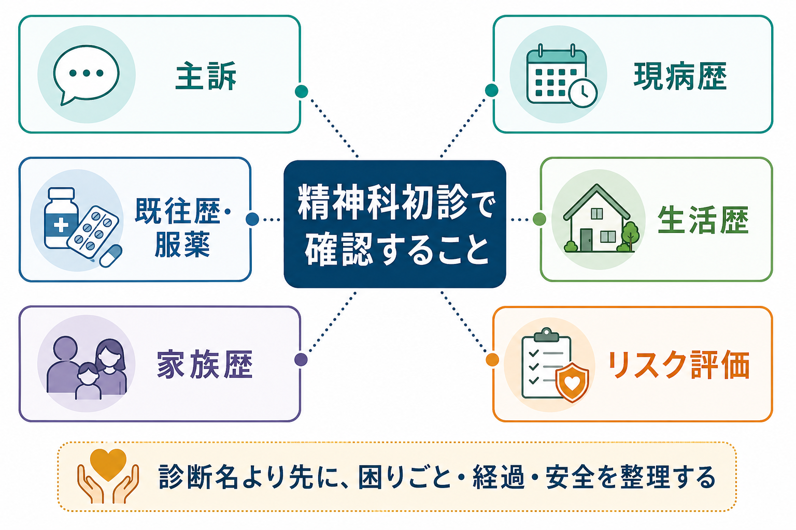
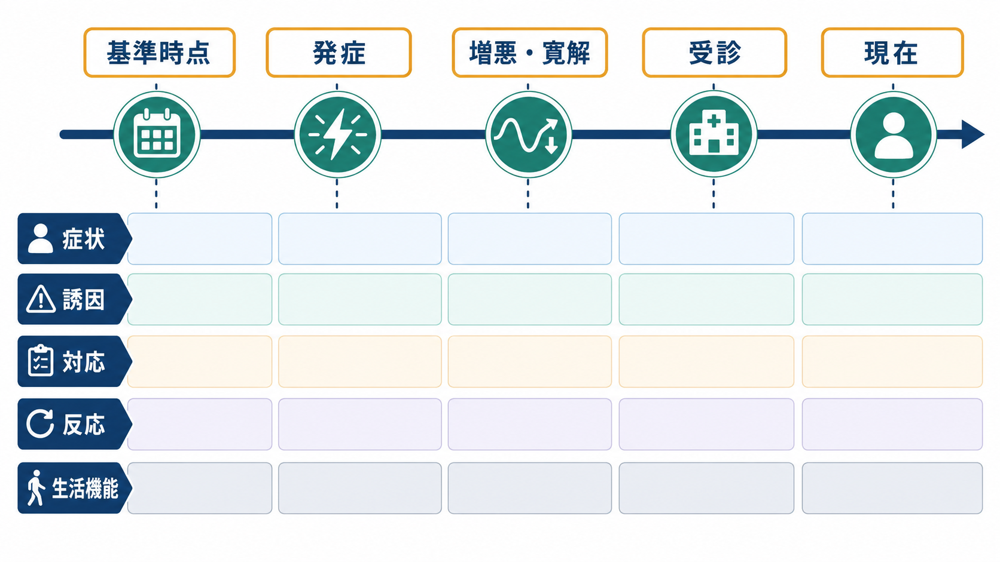
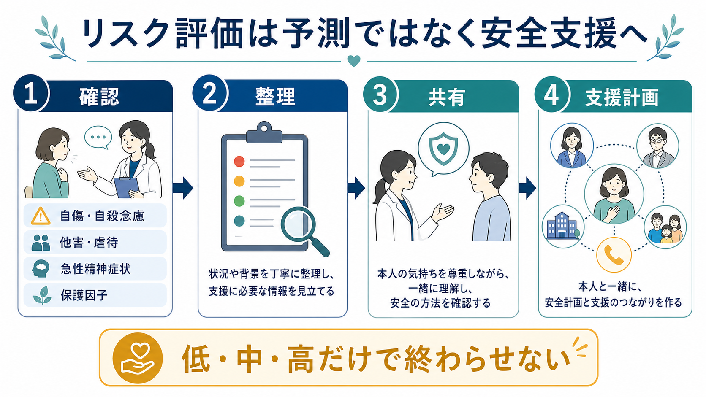

# 精神科初診で何を確認するべきか

## 要点

- 精神科初診の目的は、最初から診断名を当てることではなく、本人の困りごと、症状の経過、生活機能、安全、支援資源を整理することである。
- 確認項目は、主訴、現病歴、精神・身体既往歴、服薬・物質使用、生活歴、家族歴、発達歴、社会的背景、精神状態、リスク評価に分けると抜けが少ない。
- 自傷・自殺、他害、虐待・DV、セルフネグレクト、急性精神病症状、身体疾患・薬剤性要因は、初診時に安全確認として扱う。
- 評価は本人の言葉から始め、必要に応じて家族・紹介状・検査・他機関連携で補う。ただし、本人の同意、守秘、緊急性を常に確認する。
- 初診で得た情報は、[[操作的診断とは何か|操作的診断]]の材料であると同時に、[[生物心理社会モデルとは何か|生物心理社会的な定式化]]と支援計画の材料でもある。

## この記事で答える問い

精神科初診で「何を聞けばよいか」は、単なる問診票の項目ではない。初診では、症状を分類するだけでなく、本人が何に困り、どのような経過で受診に至り、どのリスクを今日扱う必要があり、どの支援につなげるべきかを見立てる必要がある。APAの成人精神科評価ガイドラインも、評価を診断、治療計画、安全、文化的・社会的背景、協働的関係の形成に関わる過程として位置づけている[1]。

この記事では、精神科初診で最低限確認したい情報を、臨床面接の順序に近い形で整理する。教育・研究目的の整理であり、個別症例の診断や治療指示ではない。

## まず結論

初診で確認するべき中心項目は、次の7つである。

| 領域 | 確認すること | 見立てにつながる問い |
|---|---|---|
| 主訴 | 本人がいちばん困っていること、受診理由、期待 | 「今日、何を一緒に整理できるとよいか」 |
| 現病歴 | 発症時期、誘因、経過、増悪・寛解、生活への影響 | 「いつから、何が、どう変化したか」 |
| 既往歴・服薬 | 精神科歴、身体疾患、薬剤、アレルギー、妊娠可能性 | 「身体・薬剤・過去治療の影響はないか」 |
| 生活歴 | 発達、学業・職業、対人関係、生活リズム、住居・経済 | 「症状は生活文脈の中でどう現れているか」 |
| 家族歴 | 精神疾患、身体疾患、自殺、依存症、家族関係 | 「脆弱性と支援資源の両方は何か」 |
| 精神状態 | 外観、意識、気分、思考、知覚、認知、病識 | 「今この場で観察される状態は何か」 |
| リスク評価 | 自傷・自殺、他害、虐待、急性精神症状、保護因子 | 「今日、安全のために何をする必要があるか」 |

## 背景

精神科初診では、本人の語り、観察、紹介情報、家族や支援者からの情報、身体医学的情報が重なり合う。症状だけを聞くと、生活機能や安全確認が抜ける。逆に、生活背景だけを聞くと、うつ病、躁病、精神病症状、物質使用、認知機能低下、身体疾患などの見落としが起こりうる。

NICEの共通精神疾患に関するガイダンスは、症状と機能障害だけでなく、過去の精神疾患、身体疾患、治療反応、対人関係、生活条件、社会的孤立、家族歴、暴力・虐待、雇用や移民状況などが問題の発展・経過・重症度に影響しうると整理している[2]。これは、精神科初診が[[精神疾患とは何か|疾患カテゴリー]]を同定する作業であると同時に、困難が生じた文脈を理解する作業でもあることを示している。

また、初診は信頼関係の最初の場でもある。NICEの成人メンタルヘルスサービス利用者経験ガイダンスは、評価に十分な時間を取り、本人が問題を語り、最後に評価のまとめと質問の時間を持てるようにすること、専門用語や診断名を説明可能な形で扱うことを重視している[3]。

## 基本概念

### 主訴

主訴は「病名」ではなく、本人が今日持ってきた困りごとである。紹介状には「抑うつ」「不眠」「希死念慮」と書かれていても、本人にとっての主訴は「仕事に行けない」「家族に怒鳴ってしまう」「眠れず朝が怖い」「薬を飲むべきか迷っている」かもしれない。

初診では、次を分けて聞くと整理しやすい。

- 本人の言葉での困りごと
- 受診を決めた理由
- 誰が受診を勧めたか
- 今日いちばん相談したいこと
- 診療への期待と不安
- 診断書、薬、休職、家族相談など具体的なニーズ

主訴を本人の言葉で確認することは、文化的背景や医療への期待を理解する入口でもある。DSM-5-TRの文化的定式化面接は、本人が問題をどう理解し、どの支援を望み、社会的文脈や文化的背景が受診にどう影響するかを聞くための半構造化面接である[4]。

### 現病歴

現病歴は、症状名を羅列する欄ではなく、「いつ、何が起こり、どのように変化し、何に影響しているか」を時系列にする作業である。発症前の状態、発症時期、誘因、増悪・寛解、治療歴、生活機能、現在の重症度をつなぐことで、[[カテゴリ診断と次元診断は何が違うのか|カテゴリ診断と次元評価]]の両方に使える情報になる。

確認する項目は次の通りである。

- 発症前の生活、性格傾向、睡眠、仕事・学業、対人関係
- 初発時期と初発症状
- きっかけと本人の意味づけ
- 症状の推移、日内変動、周期性、誘因
- 抑うつ、興味低下、不安、パニック、強迫、外傷体験、躁症状、幻覚妄想、解離、摂食、物質使用、認知機能などの主要症状
- 睡眠、食欲、体重、活動性、集中、記憶、身体症状
- 家事、学業、仕事、育児、対人関係、金銭管理への影響
- これまでの相談先、処方薬、心理療法、入院歴、効果と副作用

### 既往歴・服薬・身体医学的情報

精神症状は、精神疾患だけでなく、身体疾患、薬剤、睡眠障害、疼痛、内分泌疾患、神経疾患、認知症、妊娠・産褥、アルコールや薬物の影響でも変化する。WHO mhGAPも、精神・神経・物質使用関連の状態を評価する際、身体状態、緊急性、併存症、薬物・アルコール使用、支援資源を含む統合的な臨床判断を重視している[5]。

初診で確認したい項目は次である。

- 精神科既往歴、過去診断、入院歴、心理療法歴
- 自傷・自殺企図、救急受診、保護入院などの既往
- 身体疾患、手術歴、頭部外傷、けいれん、慢性疼痛
- 現在・過去の処方薬、市販薬、サプリメント
- 薬剤アレルギー、副作用歴
- アルコール、喫煙、カフェイン、違法薬物、処方薬乱用
- 妊娠可能性、妊娠・産後、月経、更年期に関する情報
- 主治医、かかりつけ医、検査結果、紹介状

特に初発の精神病症状、高齢発症、急性の意識変容、認知機能低下、神経症状、発熱、脱水、急激な体重変化、薬剤変更後の症状は、身体医学的評価の必要性が高い。

### 生活歴

生活歴は「雑談」ではなく、症状がどの環境で生じ、どの役割や支援に影響しているかを知るための情報である。[[生物心理社会モデルとは何か]]の観点では、生物学的要因、心理的要因、社会的要因は互いに分離できない。

確認する項目は次の通りである。

- 出生・発達、乳幼児期、学校生活、学習・対人面の困難
- 家族構成、養育環境、転居、喪失、いじめ、虐待、トラウマ
- 学歴、職歴、休職・退職、職場適応、経済状況
- 住居、同居者、介護・育児、家事、地域とのつながり
- 睡眠覚醒リズム、食事、運動、趣味、日課
- 価値観、宗教・文化、言語、移住歴、差別経験
- 強み、支え、回復経験、本人が大切にしていること

生活歴は病因を一つに決めるためではなく、治療の現実的な足場を見つけるために使う。[[精神医学における回復とは何か|回復]]の視点では、症状軽減だけでなく、本人が意味ある生活を取り戻すことも重要な目標になる。

### 家族歴

家族歴では、遺伝的脆弱性だけでなく、家族関係、支援資源、介護負担、同居環境、家族内の安全も確認する。精神疾患、双極症、統合失調症、うつ病、自殺、依存症、発達特性、認知症などは診断仮説に影響しうるが、家族歴は決定論ではない。[[ストレス脆弱性モデルとは何か|脆弱性とストレス]]の情報として扱うのがよい。

家族や支援者から情報を得る場合は、本人の同意を原則とし、緊急時を除いて守秘と情報共有範囲を説明する。家族の見方と本人の見方が異なる場合も、どちらかを即座に正解とせず、差異そのものを臨床情報として扱う。

### 精神状態診察

精神状態診察は、面接中に観察される「現在の状態」の記述である。本人が語る病歴と、今この場で観察される状態を照合する。

主な観察領域は次である。

- 外観、清潔、姿勢、表情、視線、精神運動
- 意識、見当識、注意、記憶、認知機能
- 気分、感情、感情反応の幅と適切さ
- 思考過程、思考内容、妄想、強迫観念
- 知覚、幻聴、幻視、身体感覚
- 不安、焦燥、衝動性
- 病識、判断、治療への理解
- 信頼関係、面接への参加、情報の一貫性

精神状態は一回で固定されるものではない。睡眠不足、薬剤、緊張、診察環境、文化的表現、神経発達特性によっても見え方が変わる。

## 仕組み

初診評価の実務上の流れは、次のように考えるとよい。

1. 入口で安全と緊急性を確認する。
2. 本人の主訴を本人の言葉で聞く。
3. 現病歴を時系列にする。
4. 既往歴・服薬・物質使用・身体疾患を確認する。
5. 生活歴、家族歴、社会的支援、文化的背景を確認する。
6. 精神状態診察と必要な尺度・検査を組み合わせる。
7. リスクと保護因子を整理し、当面の支援計画に落とし込む。
8. 診断仮説、未確認情報、次回までの方針を本人と共有する。

この流れは直線的ではない。自殺念慮や急性精神病症状が強ければ安全確認を先に行う。強い不安やトラウマ反応があれば、詳細な聴取を急がず安定化を優先する。本人が話しにくい主題は、面接の最後に無理に詰め込むより、次回以降に扱う選択もある。

## 図解

初診での情報は、以下のように「診断」「定式化」「安全支援」の3方向に使われる。

| 情報 | 診断への使い方 | 支援への使い方 |
|---|---|---|
| 主訴 | 症状群と受診理由を把握する | 本人の優先課題を決める |
| 現病歴 | 発症様式、持続期間、重症度を判断する | 経過に沿った介入点を探す |
| 既往歴 | 再発、治療反応、身体・薬剤性要因を検討する | 薬剤選択、連携、検査に反映する |
| 生活歴 | 発達・環境・ストレス因子を検討する | 仕事、学校、家族、福祉支援につなげる |
| 家族歴 | 脆弱性と鑑別診断の材料にする | 家族支援、情報共有、保護因子を整理する |
| リスク評価 | 緊急度と必要な保護を判断する | 安全計画、受診間隔、連絡先、環境調整を決める |

## 臨床・研究との接続

### リスク評価は「点数化」だけでは終わらない

自傷・自殺リスクは、単純な低・中・高のラベルで終わらせず、具体的な安全支援に結びつける必要がある。WHOは、優先的な精神・神経・物質使用関連の問題を持つ人、急性の情緒的苦痛、対人葛藤、喪失などがある人に対して、初期評価時と必要時に自傷の考え・計画や過去の自傷行為を尋ねることを推奨している[6]。NICEの自傷ガイドラインも、リスク評価ツールやスケールだけで将来の自殺や退院可否を判断しないこと、心理社会的評価と支援計画を重視することを示している[7]。

確認したい項目は次である。

- 自傷・自殺念慮、計画、準備、手段へのアクセス
- 過去の自傷・自殺企図、救急搬送、入院歴
- 希死念慮と「死にたい」以外の表現
- 衝動性、焦燥、不眠、絶望感、物質使用
- 幻聴による命令、被害妄想、混乱、躁状態
- 他害リスク、DV、虐待、ストーキング、子どもや高齢者の安全
- 保護因子、支援者、受診継続意思、危機時連絡先
- 今日の帰宅可否、付き添い、環境調整、緊急受診の目安

日本の自殺対策大綱も、自殺を個人の問題だけでなく、保健・医療・福祉・教育・労働などと連携した包括的支援の対象として位置づけている[8]。初診のリスク評価は、予測を言い当てる作業ではなく、今日から使える支援網を組み立てる作業である。

### 診断仮説は「暫定」でよい

初診で診断名を伝えることが有用な場合もあるが、情報が不足している段階で断定すると、見落としやラベリングにつながる。[[精神科診断は何のためにあるのか]]で整理されるように、診断は説明、予後、治療選択、制度利用、研究分類のための道具である。道具である以上、現病歴、精神状態、生活機能、身体医学的情報、経過観察によって更新される。

特に、うつ状態と双極症、初発精神病症状と薬剤・物質・身体疾患、発達特性と不安・抑うつ、トラウマ反応とパーソナリティの問題、認知症とうつ病・せん妄は、初診時点で鑑別を急ぎすぎない方がよい。

### 標準化と個別化を組み合わせる

PHQ-9、GAD-7、AUDIT、PCL-5、MDQ、YMRS、MMSE/MoCAなどの尺度は、症状の見落としを減らし、重症度や経過を共有する助けになる。ただし、尺度は面接の代替ではない。尺度で高得点でも本人の生活文脈が分からなければ支援計画は立たず、低得点でも自傷リスクや家庭内安全が高い場合は慎重な対応が必要である。

## よくある誤解

### 「初診では病名を決めることが最優先である」

病名は重要だが、初診で最優先すべきなのは、安全、困りごと、経過、生活機能、支援資源の把握である。診断はそれらの情報から作る暫定仮説であり、経過で更新される。

### 「家族歴は遺伝を確認するためだけに聞く」

家族歴は遺伝的脆弱性だけでなく、支援者、同居環境、介護負担、家族内葛藤、喪失体験、安全確認にも関係する。家族歴は決定論ではなく、文脈情報である。

### 「リスク評価はスコアで分類できれば十分である」

リスク分類だけでは不十分である。重要なのは、具体的な手段へのアクセス、危機時の連絡先、支援者、受診間隔、帰宅環境、緊急時対応を共有することである。

### 「本人の話だけでは不十分なので、家族の話を優先する」

家族情報は有用だが、本人の語りを軽視すると信頼関係を損なう。原則は本人の同意を得た情報共有であり、緊急性がある場合のみ安全確保を優先して扱う。

## 関連ノート

- [[精神医学とは何か]]
- [[精神疾患とは何か]]
- [[精神科診断は何のためにあるのか]]
- [[操作的診断とは何か]]
- [[DSMとICDは何が違うのか]]
- [[カテゴリ診断と次元診断は何が違うのか]]
- [[生物心理社会モデルとは何か]]
- [[ストレス脆弱性モデルとは何か]]
- [[精神医学における回復とは何か]]

### MOC更新候補

- `content/00_MOC/` 配下の精神医学・診断・面接関連MOCに、本記事 `[[精神科初診で何を確認するべきか]]` を追加する。
- 並列ジョブとの競合を避けるため、本タスクではMOC本体は更新しない。

### 今後の作成候補

- 「精神状態診察とは何か」
- 「自殺リスク評価で何を確認するべきか」
- 「精神科診断面接と心理検査の違い」
- 「精神科初診で身体疾患をどう見落とさないか」

## 理解チェック

1. 初診で主訴を聞くとき、診断名ではなく本人の言葉を確認する理由は何か。
2. 現病歴を時系列で整理すると、鑑別診断と支援計画にどのような利点があるか。
3. 家族歴は、遺伝的脆弱性以外にどのような情報を含むか。
4. 自傷・自殺リスク評価を、低・中・高の分類だけで終わらせてはいけない理由は何か。
5. 尺度や問診票は、臨床面接のどの部分を補助し、どの部分を代替できないか。

## 参考文献

[1] American Psychiatric Association. (2016). *The American Psychiatric Association Practice Guidelines for the Psychiatric Evaluation of Adults* (3rd ed.). American Psychiatric Association. https://www.swmbh.org/wp-content/uploads/Psychiatric-Evaluation-APA-Clinical-Practice-Guideline.pdf

[2] Kendrick, T., & Pilling, S. (2012). Common mental health disorders: identification and pathways to care: NICE clinical guideline. *British Journal of General Practice, 62*(594), 47-49. https://doi.org/10.3399/bjgp12X616481

[3] National Collaborating Centre for Mental Health. (2012). *Service User Experience in Adult Mental Health: Improving the Experience of Care for People Using Adult NHS Mental Health Services*. British Psychological Society and Royal College of Psychiatrists. https://www.ncbi.nlm.nih.gov/books/NBK299069/

[4] American Psychiatric Association. (2022). *DSM-5-TR Cultural Formulation Interview*. https://www.psychiatry.org/File%20Library/Psychiatrists/Practice/DSM/DSM-5-TR/APA-DSM5TR-CulturalFormulationInterview.pdf

[5] World Health Organization. (2016). *mhGAP Intervention Guide for mental, neurological and substance use disorders in non-specialized health settings: Version 2.0*. https://iris.who.int/handle/10665/250239

[6] World Health Organization. (2015). *Assessment for self-harm/suicide in persons with priority mental, neurological and substance use disorders*. mhGAP Evidence Resource Centre. https://www.who.int/teams/mental-health-and-substance-use/treatment-care/mental-health-gap-action-programme/evidence-centre/self-harm-and-suicide/assessment-for-self-harm-suicide-in-persons-with-priority-mental-neurological-and-substance-use-disorders

[7] National Institute for Health and Care Excellence. (2022). *Self-harm: assessment, management and preventing recurrence* (NICE guideline NG225). https://www.nice.org.uk/guidance/ng225

[8] 厚生労働省. (2022). 自殺総合対策大綱～誰も自殺に追い込まれることのない社会の実現を目指して～. https://www.mhlw.go.jp/stf/taikou_r041014.html

## 未解決問題

- 日本の外来初診で、限られた診療時間内にどの項目を標準化し、どの項目を個別化するか。
- 初診時の自殺リスク評価を、記録・安全計画・地域連携にどう一貫して接続するか。
- 本人の語り、家族情報、紹介状、尺度結果が食い違うとき、どのように共有意思決定へつなげるか。
- 文化的背景、発達特性、トラウマ歴を、過剰診断にも過小評価にもならない形で初診に組み込む方法。
