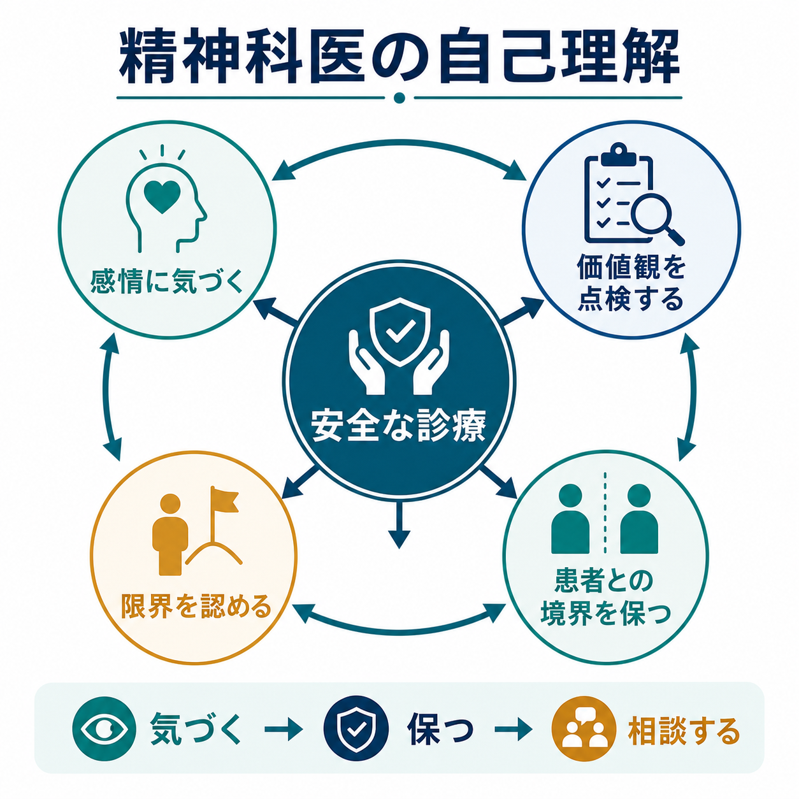
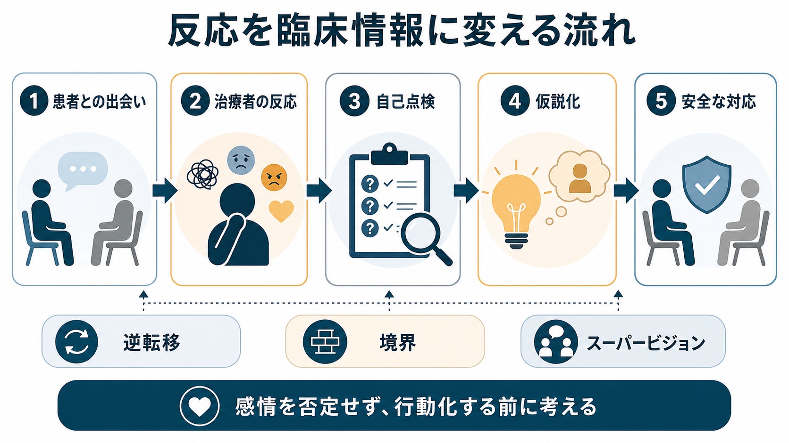

# 精神科医の自己理解はなぜ必要なのか

## 要点

- 精神科医の自己理解とは、治療者自身の感情、価値観、身体的疲労、得意不得意、患者への反応を観察し、診療上の判断に混入しうる要因として扱う力である。
- 自己理解は「よい人間であること」の証明ではなく、[[治療関係とは何か|治療関係]]、境界、説明、リスク評価、チーム相談を安全に保つための臨床技術である。
- 患者への強い救済欲求、苛立ち、回避、過度な同一化、無力感は、それ自体が悪いのではない。問題は、それに気づかないまま行動化し、境界侵害、過剰治療、過小評価、説明不足につながることである。
- 自己理解は個人の内省だけで完結しない。記録、スーパービジョン、カンファレンス、同僚への相談、休息と業務設計を含む実践である。

## この記事で答える問い

1. 精神科医にとって「自己理解」とは何を指すのか。
2. 自己理解はなぜ患者の安全、倫理、治療関係に関係するのか。
3. 逆転移、境界、バーンアウト、価値観の偏りを、日常診療でどのように扱えばよいのか。
4. 自己理解を「自己反省の美徳」ではなく、再現可能な臨床手続きとして考えるにはどうすればよいのか。

## まず結論

精神科医の自己理解が必要なのは、精神科診療が患者の語り、沈黙、依存、不信、怒り、恥、希死念慮、家族関係、社会的困難など、治療者自身の感情を強く揺さぶる素材を扱うからである。精神科医は観察者であると同時に、患者にとって重要な対人環境の一部になる。したがって、治療者の反応は診療の邪魔になるだけでなく、患者理解の手がかりにもなる。

ただし、その反応をそのまま信じると危険である。たとえば「この患者は自分を操作している」と感じたとき、それは患者の対人パターンの手がかりかもしれないし、治療者側の疲労、過去の経験、価値観、焦りの反映かもしれない。自己理解は、この両者を区別し、臨床仮説として扱い、必要に応じて相談するための前提である。

米国精神医学会の倫理注釈は、精神科医が患者の尊厳、守秘、境界、専門職としての責任を保つことを重視している[1]。また ACGME の精神科研修マイルストーンでは、専門職性の一部としてウェルビーイングや制度的要因の認識が扱われる[2]。自己理解は、こうした倫理や専門職性を「態度」ではなく、日々の判断に落とすための実践である。

## 背景

精神科診療では、診断や薬物療法だけでなく、[[精神科面接とは何か|面接]]そのものが評価と介入の場になる。患者は症状だけでなく、治療者に対する期待、恐れ、不信、試し行動、依存、怒り、沈黙を持ち込む。治療者もまた、患者に対して心配、好意、苛立ち、退屈、無力感、救済欲求、避けたい感覚を持つ。

この治療者側の反応は、古典的には逆転移として議論されてきた。現代的には、逆転移は精神分析だけの用語ではなく、精神科医が患者との相互作用のなかで経験する感情的・身体的・認知的反応をどう臨床的に扱うかという広い問題として理解できる。Gabbard は、現代精神科治療においても逆転移が患者理解、治療関係、処方場面、境界判断に関係し続けると論じている[3]。

自己理解が弱いと、精神科医は自分の反応を「客観的な臨床判断」と取り違えやすい。たとえば、強い不安から過剰に入院を勧める、怒りからリスクを低く見積もる、救済欲求から契約外の対応を続ける、無力感から説明を短く切り上げる、といった形で表れる。これは患者の責任ではなく、診療場面の構造から起こりうる専門職上のリスクである。

## 基本概念

### 自己理解

ここでいう自己理解は、性格分析や自己啓発ではない。臨床場面で次の問いを持ち続けることである。

- 私はいま、この患者にどのような感情を抱いているか。
- その感情は患者理解に役立つ情報か、それとも私の疲労、価値観、苦手意識に由来するものか。
- 私は患者を助けたい気持ちから、境界や説明を曖昧にしていないか。
- 私は患者への苛立ちや恐れから、必要な確認を避けていないか。
- 私の限界はどこにあり、どの時点で同僚、上級医、多職種、制度に接続すべきか。

自己理解は、内面を完全に透明化することではない。むしろ「自分には見えていない部分がある」という前提を置き、記録や相談で補正することである。

### 逆転移

逆転移は、患者に対して治療者が抱く反応である。狭義には患者の転移に対する治療者の無意識的反応を指すが、広義には患者との関係で治療者に生じる感情、身体感覚、思考、行動衝動を含む。専門家評価では、逆転移を扱ううえで自己洞察や不安管理が重要とされてきた[3]。

逆転移は「起こしてはいけないもの」ではない。むしろ、患者との関係で何が起きているかを知らせる信号になりうる。ただし、そのまま行動に移すと、過剰な親密化、拒絶、説明不足、境界侵害につながる。したがって、気づき、言語化し、臨床仮説として点検する必要がある。

### 境界

境界とは、治療者と患者の役割、時間、場所、金銭、贈与、自己開示、身体接触、連絡方法などをめぐる専門職上の枠組みである。Gutheil と Gabbard は、境界の問題を単純な禁止リストではなく、臨床文脈と患者の脆弱性に照らして評価すべきものとして整理した[4]。また、境界理論を過度に硬直的に用いることも、必要な柔軟性を損なう可能性があると指摘されている[5]。

つまり、境界は冷たさではない。[[精神科面接で境界設定はなぜ必要なのか|境界設定]]は、患者を突き放すためではなく、治療者の個人的欲求や不安から患者を守り、治療の予測可能性を高めるためにある。

### 価値観と文化的前提

精神科医は、健康、家族、仕事、服薬、依存、自立、リスク、回復について何らかの価値観を持っている。価値観そのものは避けられないが、無自覚な価値観は、患者の生活史や文化的背景を狭く解釈する原因になる。[[文化的背景は診断にどう影響するのか|文化的背景]]や社会的文脈を扱うときほど、治療者側の「普通」「望ましい」「危ない」という感覚を点検する必要がある。

### 限界とウェルビーイング

自己理解には、能力の限界、経験の限界、体調の限界を認めることも含まれる。臨床家のバーンアウトは、患者安全、専門職性、患者満足と関連することがメタ解析で示されている[7]。また、National Academies の報告は、臨床家のウェルビーイングを個人の根性ではなく、医療の質と安全に関わるシステム課題として位置づけている[8]。

精神科医が自分の限界を知ることは、弱さの告白ではなく、患者を一人の治療者の限界に閉じ込めないための安全策である。

## 仕組み

精神科医の自己理解は、次の流れで診療を守る。

1. 患者との出会いで、治療者に感情や身体反応が生じる。
2. その反応を、患者の特徴として即断せず、自分の反応としていったん観察する。
3. 反応が何に由来するかを点検する。患者の対人パターン、状況の危険性、治療者の疲労、価値観、過去の経験が候補になる。
4. 診断やリスク評価ではなく、まず臨床仮説として扱う。
5. 行動化する前に、記録、相談、スーパービジョン、チームでの検討に接続する。

この流れは、[[共感的理解とは何か|共感]]とも関係する。共感は患者と同じ感情になることではなく、患者の視点を理解しつつ、治療者としての位置を保つことである。自己理解がない共感は過同一化になりやすく、自己理解だけで共感がない診療は防衛的で機械的になりやすい。

また、治療同盟は心理療法のアウトカムと一貫して関連することがメタ解析で示されている[6]。精神科診療では薬物療法や診断面接でも、患者が「この治療者は自分を理解しようとしている」「説明と境界が一貫している」と感じられることが重要である。自己理解は、治療者が自分の不安や苛立ちに振り回されず、安定した治療同盟を保つための条件になる。

## 図解

自己理解が特に必要になる場面は、次のように整理できる。

| 場面 | 起こりやすい治療者反応 | 自己理解の問い | 安全につながる行動 |
|---|---|---|---|
| 希死念慮や自傷の相談 | 不安、責任感、過剰な介入衝動 | 私は不安から判断を急いでいないか | リスク評価を構造化し、必要時に相談する |
| 怒りや苦情を向けられる | 防衛、反論、回避 | 私は自尊心を守るために患者を遠ざけていないか | 感情を受け止めつつ、事実と境界を確認する |
| 依存的な関係になりやすい | 救済欲求、特別扱い | 私は「自分だけが助けられる」と感じていないか | 連絡方法、頻度、役割を明確にする |
| 服薬や入院を拒否される | 苛立ち、説得の強まり | 私の価値観を押しつけていないか | [[共同意思決定とは何か|共同意思決定]]と説明をやり直す |
| 複雑な家族・社会問題 | 無力感、問題の単純化 | 医療だけで抱え込んでいないか | 多職種、地域資源、家族面接を検討する |

## 臨床・研究との接続

### 1. 面接の質

自己理解は、質問の選び方、沈黙の扱い、患者の言葉への反応に表れる。たとえば、患者が怒っている場面で、治療者が自分の防衛感情に気づければ、すぐに反論する代わりに「何が一番納得しにくかったか」を聞ける。これは[[支持的面接とは何か|支持的面接]]や[[傾聴とは何か|傾聴]]の前提になる。

### 2. 境界と倫理

境界侵害は、突然始まるとは限らない。小さな特別扱い、秘密の共有、過剰な自己開示、診療外連絡の増加などが、治療者の救済欲求や孤立と結びつくことがある[4]。一方で、境界を機械的に硬くするだけでは、患者の個別性を損なうこともある[5]。自己理解は、柔軟性と安全性を両立させるための点検装置である。

### 3. 診断とリスク評価

精神科診断では、患者の語りを聞くだけでなく、治療者が患者から受ける印象も手がかりになる。しかし、印象は常に治療者側のバイアスを含む。[[精神科診断における除外診断とは何か|除外診断]]や[[自殺リスク評価では何を聞くべきか|自殺リスク評価]]では、強い感情ほど構造化された確認と第三者への相談が重要になる。

### 4. 説明と同意

患者が治療者の提案を拒むとき、治療者は「理解がない」「病識がない」と短絡しやすい。しかし、その拒否には副作用への恐怖、過去の医療不信、家族関係、経済的事情、文化的意味づけが含まれることがある。治療者自身の焦りに気づくことは、[[インフォームドコンセントは精神科でどう行うのか|インフォームドコンセント]]を丁寧にやり直す助けになる。

### 5. チーム医療

自己理解は個人の内省で終わらない。精神科医が「この患者を診ると極端に疲れる」「判断が急ぎたくなる」「特別扱いしたくなる」と言語化できれば、チームは支援計画、役割分担、境界設定を調整しやすくなる。これは[[精神科におけるチーム医療とは何か|チーム医療]]や[[精神科で多職種連携はなぜ重要なのか|多職種連携]]の実務に直結する。

## よくある誤解

### 誤解1: 自己理解は精神分析や心理療法だけの話である

自己理解は、薬物療法中心の外来、救急、入院、リエゾン、地域診療でも必要である。処方量、診察間隔、入院判断、家族への説明、診療外連絡への対応にも、治療者の不安や価値観が影響しうる。

### 誤解2: 感情を持つことが悪い

感情を持つことは避けられない。むしろ、感情がまったくないかのように振る舞うほうが危険である。重要なのは、感情を患者にぶつけないこと、感情を診断名に変換しないこと、感情を臨床仮説として点検することである。

### 誤解3: 境界を守るとは冷たくすることである

境界は患者を遠ざけるためではなく、治療関係を予測可能にするためにある。時間、連絡方法、役割、守秘の範囲を明確にすることは、患者の安心につながる。[[守秘義務とは何か|守秘義務]]も、境界の一部として理解できる。

### 誤解4: よい精神科医なら限界を感じない

限界を感じないことが専門性ではない。限界を認識し、相談し、引き継ぎ、制度につなげることが専門性である。バーンアウトが患者安全や専門職性と関連するという知見は、治療者の状態を診療の外側に置けないことを示している[7][8]。

## 実践のためのミニ手順

診療後またはカンファレンス前に、次の5項目を短く点検する。

1. 反応: この患者に対して、いま最も強い感情は何か。
2. 衝動: その感情から、何を急いで行いたくなっているか。
3. 仮説: それは患者理解の手がかりか、治療者側の疲労や価値観の反映か。
4. 境界: 時間、連絡、役割、説明、守秘のどこが曖昧になっているか。
5. 相談: 一人で判断せず、誰に、何を相談するべきか。

この手順は、治療者の個人的弱点を責めるためではない。臨床判断を患者とチームに開き、行動化を減らすための短い安全確認である。

## 関連ノート

- [[治療関係とは何か]]
- [[精神科面接で境界設定はなぜ必要なのか]]
- [[共感的理解とは何か]]
- [[精神科面接とは何か]]
- [[支持的面接とは何か]]
- [[共同意思決定とは何か]]
- [[インフォームドコンセントは精神科でどう行うのか]]
- [[守秘義務とは何か]]
- [[精神科治療計画はどのように立てるのか]]
- [[精神科初診で何を確認するべきか]]

## MOC更新候補

- `content/00_MOC/` 配下の精神医学、精神科面接、医療倫理、プロフェッショナリズム関連 MOC がある場合に、本記事へのリンクを追加する候補。
- 並列記事生成との競合を避けるため、このジョブでは MOC 本体は更新しない。

## 理解チェック

1. 精神科医の自己理解は、なぜ「性格の問題」ではなく「臨床安全の問題」といえるか。
2. 患者に苛立ちを感じたとき、その感情をどのように臨床仮説へ変換できるか。
3. 境界を守ることと、患者に冷たくすることは何が違うか。
4. 治療者の疲労やバーンアウトは、なぜ患者安全や説明の質に関係するか。
5. 一人で抱え込まないために、どのタイミングで誰に相談するか。

## 未解決問題

- 自己理解や逆転移の扱いを、薬物療法中心の一般精神科外来でどのように教育・評価するか。
- 治療者の感情を記録やカンファレンスで扱うとき、患者の尊厳と守秘をどう守るか。
- 文化的背景、ジェンダー、権力差が、治療者の自己理解と境界判断にどのように影響するか。
- 個人の内省に過度に依存せず、組織として安全な相談文化をどう作るか。

## 参考文献

[1] American Psychiatric Association. (2013). *The Principles of Medical Ethics With Annotations Especially Applicable to Psychiatry*. https://www.psychiatry.org/getmedia/3fe5eae9-3df9-4561-a070-84a009c6c4a6/2013-APA-Principles-of-Medical-Ethics.pdf

[2] Accreditation Council for Graduate Medical Education. (2020). *Psychiatry Milestones 2.0*. https://www.acgme.org/globalassets/PDFs/Milestones/PsychiatryMilestones2.0.pdf

[3] Gabbard, G. O. (2020). The role of countertransference in contemporary psychiatric treatment. *World Psychiatry, 19*(2), 243-244. https://doi.org/10.1002/wps.20746

[4] Gutheil, T. G., & Gabbard, G. O. (1993). The concept of boundaries in clinical practice: theoretical and risk-management dimensions. *American Journal of Psychiatry, 150*(2), 188-196. https://doi.org/10.1176/ajp.150.2.188

[5] Gutheil, T. G., & Gabbard, G. O. (1998). Misuses and misunderstandings of boundary theory in clinical and regulatory settings. *American Journal of Psychiatry, 155*(3), 409-414. https://doi.org/10.1176/ajp.155.3.409

[6] Fluckiger, C., Del Re, A. C., Wampold, B. E., & Horvath, A. O. (2018). The alliance in adult psychotherapy: A meta-analytic synthesis. *Psychotherapy, 55*(4), 316-340. https://doi.org/10.1037/pst0000172

[7] Panagioti, M., Geraghty, K., Johnson, J., Zhou, A., Panagopoulou, E., Chew-Graham, C., Peters, D., Hodkinson, A., Riley, R., & Esmail, A. (2018). Association between physician burnout and patient safety, professionalism, and patient satisfaction: A systematic review and meta-analysis. *JAMA Internal Medicine, 178*(10), 1317-1331. https://doi.org/10.1001/jamainternmed.2018.3713

[8] National Academies of Sciences, Engineering, and Medicine. (2019). *Taking Action Against Clinician Burnout: A Systems Approach to Professional Well-Being*. National Academies Press. https://doi.org/10.17226/25521
