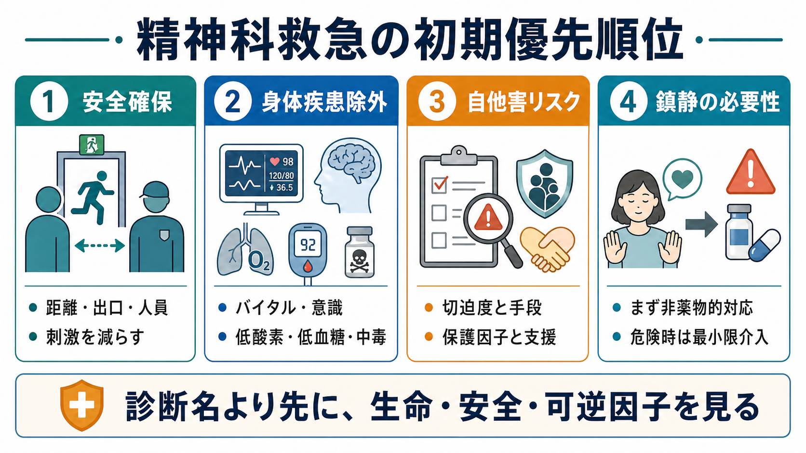
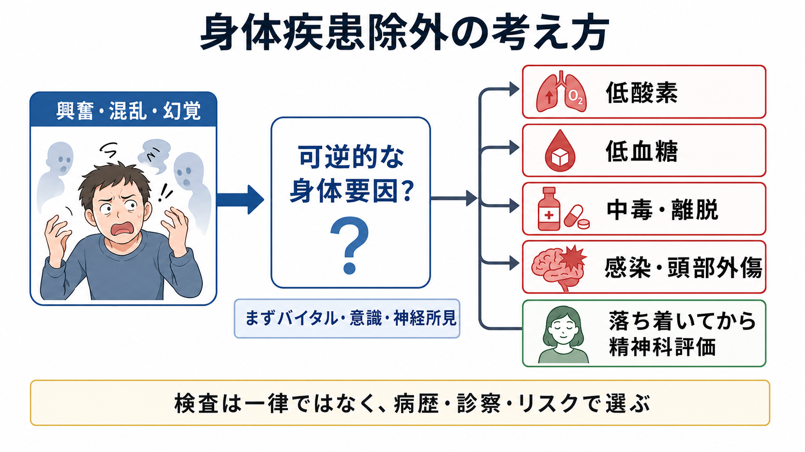
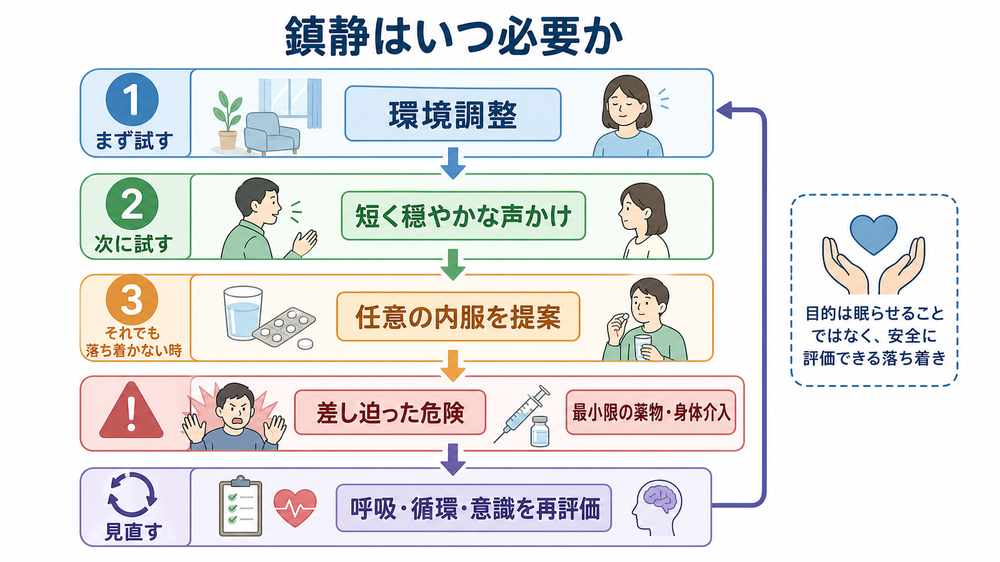

# 精神科救急では何を優先するべきか

## 要点

- 精神科救急では、診断名を急いで確定する前に、生命・安全・可逆的な身体要因を確認する。
- 初期対応の優先順位は、**安全確保、身体疾患除外、自他害リスク評価、鎮静必要性の判断**である。
- 興奮、混乱、幻覚、希死念慮、暴力リスクは、精神疾患だけでなく、低酸素、低血糖、せん妄、中毒、離脱、感染、頭部外傷などでも起こる。
- 鎮静や身体拘束は「評価しやすくするため」ではなく、差し迫った危険を減らすための最小限の介入として位置づける。
- このノートは教育・研究目的の整理であり、個別症例の診断や治療指示ではない。

## この記事で答える問い

精神科救急で最初に問うべきことは、「これは何の疾患か」ではなく、「今すぐ失われうるものは何か」である。失われうるものには、生命、身体安全、本人の尊厳、周囲の安全、可逆的な治療機会が含まれる。したがって、初期対応は[[精神科診断における除外診断とは何か]]や[[鑑別診断とは何か]]よりも一段手前で、場の安全と医学的安定性を確かめる作業から始まる。

## まず結論

精神科救急で優先するべき順序は、次の4つである。

1. **安全確保**: 本人、同伴者、他患者、職員がすぐ傷つかない環境を作る。
2. **身体疾患除外**: 低酸素、低血糖、中毒・離脱、せん妄、感染、頭部外傷など、見逃すと危険な可逆因子を先に見る。
3. **自他害リスク**: 希死念慮、方法、手段への接近性、暴力の切迫度、保護因子、支援資源を確認する。
4. **鎮静必要性**: 非薬物的な鎮静化を先に試み、差し迫った危険がある場合に限って最小限の薬物・身体介入を検討する。

この順序は、精神科的評価を軽視するものではない。むしろ、本人が安全に話せる状態を作り、[[精神科面接とは何か]]や[[精神科初診で何を確認するべきか]]を有効にするための前処理である。ACEP の成人精神科救急 clinical policy は、急性精神症状に対する検査や画像検査を一律に行うのではなく、病歴、診察、リスク因子、臨床判断に基づいて選ぶ考え方を示している[1]。

## 背景

精神科救急では、怒り、恐怖、混乱、幻覚、希死念慮、酩酊、家族の疲弊、警察・救急隊からの引き継ぎなどが同時に持ち込まれる。現場では「本人が語れるか」「同伴者の情報が信頼できるか」「身体診察に協力できるか」「退院可能か」を短時間で判断しなければならない。

Project BETA は、救急場面の興奮対応について、医学的原因の除外、急性危機の安定化、強制の回避、最小制限、治療同盟、適切な処遇計画を目標として整理した[2]。この枠組みは、単に「暴れている人を止める」ための技術ではなく、危険を減らしながら評価と治療につなげるための臨床思想である。

## 基本概念

### 安全確保

安全確保とは、本人を抑え込むことではない。まず、出口を塞がない、距離を保つ、危険物を減らす、過剰な刺激を避ける、複数名で対応する、役割を明確にする、といった環境調整である。これは[[精神科面接で境界設定はなぜ必要なのか]]ともつながる。境界設定は威圧ではなく、予測可能性を高める安全技術である。

興奮している患者では、最初から詳細な病歴聴取を完遂しようとすると、かえって危険が増す。Project BETA の脱エスカレーション指針は、言語的介入を第一選択とし、本人の尊厳を保ちながら協力を得ることを重視する[3]。具体的には、短く穏やかな言葉、選択肢の提示、過度な説得の回避、相手の感情の反映、身体距離の確保である。

### 身体疾患除外

「精神科の問題に見える」ことと「身体疾患ではない」ことは同じではない。新規発症の興奮、意識変容、高齢発症、異常バイタル、頭部外傷、けいれん、発熱、免疫抑制、急な認知変動、薬物・アルコール関連、低栄養、脱水がある場合、身体疾患の可能性を高く見る。

Project BETA の医学的評価ワークグループは、興奮の原因には生命に関わる医学的状態が含まれるため、医学的原因と非医学的原因の区別が重要だと述べる。一方で、全例に一律の検査を行うのではなく、病歴、身体所見、バイタル、リスクに基づく指向的検査を推奨している[4]。これは[[器質性精神障害を見逃さないためには何を見るべきか]]や[[精神科診断における除外診断とは何か]]の実践版である。

### 自他害リスク

自殺リスク評価では、希死念慮の有無だけでなく、具体的な方法、手段へのアクセス、準備行動、過去の自傷・自殺企図、衝動性、物質使用、精神病症状、喪失体験、孤立、保護因子、支援者を確認する。NICE の自傷ガイドラインは、リスク尺度だけで将来の自殺や反復自傷を予測したり、治療提供や退院判断を決めたりしないよう勧め、本人のニーズと心理的・身体的安全に焦点を当てたリスク定式化を重視している[5]。

他害リスクでは、怒りの強さだけでなく、対象の特定、脅迫内容、武器や相手への接近性、被害妄想、命令幻聴、酩酊、離脱、過去の暴力、退避可能性、周囲の支援を評価する。ここでも「危険人物か」と決めつけるのではなく、「どの条件で危険が上がり、どの条件で下がるか」を見る。

### 鎮静必要性

鎮静の目的は、本人を罰することでも、眠らせることでもない。目的は、本人と周囲の安全を確保し、呼吸・循環・意識を保ったまま評価と治療が可能な落ち着きを得ることである。NICE は、急速鎮静を、経口薬が不可能または不適切で、緊急の薬物鎮静が必要な場合の非経口投与として定義し、拘束や隔離を含む制限的介入は他の試みが失敗し自他への害の可能性がある場合に限定する考え方を示している[6]。

Project BETA の薬物療法ワークグループは、薬物を「興奮を消す」ために一律に使うのではなく、原因に応じて選ぶことを強調する[7]。たとえば、アルコール離脱、刺激薬中毒、精神病性興奮、せん妄では、望ましい薬物選択や注意点が異なる。したがって、鎮静薬を使う前後で、低酸素、過鎮静、血圧低下、錐体外路症状、QT 延長、誤嚥リスクなどを再評価する必要がある。

## 仕組み

精神科救急の初期対応は、次のような循環で進む。

| 段階 | 見るもの | 典型的な問い | 失敗すると起こること |
|---|---|---|---|
| 安全確保 | 距離、出口、人員、危険物、刺激 | 今この場で誰が傷つきうるか | 暴力、自傷、職員被害、強制介入の増加 |
| 身体疾患除外 | バイタル、意識、神経所見、血糖、酸素化、中毒・離脱 | これは可逆的な身体要因ではないか | せん妄・中毒・感染などの見逃し |
| 自他害リスク | 念慮、計画、手段、切迫度、保護因子 | 何が危険を上げ、何が危険を下げるか | 退院後危機、過剰入院、本人不信 |
| 鎮静必要性 | 非薬物的対応の成否、危険の切迫度、薬物リスク | 安全に評価できる落ち着きが必要か | 過鎮静、呼吸抑制、拘束の常態化 |

重要なのは、この表を直線的なチェックリストとしてではなく、反復する評価として使うことである。たとえば、鎮静後には再び身体状態と意識を評価する。自殺リスクは面接冒頭と退院前で変わりうる。酩酊が改善すると、語りの内容もリスク定式化も変わる。救急の評価は、1回の判定ではなく、短い時間幅での再評価である。

## 図解

図解としては、この記事では3つの視点を置いた。

1. **初期優先順位**: 診断名よりも生命・安全・可逆因子を先に見る。
2. **身体疾患除外**: 興奮・混乱・幻覚を精神症状だけに還元せず、低酸素、低血糖、中毒・離脱、感染・頭部外傷を確認する。
3. **鎮静必要性**: 環境調整と声かけを優先し、差し迫った危険時だけ最小限の薬物・身体介入を行い、呼吸・循環・意識を再評価する。

## 臨床・研究との接続

臨床では、初期対応の質はその後の[[治療関係とは何か]]に影響する。乱暴な初期対応は、本人に「医療は自分を支配するものだ」という体験を残し、その後の治療参加を難しくする。一方で、危険を曖昧にしたまま「共感的に話を聞く」だけでは、本人や周囲を守れない。[[支持的面接とは何か]]や[[傾聴とは何か]]は、安全確保と両立してはじめて機能する。

研究上は、精神科救急のアウトカムを「鎮静できたか」だけで測るのは不十分である。より重要なのは、身体疾患の見逃し、暴力・自傷の発生、拘束や隔離の頻度、薬物有害事象、本人の体験、退院後の再危機、地域支援への接続である。VA/DoD の自殺リスクガイドラインは、急性リスク同定から管理までの意思決定点を整理し、臨床判断を置き換えるのではなく支援する道具として位置づけている[8]。

## よくある誤解

### 「精神科救急では精神科診断を早くつけることが最優先である」

診断は重要だが、初期対応の最優先ではない。低血糖や低酸素による興奮を見逃して「精神症状」と扱えば、治療機会を失う。まず安全と身体状態を見て、そのうえで[[操作的診断とは何か]]や[[DSMとICDは何が違うのか]]の枠組みを使う。

### 「自殺リスクはスコアで低・中・高に分ければよい」

スコアは情報整理の補助になりうるが、退院や治療の可否を単独で決めるものではない。NICE は、自傷後の対応でリスク尺度や単純な低・中・高分類を将来予測や処遇決定に使わないよう勧めている[5]。必要なのは、リスク因子、保護因子、支援、切迫度を組み合わせた定式化である。

### 「鎮静は早く行うほどよい」

鎮静が必要な場面はある。しかし、鎮静薬は呼吸抑制、過鎮静、転倒、誤嚥、心電図異常などのリスクを伴う。まず環境調整、声かけ、任意の内服を検討し、それでも差し迫った危険がある場合に、目的を明確にして最小限の介入を行う。

### 「安全確保は本人への不信である」

安全確保は不信ではなく、本人を含む全員の被害を減らすための条件整備である。出口を塞がない、距離を保つ、刺激を減らす、短く話す、選択肢を示すことは、本人の自律性を守る対応でもある。

## 関連ノート

- [[精神科初診で何を確認するべきか]]
- [[器質性精神障害を見逃さないためには何を見るべきか]]
- [[精神科診断における除外診断とは何か]]
- [[鑑別診断とは何か]]
- [[精神科面接とは何か]]
- [[精神科面接で境界設定はなぜ必要なのか]]
- [[支持的面接とは何か]]
- [[傾聴とは何か]]

## 関連ノート候補

- 自殺リスク評価とは何か
- せん妄を精神症状と見誤らないためには何を見るべきか
- 急性興奮への非薬物的対応とは何か
- 精神科救急における身体拘束はどう考えるべきか
- 精神科救急における家族・警察・救急隊からの情報はどう扱うべきか

## 理解チェック

1. 精神科救急で、診断名の前に確認するべき4つの優先項目は何か。
2. 新規発症の興奮や意識変容で、身体疾患を疑う手がかりを3つ挙げられるか。
3. 自殺リスク評価で、希死念慮の有無だけでは不十分な理由は何か。
4. 鎮静の目的を「眠らせること」と考えると、どのような危険があるか。
5. 非薬物的な脱エスカレーションと境界設定は、どのように両立するか。

## 未解決問題

- 日本の精神科救急システムでは、地域差、病床状況、身体科との連携、警察・救急隊との役割分担が大きく、国際ガイドラインをそのまま適用しにくい。
- 自殺リスクや他害リスクの予測精度には限界があり、単回評価ではなく、退院後支援を含む継続的なリスク管理が課題である。
- 制限的介入を減らしながら安全を保つには、個人の面接技術だけでなく、人員配置、環境設計、記録、事後レビューの仕組みが必要である。

## 参考文献

[1] American College of Emergency Physicians Clinical Policies Subcommittee (Writing Committee) on the Adult Psychiatric Patient, Nazarian, D. J., Broder, J. S., Thiessen, M. E. W., Wilson, M. P., Zun, L. S., & Brown, M. D. (2017). Clinical policy: Critical issues in the diagnosis and management of the adult psychiatric patient in the emergency department. *Annals of Emergency Medicine, 69*(4), 480-498. https://doi.org/10.1016/j.annemergmed.2017.01.036

[2] Holloman, G. H., Jr., & Zeller, S. L. (2012). Overview of Project BETA: Best practices in evaluation and treatment of agitation. *Western Journal of Emergency Medicine, 13*(1), 1-2. https://pmc.ncbi.nlm.nih.gov/articles/PMC3298232/

[3] Richmond, J. S., Berlin, J. S., Fishkind, A. B., et al. (2012). Verbal de-escalation of the agitated patient: Consensus statement of the American Association for Emergency Psychiatry Project BETA De-escalation Workgroup. *Western Journal of Emergency Medicine, 13*(1), 17-25. https://pmc.ncbi.nlm.nih.gov/articles/PMC3298202/

[4] Nordstrom, K., Zun, L. S., Wilson, M. P., et al. (2012). Medical evaluation and triage of the agitated patient: Consensus statement of the American Association for Emergency Psychiatry Project BETA Medical Evaluation Workgroup. *Western Journal of Emergency Medicine, 13*(1), 3-10. https://westjem.com/articles/medical-evaluation-and-triage-of-the-agitated-patient-consensus-statement-of-the-american-association-for-emergency-psychiatry-project-beta-medical-evaluation-workgroup.html

[5] National Institute for Health and Care Excellence. (2022). *Self-harm: assessment, management and preventing recurrence* (NICE guideline NG225). https://www.nice.org.uk/guidance/ng225/chapter/recommendations

[6] National Institute for Health and Care Excellence. (2015). *Violence and aggression: short-term management in mental health, health and community settings* (NICE guideline NG10). https://www.nice.org.uk/guidance/ng10

[7] Wilson, M. P., Pepper, D., Currier, G. W., Holloman, G. H., Jr., & Feifel, D. (2012). The psychopharmacology of agitation: Consensus statement of the American Association for Emergency Psychiatry Project BETA Psychopharmacology Workgroup. *Western Journal of Emergency Medicine, 13*(1), 26-34. https://pubmed.ncbi.nlm.nih.gov/22461918/

[8] Department of Veterans Affairs & Department of Defense. (2024). *VA/DoD Clinical Practice Guideline for Assessment and Management of Patients at Risk for Suicide*. https://www.healthquality.va.gov/guidelines/mh/srb/
