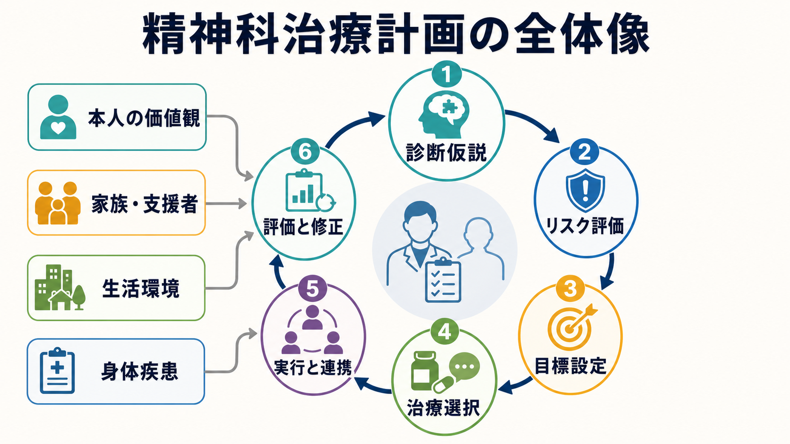
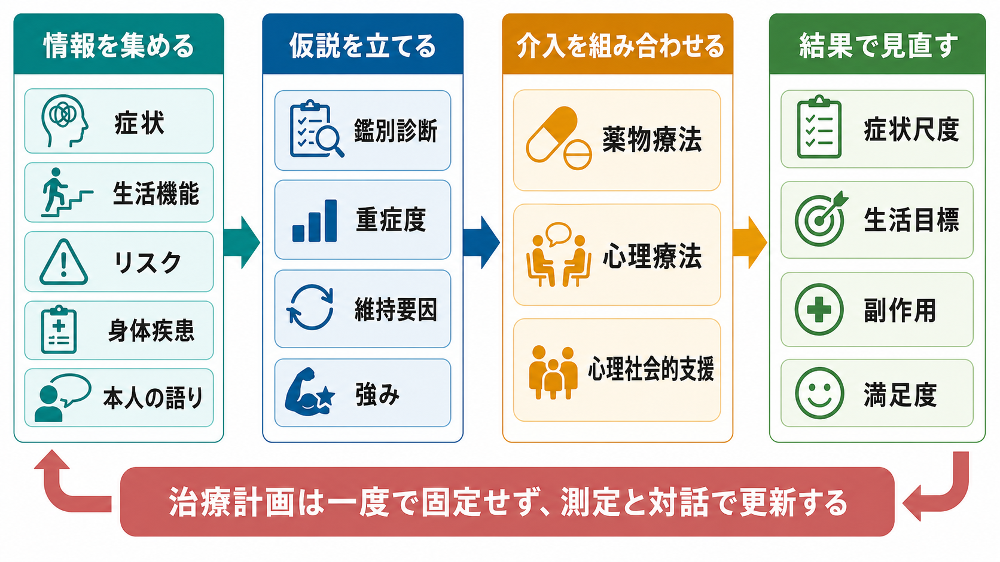
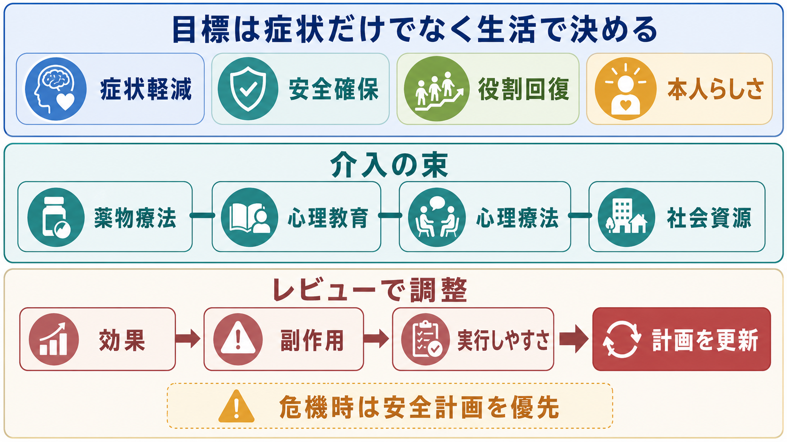

# 精神科治療計画はどのように立てるのか

## 要点

- 精神科治療計画は、診断名に対応する治療を機械的に選ぶ作業ではなく、[[精神科初診で何を確認するべきか|初期評価]]、[[鑑別診断とは何か|鑑別診断]]、リスク評価、生活機能、本人の価値観を統合して作る仮説である。
- 目標は「症状を下げる」だけでなく、安全、睡眠、役割、対人関係、学業・仕事、本人が望む生活を含めて設定する。
- 薬物療法、心理教育、心理療法、家族支援、社会資源は競合する選択肢ではなく、問題の維持要因に合わせて組み合わせる。
- 治療計画は固定文書ではない。効果、副作用、アドヒアランス、生活上の実行可能性を見ながら、測定と対話で更新する。

## この記事で答える問い

1. 精神科治療計画は、どの情報から始めるのか。
2. 診断仮説と治療目標はどうつなげるのか。
3. 薬物療法と心理社会的支援をどう統合するのか。
4. どのタイミングで計画を見直すのか。

## まず結論

精神科治療計画は、次の順で立てると整理しやすい。

1. **安全と緊急度を先に見る**  
   自殺・自傷、他害、虐待、せん妄、重い身体疾患、物質使用、生活破綻など、待てない問題を先に評価する。APA の成人精神科評価ガイドラインも、初期評価で自殺リスク、攻撃性リスク、身体健康、物質使用、文化的要因、症状と治療歴を系統的に扱うことを推奨している [1]。

2. **診断名ではなく診断仮説を置く**  
   初診時の診断はしばしば暫定的である。[[操作的診断とは何か|操作的診断]]で症状を整理しつつ、身体疾患、薬剤、物質使用、発達特性、心理社会的ストレス、トラウマ、家族歴を含めて「何が起きているのか」の仮説を置く。

3. **本人と共同で目標を決める**  
   NICE の共有意思決定ガイドラインは、治療選択では各選択肢の目的、リスク、利益、結果を説明し、本人の目標や優先順位と照らし合わせて共同で計画を決め、見直し時期も合意することを勧めている [2]。これは[[共同意思決定とは何か|共同意思決定]]の中核である。

4. **介入を束として組む**  
   薬物療法だけ、心理療法だけ、福祉支援だけで考えない。WHO mhGAP は、精神・神経・物質使用症のケアを臨床評価、心理社会的介入、薬物療法、フォローアップを含む統合的な流れとして提示している [3]。

5. **測って、聞いて、修正する**  
   症状尺度、生活機能、副作用、本人の満足度、家族・支援者の観察を使い、治療反応を可視化する。測定にもとづくケアは、とくにうつ病領域で症状改善や寛解に寄与する可能性が示されている [4]。

## 背景

精神科では、同じ診断名でも必要な治療計画が大きく異なる。たとえば「うつ状態」と表現される状態には、うつ病、双極性障害、適応反応、身体疾患、薬剤性症状、物質使用、発達特性に伴う二次的抑うつ、トラウマ反応などが含まれうる。したがって、治療計画は診断名のラベルから始めるより、[[精神科診断は何のためにあるのか|診断の目的]]、重症度、経過、機能障害、リスク、本人の困りごとを同時に扱う必要がある。

この考え方の背景には、[[生物心理社会モデルとは何か|生物心理社会モデル]]がある。Engel は、生物医学モデルだけでは心理的・社会的・行動的側面を十分に扱えないと論じ、疾患だけでなく病いの経験、環境、対人関係を含む枠組みを提案した [5]。精神科治療計画は、この多層性を臨床上の行動計画に落とし込む作業である。

## 基本概念

### 診断仮説

診断仮説とは、「現時点で最も説明力が高い見立て」と「まだ否定できない別の可能性」を分けて持つことである。ここでは、[[現病歴はどのように構造化するべきか|現病歴]]、[[生活歴はなぜ重要なのか|生活歴]]、[[家族歴から何がわかるのか|家族歴]]、発症年齢、発症様式、経過、誘因、維持因子、保護因子を整理する。

重要なのは、仮説を早く立てることではなく、仮説を更新できる形で記録することである。初診時点で不確実性が高い場合は、「除外すべき身体疾患」「数週間の経過で見直す点」「家族・学校・職場から追加確認する点」を明記する。

### 治療目標

治療目標は、短期・中期・長期に分けると扱いやすい。

| 時間軸 | 目標の例 | 評価方法 |
|---|---|---|
| 短期 | 睡眠の回復、自傷リスク低下、服薬開始、通院継続 | 睡眠記録、リスク評価、副作用確認 |
| 中期 | 症状軽減、生活リズム、家族との摩擦低下、復職・復学準備 | 症状尺度、生活機能、面接での振り返り |
| 長期 | 再発予防、役割回復、本人らしい生活、危機時の支援網 | 再発サイン、安全計画、支援者との共有 |

目標は医療者が一方的に決めるものではない。SAMHSA のリカバリー概念では、回復は健康、住まい、目的、地域とのつながりを含む個別的な変化の過程として整理される [6]。これは[[精神医学における回復とは何か|精神医学における回復]]を症状消失だけに狭めないために重要である。

### 介入の束

介入は「薬物療法か心理療法か」という二者択一ではなく、以下の束として設計する。

- 薬物療法: 症状、重症度、既往反応、副作用、身体疾患、妊娠可能性、併用薬、本人の希望を踏まえて選ぶ。
- 心理教育: 診断仮説、症状の仕組み、再発サイン、睡眠、ストレス、薬の役割を共有する。
- 心理療法・面接: 支持的面接、認知行動療法、対人関係への介入、トラウマインフォームドな支援などを状態に合わせる。
- 家族・支援者との連携: 本人の同意と守秘を前提に、危機時対応や生活支援を共有する。
- 社会資源: 休職・復職支援、就労支援、訪問看護、福祉制度、学校・職場調整、ピアサポートなどを検討する。

## 仕組み

治療計画の実務上の流れは、「情報収集」「仮説化」「選択」「実行」「レビュー」の循環である。

### 1. 情報を集める

まず、症状、経過、生活機能、身体疾患、物質使用、薬剤、リスク、支援者、本人の言葉を集める。ここでの面接は、質問票を埋めるだけでは不十分である。[[主訴はどのように聞くべきか|主訴]]、[[精神科面接とは何か|精神科面接]]、身体合併症、治療歴、アドヒアランス、本人が何を最も困っていると感じているかをつなげて読む。

### 2. 問題リストを作る

問題リストは診断名のリストではない。たとえば次のように書く。

- 抑うつ気分と希死念慮があり、睡眠障害で悪化している。
- 双極性障害、甲状腺疾患、薬剤性症状を除外する必要がある。
- 仕事の過負荷と孤立が維持要因になっている。
- 本人は「眠れるようになり、退職せずに働き方を調整したい」と希望している。
- 家族支援はあるが、病状理解にずれがある。

この段階で、[[自殺リスク評価では何を聞くべきか|自殺リスク評価]]や[[他害リスク評価では何を見るべきか|他害リスク評価]]が必要なら治療選択より先に扱う。

### 3. 治療仮説を立てる

治療仮説は、「どの介入が、どの維持要因を変え、どの目標に効くのか」を文章化することである。

例:

> 不眠と不安が抑うつを維持しているため、睡眠改善と不安軽減を短期目標にする。薬物療法は副作用を少なく開始し、心理教育で再発サインを共有する。職場負荷が維持因子なので、診断書や産業保健との連携を検討する。

この書き方にすると、後で「どこが効かなかったのか」を見直しやすい。

### 4. 本人と選ぶ

治療選択では、利益だけでなく不利益、代替案、何もしない選択、本人の優先順位を扱う。NICE の薬剤アドヒアランスガイドラインは、薬について患者の知識・信念・懸念を確認し、希望する関与の程度に合わせて意思決定を支えることを推奨している [7]。これは[[アドヒアランスとは何か|アドヒアランス]]を「従わせる」問題ではなく、[[コンコーダンスとは何か|コンコーダンス]]の問題として扱う視点につながる。

### 5. レビュー日を決める

計画には、最初から見直し日を入れる。薬物療法なら効果発現時期、副作用確認、増減量の判断点を置く。心理社会的支援なら、支援につながったか、本人が実行できたか、生活負荷が変わったかを確認する。

## 図解

治療計画では、症状の改善、安全、生活上の役割、本人らしさを同時に見る。危機時には安全計画が優先されるが、危機が落ち着いた後は、薬物療法、心理教育、心理療法、社会資源を組み合わせて、実行しやすい形へ調整する。

## 臨床・研究との接続

### 臨床での使い方

治療計画は、カルテ上の「方針」欄だけで完結しない。本人と共有され、必要に応じて家族、訪問看護、心理士、ソーシャルワーカー、学校、職場、地域支援者と分担される必要がある。NICE の成人精神保健サービス利用経験ガイドラインは、本人がケアプランと記録にアクセスでき、本人の見解や希望、医療者との意見の違いを記録できることを推奨している [8]。

実務では、次のような短いフォーマットが役に立つ。

| 項目 | 書くこと |
|---|---|
| 診断仮説 | 主診断、鑑別、除外すべき身体・薬剤・物質要因 |
| リスク | 自殺、自傷、他害、虐待、セルフネグレクト、身体危険 |
| 本人の目標 | 本人の言葉で書く |
| 介入 | 薬物、心理教育、心理療法、家族支援、社会資源 |
| 評価指標 | 症状尺度、睡眠、生活機能、副作用、満足度 |
| 見直し | 次回確認すること、悪化時の連絡先、危機時対応 |

### 研究との接続

研究では、治療計画の質を「症状が下がったか」だけで評価すると不十分である。症状、生活機能、QOL、治療継続、自己決定感、医療者との協働、家族負担、社会参加など、複数のアウトカムが必要になる。測定にもとづくケアの研究は、定期的な尺度評価を臨床判断に戻すことで治療の調整を早める発想を支えている [4]。

## よくある誤解

### 誤解1: 診断名が決まれば治療計画は自動的に決まる

診断名は治療計画の入口だが、十分条件ではない。同じ診断名でも、重症度、併存症、身体疾患、薬への希望、妊娠可能性、職場環境、家族支援、危機リスクによって計画は変わる。

### 誤解2: 治療目標は医療者が決める

医療者は医学的リスクと選択肢を説明する責任を持つが、何を優先するかは本人の価値観と切り離せない。[[インフォームドコンセントは精神科でどう行うのか|インフォームドコンセント]]と共同意思決定は、計画の中心である。

### 誤解3: 薬を出したら心理社会的支援は後回しでよい

薬物療法が重要な場面は多いが、睡眠、生活リズム、家族関係、孤立、経済問題、職場調整が維持要因なら、薬だけでは計画として不足する。[[心理教育とは何か|心理教育]]や[[家族への説明で何に注意するべきか|家族への説明]]も治療計画の一部である。

### 誤解4: アドヒアランス不良は本人の問題である

服薬しにくさには、副作用、費用、病識、説明不足、生活リズム、スティグマ、過去の治療体験、薬への信念が関わる。非難ではなく、何が障壁かを一緒に特定する必要がある [7]。

## 関連ノート

- [[精神科初診で何を確認するべきか]]
- [[精神科診断は何のためにあるのか]]
- [[鑑別診断とは何か]]
- [[自殺リスク評価では何を聞くべきか]]
- [[共同意思決定とは何か]]
- [[アドヒアランスとは何か]]
- [[コンコーダンスとは何か]]
- [[心理教育とは何か]]
- [[生物心理社会モデルとは何か]]
- [[精神医学における回復とは何か]]

## MOC更新候補

- `content/00_MOC/MOC｜精神医学.md`
- `content/00_MOC/MOC｜臨床実践・治療.md`

## 理解チェック

1. 診断名だけで治療計画を決めると、どのような情報が抜け落ちやすいか。
2. 「本人の目標」と「医学的目標」がずれるとき、どのように話し合うべきか。
3. 薬物療法、心理教育、心理療法、社会資源を組み合わせるとき、何を基準に優先順位をつけるか。
4. 治療計画の見直し時に、症状尺度以外に何を確認する必要があるか。

## 未解決問題

- 疾患横断的な治療計画テンプレートを、個別疾患ガイドラインとどう整合させるか。
- 測定にもとづくケアを日常診療に導入するとき、尺度疲れや入力負担をどう減らすか。
- 共同意思決定が困難な急性期、強制治療、判断能力低下の場面で、本人の価値観をどのように反映するか。

## 参考文献

[1] Silverman, J. J., Galanter, M., Jackson-Triche, M., et al. (2015). The American Psychiatric Association Practice Guidelines for the Psychiatric Evaluation of Adults. *American Journal of Psychiatry, 172*(8), 798-802. https://doi.org/10.1176/appi.ajp.2015.1720501

[2] National Institute for Health and Care Excellence. (2021). *Shared decision making (NICE guideline NG197).* https://www.nice.org.uk/guidance/ng197

[3] World Health Organization. (2016). *mhGAP Intervention Guide for mental, neurological and substance use disorders in non-specialized health settings: Version 2.0.* https://www.who.int/publications/i/item/9789241549790

[4] Zhu, M., Hong, R. H., Yang, T., et al. (2021). The efficacy of measurement-based care for depressive disorders: Systematic review and meta-analysis of randomized controlled trials. *Journal of Clinical Psychiatry, 82*(5), 21r14034. https://doi.org/10.4088/JCP.21r14034

[5] Engel, G. L. (1977). The need for a new medical model: A challenge for biomedicine. *Science, 196*(4286), 129-136. https://doi.org/10.1126/science.847460

[6] Substance Abuse and Mental Health Services Administration. (2012). *SAMHSA's working definition of recovery: 10 guiding principles of recovery.* https://library.samhsa.gov/product/samhsas-working-definition-recovery/pep12-recdef

[7] National Institute for Health and Care Excellence. (2009). *Medicines adherence: involving patients in decisions about prescribed medicines and supporting adherence (NICE clinical guideline CG76).* https://www.nice.org.uk/guidance/cg76

[8] National Institute for Health and Care Excellence. (2011). *Service user experience in adult mental health: improving the experience of care for people using adult NHS mental health services (NICE clinical guideline CG136).* https://www.nice.org.uk/guidance/cg136
