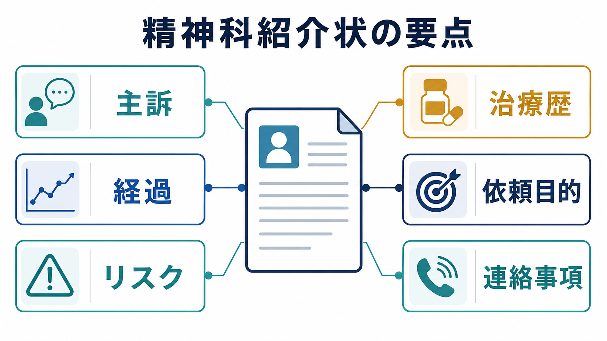
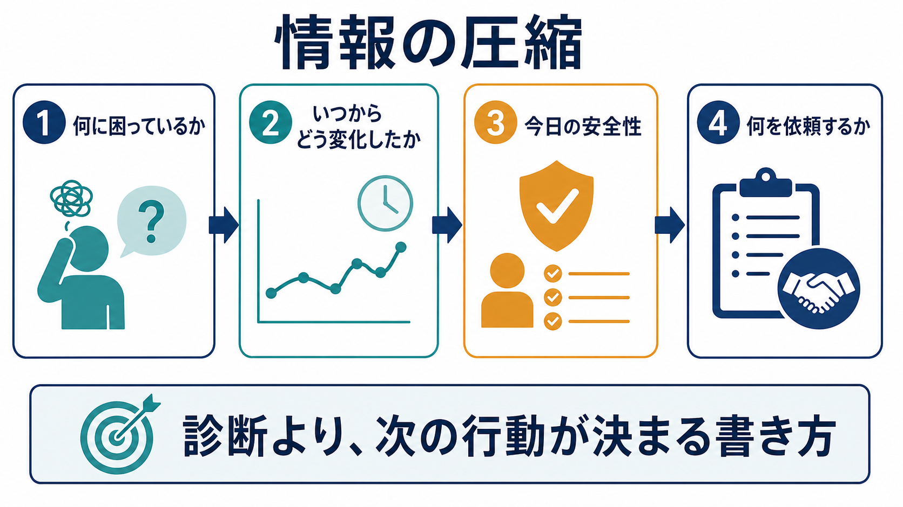
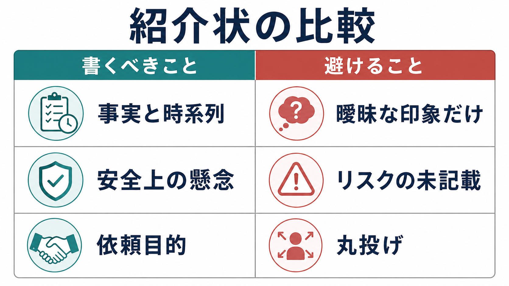

# 精神科紹介状には何を書くべきか

## 要点

- 精神科紹介状の目的は、診断名を当てることではなく、紹介先が「優先度」「安全性」「初回面接で確認すべきこと」「依頼された役割」を判断できる材料を渡すことである。
- 一般の診療情報提供書では、傷病名・紹介目的・既往歴と家族歴・症状経過と検査結果・治療経過・現在の処方・備考が基本項目になる[1][2]。
- 精神科ではこれに加えて、本人の困りごと、発症から現在までの時系列、生活機能、家族・職場・学校などの関係者、本人の希望、自傷・自殺・他害・虐待・せん妄・物質使用などの安全情報が重要になる[3][5][6]。
- よい紹介状は長い文章ではなく、「事実」「解釈」「依頼」を分けた短い記録である。曖昧な印象だけ、リスクの未記載、紹介目的の不明確さは避ける。
- 医療・精神医学に関する内容は教育・研究目的の整理であり、個別事例の診断や治療指示ではない。実際の記載は所属機関の様式、法令、地域連携ルールに従う。

## この記事で答える問い

1. 精神科紹介状に最低限入れるべき情報は何か。
2. 主訴・経過・リスク・治療歴・依頼目的を、紹介先が使いやすい形でどう書くか。
3. 「書くべきこと」と「避けること」はどこで分かれるか。

## まず結論

精神科紹介状は、次の順番で書くと読み手が判断しやすい。

1. **紹介目的**: 何を依頼したいのか。診断、薬物療法、リスク評価、入院適応、心理療法、家族支援、職場・学校連携など。
2. **主訴と受診理由**: 本人の言葉に近い困りごと、誰が受診・紹介を希望したか。
3. **経過**: いつから、何が、どのように変化し、現在どの程度生活に影響しているか。
4. **リスクと緊急性**: 自傷・自殺、他害、虐待、セルフネグレクト、せん妄、物質使用、身体疾患、服薬中断、保護因子。
5. **治療歴と現在の処方**: これまでの診断、薬剤、心理社会的支援、入院歴、効果、副作用、アドヒアランス。
6. **関係者と連絡事項**: 家族、支援者、職場・学校、同意の範囲、緊急連絡先、返書で知りたいこと。



## 背景

診療情報提供書は、紹介元と紹介先のあいだで診療情報を共有する文書である。日本の診療情報提供書の標準では、紹介目的、傷病名または主訴、既往歴、現病歴、治療経過、現在の処方、備考などが構造化されている[1][2]。これは精神科でも土台になる。

ただし精神科紹介状では、一般的な病歴だけでは足りないことがある。精神科専門医療への紹介状を多職種・患者代表を含めて検討した研究では、通常の紹介状項目に加えて、全体のケア計画、専門医療が担う役割、患者の希望や目標、関係機関の情報を重視すべきだとされた[3]。また、紹介状の情報だけで専門医療の優先度を判断すると、実際の診察での判断とずれる場合があるため、情報の質はアクセスやトリアージに関わる[4]。

したがって、精神科紹介状では「症状がある」だけでなく、「どの状況で困っているのか」「今日安全に帰れるのか」「紹介先に何をしてほしいのか」まで書く必要がある。

## 基本概念

### 主訴

[[主訴はどのように聞くべきか|主訴]]は、診断名ではなく、本人が今困っていることの入り口である。紹介状では、可能なら本人の言葉を短く残す。

例:

- 「眠れず、仕事に行けない」
- 「死にたい気持ちがある」
- 「家族から見て被害的な発言が増えた」
- 「薬を飲むべきか迷っている」

ここで大切なのは、本人の言葉と紹介元の観察を混ぜないことである。「本人は『眠れない』と訴える。一方で家族は、深夜の独語と浪費が増えたと述べる」のように分けると、紹介先は[[精神科初診で何を確認するべきか|初診]]で確認すべき点を立てやすい。

### 経過

[[現病歴はどのように構造化するべきか|現病歴]]は、時系列で書く。精神科では、発症時期、誘因、増悪・寛解、日内変動、睡眠、食欲、仕事・学業・家事への影響、対人関係の変化、物質使用、身体疾患や薬剤変更を一緒に見る。

短く書くなら、次の型が使いやすい。

> いつから / 何が / どの程度 / 何に影響し / 何を試し / 今どうなっているか

例:

> 2026年2月頃から不眠と不安が出現。3月以降は欠勤が週2-3回に増え、4月には出勤前に過呼吸様発作があり救急受診。内科検査で急性身体疾患は指摘されず、本人は休職相談と薬物療法の要否判断を希望している。

### リスク

精神科紹介状で最も省略してはいけないのは安全情報である。[[自殺リスク評価では何を聞くべきか|自殺リスク]]、[[他害リスク評価では何を見るべきか|他害リスク]]、虐待・DV、セルフネグレクト、せん妄、物質使用、急性精神病症状、重い身体合併症は、診断名より先に初動を変える。

NICEの自傷ガイドラインは、自傷後の評価で心理社会的評価、本人のニーズ、保護因子、今後の安全、家族・支援者との連携を重視し、単純な「低・中・高」のリスク分類だけで治療や退院を決めないよう勧めている[6]。WHO mhGAPも、うつ病、双極症、統合失調症、物質使用、急性の心理的苦痛などでは、自傷・自殺の考えや計画を初期評価で確認することを推奨している[7]。SAMHSAのSAFE-Tも、危険因子、保護因子、自殺念慮、リスク水準、介入と記録を段階的に整理する枠組みを示している[8]。

紹介状では、次のように「確認済み」「未確認」「不明」を分ける。

| 項目 | 書き方の例 |
|---|---|
| 自殺念慮 | 「希死念慮あり。具体的方法は否定。過去企図なし。妻に相談可能」 |
| 自傷 | 「前腕浅い切創が3回。縫合歴なし。直近は4月20日」 |
| 他害 | 「家族への暴言あり。身体的暴力は否定。刃物所持は未確認」 |
| セルフネグレクト | 「食事摂取低下、入浴週1回程度。水分摂取は保たれる」 |
| 物質使用 | 「飲酒量増加。焼酎約3合/日。離脱症状は未確認」 |
| 保護因子 | 「家族同居、受診意思あり、緊急時に母へ連絡可能」 |

### 治療歴

[[アドヒアランスとは何か|アドヒアランス]]や副作用は、薬剤名の羅列よりも有用なことが多い。処方薬、用量、開始日、中止日、効果、副作用、服薬状況、過去の心理療法、入院歴、救急受診歴、身体疾患、検査結果をまとめる。

例:

> セルトラリン25 mgを2026年3月に開始したが、悪心で3日後に自己中断。エチゾラム頓用は眠前に週3回程度使用。アルコール併用あり。心理療法歴なし。精神科入院歴なし。

### 依頼目的

紹介目的は「よろしくお願いします」ではなく、紹介先の役割が分かるように書く。

目的の例:

- 診断と治療方針の再評価
- 薬物療法の開始・調整
- 自殺リスク評価と安全計画
- 入院適応の判断
- 身体疾患・薬剤性精神症状の鑑別
- 家族面接、職場・学校との連携助言
- 心理療法や地域支援への接続

## 仕組み

紹介状は「情報を集める文書」ではなく、「次の行動を決める文書」である。紹介先が判断するのは、主に次の4点である。

1. どれくらい急いで診る必要があるか。
2. 初回面接で何を重点的に確認すべきか。
3. どの職種・機関と連携すべきか。
4. 紹介元に何を返せばケアが途切れないか。

このため、事実、推論、依頼を分けると誤解が減る。

| 層 | 内容 | 記載例 |
|---|---|---|
| 事実 | 本人・家族・紹介元が確認した情報 | 「4月以降、欠勤が増えた」「睡眠3時間」 |
| 推論 | 紹介元の臨床判断 | 「うつ病エピソードを疑うが、双極性障害の鑑別が必要」 |
| 依頼 | 紹介先に求める役割 | 「診断評価と薬物療法開始の可否を相談したい」 |



## 図解

紹介状の文章は、次のチェックリストに沿って圧縮するとよい。

| 区分 | 最低限書くこと | 省略しない理由 |
|---|---|---|
| 患者・連絡情報 | 氏名、生年月日、連絡先、紹介元、返書先、緊急連絡先 | 予約調整、緊急連絡、返書のため |
| 紹介目的 | 診断、治療、入院適応、リスク評価、連携助言など | 紹介先の役割を明確にするため |
| 主訴 | 本人の言葉、家族・支援者の懸念 | 初回面接の入口になるため |
| 経過 | 発症、増悪、現在の重症度、生活機能 | 優先度と鑑別を判断するため |
| リスク | 自傷・自殺、他害、虐待、物質使用、身体疾患、保護因子 | 初動と安全計画を変えるため |
| 治療歴 | 現在の処方、過去治療、効果、副作用、中断理由 | 重複処方や副作用再発を避けるため |
| 関係者 | 家族、職場、学校、支援機関、同意範囲 | 治療を生活の中で継続するため |



## 臨床・研究との接続

### トリアージ

専門医療では、紹介状の情報をもとに受診時期や診療枠を決める。紹介状の質とトリアージ判断の関係を調べた研究では、紹介状だけの判断と専門医が患者を診た後の判断が一致しない例があり、過小評価された群では高品質な紹介状の割合が低い傾向が示された[4]。これは、紹介状の出来が単なる事務手続きではなく、アクセスの公平性や安全性に影響しうることを示す。

### 初診面接

APAの成人精神科評価ガイドラインは、気分、不安、思考、知覚、認知、トラウマ歴、精神科既往、自殺念慮がある場合の計画・手段・理由・保護因子などを評価対象として整理している[5]。紹介状はこれらをすべて代替するものではないが、初診で重点的に確認すべき場所を示す地図になる。

### 地域連携

精神科診療は、外来診察だけで完結しにくい。家族、職場、学校、福祉、訪問看護、行政、救急、身体科との連携が必要になることがある。紹介状には「現在誰が関わっているか」「本人がどこまで情報共有に同意しているか」「緊急時に誰へ連絡するか」を短く書く。これは[[家族面接では何を評価するべきか|家族面接]]や[[精神科で生活機能をどう評価するか|生活機能評価]]にも直結する。

## よくある誤解

### 「診断名が分からないと紹介できない」

診断名が確定していなくても紹介できる。むしろ精神科紹介状では、「うつ病疑い」よりも、発症時期、睡眠、食欲、活動性、希死念慮、躁症状、精神病症状、物質使用、身体疾患、薬剤変更、生活機能を示す方が有用である。診断は紹介先で更新されうる仮説である。

### 「短いほどよい」

短いこと自体が目的ではない。必要な情報が抜けた短文は、むしろ確認コストを増やす。よい紹介状は、必要な項目が見出しで整理され、不要な形容詞や推測が少ない文書である。

### 「リスクは高いときだけ書けばよい」

高いときだけでは不十分である。「確認したが否定」「未確認」「不明」を分けて書くと、紹介先は再確認の優先順位を立てられる。特に自傷・自殺、他害、虐待、物質使用、せん妄、身体疾患は、陰性情報にも意味がある。

### 「家族の話は本人の話より優先される」

本人の主観と家族・支援者の観察はどちらも重要だが、同じ種類の情報ではない。本人の訴え、家族の懸念、紹介元の観察、紹介元の判断を分けて書くことで、[[共同意思決定とは何か|共同意思決定]]を妨げにくくなる。

## 記載テンプレート

```text
紹介目的:
  例: 診断評価、薬物療法の要否、自殺リスク評価、入院適応、家族支援について相談。

主訴・受診理由:
  本人の言葉:
  家族・支援者の懸念:
  紹介に至った理由:

現病歴・経過:
  発症時期:
  経過:
  現在の症状:
  生活機能への影響:
  誘因・増悪因子:

安全情報:
  自傷・自殺:
  他害:
  虐待・DV・セルフネグレクト:
  物質使用:
  身体疾患・薬剤性の懸念:
  保護因子・支援者:

既往歴・治療歴:
  精神科既往:
  身体疾患:
  現在の処方:
  過去治療と反応:
  副作用・アレルギー:
  服薬状況:

関係者・連絡事項:
  家族・支援機関:
  情報共有への同意範囲:
  緊急連絡先:
  返書で知りたいこと:
```

## 関連ノート

既存ノート:

- [[精神科初診で何を確認するべきか]]
- [[主訴はどのように聞くべきか]]
- [[現病歴はどのように構造化するべきか]]
- [[自殺リスク評価では何を聞くべきか]]
- [[他害リスク評価では何を見るべきか]]
- [[物質使用歴はどのように聞くべきか]]
- [[精神科診断における除外診断とは何か]]
- [[ケースフォーミュレーションとは何か]]
- [[アドヒアランスとは何か]]
- [[共同意思決定とは何か]]

MOC更新候補:

- `content/00_MOC/` 配下の精神医学、診断、面接、臨床実践関連MOCに `[[精神科紹介状には何を書くべきか]]` を追加する。
- 並列ジョブとの競合を避けるため、このタスクではMOC本文を更新しない。

今後の作成候補:

- 「精神科返書には何を書くべきか」
- 「精神科連携で緊急性をどう伝えるか」
- 「家族や職場からの情報提供を紹介状でどう扱うか」
- 「精神科紹介状の悪い例と改善例」

## 理解チェック

1. 精神科紹介状で「診断名」より先に、紹介先が知りたいことは何か。
2. 主訴、家族の懸念、紹介元の判断を分けて書く利点は何か。
3. 自傷・自殺リスクについて、「否定」「未確認」「不明」を分けるべき理由は何か。
4. 治療歴を書くとき、薬剤名だけでなく効果・副作用・中断理由を書く利点は何か。
5. 「よろしくお願いします」ではなく、依頼目的を具体化すると何が変わるか。

## 参考文献

[1] 保健医療福祉情報システム工業会. (2006). *患者診療情報提供書規格 HL7J-CDA-001*. https://www.hl7.jp/intro/std/HL7J-CDA-001.pdf

[2] 日本医療情報学会 NeXEHRS課題研究会. (2025). *電子カルテ情報共有サービス 2文書5情報+患者サマリー FHIR実装ガイド JP-CLINS: 診療情報提供書*. https://jpfhir.jp/fhir/clins/igv1/referral-doc.html

[3] Hartveit, M., Thorsen, O., Biringer, E., Vanhaecht, K., Carlsen, B., & Aslaksen, A. (2013). Recommended content of referral letters from general practitioners to specialised mental health care: A qualitative multi-perspective study. *BMC Health Services Research, 13*, 329. https://doi.org/10.1186/1472-6963-13-329

[4] Nymoen, M., Biringer, E., Hetlevik, O., Thorsen, O., Assmus, J., & Hartveit, M. (2022). The impact of referral letter quality on timely access to specialised mental health care: A quantitative study of the reliability of patient triage. *BMC Health Services Research, 22*, 735. https://doi.org/10.1186/s12913-022-08139-3

[5] Silverman, J. J., Galanter, M., Jackson-Triche, M., Jacobs, D. G., Lomax, J. W., Riba, M. B., Tong, L. D., Watkins, K. E., Fochtmann, L. J., Rhoads, R. S., & Yager, J. (2015). The American Psychiatric Association Practice Guidelines for the Psychiatric Evaluation of Adults. *American Journal of Psychiatry, 172*(8), 798-802. https://doi.org/10.1176/appi.ajp.2015.1720501

[6] National Institute for Health and Care Excellence. (2022). *Self-harm: assessment, management and preventing recurrence* (NICE guideline NG225). https://www.nice.org.uk/guidance/ng225

[7] World Health Organization. (2015). *Assessment for self-harm/suicide in persons with priority mental, neurological and substance use disorders*. mhGAP Evidence Resource Centre. https://www.who.int/teams/mental-health-and-substance-use/treatment-care/mental-health-gap-action-programme/evidence-centre/self-harm-and-suicide/assessment-for-self-harm-suicide-in-persons-with-priority-mental-neurological-and-substance-use-disorders

[8] Substance Abuse and Mental Health Services Administration. (2024). *SAFE-T Suicide Assessment Five-Step Evaluation and Triage*. https://library.samhsa.gov/product/safe-t-suicide-assessment-five-step-evaluation-and-triage/pep24-01-036

## 未解決問題

- 日本の精神科紹介状で、救急・地域連携・学校職場連携ごとに最小必須項目をどこまで標準化できるか。
- 電子カルテの構造化項目と、本人の語りや関係者情報をどう両立させるか。
- 紹介状の質が、待機期間、初診後の継続率、安全計画、患者満足度にどの程度影響するか。
