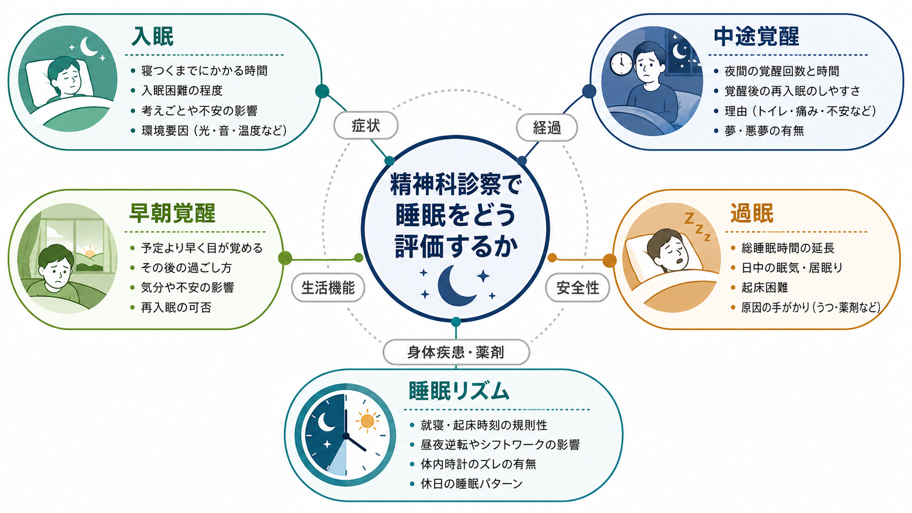
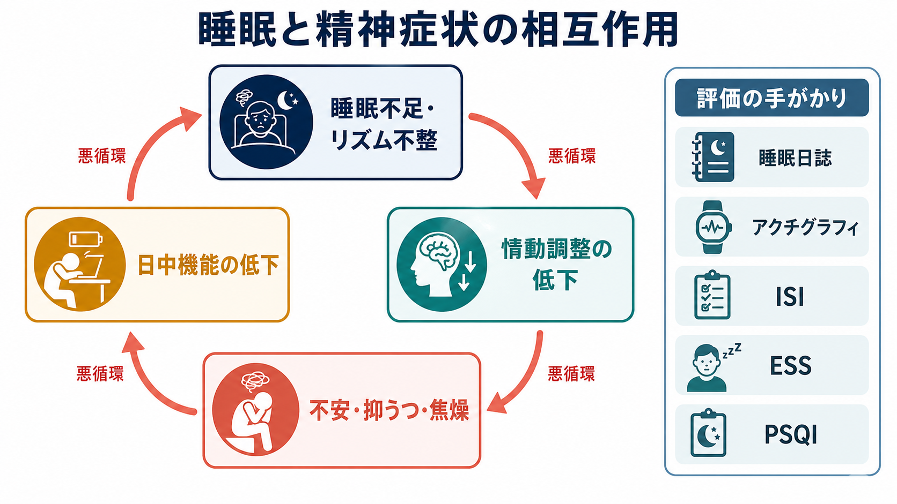

# 精神科診察で睡眠をどう評価するか

## 要点

- 睡眠評価は「眠れますか」では足りない。入眠、中途覚醒、早朝覚醒、過眠、睡眠リズム、日中機能を分けて聞く。
- 不眠は精神疾患の単なる随伴症状ではなく、うつ、不安、精神病症状、物質使用、情動調整、生活機能を悪化させうる横断的プロセスとして扱う[1][2]。
- 早朝覚醒や過眠は抑うつ症状の評価に関わる一方、「睡眠時間が短いのに元気」という訴えは躁・軽躁の評価で重要になる[8]。
- 睡眠リズムの乱れは、本人の意志の弱さではなく、体内時計、光、活動、学校・仕事、シフト、スマートフォン使用、薬剤、身体疾患が絡む現象として整理する[4]。
- 精神科診察では、睡眠日誌、ISI、PSQI、ESS、必要時のアクチグラフィや睡眠検査を、診断名ではなく臨床疑問に合わせて使う[3][5][6][7]。

## この記事で答える問い

1. 精神科初診・再診で、睡眠をどの順番で聞けばよいか。
2. 入眠困難、中途覚醒、早朝覚醒、過眠、睡眠リズムの乱れを、症状理解にどう結びつけるか。
3. どの時点で尺度、睡眠日誌、アクチグラフィ、睡眠専門評価を考えるか。
4. 睡眠の訴えを、うつ病、不安症、双極症、物質使用、身体疾患、薬剤影響とどう切り分けるか。

## まず結論

精神科診察で睡眠を評価するときは、睡眠を一つの症状としてではなく、時間軸をもつ生活現象として扱う。最初に「いつ寝床に入り、いつ眠り、何回起き、何時に起き、日中どう困るか」を具体的に聞く。次に、その睡眠パターンが、気分、不安、焦燥、幻覚妄想、物質使用、自殺リスク、仕事・学校、家族関係、身体疾患、薬剤とどう連動しているかを見る。

この順番にすると、睡眠は診断名を当てるための付属情報ではなく、[[カテゴリ診断と次元診断は何が違うのか|次元的評価]]、[[併存症とは何か|併存症評価]]、治療目標、再発予防をつなぐ軸になる。

## 背景

睡眠の訴えは精神科で非常に多い。うつ病では不眠または過眠が診断基準上の症状として扱われ、躁・軽躁では「睡眠欲求の低下」が重要な手がかりになる[8]。しかし、睡眠問題は特定の診断名だけに閉じない。レビューでは、不眠は多くの精神疾患に併存し、発症・経過・再発・日中機能に関わる横断的な臨床標的として整理されている[1][2]。

この点は、[[精神疾患とは何か]]を固定的な病名だけでなく、症状、機能、生活史、環境との相互作用として見る姿勢と合う。睡眠が崩れると、情動調整、注意、記憶、対人反応、衝動制御が乱れやすい。反対に、不安、抑うつ、過覚醒、幻覚妄想、疼痛、カフェイン、アルコール、薬剤も睡眠を乱す。したがって、睡眠評価は原因探しだけでなく、現在の悪循環の地図を作る作業である。

## 基本概念

### 入眠困難

入眠困難では、「寝床に入る時刻」と「眠ろうとし始める時刻」と「実際に眠る時刻」を分ける。寝床で長くスマートフォンを見る、翌日の心配を反復する、眠れないことへの不安が強い、夕方以降のカフェインや昼寝が多い、就寝時刻が日によって大きく変わる、などを確認する。

臨床的には、不安、抑うつ、PTSD、強迫的反すう、発達特性、疼痛、アカシジア、薬剤性賦活、カフェイン、アルコール離脱、睡眠相後退を区別する。単に「不眠」とまとめると、介入点が見えなくなる。

### 中途覚醒

中途覚醒では、回数、覚醒時間、再入眠のしやすさ、覚醒理由を聞く。トイレ、疼痛、息苦しさ、悪夢、動悸、パニック、物音、家族の生活音、飲酒後の浅眠、睡眠時無呼吸の可能性を分ける。

不眠症状が主訴でも、強いいびき、無呼吸の目撃、起床時頭痛、日中の眠気、高血圧、肥満、夜間の窒息感がある場合は、閉塞性睡眠時無呼吸を考える。AASM の成人 OSA 診断ガイドラインは、疑いがある場合に包括的な睡眠評価と、ポリソムノグラフィまたは適切な在宅睡眠時無呼吸検査を組み合わせることを推奨している[7]。

### 早朝覚醒

早朝覚醒では、「予定よりどれくらい早いか」「その後眠れるか」「起きた後の気分がどうか」を聞く。抑うつでは早朝覚醒、朝の気分不良、日内変動がまとまって現れることがある。一方で、高齢者や朝型傾向、生活スケジュール、光曝露、睡眠相前進でも早朝覚醒は起こる。

早朝覚醒をすぐに「うつの証拠」と決めず、興味低下、罪責感、希死念慮、食欲変化、精神運動制止、疲労、集中困難と合わせて評価する。これは[[ストレス脆弱性モデルとは何か]]でいう負荷と脆弱性の相互作用を見る作業でもある。

### 過眠

過眠では、総睡眠時間、昼寝、居眠り、起床困難、眠気と疲労感の区別を確認する。患者が「眠い」と言うとき、それが睡眠不足による眠気なのか、抑うつ性の活動低下なのか、薬剤性鎮静なのか、睡眠時無呼吸やナルコレプシーなどの睡眠障害なのかは異なる。

抑うつでは不眠だけでなく過眠もみられる。とくに若年者や非定型的な抑うつでは、過眠、食欲増加、鉛様麻痺感、拒絶過敏性が目立つことがある。日中の眠気を定量化したいときは ESS、睡眠の質を広く見るときは PSQI、不眠の重症度と治療反応を追うときは ISI が候補になる[5][6]。

### 睡眠リズム

睡眠リズムでは、平日と休日の就寝・起床時刻、シフト勤務、夜勤、登校・出勤の困難、昼夜逆転、光曝露、運動、食事時刻を聞く。概日リズム睡眠・覚醒障害では、睡眠の質そのものは保たれていても、社会的に必要な時刻に眠れない・起きられないことが主問題になる[4]。

AASM の概日リズム睡眠・覚醒障害ガイドラインでは、睡眠日誌や可能な場合のアクチグラフィによる複数日の記録が、睡眠覚醒パターンを確認するうえで重要とされる[4]。これは精神科でも有用で、本人の記憶だけに頼るより、生活リズムと症状の同期を見やすくなる。

## 仕組み

睡眠と精神症状の関係は、単純な一方向因果ではない。睡眠不足やリズム不整は、前頭前野による情動調整、注意、報酬処理、ストレス反応に影響し、不安、抑うつ、焦燥、衝動性を強めうる[2]。その結果、日中の失敗体験、対人摩擦、回避、活動低下が増え、夜には反すうや過覚醒が強くなり、さらに眠れなくなる。

この悪循環は、[[生物心理社会モデルとは何か]]の典型例である。生物学的には睡眠圧、概日リズム、神経伝達、疼痛、薬剤が関わる。心理的には反すう、心配、トラウマ記憶、眠れないことへの恐怖が関わる。社会的には勤務時間、家族役割、経済的不安、住環境、孤立が関わる。診察では、どの層が主要因かを一度で決めるより、悪循環のどこに介入できるかを探す。

## 図解

図1は、睡眠評価を「入眠」「中途覚醒」「早朝覚醒」「過眠」「睡眠リズム」に分け、それぞれを症状、経過、生活機能、安全性、身体疾患・薬剤と結びつける見取り図である。診察では、この全体像を一度に聞き切る必要はない。初診では安全性と鑑別に必要な情報を優先し、再診で睡眠日誌や尺度を使って精度を上げる。

図2は、睡眠不足・リズム不整、情動調整の低下、不安・抑うつ・焦燥、日中機能低下が循環する様子を示す。ここで重要なのは、睡眠問題を「背景症状」として放置しないことである。不眠に対する認知行動療法は、慢性不眠に対して最も支持される心理・行動的治療として推奨されており、睡眠を改善することが併存する精神症状の軽減にもつながりうる[1][2]。

## 臨床・研究との接続

### 面接で使う最小セット

初診では、次の順番が実用的である。

| 評価項目 | 聞き方の例 | 見たいこと |
|---|---|---|
| 睡眠機会 | 何時に寝床に入り、何時に起きますか | 睡眠不足か、不眠か、リズム問題か |
| 入眠 | 眠るまでどのくらいかかりますか | 不安、反すう、睡眠相後退、薬剤性賦活 |
| 維持 | 夜中に何回、どのくらい起きますか | 疼痛、悪夢、飲酒、OSA、パニック |
| 早朝覚醒 | 予定より早く目が覚めますか | 抑うつ、睡眠相前進、生活要因 |
| 過眠・眠気 | 日中に寝落ちしますか、疲労感ですか | 過眠、薬剤性鎮静、OSA、抑うつ |
| リズム | 平日と休日で何時間ずれますか | 概日リズム、シフト、社会的時差 |
| 日中機能 | 仕事・学校・家事にどう響きますか | 重症度、介入目標 |
| 安全性 | 運転、希死念慮、衝動性はありますか | 緊急性、支援の必要性 |

### 尺度と記録の使い分け

睡眠日誌は、本人の体験を日単位で可視化する。Consensus Sleep Diary は、就床時刻、入眠潜時、覚醒、最終覚醒、起床、昼寝、睡眠の質などを標準化して記録する枠組みとして提案された[3]。不眠治療や生活リズム調整では、記憶に頼るより日誌のほうが介入点を共有しやすい。

PSQI は過去 1 か月の睡眠の質を広く評価する尺度で、精神科臨床・研究で使われてきた[5]。ISI は不眠の重症度と苦痛、日中影響、治療反応を追うのに向く[6]。ESS は日中の眠気を扱うが、眠気の高さだけで睡眠時無呼吸を診断できるわけではない。OSA が疑われる場合、問診票や予測式だけで診断せず、適切な睡眠検査につなぐ必要がある[7]。

### 薬剤・物質の確認

睡眠の評価では、処方薬、市販薬、サプリメント、アルコール、カフェイン、ニコチン、覚醒剤、睡眠薬の使用パターンを必ず確認する。抗うつ薬、抗精神病薬、気分安定薬、ベンゾジアゼピン系薬、抗ヒスタミン薬、ステロイド、甲状腺ホルモン、ADHD 治療薬などは、眠気、不眠、悪夢、睡眠構造、日中機能に影響しうる。

この確認は、薬を責めるためではない。[[アドヒアランスとは何か]]や[[共同意思決定とは何か]]の観点から、本人が何を困っているか、どの効果と副作用を重視するかを共有するためである。

### リスク評価

睡眠不足は、自殺念慮、衝動性、事故、物質使用、家庭内トラブルを悪化させることがある。特に「眠れていないが疲れていない」「数時間睡眠で活動量が増えている」「浪費・性的逸脱・攻撃性・誇大感がある」場合は、単なる不眠ではなく躁・軽躁の評価が必要である[8]。反対に、強い不眠と焦燥が希死念慮に結びつく場合は、安全確保、家族・支援者との連携、受診間隔の調整を検討する。

## よくある誤解

### 「眠れないなら睡眠薬を出せばよい」

睡眠薬が必要な場面はあるが、最初にすることは睡眠の型、原因、リスクを分けることである。慢性不眠では CBT-I が強く推奨され、睡眠衛生だけを単独治療として用いることは推奨されにくい[1]。薬物療法を考える場合も、診断、年齢、転倒リスク、呼吸障害、物質使用、依存リスク、翌日の眠気を評価する。

### 「早朝覚醒があればうつ病である」

早朝覚醒はうつ病評価の重要な手がかりだが、それだけで診断はできない。睡眠相前進、加齢、生活スケジュール、疼痛、アルコール、身体疾患でも起こる。抑うつ気分、興味低下、食欲、疲労、罪責感、集中困難、希死念慮、機能障害と合わせて見る。

### 「昼夜逆転は本人の怠けである」

睡眠リズムの乱れは、概日リズム、光、活動、社会的スケジュール、精神症状、薬剤、身体疾患の相互作用で生じる。本人の努力不足と決めつけると、評価も治療同盟も崩れる。睡眠日誌やアクチグラフィで実際のパターンを見て、固定できる起床時刻、朝の光、日中活動、夜の刺激、学校・職場調整を検討する[4]。

### 「眠気と疲労感は同じである」

眠気は眠り込む傾向であり、疲労感はエネルギー不足やだるさとして訴えられることが多い。両者は重なるが、鑑別は違う。眠気が強ければ睡眠不足、睡眠時無呼吸、過眠症、薬剤性鎮静を考える。疲労感が中心なら、抑うつ、身体疾患、貧血、甲状腺疾患、慢性疼痛、過負荷も評価する。

## 関連ノート

- [[併存症とは何か]]
- [[カテゴリ診断と次元診断は何が違うのか]]
- [[ストレス脆弱性モデルとは何か]]
- [[生物心理社会モデルとは何か]]
- [[共同意思決定とは何か]]
- [[アドヒアランスとは何か]]
- [[脳波EEGは何を測っているのか]]
- [[脳波の周波数帯域にはどのような意味があるのか]]

MOC 更新候補: `content/00_MOC/` 配下の精神医学・臨床実践系 MOC に、バッチ統合時に追加する。

## 理解チェック

1. 入眠困難、中途覚醒、早朝覚醒を分けて聞くと、どのような鑑別や介入点が見えやすくなるか。
2. 「眠れていないが疲れていない」という訴えが、不眠症状だけでなく躁・軽躁評価につながる理由は何か。
3. 睡眠日誌、PSQI、ISI、ESS は、それぞれどの臨床疑問に向いているか。
4. 睡眠時無呼吸を、問診票だけで診断してはいけない理由は何か。
5. 睡眠リズムの乱れを「本人の怠け」と見なすと、診察上どのような問題が起こるか。

## 参考文献

[1] Edinger JD, Arnedt JT, Bertisch SM, et al. (2021). Behavioral and psychological treatments for chronic insomnia disorder in adults: an American Academy of Sleep Medicine clinical practice guideline. *Journal of Clinical Sleep Medicine*, 17(2), 255-262. https://doi.org/10.5664/jcsm.8986

[2] Freeman D, Sheaves B, Waite F, Harvey AG, Harrison PJ. (2020). Sleep disturbance and psychiatric disorders. *The Lancet Psychiatry*, 7(7), 628-637. https://pubmed.ncbi.nlm.nih.gov/32563308/

[3] Carney CE, Buysse DJ, Ancoli-Israel S, et al. (2012). The consensus sleep diary: standardizing prospective sleep self-monitoring. *Sleep*, 35(2), 287-302. https://doi.org/10.5665/sleep.1642

[4] Auger RR, Burgess HJ, Emens JS, Deriy LV, Thomas SM, Sharkey KM. (2015). Clinical practice guideline for the treatment of intrinsic circadian rhythm sleep-wake disorders. *Journal of Clinical Sleep Medicine*, 11(10), 1199-1236. https://doi.org/10.5664/jcsm.5100

[5] Buysse DJ, Reynolds CF 3rd, Monk TH, Berman SR, Kupfer DJ. (1989). The Pittsburgh Sleep Quality Index: a new instrument for psychiatric practice and research. *Psychiatry Research*, 28(2), 193-213. https://doi.org/10.1016/0165-1781(89)90047-4

[6] Morin CM, Belleville G, Belanger L, Ivers H. (2011). The Insomnia Severity Index: psychometric indicators to detect insomnia cases and evaluate treatment response. *Sleep*, 34(5), 601-608. https://doi.org/10.1093/sleep/34.5.601

[7] Kapur VK, Auckley DH, Chowdhuri S, et al. (2017). Clinical practice guideline for diagnostic testing for adult obstructive sleep apnea. *Journal of Clinical Sleep Medicine*, 13(3), 479-504. https://doi.org/10.5664/jcsm.6506

[8] Substance Abuse and Mental Health Services Administration. (2016). *DSM-5 Changes: Implications for Child Serious Emotional Disturbance*. NCBI Bookshelf. Major depressive episode and manic episode criteria tables. https://www.ncbi.nlm.nih.gov/books/NBK519712/

## 未解決問題

- 精神科一般外来で、睡眠日誌やアクチグラフィをどの程度ルーチン化できるか。
- 不眠、過眠、概日リズム不整を、診断横断的な治療標的としてどの順に扱うのがよいか。
- 睡眠介入が、希死念慮、再発、服薬継続、就労・就学機能にどの程度波及するか。
- デジタル睡眠計測を、過信せず臨床面接に統合する実践手順は何か。
