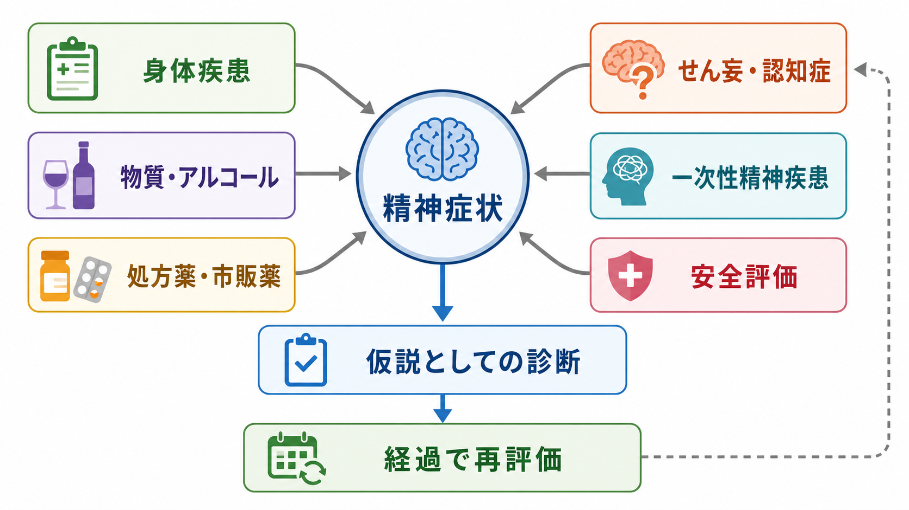
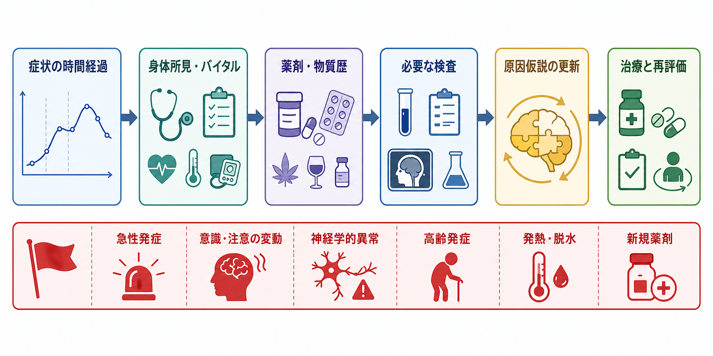
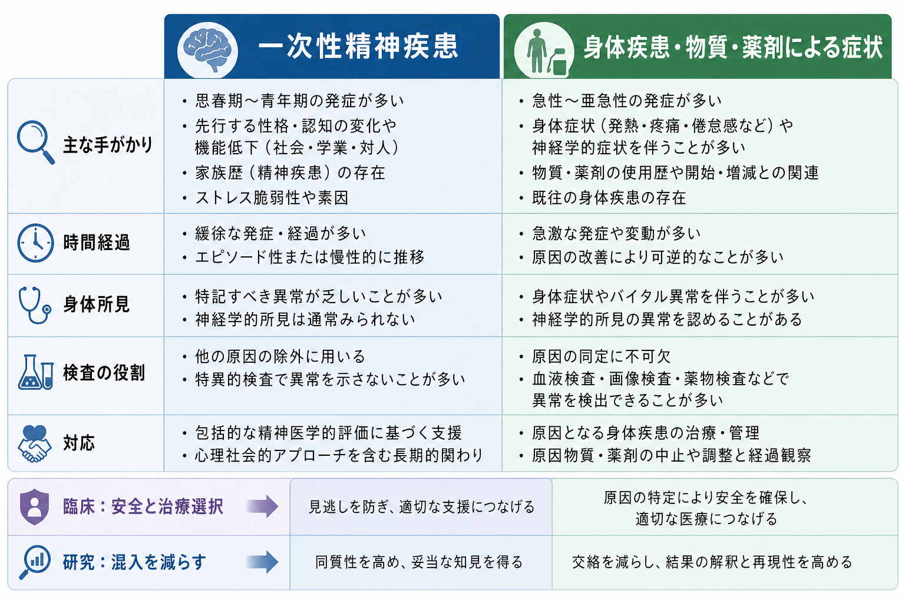

# 精神科診断における除外診断とは何か

## 要点

- 精神科診断における除外診断とは、「精神症状に見えるもの」が、身体疾患、物質・アルコール、処方薬・市販薬、せん妄、神経認知障害などでよりよく説明されないかを系統的に確認する姿勢である。
- これは「検査で異常がなければ精神疾患」と決める作業ではない。病歴、経過、身体所見、精神状態診察、物質・薬剤歴、必要な検査、家族や支援者からの情報を統合して、診断仮説を更新する作業である[1][2][3]。
- 急性発症、意識・注意の変動、発熱、脱水、神経学的異常、高齢発症、新規薬剤、物質使用や離脱の可能性は、身体疾患や物質・薬剤性の原因を優先して考える手がかりになる[4][5]。
- 除外診断は、一次性精神疾患を軽視するためではなく、可逆的・緊急性の高い原因を見逃さず、その人に合った治療と支援につなげるための安全確認である。

## この記事で答える問い

1. 精神科診断で「除外診断」とは何を意味するのか。
2. 身体疾患、物質、薬剤による症状をどのように考えるのか。
3. どのような場合に、より強く身体的評価や緊急評価を考えるべきか。
4. 除外診断と、[[精神疾患とは何か]]、[[精神医学は他の医学分野と何が違うのか]]、[[生物心理社会モデルとは何か]]はどう接続するのか。

## まず結論

精神科診断における除外診断は、「精神疾患ではないものを機械的に消していく作業」ではない。より正確には、症状を生み出している可能性のある複数の説明を並べ、危険度と可逆性の高いものから確認し、診断仮説を経過の中で更新する臨床推論である。

DSM-5-TR では、多くの診断で「物質・薬剤の生理学的作用」や「他の医学的状態」によって説明されないことが重要な条件として置かれる[1]。ICD-11 CDDR も、臨床現場で精神・行動・神経発達症を同定するための標準化された記述と診断要件を提供し、文化、ライフスパン、身体状態との関係を含む臨床的文脈を重視する[2]。したがって除外診断は、精神医学を身体医学から切り離すためではなく、精神症状を医学全体の中に位置づけるための手続きである。

## 背景

精神症状は、脳だけでなく全身状態の変化を通じても現れる。感染症、低血糖、電解質異常、甲状腺機能異常、肝腎機能障害、自己免疫性脳炎、脳血管障害、てんかん、睡眠不足、疼痛、薬剤性副作用、アルコールやベンゾジアゼピンの離脱などは、不安、抑うつ、幻覚、妄想、興奮、認知機能低下、人格変化のように見える症状を起こしうる[4]。

この点は、[[正常と異常はどこで分けられるのか]]という問題とも関係する。精神科診断は、単に症状の数を数えるだけではなく、発症時期、持続、重症度、生活機能、苦痛、文化的文脈、身体状態、安全性を含めて判断される。除外診断は、その判断の中で「見逃すと危険な別説明」を丁寧に扱う部分である。

## 基本概念

### 除外診断

除外診断とは、ある診断を考える前提として、より妥当な別の原因を検討することである。精神科では特に、次の三つが重要になる。

| 観点 | 代表例 | 見逃した場合の問題 |
|---|---|---|
| 身体疾患 | 低血糖、甲状腺疾患、感染症、脳血管障害、てんかん、自己免疫性脳炎 | 緊急治療が遅れる、可逆的原因を逃す |
| 物質 | アルコール、覚醒剤、大麻、鎮静薬、オピオイド、離脱状態 | 中毒・離脱・併存症への対応が遅れる |
| 薬剤 | ステロイド、抗コリン薬、鎮静薬、抗てんかん薬、抗うつ薬、抗精神病薬など | 副作用や相互作用を精神疾患の悪化と誤認する |

ただし「身体疾患があれば精神疾患ではない」という意味ではない。身体疾患と精神疾患は併存しうるし、物質使用があっても一次性精神疾患が同時に存在することがある。NICE は、精神病と物質使用が併存する場合にも、片方の問題を理由にもう片方のケアから除外しないことを明確にしている[6]。

### 鑑別診断との違い

鑑別診断は、似た症状を示す複数の診断候補を比較する広い作業である。除外診断はその中でも、「この診断をつける前に、別の医学的・物質性・薬剤性の説明を十分に検討したか」に焦点を当てる。

たとえば抑うつ気分がある場合、うつ病だけでなく、甲状腺機能低下、貧血、慢性疼痛、睡眠障害、薬剤性、アルコール使用、認知症初期、双極症の抑うつエピソードなどを考える。幻覚や妄想がある場合も、統合失調症だけでなく、せん妄、物質中毒、離脱、てんかん、脳腫瘍、自己免疫性脳炎、感覚障害、認知症などを検討する[4]。

## 仕組み

除外診断は、次のような順序で考えると整理しやすい。

### 1. 時間経過を見る

まず、症状がいつ始まり、どの速さで変化し、何をきっかけに悪化・改善したかを見る。急性発症や日内変動、数時間から数日単位の揺れは、せん妄、物質中毒・離脱、感染症、代謝異常、薬剤性などを強く考える手がかりになる[4][5]。

### 2. 意識・注意・認知を確認する

せん妄では、意識や注意の障害、認知や知覚の変化が急性に出現し、変動することが多い。NICE は、せん妄リスクのある成人では、認知、知覚、身体機能、社会的行動の最近の変化を評価することを重視している[5]。精神科診断では、幻覚や興奮の内容だけでなく、「注意を保てるか」「見当識が保たれているか」「眠気や覚醒水準の変動があるか」を見る必要がある。

### 3. 身体所見とバイタルサインを見る

発熱、頻脈、血圧異常、低酸素、脱水、神経学的異常、歩行障害、項部硬直、頭痛、失禁、皮膚所見などは、身体疾患を示す手がかりになる。Merck Manual は、新規発症、既存の精神疾患と質的に異なる症状、年齢や特徴から見て非典型的な症状では、病歴、身体診察、必要に応じた検査や画像検査による医学的評価を求めている[4]。

### 4. 物質・薬剤歴を具体的に聞く

物質使用は、本人が「問題」と認識していない場合もある。アルコール、処方薬、睡眠薬、抗不安薬、市販薬、サプリメント、カフェイン、違法薬物、最近の増量・中止・飲み忘れを具体的に確認する。DSM-5-TR では物質関連障害について、使用障害だけでなく、中毒、離脱、物質・薬剤誘発性精神障害を区別して整理している[1]。

### 5. 検査は「全員に同じセット」ではなく仮説で選ぶ

除外診断は、検査を大量に並べることではない。検査は、病歴と診察から生じた仮説を確かめるために選ぶ。たとえば低血糖が疑われるなら血糖、甲状腺疾患が疑われるなら甲状腺機能、感染や炎症が疑われるなら血算や炎症反応、物質使用が疑われるなら毒物スクリーニング、神経学的異常があれば画像検査や髄液検査を検討する[4]。

## 図解

次の図は、一次性精神疾患と、身体疾患・物質・薬剤による症状を対立的に分けるのではなく、臨床と研究の両方で区別と併存を扱う必要があることを示している。

| 比較軸 | 一次性精神疾患を考える方向 | 身体疾患・物質・薬剤性を考える方向 |
|---|---|---|
| 発症 | 以前から似たエピソードがある、典型的な年齢や経過 | 急性発症、高齢発症、急な質的変化 |
| 経過 | 症状群として持続し、生活機能と連動する | 変動が強い、身体状態や薬剤変更と連動する |
| 精神状態 | 注意・意識は比較的保たれることがある | 注意障害、意識変容、見当識障害が目立つ |
| 身体所見 | 目立たない場合もある | 発熱、脱水、神経学的異常、低酸素など |
| 対応 | 精神療法、薬物療法、心理社会的支援 | 原因疾患の治療、薬剤調整、中毒・離脱管理 |

## 臨床・研究との接続

臨床では、除外診断は安全評価と直結する。自殺リスク、他害リスク、セルフネグレクト、離脱せん妄、低血糖、感染症、脳血管障害などは、診断名を確定する前に対応が必要になることがある。APA の成人精神医学的評価ガイドラインは、初回評価で精神症状、治療歴、物質使用、自殺・攻撃性リスク、文化的要因、医学的健康、定量的評価などを扱うことを示している[3]。

研究では、除外診断はサンプルの均質性と結果の解釈に関わる。たとえば「うつ病群」に甲状腺疾患、薬剤性抑うつ、アルコール使用障害、認知症初期が多く混入すると、病態研究や治療研究の結果は読みづらくなる。一方で、除外しすぎると実臨床から離れた集団だけを研究することになる。したがって研究では、除外基準を明確に書き、併存症をどう扱ったかを透明にする必要がある。

## よくある誤解

### 誤解1: 検査で異常がなければ精神疾患である

検査で異常が出ないことは、身体疾患や薬剤性の可能性を完全には否定しない。検査には感度、タイミング、対象範囲の限界がある。逆に、軽い検査異常があっても、それが現在の精神症状を説明するとは限らない。除外診断は、検査値だけではなく、経過と診察を含めた判断である。

### 誤解2: 身体疾患が見つかれば精神科診断は不要になる

身体疾患が精神症状を悪化させることもあれば、精神疾患と身体疾患が併存することもある。たとえば糖尿病、慢性疼痛、心疾患、神経疾患は、抑うつや不安と相互に影響しうる。[[生物心理社会モデルとは何か]]の視点では、身体、心理、社会のどれか一つだけを「本当の原因」とみなすのではなく、複数水準の相互作用として整理する。

### 誤解3: 物質使用がある人は精神科治療の対象外である

これは誤りである。精神病と物質使用が併存する場合、NICE は精神保健ケアからも物質使用サービスからも除外しないことを推奨している[6]。物質使用は、症状の原因、悪化因子、自己治療、社会的困難の結果として現れることがあり、評価と支援を同時に組み立てる必要がある。

### 誤解4: 除外診断は初診時だけ行えばよい

除外診断は初診時だけで終わらない。治療後に症状の質が変わる、新しい身体症状が出る、薬剤が変更される、高齢化や妊娠・産後など身体条件が変わる、家族から新しい情報が得られる場合には、診断仮説を見直す必要がある。

## 関連ノート

- [[精神疾患とは何か]]
- [[精神医学は他の医学分野と何が違うのか]]
- [[生物心理社会モデルとは何か]]
- [[正常と異常はどこで分けられるのか]]

今後の作成候補:

- 精神医学的面接
- せん妄とは何か
- 薬剤性精神症状とは何か

MOC 更新候補: [[MOC｜精神医学]]、[[MOC｜臨床実践・治療]]

## 理解チェック

1. 精神科診断における除外診断が、「検査で異常がなければ精神疾患」と同じではない理由は何か。
2. 急性発症、意識・注意の変動、高齢発症、新規薬剤があるとき、どのような原因を優先して考えるべきか。
3. 物質使用がある場合に、一次性精神疾患の可能性を直ちに否定できないのはなぜか。
4. 除外診断を、初診時だけでなく経過の中で繰り返す必要があるのはなぜか。

## 参考文献

[1] American Psychiatric Association. (2022). *Diagnostic and Statistical Manual of Mental Disorders, Fifth Edition, Text Revision (DSM-5-TR)*. American Psychiatric Association Publishing. https://doi.org/10.1176/appi.books.9780890425787

[2] World Health Organization. (2024). *Clinical descriptions and diagnostic requirements for ICD-11 mental, behavioural and neurodevelopmental disorders (CDDR)*. WHO. https://www.who.int/publications/i/item/9789240077263

[3] Silverman, J. J., Galanter, M., Jackson-Triche, M., Jacobs, D. G., Lomax, J. W., Riba, M. B., Tong, L. D., Watkins, K. E., Fochtmann, L. J., Rhoads, R. S., Yager, J., & American Psychiatric Association. (2015). The American Psychiatric Association Practice Guidelines for the Psychiatric Evaluation of Adults. *American Journal of Psychiatry, 172*(8), 798-802. https://doi.org/10.1176/appi.ajp.2015.1720501

[4] First, M. B., & Zimmerman, M. (2024). Medical Assessment of the Patient With Psychiatric Symptoms. *Merck Manual Professional Edition*. https://www.merckmanuals.com/professional/psychiatric-disorders/approach-to-the-patient-with-mental-symptoms/medical-assessment-of-the-patient-with-mental-symptoms

[5] National Institute for Health and Care Excellence. (2023). *Delirium: prevention, diagnosis and management in hospital and long-term care* (CG103). https://www.nice.org.uk/guidance/cg103

[6] National Institute for Health and Care Excellence. (2011). *Coexisting severe mental illness (psychosis) and substance misuse: assessment and management in healthcare settings* (CG120). https://www.nice.org.uk/guidance/cg120

## 未解決問題

- 精神科初診でどこまで一律検査を行うべきかは、医療資源、年齢、急性度、症状の非典型性、身体所見によって変わる。
- 物質・薬剤性症状と一次性精神疾患の境界は、時間経過を追わないと判断できないことがある。
- 研究で除外基準を厳しくしすぎると、実臨床の複雑な併存例を反映しにくくなる。
