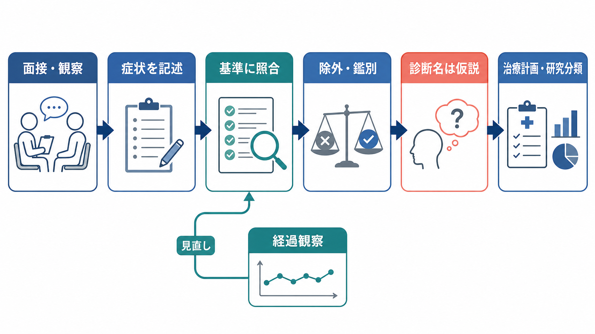
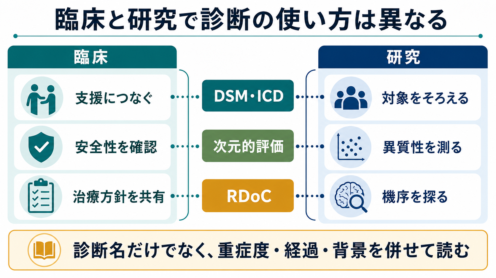

# 精神科診断は何のためにあるのか

## 要点

- 精神科診断は「その人をひとつの名前に閉じ込めるため」ではなく、症状、経過、苦痛、機能障害、リスク、必要な支援を整理するための臨床的な道具である。
- 診断名は、治療選択、予後予測、専門職間のコミュニケーション、制度利用、研究対象の定義に役立つ。ただし、診断名だけで個人の状態や回復可能性を十分に説明できるわけではない[1][2]。
- DSM や ICD は共通言語を与えるが、多くの精神疾患は症状群にもとづく症候群分類であり、単一の原因や特異的バイオマーカーで定義されているわけではない[1][8]。
- よい診断実践では、カテゴリ診断に加えて、重症度、時間経過、併存、生活背景、文化、本人の目標を併せて評価する[2][4]。
- 研究では診断カテゴリが対象者をそろえるために必要になる一方、異質性を減らすために次元的評価や RDoC のような横断的枠組みも使われる[6][7]。

## この記事で答える問い

この記事では、次の問いに答える。

1. 精神科診断は、臨床で何を可能にするのか。
2. 診断は治療選択や予後予測にどの程度役立つのか。
3. 診断名は、患者、家族、専門職、研究者のあいだでどのような共通言語になるのか。
4. 診断名だけに頼ると、どのような誤解が起きるのか。

## まず結論

精神科診断の目的は、「正しいラベルを貼ること」ではなく、「次に何を評価し、何を支援し、何を見直すべきか」を整理することである。診断名は、薬物療法、心理社会的支援、安全確認、制度利用、研究参加基準などの入口になる。しかし、同じ診断名でも、発症年齢、持続期間、重症度、併存症、生活環境、本人の価値や希望は大きく異なる。

したがって診断は、最終回答ではなく作業仮説に近い。診断名を置くことで、除外すべき身体疾患や物質使用、緊急性、治療反応、再発リスク、必要な支援を確認しやすくなる。一方で、診断名を本人の本質のように扱うと、スティグマ、過度の単純化、治療の画一化を招く。診断は、[[生物心理社会モデルとは何か]]やケースフォーミュレーションと組み合わせて使うと、臨床上の有用性が高くなる。

## 背景

精神医学では、血糖値や病理組織のような単一の検査だけで多くの診断が決まるわけではない。DSM-5-TR や ICD-11 は、症状、持続期間、苦痛または機能障害、除外条件、鑑別診断を整理するための分類体系である[1][2]。これは精神医学が「科学的でない」という意味ではなく、対象が主観的体験、行動、発達、対人関係、社会的機能、身体状態をまたぐためである。

診断分類の歴史では、信頼性、妥当性、臨床的有用性の緊張関係が繰り返し問題になってきた。信頼性とは、異なる臨床家が同じ情報から同じ診断に近づけるかである。妥当性とは、その診断が自然な病態単位や予後・治療反応をどれだけ捉えているかである。臨床的有用性とは、その診断が実際の診療、説明、意思決定、記録、研究に役立つかである[3][8]。

## 基本概念

### カテゴリ診断

カテゴリ診断は、「診断あり／なし」の境界を置く。これは、支援の必要性を共有し、治療や制度利用につなげるうえで実用的である。たとえば、重症度や持続期間が一定以上で、本人の苦痛や生活機能への影響が明らかなとき、診断カテゴリは臨床判断を整理する足場になる。

ただし、症状は多くの場合、連続的に分布する。[[正常と異常はどこで分けられるのか]]という問いが重要になるのはこのためである。閾値は自然界に最初から線として存在するというより、臨床上の目的に応じて置かれる実用的な区切りである。

### 次元的評価

次元的評価は、症状の有無だけでなく、程度、頻度、持続、機能障害、生活上の影響を測る。うつ症状、不安、精神病症状、睡眠、衝動性、認知機能、社会機能などは、しばしば連続量として評価したほうが臨床経過を追いやすい。

ICD-11 では、パーソナリティ障害や一次性精神症群などで次元的要素がより明確に取り入れられている[4]。診断カテゴリは入口を作り、次元的評価は「どのくらい重いか」「何が変化したか」を追跡する。

### 診断とフォーミュレーション

診断は「何の症候群に近いか」を整理する。フォーミュレーションは「なぜこの人に、この時期に、この形で困難が生じ、何が維持し、何が回復資源になるか」を整理する。前者は共通言語として強く、後者は個別支援に強い。

そのため、精神科診断は単独で使うより、発症経過、生活史、身体疾患、物質使用、トラウマ、家族関係、文化、支援資源を含めて読む必要がある。これは[[精神疾患とは何か]]や[[精神医学は他の医学分野と何が違うのか]]にも接続する。

## 仕組み

精神科診断は、典型的には次のような手順で進む。

1. 本人の訴え、観察、周囲からの情報、既往歴を集める。
2. 症状群、持続期間、発症時期、経過、誘因、機能障害を整理する。
3. 身体疾患、薬剤、物質使用、せん妄、認知症、発達特性などを鑑別する。
4. 自傷他害、虐待、生活破綻、急性精神病症状などの安全性を確認する。
5. DSM や ICD の基準と照合し、診断名、重症度、併存、暫定性を記録する。
6. 治療計画、説明、支援調整、経過観察の仮説として使う。

ここで重要なのは、診断が一回の面接で固定されるとは限らない点である。初診時には情報が不足していることが多く、経過観察によって診断が修正されることがある。たとえば、気分症状、精神病症状、物質使用、身体疾患、発達歴が絡む場合、時間経過そのものが診断情報になる。

## 図解

診断の働きは、以下のように整理できる。

| 目的 | 診断が役立つ点 | 注意点 |
|---|---|---|
| 治療選択 | 薬物療法、心理療法、社会的支援、安全確保の入口を作る | 診断名だけで治療は決まらない |
| 予後予測 | 経過、再発リスク、併存リスクを考えやすくする | 個人差が大きく、確率的に読む |
| コミュニケーション | 患者、家族、多職種、制度、研究の共通語になる | 本人の語りを診断名に置き換えすぎない |
| 研究 | 対象者を定義し、研究結果を比較しやすくする | 同じ診断内の異質性が残る |
| 制度・記録 | 医療統計、保険、福祉、学校・職場調整の根拠になる | 制度上の分類と臨床的理解は同一ではない |

## 臨床・研究との接続

### 治療選択

診断は治療選択の出発点になる。たとえば、うつ病、双極症、統合失調症、強迫症、PTSD、ADHD では、推奨される薬物療法や心理社会的介入、リスク評価の焦点が異なる。DSM-5-TR や ICD-11 は治療ガイドラインそのものではないが、どの治療エビデンスを参照するかを決める索引として働く[1][2]。

ただし、治療は診断名だけでは決められない。重症度、急性期か維持期か、併存症、身体疾患、妊娠可能性、物質使用、本人の希望、過去の治療反応、家族・職場・学校環境が必要になる。診断は入口であり、治療計画は個別化される。

### 予後予測

診断名は、典型的な経過や再発リスクを考える助けになる。たとえば、発症年齢、持続期間、再発回数、精神病症状、併存する不安や物質使用、社会機能は予後に影響する。診断カテゴリは、こうした予後因子を探索するための枠を作る。

しかし、診断名は予言ではない。同じ診断名でも、回復の速さ、再発のしやすさ、必要な支援、機能回復の道筋は異なる。予後予測は、診断名、重症度、経過、環境、治療反応を組み合わせた確率的判断として扱う必要がある。

### コミュニケーション

診断名は、短い共通語として強い力を持つ。多職種が同じ診断体系を使うことで、記録、紹介状、治療方針、リスク評価、制度利用、研究報告が共有しやすくなる。WHO は ICD-11 を、国や医療制度を越えて健康情報を記録・報告するための標準として位置づけている[2]。

一方で、診断名は本人の経験をすべて表すわけではない。本人にとっては、「何という診断か」だけでなく、「何に困っているのか」「何を避けたいのか」「どの生活機能を取り戻したいのか」が重要である。説明では、診断名を伝えるだけでなく、暫定性、根拠、治療可能性、見直しの条件を共有する必要がある。

### 研究

研究では、診断カテゴリは対象者をそろえるために必要である。診断基準がなければ、同じ「うつ」「不安」「精神病」という言葉でも研究間で対象がずれてしまう。ICD-11 の改訂では、臨床的有用性と国際的適用可能性が重視され、臨床家が実際に使える分類を目指して検証が行われた[4][5]。

しかし、研究上の診断カテゴリには異質性の問題が残る。たとえば同じ診断内に、異なる発症機序、神経回路、発達歴、環境要因、治療反応が含まれることがある。RDoC は、診断名だけでなく、認知、情動、社会過程、覚醒調節などの機能次元と神経生物学的測定を横断的に扱う研究枠組みとして提案された[6][7]。これは臨床診断を置き換えるものというより、研究で機序を探る補助線として理解するとよい。

## よくある誤解

### 誤解1: 診断名がつけば原因がわかったことになる

多くの場合、診断名は原因名ではなく症候群名である。たとえば、うつ病という診断名は、気分、意欲、睡眠、食欲、認知、身体感覚、機能障害のまとまりを示すが、原因が一つに決まったことを意味しない。原因や維持因子を考えるには、[[素因ストレスモデルとは何か]]や[[ストレス脆弱性モデルとは何か]]のような発想が必要になる。

### 誤解2: 診断は本人を決めつけるラベルである

診断がラベルとして使われる危険はある。しかし本来の診断は、支援につなげるための仮説である。よい診断説明では、「あなたはこの病名の人です」で終わらせず、「現在の困りごとはこの診断概念でかなり説明できる。だから次にこの評価と支援を考える」と伝える。

### 誤解3: 精神科診断は主観的だから役に立たない

精神科診断には主観的体験が含まれるが、それは無根拠という意味ではない。面接、観察、家族や支援者からの情報、経過、尺度、身体評価、物質使用の確認を組み合わせることで、信頼性を高められる。問題は、診断を使うか使わないかではなく、診断をどの程度暫定的・多面的に扱えるかである。

### 誤解4: DSM や ICD があれば、臨床判断はいらない

診断基準はチェックリストではなく、臨床判断を支える道具である。基準に合う症状があっても、身体疾患、薬剤、物質使用、文化的背景、発達歴、喪失体験、危機状況を確認しなければ、誤診や過剰診断につながる。分類体系は地図であり、臨床面接は地形を読む作業である。

## 関連ノート

既存ノート:

- [[精神疾患とは何か]]
- [[精神医学は他の医学分野と何が違うのか]]
- [[正常と異常はどこで分けられるのか]]
- [[生物心理社会モデルとは何か]]
- [[素因ストレスモデルとは何か]]
- [[ストレス脆弱性モデルとは何か]]
- [[RDoCは精神疾患研究をどう変えたのか]]
- [[精神疾患の次元的理解とは何か]]

今後の作成候補:

- DSMとICDは何が違うのか
- ケースフォーミュレーションとは何か
- 精神科診断の信頼性と妥当性とは何か
- 併存診断は何を意味するのか
- 精神科診断とスティグマはどう関係するのか

MOC更新候補:

- `content/00_MOC/MOC｜精神医学.md`
- `content/00_MOC/MOC｜臨床実践・治療.md`
- `content/00_MOC/MOC｜神経科学と精神疾患.md`

## 理解チェック

1. 精神科診断が「ラベル」ではなく「臨床的な作業仮説」と言えるのはなぜか。
2. カテゴリ診断と次元的評価は、それぞれ何に強いか。
3. 同じ診断名でも治療計画が異なるのは、どのような情報が追加で必要だからか。
4. 研究で診断カテゴリを使う利点と限界は何か。
5. 診断名を本人に説明するとき、スティグマや決めつけを減らすために何を補足すべきか。

## 未解決問題

- 精神疾患の分類は、症状、神経機序、発達経路、治療反応のどれを中心に設計すべきか。
- 診断カテゴリと次元的評価を、日常診療でどの程度まで統合できるか。
- 診断名が支援へのアクセスを広げる効果と、スティグマを強める効果をどう両立して扱うか。
- バイオマーカー、デジタル表現型、計算論的モデルは、将来の診断分類をどこまで変えるか。

## 参考文献

[1] American Psychiatric Association. (2022). *Diagnostic and Statistical Manual of Mental Disorders, Fifth Edition, Text Revision (DSM-5-TR)*. American Psychiatric Association Publishing. https://doi.org/10.1176/appi.books.9780890425787

[2] World Health Organization. (2024). *Clinical descriptions and diagnostic requirements for ICD-11 mental, behavioural and neurodevelopmental disorders (CDDR)*. World Health Organization. https://www.who.int/publications/i/item/9789240077263

[3] First, M. B., Pincus, H. A., Levine, J. B., Williams, J. B. W., Ustun, B., & Peele, R. (2004). Clinical utility as a criterion for revising psychiatric diagnoses. *American Journal of Psychiatry, 161*(6), 946-954. https://doi.org/10.1176/appi.ajp.161.6.946

[4] Reed, G. M., First, M. B., Kogan, C. S., Hyman, S. E., Gureje, O., Gaebel, W., et al. (2019). Innovations and changes in the ICD-11 classification of mental, behavioural and neurodevelopmental disorders. *World Psychiatry, 18*(1), 3-19. https://doi.org/10.1002/wps.20611

[5] Reed, G. M., Keeley, J. W., Rebello, T. J., First, M. B., Gureje, O., Ayuso-Mateos, J. L., et al. (2018). Clinical utility of ICD-11 diagnostic guidelines for high-burden mental disorders: Results from mental health settings in 13 countries. *World Psychiatry, 17*(3), 306-315. https://doi.org/10.1002/wps.20581

[6] Kraemer, H. C. (2015). Research Domain Criteria (RDoC) and the DSM: Two methodological approaches to mental health diagnosis. *JAMA Psychiatry, 72*(12), 1163-1164. https://doi.org/10.1001/jamapsychiatry.2015.2134

[7] National Institute of Mental Health. (2024). *Revolutionizing the study of mental disorders*. https://www.nimh.nih.gov/news/science-updates/2024/revolutionizing-the-study-of-mental-disorders

[8] Kendler, K. S. (1990). Toward a scientific psychiatric nosology: Strengths and limitations. *Archives of General Psychiatry, 47*(10), 969-973. https://doi.org/10.1001/archpsyc.1990.01810220085011
