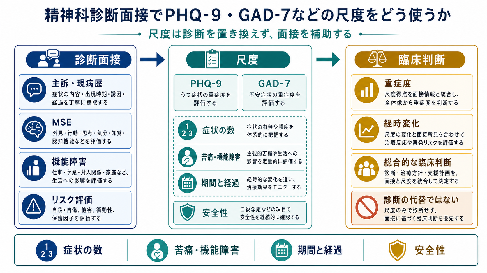
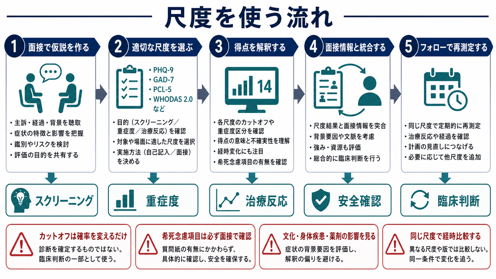

# 精神科診断面接で尺度をどう使うか

## 要点

- PHQ-9、GAD-7、PCL-5、WHODAS 2.0 などの尺度は、症状を「見落としにくくする」「重症度を共有しやすくする」「経時変化を追いやすくする」ための道具である。
- 尺度得点は診断そのものではない。診断では、症状数だけでなく、期間、経過、苦痛、機能障害、除外診断、安全性、文化的背景を面接で確認する。
- 初診ではスクリーニングや仮説生成に、治療中は重症度と治療反応のモニタリングに、研究では群の特徴づけやアウトカム評価に使う。
- カットオフ値は「陽性・陰性」を機械的に決める線ではなく、事前確率を変える目安である。結果は必ず [[精神科面接とは何か]] や [[精神状態診察MSEとは何か]] の情報と統合する。
- PHQ-9 の自殺関連項目、GAD-7 の高度不安、PTSD・躁病・精神病症状を示唆する回答は、尺度の得点処理で終わらせず、面接で具体的に確認する。

## この記事で答える問い

1. 精神科診断面接で尺度を使う目的は何か。
2. PHQ-9・GAD-7 の得点は診断とどう違うのか。
3. カットオフ、重症度、経時変化をどう解釈するべきか。
4. 尺度を使うときに見落としやすいリスクは何か。

## まず結論

尺度は、精神科診断面接の「代用品」ではなく、面接を構造化する補助線である。PHQ-9 は抑うつ症状、GAD-7 は全般不安症状について、自己記入で短時間に把握できるよう設計され、いずれも妥当性研究で臨床的有用性が示されている[1][2]。しかし、精神科診断では、症状の有無だけでなく、持続期間、エピソード性、機能障害、鑑別、身体疾患・薬剤・物質使用、躁病エピソード、自殺リスクなどを評価する必要がある[3][4]。

したがって、実務上の使い方は「面接で仮説を作る」「尺度で症状の範囲と重症度を確認する」「面接情報と統合して臨床判断する」「同じ尺度で経時変化を追う」という順序がよい。VA/DoD のうつ病診療ガイドラインも、PHQ-9 は抑うつ障害の認識や治療反応評価に有用だが、単独で診断を確定するものではないと位置づけている[5]。

## 背景

精神科診断面接は、患者の語り、観察所見、生活機能、リスク、背景要因を統合する作業である。ところが、臨床現場では時間が限られ、抑うつ、不安、睡眠、物質使用、トラウマ、認知機能などを毎回同じ粒度で確認することは難しい。尺度はこのばらつきを減らし、評価の抜けを少なくする。

PHQ-9 は 9 項目で抑うつ症状の頻度を尋ね、得点が高いほど機能低下や症状関連困難と関連することが示された[1]。GAD-7 も 7 項目で不安症状を評価し、カットオフ 10 付近で全般不安症を検出する感度・特異度のバランスがよいこと、得点が高いほど機能障害が大きいことが報告されている[2]。

一方で、尺度は「質問紙が尋ねた範囲」しか測れない。たとえば PHQ-9 で高得点でも、双極性障害の抑うつ相、甲状腺疾患、薬剤性症状、物質使用、複雑性悲嘆、適応反応などは面接で区別する必要がある。これは [[鑑別診断とは何か]] や [[精神科診断における除外診断とは何か]] に直結する。

## 基本概念

### スクリーニング

スクリーニングは、見逃しを減らすために「さらに詳しく評価すべき人」を拾い上げる使い方である。PHQ-9 では、うつ病スクリーニングの個票データ・メタ解析で、カットオフ 10 以上が感度と特異度のバランスに優れると報告されている[6]。ただし、検査前確率が低い集団では偽陽性が増え、逆に高リスク集団では陰性でも臨床的懸念が残ることがある。

### 重症度評価

重症度評価は、現在の症状負荷を共有する使い方である。NICE のうつ病ガイドラインでは、うつ病の重症度を考える際に、PHQ-9 などの妥当化された尺度を指標として用いる一方、症状数だけでなく苦痛、機能障害、臨床的文脈も考慮する[3]。これは [[精神科で重症度をどう判断するか]] の実践的な一部である。

### 経時的モニタリング

経時的モニタリングでは、同じ尺度を同じ条件で繰り返し用いる。単回得点よりも「前回からどう変わったか」が重要になる。治療反応、再燃の兆候、生活機能の改善、介入の修正を話し合う材料になるため、[[共同意思決定とは何か]] とも相性がよい。APA の成人精神医学的評価ガイドラインも、症状、機能、生活の質について定量的評価を初期評価に含めることを提案している[7]。

## 仕組み

尺度を面接に組み込むときは、次の順で考える。

1. 面接で主訴、経過、背景を聞き、何を評価したいのかを決める。
2. 目的に合う尺度を選ぶ。抑うつなら PHQ-9、不安なら GAD-7、生活機能なら WHODAS 2.0 など、症状領域と使用目的を合わせる。
3. 得点を見る。総点、下位項目、重症度区分、カットオフ、前回との差を確認する。
4. 面接情報と照合する。得点と語りが食い違う場合は、記入方法、理解、文化的表現、身体症状、否認、過少申告・過大申告を検討する。
5. 必要な臨床判断につなげる。診断仮説、リスク評価、治療計画、フォロー間隔、他職種連携を決める。

## 図解

| 目的 | 代表的な尺度 | 面接で必ず補う情報 | 使い方の注意 |
|---|---|---|---|
| 抑うつ症状の把握 | PHQ-9 | 期間、エピソード性、躁病歴、自殺念慮、身体疾患、薬剤、物質使用 | 得点だけで MDD と断定しない |
| 不安症状の把握 | GAD-7 | 心配の対象、制御困難、6か月以上の持続、回避、パニック、強迫、PTSD | 不安障害全体の鑑別には追加質問が必要 |
| 生活機能 | WHODAS 2.0、GAF など | 仕事、学業、家事、対人関係、セルフケア、支援環境 | 症状得点と機能障害は一致しないことがある |
| リスク評価 | 自殺念慮項目、専用リスク尺度 | 具体的な計画、手段、意図、保護因子、過去の行動 | 尺度項目だけで安全確認を終えない |
| 治療反応 | PHQ-9、GAD-7 などの反復 | 服薬、心理療法、生活変化、有害事象、治療同盟 | 同じ尺度・同じ期間で比較する |

## 臨床・研究との接続

臨床では、尺度は「共通言語」として役立つ。患者が「少しよくなった」と感じていても、睡眠、食欲、集中、希死念慮だけが残る場合がある。逆に、総点はあまり下がらなくても、仕事復帰や対人機能が改善していることもある。したがって、尺度は [[診療録は精神科でどう書くべきか]] において、経過を短く具体的に記録する材料にもなる。

研究では、尺度は対象者の特徴づけ、介入効果のアウトカム、臨床的に意味のある変化の定義に使われる。ただし、研究用のカットオフや平均差を、そのまま個別臨床の診断・治療方針に移すことはできない。尺度は集団レベルの比較に強い一方、個人の文脈、価値観、生活史、文化的背景を十分には表現できない。

精神科診療で特に重要なのは、安全性の扱いである。PHQ-9 の自殺関連項目が少しでも陽性なら、[[自殺リスク評価では何を聞くべきか]] に沿って、希死念慮、計画、手段へのアクセス、衝動性、過去の自傷・自殺企図、保護因子を確認する。尺度は警報として使い、リスク評価の代わりにしない。

## よくある誤解

### 「PHQ-9 が 10 点以上ならうつ病である」

これは誤解である。PHQ-9 のカットオフ 10 はスクリーニングや重症度の目安として有用だが、診断確定ではない[6]。診断では、抑うつ気分または興味・喜びの低下、症状の持続、機能障害、除外診断、躁病歴、自殺リスクなどを面接で確認する。

### 「尺度が陰性なら問題はない」

尺度が陰性でも、患者が症状を過少申告している、質問項目にない症状が中心である、文化的に身体症状として表現している、急性リスクが別経路で存在する、ということがある。臨床的な違和感がある場合は、陰性結果より面接所見を優先する。

### 「毎回違う尺度を使えば幅広く見られる」

初期評価で広く見ることは有用だが、治療反応を見る場面では、同じ尺度を繰り返す方が変化を解釈しやすい。尺度を変えると、改善したのか、測り方が変わっただけなのかが分かりにくくなる。

### 「尺度を使うと面接が機械的になる」

尺度だけを先に埋めると機械的になりやすい。しかし、面接で出た主訴を確認するために尺度を使い、結果を患者と一緒に見ながら「どの項目が一番つらいか」「どの変化を治療目標にするか」を話すと、むしろ協働的な面接になりやすい。

## 関連ノート

- [[精神科面接とは何か]]
- [[精神科診断は何のためにあるのか]]
- [[精神状態診察MSEとは何か]]
- [[精神科で重症度をどう判断するか]]
- [[精神科診断における除外診断とは何か]]
- [[GAFやWHODASは何を評価するのか]]
- [[共同意思決定とは何か]]
- [[自殺リスク評価では何を聞くべきか]]

## MOC更新候補

- `content/00_MOC/MOC｜精神医学.md`
- `content/00_MOC/MOC｜総合入口.md`

並列生成ジョブとの競合を避けるため、本記事では MOC 本体は更新しない。

## 理解チェック

1. PHQ-9 や GAD-7 のカットオフ値は、なぜ診断確定と同じではないのか。
2. PHQ-9 の自殺関連項目が陽性だったとき、得点処理以外に何を確認する必要があるか。
3. 治療反応を追う場面で、同じ尺度を繰り返し使う利点は何か。
4. 尺度得点と面接所見が食い違った場合、どのような可能性を検討するか。

## 未解決問題

- PHQ-9 や GAD-7 のカットオフは、年齢、文化、身体疾患、診療場面によって最適値が変わりうる。
- 自己記入尺度は、識字、言語、認知機能、羞恥、スティグマ、二次利得の影響を受ける。
- デジタル問診やアプリによる高頻度モニタリングでは、過測定、患者負担、データ解釈、プライバシーの問題が残る。
- 尺度に基づく measurement-based care が、専門精神科外来・地域支援・多職種チームでどの程度アウトカムを改善するかは、場面ごとの検討が必要である。

## 参考文献

[1] Kroenke K, Spitzer RL, Williams JBW. (2001). The PHQ-9: validity of a brief depression severity measure. *Journal of General Internal Medicine*, 16(9), 606-613. https://doi.org/10.1046/j.1525-1497.2001.016009606.x

[2] Spitzer RL, Kroenke K, Williams JBW, Lowe B. (2006). A brief measure for assessing generalized anxiety disorder: the GAD-7. *Archives of Internal Medicine*, 166(10), 1092-1097. https://doi.org/10.1001/archinte.166.10.1092

[3] National Institute for Health and Care Excellence. (2022). *Depression in adults: treatment and management* (NICE guideline NG222). https://www.nice.org.uk/guidance/ng222

[4] National Institute for Health and Care Excellence. (2011, updated 2020). *Generalised anxiety disorder and panic disorder in adults: management* (CG113), Appendix: assessing generalised anxiety disorder. https://www.nice.org.uk/guidance/cg113

[5] Department of Veterans Affairs and Department of Defense. (2022). *VA/DoD Clinical Practice Guideline for the Management of Major Depressive Disorder*. https://www.healthquality.va.gov/guidelines/mh/mdd/

[6] Negeri ZF, Levis B, Sun Y, et al. (2021). Accuracy of the Patient Health Questionnaire-9 for screening to detect major depression: updated systematic review and individual participant data meta-analysis. *BMJ*, 375, n2183. https://doi.org/10.1136/bmj.n2183

[7] Silverman JJ, Galanter M, Jackson-Triche M, et al. (2015). The American Psychiatric Association practice guidelines for the psychiatric evaluation of adults. *American Journal of Psychiatry*, 172(8), 798-802. https://doi.org/10.1176/appi.ajp.2015.1720501
