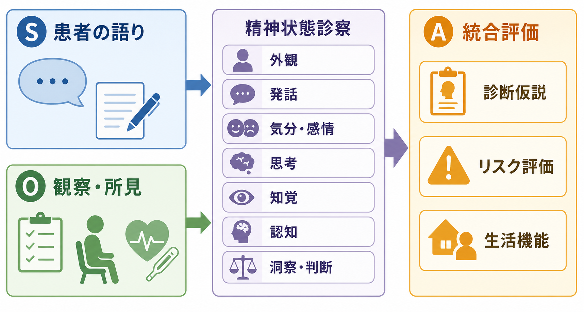
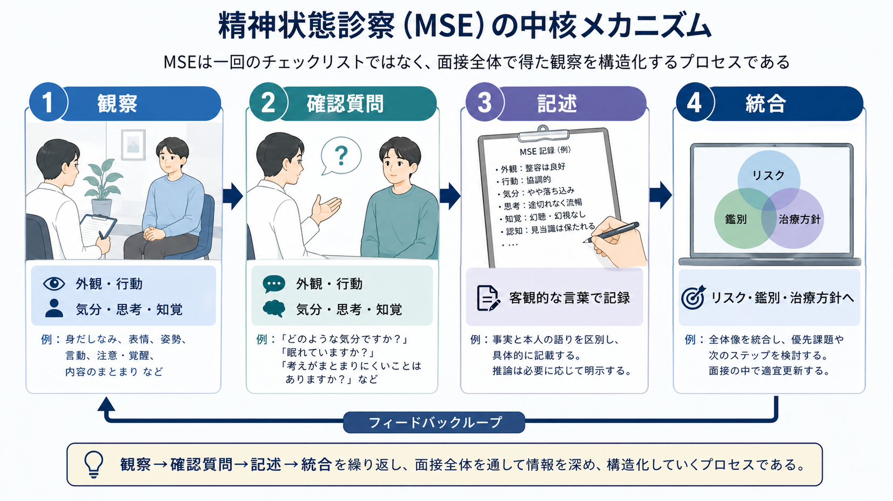
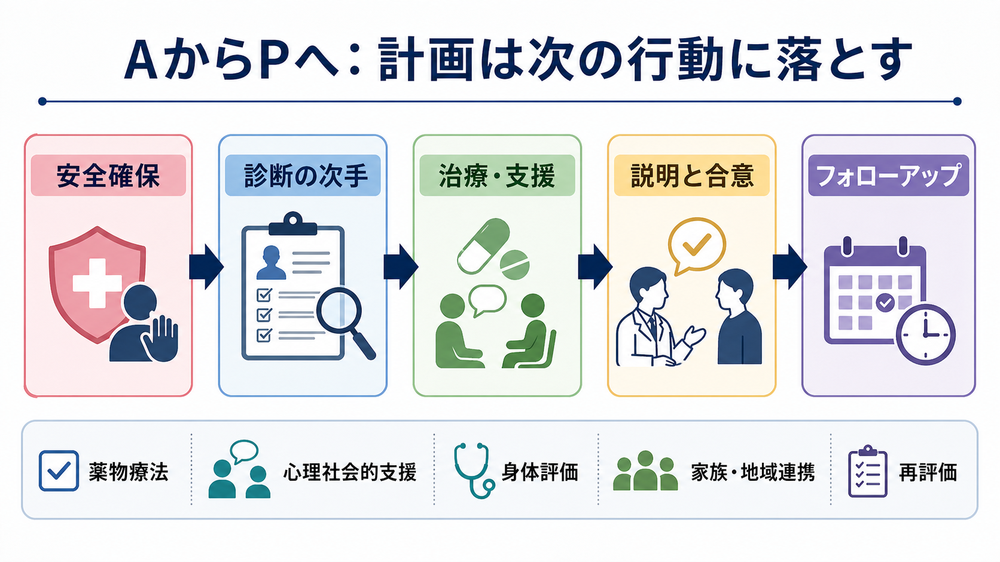

# 精神科診療でSOAPはどう使うのか

## 要点

- SOAP は、Subjective、Objective、Assessment、Plan の4区分で診療情報を整理する記録形式であり、問題志向型診療録（POMR）の流れから広まった[1][2]。
- 精神科では、S に患者本人の語り、O に観察可能な行動・精神状態所見・検査情報、A に診断仮説・リスク評価・ケースフォーミュレーション、P に次の具体的行動を置く。
- 重要なのは「S と O を機械的に分けること」ではなく、本人の主観的苦痛と観察可能な所見を区別し、どの根拠からどの判断に進んだかを読めるようにすることである[2][4]。
- 精神科の P は薬物療法だけではない。安全確保、心理教育、心理社会的支援、身体評価、家族・地域連携、フォローアップ、説明と同意を含める。
- SOAP は便利だが、長期経過や関係性の変化を表しにくい。必要に応じて問題リスト、経過表、尺度、ケースフォーミュレーションと組み合わせる[2][6]。

## この記事で答える問い

1. 精神科診療では、SOAP の S、O、A、P に何を書くのか。
2. 精神状態診察（MSE）は SOAP のどこに位置づくのか。
3. 診断評価、リスク評価、治療計画をどう記録すれば、後から臨床判断の流れを追えるのか。
4. SOAP 記録で起こりやすい誤解や落とし穴は何か。

## まず結論

精神科診療で SOAP を使う目的は、面接で得た情報を「患者が何を語ったか」「診察者が何を観察したか」「それをどう評価したか」「次に何をするか」に分け、臨床推論を他者と共有可能にすることである。SOAP は単なる書式ではなく、[[精神科面接とは何か|精神科面接]]、[[精神科診断は何のためにあるのか|診断]]、[[鑑別診断とは何か|鑑別診断]]、[[精神科治療計画はどのように立てるのか|治療計画]]をつなぐ作業台である。

たとえば「眠れない」という訴えは S に入る。しかし、面接中に眠そうで反応が遅い、発話が小さい、注意集中が保てない、血液検査で甲状腺機能異常がある、といった情報は O に入る。A では、うつ病、不安症、躁状態、物質・薬剤、身体疾患、睡眠衛生、生活ストレスなどを比較し、リスクと機能障害も含めて評価する。P では、検査、薬物療法、心理教育、睡眠記録、支援調整、次回受診、安全計画などを具体的に書く。

このように SOAP は、記録を短くするためだけの形式ではない。むしろ、判断の根拠を過不足なく残すための形式である。

## 背景

SOAP は、問題志向型診療録（Problem-Oriented Medical Record: POMR）の文脈で広がった。POMR は、患者の問題を明確にし、データ、評価、計画を問題ごとに整理して、診療録が教育と臨床判断を支えるようにする発想である[1]。現在の SOAP は、医療者間のコミュニケーション、臨床推論、継続診療のための構造化された記録として広く使われている[2]。

精神科では、SOAP の使い方に特有の難しさがある。内科診療なら「腹痛」は S、「腹部圧痛」は O と比較的分けやすい。一方、精神科では「不安」「抑うつ」「希死念慮」「幻聴」「思考がまとまらない」といった体験が本人の語りとして現れ、同時に表情、発話、行動、注意、思考過程として観察される。したがって、S と O の区別は「主観は信頼できない、客観だけが正しい」という意味ではなく、情報源と観察可能性を明確にするための区別である。

APA の成人精神医学的評価ガイドラインは、初期評価で気分、不安、思考内容・思考過程、知覚、認知、トラウマ歴、精神科治療歴、物質使用、自殺リスク、攻撃性リスク、身体健康、文化的要因、尺度、患者参加、記録を扱うことを推奨・提案している[3][4]。SOAP は、こうした評価項目を日々の診療記録に落とし込むための実用的な枠組みになる。

## 基本概念

### S: Subjective

S は、患者本人や家族・支援者が報告した内容である。主訴、現病歴、本人の困りごと、症状の自己評価、睡眠・食欲・活動量、服薬状況、副作用の自覚、生活上の変化、本人の希望や懸念が入る。

精神科では、S に本人の言葉を短く引用すると有用である。たとえば「朝が特につらく、消えたいと思うことがある」「薬を飲むと頭がぼんやりする」「職場に行こうとすると動悸が出る」のように記録すると、症状だけでなく苦痛の意味や生活文脈が残る。[[主訴はどのように聞くべきか]]や[[現病歴はどのように構造化するべきか]]で扱う情報は、SOAP の S の土台になる。

ただし、S は「患者が言ったことを全部書く欄」ではない。面接目的に照らして、臨床判断に関係する情報を選ぶ。発言を要約する場合は、事実、推測、診察者の解釈を混ぜない。

### O: Objective

O は、診察者が観察した所見、測定値、検査結果、他職種・他機関から確認された情報である。精神科では、精神状態診察（Mental Status Examination: MSE）が O の中心になる。MSE には、外観、行動、精神運動、発話、気分、感情、思考過程、思考内容、知覚、認知、洞察、判断などが含まれる[5]。

たとえば「表情は乏しい」「発話量は少なく、返答までに時間を要する」「思考過程は概ねまとまる」「希死念慮を問うと否認」「診察中に幻聴への反応を示す様子は目立たない」「見当識は保たれる」といった記載は O に入る。心理尺度、バイタル、体重、血液検査、処方歴、紹介状、家族からの情報も、情報源を明記すれば O に含められる。

ここで注意したいのは、「気分」と「感情」の扱いである。本人が「気分は落ち込んでいる」と語るのは S に近い。一方、診察者が観察する表情、声量、反応性、感情の幅、内容との一致は O に近い。精神状態診察は、本人の語りを否定するためではなく、語りと観察を並べて理解を深めるために使う。

### A: Assessment

A は、S と O を統合した臨床評価である。診断名だけを書く欄ではない。診断仮説、鑑別診断、重症度、リスク、生活機能、身体疾患や物質・薬剤の影響、文化的背景、治療反応、本人の価値や希望を踏まえた見立てを書く。

たとえば「大うつ病エピソードが疑われる」だけでは、A として不十分なことがある。なぜなら、同じ抑うつ症状でも、双極性障害、適応反応、物質使用、甲状腺疾患、睡眠障害、薬剤性精神症状、喪失反応、発達特性に伴う二次的抑うつなどを検討する必要があるからである。ここでは[[精神科診断における除外診断とは何か]]、[[薬剤性精神症状とは何か]]、[[器質性精神障害を見逃さないためには何を見るべきか]]の視点が重要になる。

A には、安全性の評価も含める。自殺リスク、他害リスク、セルフネグレクト、虐待、急性増悪、身体的危険がある場合は、診断名よりも優先して評価する。APA ガイドラインは、自殺念慮、計画、意図、手段へのアクセス、過去の自殺行動、保護因子、攻撃性リスクなどを評価し、リスク推定と影響因子を記録することを重視している[4]。これは[[自殺リスク評価では何を聞くべきか]]や[[他害リスク評価では何を見るべきか]]に直結する。

### P: Plan

P は、評価を踏まえた次の行動である。検査、診断の追加確認、薬物療法、心理教育、心理療法、生活調整、家族面接、職場・学校・地域支援との連携、危機対応、フォローアップ間隔、説明と同意、次回評価項目を書く。

精神科の P では、「処方した」だけでは足りない。何を目標にし、どのリスクを見ながら、どのタイミングで評価し直すかを書く必要がある。たとえば「SSRI 開始」ではなく、「うつ・不安症状と睡眠を 2 週間後に再評価、副作用として消化器症状・賦活・希死念慮増悪を説明、悪化時は外来へ連絡」と書けば、治療選択の意図と安全確認が読める。

患者参加も P の一部である。NICE の共有意思決定ガイドラインは、治療やケアの選択において、根拠、利益、リスク、結果、本人の価値・希望を共有し、医療者と本人が共同で決めることを重視している[7]。APA ガイドラインも、診断・未治療リスク・治療選択肢・利益とリスクを説明し、本人の治療希望を尋ね、治療決定に協働することを推奨している[4]。したがって P には、説明内容、本人の反応、合意した次の行動を残す。

## 仕組み

SOAP は、情報を次の順序で処理する。

1. S で、患者が何に困り、何を望み、何を恐れているかを把握する。
2. O で、診察者が観察した現在像、MSE、検査、尺度、他者情報を整理する。
3. A で、S と O の一致・不一致を見ながら、診断仮説、鑑別、リスク、生活機能を評価する。
4. P で、評価を次の行動に変換し、本人と共有して再評価の条件を決める。

この流れは一方向ではない。P を実行した結果、次回の S と O が変わる。症状が改善したか、副作用が出たか、生活機能が戻ったか、家族や職場との調整が進んだか、安全性はどう変化したかを再評価し、A と P を更新する。SOAP は一回の面接を閉じる形式であると同時に、経過の中で仮説を更新する形式でもある。

精神科診療では、A の質が記録全体の質を左右する。S と O が豊富でも、A が「うつ病、内服継続」だけなら、なぜその診断で、どの鑑別をどう扱い、何をリスクと見たのかが読めない。逆に、A に根拠のない断定が多いと、S と O から飛躍した記録になる。よい SOAP は、S/O と A/P の接続が読める。

## 図解

### 図解1: S/O から A への統合

上の1枚目は、患者の語り（S）と観察・所見（O）が、精神状態診察を介して統合評価（A）へ進む流れを示している。精神科では、本人の語りと観察所見がずれることがある。たとえば本人は「大丈夫」と言っていても、著しい不眠、希死念慮の迂回表現、衝動性、支援の途絶が見えることがある。逆に、観察上は落ち着いて見えても、本人の内的苦痛が強いこともある。

したがって、S と O の不一致は「どちらが正しいか」を決める材料ではなく、A で検討すべき臨床情報である。

### 図解2: MSE は診断名ではなく現在像

2枚目は、MSE を「観察、確認質問、記述、統合」の循環として示している。MSE は、診断を一発で確定する検査ではない。面接時点の精神状態を、観察可能な言葉で記述し、診断仮説、リスク、治療方針に接続するための情報である[5]。

### 図解3: P は治療行為の一覧ではなく次の行動

3枚目は、A から P に移る際の実践フローを示している。精神科の P は、薬物療法、心理社会的支援、身体評価、家族・地域連携、再評価を含む。P は「何をするか」だけでなく、「何を見ながら続けるか」「どの条件なら変更するか」まで含めると、継続診療に役立つ。

## 臨床・研究との接続

臨床では、SOAP は多職種連携の共通言語になる。医師、看護師、心理職、精神保健福祉士、薬剤師、地域支援者が関わる場合、誰が読んでも「本人は何を訴え、診察者は何を観察し、何を評価し、次に何をするのか」が分かる記録は重要である。APA ガイドラインも、複数の医療者が関わる場合には、治療選択の根拠や検査の根拠を記録することが臨床判断と連携に役立つとしている[4]。

教育では、SOAP は臨床推論の訓練になる。初学者は、S に診察者の解釈を混ぜたり、O に「うつ病らしい」と書いたり、A に根拠のない診断名だけを書いたりしやすい。SOAP を使うと、情報源、所見、評価、計画を分けて考える練習になる。

研究では、SOAP そのものが研究尺度ではないが、症状尺度、生活機能評価、リスク評価、治療反応の記録と組み合わせることで、経過の可視化に役立つ。APA ガイドラインは、症状、機能、生活の質を定量的に評価することが、臨床判断や治療アウトカムの改善に役立ちうると整理している[4]。これは[[GAFやWHODASは何を評価するのか]]や[[精神科で生活機能をどう評価するか]]の問題とつながる。

## よくある誤解

### 誤解1: S は主観だから価値が低い

S は患者の体験、意味づけ、希望、恐れを含む。精神科診療では、主観的苦痛そのものが評価対象であり、治療関係の入口でもある。S を軽視すると、本人が何に困っているのか、何を支えたいのかが消える。

### 誤解2: O は完全に客観的である

MSE は観察に基づくが、観察者の訓練、文脈、文化、面接関係に影響される。StatPearls の MSE 解説も、MSE が診療科、観察技能、患者との信頼関係、文化的・言語的背景、身体疾患などの影響を受けることを指摘している[5]。O は「事実だけ」ではなく、「観察可能な情報をできるだけ具体的に記述する欄」と考える方がよい。

### 誤解3: A は診断名だけでよい

A は診断名、鑑別診断、重症度、リスク、生活機能、治療反応、文化的文脈を含む評価である。診断名だけでは、次に何をすべきかが分からない。特に精神科では、同じ診断名でも安全性、支援資源、本人の希望、身体疾患、物質使用、家族関係によって計画が変わる。

### 誤解4: P は処方内容だけでよい

処方は P の一部にすぎない。説明、同意、副作用モニタリング、心理教育、生活支援、危機時対応、家族・地域連携、フォローアップも P である。[[共同意思決定とは何か]]や[[インフォームドコンセントは精神科でどう行うのか]]の内容を、診療記録に落とす欄でもある。

### 誤解5: SOAP なら何でも分かりやすくなる

SOAP には限界もある。SOAP 形式は一回の診療の情報を整理しやすい一方、長期経過、問題リスト、慢性疾患の優先順位、語りの変化、治療関係の質を十分に表しにくいことがある[2][6]。そのため、必要に応じて問題リスト、経過表、尺度、ケースフォーミュレーション、危機計画を併用する。

## 記載例

以下は教育目的の簡略例であり、個別診断や治療指示ではない。

| 区分 | 記載の焦点 | 簡略例 |
|---|---|---|
| S | 本人・家族が報告した内容 | 「2週間前から眠れず、仕事に行く前に動悸が出る」。服薬中断は否定。希死念慮は「消えたいと思うことはあるが、具体的な方法は考えていない」と話す。 |
| O | 観察・MSE・検査・尺度 | 身だしなみ整う。協調的。発話は小声で遅い。気分は「不安」。感情は不安げで内容と概ね一致。思考過程はまとまる。幻覚妄想を示す発言なし。PHQ-9 12点。 |
| A | 統合評価 | 不安・抑うつ症状が持続し生活機能が低下。大うつ病エピソード、不安症、適応反応、身体疾患・薬剤影響を鑑別。希死念慮は受動的で具体的計画なし。ただし不眠と孤立があり継続評価が必要。 |
| P | 次の具体的行動 | 睡眠、希死念慮、活動量を次回再評価。身体疾患・薬剤影響確認のため採血を検討。心理教育と睡眠記録を提案。治療選択肢を説明し本人の希望を確認。悪化時の連絡先と受診目安を共有。 |

この例で重要なのは、S/O/A/P の各欄が互いに孤立していないことである。S の「眠れない」「消えたい」、O の発話・感情・尺度、A の鑑別とリスク、P の再評価と安全確認がつながっている。

## 関連ノート

- [[精神科面接とは何か]]
- [[主訴はどのように聞くべきか]]
- [[現病歴はどのように構造化するべきか]]
- [[鑑別診断とは何か]]
- [[精神科診断における除外診断とは何か]]
- [[自殺リスク評価では何を聞くべきか]]
- [[精神科治療計画はどのように立てるのか]]
- [[共同意思決定とは何か]]
- [[インフォームドコンセントは精神科でどう行うのか]]
- [[GAFやWHODASは何を評価するのか]]

## MOC更新候補

- `content/00_MOC/MOC｜精神医学.md` の「総論・診断・面接」または「診療記録・治療計画」周辺に追加する候補。
- 並列ジョブとの競合を避けるため、本記事では MOC 本体は更新しない。

## 理解チェック

1. 精神科 SOAP で、患者の「眠れない」という訴えと、診察者が観察した「反応が遅い」はそれぞれどこに書くか。
2. MSE を O に書くとき、診断名ではなく観察可能な言葉で記述する理由は何か。
3. A に診断名だけでなく、鑑別診断、リスク、生活機能を書く必要があるのはなぜか。
4. P に薬物療法以外の計画を含めると、継続診療や多職種連携にどう役立つか。

## 未解決問題

- 電子カルテで SOAP を使うとき、コピーアンドペーストによる冗長化と、必要情報の見落としをどう両立して防ぐか。
- 精神科の長期経過、治療関係、本人の価値観の変化を、SOAP とケースフォーミュレーションでどう分担して記録するか。
- 自殺・他害リスクや虐待リスクの記録を、過度に防衛的な文章ではなく、本人の尊厳と安全を両立する形でどう書くか。

## 参考文献

[1] Weed, L. L. (1968). Medical records that guide and teach. *New England Journal of Medicine, 278*(11), 593-600. https://doi.org/10.1056/NEJM196803142781105

[2] Podder, V., Lew, V., & Ghassemzadeh, S. (2023). *SOAP Notes*. StatPearls. https://www.ncbi.nlm.nih.gov/books/NBK482263/

[3] Silverman, J. J., Galanter, M., Jackson-Triche, M., Jacobs, D. G., Lomax, J. W., Riba, M. B., Tong, L. D., Watkins, K. E., Fochtmann, L. J., Rhoads, R. S., & Yager, J. (2015). The American Psychiatric Association Practice Guidelines for the Psychiatric Evaluation of Adults. *American Journal of Psychiatry, 172*(8), 798-802. https://doi.org/10.1176/appi.ajp.2015.1720501

[4] Armstrong, C. (2016). APA updates guidelines on psychiatric evaluation in adults. *American Family Physician, 94*(1), 62-64. https://www.aafp.org/pubs/afp/issues/2016/0701/p62.html

[5] Voss, R. M., & Das, J. M. (2024). *Mental Status Examination*. StatPearls. https://www.ncbi.nlm.nih.gov/books/NBK546682/

[6] Donnelly, W. J., & Brauner, D. J. (1992). Why SOAP is bad for the medical record. *Archives of Internal Medicine, 152*(3), 481-484. https://doi.org/10.1001/archinte.1992.00400150015004

[7] National Institute for Health and Care Excellence. (2021). *Shared decision making*. NICE Guideline NG197. https://www.ncbi.nlm.nih.gov/books/NBK572428/

