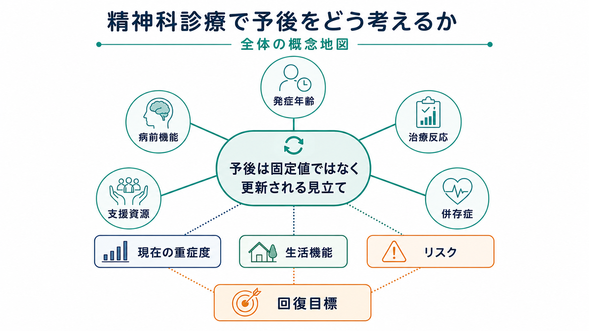
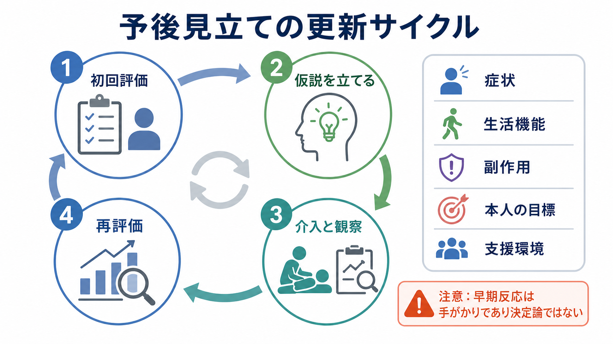
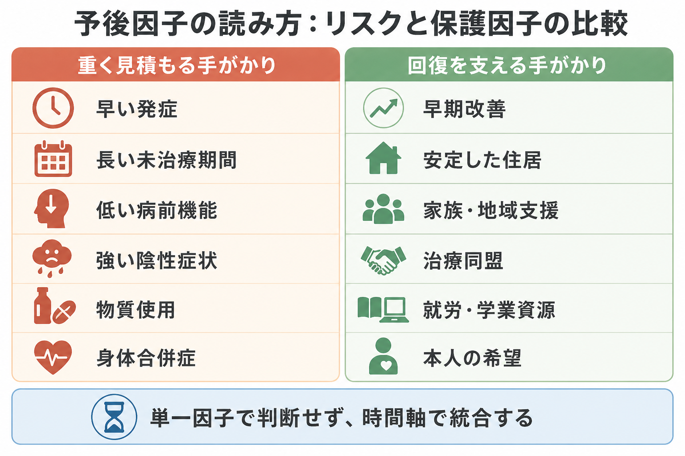

# 精神科診療で予後をどう考えるか

## 要点

- 精神科診療でいう予後は、「この人は将来どうなるか」を一度で言い当てる作業ではなく、症状、生活機能、リスク、本人の目標、支援環境を時間軸で統合する[[ケースフォーミュレーションとは何か|ケースフォーミュレーション]]である。
- 発症年齢、[[病前機能とは何か|病前機能]]、未治療期間、初期重症度、陰性症状、認知機能、[[併存症とは何か|併存症]]、物質使用、身体疾患、社会的支援は、予後を考える主要な手がかりになる[1][2][3]。
- 早期の治療反応は重要だが、決定論的に読まない。うつ病の個別患者データメタ解析では、早期改善は予測に役立つ一方、早期非改善でも後に反応・寛解する人が少なくない[4]。
- 支援資源は「背景情報」ではなく、予後そのものを変えうる臨床対象である。社会的支援、住居、家族・地域支援、就労・学業支援、治療同盟は、症状評価と同じくらい計画に組み込む必要がある[5][6]。
- 予後説明は、本人を分類するラベルではなく、次の一手を決めるための共有仮説として行う。教育・研究目的の見立てであり、個別診断や治療指示として断定しない。

## この記事で答える問い

1. 精神科診療で「予後を考える」とは、具体的に何を見ているのか。
2. 発症年齢・病前機能・治療反応・支援資源・併存症は、どのように予後判断へつながるのか。
3. 予後を本人や家族に説明するとき、どのような誤解を避けるべきか。
4. 予後見立てを、治療計画、再評価、支援調整にどう接続するか。

## まず結論

精神科の予後は、単一の疾患名や初診時の印象から直線的に決まるものではない。むしろ、現在の症状、発症までの経過、発症前の生活機能、治療への反応、生活上の支え、併存する精神・身体疾患、物質使用、リスク、本人の価値や希望が重なって形成される「更新される見立て」である。

したがって臨床では、「この診断だから予後はよい／悪い」と言うよりも、「どの領域が回復を支え、どの領域が経過を重くしているか」を分けて考える。たとえば初回エピソード精神病のメタ解析では、症状の寛解と機能的回復は同じではなく、寛解しても就労・学業・対人機能の回復が遅れることがある[1][2]。この差を見落とすと、症状評価だけで「よくなった」と判断し、生活支援や再発予防の手当てが不足しやすい。

予後見立ての目的は、将来を断言することではない。目的は、[[精神科治療計画はどのように立てるのか|治療計画]]を現実的にし、[[共同意思決定とは何か|共同意思決定]]の材料を増やし、本人・家族・多職種が同じ時間軸を共有することである。

## 背景

精神科診療では、診断名、重症度、リスク評価、生活機能評価がしばしば別々に扱われる。しかし実際の予後は、それらの相互作用として現れる。症状が重くても支援資源が豊富で治療反応が早い人と、症状は中等度でも孤立、物質使用、身体合併症、住居不安定が重なる人では、必要な支援も予後の見立ても異なる。

精神病圏では、初回エピソード後に症状寛解へ至る人は少なくないが、機能的回復はより難しい指標である。Catalan らの系統的レビュー・メタ解析では、初回エピソード精神病の症状寛解は平均約4年の追跡で約半数、回復は平均約5.5年の追跡で約3分の1と推定された[1]。これは「症状が下がること」と「生活が戻ること」を分けて評価する必要を示している。

一方、うつ病では治療初期の改善がその後の反応を予測する手がかりになる。Szegedi らのメタ解析では、抗うつ薬治療開始2週時点の改善は後の反応・寛解を高感度に予測した[7]。ただし個別患者データメタ解析では、早期非改善者の中にも6週、12週で反応する人が相当数いるため、早期反応だけで方針を機械的に決めるのは早計である[4]。

このため、予後は「診断名からの平均的見込み」と「その人固有の経過」の両方から読む必要がある。

## 基本概念

### 予後は複数のアウトカムを含む

精神科の予後には、少なくとも次の複数の層がある。

| 層 | 見るもの | 臨床上の問い |
|---|---|---|
| 症状予後 | 症状の軽減、寛解、再燃、再発 | 症状はどの程度、どの速度で変化しているか |
| 機能予後 | 学業、就労、家事、対人関係、セルフケア | 生活の役割は戻っているか、別の形で再構成できているか |
| リスク予後 | 自殺、自傷、他害、セルフネグレクト、再入院 | どのリスクが、どの条件で高まるか |
| 回復予後 | 本人が意味ある生活を取り戻す過程 | 本人の価値、希望、役割は治療目標に入っているか |
| 支援予後 | 家族、地域、制度、治療同盟、経済・住居 | 支援の厚みは増やせるか、途切れやすい点はどこか |

この区別は、[[精神科で生活機能をどう評価するか|生活機能評価]]と[[精神医学における回復とは何か|回復]]の理解に直結する。症状が残っていても生活機能が改善することはあり、症状が軽くても孤立や役割喪失が続くこともある。

### 予後因子はリスク因子と保護因子に分けて読む

予後を重く見積もる手がかりには、早い発症、長い未治療期間、低い病前機能、強い初期重症度、持続する陰性症状、認知機能低下、物質使用、身体合併症、孤立、経済・住居不安定などがある[2][3]。ただし、これらは「悪い未来の証明」ではなく、支援を厚くするべき領域を示す。

反対に、回復を支える手がかりには、早期改善、治療同盟、服薬や通院をめぐる協働、家族・地域支援、安定した住居、学業・就労資源、身体疾患の管理、本人の希望、危機時の相談先がある。これは[[精神科診療における保護因子とは何か|保護因子]]として評価される。

## 仕組み

### 1. 発症年齢は「時間軸」として読む

早い発症は、教育、対人関係、職業準備、自己像の形成と重なりやすい。したがって同じ症状でも、発症が青年期か中年期かで失われる役割や必要な支援は異なる。早期発症精神病の系統的レビューでは、病前の困難、初期重症度、とくに陰性症状、長い未治療精神病期間が、より不良な臨床・機能・認知アウトカムと関連しやすいと整理されている[3]。

発症年齢を見るときに重要なのは、年齢そのものを単純な優劣にしないことである。若年発症なら復学・家族支援・発達特性・ピア関係を考える。高齢発症なら身体疾患、薬剤性、認知症、喪失体験、孤立を丁寧に評価する。年齢は、病態そのものだけでなく「何が中断されたか」を読むための軸である。

### 2. 病前機能は「戻る場所」ではなく「支援設計の手がかり」である

[[病前機能とは何か|病前機能]]は、発症前にどの程度、学業・仕事・対人関係・生活管理が保たれていたかを指す。精神病圏では、低い病前機能や発達上の困難が、陰性症状、認知機能、社会機能の予後と関連することが繰り返し検討されてきた[2][3]。

ただし病前機能は、本人の価値を測る尺度ではない。病前機能が高い人には「以前の役割に戻る圧力」が生じやすく、病前機能が低い人には「どうせ難しい」という過小評価が起こりやすい。臨床的には、発症前の強み、つまずきやすかった場面、支援を受け入れやすい条件、環境調整の余地を把握するために用いる。

### 3. 治療反応は早期から見るが、結論を急がない

治療反応は予後見立ての中核である。症状がどれくらい早く、どの領域から改善するか、副作用がどれくらい生活を妨げているか、本人が治療をどう理解しているかは、以後の計画に影響する。うつ病では、治療開始2週時点の改善がその後の反応を予測する手がかりになる[7]。

しかし、早期反応は「その後を完全に決める検査」ではない。個別患者データメタ解析では、早期非改善でも後に反応・寛解する人が存在し、12週時点では予測性能が下がることも示された[4]。したがって、早期非改善を見たときは、診断の再確認、服薬状況、副作用、睡眠、物質使用、身体疾患、心理社会的ストレス、治療同盟を点検する。機械的に「効かない」と決めるより、[[アドヒアランスとは何か|アドヒアランス]]と[[コンコーダンスとは何か|コンコーダンス]]を含めて再評価する。

### 4. 支援資源は予後を変える介入対象である

支援資源は、予後の背景変数ではなく、治療の一部である。社会的支援が乏しいうつ病患者では予後が悪い傾向があり、重度の支援不足は3から4か月後の抑うつ症状の悪化と関連した[5]。重い精神疾患に対する社会的支援介入のメタ解析では、全体の効果は小さい一方、個別化された介入ではより大きい効果が示唆された[6]。

臨床では、家族、友人、学校、職場、訪問看護、福祉、地域活動、住居、経済支援、危機時の連絡先を具体的に見る。これは[[精神科で多職種連携はなぜ重要なのか|多職種連携]]と[[社会的処方とは何か|社会的処方]]の領域であり、予後を「説明する」だけでなく「変える」ための入り口になる。

### 5. 併存症は予後見立ての焦点をずらす

[[併存症とは何か|併存症]]は、主診断の経過を重くし、治療反応や安全性を変える。物質使用、不安症、PTSD、発達特性、パーソナリティ機能、睡眠障害、摂食問題、身体疾患、疼痛、認知症、薬剤性症状は、主症状とは別の時間軸で治療計画に影響する。

たとえば物質使用がある場合、症状の再燃、服薬中断、睡眠リズム、対人トラブル、法的・経済的問題が絡みやすい。身体合併症がある場合、薬剤選択、副作用、活動性、生活習慣、医療アクセスが変わる。予後を考えるときは、主診断を立てた後に併存症を「おまけ」として足すのではなく、最初から多軸的に見る必要がある。これは[[身体合併症は精神科診療でなぜ重要なのか]]、[[物質使用歴はどのように聞くべきか]]と接続する。

## 図解

上の3枚の図は、予後見立てを次の順に読むための補助である。

1. まず、発症年齢・病前機能・治療反応・支援資源・併存症を、現在の重症度、生活機能、リスク、回復目標へ接続する。
2. 次に、初回評価、仮説、介入と観察、再評価を循環させる。予後は初診時に固定されず、経過観察によって更新される。
3. 最後に、重く見積もる手がかりと回復を支える手がかりを並べ、単一因子で判断しないようにする。

## 臨床・研究との接続

### 初診では「よくなるか」より「何を追跡するか」を決める

初診で予後を考えるときは、結論より観察項目を決めることが重要である。たとえば、睡眠、食欲、活動量、希死念慮、幻覚妄想、陰性症状、通学・出勤、対人接触、服薬状況、副作用、物質使用、家族負担を次回までに追跡する。これは[[精神科初診で何を確認するべきか]]、[[現病歴はどのように構造化するべきか]]、[[精神科診療でSOAPはどう使うのか]]の実践とつながる。

### 予後説明は「幅」と「条件」で伝える

本人や家族に予後を伝えるときは、「必ず治る」「一生治らない」のような二分法を避ける。代わりに、「今の時点では、睡眠と活動性が戻るか、治療の副作用が少なく続けられるか、家族・職場・学校の調整ができるかが大事です」と、幅と条件で説明する。

この説明は、希望を奪わないためだけでなく、過剰な期待で本人を追い込まないためにも必要である。[[家族への説明で何に注意するべきか]]、[[心理教育とは何か]]、[[再発予防計画とは何か]]と一体で扱う。

### 研究では集団平均と個人予測を区別する

研究で得られる予後因子は、多くの場合、集団レベルの関連である。集団では病前機能や未治療期間が予後と関連しても、個人の経過を高精度に断言できるとは限らない。予後モデル研究では、外的妥当性、測定時点、アウトカム定義、欠測、選択バイアスを吟味する必要がある[8]。

臨床では、研究知見を「確率を少し調整する情報」として使う。本人に対しては、平均値をそのまま運命のように伝えず、「この因子があるので、ここを重点的に支援する」と翻訳する。

## よくある誤解

### 誤解1：診断名がわかれば予後もわかる

診断名は重要だが、予後を十分に説明しない。同じ診断でも、発症年齢、病前機能、支援資源、併存症、治療反応、生活環境で経過は大きく変わる。診断名は出発点であり、予後見立てはその後のフォーミュレーションである。

### 誤解2：病前機能が低い人は回復しにくいから支援しても意味が少ない

病前機能は支援ニーズを読む手がかりであり、支援の価値を減らすものではない。むしろ病前からの困難がある人ほど、環境調整、発達特性への配慮、福祉・就労・学業支援、家族支援を早く組み込む必要がある。

### 誤解3：早く改善しなければ治療は失敗である

早期改善は有用なサインだが、早期非改善は失敗の証明ではない[4]。評価すべきなのは、診断、用量、服薬状況、副作用、睡眠、物質使用、身体疾患、心理社会的ストレス、治療関係である。

### 誤解4：予後を話すと希望を失わせる

断定的・悲観的に話せば害になる。しかし、条件つきで具体的に話せば、本人と家族は次に何をすればよいかを理解しやすくなる。予後説明は希望を削る作業ではなく、希望を現実の計画に変換する作業である。

## 関連ノート

- [[病前機能とは何か]]
- [[併存症とは何か]]
- [[精神科で生活機能をどう評価するか]]
- [[精神科診療における保護因子とは何か]]
- [[精神科で多職種連携はなぜ重要なのか]]
- [[精神科治療計画はどのように立てるのか]]
- [[再発予防計画とは何か]]
- [[アドヒアランスとは何か]]
- [[共同意思決定とは何か]]
- [[精神医学における回復とは何か]]
- [[身体合併症は精神科診療でなぜ重要なのか]]
- [[物質使用歴はどのように聞くべきか]]

MOC更新候補: `content/00_MOC/` 配下の精神医学、診断・面接、治療計画、回復、ケースフォーミュレーション関連MOCに本記事を追加する。

今後の作成候補: 「未治療期間とは何か」「初回エピソード精神病とは何か」「寛解と回復は何が違うのか」「精神科における予後モデルとは何か」。

## 理解チェック

1. 精神科の予後を、症状予後、機能予後、リスク予後、回復予後、支援予後に分けると、初診で聞く内容はどう変わるか。
2. 病前機能を「本人の能力評価」ではなく「支援設計の手がかり」として扱うには、どのような質問が必要か。
3. 治療開始後の早期改善を見たとき、どの点では有用で、どの点では過信すべきでないか。
4. 支援資源が乏しい人の予後を重く見積もるだけで終わらせないために、どの職種・制度・地域資源を検討できるか。

## 参考文献

[1] Catalan A, Richter A, Salazar de Pablo G, et al. Proportion and predictors of remission and recovery in first-episode psychosis: Systematic review and meta-analysis. *European Psychiatry*. 2021;64(1):e69. https://doi.org/10.1192/j.eurpsy.2021.2246

[2] Santesteban-Echarri O, Paino M, Rice S, et al. Predictors of functional recovery in first-episode psychosis: A systematic review and meta-analysis of longitudinal studies. *Clinical Psychology Review*. 2017;58:59-75. https://doi.org/10.1016/j.cpr.2017.09.007

[3] Díaz-Caneja CM, Pina-Camacho L, Rodríguez-Quiroga A, et al. Predictors of outcome in early-onset psychosis: a systematic review. *NPJ Schizophrenia*. 2015;1:14005. https://doi.org/10.1038/npjschz.2014.5

[4] de Vries YA, Roest AM, Bos EH, Burgerhof JGM, van Loo HM, de Jonge P. Predicting antidepressant response by monitoring early improvement of individual symptoms of depression: individual patient data meta-analysis. *The British Journal of Psychiatry*. 2019;214(1):4-10. https://doi.org/10.1192/bjp.2018.122

[5] Buckman JEJ, Saunders R, O'Driscoll C, et al. Is social support pre-treatment associated with prognosis for adults with depression in primary care? *Acta Psychiatrica Scandinavica*. 2021;143(5):392-405. https://doi.org/10.1111/acps.13285

[6] Beckers T, Maassen N, Koekkoek B. Can social support be improved in people with a severe mental illness? A systematic review and meta-analysis. *Current Psychology*. 2022. https://doi.org/10.1007/s12144-021-02694-4

[7] Szegedi A, Jansen WTJ, van Willigenburg APP, van der Meulen E, Stassen HH, Thase ME. Early improvement in the first 2 weeks as a predictor of treatment outcome in patients with major depressive disorder: a meta-analysis including 6562 patients. *Journal of Clinical Psychiatry*. 2009;70(3):344-353. https://doi.org/10.4088/JCP.07m03780

[8] Moriarty AS, Meader N, Snell KIE, et al. Predicting relapse or recurrence of depression: systematic review of prognostic models. *The British Journal of Psychiatry*. 2022;221(2):448-458. https://doi.org/10.1192/bjp.2021.218
