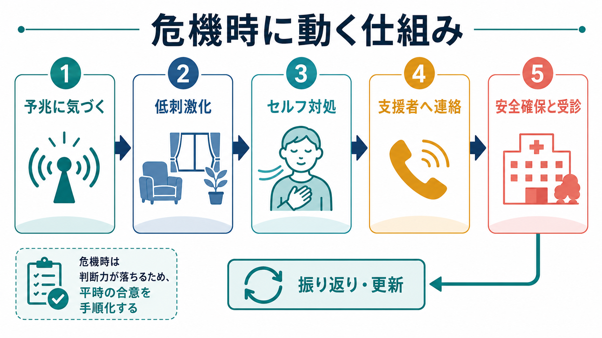
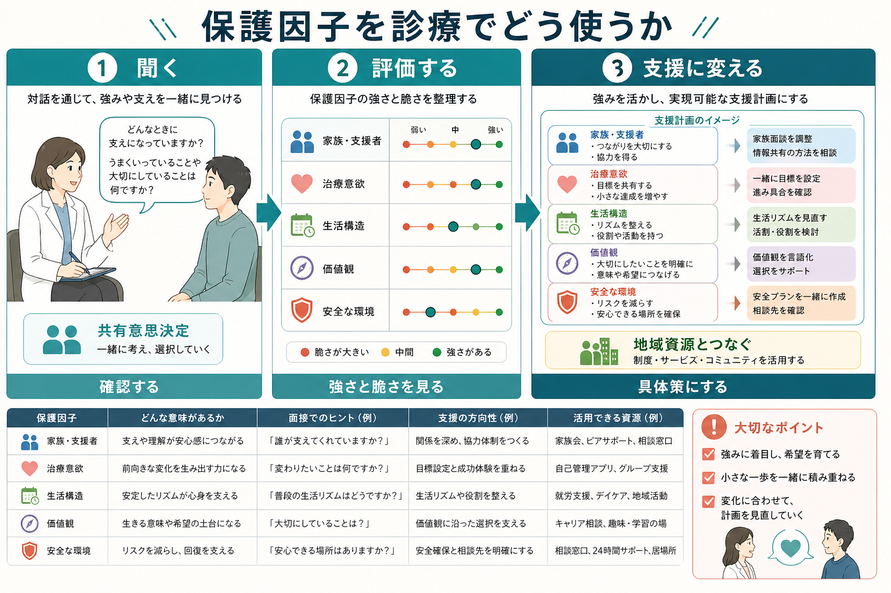

# 精神科診療における保護因子とは何か

## 要点

- 保護因子とは、症状やストレスを「消す」要因ではなく、リスクがある状況でも破綻を遅らせ、対処を増やし、支援につながる余地を広げる要因である。
- 精神科診療では、家族・友人・支援者、治療関係、治療意欲、生活リズム、住まい、仕事・学校・役割、価値観、意味、文化的背景、安全な環境を具体的に確認する。
- 保護因子は「ある／ない」で終わらせず、本人が実際に使えるか、どの場面で弱まるか、急性期に誰が何をするかまで評価する。
- 保護因子を聞くことは、楽観的な慰めではない。[[自殺リスク評価では何を聞くべきか]]や[[他害リスク評価では何を見るべきか]]と同じく、リスク・フォーミュレーションと支援計画の一部である。
- 家族支援や治療同盟、生活構造は、疾患や文脈によって効果が異なるため、本人の同意、守秘、負担、安全を確認しながら扱う。

## この記事で答える問い

1. 精神科診療でいう「保護因子」とは何か。
2. 家族支援、治療意欲、生活構造、価値観はどのように回復を支えるのか。
3. 保護因子を面接でどのように聞き、支援計画へつなげるのか。
4. 「保護因子があるから大丈夫」という誤解をどう避けるか。

## まず結論

精神科診療における保護因子とは、本人の苦痛、症状、社会的困難、危機の高まりがあるなかで、機能低下や危険な行動への移行を緩衝し、回復に向かう行動を可能にする条件である。WHOは、メンタルヘルスを左右するリスク因子と保護因子は個人、家族、地域、社会構造の複数水準で働き、社会情動的スキル、肯定的な社会的交流、教育・仕事、安全な地域、強いコミュニティのつながりなどが保護的に働くと整理している[1]。

したがって、保護因子は「前向きな性格」「家族がいる」「通院している」といった静的ラベルではない。実際の診療では、本人が困ったときに誰へ連絡できるか、服薬や受診を妨げる要因は何か、生活リズムはどの程度保たれているか、本人が守りたい価値や役割は何か、危険な手段から距離を取れるか、支援者が燃え尽きていないかを確認する。

## 背景

精神科面接では、症状、診断、リスク、治療歴が注目されやすい。これは不可欠だが、それだけでは「何が危ないか」はわかっても、「何を使って支えるか」が見えにくい。[[精神科初診で何を確認するべきか]]や[[現病歴はどのように構造化するべきか]]で確認する情報は、病状の把握だけでなく、支援可能性の把握にも使われる。

保護因子の視点は、[[生物心理社会モデルとは何か]]と親和的である。個人の対処技能だけでなく、家族、住居、学校・職場、福祉制度、文化的意味づけ、医療へのアクセスを含めて、本人を支える条件を評価するからである。これは[[ストレス脆弱性モデルとは何か]]の「脆弱性」と対になる視点でもある。ストレスと脆弱性が症状を押し上げる一方で、保護因子はストレスの影響を弱め、早期受診、相談、休息、服薬継続、危機回避などの行動を取りやすくする。

自傷・自殺リスクの文脈では、この視点は特に重要である。VA/DoDの自殺リスク診療ガイドラインは、急性リスクの同定、包括的評価、管理をモジュールとして整理しており、単一の尺度や印象だけでなく臨床判断を組み合わせる必要がある[2]。NICEの自傷ガイドラインも、リスク尺度で将来の自殺や反復自傷を予測したり、退院・治療提供の判断に使ったりすることを避け、本人のニーズ、安全、心理社会的文脈に焦点を当てることを推奨している[3]。

## 基本概念

### 保護因子は「リスクの反対」ではない

保護因子は、危険因子が少ないことと同じではない。たとえば、希死念慮が強い人に「家族がいる」ことは保護的に働く場合もあるが、家族関係が葛藤的で、本人が連絡をためらい、家族側も疲弊しているなら、単純な保護因子とは言えない。逆に、独居であっても、定期的な訪問看護、信頼できる友人、危機時の連絡手順、安定した住居、本人の価値目標が明確であれば、複数の保護因子が働きうる。

保護因子は、少なくとも次の三つに分けて考えると実践的である。

| 水準 | 例 | 面接での見方 |
|---|---|---|
| 個人内要因 | 問題解決、感情調整、助けを求める力、価値観、希望、過去の対処経験 | 「つらい時に何が少し役立ったか」「何を守りたいか」 |
| 関係・生活要因 | 家族、友人、治療者、ピア、生活リズム、役割、仕事・学校、住居 | 「誰に連絡できるか」「日課はどこまで保てているか」 |
| 環境・制度要因 | 医療アクセス、福祉サービス、経済支援、安全な住環境、手段への距離 | 「支援資源を実際に使えるか」「危機時に安全をどう確保するか」 |

### 回復志向の言葉で理解する

回復は、症状が完全になくなることだけを意味しない。SAMHSAは、回復を健康、住まい、目的、コミュニティという四つの主要次元で整理し、希望、本人の強み、資源、価値、家族・友人・ピアによる支援を重視している[4]。LeamyらのCHIME枠組みも、精神疾患からの個人的回復を、Connectedness（つながり）、Hope（希望）、Identity（アイデンティティ）、Meaning（意味）、Empowerment（主体性）として整理した[5]。

精神科診療で保護因子を聞くときは、この回復志向の言葉が役立つ。本人にとっての「つながり」「希望」「自分らしさ」「意味」「選べる感覚」が、どこに残っているかを探すからである。これは[[精神医学における回復とは何か]]や[[精神医学におけるレジリエンスとは何か]]と直結する。

## 仕組み

### 1. リスクの影響を緩衝する

保護因子は、ストレスや症状があっても、それがすぐ危機行動や機能低下に移行しないようにする。たとえば、家族が早期警告サインに気づき、本人の同意のもとで主治医や訪問看護へ連絡できる場合、悪化が深刻化する前に支援が入る。統合失調症の再発予防では、家族介入や家族心理教育が再発率を下げることが複数のランダム化比較試験を含むネットワークメタ解析で示されている[6]。

ただし、家族支援は万能ではない。過干渉、批判、暴力、支配、本人のプライバシー侵害がある場合、家族は保護因子ではなくリスク因子にもなりうる。したがって、[[家族面接では何を評価するべきか]]や[[家族への説明で何に注意するべきか]]で扱うように、家族の善意だけでなく、本人の同意、関係性、負担、役割分担、安全を評価する必要がある。

### 2. 治療につながる行動を増やす

治療意欲は「医師の言うことを聞く態度」ではない。本人が、治療の意味、利益、不利益、代替案を自分の生活目標と結びつけて考えられる状態である。ここでは[[共同意思決定とは何か]]、[[コンコーダンスとは何か]]、[[アドヒアランスとは何か]]が重要になる。

治療関係も保護因子になりうる。統合失調症スペクトラム障害や早期精神病における治療同盟のメタ解析では、本人や観察者から見た良好な治療同盟が治療参加と関連し、一部の症状改善とも関連した[7]。これは、治療者との関係が症状そのものを魔法のように消すという意味ではなく、本人が困った時に話す、通院する、薬や心理社会的支援を試す、危機時に連絡するという行動の土台になりうるという意味である。

### 3. 生活構造が再発と危機を見えやすくする

生活リズム、睡眠、食事、活動、金銭管理、家事、学校・仕事の予定は、精神症状の悪化を防ぐだけでなく、悪化の早期サインを見つける手がかりにもなる。双極症の治療研究では、対人関係・社会リズム療法が、日課の安定、誘因の同定と管理、対人関係の調整を扱う介入として整理されている[8]。疾患ごとに適応やエビデンスの強さは異なるが、生活構造が気分、睡眠、活動性、対人ストレスと結びつくという臨床的視点は広く有用である。

生活構造を見るときは、本人を「規則正しくできない人」と評価するのではなく、日課を保ちにくくしている症状、環境、貧困、睡眠障害、家庭内役割、職場環境を見分ける。[[生活歴はなぜ重要なのか]]や[[精神科診察で睡眠をどう評価するか]]と接続して、日々の生活がどのように支えになり、どこで崩れやすいかを確認する。

## 図解

保護因子は、次のような流れで臨床的に使うと整理しやすい。

| 段階 | 問い | 具体例 |
|---|---|---|
| 聞く | 何が本人を支えているか | 家族、友人、治療者、役割、趣味、信仰、価値、過去の対処 |
| 評価する | それは危機時に実際に使えるか | 連絡先、時間帯、本人の同意、支援者の負担、安全性 |
| 支援に変える | どの行動へ落とし込むか | 受診間隔、危機時連絡、服薬支援、生活リズム、福祉連携 |
| 見直す | いつ弱まり、いつ強まるか | 退院直後、失職、家族不在、睡眠悪化、飲酒再開、季節変動 |

## 臨床・研究との接続

### 面接での聞き方

保護因子を聞く質問は、本人の苦痛を軽く扱う言葉にならないようにする。急性の苦痛が強い場面で「でも家族がいるでしょう」「生きる理由は何ですか」と急に尋ねると、本人は責められたように感じることがある。まず苦痛を確認し、そのうえで支えになりうるものを共同で探す。

使いやすい問いは次のようなものである。

| 評価領域 | 質問例 |
|---|---|
| 支援者 | 「今の状態を知っていて、連絡してもよい人はいますか」 |
| 治療とのつながり | 「これまで治療が少しでも役に立った場面はありましたか」 |
| 生活構造 | 「眠る、食べる、外に出る、予定をこなす中で、まだ保てているものはありますか」 |
| 価値・意味 | 「今すぐ大きな目標でなくてよいので、失いたくないものはありますか」 |
| 安全 | 「危ない物や場所から距離を取るために、今日できることはありますか」 |
| 支援の実行性 | 「その人に連絡するとしたら、誰が、いつ、何と伝えるのがよさそうですか」 |

### ケース・フォーミュレーションに入れる

保護因子は、カルテの末尾に「家族あり、通院意欲あり」と書くだけでは不十分である。リスク因子、発症・悪化要因、維持要因、保護因子、短期目標を一つの仮説としてまとめると、支援計画に接続しやすい。

たとえば、次のように書ける。

> 抑うつ症状と不眠、職場での叱責、飲酒再開が急性リスクを高めている。一方で、本人は子どもとの関係を失いたくないと述べ、姉には連絡可能で、主治医との関係は保たれている。今週は睡眠確保、飲酒量の確認、危険手段からの距離、姉への連絡同意、3日後の再診を短期保護因子として具体化する。

このように書くと、保護因子が「励まし」ではなく、行動計画の構成要素になる。

### 研究での扱い

研究では、保護因子を単独の変数として扱うことも、回復、レジリエンス、社会的支援、治療同盟、家族介入、生活リズム、希望、意味、主体性などの構成概念として扱うこともある。CHIMEのような回復枠組みは、本人の主観的回復を理解するうえで有用である一方、疾患別の症状転帰や急性リスクの予測とは同じではない[5]。臨床研究を読むときは、「何をアウトカムにしているか」を確認する必要がある。

## よくある誤解

### 誤解1: 保護因子があればリスクは低い

保護因子があっても、急性の希死念慮、精神病症状、物質使用、衝動性、手段へのアクセス、急な喪失が重なれば危機は高まる。保護因子はリスクをゼロにするものではない。NICEが強調するように、尺度や総合リスク分類だけで処遇を決めず、ニーズと安全を中心にフォーミュレーションする必要がある[3]。

### 誤解2: 家族がいれば保護的である

家族がいることと、家族支援が機能していることは違う。家族が本人の苦痛を理解し、支援者として機能し、本人がその支援を受け入れられ、家族自身も支援されている場合に、家族は保護因子になりやすい。逆に、葛藤、暴力、支配、過干渉、強い疲弊がある場合は、家族関係そのものがリスクになる。

### 誤解3: 治療意欲は本人の性格で決まる

治療意欲は、病識、症状、過去の医療体験、副作用、費用、通院距離、家族の意見、文化的理解、治療者との関係によって変わる。本人の「やる気」だけに還元すると、介入できる要因を見落とす。[[病識とは何か]]、[[疾病受容とは何か]]、[[支持的面接とは何か]]と合わせて考える必要がある。

### 誤解4: 価値観を聞くのは危機対応ではない

価値観や意味を聞くことは、急性期の安全確認の代わりにはならない。しかし、本人が何を守りたいか、何が少しでも生きる方向へ働くかを知ることは、危機時の支援計画を本人の言葉に近づける。これは楽観論ではなく、本人が使える行動の足場を探す作業である。

## 限界と未解決問題

- 保護因子の多くは文脈依存であり、同じ要因が別の状況ではリスクにもなりうる。
- 保護因子は「本人の責任」として使われると有害である。支援資源が乏しいことを本人の努力不足として扱ってはならない。
- 文化的背景、貧困、差別、制度アクセスの不平等は、個人面接だけでは修正できない。臨床では個別支援と制度的支援を分けて考える必要がある。
- 保護因子が急性リスクをどの程度、どの時間幅で下げるかは、疾患、年齢、支援体制、アウトカムによって異なる。研究知見を個別症例へ直接当てはめすぎない。

## 関連ノート

- [[精神医学におけるレジリエンスとは何か]]
- [[精神医学における回復とは何か]]
- [[生物心理社会モデルとは何か]]
- [[ストレス脆弱性モデルとは何か]]
- [[自殺リスク評価では何を聞くべきか]]
- [[家族面接では何を評価するべきか]]
- [[家族への説明で何に注意するべきか]]
- [[治療関係とは何か]]
- [[共同意思決定とは何か]]
- [[コンコーダンスとは何か]]
- [[アドヒアランスとは何か]]
- [[心理教育とは何か]]
- [[生活歴はなぜ重要なのか]]

MOC更新候補:

- `content/00_MOC/MOC｜総合入口.md`
- 精神医学、精神科面接、リスク評価、回復志向ケアに関するMOC

## 理解チェック

1. 「家族がいる」ことを保護因子として扱う前に、どのような点を確認する必要があるか。
2. 保護因子を「リスクが低い証拠」として使うことの問題は何か。
3. 治療同盟や治療意欲は、どのように支援計画へ落とし込めるか。
4. 生活リズムや役割は、なぜ精神科診療で保護因子になりうるか。
5. 本人の価値観を聞くことは、危機対応の中でどのような意味を持つか。

## 参考文献

[1] World Health Organization. (2025). *Mental health*. https://www.who.int/westernpacific/newsroom/fact-sheets/detail/mental-health-strengthening-our-response

[2] U.S. Department of Veterans Affairs and Department of Defense. (2024). *VA/DoD Clinical Practice Guideline for Assessment and Management of Patients at Risk for Suicide*. https://www.healthquality.va.gov/guidelines/mh/srb/

[3] National Institute for Health and Care Excellence. (2022). *Self-harm: assessment, management and preventing recurrence* (NICE Guideline No. 225). https://www.ncbi.nlm.nih.gov/books/NBK588208/

[4] Substance Abuse and Mental Health Services Administration. (2024). *About Recovery*. https://www.samhsa.gov/substance-use/recovery/about

[5] Leamy, M., Bird, V., Le Boutillier, C., Williams, J., & Slade, M. (2011). Conceptual framework for personal recovery in mental health: systematic review and narrative synthesis. *The British Journal of Psychiatry, 199*(6), 445-452. https://doi.org/10.1192/bjp.bp.110.083733

[6] Rodolico, A., Bighelli, I., Avanzato, C., et al. (2022). Family interventions for relapse prevention in schizophrenia: a systematic review and network meta-analysis. *The Lancet Psychiatry, 9*(3), 211-221. https://doi.org/10.1016/S2215-0366(21)00437-5

[7] Browne, J., Wright, A. C., Berry, K., et al. (2021). The alliance-outcome relationship in individual psychosocial treatment for schizophrenia and early psychosis: A meta-analysis. *Schizophrenia Research, 231*, 154-163. https://doi.org/10.1016/j.schres.2021.04.002

[8] Butler, M., Urosevic, S., Desai, P., et al. (2018). *Treatment for Bipolar Disorder in Adults: A Systematic Review*. Agency for Healthcare Research and Quality. https://www.ncbi.nlm.nih.gov/books/NBK532198/
