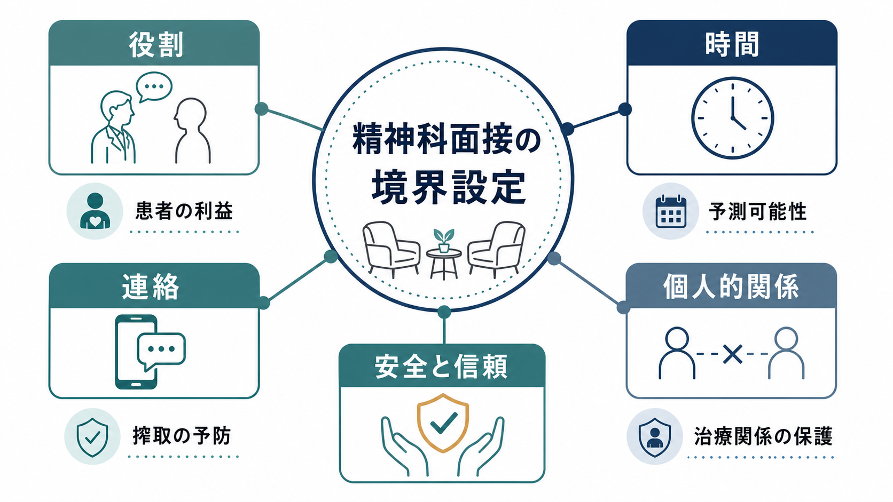
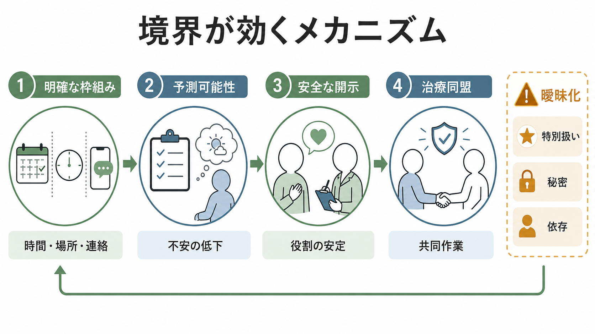
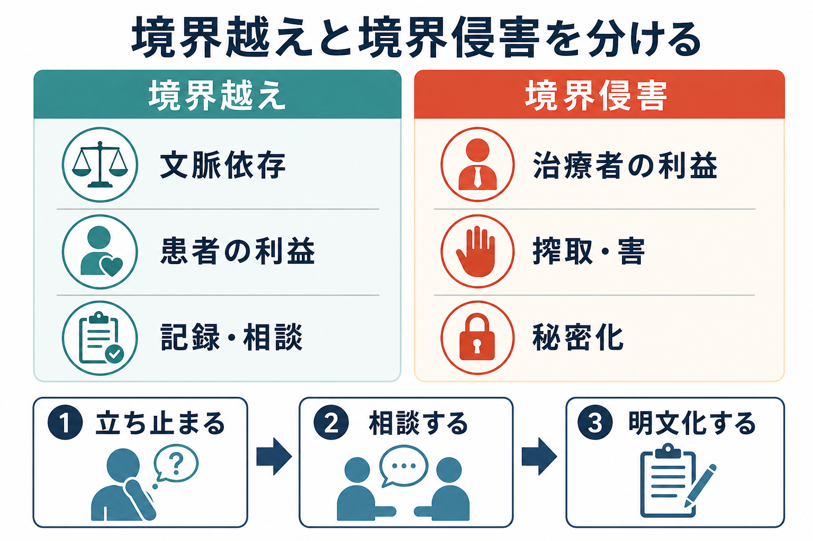

# 精神科面接で境界設定はなぜ必要なのか

## 要点

- 境界設定とは、治療者と患者の関係を「何のための関係か」に沿って保つために、役割、時間、場所、連絡、金銭、自己開示、贈り物、身体接触、個人的関係などの枠組みを明確にすることである[1]。
- 精神科面接では、患者が脆弱な状態で個人的情報を語ることが多く、治療者との権力差もある。そのため、境界は冷たさではなく、患者の利益と安全を守る構造である[2][3]。
- 重要なのは、すべての境界越えを機械的に禁じることではない。臨床文脈によっては治療的に意味のある境界越えもあるが、治療者の利益、秘密化、依存、搾取、害につながるものは境界侵害として扱う[1][7]。
- 時間、連絡、個人的関係のルールが明確だと、患者は「何を期待できるか」を予測しやすくなり、安心して語り、共同作業としての[[治療関係とは何か|治療関係]]を作りやすくなる[5][8]。

## この記事で答える問い

1. 精神科面接でいう「境界」とは何を指すのか。
2. なぜ、治療者と患者の役割・時間・連絡・個人的関係を曖昧にしない必要があるのか。
3. 境界越えと境界侵害はどう違うのか。
4. 境界設定は、[[共感的理解とは何か|共感]]や柔軟な臨床対応と矛盾するのか。

## まず結論

精神科面接で境界設定が必要なのは、面接を「私的な親密さ」ではなく「患者の利益のための専門的な共同作業」として保つためである。精神科では、患者が不安、恥、依存、怒り、希死念慮、トラウマ、家族関係、薬物使用、経済問題など、ふだん他者に語りにくい内容を話すことがある。治療者がその情報や信頼を私的満足、特別扱い、親密化、支配、評価欲求のために使うと、患者は搾取されやすくなる[2][6]。

したがって境界は、患者を遠ざける壁ではない。むしろ、患者が安全に近づけるための枠である。いつ会うのか、どの連絡手段を使うのか、緊急時はどこに相談するのか、治療者はどこまで自己開示するのか、診療外の関係をどう扱うのかが明確であるほど、患者は面接を予測しやすくなる。この予測可能性が、[[精神科面接とは何か|精神科面接]]の情報収集、リスク評価、治療方針の共有を支える。

## 背景

境界の議論は、精神療法や精神科診療の倫理、医療事故、性的不品行、二重関係、自己開示、贈り物、SNS、メール連絡などの問題と結びついて発展してきた。Gutheil と Gabbard は、臨床上の境界を、役割、時間、場所、金銭、贈り物、サービス、服装、言葉、自己開示、身体接触などの領域として整理した[1]。Gabbard と Nadelson も、医師患者関係の境界が、信頼、専門職倫理、患者の脆弱性を守るために必要だと論じている[2]。

精神科で境界が特に問題になりやすいのは、関係そのものが治療に深く関与するからである。患者は治療者に強い期待、失望、怒り、理想化、依存、恐れを向けることがある。治療者側にも、助けたい気持ち、救済者になりたい気持ち、拒絶されたくない気持ち、患者に好かれたい気持ちが生じうる。これらは人間的には自然でも、治療上は注意深く扱う必要がある。

同時に、境界論には誤用の危険もある。境界を硬直した禁止リストとして使うと、文化的文脈、緊急性、患者の現実的支援、治療的柔軟性を見落とす。Gutheil と Gabbard は、境界越えと境界侵害を区別し、患者に害を与えず治療に資する文脈依存の対応まで過度に禁止することを戒めている[7]。

## 基本概念

### 境界

境界とは、治療者と患者の関係を専門的目的に沿って保つための「臨床上の枠組み」である。典型的には、次の領域が含まれる。

| 領域 | 面接での例 | 守る意義 |
|---|---|---|
| 役割 | 治療者は友人・家族・恋人・雇用主ではなく、診療上の役割を担う | 権力差と責任の所在を明確にする |
| 時間 | 面接時間、予約、遅刻、延長、頻度 | 予測可能性と公平性を保つ |
| 連絡 | 電話、メール、SNS、緊急時連絡 | 依存、誤解、過剰対応、情報漏洩を防ぐ |
| 個人的関係 | 私的交流、贈り物、金銭貸借、性的・恋愛的関係 | 搾取と利益相反を防ぐ |
| 情報 | 守秘、記録、家族・職場との情報共有 | 自律性と安全を両立する |

### 境界越え

境界越えとは、標準的な枠組みから外れるが、文脈によっては患者の利益になり、治療を損なわない可能性がある行為である[1][7]。たとえば、災害後に連絡手段を一時的に調整する、文化的に意味のある小さな贈り物への対応を慎重に考える、終末期や危機介入で通常より柔軟な面接設定をする、などがありうる。

境界越えを行う場合は、「誰の利益か」「秘密化していないか」「同僚に説明できるか」「記録できるか」「同じ状況で一貫して判断できるか」を確認する必要がある。

### 境界侵害

境界侵害とは、患者の脆弱性や信頼を利用し、患者や治療に害を与える、または害の可能性が高い逸脱である[3][6]。性的関係、恋愛関係、金銭的搾取、治療者の孤独や承認欲求を満たすための自己開示、秘密の特別扱い、SNSでの不適切な接触、患者を治療者の私的目的に使うことなどが含まれる。

APA の倫理注釈は、精神科では一般医療と同じ倫理原則が適用されるだけでなく、精神科特有の倫理問題があるため、精神科に即した注釈が必要だと述べる[4]。GMC の境界ガイダンスも、現患者との性的または不適切な情緒的関係を禁じ、患者が医療者を信頼できることを重視している[5]。

## 仕組み

境界設定は、次のような心理的・制度的仕組みを通して面接を支える。

1. 予測可能性を作る。  
   面接時間、連絡方法、緊急時対応が明確だと、患者は「どこまで頼ってよいのか」「いつ返事が来るのか」「危機時は何をすればよいのか」を理解しやすくなる。

2. 役割を安定させる。  
   治療者が友人、親、救済者、恋人、監視者のように振る舞うと、患者は何を話してよいのか迷う。役割が安定しているほど、患者は自分の経験を臨床的に扱いやすくなる。

3. 権力差を見える化する。  
   治療者は診断、処方、診断書、入院判断、守秘の例外、安全確保などに関わる権限を持つ。境界は、この権力差が患者の利益のために使われるようにする安全装置である[2][5]。

4. 搾取を防ぐ。  
   患者の信頼、依存、孤立、トラウマ、経済的困難は、治療者に利用されると深刻な害になる。境界は、治療者の欲求と患者の利益を混同しないための基準になる[6]。

5. 治療同盟を保つ。  
   Bordin の作業同盟は、目標への合意、課題への合意、情緒的な結びつきから成る[8]。境界は情緒的結びつきを弱めるものではなく、目標と課題を見失わないための枠である。

## 図解

図1は、精神科面接における境界を、役割、時間、連絡、個人的関係、安全と信頼の5要素として示している。図2は、明確な枠組みが予測可能性を生み、安全な開示と治療同盟につながる流れを示している。図3は、境界越えと境界侵害を区別し、迷ったときに立ち止まり、相談し、明文化する実践を整理している。

## 臨床・研究との接続

### 初診・再診での説明

境界設定は、問題が起きたときだけの対応ではない。[[精神科初診で何を確認するべきか|初診]]の段階で、面接時間、守秘とその限界、緊急時の相談先、連絡手段、処方・診断書・家族連携の扱いを説明しておくと、後の誤解を減らしやすい。これは患者を管理するためではなく、患者が治療に参加するための情報を共有することである。

### 連絡とオンライン境界

現代の臨床では、電話、メール、予約システム、オンライン診療、SNSが境界問題を複雑にする。Friedman と Martinez は、精神科における境界侵害には性的関係だけでなく、不適切なオンライン行動やメール境界も含まれると整理している[6]。連絡手段は便利だが、返信時間、緊急用途の可否、記録への反映、個人アカウントの使用禁止などを明確にしないと、治療者にも患者にも負担が増える。

### 文化・制度・現実的支援

境界は文化や制度から独立して存在するわけではない。地域医療、災害、過疎地、学校・職場連携、家族同席、生活保護、司法・福祉連携などでは、治療者と患者の関係が診察室の中だけで完結しないことがある。したがって、境界設定は「一律に距離を置く」ことではなく、支援の必要性、患者の自律性、安全、説明責任を同時に考える臨床判断である。

### 教育・スーパービジョン

境界問題は、個人の道徳性だけで処理すると見逃されやすい。治療者が「この患者だけは特別」「相談すると誤解される」「記録には残さない方がよい」と考え始めたときほど、スーパービジョンや同僚相談が重要になる。境界を相談可能な話題にしておくことは、患者だけでなく治療者を守る。

## よくある誤解

### 誤解1: 境界設定は冷たい態度である

境界設定は冷たさではない。むしろ、患者が安心して近づける距離を作ることである。たとえば「夜間は個別メールで対応できません。危険が高いときは救急窓口に連絡してください」と説明することは拒絶ではなく、危機時に機能するルートを明確にする行為である。

### 誤解2: 共感があれば境界は不要である

[[共感的理解とは何か|共感]]は重要だが、共感だけでは権力差や依存の問題は解決しない。患者の苦痛に強く共感するほど、治療者は「通常の枠を超えて助けたい」と感じることがある。そのときこそ、患者の利益、長期的影響、他の支援資源、相談可能性を確認する必要がある。

### 誤解3: すべての境界越えは悪い

すべての境界越えが境界侵害ではない[1][7]。重要なのは、文脈、目的、患者への影響、説明責任である。境界越えが治療的に必要な場合でも、治療者の自己満足、秘密化、依存強化、特別扱いになっていないかを点検する。

### 誤解4: 患者が望んだなら問題ない

患者の同意は重要だが、専門職境界ではそれだけでは十分でない。医療者には権限、知識、制度上の力があり、患者は症状、依存、孤立、経済的困難、トラウマの影響を受けていることがある。したがって、現患者との性的・恋愛的関係のような行為は、患者が望んだように見えても倫理的に許容されない[4][5]。

## 関連ノート

### 既存ノート

- [[精神科面接とは何か]]
- [[治療関係とは何か]]
- [[共感的理解とは何か]]
- [[精神科初診で何を確認するべきか]]
- [[精神科診断は何のためにあるのか]]
- [[生物心理社会モデルとは何か]]

### 今後の作成候補

- 境界越えと境界侵害は何が違うのか
- 精神科面接における守秘義務とその限界
- 精神科診療におけるSNS境界
- スーパービジョンとは何か
- 転移と逆転移は臨床でどう扱うのか

### MOC更新候補

- `content/00_MOC/` 配下の精神医学、臨床実践、倫理関連 MOC
- 並列ジョブとの競合を避けるため、本タスクでは MOC 本体は更新しない。

## 理解チェック

1. 境界設定が「患者を遠ざける壁」ではなく「安全に近づくための枠」と言えるのはなぜか。
2. 役割、時間、連絡、個人的関係のうち、精神科面接で最も曖昧になりやすいものは何か。具体例を挙げて説明できるか。
3. 境界越えと境界侵害を分けるとき、「患者の利益」「秘密化」「記録・相談可能性」はどのように役立つか。
4. 治療者が強い共感や救済欲求を感じたとき、どのような点検が必要か。
5. オンライン診療やメール・SNS連絡では、どのような境界を事前に説明するべきか。

## 参考文献

[1] Gutheil, T. G., & Gabbard, G. O. (1993). The concept of boundaries in clinical practice: Theoretical and risk-management dimensions. *American Journal of Psychiatry, 150*(2), 188-196. https://doi.org/10.1176/ajp.150.2.188

[2] Gabbard, G. O., & Nadelson, C. (1995). Professional boundaries in the physician-patient relationship. *JAMA, 273*(18), 1445-1449. https://doi.org/10.1001/jama.1995.03520420061039

[3] Nadelson, C., & Notman, M. T. (2002). Boundaries in the doctor-patient relationship. *Theoretical Medicine and Bioethics, 23*(3), 191-201. https://doi.org/10.1023/A:1020899425668

[4] American Psychiatric Association. (2013). *The Principles of Medical Ethics With Annotations Especially Applicable to Psychiatry: 2013 Edition*. https://www.psychiatry.org/file%20library/practice/ethics%20documents/principles2013--final.pdf

[5] General Medical Council. (2024). *Maintaining personal and professional boundaries*. https://www.gmc-uk.org/professional-standards/the-professional-standards/maintaining-personal-and-professional-boundaries/maintaining-personal-and-professional-boundaries

[6] Friedman, S. H., & Martinez, R. P. (2019). Boundaries, professionalism, and malpractice in psychiatry. *Focus, 17*(4), 365-371. https://doi.org/10.1176/appi.focus.20190019

[7] Gutheil, T. G., & Gabbard, G. O. (1998). Misuses and misunderstandings of boundary theory in clinical and regulatory settings. *American Journal of Psychiatry, 155*(3), 409-414. https://doi.org/10.1176/ajp.155.3.409

[8] Bordin, E. S. (1979). The generalizability of the psychoanalytic concept of the working alliance. *Psychotherapy: Theory, Research & Practice, 16*(3), 252-260. https://doi.org/10.1037/h0085885

## 未解決問題

- オンライン診療、AI補助記録、患者ポータルが、治療者と患者の連絡境界をどのように変えるか。
- 文化的慣習、地域医療、災害支援の文脈で、境界越えをどのように記録・相談・評価するのがよいか。
- 境界設定を、患者の自律性と共同意思決定を高める説明としてどのように教育できるか。
