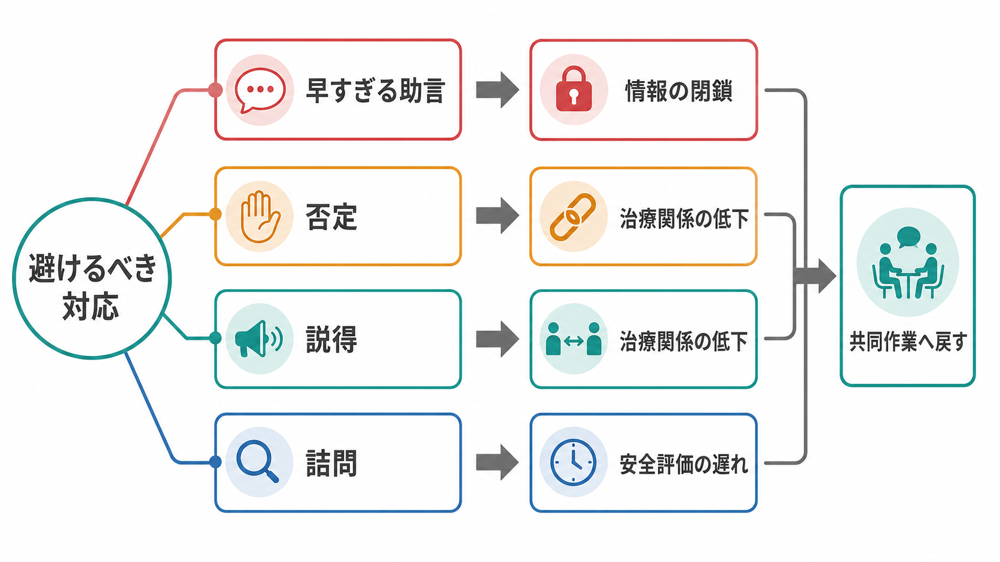
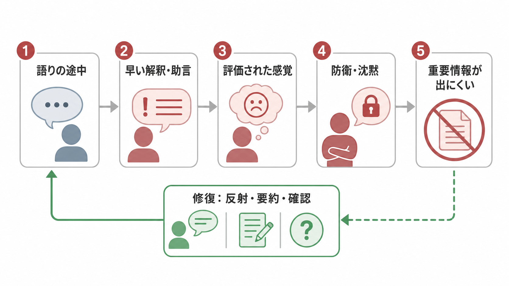
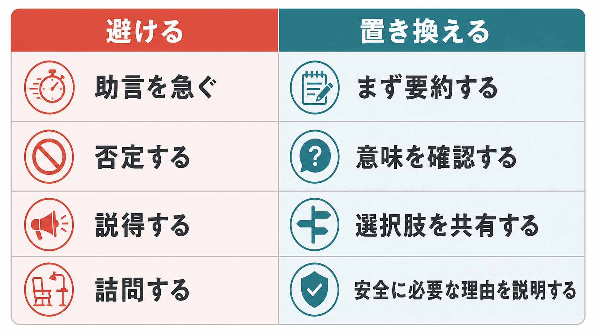

# 精神科面接で避けるべき対応は何か

## 要点

- 精神科面接で避けるべき中心的な対応は、早すぎる助言、否定、説得、詰問である。
- これらは単に「感じが悪い」だけではなく、患者が重要情報を出しにくくなり、[[精神科面接とは何か|精神科面接]]の評価精度と安全評価を下げる。
- 早すぎる助言は、患者の語りを閉じ、困りごとの意味づけを面接者側の仮説で上書きしやすい。
- 否定や説得は、患者の抵抗・防衛・沈黙を強め、[[治療関係とは何か|治療関係]]の同盟破綻につながる。
- 詰問は、安全確認に必要な質問であっても、理由を説明せずに行うと責められている感覚を生みやすい。
- 代替となる基本動作は、受容、反射、要約、意味の確認、選択肢の共有、必要な質問の理由説明である。

## この記事で答える問い

1. 精神科面接で「避けるべき対応」とは具体的に何か。
2. なぜ早すぎる助言・否定・説得・詰問は、治療関係を損ないやすいのか。
3. 避けるべき対応を、臨床的に有用な問いかけへどう置き換えるか。
4. 安全評価やリスク確認が必要なとき、詰問にならないために何を説明するか。

## まず結論

精神科面接では、面接者が「正しい答え」を早く出そうとするほど、患者の語りは狭くなりやすい。APA の成人精神科評価ガイドラインは、精神科評価の目的を、診断精度、治療選択、患者の関与、安全評価、文化的・社会的背景の理解を含む広い臨床過程として位置づけている[1]。つまり面接は、症状を聞き出すだけの手続きではなく、患者が話してよいと感じる条件を作る評価技術でもある。

避けるべき対応は「何も言わずに受け身でいること」と同義ではない。必要な質問、リスク確認、現実検討、治療提案は行う。ただし、患者の語りがまだ形成されていない段階で助言や説得を急ぐと、面接者の意図は支援でも、患者側には「評価された」「わかってもらえない」「誘導されている」と受け取られやすい。NICE の成人メンタルヘルス利用者経験ガイダンスも、評価場面では十分な時間を取り、患者が問題を説明・相談できるようにし、終盤に結論の要約と質疑の時間を確保することを推奨している[2]。

## 背景

精神科面接の難しさは、話題が症状だけに限られない点にある。患者は、抑うつ、不安、妄想、幻覚、衝動性、希死念慮、家族関係、仕事、薬物使用、身体疾患、過去のトラウマ、恥、罪悪感など、語りにくい情報を扱うことがある。したがって、面接者の一言が「開示しやすさ」を大きく左右する。

心理療法研究では、治療同盟が治療成績と一貫して関連することがメタ分析で示されている[3]。また、同盟破綻は、患者と治療者の協働関係に緊張や断絶が生じるエピソードとして整理され、回避・沈黙・反発・不参加などの形で現れうる[4]。精神科面接は心理療法そのものではない場合でも、同じく「協働関係の上で情報を扱う」実践であるため、この知見は面接技術を考える補助線になる。

## 基本概念

### 早すぎる助言

早すぎる助言とは、患者の問題理解、生活背景、価値観、これまで試した対処、助けを求める理由が十分に確認される前に、「こうした方がいい」と方向づけることである。助言は有害とは限らないが、タイミングが早いと、患者の語りを「解決策に従うかどうか」の話に変えてしまう。

たとえば「眠れない」と聞いてすぐに「運動しましょう」「スマホをやめましょう」と返すと、患者が本当に話したかった不安、過覚醒、虐待記憶、躁状態、薬物使用、希死念慮が表に出ないままになる。精神科では、助言の前に「その不眠がどのような生活史と症状群の中で起きているか」を見る必要がある。

### 否定

否定とは、患者の体験を面接者の現実判断でただちに打ち消すことである。「それは考えすぎです」「そんなことはありません」「気にしすぎです」といった反応は、事実訂正の意図があっても、患者には体験の否認として届くことがある。

妄想的確信、被害感、身体症状への不安、罪責感などでは、内容に同意しなくても、患者がどのように感じ、何を恐れ、どのような行動に影響しているかを確認できる。ここでの目標は、体験内容の真偽を即断することではなく、体験が患者の生活と安全にどう関わるかを評価することである。

### 説得

説得とは、面接者が正しいと考える方向へ患者を押し切ろうとすることである。薬物療法、入院、休職、家族相談、自傷予防などでは説得したくなる場面がある。しかし、動機づけ面接の理論は、面接者が「正そう」とするほど、患者の維持発言や不一致が強まる可能性を指摘している[6]。SAMHSA の TIP 35 も、専門家の罠や「正したい反射」に陥らず、患者の理解と選択を引き出すことを重視している[7]。

説得が必要に見える場面ほど、まず「何が引っかかっているか」を聞く方が臨床的に有用である。服薬拒否の背後には、副作用経験、依存への恐れ、家族からの圧力、診断名への抵抗、経済的問題、過去の医療不信があるかもしれない。

### 詰問

詰問とは、患者が責められている、追い詰められている、答えを強要されていると感じる質問の連続である。自殺リスク、他害リスク、虐待、物質使用、治療不遵守などでは具体的確認が必要だが、理由説明なしに「いつ」「なぜ」「本当に」「どうして」と畳みかけると、患者は防衛的になりやすい。

詰問を避けることは、リスク確認を避けることではない。「安全のために確認したい」「答えにくければそう言ってよい」「責めるためではなく、今日の支援を決めるために聞いている」と枠組みを示すことで、同じ質問でも意味が変わる。

## 仕組み

避けるべき対応が悪影響をもつ仕組みは、次のように整理できる。

1. 患者が語り始める。
2. 面接者が早く解釈・助言・否定・説得する。
3. 患者は「評価された」「わかってもらえない」「結論へ誘導されている」と感じる。
4. 防衛、沈黙、表面的同意、反発、話題変更が起きる。
5. 症状、リスク、生活背景、治療希望などの重要情報が出にくくなる。
6. 評価が粗くなり、治療方針も患者の現実に合いにくくなる。

この流れは、患者が「抵抗的」だから起こるとは限らない。むしろ面接の構造が、患者に自己防衛を促している場合がある。医療面接における共感的で肯定的なコミュニケーションは、患者の痛み、不安、満足度などに小さいながら有益な効果をもつことが系統的レビューとメタ分析で示されている[5]。これは、精神科面接でも、態度や応答の質が単なる接遇ではなく臨床情報の質に関わることを示唆する。

### 置き換えの基本

| 避ける対応 | 起こりやすい問題 | 置き換える対応 |
|---|---|---|
| 助言を急ぐ | 患者の語りが解決策への賛否に狭まる | まず要約し、助言を求めているか確認する |
| 否定する | 体験を話す安全感が下がる | 内容に同意せず、意味と影響を確認する |
| 説得する | 反発、表面的同意、不参加が起こる | 選択肢、利点、不安、本人の価値を共有する |
| 詰問する | 責められている感覚が生じる | 安全上の理由を説明して具体的に聞く |

## 図解

図 1 は、避けるべき対応が「情報の閉鎖」「治療関係の低下」「安全評価の遅れ」へつながりうることを示している。図 2 は、早すぎる助言が患者の開示を閉じる機序を、語り、防衛、重要情報の欠落、修復という流れで表している。図 3 は、臨床で使いやすい置き換え表である。

重要なのは、面接者が何も判断しないことではない。判断を急いで患者にぶつける前に、いったん患者の語りの形を保つことである。具体的には、次のような応答が使いやすい。

- 「今の話を一度まとめると、仕事の負担、眠れなさ、家族への申し訳なさが重なっている、という理解で合っていますか」
- 「すぐ助言する前に、これまで試したことを確認してもよいですか」
- 「その考えが事実かどうかを急いで決めるより、まずそれがどのくらい怖く、生活にどう影響しているかを知りたいです」
- 「自傷について確認します。責めるためではなく、今日安全に帰れるかを一緒に考えるためです」

## 臨床・研究との接続

### 診断との接続

[[精神科診断は何のためにあるのか|精神科診断]]は、患者を分類して終わるためではなく、症状の理解、リスク評価、治療選択、支援資源の調整に使う仮説である。早すぎる助言や説得は、診断仮説の材料となる生活史、発症経過、意味づけ、対人関係、文化的背景を取り逃がしやすい。これは[[現病歴はどのように構造化するべきか|現病歴]]や[[生活歴はなぜ重要なのか|生活歴]]の評価にも関わる。

### 安全評価との接続

自殺・自傷・他害・虐待・急性精神病状態などでは、面接者は踏み込んだ質問を避けてはいけない。ただし、踏み込み方には設計が必要である。質問の目的、守秘の範囲、緊急時の対応、患者の選択可能性を説明すると、リスク確認は詰問ではなく共同作業になりやすい。APA ガイドラインも、評価には自殺リスク、攻撃性リスク、物質使用、身体健康、文化的要因、患者の治療意思決定への関与を含める必要を示している[1]。

### 治療同盟との接続

治療同盟は、目標への合意、課題への合意、情緒的な結びつきからなる作業関係として理解できる。治療同盟が良いほど心理療法アウトカムが良いという関連は、多数の研究を統合したメタ分析で確認されている[3]。また、エビデンスに基づく治療関係のレビューでは、同盟、共感、患者フィードバック、協働などが臨床的に重視されている[8]。精神科面接でも、患者が「この人となら危険な話題も扱える」と感じられるかどうかが、評価と治療参加の条件になる。

## よくある誤解

### 誤解1: 助言を避けるとは、専門家として何も言わないこと

助言を避けるのではなく、助言の前に文脈を確認する。専門家の知識は必要である。ただし、患者が何に困り、何を恐れ、何をすでに試し、どの選択肢なら現実的かを確認してから提示する方が、助言は届きやすい。

### 誤解2: 否定しないとは、妄想や誤解に同意すること

同意しなくても、体験の意味は確認できる。「それが本当だと思います」と言う必要はない。「そう感じるほど怖い体験として続いているのですね」「それがあると外出しづらいのですね」と、体験の影響を評価することはできる。

### 誤解3: 説得しないとは、危険な選択を放置すること

危険が高い場合は、保護的介入や入院調整が必要になる。しかし、説得で押し切る前に、危険の根拠、選択肢、本人の不安、家族・支援者との連携、法的・倫理的な枠組みを説明する必要がある。強制力が関わる場面ほど、説明と記録が重要になる。

### 誤解4: 詰問を避けると、リスク評価が甘くなる

詰問を避けることと、具体的に聞くことは両立する。自殺方法、準備性、過去の行動、衝動性、保護因子などは具体的に聞く。ただし、理由を説明し、患者の負担を認め、必要に応じて休止や要約を挟むことで、質問は責めではなく安全確認になる。

## 関連ノート

既存ノート候補:

- [[精神科面接とは何か]]
- [[治療関係とは何か]]
- [[共感的理解とは何か]]
- [[精神科初診で何を確認するべきか]]
- [[現病歴はどのように構造化するべきか]]
- [[生活歴はなぜ重要なのか]]
- [[精神科診断は何のためにあるのか]]
- [[生物心理社会モデルとは何か]]

今後の作成候補:

- 精神科面接で沈黙をどう扱うべきか
- 精神科面接でリスク質問をどう切り出すか
- 精神科面接における同盟破綻とは何か
- 動機づけ面接は精神科面接にどう使えるか

MOC 更新候補:

- `content/00_MOC/` 配下の精神医学、診断・面接、臨床実践関連 MOC に本記事へのリンクを追加する。
- 並列ジョブとの競合を避けるため、本タスクでは MOC 本体は更新しない。

## 理解チェック

1. 早すぎる助言が、患者の開示を閉じるのはなぜか。
2. 患者の発言を否定せずに、妄想的・被害的内容を評価するにはどう聞けばよいか。
3. 説得が「維持発言」や反発を強める可能性があるのはなぜか。
4. 自傷リスクを確認するとき、詰問にしないために最初に何を説明するか。
5. 治療同盟の破綻が起きたとき、面接者はどのように修復を試みられるか。

## 参考文献

[1] American Psychiatric Association Work Group on Psychiatric Evaluation. (2016). *The American Psychiatric Association Practice Guidelines for the Psychiatric Evaluation of Adults, Third Edition*. American Psychiatric Association. https://www.swmbh.org/wp-content/uploads/Psychiatric-Evaluation-APA-Clinical-Practice-Guideline.pdf

[2] National Institute for Health and Care Excellence. (2011). *Service user experience in adult mental health: improving the experience of care for people using adult NHS mental health services* (CG136). https://www.nice.org.uk/guidance/cg136/chapter/Recommendations

[3] Flückiger, C., Del Re, A. C., Wampold, B. E., & Horvath, A. O. (2018). The alliance in adult psychotherapy: A meta-analytic synthesis. *Psychotherapy, 55*(4), 316-340. https://doi.org/10.1037/pst0000172

[4] Safran, J. D., Muran, J. C., & Eubanks-Carter, C. (2011). Repairing alliance ruptures. *Psychotherapy, 48*(1), 80-87. https://doi.org/10.1037/a0022140

[5] Howick, J., Moscrop, A., Mebius, A., Fanshawe, T. R., Lewith, G., Bishop, F. L., Mistiaen, P., Roberts, N. W., Dieninytė, E., Hu, X. Y., Aveyard, P., & Onakpoya, I. J. (2018). Effects of empathic and positive communication in healthcare consultations: A systematic review and meta-analysis. *Journal of the Royal Society of Medicine, 111*(7), 240-252. https://doi.org/10.1177/0141076818769477

[6] Miller, W. R., & Rose, G. S. (2009). Toward a theory of motivational interviewing. *American Psychologist, 64*(6), 527-537. https://doi.org/10.1037/a0016830

[7] Substance Abuse and Mental Health Services Administration. (2019). *TIP 35: Enhancing Motivation for Change in Substance Use Disorder Treatment*. https://library.samhsa.gov/product/tip-35-enhancing-motivation-change-substance-use-disorder-treatment/pep19-02-01-003

[8] Norcross, J. C., & Wampold, B. E. (2011). Evidence-based therapy relationships: Research conclusions and clinical practices. *Psychotherapy, 48*(1), 98-102. https://doi.org/10.1037/a0022161

## 未解決問題

- 日本語の精神科初診場面で、助言・説得・詰問の頻度と治療継続率がどの程度関連するか。
- オンライン診療やチャット相談で、反射・要約・確認をどのように伝えると治療同盟が保たれるか。
- リスク評価の標準化と、患者の主体性・安全感を両立する面接教育をどう設計するか。
