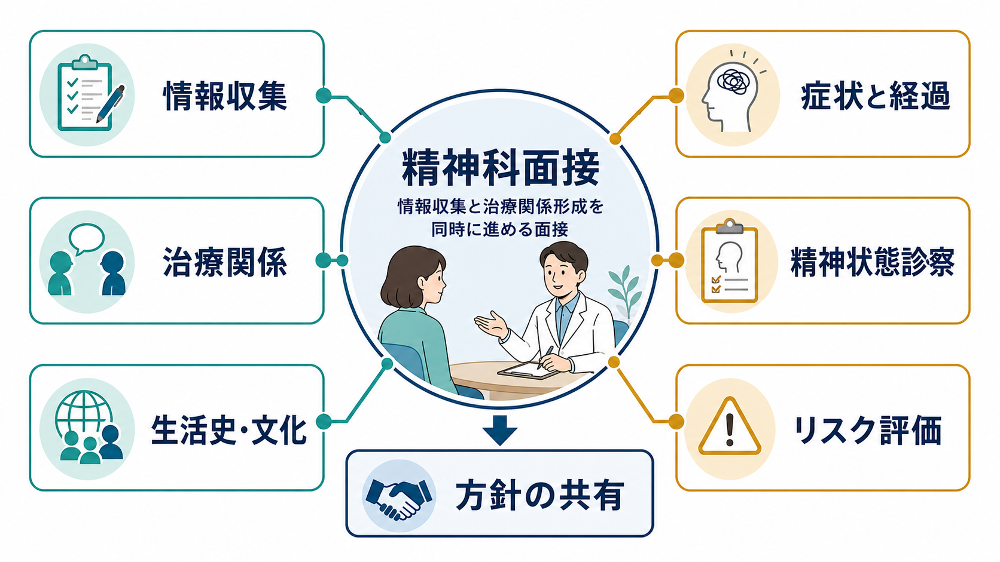
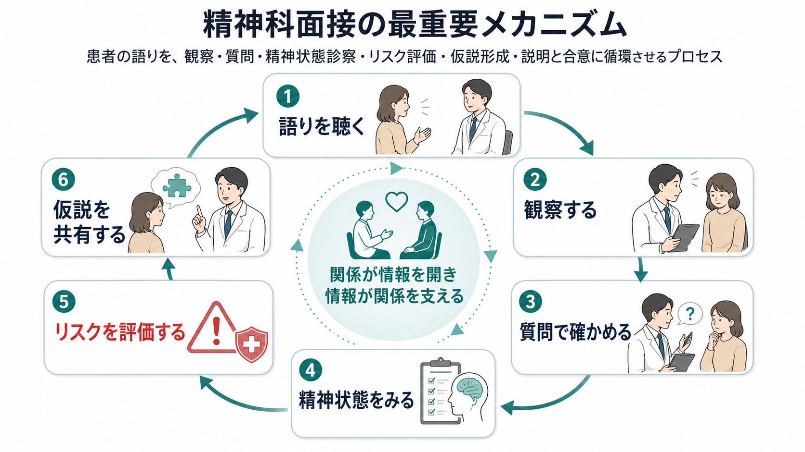
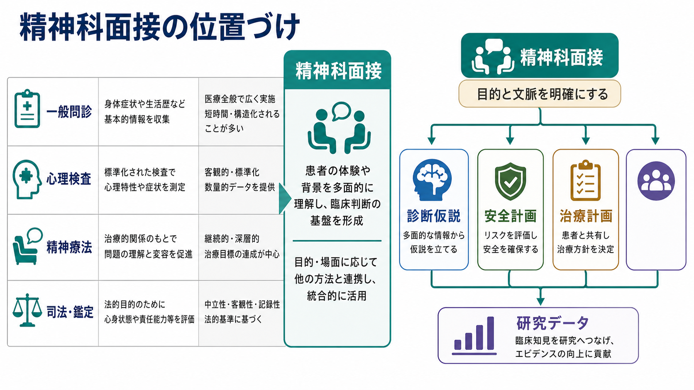

# 精神科面接とは何か

## 要点

- 精神科面接は、症状を聞くだけの問診ではなく、患者の語り・観察所見・精神状態診察・生活史・文化的背景・リスク評価を統合する臨床作業である。
- 面接の目的は、[[精神科診断は何のためにあるのか|診断]]、安全確保、治療計画、本人への説明、支援資源の調整を同時に進めることにある。
- よい面接では、情報収集と治療関係形成が分離されない。関係があるから情報が開かれ、情報が共有されるから関係が安定する。
- 精神科面接は、教育・研究・臨床の基盤になるが、個別の診断や治療指示は、本人の状態と文脈を評価する専門家の判断を要する。

## この記事で答える問い

1. 精神科面接は、一般の医学的問診と何が違うのか。
2. なぜ「情報収集」と「治療関係形成」を同時に行う必要があるのか。
3. 面接で得られた情報は、診断・安全評価・治療計画にどうつながるのか。
4. 精神科面接にはどのような限界と誤解があるのか。

## まず結論

精神科面接とは、患者が「何に困っているか」を聞き取りながら、その困りごとがどのような症状、経過、生活上の障害、対人関係、身体状態、薬物・アルコール使用、文化的意味づけ、安全上のリスクと結びついているかを整理する実践である。APAの成人精神科評価ガイドラインは、初回評価で症状、トラウマ歴、治療歴、物質使用、自殺・他害リスク、文化的要因、身体健康、数量的評価、意思決定への本人参加、記録を扱うことを示している[1]。

ただし、面接はチェックリストの読み上げではない。精神科では、患者が語りにくい体験、恥、恐怖、幻覚・妄想、希死念慮、家族関係、トラウマ、薬物使用、生活困窮などが話題になりうる。そのため、プライバシー、説明、守秘の限界、本人のペース、質問の順序、非言語的観察が、情報の質そのものを左右する[2]。精神科面接の特徴は、関係を作ることが「感じのよさ」ではなく、評価の精度と安全に関わる点にある。

## 背景

[[精神医学とは何か|精神医学]]は、症状だけでなく、主観的体験、行動、認知、感情、身体、生活史、社会的環境を扱う。血液検査や画像検査だけで多くの精神疾患を確定できるわけではないため、面接は診断と治療の中心的な情報源になる。一方で、面接だけに依存すればよいわけでもない。必要に応じて身体診察、検査、家族や支援者からの情報、心理検査、経過観察を組み合わせる。

精神科面接が難しいのは、聞き取る対象が「症状名」ではなく「その人の経験のまとまり」だからである。例えば「眠れない」という訴えでも、うつ病、不安、躁状態、PTSD、物質使用、身体疾患、薬剤、生活リズム、家庭や職場のストレスなど、複数の経路がありうる。これは[[生物心理社会モデルとは何か|生物心理社会モデル]]の考え方と接続する。

## 基本概念

### 情報収集

精神科面接で集める情報には、主訴、現病歴、既往歴、家族歴、発達歴、生活史、対人関係、職業・学業、物質使用、身体疾患、服薬、トラウマ、文化的背景、支援資源が含まれる。APAガイドラインは、症状と治療歴だけでなく、文化的要因、身体健康、数量的評価、本人を含めた意思決定も評価項目として扱う[1]。

ここでいう情報収集は、患者を一方的に分類する作業ではない。本人が何を問題と呼び、何を恐れ、何を支援とみなし、どの説明なら納得できるかを聞く作業でもある。文化的定式化面接は、本人や周囲が問題をどう意味づけ、どのような支援を期待しているかを把握するための補助線になる[7]。

### 精神状態診察

精神状態診察は、面接の中で行う「こころの診察」である。外見、態度、意識、注意、発語、気分、感情、思考過程、思考内容、知覚、認知、洞察、判断などを観察・質問によって評価する[3][4]。身体診察が現在の身体状態をみるように、精神状態診察は現在の心理・行動・認知機能の状態をみる。

重要なのは、精神状態診察が単なる印象ではないことである。例えば「落ち着きがない」と書くだけでは不十分で、発語の速度、姿勢、視線、注意の保ち方、話題の飛躍、睡眠、薬物使用、せん妄や神経疾患の可能性などと結びつけて記述する必要がある。

### 治療関係

治療関係は、面接の副産物ではなく、面接を成立させる条件である。Bordinは作業同盟を、目標への合意、課題への合意、情緒的な結びつきから成るものとして整理した[8]。その後のメタ分析でも、治療同盟は心理療法の転帰と一貫して関連することが示されている[5]。

精神科面接における治療関係は、「優しくする」ことだけではない。守秘の範囲を説明する、リスクがあるときは安全を優先する、本人の言葉を尊重しつつ必要な質問を避けない、診断仮説を断定しすぎず共有する、これらを含む専門的な関係である。

## 仕組み

精神科面接は、次の循環として理解しやすい。

1. 患者の語りを聴く。
2. 表情、姿勢、発語、注意、感情の変化を観察する。
3. 開かれた質問と焦点化した質問を使い分ける。
4. 精神状態診察として記述する。
5. 自殺、他害、虐待、セルフネグレクト、身体疾患、物質使用などのリスクを評価する。
6. 診断仮説と治療方針を、本人に理解できる言葉で共有する。

この循環では、質問の順序も臨床的意味を持つ。いきなり侵襲的な質問をすれば、患者は防衛的になり、情報は閉じる。逆に安全評価を避ければ、希死念慮や暴力リスク、虐待、重い身体疾患を見落とす。したがって面接者は、関係を保ちながら必要な情報へ進む。APAガイドラインも、自殺リスク評価では現在の考え、計画、意図、手段へのアクセス、過去の行動、保護因子、治療同盟などを確認することを求めている[1]。

共感的なコミュニケーションは、単なる態度の問題ではない。医療面接全般を対象にしたシステマティックレビューでは、共感や肯定的なコミュニケーション介入が、痛み、不安、満足度などに小さいながら有益な効果を示した[6]。精神科面接では、この効果はさらに重要になりやすい。語りにくい情報ほど、関係の質に左右されるからである。

## 図解

精神科面接は、一般問診、心理検査、精神療法、司法・鑑定面接と重なる部分を持つが、同一ではない。一般問診より主観的体験と生活文脈を深く扱い、心理検査より相互的で柔軟であり、精神療法より評価と安全確認の比重が高い。司法・鑑定面接とは異なり、通常の臨床面接では治療と支援が主要な目的になる。

## 臨床・研究との接続

臨床では、精神科面接は[[操作的診断とは何か|操作的診断]]や[[DSMとICDは何が違うのか|DSM/ICD]]の基準に情報を対応させる入口になる。しかし、診断基準は面接を置き換えない。基準を満たすかどうかを考えるには、症状の持続、重症度、機能障害、除外診断、身体疾患、物質使用、文化的背景、本人の意味づけを理解する必要がある。

研究では、面接は評価尺度、構造化面接、診断一致率、治療反応、治療同盟研究の基盤になる。構造化面接は信頼性を高める一方、臨床現場では患者の語りの流れ、緊急性、関係形成を無視できない。したがって、研究では標準化、臨床では文脈化が強調されるが、両者は対立しない。標準化された評価を使いつつ、その人の生活文脈に戻して考えることが重要である。

## よくある誤解

### 誤解1: 精神科面接は、症状を聞いて診断名を決めるだけである

診断名は重要だが、それだけでは治療方針は決まらない。同じ診断でも、発症経過、併存症、家族関係、身体疾患、薬物使用、職場や学校の状況、本人の希望によって支援は変わる。これは[[併存症とは何か]]や[[精神疾患とは何か]]の理解とも関係する。

### 誤解2: 共感的に聞くことと、医学的に評価することは対立する

共感と評価は対立しない。むしろ、患者が安心して語れるほど、症状、危険因子、保護因子、治療希望を把握しやすくなる。ただし、共感は同意や迎合ではない。危険がある場合には、安全確保を優先して介入する。

### 誤解3: 面接者の印象は主観的なので役に立たない

未整理の印象は危ういが、観察を具体的に記述すれば臨床情報になる。精神状態診察は、面接中の言動を、外見、発語、気分、思考、知覚、認知、洞察、判断などの項目として整理する方法である[3][4]。

### 誤解4: 文化的背景は特殊なケースだけで必要になる

文化は国籍や民族だけではない。家族観、宗教、ジェンダー、職場文化、地域、医療不信、言語、世代差、病気の説明モデルが含まれる。文化的定式化面接は、本人の問題理解、支援資源、治療期待を確認するための道具であり、診断の代替ではなく補助である[7]。

## 関連ノート

既存ノート:

- [[精神医学とは何か]]
- [[精神疾患とは何か]]
- [[精神科診断は何のためにあるのか]]
- [[操作的診断とは何か]]
- [[DSMとICDは何が違うのか]]
- [[生物心理社会モデルとは何か]]
- [[併存症とは何か]]
- [[正常と異常はどこで分けられるのか]]

今後の作成候補:

- ケースフォーミュレーションとは何か
- 精神状態診察とは何か
- 治療同盟とは何か
- 自殺リスク評価とは何か
- 文化的定式化面接とは何か
- 構造化面接と半構造化面接は何が違うのか

MOC更新候補:

- `content/00_MOC/` 配下の精神医学、診断・面接、臨床実践関連 MOC
- 並列ジョブとの競合を避けるため、本タスクでは MOC 本体は更新しない。

## 理解チェック

1. 精神科面接で、情報収集と治療関係形成を分けて考えにくいのはなぜか。
2. 精神状態診察は、患者の「印象」とどのように違うのか。
3. 自殺リスク評価では、現在の希死念慮だけでなく何を確認する必要があるか。
4. 文化的背景を確認することは、なぜ診断や治療方針に関係するのか。
5. 精神科面接と心理検査、精神療法、司法・鑑定面接はどの点で重なり、どの点で異なるか。

## 未解決問題

- 初回面接の時間が限られる場面で、関係形成、安全評価、診断評価、共有意思決定をどう優先順位づけるか。
- 構造化された評価尺度と、患者の自由な語りを、どのように統合するのが最も有効か。
- オンライン診療やAI補助記録が、治療関係と情報の質にどのような影響を与えるか。
- 文化的定式化を、形式的な質問票ではなく実際の治療計画にどう結びつけるか。

## 参考文献

[1] American Psychiatric Association Work Group on Psychiatric Evaluation. (2016). *The American Psychiatric Association Practice Guidelines for the Psychiatric Evaluation of Adults, Third Edition*. American Psychiatric Association. https://www.swmbh.org/wp-content/uploads/Psychiatric-Evaluation-APA-Clinical-Practice-Guideline.pdf

[2] Griffin, J. B. Jr. (1990). An overview of the psychiatric system. In H. K. Walker, W. D. Hall, & J. W. Hurst (Eds.), *Clinical Methods: The History, Physical, and Laboratory Examinations* (3rd ed.). Butterworths. NCBI Bookshelf. https://www.ncbi.nlm.nih.gov/books/NBK311/

[3] Martin, D. C. (1990). The mental status examination. In H. K. Walker, W. D. Hall, & J. W. Hurst (Eds.), *Clinical Methods: The History, Physical, and Laboratory Examinations* (3rd ed.). Butterworths. NCBI Bookshelf. https://www.ncbi.nlm.nih.gov/books/NBK320/

[4] Voss, R. M., & Das, J. M. (2024). Mental Status Examination. *StatPearls*. NCBI Bookshelf. https://www.ncbi.nlm.nih.gov/sites/books/NBK546682/

[5] Flückiger, C., Del Re, A. C., Wampold, B. E., & Horvath, A. O. (2018). The alliance in adult psychotherapy: A meta-analytic synthesis. *Psychotherapy, 55*(4), 316-340. https://doi.org/10.1037/pst0000172

[6] Howick, J., Moscrop, A., Mebius, A., Fanshawe, T. R., Lewith, G., Bishop, F. L., Mistiaen, P., Roberts, N. W., Dieninytė, E., Hu, X. Y., Aveyard, P., & Onakpoya, I. J. (2018). Effects of empathic and positive communication in healthcare consultations: A systematic review and meta-analysis. *Journal of the Royal Society of Medicine, 111*(7), 240-252. https://doi.org/10.1177/0141076818769477

[7] American Psychiatric Association. (2022). *DSM-5-TR Cultural Formulation Interview*. https://www.psychiatry.org/File%20Library/Psychiatrists/Practice/DSM/DSM-5-TR/APA-DSM5TR-CulturalFormulationInterview.pdf

[8] Bordin, E. S. (1979). The generalizability of the psychoanalytic concept of the working alliance. *Psychotherapy: Theory, Research & Practice, 16*(3), 252-260. https://doi.org/10.1037/h0085885
