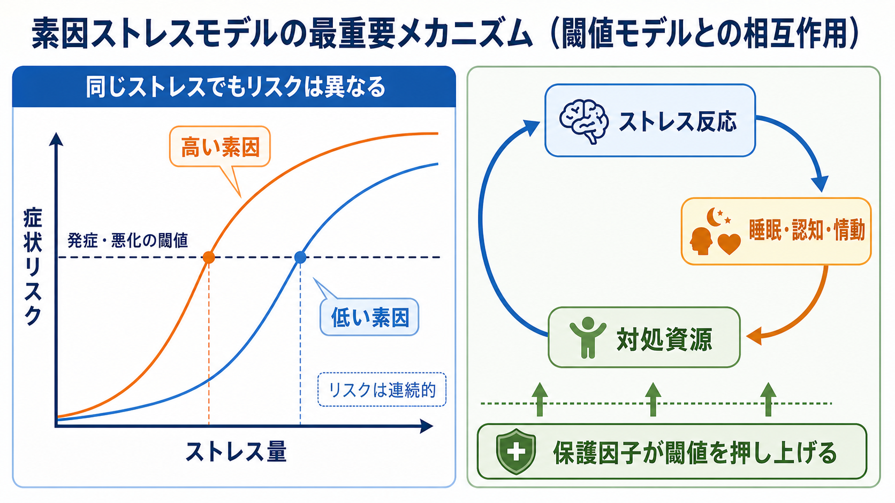
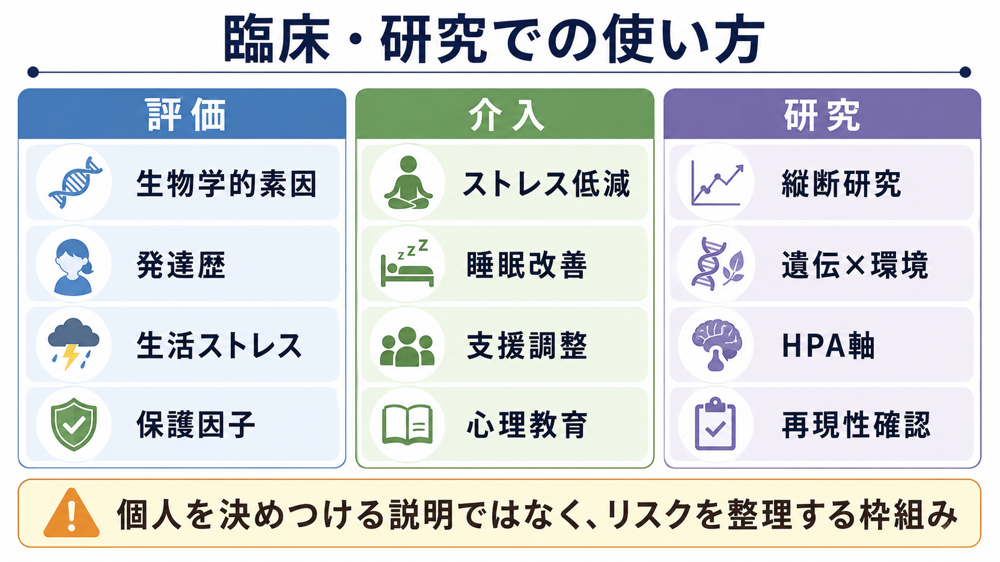

# 素因ストレスモデルとは何か

## 要点

- 素因ストレスモデルは、精神症状を「もともとの弱さ」だけでも「出来事ストレス」だけでもなく、両者の相互作用として理解する枠組みである。
- 素因には遺伝的リスク、神経発達、早期逆境、気質・性格、身体疾患、脳・内分泌系の感受性などが含まれる。
- ストレスには喪失、対人葛藤、過労、貧困、差別、トラウマ、睡眠不足、身体疾患などが含まれる。
- 同じストレスでも、背景にある素因と保護因子によって症状化しやすさは変わる。
- このモデルは説明の道具であり、個人を決めつける診断名や治療指示ではない。

## この記事で答える問い

1. 素因ストレスモデルは、精神症状の発生をどう説明するのか。
2. 「素因」と「ストレス」は何を指すのか。
3. 研究や臨床では、このモデルをどのように使い、どこに注意すべきか。

## まず結論

素因ストレスモデルとは、精神症状が「一定の素因をもつ人に、一定のストレスが加わったときに起こる」と考えるモデルである。ここで重要なのは、素因は運命ではなく、ストレスも単独の原因ではないという点である。リスクは連続的で、保護因子や支援、休息、治療、生活環境の調整によって変動する。

古典的には、Zubin と Spring が統合失調症を「持続的な脆弱性 trait」と「一時的なエピソード state」の関係として捉え、外的・内的な挑戦が個人の耐性閾値を超えるとエピソードが生じると説明した[1]。その後、うつ病、双極症、不安症、PTSD、精神病症状など、複数の精神医学領域で似た枠組みが用いられてきた。

## 背景

精神疾患の原因を一つに絞る説明は、直感的にはわかりやすい。しかし実際には、精神症状は遺伝、発達、神経回路、身体状態、生活史、対人関係、社会環境が重なって生じる。素因ストレスモデルは、この複雑さを「リスクを高める背景」と「引き金・負荷になる出来事」に分けて整理するための道具である。

生活ストレス研究では、うつ病の発症が大きな生活出来事と関連することが繰り返し示されてきた。たとえば女性双生児を対象にした Kendler らの研究では、ストレスフルな生活出来事は大うつ病エピソードの発症と時間的に関連し、とくに出来事発生月に関連が強かった[3]。一方で、同じ出来事を経験しても全員が同じ症状を示すわけではない。ここに素因、意味づけ、対処資源、支援の違いが入る。

## 基本概念

「素因」とは、症状が生じやすくなる背景条件である。遺伝的リスク、神経発達上の特徴、幼少期の逆境、気質、認知スタイル、睡眠の弱さ、身体疾患、物質使用、ホルモン・免疫・自律神経系の反応性などが含まれる。精神病症状の研究では、遺伝的リスクや発達要因がドパミン系の感作やストレス反応性と結びつく可能性が議論されている[6]。この点は [[ドパミンは報酬だけの物質なのか]] や [[HPA軸は精神疾患にどう関わるのか]] とも接続する。

「ストレス」とは、単に嫌な出来事という意味ではない。喪失、対人葛藤、過重労働、試験、出産、転居、経済的困難、孤立、差別、身体疾患、睡眠不足、薬物・アルコール、トラウマなど、心身の調整資源を使わせる負荷を指す。とくにトラウマや長期の逆境は、恐怖学習、身体覚醒、認知的予測、対人安全感に影響しうるため、[[PTSDでは恐怖記憶ネットワークに何が起きているのか]] とも関係する。

「保護因子」は、素因やストレスの影響を弱める条件である。安全な対人関係、社会的支援、十分な睡眠、身体疾患の管理、問題解決スキル、心理教育、アクセスしやすい医療、経済的・制度的支援などがある。保護因子は「本人の強さ」だけではなく、環境側の資源も含む。

## 仕組み

素因ストレスモデルは、しばしば閾値モデルとして説明される。素因が高い人では少ないストレスでも症状リスクが上がりやすく、素因が低い人ではより大きなストレスが必要になる、という考え方である。ただし、実際の精神症状はオン・オフの単純なスイッチではなく、睡眠、認知、感情、身体覚醒、対人行動が相互に影響する連続的な過程である。

このモデルを数式的に書くなら、もっとも単純には次のような交互作用として表せる。

$$
\text{症状リスク} = \beta_0 + \beta_1 \text{素因} + \beta_2 \text{ストレス} + \beta_3(\text{素因} \times \text{ストレス}) + \epsilon
$$

ここで $\beta_3$ が正であれば、素因が高いほどストレスの影響が強くなる。ただし、精神医学研究では測定誤差、時間順序、交絡、逆因果が入りやすい。たとえば、うつ病のストレス感作や kindling 仮説では、初回エピソードでは大きな生活ストレスが重要でも、再発ではより小さなストレスや内因性の過程が関与する可能性が論じられている[7]。

神経生物学的には、ストレス反応は [[ノルアドレナリンは覚醒とストレスにどう関わるのか]]、HPA 軸、免疫炎症、睡眠、報酬系、認知制御などに影響する。統合失調症の神経素因ストレスモデルでは、HPA 軸によるコルチゾール反応がドパミン系を増強し、もともとの脆弱性と組み合わさって症状悪化を説明する仮説が提示された[5]。この説明は確定した単一路線ではないが、心理社会的ストレスと脳内機構を結ぶ発想として重要である。

## 図解

素因ストレスモデルを読むときは、次の 4 層に分けると理解しやすい。

| 層 | 例 | 見るポイント |
|---|---|---|
| 素因 | 遺伝、神経発達、気質、早期逆境 | 変えにくい要因だけでなく、評価・支援に使える背景情報として扱う |
| ストレス | 喪失、対人葛藤、過労、睡眠不足、トラウマ | 出来事の有無だけでなく、本人にとっての意味と持続時間を見る |
| 反応 | 不眠、過覚醒、抑うつ、不安、思考の混乱 | 症状名の前に、どの調整系が崩れているかを考える |
| 保護因子 | 支援、休息、治療、生活調整、制度的資源 | 個人の努力に閉じず、環境側の変更可能性を探す |

## 臨床・研究との接続

臨床では、素因ストレスモデルは「なぜ今この不調が起きたのか」を一緒に整理する面接の地図になる。診断名だけでは見えにくい、睡眠不足、対人負荷、発達特性、身体疾患、孤立、薬物使用、支援不足などを同じ図の上に置けるからである。ただし、個別の診断や治療方針は専門家による評価に基づく必要があり、このノートは教育・研究目的の整理に留まる。

研究では、素因ストレスモデルは縦断研究、双生児研究、遺伝子×環境相互作用、神経画像、内分泌指標、臨床高リスク研究に接続する。たとえば Caspi らは、5-HTT 遺伝子多型が生活ストレスとうつ病の関連を修飾する可能性を報告した[4]。しかし、その後の大規模メタ分析では、5-HTTLPR 単独または生活ストレスとの交互作用がうつ病リスクを高める明確な証拠は得られなかった[8]。この経緯は、素因ストレスモデル全体を否定するものではなく、「単一候補遺伝子で大きな交互作用を説明する」研究の限界を示している。

現代的には、単一の素因を探すよりも、多遺伝子リスク、発達歴、社会環境、神経回路、内分泌・免疫、認知行動パターンを多層的に扱う必要がある。[[RDoCは精神疾患研究をどう変えたのか]] は、診断カテゴリだけでなく、認知、報酬、脅威、覚醒調整などの次元から精神疾患を研究する発想と接続する。

## よくある誤解

**誤解 1: 素因がある人は必ず発症する。**  
素因は確率を変える条件であり、運命ではない。保護因子や環境調整によってリスクは変わる。

**誤解 2: ストレスだけが原因である。**  
ストレスは重要だが、同じ出来事でも影響は人によって違う。素因、支援、文脈、身体状態、過去の経験が関与する。

**誤解 3: 本人が弱いから症状が出る。**  
モデルの「脆弱性」は道徳的評価ではない。生物学的・発達的・社会的な感受性を説明する研究用語であり、責任追及の言葉ではない。

**誤解 4: 遺伝子がすべてを決める。**  
精神疾患の多くは多数の遺伝要因と環境要因が小さく重なる。候補遺伝子研究の一部は再現性に課題があり、単純な「うつ病遺伝子」のような説明は避けるべきである[8]。

## 関連ノート

- [[HPA軸は精神疾患にどう関わるのか]]
- [[ノルアドレナリンは覚醒とストレスにどう関わるのか]]
- [[ドパミンは報酬だけの物質なのか]]
- [[セロトニンは気分だけに関わるのか]]
- [[PTSDでは恐怖記憶ネットワークに何が起きているのか]]
- [[RDoCは精神疾患研究をどう変えたのか]]
- [[シナプス可塑性とは何か]]

MOC 更新候補: [[MOC｜精神医学]], [[MOC｜神経科学と精神疾患]], [[MOC｜臨床実践・治療]]

## 理解チェック

1. 素因ストレスモデルでいう「素因」は、遺伝だけを意味するか。
2. 同じストレスを受けても症状化のしやすさが違うのはなぜか。
3. 候補遺伝子×生活ストレス研究から、どのような研究上の注意点が見えるか。
4. 臨床面接でこのモデルを使うとき、本人の責任追及にならないためには何に注意すべきか。

## 参考文献

[1] Zubin, J., & Spring, B. (1977). Vulnerability: A new view of schizophrenia. *Journal of Abnormal Psychology, 86*(2), 103-126. https://doi.org/10.1037/0021-843X.86.2.103

[2] Monroe, S. M., & Simons, A. D. (1991). Diathesis-stress theories in the context of life stress research: Implications for the depressive disorders. *Psychological Bulletin, 110*(3), 406-425. https://doi.org/10.1037/0033-2909.110.3.406

[3] Kendler, K. S., Karkowski, L. M., & Prescott, C. A. (1998). Stressful life events and major depression: Risk period, long-term contextual threat, and diagnostic specificity. *The Journal of Nervous and Mental Disease, 186*(11), 661-669. https://doi.org/10.1097/00005053-199811000-00001

[4] Caspi, A., Sugden, K., Moffitt, T. E., Taylor, A., Craig, I. W., Harrington, H., McClay, J., Mill, J., Martin, J., Braithwaite, A., & Poulton, R. (2003). Influence of life stress on depression: Moderation by a polymorphism in the 5-HTT gene. *Science, 301*(5631), 386-389. https://doi.org/10.1126/science.1083968

[5] Walker, E. F., & Diforio, D. (1997). Schizophrenia: A neural diathesis-stress model. *Psychological Review, 104*(4), 667-685. https://doi.org/10.1037/0033-295X.104.4.667

[6] Howes, O. D., McCutcheon, R., Owen, M. J., & Murray, R. M. (2017). The role of genes, stress, and dopamine in the development of schizophrenia. *Biological Psychiatry, 81*(1), 9-20. https://doi.org/10.1016/j.biopsych.2016.07.014

[7] Monroe, S. M., & Harkness, K. L. (2005). Life stress, the "kindling" hypothesis, and the recurrence of depression: Considerations from a life stress perspective. *Psychological Review, 112*(2), 417-445. https://doi.org/10.1037/0033-295X.112.2.417

[8] Risch, N., Herrell, R., Lehner, T., Liang, K.-Y., Eaves, L., Hoh, J., Griem, A., Kovacs, M., Ott, J., & Merikangas, K. R. (2009). Interaction between the serotonin transporter gene (5-HTTLPR), stressful life events, and risk of depression: A meta-analysis. *JAMA, 301*(23), 2462-2471. https://doi.org/10.1001/jama.2009.878

## 未解決問題

- 多遺伝子リスク、早期逆境、現在の社会環境、神経内分泌指標をどのように統合すれば、個人を過度に分類せずに有用な予測へつなげられるか。
- 「ストレス」の測定を、出来事の数だけでなく、持続時間、主観的意味、社会的文脈、身体負荷まで含めてどう標準化するか。
- 保護因子を本人の努力に還元せず、制度・環境・対人ネットワークとしてどう評価するか。
