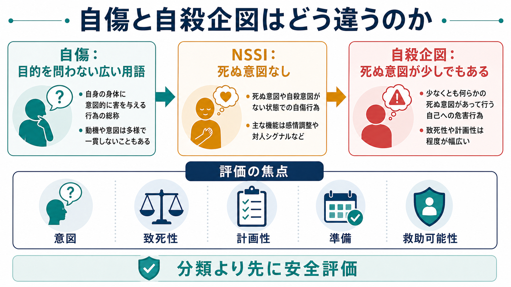
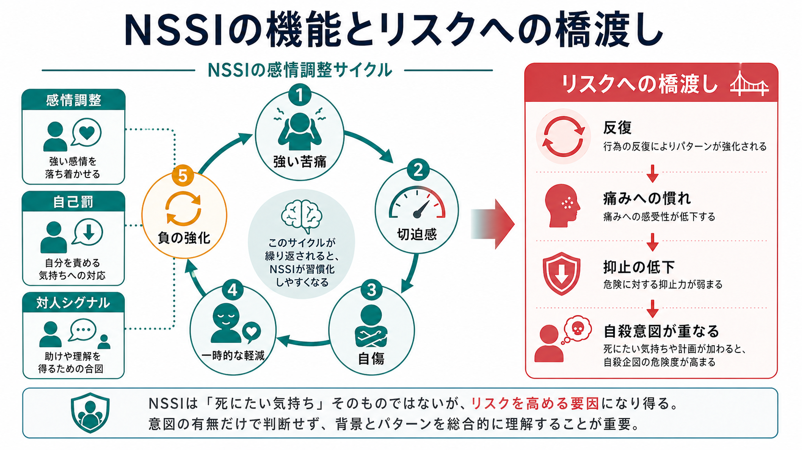
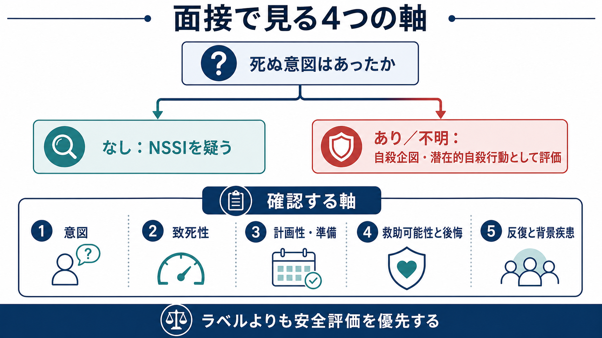

# 自傷と自殺企図はどう違うのか

## 要点

- **自傷**は「自分の身体を意図的に傷つける行為」を広く指す言葉で、NICE では目的にかかわらず意図的な自己中毒または自己損傷として扱う [1]。
- **NSSI（非自殺性自傷）**は、死ぬ意図がない自己損傷を指す。多くの場合、強い感情を下げる、自己罰を行う、他者に苦痛を伝えるなどの機能をもつ [4][5]。
- **自殺企図**は、少なくとも何らかの「死ぬ意図」を伴う自己危害行動である。実際に傷害が生じたかどうかだけでは決まらない [2][3]。
- ただし、NSSI は「安全な行為」ではない。NSSI の既往は、自殺念慮と並んで自殺企図と強く関連するため、意図の有無だけで終わらせず、反復、致死性、計画性、準備、救助可能性を評価する [6]。

## この記事で答える問い

このノートでは、[[精神科面接とは何か]]や[[精神科初診で何を確認するべきか]]の文脈で出会う「自傷」と「自殺企図」の区別を整理する。中心となる問いは三つである。

1. 自傷、NSSI、自殺企図は何が違うのか。
2. 死ぬ意図がない自傷を、なぜ自殺リスク評価に含める必要があるのか。
3. 面接では、ラベルより先に何を確認するべきか。

## まず結論

もっとも短く言えば、**区別の中心は「死ぬ意図があったか」である**。死ぬ意図がなければ NSSI、少しでも死ぬ意図があれば自殺企図として評価する。ただし、実際の面接では本人の語りが揺れたり、「死にたいわけではないが消えたい」「止めてほしかった」「どうなってもよかった」と表現されたりする。このため、意図は単純な yes/no ではなく、行為前後の思考、計画、準備、致死性、救助可能性、後悔、反復歴から推定する必要がある [2][3]。

臨床上の落とし穴は、NSSI を「死ぬつもりがないから軽い」と扱うことである。NSSI はしばしば苦痛を短時間だけ下げる機能をもち、その反復によって行動パターンが固定化することがある [4][5]。さらに、NSSI の既往は自殺企図と頑健に関連する [6]。したがって、分類は重要だが、分類よりも先に「いま安全か」「次に同じことが起きる条件は何か」「支援につなげるべき可変因子は何か」を見る。

## 背景

日常語では「リストカット」「自傷」「自殺未遂」が混同されやすい。しかし研究と臨床では、この混同が評価を不安定にする。自殺企図ではない自傷をすべて自殺企図と呼ぶと、本人の経験している機能が見えにくくなる。一方で、自殺意図が曖昧な行為を「ただの自傷」と片づけると、安全評価が過小になる。

CDC の自殺関連行動のサーベイランス定義は、自己指向性暴力を「自殺性」「非自殺性」「意図不明」などに分け、明示的または暗黙の自殺意図を重視する [2]。C-CASA も、自殺企図を「少なくともある程度の死ぬ意図を伴う、潜在的に自己損傷的な行動」と定義し、死ぬ意図のない自己損傷と区別する [3]。つまり、分類の主軸は傷の大きさではなく、**行為が何を目的としていたか**である。

## 基本概念

### 自傷

自傷は広い用語である。NICE NG225 は self-harm を、見かけ上の目的にかかわらず、意図的な自己中毒または自己損傷として定義する [1]。この広い定義は、救急・初期対応・サービス設計では有用である。なぜなら、初期時点では意図が不明なことが多く、まず身体的安全と心理社会的評価を進める必要があるからである。

### NSSI

NSSI は nonsuicidal self-injury の略で、日本語では「非自殺性自傷」と呼ばれる。一般には、死ぬ意図なしに自分の身体組織を意図的に損傷する行為を指す [4][7]。DSM-5-TR では正式診断名というより、今後の研究対象となる状態、または臨床的注意の対象として扱われる [7]。

NSSI の機能としては、強い不安・怒り・空虚感を下げる、解離や麻痺した感覚から身体感覚を取り戻す、自己罰を行う、他者に苦痛を伝える、対人状況を変えるなどが報告されている [4][5]。ここで重要なのは、NSSI が「注目を集めるため」という単一の説明に還元できないことである。

### 自殺企図

自殺企図は、少なくとも何らかの死ぬ意図を伴う自己危害行動である [3]。結果として命に関わる傷害が生じたか、医学的処置が必要だったかだけで決まるわけではない。低致死性の行為でも死ぬ意図があれば自殺企図になりうるし、外傷が比較的目立っても死ぬ意図がなければ NSSI として理解されることがある。

ただし、「死ぬ意図があったか」は本人の言葉だけで確定できない。恥、混乱、記憶の曖昧さ、家族や医療者への配慮、入院回避の希望などによって語りは変わる。C-CASA は、明示的な意図だけでなく、方法、状況、準備、過去歴などから意図を推定する必要があるとする [3]。

## 仕組み

NSSI の代表的な説明は、行為が短期的な感情調整として働くというものである。強い苦痛が高まると、本人にとっては自傷が「今すぐ感情を下げる手段」として選ばれやすくなる。行為後に苦痛が一時的に軽くなると、その軽減自体が負の強化となり、次の苦痛場面でも同じ行動が選ばれやすくなる [4][5]。

この仕組みは、[[生物心理社会モデルとは何か]]のように複数水準で見ると理解しやすい。心理的には感情調整、自己罰、対人シグナルが関与する。社会的には孤立、家庭・学校・職場での葛藤、支援資源の乏しさが影響する。医学的には抑うつ、不安、PTSD、摂食障害、物質使用、境界性パーソナリティ特性などが背景にある場合がある [7]。

NSSI と自殺企図が異なる行為であっても、連続性がまったくないわけではない。Klonsky らの 4 標本研究では、NSSI は自殺念慮に次いで自殺企図と強く関連し、既知のリスク因子を同時に入れても NSSI と自殺念慮が有意に残った [6]。解釈として、反復する自己損傷が痛みや恐怖への慣れ、自己危害行動への心理的障壁の低下と結びつく可能性がある。ただし、これは「NSSI が必ず自殺企図へ進む」という意味ではない。リスクを過小評価しないための観察点である。

## 図解

面接では、最初にラベルを決めようとしすぎるよりも、以下の軸を順に確認すると整理しやすい。

| 評価軸 | 見ること | 区別への意味 |
|---|---|---|
| 意図 | 死にたかったか、死んでもよいと思ったか、痛みを下げたかったのか | NSSI と自殺企図の中心軸 |
| 致死性 | 方法、量、部位、医学的危険性 | 意図が否定されても危険性を別に評価する |
| 計画性・準備 | 方法の準備、場所の選択、遺書、身辺整理 | 自殺性を推定する手がかり |
| 救助可能性 | 人に見つかる場所か、連絡したか、発見を避けたか | 死ぬ意図や両価性を推定する |
| 行為後の反応 | 安堵、後悔、恐怖、再企図の考え | 次のリスクと支援ニーズを考える |
| 反復と背景 | 過去の自傷、自殺企図、精神疾患、物質使用、孤立 | 短期・長期リスクの定式化に使う |

## 臨床・研究との接続

NICE は、自傷後には心理社会的評価を早期に行い、その人にとっての自傷の機能、強み、脆弱性、現在の変化要因、将来の出来事、保護因子を探索することを推奨している [1]。また、リスク評価尺度を用いて将来の自殺や自傷反復を予測したり、低・中・高のグローバルなリスク分類だけで処遇を決めたりしないよう勧めている [1]。これは、[[精神科診断は何のためにあるのか]]にも関わる。診断名やリスクラベルは、支援の入口であって、本人の安全と生活文脈の理解を置き換えるものではない。

研究では、NSSI を単一の「症状」と見るより、機能を測定することで理解が進む。Nock と Prinstein の機能モデルは、自傷が自動的強化と社会的強化の両方で維持されうることを示した [5]。その後のレビューも、NSSI は感情調整だけでなく、対人機能や自己評価の問題と結びつくことを整理している [4][8]。

臨床的には、次のように分けて考えるとよい。

- **分類**: NSSI か、自殺企図か、意図不明の自己危害か。
- **機能**: 何を下げ、何を伝え、何を避け、何を得ようとしていたのか。
- **危険性**: 今回の医学的危険性と、次回に危険性が高まる条件は何か。
- **文脈**: 生活上の危機、対人関係、背景疾患、支援資源、保護因子は何か。
- **協働**: [[心理教育とは何か]]の視点から、本人を責めずに、行為の機能と代替手段を一緒に言語化できるか。

## よくある誤解

### 誤解1: 「死ぬ気がないなら危険ではない」

NSSI は自殺企図と区別されるが、自殺リスクと無関係ではない。NSSI の既往は自殺企図と強く関連するため、死ぬ意図がないと語られた場合でも、反復、苦痛の強さ、方法の変化、物質使用、孤立、支援拒否、将来への絶望を確認する必要がある [6][7]。

### 誤解2: 「傷が浅いなら自殺企図ではない」

自殺企図かどうかは、傷の深さだけで決まらない。低致死性の方法でも死ぬ意図があれば自殺企図であり、逆に目立つ損傷でも死ぬ意図がなければ NSSI として理解されることがある [3]。ただし、医学的危険性は意図とは別に評価する。

### 誤解3: 「自傷は人を操作するための行為である」

対人機能が含まれる場合はあるが、それを「操作」と呼ぶと、本人の苦痛や支援ニーズを見落としやすい。NSSI は、感情調整、自己罰、解離への対処、対人シグナルなど複数の機能をもつ [4][5]。[[共感的理解とは何か]]の観点では、行為の是非をただちに評価する前に、「その行為が何をしてくれていたのか」を理解することが重要である。

### 誤解4: 「NSSI と自殺企図は完全に別物である」

概念上は区別する。しかし、同じ人の中で時期によって意図が変わることがあり、同じ行為に「死にたい気持ち」と「楽になりたい気持ち」が混ざることもある。したがって、毎回のエピソードを個別に評価する [1]。

## 関連ノート

- [[精神科面接とは何か]]
- [[精神科初診で何を確認するべきか]]
- [[精神科診断は何のためにあるのか]]
- [[精神疾患とは何か]]
- [[生物心理社会モデルとは何か]]
- [[心理教育とは何か]]
- [[共感的理解とは何か]]
- [[精神医学における回復とは何か]]

### MOC更新候補

- `content/00_MOC/` 配下の精神医学、面接、リスク評価に関する MOC があれば、統合ジョブで本記事へのリンクを追加する。
- 並列実行時の衝突回避のため、本ジョブでは MOC 本体は更新しない。

## 理解チェック

1. NSSI と自殺企図を分ける中心的な評価軸は何か。
2. 「死ぬ意図なし」と語られた場合でも、自殺リスク評価に含めるべき情報は何か。
3. 自傷の機能を聞くことは、なぜ責任追及ではなく安全評価に役立つのか。
4. リスク尺度の点数だけで「低リスク」と判断してはいけない理由は何か。

## 未解決問題

- NSSI から自殺企図へ移行しやすい条件を、個人単位でどこまで予測できるか。
- 自殺意図が曖昧な自己危害を、研究・臨床・家族支援の場でどのように一貫して記録するか。
- 反復する NSSI に対して、危険を過小評価せず、同時に本人を過度に管理しすぎない支援をどう設計するか。

## 参考文献

[1] National Institute for Health and Care Excellence. (2022). *Self-harm: assessment, management and preventing recurrence* (NICE Guideline NG225). https://www.nice.org.uk/guidance/ng225

[2] Crosby, A. E., Ortega, L., & Melanson, C. (2011). *Self-Directed Violence Surveillance: Uniform Definitions and Recommended Data Elements, Version 1.0*. Centers for Disease Control and Prevention. https://stacks.cdc.gov/view/cdc/11997

[3] Posner, K., Oquendo, M. A., Gould, M., Stanley, B., & Davies, M. (2007). Columbia Classification Algorithm of Suicide Assessment (C-CASA): Classification of suicidal events in the FDA's pediatric suicidal risk analysis of antidepressants. *American Journal of Psychiatry, 164*(7), 1035-1043. https://doi.org/10.1176/ajp.2007.164.7.1035

[4] Nock, M. K. (2010). Self-injury. *Annual Review of Clinical Psychology, 6*, 339-363. https://doi.org/10.1146/annurev.clinpsy.121208.131258

[5] Nock, M. K., & Prinstein, M. J. (2004). A functional approach to the assessment of self-mutilative behavior. *Journal of Consulting and Clinical Psychology, 72*(5), 885-890. https://doi.org/10.1037/0022-006X.72.5.885

[6] Klonsky, E. D., May, A. M., & Glenn, C. R. (2013). The relationship between nonsuicidal self-injury and attempted suicide: Converging evidence from four samples. *Journal of Abnormal Psychology, 122*(1), 231-237. https://doi.org/10.1037/a0030278

[7] Merck Manual Professional Edition. (2026). *Nonsuicidal Self-Injury*. https://www.merckmanuals.com/professional/psychiatric-disorders/anxiety-and-trauma-and-stressor-related-disorders/nonsuicidal-self-injury

[8] Klonsky, E. D., Victor, S. E., & Saffer, B. Y. (2014). Nonsuicidal self-injury: What we know, and what we need to know. *Canadian Journal of Psychiatry, 59*(11), 565-568. https://doi.org/10.1177/070674371405901101
